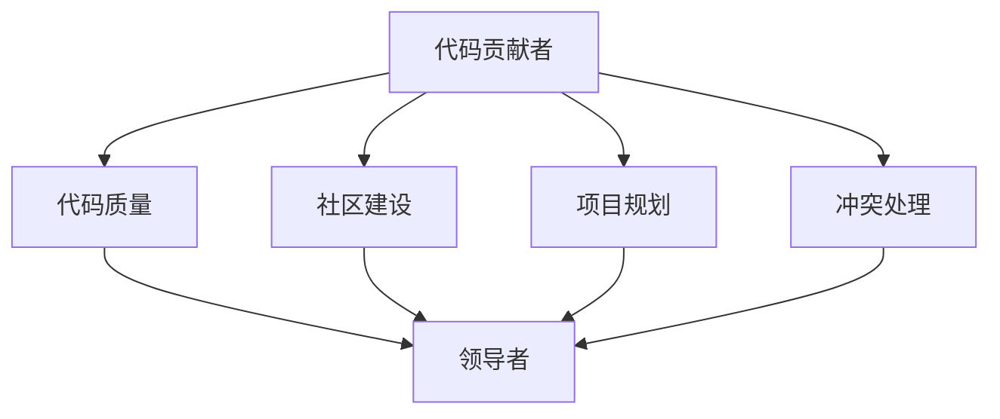

                 

# 从代码贡献者到开源项目领导者

## 1. 背景介绍

作为一名代码贡献者，你在开源社区中可能已有所作为，你曾解决过某个技术难题，或者分享过自己的代码。但是，如果你想要更进一步，成为一名开源项目领导者，那么你需要提升你的领导能力、组织能力和技术深度。这篇文章将介绍从代码贡献者成长为开源项目领导者的路径，包括如何管理代码、构建社区、规划项目以及如何处理各种挑战。

## 2. 核心概念与联系

### 2.1 核心概念概述

- **代码贡献者**：在开源项目中，你负责编写代码、修复Bug或添加新特性。
- **开源项目领导者**：负责项目的方向、规划、人员管理和技术决策。
- **代码质量**：确保代码质量是保证项目成功的基础，领导者需要确保代码遵循最佳实践，并指导贡献者遵循这些标准。
- **社区建设**：领导者需要构建一个积极、包容的社区，激励贡献者，培养新成员。
- **项目规划**：领导者需要明确项目目标，制定路线图和时间表，确保项目顺利进行。
- **冲突处理**：在项目中，可能会出现意见分歧，领导者需要有效地处理这些冲突，保持团队的和谐与高效。

这些概念通过以下Mermaid流程图连接起来：



## 3. 核心算法原理 & 具体操作步骤
### 3.1 算法原理概述

开源项目领导者的主要职责是指导和管理团队，确保项目朝正确方向前进。这包括选择正确的技术栈、设定清晰的目标、分配任务、协调资源以及解决冲突。

### 3.2 算法步骤详解

1. **明确项目目标**：
   - 领导者需要清晰地定义项目的目标和愿景。这包括项目的范围、预期的成果以及社区成员的期望。
   - 使用SMART（Specific, Measurable, Achievable, Relevant, Time-bound）原则来设定目标。

2. **制定计划和路线图**：
   - 领导者需要创建详细的项目计划和路线图，确保所有贡献者都了解项目的时间表和目标。
   - 利用敏捷方法，如Scrum或Kanban，来管理和跟踪任务进度。

3. **分配任务和资源**：
   - 根据成员的技能和兴趣分配任务，确保每个人都有明确的角色和责任。
   - 合理分配资源，如时间、资金和硬件，确保项目的顺利进行。

4. **构建积极社区**：
   - 领导者需要建立并维护一个积极的社区氛围。这包括欢迎新成员、解决冲突和鼓励贡献。
   - 定期组织会议、培训和工作坊，促进知识和技能的共享。

5. **处理冲突和决策**：
   - 当出现意见分歧时，领导者需要中立地评估所有观点，寻找最佳解决方案。
   - 在做出决策时，领导者需要权衡短期和长期利益，确保项目能够持续发展。

### 3.3 算法优缺点

**优点**：
- 领导者可以确保项目有明确的方向和目标。
- 领导者能够协调资源，确保项目的顺利进行。
- 领导者可以构建一个积极、包容的社区。

**缺点**：
- 领导者需要投入大量时间管理项目。
- 领导者可能会面临来自不同团队成员的意见分歧。
- 领导者需要具备处理冲突和决策的能力。

### 3.4 算法应用领域

开源项目领导者的角色适用于各种类型的开源项目，包括但不限于软件开发、数据科学、人工智能、游戏开发和设计。

## 4. 数学模型和公式 & 详细讲解 & 举例说明

### 4.1 数学模型构建

在数学上，我们可以将项目成功建模为一个多目标优化问题。设 $C$ 为贡献者集合，$A$ 为可用的时间资源，$G$ 为项目的目标集。目标函数为：

$$
\min_{\theta} \sum_{i \in C} \max_{a \in A} \left( \text{time}_{i}(a) \cdot \text{efficiency}_{i} + \text{quality}_{i} \cdot \text{efficiency}_{i} + \sum_{g \in G} \text{cost}_{i,g} \cdot \text{efficiency}_{i} \right)
$$

其中 $\theta$ 表示领导者的决策变量，$\text{time}_{i}(a)$ 表示贡献者 $i$ 在时间资源 $a$ 上的工作量，$\text{quality}_{i}$ 表示贡献者 $i$ 的代码质量，$\text{cost}_{i,g}$ 表示贡献者 $i$ 对项目目标 $g$ 的贡献成本。

### 4.2 公式推导过程

为了求解上述优化问题，我们需要利用线性规划和混合整数规划等数学工具。

设 $x_{i,a}$ 为贡献者 $i$ 在时间资源 $a$ 上的工作量，$y_{i,g}$ 为贡献者 $i$ 对项目目标 $g$ 的贡献。则目标函数可表示为：

$$
\min_{x, y} \sum_{i \in C} \max_{a \in A} \left( x_{i,a} \cdot \text{efficiency}_{i} + \sum_{g \in G} y_{i,g} \cdot \text{efficiency}_{i} \right)
$$

约束条件包括：
- 工作量约束：$\sum_{a \in A} x_{i,a} = 1$，即每个贡献者只工作一次。
- 时间资源约束：$\sum_{i \in C} x_{i,a} \leq C_a$，即每个时间资源可用一次。
- 目标贡献约束：$\sum_{i \in C} y_{i,g} = 1$，即每个项目目标至少有一个贡献者完成。

通过求解上述优化问题，可以找到最优的决策变量，确保项目目标的最大化。

### 4.3 案例分析与讲解

假设我们有一个开源项目，目标是开发一个Web应用。贡献者包括UI设计师、后端开发者和测试人员。项目目标是功能完备、性能卓越和易用性高。领导者需要分配时间资源，并确保每个目标都有适当的贡献。

**案例解答**：
- UI设计师在3个月内完成设计工作，贡献 $\text{time}_{UI}=3$，$\text{quality}_{UI}=1$，$\text{cost}_{UI,g}=\begin{cases} 1 & g=\text{功能} \\ 0.5 & g=\text{性能} \\ 0.5 & g=\text{易用性} \end{cases}$。
- 后端开发者在6个月内完成开发工作，贡献 $\text{time}_{后端}=6$，$\text{quality}_{后端}=1$，$\text{cost}_{后端,g}=\begin{cases} 1 & g=\text{功能} \\ 1 & g=\text{性能} \\ 0.5 & g=\text{易用性} \end{cases}$。
- 测试人员在3个月内完成测试工作，贡献 $\text{time}_{测试}=3$，$\text{quality}_{测试}=1$，$\text{cost}_{测试,g}=\begin{cases} 0.5 & g=\text{功能} \\ 0.5 & g=\text{性能} \\ 1 & g=\text{易用性} \end{cases}$。

通过求解上述优化问题，可以找到最优的时间资源分配方案，确保项目顺利进行。

## 5. 项目实践：代码实例和详细解释说明

### 5.1 开发环境搭建

为了进行开源项目的管理和领导，你需要一个集成的开发环境，包括版本控制、持续集成和任务跟踪工具。以下是推荐的工具链：

- **版本控制**：Git，使用GitHub或GitLab进行代码托管。
- **持续集成**：Jenkins或GitHub Actions，自动构建和测试代码。
- **任务跟踪**：Trello或Jira，管理任务和进度。

### 5.2 源代码详细实现

以下是一个使用Trello进行任务管理的示例代码：

```python
import requests
import json

def create_card(list_id, card_name, card_description):
    """
    在Trello列表中创建卡片
    :param list_id: 列表ID
    :param card_name: 卡片名称
    :param card_description: 卡片描述
    :return: 卡片ID
    """
    token = 'YOUR_TRELLO_API_TOKEN'
    url = f'https://api.trello.com/1/lists/{list_id}/cards'
    headers = {'Authorization': f'Bearer {token}'}
    data = {
        'name': card_name,
        'description': card_description,
        'pos': 'bottom'
    }
    response = requests.post(url, headers=headers, json=data)
    if response.status_code == 200:
        return json.loads(response.text)['id']
    else:
        print('创建卡片失败')
        return None

# 创建任务卡片
card_id = create_card('LIST_ID', 'Task Name', 'Task Description')
print(f'创建卡片成功，ID为{card_id}')
```

### 5.3 代码解读与分析

这段代码演示了如何使用Trello API创建任务卡片。通过设置卡片的名称和描述，将其添加到指定的列表中。在实际使用中，可以根据任务的具体情况，灵活修改代码，实现更复杂的任务管理功能。

### 5.4 运行结果展示

运行上述代码后，应该能在Trello中成功创建任务卡片。如果成功，可以在Trello的相应列表中查看新创建的卡片。

## 6. 实际应用场景

### 6.1 公司内部开源项目

公司内部可以使用开源项目来提高开发效率和代码质量。领导者可以设定明确的项目目标，如提高代码可维护性、加速开发周期等，并分配任务给相应的团队成员。通过有效的管理，确保项目按时交付，达到预期效果。

### 6.2 开源社区合作项目

开源社区中的合作项目通常涉及多个组织和贡献者，领导者需要协调各方资源，确保项目顺利进行。领导者需要明确项目目标，制定详细的计划，并与所有利益相关者保持沟通，确保项目方向一致。

### 6.3 教育培训项目

教育培训机构可以开展开源项目，帮助学生学习团队协作和项目管理。领导者需要设定明确的目标，分配任务，并指导学生如何有效地管理代码和资源。通过这种方式，学生可以积累实际项目经验，提高团队协作能力。

## 7. 工具和资源推荐

### 7.1 学习资源推荐

- **书籍**：《The Pragmatic Programmer》《Clean Code》《Leading the Technical Project》
- **在线课程**：Coursera上的"Agile Project Management"课程，edX上的"Leadership and Management for Technology Professionals"课程
- **博客和论坛**：Medium上的开源项目管理系列文章，GitHub社区的"Getting Started"页面

### 7.2 开发工具推荐

- **版本控制**：Git，使用GitHub或GitLab进行代码托管
- **持续集成**：Jenkins或GitHub Actions
- **任务管理**：Trello或Jira
- **代码审查**：GitHub Pull Request，Gerrit

### 7.3 相关论文推荐

- "Mastering the Team: Strategies for High Performance Project Teams" by William Russell
- "Managing Open Source Projects" by Hossein Kazemi
- "Agile Management for Software Development" by Jeff Sutherland

## 8. 总结：未来发展趋势与挑战

### 8.1 研究成果总结

开源项目领导者的角色至关重要，对于项目成功起着决定性作用。领导者需要具备项目规划、团队管理和冲突处理等核心能力，并能够在复杂环境中做出正确的决策。

### 8.2 未来发展趋势

- **智能化管理**：未来开源项目管理将更加智能化，通过机器学习和数据分析，优化资源分配，提高项目效率。
- **自动化工具**：持续集成、自动化测试等工具将进一步发展，简化项目管理流程。
- **跨领域合作**：开源项目将涉及更多领域，领导者需要具备跨学科的知识和技能。

### 8.3 面临的挑战

- **资源分配**：如何合理分配资源，确保项目按时交付，是一个挑战。
- **团队管理**：管理多样化的团队，保持团队和谐和高效，是一个复杂的任务。
- **决策制定**：在复杂环境下做出正确的决策，需要领导者的智慧和经验。

### 8.4 研究展望

未来的研究需要探索如何更好地利用数据和算法，提升开源项目管理效率。同时，研究如何建立更加开放、包容的社区环境，鼓励更多贡献者参与，也将是一个重要方向。

## 9. 附录：常见问题与解答

**Q1: 如何成为一名开源项目领导者？**

A: 成为开源项目领导者需要具备以下能力：
- 项目管理：制定项目计划、分配任务、协调资源
- 沟通协调：与团队成员和利益相关者保持良好沟通
- 决策能力：在复杂环境中做出正确决策

**Q2: 如何处理团队中的意见分歧？**

A: 处理团队中的意见分歧，可以采用以下策略：
- 中立客观：领导者需要客观评估所有观点，不偏袒任何一方。
- 寻求共识：通过讨论和妥协，寻找各方都能接受的解决方案。
- 引导讨论：领导者需要引导讨论，确保讨论方向正确，避免陷入无休止的争论。

**Q3: 如何提高代码质量？**

A: 提高代码质量可以采取以下措施：
- 代码审查：通过代码审查发现和修复代码问题。
- 代码风格：使用统一的代码风格指南，确保代码一致性。
- 自动化测试：编写自动化测试，防止新代码引入Bug。

**Q4: 如何构建积极的社区氛围？**

A: 构建积极的社区氛围需要以下措施：
- 欢迎新成员：为新成员提供指导和支持。
- 解决问题：及时回应社区成员的问题，保持沟通畅通。
- 社区活动：组织线下和线上活动，促进成员互动。

**Q5: 如何选择适当的开源项目？**

A: 选择适当的开源项目需要考虑以下因素：
- 个人兴趣：选择自己感兴趣的项目，更容易保持热情。
- 项目需求：选择有实际需求的项目，更容易看到成果。
- 社区活跃度：选择活跃的社区，更容易获得支持和反馈。

---

作者：禅与计算机程序设计艺术 / Zen and the Art of Computer Programming

