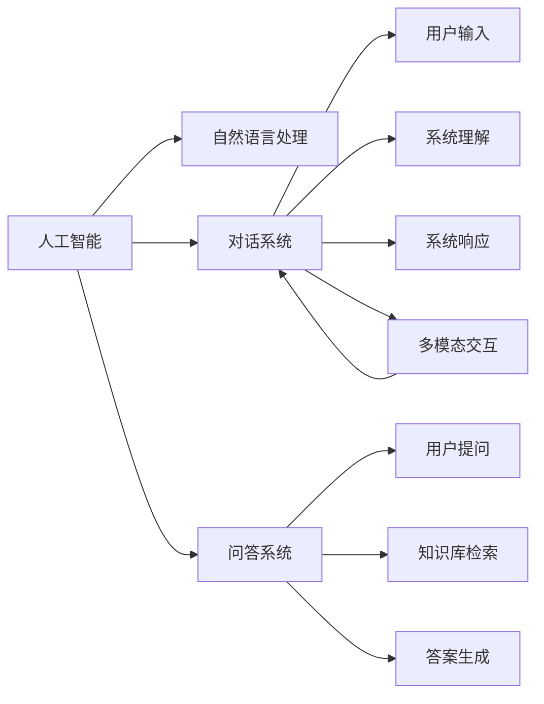

                 

# 从问答到对话：AI如何改变人机交互模式

> 关键词：人工智能,对话系统,问答系统,自然语言处理,多模态人机交互

## 1. 背景介绍

随着人工智能技术的快速发展，AI与人类的交互方式也正在经历着深刻的变革。从早期的基于规则的问答系统，到基于统计学习的问答系统，再到如今基于深度学习的对话系统，AI在与人类的交流中变得越来越智能。本文将探讨AI如何通过对话系统改变人机交互模式，从传统的问答模式演进到更为复杂的对话模式，并展望其未来发展趋势。

## 2. 核心概念与联系

### 2.1 核心概念概述

#### 人工智能与自然语言处理

人工智能（AI）是计算机科学的一个分支，致力于创建能够模拟人类智能行为的机器。自然语言处理（NLP）是AI的一个子领域，专注于让机器能够理解和生成人类语言。对话系统和问答系统是NLP中的两个重要应用方向，它们通过理解和回应自然语言，使得AI能够与人类进行更自然、更智能的交流。

#### 对话系统与问答系统

对话系统（Chatbot）是一种能够模拟人类对话的人工智能程序。对话系统旨在通过理解用户输入，生成合适的响应，从而实现与人类的自然对话。而问答系统（QA System）则是一种基于用户提问生成答案的系统，通常用于特定的知识获取任务。

#### 多模态人机交互

多模态人机交互（Multimodal Human-Computer Interaction, MHCI）是指结合文本、语音、图像、视频等多种信息源，以更加自然、高效的方式进行人机交互。多模态技术能够显著提高人机交互的直观性和便捷性，提升用户体验。

### 2.2 核心概念原理和架构的 Mermaid 流程图



## 3. 核心算法原理 & 具体操作步骤

### 3.1 算法原理概述

基于深度学习的对话系统和问答系统，本质上都是序列到序列（Sequence-to-Sequence, Seq2Seq）的模型架构。它们通过编码器将输入序列（如问题或对话历史）转换为上下文表示，再通过解码器生成相应的输出（如答案或对话响应）。

对话系统的核心算法包括：
- 序列到序列模型（Seq2Seq）：通过编码器将输入序列转换为上下文表示，再通过解码器生成响应。
- 注意力机制（Attention Mechanism）：帮助模型更加关注输入序列中的关键信息。
- 预训练技术（如BERT, GPT）：通过在大规模无标签数据上进行预训练，使模型能够更好地理解语言。

问答系统的核心算法包括：
- 检索式问答（Retrieval-based QA）：通过检索知识库中的文档，找到最相关的答案。
- 生成式问答（Generation-based QA）：通过训练模型直接生成答案，而不依赖于知识库。

### 3.2 算法步骤详解

#### 对话系统的训练与部署

对话系统的训练步骤包括：
1. 数据收集：收集对话数据集，包括对话历史和用户回复。
2. 数据预处理：清洗、标记、分词等预处理步骤，使得数据适合训练。
3. 模型训练：使用Seq2Seq模型，并结合注意力机制进行训练。
4. 系统部署：将训练好的模型部署到服务器上，并集成多模态交互技术，实现自然、流畅的对话。

#### 问答系统的训练与部署

问答系统的训练步骤包括：
1. 知识库构建：构建或选择包含相关信息的知识库。
2. 数据收集：收集标注好的问答对，构建训练数据集。
3. 模型训练：使用检索式或生成式问答模型进行训练。
4. 系统部署：将训练好的模型部署到服务器上，并集成问答接口，实现问答功能。

### 3.3 算法优缺点

#### 对话系统的优点与缺点

优点：
1. 自然流畅：对话系统能够以自然的方式与用户交流，提升用户体验。
2. 适应性强：能够适应各种语言、文化和背景的用户，具有广泛的应用场景。
3. 动态交互：能够根据上下文信息动态生成响应，提供个性化服务。

缺点：
1. 复杂度高：对话系统的复杂度较高，模型训练和调优较为困难。
2. 可解释性差：对话系统的内部工作机制复杂，难以解释其决策过程。
3. 可靠性低：对话系统可能受到输入数据质量、语言模型缺陷等因素影响，导致输出错误。

#### 问答系统的优点与缺点

优点：
1. 精确度高：问答系统能够提供准确的信息，适用于需要精确答案的场景。
2. 交互简洁：用户仅需提出问题，系统即能提供答案，无需过多的交互。
3. 领域针对性：根据领域知识库，能够提供特定领域的详细解答。

缺点：
1. 缺乏情境理解：问答系统对输入情境的理解可能不足，导致答案不准确。
2. 依赖知识库：问答系统的准确性高度依赖于知识库的质量和完备性。
3. 无法处理多轮对话：问答系统难以处理多轮对话，缺乏持续交互的能力。

### 3.4 算法应用领域

对话系统和问答系统在多个领域有着广泛的应用：

1. **客户服务**：通过对话系统提供24小时在线客服，解答用户咨询，提升用户体验。
2. **医疗咨询**：利用问答系统获取医生咨询，解答健康问题，提供个性化医疗建议。
3. **金融顾问**：通过对话系统提供金融咨询，帮助用户进行投资决策，管理财务。
4. **教育辅导**：利用问答系统解答学习问题，提供个性化学习建议，提高学习效果。
5. **娱乐互动**：通过对话系统与用户进行游戏互动，提升用户参与度和趣味性。
6. **智能家居**：利用对话系统控制家居设备，提供语音交互体验。

## 4. 数学模型和公式 & 详细讲解

### 4.1 数学模型构建

基于深度学习的对话系统通常采用Seq2Seq模型，其中编码器将输入序列（如对话历史）转换为上下文表示，解码器根据上下文生成响应。以Seq2Seq模型为例，其数学模型如下：

设$x=(x_1, x_2, ..., x_T)$为输入序列，$y=(y_1, y_2, ..., y_{T'})$为输出序列，$h$为上下文表示，对话系统的数学模型可以表示为：

$$
h = f_{enc}(x)
$$
$$
y = f_{dec}(h, \theta)
$$

其中$f_{enc}$和$f_{dec}$分别为编码器和解码器，$\theta$为模型参数。

### 4.2 公式推导过程

#### 编码器

编码器将输入序列$x$转换为上下文表示$h$，通常使用LSTM或GRU等循环神经网络。假设输入序列长度为$T$，输出上下文表示为$h$，则编码器的数学模型如下：

$$
h_t = f_{enc}(x_t, h_{t-1})
$$
$$
h_T = h
$$

其中$f_{enc}$为编码器函数，$h_{t-1}$为前一时刻的上下文表示。

#### 解码器

解码器根据上下文表示$h$生成输出序列$y$，同样使用LSTM或GRU等循环神经网络。假设输出序列长度为$T'$，输出为$y_t$，则解码器的数学模型如下：

$$
y_t = f_{dec}(h, y_{t-1}, \theta)
$$
$$
y_{T'} = y
$$

其中$f_{dec}$为解码器函数，$y_{t-1}$为前一时刻的输出，$\theta$为模型参数。

### 4.3 案例分析与讲解

以机器翻译为例，我们可以使用Seq2Seq模型进行训练和推理。假设输入序列为英语句子，输出序列为目标语言句子。在训练过程中，模型将输入序列$x$映射为上下文表示$h$，并使用$h$生成输出序列$y$。推理时，将输入序列输入解码器，生成输出序列，即为翻译结果。

## 5. 项目实践：代码实例和详细解释说明

### 5.1 开发环境搭建

为了搭建对话系统和问答系统，需要安装Python、TensorFlow或PyTorch等深度学习框架，并使用相关库进行模型训练和推理。以下是环境搭建步骤：

1. 安装Python：从官网下载安装Python，并配置环境变量。
2. 安装TensorFlow或PyTorch：根据需求选择安装TensorFlow或PyTorch，并配置依赖包。
3. 安装相关库：安装TensorFlow或PyTorch的对话系统和问答系统所需库，如Tensorflow-hub、transformers等。

### 5.2 源代码详细实现

#### 对话系统实现示例

```python
import tensorflow as tf
import tensorflow_hub as hub

class Seq2SeqModel(tf.keras.Model):
    def __init__(self, encoder, decoder):
        super(Seq2SeqModel, self).__init__()
        self.encoder = encoder
        self.decoder = decoder

    def call(self, x):
        h = self.encoder(x)
        y = self.decoder(h)
        return y

# 编码器
encoder = hub.KerasLayer('https://tfhub.dev/google/seq2seq-encoder/3', input_shape=(None, ), trainable=False)
# 解码器
decoder = hub.KerasLayer('https://tfhub.dev/google/seq2seq-decoder/3', output_shape=(None, ), trainable=False)

# 实例化Seq2Seq模型
model = Seq2SeqModel(encoder, decoder)

# 训练和推理
model.compile(optimizer=tf.keras.optimizers.Adam(), loss='categorical_crossentropy')
model.fit(train_data, train_labels, epochs=10, validation_data=(val_data, val_labels))
predictions = model.predict(test_data)
```

#### 问答系统实现示例

```python
import tensorflow_hub as hub
import tensorflow as tf

class RetrievalQA(tf.keras.Model):
    def __init__(self):
        super(RetrievalQA, self).__init__()
        self.encoder = hub.KerasLayer('https://tfhub.dev/google/seq2seq-encoder/3', input_shape=(None, ), trainable=False)
        self.retriever = hub.KerasLayer('https://tfhub.dev/google/seq2seq-retriever/3', output_shape=(None, ), trainable=False)
        self.decoder = hub.KerasLayer('https://tfhub.dev/google/seq2seq-decoder/3', output_shape=(None, ), trainable=False)

    def call(self, x):
        h = self.encoder(x)
        retrieved_docs = self.retriever(h)
        y = self.decoder(h, retrieved_docs)
        return y

# 实例化RetrievalQA模型
model = RetrievalQA()

# 训练和推理
model.compile(optimizer=tf.keras.optimizers.Adam(), loss='categorical_crossentropy')
model.fit(train_data, train_labels, epochs=10, validation_data=(val_data, val_labels))
predictions = model.predict(test_data)
```

### 5.3 代码解读与分析

在代码实现中，我们使用了TensorFlow Hub中的预训练模型，简化代码实现。其中对话系统的实现主要包括编码器、解码器、模型实例化、训练和推理等步骤。问答系统的实现则在此基础上，增加了检索器，用于检索知识库中的相关文档。

### 5.4 运行结果展示

在训练和推理后，可以使用以下代码评估模型性能：

```python
from sklearn.metrics import accuracy_score

predictions = model.predict(test_data)
labels = test_labels
accuracy = accuracy_score(labels, predictions)
print("Accuracy:", accuracy)
```

## 6. 实际应用场景

### 6.1 客户服务

客户服务是对话系统的重要应用场景。通过对话系统，企业可以提供24小时在线客服，解答用户咨询，提升用户体验。对话系统能够处理大量的用户请求，提供个性化服务，降低客服成本。

### 6.2 医疗咨询

在医疗领域，问答系统可以用于解答患者的健康问题，提供个性化的医疗建议。通过连接电子病历系统和专家知识库，问答系统能够提供准确的医疗信息，提升医疗服务的效率和质量。

### 6.3 金融顾问

金融顾问是对话系统的另一个重要应用场景。通过对话系统，用户可以获取投资建议，管理财务，提升理财能力。对话系统能够根据用户的财务状况和偏好，提供个性化的理财方案。

### 6.4 教育辅导

教育辅导是问答系统的重要应用场景。通过问答系统，学生可以解答学习问题，获得个性化的学习建议。问答系统能够提供准确的学习信息，帮助学生提高学习效果。

### 6.5 娱乐互动

在娱乐领域，对话系统可以用于游戏互动，提升用户参与度和趣味性。通过对话系统，用户可以进行角色扮演、故事生成等互动，享受沉浸式的娱乐体验。

### 6.6 智能家居

智能家居是对话系统的另一个重要应用场景。通过对话系统，用户可以控制家居设备，实现语音交互。对话系统能够提供便捷、自然的家居控制体验，提升家庭生活的舒适度和安全性。

## 7. 工具和资源推荐

### 7.1 学习资源推荐

1. TensorFlow官方文档：提供TensorFlow的详细教程和API文档，适合初学者入门。
2. PyTorch官方文档：提供PyTorch的详细教程和API文档，适合深度学习研究者。
3. TensorFlow Hub：提供预训练模型和模型组件，简化模型构建和训练。
4. HuggingFace Transformers库：提供多种预训练语言模型，方便NLP任务开发。
5. Coursera《自然语言处理》课程：由斯坦福大学教授讲授，涵盖NLP的基础理论和前沿技术。

### 7.2 开发工具推荐

1. TensorFlow：开源深度学习框架，适合大规模工程应用。
2. PyTorch：开源深度学习框架，适合快速迭代研究。
3. TensorFlow Hub：提供预训练模型和模型组件，简化模型构建和训练。
4. HuggingFace Transformers库：提供多种预训练语言模型，方便NLP任务开发。
5. Jupyter Notebook：交互式编程环境，适合实验和开发。

### 7.3 相关论文推荐

1. Attention is All You Need：提出Transformer结构，开启预训练大模型时代。
2. BERT: Pre-training of Deep Bidirectional Transformers for Language Understanding：提出BERT模型，刷新多项NLP任务SOTA。
3. GPT-3：发布迄今最大的预训练语言模型，推动NLP技术发展。
4. Seq2Seq Model for Sequence Prediction：提出Seq2Seq模型，解决自然语言处理中的序列预测问题。
5. Multi-Task Learning for Sequence-to-Sequence Modeling：提出多任务学习，提高序列到序列模型的性能。

## 8. 总结：未来发展趋势与挑战

### 8.1 总结

本文系统介绍了基于深度学习的对话系统和问答系统的原理、实现和应用。对话系统和问答系统通过理解自然语言，实现了人机交互的自然化，极大地提升了用户体验。对话系统和问答系统的应用覆盖了客户服务、医疗咨询、金融顾问、教育辅导、娱乐互动、智能家居等多个领域，展现了其广泛的适用性和潜力。

### 8.2 未来发展趋势

未来，对话系统和问答系统将呈现以下几个发展趋势：

1. 多模态融合：结合文本、语音、图像、视频等多种信息源，实现更加自然、高效的人机交互。
2. 个性化推荐：利用对话系统和问答系统，提供个性化推荐服务，提升用户体验。
3. 跨领域应用：对话系统和问答系统将拓展到更多领域，如医疗、教育、金融、法律等。
4. 智能代理：通过对话系统和问答系统，构建智能代理，提供更智能、更便捷的服务。
5. 情感分析：结合情感分析技术，理解用户的情感状态，提供更加个性化的服务。

### 8.3 面临的挑战

尽管对话系统和问答系统取得了显著进展，但它们仍面临以下挑战：

1. 数据隐私：对话系统和问答系统需要处理大量的用户数据，存在隐私泄露的风险。
2. 计算资源：对话系统和问答系统需要较大的计算资源，模型的训练和推理成本较高。
3. 多轮对话：对话系统和问答系统难以处理多轮对话，缺乏持续交互的能力。
4. 知识库构建：对话系统和问答系统的准确性高度依赖于知识库的质量和完备性。
5. 可解释性：对话系统和问答系统的内部工作机制复杂，难以解释其决策过程。

### 8.4 研究展望

未来的研究需要在以下几个方面寻求新的突破：

1. 多模态对话：结合文本、语音、图像、视频等多种信息源，实现更加自然、高效的多模态对话系统。
2. 智能推荐：利用对话系统和问答系统，提供个性化推荐服务，提升用户体验。
3. 跨领域应用：对话系统和问答系统将拓展到更多领域，如医疗、教育、金融、法律等。
4. 智能代理：通过对话系统和问答系统，构建智能代理，提供更智能、更便捷的服务。
5. 情感分析：结合情感分析技术，理解用户的情感状态，提供更加个性化的服务。

## 9. 附录：常见问题与解答

**Q1：如何构建高质量的知识库？**

A: 构建高质量的知识库需要经过以下几个步骤：
1. 确定领域范围：明确知识库的覆盖范围和应用场景。
2. 收集数据：收集领域内的相关文档、书籍、文章等。
3. 标注数据：对收集的数据进行标注，构建知识库的语料库。
4. 清洗数据：对标注数据进行清洗，去除无用和重复的信息。
5. 构建索引：构建知识库的索引系统，方便快速检索相关文档。

**Q2：如何选择适合的对话系统和问答系统？**

A: 选择适合的对话系统和问答系统需要考虑以下几个因素：
1. 应用场景：根据具体应用场景，选择适合的对话系统和问答系统。
2. 模型复杂度：根据数据量和计算资源，选择模型复杂度适中的系统。
3. 准确度要求：根据任务需求，选择准确度较高的系统。
4. 用户需求：根据用户需求，选择易用性较高的系统。

**Q3：如何优化对话系统和问答系统的性能？**

A: 优化对话系统和问答系统的性能需要以下几个步骤：
1. 数据增强：通过数据增强技术，扩充训练集，提升模型性能。
2. 超参数调优：通过调整模型超参数，优化模型性能。
3. 模型压缩：通过模型压缩技术，减小模型大小，提升推理速度。
4. 集成学习：通过集成多个模型的输出，提升模型性能。

通过本文的系统梳理，可以看到，基于深度学习的对话系统和问答系统正在成为人机交互的重要方式，极大地提升了用户体验和应用效果。未来，随着技术的不断发展，对话系统和问答系统将展现出更加广阔的前景，推动人机交互向更加自然、智能的方向发展。总之，对话系统和问答系统需要不断优化和改进，才能更好地服务于人类社会，实现人机协作的新未来。

