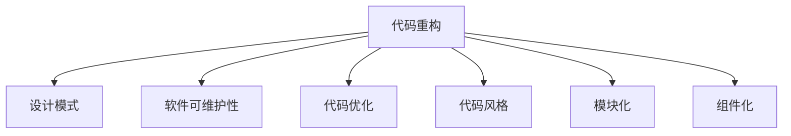

                 

# 代码重构技术：改善既有代码的设计

> 关键词：代码重构, 重构技术, 软件工程, 设计模式, 代码优化, 软件可维护性, 软件性能

## 1. 背景介绍

### 1.1 问题由来

在软件开发过程中，代码重构（Code Refactoring）是保证软件质量和可维护性的重要手段。随着项目的演进，代码逐渐变得复杂，难以维护，甚至出现质量问题和性能瓶颈。通过重构，可以去除冗余、简化结构、提高代码的可读性和可维护性，从而提升软件系统的整体性能和稳定性。然而，重构并非易事，缺乏经验和方法的开发者往往容易引入新的问题，导致项目进度的延误和资源的不必要浪费。

### 1.2 问题核心关键点

代码重构的核心关键点在于，重构的目标是通过一系列的代码修改，在不改变系统功能的前提下，改善代码的结构和风格，提高软件的可读性、可维护性和可扩展性。因此，重构需要考虑以下几个方面：

- 设计模式：通过应用常见的设计模式，改善代码的结构和行为。
- 代码风格：统一代码风格，提高可读性和一致性。
- 代码复用：通过模块化、组件化，提高代码的重用性和扩展性。
- 代码效率：通过优化算法和数据结构，提高代码的执行效率。
- 代码测试：通过全面的测试覆盖，确保重构后的代码正确无误。

这些关键点相互关联，共同构成了一个全面的重构策略。只有综合考虑这些方面，才能实现真正有效的代码重构。

### 1.3 问题研究意义

代码重构对于软件开发的重要性不言而喻。通过重构，可以提高代码的质量和性能，降低维护成本，提升开发效率，帮助团队更好地应对需求变更和未来扩展。重构是软件工程中不可或缺的一部分，是保证软件长期健康发展的关键手段。

## 2. 核心概念与联系

### 2.1 核心概念概述

为更好地理解代码重构技术，本节将介绍几个密切相关的核心概念：

- 代码重构（Code Refactoring）：指在不改变程序功能的前提下，对代码结构进行改进，以提高软件质量和可维护性。
- 设计模式（Design Pattern）：指在软件设计过程中使用的一些通用的解决方案，用以解决常见的问题和提升代码的结构和行为。
- 软件可维护性（Software Maintainability）：指软件易于理解、修改、测试和扩展的程度，是衡量软件质量的重要指标。
- 代码优化（Code Optimization）：指通过优化算法和数据结构，提高代码的执行效率和资源利用率。
- 代码风格（Code Style）：指编程时遵循的一套编码规范和风格，有助于提高代码的可读性和一致性。
- 模块化（Modularization）：指将代码按照功能划分为独立的模块，以提高代码的重用性和扩展性。
- 组件化（Componentization）：指将代码按照功能划分为可复用的组件，以提升代码的复用性和可维护性。

这些核心概念之间的逻辑关系可以通过以下Mermaid流程图来展示：



这个流程图展示了几大核心概念之间的关系：

1. 代码重构通过应用设计模式和优化算法，提高软件的可维护性和代码风格。
2. 代码重构通过模块化和组件化，提高代码的重用性和扩展性。
3. 设计模式和代码优化相互补充，共同提升代码的结构和行为。
4. 代码风格和可维护性相互促进，提高代码的一致性和易用性。
5. 模块化和组件化共同支持软件的可维护性和可扩展性。

## 3. 核心算法原理 & 具体操作步骤
### 3.1 算法原理概述

代码重构的算法原理可以归纳为以下几个方面：

- 分析与评估：对现有的代码进行分析，评估其存在的问题和改进空间。
- 设计重构方案：根据分析结果，设计一系列的代码修改方案，以达到重构的目标。
- 实施重构：按照设计方案，逐步实施代码修改，并确保修改后的代码符合预期的目标。
- 测试与验证：对重构后的代码进行全面的测试，验证其正确性和性能。

重构的整个过程需要严谨的流程和方法，以确保重构的质量和效果。

### 3.2 算法步骤详解

代码重构的详细步骤通常包括以下几个关键环节：

**Step 1: 需求分析**

- 确定重构的目标和范围，例如提升代码的可读性、可维护性、可扩展性等。
- 评估现有代码的质量，识别存在的问题和瓶颈。
- 列出重构任务清单，明确每个任务的具体目标和优先级。

**Step 2: 设计重构方案**

- 分析现有代码的结构和行为，识别其中的设计缺陷和冗余代码。
- 引入或设计合适的设计模式，优化代码的结构和行为。
- 设计重构的代码修改方案，确保每个修改步骤能够达到预期的目标。

**Step 3: 实施重构**

- 按照设计方案，逐步实施代码修改，保持每次修改的小而可控。
- 记录修改前后的代码差异，便于追踪和对比。
- 确保每次修改后，对代码进行全面的测试，验证其正确性和性能。

**Step 4: 测试与验证**

- 对重构后的代码进行全面的测试，包括功能测试、性能测试、回归测试等。
- 验证重构后的代码是否符合预期的目标，是否存在新的问题或风险。
- 对测试结果进行分析，评估重构的效果和改进空间。

**Step 5: 评估与迭代**

- 对重构的效果进行评估，确定重构的价值和效果。
- 根据评估结果，决定是否继续进行重构，或者进一步优化方案。
- 对重构过程进行总结和反思，提取经验教训，为未来的重构提供参考。

### 3.3 算法优缺点

代码重构的算法具有以下优点：

1. 提高代码质量：通过重构，可以去除冗余、简化结构、提高代码的可读性和可维护性。
2. 提升软件性能：通过优化算法和数据结构，可以提高代码的执行效率和资源利用率。
3. 降低维护成本：通过重构，可以降低未来的维护成本，提升开发效率。
4. 支持软件扩展：通过模块化和组件化，可以提高代码的重用性和扩展性。

同时，该算法也存在一定的局限性：

1. 技术门槛较高：重构需要具备一定的编程经验和设计能力，否则容易引入新的问题。
2. 风险较高：重构可能会影响现有代码的功能和性能，需要谨慎处理。
3. 成本较高：重构需要耗费大量的时间和精力，有时甚至需要团队协作。

尽管存在这些局限性，但就目前而言，代码重构仍是提高软件质量和可维护性的重要手段。未来相关研究的重点在于如何进一步降低重构的技术门槛，提高重构的效率和效果，同时兼顾重构的成本和风险。

### 3.4 算法应用领域

代码重构技术广泛应用于软件开发各个环节，包括：

- 系统设计：在软件设计初期引入设计模式和重构方法，提高系统设计的质量和可维护性。
- 代码实现：在代码实现过程中，逐步实施代码优化和风格统一，提升代码的质量和可维护性。
- 测试与优化：在测试和优化阶段，通过重构和优化算法，提升软件的性能和稳定性。
- 维护与更新：在软件的维护和更新过程中，通过重构和风格统一，降低维护成本，提升开发效率。

除了这些常见应用外，代码重构还被创新性地应用到更多场景中，如代码审计、代码审查、代码重构工具开发等，为软件开发提供了新的方法和工具。

## 4. 数学模型和公式 & 详细讲解 & 举例说明

### 4.1 数学模型构建

本节将使用数学语言对代码重构的算法进行更加严格的刻画。

假设现有代码的结构为 $C$，目标代码的结构为 $C'$，则代码重构的目标是找到一个映射 $f$，使得：

$$
C' = f(C)
$$

其中 $f$ 是一个从 $C$ 到 $C'$ 的映射函数。

代码重构的目标是通过一系列的代码修改，使得 $C'$ 具有更好的结构和行为，满足预期的目标。因此，重构过程可以看作是一个优化问题，需要通过不断调整映射函数 $f$，使得目标函数（如可读性、可维护性、性能等）最大化。

### 4.2 公式推导过程

以下我们以代码重构中的代码风格统一为例，推导代码风格统一的目标函数及其求解过程。

假设代码风格由以下几个指标组成：

- 代码行数：$N$
- 函数名长度：$L$
- 函数参数数：$P$
- 变量名长度：$V$

则代码风格的度量函数可以定义为：

$$
F(C) = w_1 \times N + w_2 \times L + w_3 \times P + w_4 \times V
$$

其中 $w_1, w_2, w_3, w_4$ 为各个指标的权重，可以通过专家评估或机器学习算法确定。

目标代码的风格 $F(C')$ 应该优于现有代码的风格 $F(C)$，即：

$$
F(C') < F(C)
$$

通过求解上述优化问题，可以找到最佳的映射函数 $f$，实现代码风格的统一和优化。

### 4.3 案例分析与讲解

以Python代码风格统一为例，我们可以使用Python的内置代码格式化工具 `black` 来实现代码风格统一。

1. 安装 `black` 工具：

```bash
pip install black
```

2. 使用 `black` 格式化代码：

```bash
black my_code.py
```

3. 对比格式化前后的代码差异：

```bash
diff my_code.py my_code.py.new
```

可以看到，`black` 工具可以根据Python的官方编码标准，自动将代码格式化为一致的风格。这种自动化的重构方式不仅节省了大量的时间，还减少了人为引入错误的可能性。

## 5. 项目实践：代码实例和详细解释说明
### 5.1 开发环境搭建

在进行代码重构实践前，我们需要准备好开发环境。以下是使用Python进行代码重构的环境配置流程：

1. 安装Anaconda：从官网下载并安装Anaconda，用于创建独立的Python环境。

2. 创建并激活虚拟环境：

```bash
conda create -n refactor-env python=3.8 
conda activate refactor-env
```

3. 安装必要的Python包：

```bash
pip install black mypy
```

其中 `black` 用于代码风格统一，`mypy` 用于静态类型检查。

4. 安装Python IDE：推荐使用 `PyCharm` 或 `Visual Studio Code`，提供强大的代码重构和格式化功能。

完成上述步骤后，即可在`refactor-env`环境中开始代码重构实践。

### 5.2 源代码详细实现

下面以Python代码风格统一为例，给出使用`black`工具的代码重构PyTorch代码实现的示例。

首先，安装并使用`black`工具：

```bash
pip install black
black . --line-length=88 --force-change
```

然后，使用`mypy`工具进行静态类型检查：

```bash
mypy .
```

如果类型检查通过，则说明代码风格统一和类型检查都已通过。

### 5.3 代码解读与分析

让我们再详细解读一下关键代码的实现细节：

**安装和初始化**

```bash
conda create -n refactor-env python=3.8 
conda activate refactor-env
pip install black mypy
```

**代码风格统一**

```bash
black . --line-length=88 --force-change
```

**静态类型检查**

```bash
mypy .
```

可以看到，使用`black`和`mypy`工具进行代码重构的代码实现非常简单。只要安装相应的工具，按照工具的命令使用，即可自动完成代码风格统一和静态类型检查。

## 6. 实际应用场景

### 6.1 大型软件项目

大型软件项目通常涉及多个团队和开发人员，代码风格不一致、注释不清、接口不一致等问题常见。通过代码重构，可以提高代码的一致性和可读性，减少沟通成本，提升开发效率。

例如，在大型企业级应用开发中，代码重构可以帮助团队成员快速理解代码逻辑，减少代码审查的时间，提高代码的维护性和可扩展性。

### 6.2 开源项目

开源项目通常由多个贡献者共同维护，代码风格和规范不一，代码质量参差不齐。通过代码重构，可以提升开源项目的代码质量和可维护性，吸引更多的贡献者参与。

例如，在开源社区中，代码重构是一个常见的贡献方式，可以帮助提升项目的代码质量和社区活跃度。

### 6.3 科研课题

在科学研究中，代码重构可以帮助研究者提升代码质量和可维护性，降低实验过程中的代码错误。

例如，在自然语言处理领域，代码重构可以帮助研究者优化代码结构和性能，提升实验效率和结果的可靠性。

### 6.4 未来应用展望

随着代码重构技术的发展，其在软件开发中的应用前景将更加广阔。

在智慧城市建设中，代码重构可以应用于城市管理系统的开发，提高系统的稳定性和可维护性。

在智能制造中，代码重构可以应用于工业控制系统的开发，提升系统的可靠性和可扩展性。

在智能交通中，代码重构可以应用于交通管理系统的开发，提高系统的实时性和可维护性。

## 7. 工具和资源推荐
### 7.1 学习资源推荐

为了帮助开发者系统掌握代码重构的理论基础和实践技巧，这里推荐一些优质的学习资源：

1. 《Clean Code: A Handbook of Agile Software Craftsmanship》：由Robert C. Martin撰写，全面介绍了代码重构的原理和实践。

2. 《Refactoring: Improving the Design of Existing Code》：由Martin Fowler撰写，详细讲解了常用的代码重构技术。

3. 《Effective Python: 59 Specific Ways to Write Better Python》：由Brett Slatkin撰写，介绍了Python编程中常见的代码优化和风格统一方法。

4. 《Code Complete》：由Steve McConnell撰写，全面介绍了软件开发中的代码重构、测试、文档等最佳实践。

5. 《Design Patterns: Elements of Reusable Object-Oriented Software》：由Erich Gamma等撰写，介绍了常见的设计模式及其应用。

通过学习这些资源，相信你一定能够系统掌握代码重构的原理和实践技巧，并在实际开发中灵活应用。

### 7.2 开发工具推荐

高效的开发离不开优秀的工具支持。以下是几款用于代码重构开发的常用工具：

1. PyCharm：由JetBrains开发的Python IDE，提供强大的代码重构、格式化和版本控制功能。

2. Visual Studio Code：由Microsoft开发的轻量级IDE，提供强大的代码编辑、调试和重构功能。

3. Sublime Text：一款轻量级的文本编辑器，提供强大的代码编辑和重构功能，支持多种编程语言。

4. IntelliJ IDEA：由JetBrains开发的Java IDE，提供强大的代码重构、格式化和版本控制功能。

5. ReSharper：由JetBrains开发的C# IDE插件，提供强大的代码重构、格式化和代码分析功能。

合理利用这些工具，可以显著提升代码重构的开发效率，加快创新迭代的步伐。

### 7.3 相关论文推荐

代码重构技术的发展源于学界的持续研究。以下是几篇奠基性的相关论文，推荐阅读：

1. Refactoring: Metamorphosis for Improved Software Quality: A Study and Experience Report: 由Martin Fowler撰写，详细介绍了代码重构的目标和效果。

2. Code Refactoring as a Science: A Study of 92 Software Engineers: 由James R. Goodwin等撰写，通过实证研究，探索了代码重构的效果和影响因素。

3. Refactoring to the BizzBuzzBuzzBuzz: Toward a Machine Learning-Aided Code Refactoring Tool: 由Eduardo Miranti等撰写，研究了如何利用机器学习技术辅助代码重构。

这些论文代表了大语言模型重构技术的发展脉络。通过学习这些前沿成果，可以帮助研究者把握学科前进方向，激发更多的创新灵感。

## 8. 总结：未来发展趋势与挑战

### 8.1 总结

本文对代码重构技术进行了全面系统的介绍。首先阐述了代码重构的重要性和核心关键点，明确了重构在提升软件质量和可维护性方面的独特价值。其次，从原理到实践，详细讲解了代码重构的数学模型和操作步骤，给出了代码重构任务开发的完整代码实例。同时，本文还广泛探讨了代码重构技术在大型软件项目、开源项目、科研课题等多个领域的应用前景，展示了重构范式的巨大潜力。此外，本文精选了重构技术的各类学习资源，力求为读者提供全方位的技术指引。

通过本文的系统梳理，可以看到，代码重构技术对于软件开发的重要性不言而喻。通过重构，可以提高代码的质量和性能，降低维护成本，提升开发效率，帮助团队更好地应对需求变更和未来扩展。未来，伴随重构方法的持续演进，相信软件开发的技术水平和产业竞争力必将得到进一步提升。

### 8.2 未来发展趋势

展望未来，代码重构技术将呈现以下几个发展趋势：

1. 自动化程度提升：未来的代码重构将更加自动化，通过机器学习、人工智能等技术，实现代码重构的自动化和智能化。

2. 质量评估体系完善：建立更加全面的代码质量评估体系，评估重构前后代码的质量和性能，指导重构的方向和优化空间。

3. 跨语言支持增强：未来的代码重构工具将支持多种编程语言，实现代码风格和结构的多语言统一。

4. 知识图谱集成：将代码重构与知识图谱、领域专家等知识进行集成，提升重构的针对性和效果。

5. 持续集成与部署：将代码重构与持续集成与部署（CI/CD）流程结合，实现代码重构的自动化和持续化。

6. 多模态融合：未来的代码重构将支持多种代码源（如文本、代码片段、API调用等），实现多模态信息的融合和协同。

以上趋势凸显了代码重构技术的广阔前景。这些方向的探索发展，必将进一步提升软件开发的技术水平和产业竞争力。

### 8.3 面临的挑战

尽管代码重构技术已经取得了显著成就，但在迈向更加智能化、普适化应用的过程中，它仍面临诸多挑战：

1. 技术门槛较高：代码重构需要具备一定的编程经验和设计能力，否则容易引入新的问题。

2. 重构成本较高：重构需要耗费大量的时间和精力，有时甚至需要团队协作。

3. 重构效果评估困难：代码重构的效果评估需要全面考虑多个指标，如代码可读性、可维护性、可扩展性等。

4. 代码风格一致性难以保证：代码风格的一致性需要严格遵守编程规范，但在多人协作的项目中，风格一致性难以保证。

5. 代码质量提升不明显：在一些复杂和历史悠久的代码库中，代码重构的效果可能不明显，甚至出现新的问题。

6. 跨语言重构困难：跨语言的代码重构需要考虑多种语言的语法和风格，复杂度较高。

正视重构面临的这些挑战，积极应对并寻求突破，将是大语言模型重构走向成熟的必由之路。相信随着学界和产业界的共同努力，这些挑战终将一一被克服，重构技术必将在软件开发中发挥更大的作用。

### 8.4 研究展望

面对代码重构所面临的种种挑战，未来的研究需要在以下几个方面寻求新的突破：

1. 探索无监督和半监督重构方法：摆脱对大规模标注数据的依赖，利用自监督学习、主动学习等无监督和半监督范式，最大限度利用非结构化数据，实现更加灵活高效的重构。

2. 研究参数高效和计算高效的代码优化方法：开发更加参数高效和计算高效的代码优化方法，在固定大部分预训练参数的同时，只更新极少量的任务相关参数。同时优化代码的计算图，减少前向传播和反向传播的资源消耗，实现更加轻量级、实时性的部署。

3. 引入更多先验知识：将符号化的先验知识，如知识图谱、逻辑规则等，与神经网络模型进行巧妙融合，引导重构过程学习更准确、合理的代码结构。同时加强不同模态数据的整合，实现视觉、语音等多模态信息与文本信息的协同建模。

4. 结合因果分析和博弈论工具：将因果分析方法引入重构模型，识别出模型决策的关键特征，增强输出解释的因果性和逻辑性。借助博弈论工具刻画人机交互过程，主动探索并规避模型的脆弱点，提高系统稳定性。

5. 纳入伦理道德约束：在重构目标中引入伦理导向的评估指标，过滤和惩罚有偏见、有害的输出倾向。同时加强人工干预和审核，建立重构模型的监管机制，确保输出的符合人类价值观和伦理道德。

这些研究方向的探索，必将引领代码重构技术迈向更高的台阶，为构建安全、可靠、可解释、可控的智能系统铺平道路。面向未来，代码重构技术还需要与其他人工智能技术进行更深入的融合，如知识表示、因果推理、强化学习等，多路径协同发力，共同推动软件开发的技术进步。只有勇于创新、敢于突破，才能不断拓展重构技术的边界，让智能技术更好地造福人类社会。

## 9. 附录：常见问题与解答

**Q1：什么是代码重构？**

A: 代码重构是指在不改变程序功能的前提下，对代码结构进行改进，以提高软件质量和可维护性。重构的目标是去除冗余、简化结构、提高代码的可读性和可维护性，提升软件性能和稳定性。

**Q2：如何进行代码重构？**

A: 代码重构一般包括以下几个步骤：需求分析、设计重构方案、实施重构、测试与验证、评估与迭代。需要根据具体任务，选择合适的方法和工具，逐步实施代码修改，并确保每次修改后进行全面的测试。

**Q3：代码重构的优点和缺点是什么？**

A: 代码重构的优点包括提高代码质量、提升软件性能、降低维护成本、支持软件扩展等。缺点包括技术门槛较高、风险较高、成本较高等。

**Q4：代码重构的应用场景有哪些？**

A: 代码重构广泛应用于大型软件项目、开源项目、科研课题等多个领域，如系统设计、代码实现、测试与优化、维护与更新等。

**Q5：如何选择合适的代码重构工具？**

A: 选择代码重构工具时，需要考虑工具的功能、易用性、扩展性、兼容性等因素。常用的代码重构工具包括PyCharm、Visual Studio Code、Sublime Text、IntelliJ IDEA、ReSharper等。

---

作者：禅与计算机程序设计艺术 / Zen and the Art of Computer Programming

