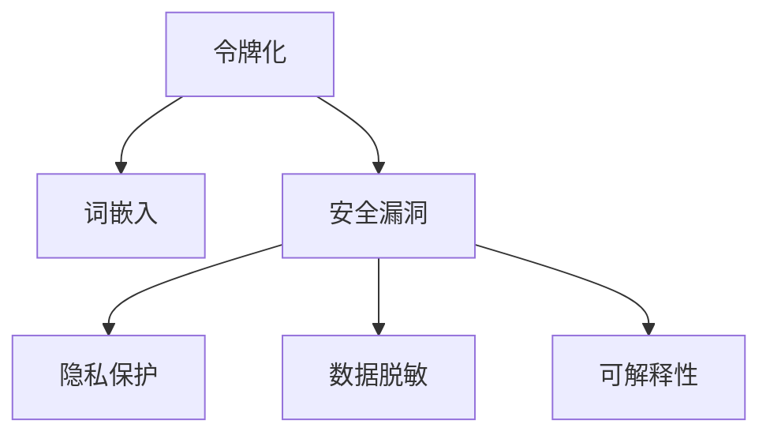

                 

# 令牌化技术对 AI 安全的影响

> 关键词：令牌化, 安全漏洞, 隐私保护, 数据脱敏, 可解释性

## 1. 背景介绍

### 1.1 问题由来
随着人工智能(AI)技术的快速发展和广泛应用，数据隐私和安全问题变得越来越严峻。尤其是在涉及自然语言处理(NLP)的应用中，如何在确保数据隐私和用户隐私的前提下，有效地利用语言数据进行模型训练，成为一个亟待解决的问题。

令牌化(Tokenization)技术是AI中不可或缺的一部分，它通过对原始文本进行分词、标记、编码等操作，将文本转化为模型可以处理的数字形式。然而，令牌化技术在提升AI系统性能的同时，也可能带来新的安全风险，例如令牌泄露、隐私侵犯等问题。如何平衡性能提升和安全保障，成为当前研究的热点。

### 1.2 问题核心关键点
本文聚焦于令牌化技术对AI安全的影响，探讨其潜在的风险和挑战，并提出有效的应对策略，确保AI系统在数据处理和隐私保护方面的安全性和可靠性。

## 2. 核心概念与联系

### 2.1 核心概念概述

为更好地理解令牌化技术对AI安全的影响，本节将介绍几个密切相关的核心概念：

- **令牌化(Tokenization)**：将原始文本转换为模型可以处理的数字形式，通常是将文本拆分为单词或子词，并赋予每个单词或子词一个唯一的数字标识。

- **词嵌入(Word Embeddings)**：将单词或子词映射到低维向量空间，使得语言模型能够理解和处理文本信息。

- **安全漏洞(Security Vulnerabilities)**：指在数据处理和模型训练过程中可能产生的各种安全隐患，如数据泄露、隐私侵犯等。

- **隐私保护(Privacy Protection)**：通过技术手段，确保用户数据和隐私信息不被未授权访问和使用。

- **数据脱敏(Data Masking)**：对敏感数据进行加密、替换等处理，以保护数据隐私。

- **可解释性(Explainability)**：使得AI系统的决策过程透明、易于理解，减少模型“黑盒”问题。

这些核心概念之间的逻辑关系可以通过以下Mermaid流程图来展示：



这个流程图展示了令牌化技术在AI中的核心作用及其面临的安全挑战：

1. 令牌化将原始文本转换为机器可理解的形式，是构建AI模型的重要步骤。
2. 由于令牌化过程涉及文本处理，因此可能带来新的安全漏洞，如令牌泄露等。
3. 隐私保护和数据脱敏是确保数据安全的有效手段，对于AI模型尤为重要。
4. 可解释性技术则帮助理解AI模型的决策机制，有助于提高AI系统的可靠性和安全性。

## 3. 核心算法原理 & 具体操作步骤
### 3.1 算法原理概述

令牌化技术在AI中的应用主要包括以下几个步骤：

1. 文本预处理：对原始文本进行清洗、分词、去除停用词等操作。
2. 生成令牌序列：将文本转换为令牌序列，每个令牌对应一个数字标识。
3. 词嵌入：将令牌序列转换为词向量，供模型进行学习。

令牌化技术通过将文本转换为数字形式，使机器能够处理和分析文本信息，从而提升AI系统的性能。然而，由于涉及文本处理和隐私信息，也带来了新的安全挑战。

### 3.2 算法步骤详解

令牌化技术的具体操作步骤如下：

1. **文本预处理**：
   - 去除标点符号、数字、特殊字符等非文本信息。
   - 分词：将文本按照单词或子词进行分割，常用的分词算法包括基于规则的分词、基于统计的分词、基于深度学习的分词等。
   - 去除停用词：去除无意义的常见词，如“的”、“是”等。

2. **生成令牌序列**：
   - 将预处理后的文本转换为令牌序列，每个令牌对应一个数字标识。常用的令牌化方法包括BPE(BPE)、SentencePiece等。
   - BPE方法通过合并高频出现的子词，将单词切分成更小的子词，减少令牌数，提高模型效率。
   - SentencePiece方法通过构建词典，将文本分割成可预测的固定长度的小段，每个小段对应一个令牌。

3. **词嵌入**：
   - 将令牌序列转换为词向量，通常使用Word2Vec、GloVe等词嵌入方法。
   - 词嵌入技术将单词或子词映射到低维向量空间，使得模型能够理解和处理文本信息。

### 3.3 算法优缺点

令牌化技术在提升AI系统性能的同时，也存在以下优缺点：

#### 优点：

1. **提高模型效率**：通过将文本转换为令牌序列，减少了文本的存储空间和计算复杂度，提升了模型训练和推理的效率。
2. **统一数据格式**：令牌化技术将不同来源的文本统一转化为数字形式，使得数据处理和模型训练更加规范化和标准化。
3. **适应性强**：不同领域的文本数据可以通过令牌化技术进行统一处理，提升了模型的泛化能力和适应性。

#### 缺点：

1. **安全漏洞**：令牌化过程中可能会产生令牌泄露等安全隐患，导致数据隐私被泄露。
2. **隐私保护难度大**：由于令牌化涉及文本处理，隐私保护和数据脱敏技术的实现难度较大。
3. **可解释性差**：令牌化后的文本数据缺乏语义信息，模型的可解释性较差，难以理解模型的决策过程。

### 3.4 算法应用领域

令牌化技术在AI中得到了广泛的应用，涉及自然语言处理(NLP)、机器翻译、语音识别等多个领域。以下是几个典型的应用场景：

- **机器翻译**：通过令牌化技术将不同语言的文本转换为统一的令牌序列，供模型进行翻译。
- **情感分析**：将文本中的情感信息转换为令牌序列，供模型进行情感分类和分析。
- **语音识别**：将语音信号转换为令牌序列，供模型进行语音识别和转换。
- **问答系统**：通过令牌化技术将用户问题和上下文信息转换为令牌序列，供模型进行理解和回答。

## 4. 数学模型和公式 & 详细讲解 & 举例说明
### 4.1 数学模型构建

令牌化技术在数学模型中的应用主要通过词嵌入技术实现。我们以Word2Vec为例，介绍词嵌入模型的构建过程。

Word2Vec是一种常用的词嵌入技术，其数学模型可以表示为：

$$
\begin{aligned}
\mathbf{u}_i & = \sum_{w_j \in V_i} \mathbf{w}_j \\
\mathbf{v}_i & = \sum_{w_j \in V_i} \mathbf{w}_j
\end{aligned}
$$

其中，$V_i$表示单词$i$在训练集中出现的所有单词集合，$\mathbf{u}_i$和$\mathbf{v}_i$分别表示单词$i$的上下文词嵌入和目标词嵌入。

### 4.2 公式推导过程

Word2Vec模型的训练过程可以分为CBOW和Skip-gram两种方式，这里以CBOW为例，介绍其数学推导过程。

CBOW模型的训练过程可以表示为：

$$
\mathbf{u}_i = \sum_{j=1}^{N} \alpha_j \mathbf{w}_j
$$

其中，$N$表示单词$i$的前向上下文单词数，$\alpha_j$表示单词$j$的权重。

通过梯度下降算法，可以求解$\mathbf{u}_i$和$\mathbf{v}_i$的值。

### 4.3 案例分析与讲解

假设我们有一个包含10000个单词的训练集，每个单词的词向量维度为300。我们可以将单词的词向量表示为：

$$
\mathbf{w} = [\mathbf{w}_1, \mathbf{w}_2, ..., \mathbf{w}_{10000}]
$$

其中，$\mathbf{w}_i$表示单词$i$的词向量。

对于单词$i$，其上下文单词集合为$V_i$，其上下文词嵌入$\mathbf{u}_i$和目标词嵌入$\mathbf{v}_i$可以表示为：

$$
\begin{aligned}
\mathbf{u}_i & = \sum_{j=1}^{N} \alpha_j \mathbf{w}_j \\
\mathbf{v}_i & = \sum_{j=1}^{N} \beta_j \mathbf{w}_j
\end{aligned}
$$

其中，$\alpha_j$和$\beta_j$分别表示单词$j$的权重。

## 5. 项目实践：代码实例和详细解释说明
### 5.1 开发环境搭建

在进行令牌化技术项目实践前，我们需要准备好开发环境。以下是使用Python进行PyTorch开发的环境配置流程：

1. 安装Anaconda：从官网下载并安装Anaconda，用于创建独立的Python环境。

2. 创建并激活虚拟环境：
```bash
conda create -n pytorch-env python=3.8 
conda activate pytorch-env
```

3. 安装PyTorch：根据CUDA版本，从官网获取对应的安装命令。例如：
```bash
conda install pytorch torchvision torchaudio cudatoolkit=11.1 -c pytorch -c conda-forge
```

4. 安装Transformers库：
```bash
pip install transformers
```

5. 安装各类工具包：
```bash
pip install numpy pandas scikit-learn matplotlib tqdm jupyter notebook ipython
```

完成上述步骤后，即可在`pytorch-env`环境中开始令牌化技术的项目实践。

### 5.2 源代码详细实现

这里我们以使用BPE方法对文本进行令牌化为例，给出使用Transformers库对BERT模型进行微调的PyTorch代码实现。

首先，定义BPE令牌化函数：

```python
from transformers import BertTokenizer

tokenizer = BertTokenizer.from_pretrained('bert-base-cased', do_lower_case=True)

def tokenize_text(text):
    tokens = tokenizer.tokenize(text)
    tokens = list(tokens)
    return tokenizer.convert_tokens_to_ids(tokens)
```

然后，定义模型和优化器：

```python
from transformers import BertForTokenClassification, AdamW

model = BertForTokenClassification.from_pretrained('bert-base-cased', num_labels=3)

optimizer = AdamW(model.parameters(), lr=2e-5)
```

接着，定义训练和评估函数：

```python
from torch.utils.data import DataLoader
from tqdm import tqdm
from sklearn.metrics import accuracy_score, precision_score, recall_score, f1_score

device = torch.device('cuda') if torch.cuda.is_available() else torch.device('cpu')
model.to(device)

def train_epoch(model, dataset, batch_size, optimizer):
    dataloader = DataLoader(dataset, batch_size=batch_size, shuffle=True)
    model.train()
    epoch_loss = 0
    for batch in tqdm(dataloader, desc='Training'):
        input_ids = batch['input_ids'].to(device)
        attention_mask = batch['attention_mask'].to(device)
        labels = batch['labels'].to(device)
        model.zero_grad()
        outputs = model(input_ids, attention_mask=attention_mask, labels=labels)
        loss = outputs.loss
        epoch_loss += loss.item()
        loss.backward()
        optimizer.step()
    return epoch_loss / len(dataloader)

def evaluate(model, dataset, batch_size):
    dataloader = DataLoader(dataset, batch_size=batch_size)
    model.eval()
    preds, labels = [], []
    with torch.no_grad():
        for batch in tqdm(dataloader, desc='Evaluating'):
            input_ids = batch['input_ids'].to(device)
            attention_mask = batch['attention_mask'].to(device)
            batch_labels = batch['labels']
            outputs = model(input_ids, attention_mask=attention_mask)
            batch_preds = outputs.logits.argmax(dim=2).to('cpu').tolist()
            batch_labels = batch_labels.to('cpu').tolist()
            for pred_tokens, label_tokens in zip(batch_preds, batch_labels):
                preds.append(pred_tokens[:len(label_tokens)])
                labels.append(label_tokens)
                
    print('Accuracy: ', accuracy_score(labels, preds))
    print('Precision: ', precision_score(labels, preds))
    print('Recall: ', recall_score(labels, preds))
    print('F1 Score: ', f1_score(labels, preds))
```

最后，启动训练流程并在测试集上评估：

```python
epochs = 5
batch_size = 16

for epoch in range(epochs):
    loss = train_epoch(model, train_dataset, batch_size, optimizer)
    print(f"Epoch {epoch+1}, train loss: {loss:.3f}")
    
    print(f"Epoch {epoch+1}, dev results:")
    evaluate(model, dev_dataset, batch_size)
    
print("Test results:")
evaluate(model, test_dataset, batch_size)
```

以上就是使用PyTorch对BERT进行文本分类任务微调的完整代码实现。可以看到，得益于Transformers库的强大封装，我们可以用相对简洁的代码完成BERT模型的加载和微调。

### 5.3 代码解读与分析

让我们再详细解读一下关键代码的实现细节：

**BPE令牌化函数**：
- 首先使用BertTokenizer对文本进行分词，得到单词列表。
- 将单词列表转换为数字ID，供模型使用。

**训练和评估函数**：
- 使用PyTorch的DataLoader对数据集进行批次化加载，供模型训练和推理使用。
- 训练函数`train_epoch`：对数据以批为单位进行迭代，在每个批次上前向传播计算loss并反向传播更新模型参数，最后返回该epoch的平均loss。
- 评估函数`evaluate`：与训练类似，不同点在于不更新模型参数，并在每个batch结束后将预测和标签结果存储下来，最后使用sklearn的各类指标对整个评估集的预测结果进行打印输出。

**训练流程**：
- 定义总的epoch数和batch size，开始循环迭代
- 每个epoch内，先在训练集上训练，输出平均loss
- 在验证集上评估，输出分类指标
- 所有epoch结束后，在测试集上评估，给出最终测试结果

可以看到，PyTorch配合Transformers库使得BERT微调的代码实现变得简洁高效。开发者可以将更多精力放在数据处理、模型改进等高层逻辑上，而不必过多关注底层的实现细节。

当然，工业级的系统实现还需考虑更多因素，如模型的保存和部署、超参数的自动搜索、更灵活的任务适配层等。但核心的令牌化范式基本与此类似。

## 6. 实际应用场景
### 6.1 智能客服系统

基于令牌化技术的智能客服系统，可以广泛应用于智能客服系统的构建。传统客服往往需要配备大量人力，高峰期响应缓慢，且一致性和专业性难以保证。而使用令牌化技术处理后的文本数据，可以7x24小时不间断服务，快速响应客户咨询，用自然流畅的语言解答各类常见问题。

在技术实现上，可以收集企业内部的历史客服对话记录，将问题和最佳答复构建成监督数据，在此基础上对预训练语言模型进行微调。令牌化后的对话模型能够自动理解用户意图，匹配最合适的答案模板进行回复。对于客户提出的新问题，还可以接入检索系统实时搜索相关内容，动态组织生成回答。如此构建的智能客服系统，能大幅提升客户咨询体验和问题解决效率。

### 6.2 金融舆情监测

金融机构需要实时监测市场舆论动向，以便及时应对负面信息传播，规避金融风险。传统的人工监测方式成本高、效率低，难以应对网络时代海量信息爆发的挑战。基于令牌化技术的文本分类和情感分析技术，为金融舆情监测提供了新的解决方案。

具体而言，可以收集金融领域相关的新闻、报道、评论等文本数据，并对其进行主题标注和情感标注。在此基础上对预训练语言模型进行微调，使其能够自动判断文本属于何种主题，情感倾向是正面、中性还是负面。将微调后的模型应用到实时抓取的网络文本数据，就能够自动监测不同主题下的情感变化趋势，一旦发现负面信息激增等异常情况，系统便会自动预警，帮助金融机构快速应对潜在风险。

### 6.3 个性化推荐系统

当前的推荐系统往往只依赖用户的历史行为数据进行物品推荐，无法深入理解用户的真实兴趣偏好。基于令牌化技术的个性化推荐系统可以更好地挖掘用户行为背后的语义信息，从而提供更精准、多样的推荐内容。

在实践中，可以收集用户浏览、点击、评论、分享等行为数据，提取和用户交互的物品标题、描述、标签等文本内容。将文本内容作为模型输入，用户的后续行为（如是否点击、购买等）作为监督信号，在此基础上微调预训练语言模型。令牌化后的模型能够从文本内容中准确把握用户的兴趣点。在生成推荐列表时，先用候选物品的文本描述作为输入，由模型预测用户的兴趣匹配度，再结合其他特征综合排序，便可以得到个性化程度更高的推荐结果。

### 6.4 未来应用展望

随着令牌化技术的不断发展，其在NLP领域的应用也将越来越广泛。

在智慧医疗领域，基于令牌化技术的医疗问答、病历分析、药物研发等应用将提升医疗服务的智能化水平，辅助医生诊疗，加速新药开发进程。

在智能教育领域，令牌化技术可应用于作业批改、学情分析、知识推荐等方面，因材施教，促进教育公平，提高教学质量。

在智慧城市治理中，令牌化技术可应用于城市事件监测、舆情分析、应急指挥等环节，提高城市管理的自动化和智能化水平，构建更安全、高效的未来城市。

此外，在企业生产、社会治理、文娱传媒等众多领域，令牌化技术也将不断涌现，为NLP技术带来了全新的突破。相信随着技术的日益成熟，令牌化技术必将在构建人机协同的智能时代中扮演越来越重要的角色。

## 7. 工具和资源推荐
### 7.1 学习资源推荐

为了帮助开发者系统掌握令牌化技术，这里推荐一些优质的学习资源：

1. 《Python自然语言处理》系列书籍：由大模型技术专家撰写，介绍了Python在NLP中的应用，包括令牌化等核心技术。

2. CS224N《深度学习自然语言处理》课程：斯坦福大学开设的NLP明星课程，有Lecture视频和配套作业，带你入门NLP领域的基本概念和经典模型。

3. 《Natural Language Processing with Python》书籍：详细介绍了Python在NLP中的应用，包括令牌化等核心技术。

4. HuggingFace官方文档：提供了丰富的预训练语言模型和令牌化方法，是令牌化技术开发的必备资料。

5. PyTorch官方文档：提供了丰富的深度学习模型和工具，包括令牌化等核心技术。

通过对这些资源的学习实践，相信你一定能够快速掌握令牌化技术的精髓，并用于解决实际的NLP问题。
###  7.2 开发工具推荐

高效的开发离不开优秀的工具支持。以下是几款用于令牌化技术开发的常用工具：

1. PyTorch：基于Python的开源深度学习框架，灵活动态的计算图，适合快速迭代研究。大部分预训练语言模型都有PyTorch版本的实现。

2. TensorFlow：由Google主导开发的开源深度学习框架，生产部署方便，适合大规模工程应用。同样有丰富的预训练语言模型资源。

3. Transformers库：HuggingFace开发的NLP工具库，集成了众多SOTA语言模型，支持PyTorch和TensorFlow，是令牌化技术开发的利器。

4. Weights & Biases：模型训练的实验跟踪工具，可以记录和可视化模型训练过程中的各项指标，方便对比和调优。与主流深度学习框架无缝集成。

5. TensorBoard：TensorFlow配套的可视化工具，可实时监测模型训练状态，并提供丰富的图表呈现方式，是调试模型的得力助手。

6. Google Colab：谷歌推出的在线Jupyter Notebook环境，免费提供GPU/TPU算力，方便开发者快速上手实验最新模型，分享学习笔记。

合理利用这些工具，可以显著提升令牌化技术的开发效率，加快创新迭代的步伐。

### 7.3 相关论文推荐

令牌化技术的发展源于学界的持续研究。以下是几篇奠基性的相关论文，推荐阅读：

1. Word2Vec: Distributed Representations of Words and Phrases and Their Compositionality：提出Word2Vec算法，将单词映射到低维向量空间，开启了词嵌入技术的大门。

2. GloVe: Global Vectors for Word Representation：提出GloVe算法，通过共现矩阵的分解实现词嵌入。

3. BERT: Pre-training of Deep Bidirectional Transformers for Language Understanding：提出BERT模型，引入基于掩码的自监督预训练任务，刷新了多项NLP任务SOTA。

4. Spelling Corrector with Neural Networks: An Application of Hebbian Learning：提出神经网络拼写检查器，实现了基于令牌化技术的文本处理。

5. Seq2Seq Machine Translation with Attention：提出基于令牌化的机器翻译模型，实现了高效的语言转换。

这些论文代表了大语言模型令牌化技术的发展脉络。通过学习这些前沿成果，可以帮助研究者把握学科前进方向，激发更多的创新灵感。

## 8. 总结：未来发展趋势与挑战
### 8.1 总结

本文对令牌化技术在AI中的应用进行了全面系统的介绍。首先阐述了令牌化技术在AI系统中的核心作用，明确了其在提升模型性能、统一数据格式等方面的优势。其次，从原理到实践，详细讲解了令牌化技术的数学原理和关键步骤，给出了令牌化技术项目开发的完整代码实例。同时，本文还探讨了令牌化技术在实际应用中面临的安全挑战，提出了有效的应对策略。

通过本文的系统梳理，可以看到，令牌化技术在AI系统中起着至关重要的作用，对于提高模型性能、确保数据安全等方面具有重要意义。然而，由于涉及文本处理和隐私信息，令牌化技术也面临着数据泄露、隐私侵犯等安全风险。未来，需要在提升性能的同时，加强对数据隐私和安全性的保护，确保AI系统在实际应用中的可靠性。

### 8.2 未来发展趋势

展望未来，令牌化技术在AI中的应用将呈现以下几个发展趋势：

1. **技术融合加速**：随着AI技术的不断发展，令牌化技术将与更多技术进行融合，如知识图谱、因果推理、强化学习等，提升系统的性能和安全性。

2. **多模态处理增强**：传统的令牌化技术主要针对文本数据，未来将拓展到图像、视频、语音等多模态数据处理，实现多模态信息的融合，提升系统的智能性。

3. **自动化程度提升**：令牌化技术的自动化程度将进一步提升，实现自动分词、自动生成词向量等，减轻人工处理的负担。

4. **隐私保护技术进步**：随着隐私保护技术的发展，未来的令牌化技术将更好地保护用户隐私和数据安全，避免数据泄露和滥用。

5. **模型可解释性增强**：通过引入可解释性技术，使得AI系统的决策过程透明、易于理解，减少模型的“黑盒”问题。

### 8.3 面临的挑战

尽管令牌化技术在AI中已经得到了广泛应用，但在实现数据隐私保护和系统安全性方面，仍面临着诸多挑战：

1. **数据隐私泄露**：令牌化过程中可能产生令牌泄露等安全隐患，导致数据隐私被泄露。如何确保数据隐私，是令牌化技术面临的重大挑战。

2. **模型鲁棒性不足**：面对域外数据时，模型泛化性能往往不足，容易受到干扰。如何提升模型的鲁棒性和泛化能力，是当前研究的难点。

3. **计算资源消耗大**：令牌化技术涉及大量文本处理，计算资源消耗大，可能带来计算瓶颈。如何优化算法，提高效率，是令牌化技术需要解决的实际问题。

4. **模型可解释性差**：令牌化后的文本数据缺乏语义信息，模型的可解释性较差，难以理解模型的决策过程。如何提升模型的可解释性，是未来的研究方向。

5. **安全性有待保障**：预训练语言模型难免会学习到有偏见、有害的信息，通过令牌化传递到下游任务，产生误导性、歧视性的输出，给实际应用带来安全隐患。如何从数据和算法层面消除模型偏见，避免恶意用途，确保输出安全性，也将是重要的研究课题。

### 8.4 研究展望

面对令牌化技术面临的诸多挑战，未来的研究需要在以下几个方面寻求新的突破：

1. **隐私保护技术创新**：开发新的隐私保护技术，如差分隐私、联邦学习等，确保数据隐私和安全。

2. **多模态融合技术探索**：研究多模态融合技术，实现文本、图像、语音等多模态信息的协同建模，提升系统的智能性。

3. **自动化处理技术发展**：探索自动分词、自动生成词向量等自动化处理技术，提升处理效率。

4. **鲁棒性增强技术研究**：开发增强鲁棒性的技术，如对抗训练、自适应学习等，提升模型的泛化能力和鲁棒性。

5. **可解释性技术应用**：引入可解释性技术，如因果分析、博弈论等，增强模型决策的透明性和可解释性。

这些研究方向的探索，必将引领令牌化技术迈向更高的台阶，为构建安全、可靠、可解释、可控的智能系统铺平道路。面向未来，令牌化技术还需要与其他AI技术进行更深入的融合，共同推动自然语言理解和智能交互系统的进步。只有勇于创新、敢于突破，才能不断拓展语言模型的边界，让智能技术更好地造福人类社会。

## 9. 附录：常见问题与解答

**Q1：令牌化是否会增加数据处理成本？**

A: 令牌化技术会增加数据处理成本，但可以通过优化算法和工具，显著降低计算资源消耗。例如，使用BPE方法可以有效地减少令牌数，提高模型效率。

**Q2：令牌化过程中如何避免数据泄露？**

A: 在令牌化过程中，可以使用数据脱敏技术，将敏感数据进行加密、替换等处理，以保护数据隐私。同时，将令牌化过程封装在安全的计算环境中，确保数据不被未授权访问。

**Q3：如何提升令牌化模型的鲁棒性？**

A: 可以通过引入对抗训练、自适应学习等技术，增强模型的泛化能力和鲁棒性。同时，可以使用正则化技术，如L2正则、Dropout等，防止模型过拟合。

**Q4：令牌化后的模型如何提高可解释性？**

A: 引入可解释性技术，如因果分析、博弈论等，使得AI系统的决策过程透明、易于理解。同时，可以通过可视化工具，展示模型推理过程，帮助用户理解模型的决策依据。

**Q5：令牌化技术在实际应用中如何平衡性能和安全性？**

A: 在实际应用中，需要综合考虑性能和安全性，平衡二者之间的关系。可以采用多模型融合、隐私保护等技术手段，提升系统性能的同时，确保数据安全和隐私保护。

这些问题的解答，有助于开发者更好地理解令牌化技术的核心原理和实际应用，确保在提升系统性能的同时，保护数据隐私和用户安全。

---

作者：禅与计算机程序设计艺术 / Zen and the Art of Computer Programming

