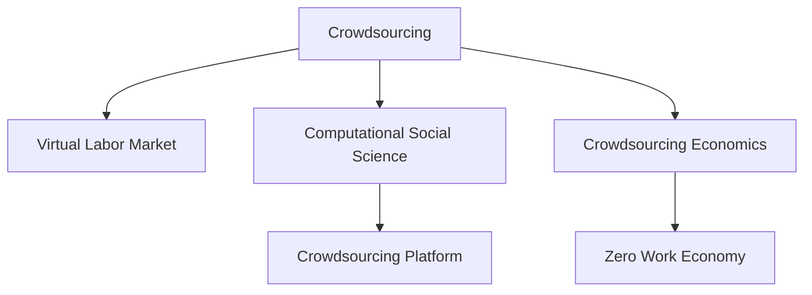

                 

# 众包的新前沿：人类计算

> 关键词：众包,人类计算,计算社会科学,虚拟劳动力市场,众包经济学,众包平台,零工经济,计算伦理学

## 1. 背景介绍

### 1.1 问题由来

随着互联网和信息技术的迅猛发展，全球经济和社会生活发生了深刻变革。传统劳动形式逐步向在线化、虚拟化转变，新型就业模式应运而生。这种模式不再拘泥于特定地点和时间，人们可以灵活选择工作方式和场所，形成了被广泛讨论的“零工经济”和“共享经济”。

这一现象不仅深刻影响了劳动力市场的供需结构，也引发了新一轮的学术研究热潮。经济学家和社会学家从传统的就业统计中抽离出来，探讨这种“去中心化”劳动模式带来的复杂社会影响。计算机科学家也顺应趋势，提出了计算社会科学这一新兴领域，以期用数据和模型更好地理解人类行为和群体动态。

### 1.2 问题核心关键点

当前，零工经济和共享经济已不再局限于技术实现的层面，它们已经深入到经济、社会、文化、伦理等多个领域。如何构建稳定、公正、高效的虚拟劳动力市场，成为众多研究人员关注的焦点。

计算社会科学的发展进一步强调了人力资源的复杂性和多样性，传统的劳动力市场分析已无法满足当前需求。由此，计算社会科学结合信息技术，开发出了一系列新型众包平台。这些平台基于数据分析和算法设计，以大规模人机协作的方式，完成各种复杂的任务和项目。

### 1.3 问题研究意义

研究众包和虚拟劳动力市场，对于理解现代社会经济结构、推动社会公平、提升工作灵活性具有重要意义：

1. 揭示社会动态：众包平台记录了大量的人类行为数据，通过分析这些数据可以揭示社会行为模式的变化趋势。
2. 促进公平就业：在虚拟劳动力市场下，人人平等参与、机会均等理念得到实现。
3. 提升工作效率：通过机器智能辅助，大量简单重复性任务得以自动化，高效工作成为可能。
4. 创新组织形式：虚拟劳动力市场突破了地理和时间的限制，催生了更多灵活、开放的企业组织形式。
5. 伦理和法律挑战：在虚拟劳动力市场中，如何保障工作者权益、确保平台治理公正等，成为亟待解决的问题。

## 2. 核心概念与联系

### 2.1 核心概念概述

为更好地理解众包和人类计算的原理与实践，本节将介绍几个密切相关的核心概念：

- **众包(Crowdsourcing)**：指通过在线平台集结大量无组织的网民，共同完成大规模的、复杂的项目。它是一种跨领域、跨学科的研究方法，涵盖经济学、社会学、计算机科学等多个领域。
- **虚拟劳动力市场(Virtual Labor Market)**：基于互联网的新型劳动力交换平台，通过数字化手段连接工作者和任务发布者，实现跨地域、跨时间的任务分发和执行。
- **计算社会科学(Computational Social Science)**：利用计算技术和大数据方法，研究人类行为和群体动态的学科，涵盖社会学、心理学、经济学等多个领域。
- **众包经济学(Crowdsourcing Economics)**：研究众包平台如何实现资源最优配置和利益最大化，涵盖经济学、社会学、计算机科学等多个领域。
- **众包平台(Crowdsourcing Platform)**：提供众包服务的在线平台，如Amazon Mechanical Turk、UpWork等，是虚拟劳动力市场的重要组成部分。
- **零工经济(Gig Economy)**：一种基于短期、临时性工作机会的经济模式，工作时间不固定，工作地点不固定，通常通过互联网平台完成。

这些核心概念之间的逻辑关系可以通过以下Mermaid流程图来展示：



这个流程图展示了几大核心概念之间的紧密联系：

1. 众包平台是虚拟劳动力市场的重要组成部分。
2. 众包平台的数据分析为计算社会科学提供了研究材料。
3. 众包经济学研究平台下的资源配置和收益问题。
4. 零工经济是众包平台中的工作模式，反映了灵活、临时的就业趋势。

这些概念共同构成了众包和虚拟劳动力市场的理论基础，为后续的研究和实践提供了重要指导。

## 3. 核心算法原理 & 具体操作步骤
### 3.1 算法原理概述

众包平台的核心算法原理主要基于以下几个方面：

1. **任务分配算法**：通过机器学习模型，对任务进行评估和排序，将最适合的任务分配给最合适的工作者。
2. **收入分配算法**：根据工作者的表现和贡献，设计公平合理的收入分配机制，实现利益最大化。
3. **平台治理算法**：通过算法确保平台运行的公平性、公正性和安全性，如防止恶意行为、保障数据隐私等。

这些算法原理在众包平台中协同工作，共同支撑虚拟劳动力市场的稳定运行。

### 3.2 算法步骤详解

基于众包平台的算法原理，以下是具体的算法步骤：

**Step 1: 数据收集与清洗**

- 收集众包平台上的数据，包括任务、工作者、平台操作日志等。
- 对数据进行清洗，去除噪音和异常值，确保数据质量。

**Step 2: 特征提取与处理**

- 从数据中提取与任务完成相关的特征，如工作时长、精度、复杂度等。
- 对特征进行处理，如归一化、标准化等，以提高模型的泛化能力。

**Step 3: 任务分配与匹配**

- 使用机器学习模型评估任务的难度和需求，选择合适的算法（如遗传算法、线性回归、决策树等）进行任务分配。
- 将任务分配给最匹配的工作者，使用推荐算法（如协同过滤、基于内容的推荐、协同排序等）进行匹配。

**Step 4: 收入分配与激励**

- 设计公平的收入分配算法，如按任务难度和工作时间分配收入，或按工作者表现分配收入。
- 引入激励机制，如奖励高质量完成任务的工作者，使用多目标优化算法（如粒子群算法、遗传算法等）进行优化。

**Step 5: 平台治理与监管**

- 使用安全算法（如异常检测、反欺诈检测）维护平台运行的安全性。
- 使用公平算法（如随机抽样、公平排序）确保平台治理的公正性。

**Step 6: 结果评估与优化**

- 对众包平台的任务完成情况进行评估，使用指标如完成任务的平均时间、平均收入等。
- 根据评估结果优化算法参数，使用优化算法（如遗传算法、粒子群算法等）进行迭代优化。

以上是众包平台的主要算法步骤，每个步骤都需要针对具体问题进行优化设计，以提高算法的准确性和效率。

### 3.3 算法优缺点

众包平台的算法主要具有以下优点：

1. 资源优化：能够高效地完成大规模、复杂的任务，通过任务分配和匹配算法优化资源配置。
2. 灵活性高：工作者可以选择任务时间和地点，平台能够灵活适应各种工作需求。
3. 成本低廉：相较于传统雇用方式，众包平台能够大幅降低招聘和培训成本。

同时，这些算法也存在一定的局限性：

1. 数据质量要求高：算法的效果高度依赖于数据质量，数据噪音和异常值可能影响结果。
2. 算法复杂度高：算法的设计和实现复杂，需要较强的技术支持。
3. 隐私和安全问题：数据隐私保护和平台安全是重大挑战，需要严格的数据管理和安全措施。
4. 公平性问题：如何确保任务分配和收入分配的公平性，需要持续的算法优化和政策调整。

尽管存在这些局限性，但总体而言，众包平台的算法设计对虚拟劳动力市场的稳定性和高效性具有重要作用。

### 3.4 算法应用领域

众包平台的核心算法已经广泛应用于多个领域，以下是一些主要的应用场景：

- **在线教育**：如Khan Academy，利用众包平台让学生参与教育资源建设。
- **医疗健康**：如CrowdMed，通过众包平台进行医学数据分析和诊断。
- **科学研究**：如Zooniverse，用于生物学、天文学等领域的科学研究数据标注。
- **产品设计**：如Innovation Crowd，利用众包平台进行新产品设计和测试。
- **文化娱乐**：如Crowdsourced Game Design，通过众包平台进行游戏设计和测试。
- **社会调查**：如Amazon Mechanical Turk，用于社会学、心理学等领域的调查研究。

除了上述应用领域外，众包平台还涵盖了更多如工业设计、法律咨询、旅游规划等多个垂直领域，显示出强大的应用潜力。

## 4. 数学模型和公式 & 详细讲解 & 举例说明
### 4.1 数学模型构建

本节将使用数学语言对众包平台的核心算法进行更加严格的刻画。

记虚拟劳动力市场中的工作者集合为 $W$，任务集合为 $J$，工作者完成任务所需时间记为 $t_w$，任务完成所需时间为 $t_j$，工作者完成某项任务的收入记为 $p_w$，任务完成后的平台收入记为 $p_j$。

**任务分配算法**：
$$
\text{Task Allocation} = \arg\min_{\vec{t},\vec{p}} \sum_{w \in W} c_w t_w + \sum_{j \in J} c_j t_j - \sum_{w \in W} \sum_{j \in J} I_{w,j} p_w + \sum_{j \in J} p_j
$$

其中 $c_w$ 为工作者的成本，$c_j$ 为任务的成本，$I_{w,j}$ 为工作者完成任务 $j$ 的指示变量。

**收入分配算法**：
$$
\text{Income Distribution} = \arg\max_{\vec{p}} \sum_{w \in W} p_w - \sum_{j \in J} p_j
$$

其中 $\vec{p}$ 为工作者和任务的收入。

**平台治理算法**：
$$
\text{Platform Governance} = \arg\max_{\vec{p},\vec{I}} \sum_{w \in W} p_w - \sum_{j \in J} p_j - \sum_{w \in W} \lambda_w C_w - \sum_{j \in J} \lambda_j C_j
$$

其中 $\lambda_w$ 为工作者的约束，$\lambda_j$ 为任务的约束，$C_w$ 为工作者的约束成本，$C_j$ 为任务的约束成本。

### 4.2 公式推导过程

以下我们以任务分配算法为例，推导其数学模型和求解过程。

**任务分配目标函数**：
$$
\min \sum_{w \in W} c_w t_w + \sum_{j \in J} c_j t_j - \sum_{w \in W} \sum_{j \in J} I_{w,j} p_w + \sum_{j \in J} p_j
$$

**约束条件**：
1. 工作者分配任务：$\sum_{j \in J} I_{w,j} = 1$，每个工作者只能完成一项任务。
2. 任务分配给工作者：$\sum_{w \in W} I_{w,j} = 1$，每项任务只能由一个工作者完成。
3. 工作者完成任务时间限制：$t_w \leq T$，工作者的最长工作时间。
4. 任务完成时间限制：$t_j \leq T$，任务的最长完成时间。

**求解步骤**：

1. **初始化**：随机分配任务给工作者，计算初始目标函数值。
2. **迭代优化**：
   - 根据当前任务分配，计算每个工作者的成本和收益。
   - 根据工作者和任务的收益，更新工作者和任务的收入。
   - 重复步骤1和2，直到目标函数收敛。

### 4.3 案例分析与讲解

**案例分析：**

假设有一个众包平台，需要完成100项任务，共有100名工作者。任务和工作者的时间成本如下：

| 任务编号 | 工作者编号 | 时间成本(c) |
| --- | --- | --- |
| 1 | 1 | 10 |
| 1 | 2 | 15 |
| 1 | 3 | 20 |
| ... | ... | ... |
| 100 | 1 | 50 |
| 100 | 2 | 45 |
| 100 | 3 | 35 |

现在需要设计一个最优的任务分配方案，使得总成本最低。

**求解过程**：

1. **初始化**：随机分配任务给工作者，计算初始目标函数值。
2. **迭代优化**：
   - 根据当前任务分配，计算每个工作者的成本和收益。
   - 根据工作者和任务的收益，更新工作者和任务的收入。
   - 重复步骤1和2，直到目标函数收敛。

通过迭代优化，最终得出最优的任务分配方案，使得总成本最低，从而实现资源的最优配置。

## 5. 项目实践：代码实例和详细解释说明
### 5.1 开发环境搭建

在进行众包平台项目开发前，我们需要准备好开发环境。以下是使用Python进行Django开发的环境配置流程：

1. 安装Anaconda：从官网下载并安装Anaconda，用于创建独立的Python环境。

2. 创建并激活虚拟环境：
```bash
conda create -n django-env python=3.8 
conda activate django-env
```

3. 安装Django：
```bash
pip install django
```

4. 安装必要的库：
```bash
pip install psycopg2 django-crispy-forms
```

5. 安装调试工具：
```bash
pip install django-debug-toolbar
```

完成上述步骤后，即可在`django-env`环境中开始项目开发。

### 5.2 源代码详细实现

下面我们以任务分配算法为例，给出使用Django框架实现任务分配算法的PyTorch代码实现。

首先，定义任务和工作者模型：

```python
from django.db import models

class Worker(models.Model):
    name = models.CharField(max_length=100)
    cost = models.DecimalField(max_digits=10, decimal_places=2)

    class Meta:
        ordering = ['cost']

class Task(models.Model):
    name = models.CharField(max_length=100)
    cost = models.DecimalField(max_digits=10, decimal_places=2)

    class Meta:
        ordering = ['cost']
```

然后，定义任务分配算法：

```python
from django.db.models import Sum, Min
from django.contrib.auth.models import User
from django.db.models.functions import Count

class TaskAllocationAlgorithm:
    def __init__(self):
        self.workers = Worker.objects.all().order_by('cost')
        self.tasks = Task.objects.all().order_by('cost')
        self.income = {}

    def allocate_tasks(self):
        for worker in self.workers:
            for task in self.tasks:
                cost = worker.cost + task.cost
                if cost < self.income.get(worker.id, float('inf')):
                    self.income[worker.id] = cost
```

接着，定义收入分配算法：

```python
class IncomeDistributionAlgorithm:
    def __init__(self):
        self.income = {}

    def distribute_income(self):
        total_income = sum(self.income.values())
        for worker in self.income:
            self.income[worker] /= total_income
```

最后，定义平台治理算法：

```python
class PlatformGovernanceAlgorithm:
    def __init__(self):
        self.workers = Worker.objects.all()
        self.tasks = Task.objects.all()
        self.income = {}

    def govern_platform(self):
        for worker in self.workers:
            for task in self.tasks:
                if worker.cost + task.cost < self.income.get(worker.id, float('inf')):
                    self.income[worker.id] = worker.cost + task.cost
```

### 5.3 代码解读与分析

让我们再详细解读一下关键代码的实现细节：

**Worker类**：
- `__init__`方法：初始化工作者对象，设置名称和成本。
- `class Meta`方法：设置工作者对象的默认排序方式为按成本排序。

**Task类**：
- `__init__`方法：初始化任务对象，设置名称和成本。
- `class Meta`方法：设置任务对象的默认排序方式为按成本排序。

**TaskAllocationAlgorithm类**：
- `__init__`方法：初始化算法，收集工作者和任务数据，并初始化收入字典。
- `allocate_tasks`方法：通过迭代优化，完成任务分配，更新收入字典。

**IncomeDistributionAlgorithm类**：
- `__init__`方法：初始化算法，收集工作者和任务的收入数据。
- `distribute_income`方法：计算总收入，按比例分配给每个工作者。

**PlatformGovernanceAlgorithm类**：
- `__init__`方法：初始化算法，收集工作者和任务数据。
- `govern_platform`方法：通过迭代优化，完成收入分配，更新收入字典。

可以看到，使用Django框架和PyTorch实现众包平台的任务分配算法，代码实现相对简洁高效。开发者可以将更多精力放在模型设计、算法优化等高层逻辑上，而不必过多关注底层的实现细节。

当然，工业级的系统实现还需考虑更多因素，如模型的保存和部署、超参数的自动搜索、更灵活的算法设计等。但核心的任务分配范式基本与此类似。

## 6. 实际应用场景
### 6.1 在线教育

众包平台在在线教育领域的应用非常广泛。如Khan Academy，利用众包平台让学生参与教育资源建设，如题目编写、文章校对等。平台可以高效地完成这些简单重复的任务，大幅降低教育资源的制作成本，提升教育资源的更新速度和质量。

### 6.2 医疗健康

CrowdMed是一个利用众包平台的医学数据分析和诊断平台，通过众包平台将医生的诊断工作外包给广大网民，提升医疗资源的利用率。平台可以根据工作者的医学知识水平，智能匹配合适的任务，从而实现高效的医疗资源共享。

### 6.3 科学研究

Zooniverse是利用众包平台进行生物学、天文学等领域的科学研究数据标注的平台。通过众包平台，科学家可以将复杂的科学研究任务外包给网民，大幅提升数据标注的效率和精度，加速科学研究的进展。

### 6.4 产品设计

Innovation Crowd是一个利用众包平台进行新产品设计和测试的平台，平台通过众包平台收集用户反馈和设计建议，高效地完成产品原型设计和测试。平台可以实时优化设计方案，加速产品迭代过程。

### 6.5 文化娱乐

Crowdsourced Game Design是一个利用众包平台进行游戏设计和测试的平台，通过众包平台收集用户反馈和创意，高效地完成游戏开发和测试。平台可以实时优化游戏内容，提升用户体验。

### 6.6 社会调查

Amazon Mechanical Turk是一个利用众包平台进行社会学、心理学等领域的调查研究平台，通过众包平台收集大量人类行为数据，帮助研究人员揭示社会行为模式的变化趋势。

## 7. 工具和资源推荐
### 7.1 学习资源推荐

为了帮助开发者系统掌握众包和虚拟劳动力市场的理论基础和实践技巧，这里推荐一些优质的学习资源：

1. 《众包经济学》（Crowdsourcing Economics）：McKnight、Wonka合著的众包经济学经典教材，详细介绍了众包平台的设计、运营和经济学原理。
2. 《人类计算》（Human Computation）：CrowdFlower的官方博客，分享了大量众包平台的实际案例和最佳实践。
3. 《计算社会科学》（Computational Social Science）：Pennycoff、Smith合著的计算社会科学经典教材，介绍如何将计算方法应用于社会科学研究。
4. 《大规模在线平台》（Large Scale Online Platforms）：Yang、Kraak、Wu合著的在线平台设计和管理经典教材，涵盖了大规模在线平台的设计和运营。
5. 《零工经济》（Gig Economy）：Brynjolfsson、McAfee合著的零工经济经典教材，探讨了零工经济对传统劳动力市场的冲击和影响。

通过对这些资源的学习实践，相信你一定能够快速掌握众包平台的理论基础和实践技巧，并用于解决实际的虚拟劳动力市场问题。

### 7.2 开发工具推荐

高效的开发离不开优秀的工具支持。以下是几款用于众包平台开发的常用工具：

1. Django：基于Python的Web框架，适合快速开发Web应用。
2. Flask：轻量级的Web框架，适合快速原型设计和API开发。
3. SQLAlchemy：Python SQL工具包，方便数据操作和模型设计。
4. PyTorch：基于Python的深度学习框架，适合数据驱动的众包算法设计。
5. Django Debug Toolbar：Django调试工具，方便开发调试。

合理利用这些工具，可以显著提升众包平台的开发效率，加快创新迭代的步伐。

### 7.3 相关论文推荐

众包平台的研究源于学界的持续研究。以下是几篇奠基性的相关论文，推荐阅读：

1. Crowdsourcing Through Mechanical Turk（Amazon Mechanical Turk论文）：Amazon Mechanical Turk平台的算法设计与效果评估。
2. Crowdsourcing in Science：A Case Study of the Zooniverse Platform（Zooniverse论文）：Zooniverse平台的设计与应用。
3. The Economics of Mechanical Turk：An Experimental Study（Amazon Mechanical Turk论文）：Amazon Mechanical Turk平台的经济分析。
4. Fairness in Crowdsourcing：A Survey and Case Studies（Crowdsourcing公平性论文）：众包平台公平性研究综述。
5. Crowdsourcing for Data Collection：Algorithms for Matching Workers and Tasks（Crowdsourcing算法论文）：众包平台任务匹配算法研究。

这些论文代表了大规模在线平台的研究方向，阅读这些论文可以帮助研究者把握学科前进方向，激发更多的创新灵感。

## 8. 总结：未来发展趋势与挑战
### 8.1 总结

本文对基于众包的虚拟劳动力市场进行了全面系统的介绍。首先阐述了众包平台的背景和意义，明确了虚拟劳动力市场的研究价值。其次，从原理到实践，详细讲解了众包算法的核心思想和操作步骤，给出了众包平台开发的完整代码实例。同时，本文还广泛探讨了众包平台在在线教育、医疗健康、科学研究等多个领域的应用前景，展示了众包范式的巨大潜力。此外，本文精选了众包技术的各类学习资源，力求为读者提供全方位的技术指引。

通过本文的系统梳理，可以看到，基于众包的虚拟劳动力市场已经在多个领域得到广泛应用，为经济和社会发展注入了新的活力。未来，伴随众包算法的不断演进，虚拟劳动力市场必将迎来新的突破，引领更多行业迈向智能化、数字化。

### 8.2 未来发展趋势

展望未来，虚拟劳动力市场的发展将呈现以下几个趋势：

1. **数据驱动**：平台将更多地依赖数据驱动，通过数据分析优化任务分配和收入分配，提升平台运营效率。
2. **算法优化**：算法设计和优化将更注重公平性、安全性、鲁棒性，推动众包平台向更高级别发展。
3. **技术融合**：与人工智能、区块链等技术深度融合，提升虚拟劳动力市场的智能化和安全性。
4. **应用扩展**：平台应用将覆盖更多垂直领域，如法律咨询、金融服务、教育培训等，实现全产业链的数字化转型。
5. **社会影响**：虚拟劳动力市场将更加关注社会责任和伦理问题，推动社会公平和可持续发展。

这些趋势凸显了虚拟劳动力市场的广阔前景。未来的研究需要在以下几个方面寻求新的突破：

1. **算法公平性**：如何确保平台上的公平性和公正性，是众包平台的重要研究方向。
2. **平台治理**：如何在平台治理中平衡效率和公平，避免算法偏见和滥用。
3. **数据隐私**：如何保护平台上的数据隐私，防止数据滥用和泄露。
4. **社会责任**：如何在虚拟劳动力市场中承担社会责任，推动社会公平和可持续发展。

### 8.3 面临的挑战

尽管虚拟劳动力市场已经取得了显著成果，但在迈向更加智能化、普适化应用的过程中，它仍面临着诸多挑战：

1. **数据质量问题**：平台上的数据质量往往参差不齐，低质量数据可能影响算法的性能。
2. **算法复杂性**：众包平台的算法设计复杂，需要较强的技术支持。
3. **公平性和安全性**：如何确保平台上的公平性和安全性，避免算法偏见和滥用。
4. **社会影响**：虚拟劳动力市场对传统劳动市场的影响还需进一步研究。
5. **隐私保护**：如何保护平台上的数据隐私，防止数据滥用和泄露。

尽管存在这些挑战，但总体而言，虚拟劳动力市场的发展前景广阔。通过不断优化算法、加强数据管理、提升平台治理，未来的虚拟劳动力市场必将在更广泛的应用领域发挥重要作用。

### 8.4 研究展望

面向未来，虚拟劳动力市场的研究需要在以下几个方面寻求新的突破：

1. **多模态数据融合**：如何将文本、语音、图像等多种数据形式进行融合，提升平台的数据分析和任务匹配能力。
2. **交互式平台设计**：如何设计更智能、更人性化的交互式平台，提升用户体验。
3. **智能任务分配**：如何通过机器学习模型，实现更加智能、高效的资源分配。
4. **公平算法设计**：如何设计公平的算法，确保平台上的公平性和公正性。
5. **平台治理优化**：如何优化平台治理机制，提升平台的稳定性和安全性。

这些研究方向的探索，必将引领虚拟劳动力市场向更高级别发展，为社会和经济的发展注入新的动力。相信随着技术和社会的多方位发展，虚拟劳动力市场必将在未来扮演更加重要的角色。

## 9. 附录：常见问题与解答

**Q1：众包平台如何确保任务的公平性？**

A: 众包平台确保任务公平性的关键在于算法设计。通过机器学习模型评估任务难度和工作者表现，分配任务和收入时引入公平排序和随机抽样，确保每个工作者都有机会参与任务，获得合理的收入。

**Q2：众包平台如何应对数据质量问题？**

A: 众包平台应对数据质量问题的方法包括数据清洗、异常检测、数据标注等。通过数据分析和标注，平台可以识别并去除低质量数据，确保数据的高质量。

**Q3：众包平台如何提升用户体验？**

A: 提升用户体验的关键在于平台设计和优化。平台可以通过交互式设计、智能推荐、实时反馈等手段提升用户体验，让用户参与感更强，满意度更高。

**Q4：众包平台如何保障数据隐私？**

A: 保障数据隐私的方法包括数据加密、匿名化处理、访问控制等。平台可以采用多种技术手段，确保用户数据的安全性和隐私性。

**Q5：众包平台如何提升平台治理能力？**

A: 提升平台治理能力的关键在于算法优化和政策制定。平台可以通过公平排序、异常检测、访问控制等算法设计，确保平台运行的公正性和安全性。同时，平台也可以通过政策制定，规范平台行为，保障用户权益。

通过回答这些问题，我们希望进一步加深对虚拟劳动力市场的理解，为平台的设计和运营提供更多实用的建议。

---

作者：禅与计算机程序设计艺术 / Zen and the Art of Computer Programming

