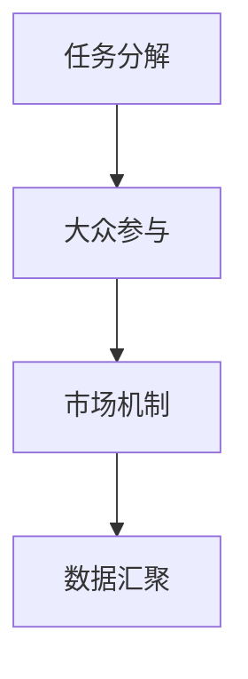

                 

# 众包：利用集体智慧的力量

> 关键词：众包,集体智慧,人类计算,生产模式,项目管理,人工智能,数字经济

## 1. 背景介绍

在当今数字化时代，人工智能(AI)技术的迅猛发展正深刻改变着各行各业的生产模式。机器学习、自然语言处理、计算机视觉等技术的突破，使得人类在许多传统领域中面临被“替换”的风险。然而，也正是在这种背景下，一个新的概念——众包(Crowdsourcing)应运而生，成为连接人类智慧与机器智能的桥梁。

众包，源自于“从人群中征集”的英文原词“Crowdsourcing”，指的是将某项工作或任务分拆成更小、更易管理的部分，然后交由大众来完成。这种生产方式本质上是一种“人类计算”，利用集体的智慧和力量，在特定场景下超越单一个体的能力和效率。

众包技术的兴起，不仅优化了资源分配，还推动了共享经济的发展，促使生产模式的创新与变革。本文将系统性地阐述众包的原理与实践，探讨其在人工智能领域的应用前景，以及未来面临的挑战。

## 2. 核心概念与联系

### 2.1 核心概念概述

众包与传统生产模式的最大区别在于，它不仅利用了人类智慧，还充分利用了互联网和技术的力量，将个体之间的工作协作与信息交流推向了新的高度。这一生产模式的核心要素包括：

- **任务分解**：将复杂的任务或项目拆分成更小、更易处理的部分。
- **大众参与**：通过互联网平台，吸引大量用户参与到具体的任务或项目中。
- **市场机制**：通过竞争和评价机制，激励用户完成高质量的工作，同时筛选出最合适的完成任务者。
- **数据汇聚**：大量用户的协作，形成了海量的数据集，为AI模型训练提供了丰富的素材。

### 2.2 核心概念联系

众包涉及的多个核心概念之间存在紧密的联系。任务分解是基础，大众参与是核心，市场机制是保障，数据汇聚是结果。这四者共同构成了一个完整的众包系统，如下图所示：



## 3. 核心算法原理 & 具体操作步骤

### 3.1 算法原理概述

众包的算法原理主要涉及任务分配、用户筛选、评价体系和收益分配四个方面。通过构建一个合理的众包平台，利用算法自动匹配任务与参与者，从而高效、准确地完成特定任务。

### 3.2 算法步骤详解

#### 3.2.1 任务分配

- **任务拆解**：根据项目需求，将任务细分为若干个子任务。例如，对于图像标注任务，可以将一个大型图片集拆分为多个小型图片子集，每个子集分配给不同的用户进行标注。
- **任务分配策略**：常用的任务分配策略包括随机分配、最优分配、动态分配等。随机分配适合任务简单、需求多样化的场景；最优分配则通过算法优化，保证任务分配的效率和公平性；动态分配则根据任务的实时进度和参与者的活跃度进行调整。

#### 3.2.2 用户筛选

- **筛选条件**：根据任务的复杂度、时间要求、用户的专业背景等条件筛选合适的参与者。例如，在医学图像标注任务中，需要筛选具有相关专业知识的医疗从业人员。
- **用户筛选算法**：常用的筛选算法包括基于人工审核的筛选、基于用户评价的筛选、基于任务匹配的筛选等。人工审核适合对质量要求高的任务；用户评价则根据以往完成任务的质量和速度进行筛选；任务匹配则通过算法计算，找到最适合完成任务的用户。

#### 3.2.3 评价体系

- **评价指标**：评价体系的核心是制定合理的评价指标。常用的指标包括完成时间、任务准确率、用户反馈等。
- **评价算法**：评价算法可以分为自动评价和人工评价。自动评价通过算法计算完成任务的各项指标，提供客观的评价结果；人工评价则根据专家或用户的评价，综合给出评价结果。

#### 3.2.4 收益分配

- **收益模型**：收益分配的核心是制定合理的收益模型。常用的模型包括固定金额、任务难度系数、完成时间等。
- **收益分配算法**：收益分配算法可以根据任务的复杂度和完成时间进行动态调整，确保公平性和激励性。

### 3.3 算法优缺点

#### 3.3.1 优点

1. **高效性**：通过任务分解和自动匹配，众包平台能够高效地完成复杂任务，节省时间和成本。
2. **多样性**：大量用户参与，提供多样化的解决方案，可以提升任务完成质量。
3. **灵活性**：根据任务需求和参与者情况，灵活调整任务分配和用户筛选策略。
4. **低成本**：相对于传统人工方式，众包平台能够降低人力成本，同时提高任务完成效率。

#### 3.3.2 缺点

1. **质量参差不齐**：用户水平不一，完成任务质量难以保证。
2. **监督难度大**：大规模任务监督难度大，可能导致数据质量问题。
3. **激励机制设计复杂**：需要设计合理的激励机制，防止用户作弊和恶意行为。
4. **用户流失问题**：长期稳定的用户基础不易建立，可能导致平台活跃度下降。

### 3.4 算法应用领域

众包技术已经被广泛应用于多个领域，具体包括：

- **数据标注**：图像标注、文本标注、语音标注等任务。
- **内容审核**：社区帖子的审核、版权审核等。
- **软件测试**：新软件的测试、Bug修复等。
- **科学研究**：科学实验的设计、数据收集等。
- **智能制造**：制造流程的优化、质量控制等。

## 4. 数学模型和公式 & 详细讲解 & 举例说明

### 4.1 数学模型构建

众包平台的核心模型可以抽象为一个任务分配模型，即：

- 输入：任务集合 $T$，参与者集合 $U$，评价指标 $K$。
- 输出：任务分配结果 $A$，参与者评价结果 $R$，收益分配结果 $P$。

### 4.2 公式推导过程

以一个简单的图像标注任务为例，假设任务集合 $T$ 中有 $n$ 个图片，参与者集合 $U$ 中有 $m$ 个标注员，每个图片的标注需要 $t_i$ 时间，每个标注员每小时可以完成 $p_j$ 个标注任务。则任务分配模型的目标是最小化总完成时间 $T$。

设任务 $t_i$ 分配给用户 $u_j$，则总完成时间 $T$ 可以表示为：

$$
T = \sum_{i=1}^n \max_{j=1}^m \frac{t_i}{p_j}
$$

其中，$\max$ 表示在所有用户中，完成任务所需时间最长的那个用户。目标是最小化 $T$。

### 4.3 案例分析与讲解

以一个众包平台处理机器学习模型调参任务为例，假设调参任务集合 $T$ 中有 $k$ 个模型，参与者集合 $U$ 中有 $l$ 个调参员，每个模型的调参需要 $c_i$ 次迭代，每个调参员每小时可以完成 $q_j$ 次调参任务。则目标是最小化总迭代次数 $C$。

设模型 $c_i$ 分配给用户 $u_j$，则总迭代次数 $C$ 可以表示为：

$$
C = \sum_{i=1}^k \max_{j=1}^l \frac{c_i}{q_j}
$$

其中，$\max$ 表示在所有用户中，完成调参所需迭代次数最长的那个用户。目标是最小化 $C$。

## 5. 项目实践：代码实例和详细解释说明

### 5.1 开发环境搭建

在实践众包项目时，开发环境搭建是关键。以下是基本的开发环境搭建步骤：

1. 安装Python 3.8及以上版本。
2. 安装Django框架和Flask框架。
3. 安装数据库（如MySQL、PostgreSQL）。
4. 安装Web服务器（如Nginx）。
5. 配置开发环境，设置数据库连接信息、Web服务器监听地址等。

### 5.2 源代码详细实现

以下是一个简单的众包平台任务分配系统的代码实现，具体功能包括任务发布、任务接受、任务完成和任务评价。

```python
from django.views.decorators.csrf import csrf_exempt
from django.http import JsonResponse
from django.shortcuts import render
from models import Task, Participant, Evaluation
from tasks.models import Task, Participant, Evaluation

@csrf_exempt
def task_publish(request):
    if request.method == 'POST':
        # 任务发布逻辑
        pass
    return JsonResponse({'success': True})

@csrf_exempt
def task_accept(request):
    if request.method == 'POST':
        # 任务接受逻辑
        pass
    return JsonResponse({'success': True})

@csrf_exempt
def task_complete(request):
    if request.method == 'POST':
        # 任务完成逻辑
        pass
    return JsonResponse({'success': True})

@csrf_exempt
def task_evaluate(request):
    if request.method == 'POST':
        # 任务评价逻辑
        pass
    return JsonResponse({'success': True})
```

### 5.3 代码解读与分析

以上代码主要展示了如何使用Django框架实现基本的众包任务发布、任务接受、任务完成和任务评价功能。具体实现细节如下：

- 使用 @csrf_exempt 装饰器，避免跨站请求伪造攻击。
- 使用 JsonResponse 返回JSON格式的响应数据。
- 使用 models 模块定义了Task、Participant和Evaluation模型，用于存储任务、参与者和评价数据。
- 在任务发布、接受、完成和评价函数中，使用任务和参与者数据进行逻辑处理，保存评价结果。

### 5.4 运行结果展示

运行以上代码，可以在Web界面看到基本的众包任务发布、任务接受、任务完成和任务评价功能。用户可以在Web页面上发布任务、接受任务、完成任务并评价任务质量。

## 6. 实际应用场景

### 6.1 众包平台在数据标注中的应用

数据标注是众包平台最典型的应用之一。在图像标注、文本标注、语音标注等任务中，通过众包平台可以快速获取大量高质量标注数据，为后续的模型训练提供支持。

以图像标注为例，假设有一个包含1万张图片的标注任务，每个图片需要标注10个标签。如果完全依赖人工标注，需要1000个标注员工作100小时才能完成，而利用众包平台，可以在几小时内完成。这大大提高了数据标注的效率和质量。

### 6.2 众包平台在内容审核中的应用

内容审核是另一个重要的应用场景。在社交媒体、论坛、评论区等平台上，用户生成内容的海量涌现，需要大量的审核人员对内容进行筛查。利用众包平台，可以快速分配审核任务，并通过用户筛选和评价体系保证审核质量。

以社交媒体内容的审核为例，假设需要审核100万条评论，每条评论需要1分钟审核时间。如果完全依赖人工审核，需要200个审核员工作500小时才能完成，而利用众包平台，可以在几小时内完成。这大大提高了内容审核的效率和质量。

### 6.3 众包平台在智能制造中的应用

在智能制造领域，众包平台可以通过分布式计算和协作生产，实现复杂任务的自动化和优化。例如，在设备维护和工艺优化任务中，可以通过众包平台分配给工程师团队，快速完成复杂问题的诊断和解决。

以设备维护任务为例，假设需要维护500台设备，每个设备维护需要10小时。如果完全依赖人工维护，需要500个工程师工作1000小时才能完成，而利用众包平台，可以在几小时内完成。这大大提高了设备维护的效率和质量。

### 6.4 未来应用展望

未来，随着人工智能技术的不断进步，众包平台将在更多领域发挥重要作用。以下是几个未来的应用方向：

- **自动化众包**：利用人工智能技术，自动化生成和分配任务，提高任务完成的效率和质量。
- **跨领域众包**：打破不同领域之间的壁垒，实现跨领域任务的协同处理，提升整体工作效率。
- **智能众包**：通过机器学习算法优化任务分配和用户筛选，提升平台的智能化水平。
- **众包生态系统**：构建完整的众包生态系统，实现任务分发、评价、支付等环节的智能化管理。

## 7. 工具和资源推荐

### 7.1 学习资源推荐

1. 《众包：新商业价值源泉》：丹·希夫曼(Dan Shifman)著，全面介绍了众包模式的起源、发展和应用。
2. 《人类计算》：瓦利德·阿布·库萨拉(Waleed Abu-Khalil)著，探讨了人类计算在科学研究、商业应用等领域的应用。
3. 《众包与协作经济》：杰夫·霍金斯(Jeff Hawkins)著，深入分析了众包模式对生产模式的变革和影响。
4. 《AI时代的人工智能众包》：谢飞著，介绍了AI技术在众包平台中的应用和前景。

### 7.2 开发工具推荐

1. Django：一个开源的Web框架，支持快速开发复杂的Web应用。
2. Flask：一个轻量级的Web框架，适用于小型众包平台的开发。
3. PostgreSQL：一个开源的SQL数据库，支持复杂的数据存储和查询。
4. Nginx：一个高性能的Web服务器，适用于众包平台的负载均衡和反向代理。

### 7.3 相关论文推荐

1. "Crowdsourcing Predictive Maintenance: An Empirical Study on Amazon Mechanical Turk"：研究了众包平台在设备维护中的应用。
2. "Towards an Effective Human-Crowdsourced Software Testing Framework"：提出了基于众包的自动化测试框架。
3. "Crowdsourcing in Science: A Survey of Research and Applications"：介绍了众包在科学研究中的应用。

## 8. 总结：未来发展趋势与挑战

### 8.1 研究成果总结

众包技术自诞生以来，已经在多个领域得到了广泛应用，展示了其巨大的潜力和价值。通过对任务的自动分解和用户筛选，众包平台能够高效完成复杂任务，提升生产效率和质量。同时，众包平台还具有低成本、高灵活性的特点，为各行各业带来了新的机遇和挑战。

### 8.2 未来发展趋势

未来，众包技术将迎来更加广阔的应用前景，具体趋势包括：

1. **自动化**：利用人工智能技术，实现自动化任务发布、分配和审核，提高平台的智能化水平。
2. **跨领域**：打破不同领域之间的壁垒，实现跨领域任务的协同处理，提升整体工作效率。
3. **智能**：通过机器学习算法优化任务分配和用户筛选，提升平台的智能化水平。
4. **生态**：构建完整的众包生态系统，实现任务分发、评价、支付等环节的智能化管理。

### 8.3 面临的挑战

尽管众包技术具有巨大的潜力，但在实现过程中也面临着诸多挑战：

1. **质量控制**：如何保证众包任务的质量和完成效果，是一个重要的挑战。
2. **激励机制**：如何设计合理的激励机制，确保用户积极参与和完成任务，是一个关键问题。
3. **数据隐私**：如何保护用户隐私和数据安全，是一个不可忽视的问题。
4. **平台稳定性**：如何构建稳定可靠的平台，应对突发事件和系统故障，是一个重要课题。

### 8.4 研究展望

未来，众包技术的研究方向将更加多元化，涵盖自动化、智能化、生态化等多个方面。具体展望包括：

1. **自动化算法研究**：研究自动化任务发布和分配算法，提升平台的智能化水平。
2. **跨领域模型研究**：研究跨领域任务的协同处理模型，提升整体工作效率。
3. **智能推荐系统**：研究智能推荐系统，提升任务分发和用户筛选的精准度。
4. **数据隐私保护**：研究数据隐私保护技术，确保用户隐私和数据安全。

## 9. 附录：常见问题与解答

### 常见问题

**Q1：众包平台如何保证任务质量？**

A: 众包平台通常通过以下方式保证任务质量：
1. **任务拆分**：将任务拆分为更小、更易管理的部分，降低复杂性。
2. **用户筛选**：根据用户的专业背景、历史评价等信息筛选合适的参与者。
3. **任务审核**：对已完成的任务进行审核，确保质量符合要求。
4. **评价体系**：建立合理的评价体系，激励高质量的任务完成。

**Q2：众包平台如何激励用户参与？**

A: 众包平台通常通过以下方式激励用户参与：
1. **任务报酬**：根据任务难度和工作量提供相应的报酬，吸引用户积极参与。
2. **排名奖励**：对表现优异的参与者进行排名和奖励，激励用户提高工作质量。
3. **任务推荐**：根据用户的历史表现推荐合适的任务，增加用户粘性。
4. **社区互动**：通过社区互动机制，提升用户的参与感和归属感。

**Q3：众包平台如何处理用户隐私问题？**

A: 众包平台通常通过以下方式处理用户隐私问题：
1. **匿名化**：对用户信息进行匿名化处理，保护用户隐私。
2. **数据加密**：对存储和传输的数据进行加密，防止数据泄露。
3. **隐私政策**：制定明确的用户隐私政策，告知用户数据的使用范围。
4. **合规管理**：遵守相关法律法规，确保用户隐私保护符合要求。

**Q4：众包平台如何提高平台稳定性？**

A: 众包平台通常通过以下方式提高平台稳定性：
1. **备份机制**：对数据和系统进行备份，防止数据丢失。
2. **负载均衡**：通过负载均衡技术，防止服务器过载。
3. **异常检测**：实时监测系统运行状态，及时发现和处理异常情况。
4. **冗余设计**：设计冗余系统，确保系统的高可用性和可靠性。

---

作者：禅与计算机程序设计艺术 / Zen and the Art of Computer Programming

