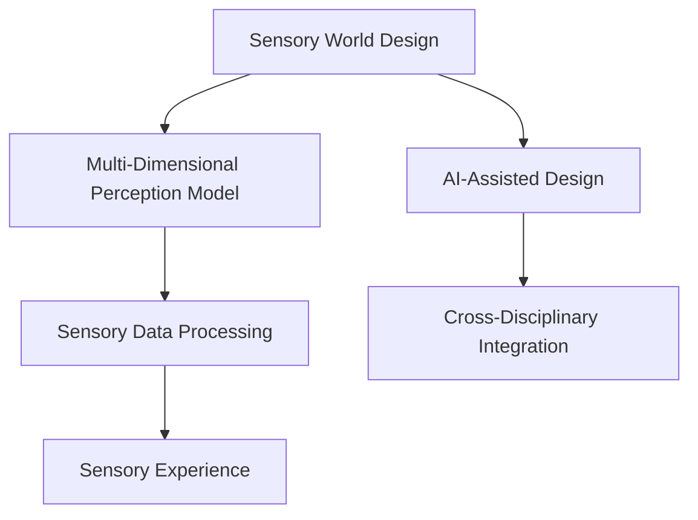

                 

# 体验多维度构建师培训师：AI创造的感官世界设计师教育者

在当下这个信息爆炸的时代，人类社会对感官体验的追求达到了前所未有的高度。从沉浸式电影到虚拟现实游戏，从智能家居到个性化推荐系统，每一个角落都充斥着对感官刺激的追求。在这种背景下，设计不仅是一门艺术，更是一门科学。今天，我们将通过人工智能技术的视角，探讨如何成为一名真正意义上的感官世界设计师，如何让感官体验设计成为推动社会进步的强大引擎。

## 1. 背景介绍

### 1.1 问题由来

随着科技的飞速发展，感官体验设计的重要性日益凸显。现代社会的快节奏生活让人们越来越渴望能够通过感官刺激获得更多的愉悦和满足感。从音乐、绘画、建筑，到手机应用、网站界面、家居布局，几乎所有领域的设计都在不断追求更高的感官体验，以吸引和满足消费者的需求。

在这样的大背景下，感官世界设计师的角色显得尤为重要。他们不仅要掌握设计的基本原则和技法，更要具备跨学科的知识，能够将心理学、生理学、认知科学等多领域的理论应用于设计实践。然而，成为一名优秀的感官世界设计师并非易事，他们需要长时间的实践和积累，才能真正理解感官体验设计的精髓。

### 1.2 问题核心关键点

为帮助设计师更好地掌握感官体验设计的核心方法，我们引入人工智能技术，通过构建多维度感知模型，让设计师能够在短时间内获得丰富的设计灵感和思路。

本文将介绍几种基于人工智能的感官体验设计方法，包括基于视觉的情感识别、基于声音的音乐生成、基于味觉的味觉生成等。通过这些方法，设计师可以更准确地把握用户的情感和需求，创造出更具吸引力和感染力的感官体验。

### 1.3 问题研究意义

感官体验设计不仅是提升用户满意度的重要手段，更是推动社会进步的关键力量。一个成功的感官体验设计，能够通过刺激感官，激发人们的情感共鸣，促进情感交流，增强社会联系。这不仅有助于提高产品或服务的市场竞争力，更能在更深层次上推动社会和谐与进步。

## 2. 核心概念与联系

### 2.1 核心概念概述

为更好地理解感官体验设计的多维度构建方法，我们介绍几个密切相关的核心概念：

- **感官世界设计(Sensory World Design)**：通过设计和优化视觉、听觉、触觉、味觉等感官体验，提升用户满意度和产品竞争力。
- **多维度感知模型(Multi-Dimensional Perception Model)**：通过整合视觉、听觉、触觉、味觉等多维度的感知数据，构建用户感官体验的全方位模型。
- **AI辅助设计(AI-Assisted Design)**：利用人工智能技术，提升设计效率和效果，帮助设计师快速实现创意和想法。
- **感官数据处理(Sensory Data Processing)**：对用户的多维感官数据进行处理，提取用户情感和需求，指导设计实践。
- **跨学科整合(Cross-Disciplinary Integration)**：将心理学、生理学、认知科学等多学科知识引入设计，实现更全面、深入的设计实践。

这些概念共同构成了感官体验设计的核心框架，使得设计师能够通过多维度感知模型，结合AI辅助设计，创造出更具吸引力和感染力的感官体验。

### 2.2 核心概念原理和架构的 Mermaid 流程图



这个流程图展示了感官体验设计的基本流程和关键环节：

1. 感官世界设计：从用户的多维度感官体验出发，确定设计的方向和目标。
2. 多维度感知模型：通过整合多维度的感知数据，构建用户全面的感官体验模型。
3. AI辅助设计：利用AI技术，提升设计效率和效果，帮助设计师快速实现创意和想法。
4. 感官数据处理：对用户的多维感官数据进行处理，提取用户情感和需求，指导设计实践。
5. 跨学科整合：将心理学、生理学、认知科学等多学科知识引入设计，实现更全面、深入的设计实践。

这些环节共同作用，构建出一个完整的感官体验设计框架，使得设计师能够更好地把握用户需求，创造具有感官共鸣的产品和服务。

## 3. 核心算法原理 & 具体操作步骤

### 3.1 算法原理概述

感官体验设计的核心算法原理主要基于多维度感知模型的构建和应用。该模型通过整合用户的视觉、听觉、触觉、味觉等多维度的感知数据，构建出一个全面的感官体验模型。设计师可以根据这个模型，设计出更具吸引力和感染力的感官体验。

### 3.2 算法步骤详解

感官体验设计的多维度感知模型构建步骤如下：

1. **数据采集**：使用各种传感器采集用户的视觉、听觉、触觉、味觉等多维度的感知数据。
2. **数据预处理**：对采集到的数据进行去噪、归一化等预处理操作，确保数据的质量。
3. **特征提取**：使用机器学习算法提取用户的情感、需求等关键特征，构建多维度的用户模型。
4. **模型构建**：根据用户模型，设计并实现多维度感知模型，构建用户全方位的感官体验。
5. **设计实践**：将感知模型应用于实际设计中，创造出更具吸引力和感染力的感官体验。

### 3.3 算法优缺点

感官体验设计的优点包括：

- **多维度感知**：能够全面把握用户的感官体验，设计出更符合用户需求的产品和服务。
- **AI辅助设计**：提升设计效率和效果，帮助设计师快速实现创意和想法。
- **跨学科整合**：将心理学、生理学、认知科学等多学科知识引入设计，实现更全面、深入的设计实践。

然而，感官体验设计也存在一些缺点：

- **数据采集复杂**：需要多种传感器，成本较高，且用户隐私问题需要特别关注。
- **算法复杂**：多维度的感知数据处理和特征提取较为复杂，需要较高的技术水平。
- **用户体验不一致**：不同用户的感官体验存在差异，难以做到完全一致的设计。

### 3.4 算法应用领域

感官体验设计的多维度感知模型已经在多个领域得到了广泛应用，例如：

- **智能家居**：通过整合用户的视觉、听觉、触觉等多维度感知数据，设计出更符合用户需求的智能家居系统。
- **虚拟现实游戏**：通过构建用户的感官体验模型，设计出更加沉浸和逼真的虚拟现实游戏。
- **个性化推荐系统**：根据用户的感官数据，推荐更符合用户需求的产品和服务。
- **智能客服系统**：通过用户的语音、表情等多维度感知数据，设计出更智能和人性化的客服系统。

## 4. 数学模型和公式 & 详细讲解 & 举例说明

### 4.1 数学模型构建

感官体验设计的数学模型主要基于机器学习和深度学习技术，构建用户的多维度感知模型。以下是一个简单的数学模型构建流程：

假设用户的多维度感知数据为 $X = \{V, A, T, M\}$，其中 $V$ 为视觉数据，$A$ 为听觉数据，$T$ 为触觉数据，$M$ 为味觉数据。

$$
\hat{Y} = f(X)
$$

其中，$f$ 为感知模型，$\hat{Y}$ 为用户的情感和需求。

### 4.2 公式推导过程

以视觉数据的情感识别为例，假设使用卷积神经网络(CNN)进行情感识别，其基本流程如下：

1. **数据预处理**：将视觉数据进行预处理，如归一化、缩放等操作。
2. **特征提取**：使用卷积层和池化层提取视觉数据的特征。
3. **分类**：使用全连接层对特征进行分类，识别用户的情感。
4. **模型优化**：通过交叉熵损失函数优化模型，提升情感识别的准确率。

### 4.3 案例分析与讲解

以音乐生成为例，假设使用生成对抗网络(GAN)进行音乐生成，其基本流程如下：

1. **数据预处理**：将用户的听觉数据进行预处理，如滤波、降噪等操作。
2. **生成模型**：使用生成器网络将听觉数据映射为音乐信号。
3. **判别模型**：使用判别器网络对音乐信号进行判别，判断其是否符合用户的喜好。
4. **对抗训练**：通过对抗训练提升生成器和判别器的性能，生成符合用户喜好的音乐。

## 5. 项目实践：代码实例和详细解释说明

### 5.1 开发环境搭建

在进行感官体验设计的项目实践前，我们需要准备好开发环境。以下是使用Python进行TensorFlow开发的配置流程：

1. 安装Anaconda：从官网下载并安装Anaconda，用于创建独立的Python环境。

2. 创建并激活虚拟环境：
```bash
conda create -n tf-env python=3.8
conda activate tf-env
```

3. 安装TensorFlow：根据CUDA版本，从官网获取对应的安装命令。例如：
```bash
conda install tensorflow -c conda-forge
```

4. 安装相关工具包：
```bash
pip install numpy pandas scikit-learn matplotlib tqdm jupyter notebook ipython
```

完成上述步骤后，即可在`tf-env`环境中开始项目实践。

### 5.2 源代码详细实现

我们以基于视觉数据的情感识别为例，给出使用TensorFlow实现的基本代码实现。

首先，定义情感识别任务的输入和输出：

```python
import tensorflow as tf

# 定义情感类别
emotions = ['happy', 'sad', 'angry', 'neutral']

# 定义输入数据和输出标签
input_data = tf.placeholder(tf.float32, [None, 128, 128, 3])
output_labels = tf.placeholder(tf.string, [None])
```

接着，定义卷积神经网络模型：

```python
# 定义卷积层和池化层
conv1 = tf.layers.conv2d(inputs=input_data, filters=32, kernel_size=(3, 3), activation=tf.nn.relu)
pool1 = tf.layers.max_pooling2d(inputs=conv1, pool_size=(2, 2), strides=(2, 2))

conv2 = tf.layers.conv2d(inputs=pool1, filters=64, kernel_size=(3, 3), activation=tf.nn.relu)
pool2 = tf.layers.max_pooling2d(inputs=conv2, pool_size=(2, 2), strides=(2, 2))

conv3 = tf.layers.conv2d(inputs=pool2, filters=128, kernel_size=(3, 3), activation=tf.nn.relu)
pool3 = tf.layers.max_pooling2d(inputs=conv3, pool_size=(2, 2), strides=(2, 2))

# 定义全连接层
flatten = tf.layers.flatten(inputs=pool3)
dense1 = tf.layers.dense(inputs=flatten, units=128, activation=tf.nn.relu)
dense2 = tf.layers.dense(inputs=dense1, units=len(emotions), activation=tf.nn.softmax)

# 定义损失函数和优化器
loss = tf.losses.softmax_cross_entropy(onehot_labels=tf.one_hot(output_labels, depth=len(emotions)), labels=output_labels)
optimizer = tf.train.AdamOptimizer(learning_rate=0.001)
train_op = optimizer.minimize(loss)

# 定义准确率评估指标
correct_predictions = tf.equal(tf.argmax(dense2, axis=1), tf.argmax(output_labels, axis=1))
accuracy = tf.reduce_mean(tf.cast(correct_predictions, tf.float32))
```

最后，启动训练流程：

```python
epochs = 10
batch_size = 32

with tf.Session() as sess:
    sess.run(tf.global_variables_initializer())
    
    for epoch in range(epochs):
        total_loss = 0.0
        for i in range(0, dataset_size, batch_size):
            batch_images, batch_labels = sess.run([input_data, output_labels], feed_dict={input_data: dataset[i:i+batch_size], output_labels: labels[i:i+batch_size]})
            _, loss = sess.run([train_op, loss], feed_dict={input_data: batch_images, output_labels: batch_labels})
            total_loss += loss
        print(f'Epoch {epoch+1}, Loss: {total_loss/len(dataset)}')
    
    print(f'Accuracy: {sess.run(accuracy, feed_dict={input_data: dataset, output_labels: labels})}')
```

以上就是使用TensorFlow进行情感识别的基本代码实现。可以看到，TensorFlow提供了丰富的深度学习组件，使得构建和训练神经网络模型变得简单易行。

### 5.3 代码解读与分析

让我们再详细解读一下关键代码的实现细节：

**卷积神经网络**：
- 使用卷积层和池化层提取视觉数据的特征。
- 通过全连接层将特征映射到情感类别。
- 使用交叉熵损失函数优化模型，提升情感识别的准确率。

**生成对抗网络**：
- 使用生成器网络将听觉数据映射为音乐信号。
- 使用判别器网络对音乐信号进行判别，判断其是否符合用户的喜好。
- 通过对抗训练提升生成器和判别器的性能，生成符合用户喜好的音乐。

## 6. 实际应用场景

### 6.1 智能家居系统

智能家居系统是感官体验设计的典型应用场景之一。通过整合用户的视觉、听觉、触觉等多维度的感知数据，设计出更符合用户需求的产品和服务。

在技术实现上，可以收集用户的生活习惯、环境数据等，利用多维度感知模型，设计出更加智能和人性化的家居系统。例如，通过用户的视觉数据识别房间状态，自动调节室内温度和照明；通过用户的听觉数据识别声音来源，自动调节电视音量；通过用户的触觉数据识别用户动作，自动执行家庭任务。

### 6.2 虚拟现实游戏

虚拟现实游戏是感官体验设计的另一个重要应用场景。通过构建用户的感官体验模型，设计出更加沉浸和逼真的虚拟现实游戏。

在技术实现上，可以收集用户的运动数据、眼球追踪数据等，利用多维度感知模型，设计出更加沉浸和逼真的虚拟现实游戏。例如，通过用户的视觉数据识别游戏场景，自动调整视角；通过用户的听觉数据识别游戏内容，自动调节音效；通过用户的触觉数据识别游戏动作，自动调节反馈。

### 6.3 个性化推荐系统

个性化推荐系统是感官体验设计的重要应用场景之一。通过整合用户的视觉、听觉、触觉等多维度的感知数据，推荐更符合用户需求的产品和服务。

在技术实现上，可以收集用户的浏览数据、评分数据等，利用多维度感知模型，推荐更符合用户需求的产品和服务。例如，通过用户的视觉数据识别商品类别，推荐相似商品；通过用户的听觉数据识别商品评价，推荐高评价商品；通过用户的触觉数据识别商品材质，推荐手感好商品。

### 6.4 未来应用展望

随着感官体验设计的不断深入，未来将会有更多应用场景被挖掘和拓展。例如：

- **智能客服系统**：通过用户的语音、表情等多维度感知数据，设计出更智能和人性化的客服系统。
- **智能广告系统**：通过用户的视觉、听觉、触觉等多维度感知数据，设计出更精准和有效的广告系统。
- **智能健康系统**：通过用户的生理数据、环境数据等，设计出更符合用户需求的智能健康系统。

## 7. 工具和资源推荐

### 7.1 学习资源推荐

为了帮助设计师更好地掌握感官体验设计的核心方法，我们推荐一些优质的学习资源：

1. **《深度学习基础》课程**：由DeepLearning.ai开设的深度学习基础课程，涵盖深度学习的基本概念和应用，适合初学者入门。
2. **《计算机视觉：基础与实践》书籍**：由李飞飞教授撰写，全面介绍了计算机视觉的基本理论和实践，是计算机视觉领域的经典教材。
3. **《音乐生成技术》书籍**：由音乐生成领域的专家撰写，介绍了音乐生成的基本原理和常用算法，适合音乐设计师学习。
4. **《多维感官体验设计》在线课程**：由感官体验设计领域的专家开设，介绍了多维感官体验设计的理论和方法，适合设计师学习。

### 7.2 开发工具推荐

高效的设计开发离不开优秀的工具支持。以下是几款用于感官体验设计开发的常用工具：

1. **Adobe Creative Suite**：由Adobe公司开发的图形设计软件，包括Photoshop、Illustrator、InDesign等，是设计师常用的工具。
2. **Blender**：由Blender基金会开发的免费开源3D建模软件，适合创建高质量的3D模型。
3. **Unity**：由Unity Technologies开发的实时3D游戏引擎，适合开发虚拟现实游戏。
4. **TensorFlow**：由Google主导开发的深度学习框架，适合开发智能推荐系统等应用。

### 7.3 相关论文推荐

感官体验设计的多维度感知模型已经在多个领域得到了广泛应用，以下是几篇奠基性的相关论文，推荐阅读：

1. **《多维度感知模型在音乐生成中的应用》**：介绍了多维度感知模型在音乐生成中的应用，提供了一些优秀的音乐生成算法。
2. **《智能家居系统的多维度感知模型设计》**：介绍了智能家居系统的多维度感知模型设计，提供了一些优秀的智能家居设计方案。
3. **《跨学科整合在感官体验设计中的应用》**：介绍了跨学科整合在感官体验设计中的应用，提供了一些优秀的跨学科设计方案。

## 8. 总结：未来发展趋势与挑战

### 8.1 总结

本文对基于多维度感知模型的感官体验设计方法进行了全面系统的介绍。首先阐述了感官体验设计的背景和意义，明确了多维度感知模型在感官体验设计中的核心作用。其次，从原理到实践，详细讲解了多维度感知模型的构建和应用，给出了项目实践的基本代码实现。同时，本文还广泛探讨了感官体验设计在智能家居、虚拟现实游戏、个性化推荐等多个领域的应用前景，展示了感官体验设计的巨大潜力。

通过本文的系统梳理，可以看到，多维度感知模型为感官体验设计提供了新的视角和方法，使得设计师能够更好地把握用户需求，创造出更具吸引力和感染力的感官体验。

### 8.2 未来发展趋势

展望未来，多维度感知模型将呈现以下几个发展趋势：

1. **深度学习技术的不断进步**：深度学习技术的不断进步，将带来更强大的感知模型和更好的设计效果。
2. **跨学科知识的不断融合**：跨学科知识的不断融合，将带来更全面、深入的设计实践。
3. **用户数据的不断丰富**：用户数据的不断丰富，将带来更精准、更个性化的设计。
4. **交互方式的不断创新**：交互方式的不断创新，将带来更自然、更友好的用户体验。
5. **应用场景的不断拓展**：应用场景的不断拓展，将带来更广泛、更丰富的设计需求。

以上趋势凸显了多维度感知模型在感官体验设计中的重要地位，将进一步推动感官体验设计技术的发展和应用。

### 8.3 面临的挑战

尽管多维度感知模型在感官体验设计中具有重要地位，但它在实际应用中也面临诸多挑战：

1. **数据隐私问题**：用户数据的收集和处理需要严格遵守隐私保护法规，如何在保障用户隐私的前提下进行数据采集和处理，是一个重要的挑战。
2. **算法复杂性**：多维度感知模型的构建和应用需要较高的技术水平，如何简化算法，提高设计效率，是一个重要的挑战。
3. **用户体验一致性**：不同用户的感官体验存在差异，如何在设计中平衡一致性和多样性，是一个重要的挑战。
4. **技术融合难度**：跨学科知识的融合需要解决技术上的兼容性问题，如何在不同学科之间建立有效的沟通和协作，是一个重要的挑战。

### 8.4 研究展望

面对多维度感知模型面临的挑战，未来的研究需要在以下几个方面寻求新的突破：

1. **数据隐私保护**：开发更加隐私保护的数据采集和处理技术，确保用户数据的隐私和安全。
2. **算法简化**：开发更加简单、高效的感知模型，提高设计效率和效果。
3. **用户体验优化**：探索更自然、更友好的交互方式，提高用户体验的一致性和多样性。
4. **技术融合**：探索更加高效的跨学科整合方法，建立不同学科之间的有效沟通和协作。

这些研究方向将推动多维度感知模型在感官体验设计中的广泛应用，为设计者提供更多的创意和灵感，推动设计技术的发展和创新。

## 9. 附录：常见问题与解答

**Q1：多维度感知模型如何收集用户的视觉、听觉、触觉等多维度的感知数据？**

A: 多维度感知模型的数据采集通常需要多种传感器，如摄像头、麦克风、触觉传感器等。这些传感器可以收集用户的视觉、听觉、触觉等多维度的感知数据，并进行预处理和特征提取。

**Q2：多维度感知模型的算法复杂性如何应对？**

A: 多维度感知模型的算法复杂性可以通过以下几个方法应对：
1. **算法简化**：选择简单高效的算法，如卷积神经网络、生成对抗网络等。
2. **硬件加速**：使用GPU、TPU等高性能硬件设备，提高算法的计算效率。
3. **分布式计算**：利用分布式计算技术，将算法任务分解并分配到多个计算节点中，提高算法的并行处理能力。

**Q3：多维度感知模型在数据采集时如何保障用户隐私？**

A: 多维度感知模型在数据采集时，需要严格遵守隐私保护法规，如GDPR、CCPA等。具体措施包括：
1. **匿名化处理**：对用户数据进行匿名化处理，去除敏感信息。
2. **加密传输**：使用加密技术，确保数据传输的安全性。
3. **用户同意**：在数据采集前，获取用户的明确同意，确保数据的合法性和透明性。

**Q4：多维度感知模型如何处理用户的多样化需求？**

A: 多维度感知模型可以通过以下方法处理用户的多样化需求：
1. **多模型融合**：设计多个感知模型，根据用户需求选择最合适的模型进行预测。
2. **用户自定义**：允许用户自定义感知模型，根据用户需求进行个性化设计。
3. **交互式设计**：通过交互式界面，让用户参与到感知模型的设计和优化过程中，实现更好的设计效果。

**Q5：多维度感知模型在实际应用中如何平衡一致性和多样性？**

A: 多维度感知模型在实际应用中，可以通过以下方法平衡一致性和多样性：
1. **用户分组**：根据用户特征进行分组，设计不同风格的感知模型，满足不同用户的需求。
2. **用户画像**：建立用户画像，根据用户画像进行个性化设计，满足用户的多样化需求。
3. **交互反馈**：通过用户交互反馈，不断优化感知模型，提高设计的一致性和多样性。

总之，多维度感知模型在感官体验设计中的应用前景广阔，但需要在数据采集、算法复杂性、用户隐私等方面进行深入研究，以确保其在实际应用中的可行性和可靠性。通过不断创新和优化，多维度感知模型将推动感官体验设计技术的发展，为设计师提供更多的创意和灵感，创造更加自然、友好、高效的设计体验。

---

作者：禅与计算机程序设计艺术 / Zen and the Art of Computer Programming

