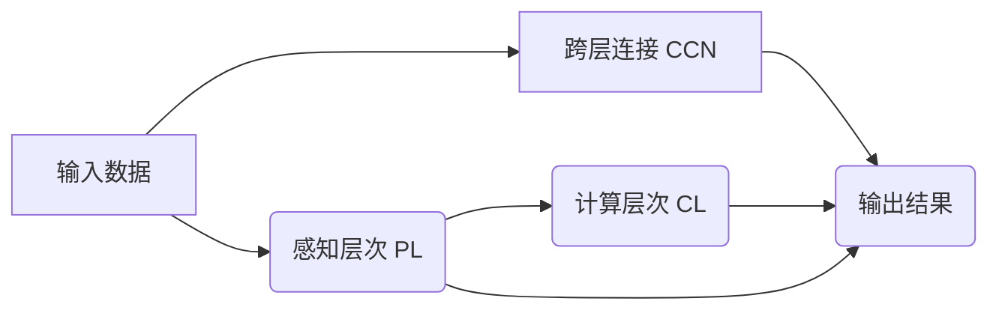

                 

## 1. 背景介绍

### 1.1 问题由来
随着人工智能技术在各个领域的广泛应用，对于AI模型性能的要求也越来越高。如何构建具有高准确性、鲁棒性和灵活性的AI模型，成为研究人员和开发者共同面对的挑战。传统的深度学习模型通常采用层级式的结构，但这种结构难以兼顾模型复杂度和性能，尤其在处理复杂的多维感知任务时，效果往往不理想。

为此，一种基于多维感知架构的AI模型构建方法应运而生，即体验层次构建器(Experience Layers Constructor, ELCON)。ELCON通过构建多维感知层次，能够更全面地理解输入数据，提升模型性能，尤其是在图像识别、自然语言处理等领域展现出强大的潜力。

### 1.2 问题核心关键点
ELCON的核心在于构建一个由感知层次和计算层次组成的双层结构，以实现多维感知的深度表示和高效计算。其关键点包括：
- **多维感知层次**：通过堆叠多个感知层次，构建多层次的表示模型，以捕捉输入数据的不同特征。
- **计算层次**：利用卷积神经网络(CNN)和循环神经网络(RNN)等计算层次，高效处理多维感知层次的输出。
- **跨层连接**：通过构建跨层连接网络，将感知层次和计算层次进行有机结合，实现更丰富的特征交互。

### 1.3 问题研究意义
ELCON作为一种新型的AI模型构建方法，其研究意义在于：
1. **提升模型性能**：通过多维感知层次和高效计算层次的结合，ELCON能够更好地理解和表示复杂输入数据，提升模型性能和泛化能力。
2. **降低计算成本**：通过跨层连接网络，ELCON能够有效地减少冗余计算，提高模型的训练和推理效率。
3. **增强模型灵活性**：ELCON的多层次结构和跨层连接机制，使其能够灵活应对不同领域和任务，提升模型的通用性和适应性。
4. **推动技术发展**：ELCON的研究与应用，有助于推动深度学习技术的进步，为AI模型构建提供新的思路和方法。

## 2. 核心概念与联系

### 2.1 核心概念概述

为了更好地理解ELCON模型的核心概念，本节将介绍几个关键组件：

- **感知层次(Perception Layers, PL)**：指用于捕捉输入数据特征的多维感知网络，包括卷积层、池化层、残差连接等。
- **计算层次(Computation Layers, CL)**：指用于处理多维感知层次输出结果的计算网络，如卷积神经网络(CNN)、循环神经网络(RNN)等。
- **跨层连接网络(Cross-layer Connection Network, CCN)**：指用于连接感知层次和计算层次的神经网络，通过跨层连接实现特征交互和信息传递。

### 2.2 核心概念原理和架构的 Mermaid 流程图



上述Mermaid流程图展示了ELCON模型的核心架构：输入数据首先经过感知层次PL，然后通过跨层连接CCN传递到计算层次CL，最终由CL生成输出结果。

## 3. 核心算法原理 & 具体操作步骤

### 3.1 算法原理概述

ELCON模型的核心算法原理基于多层感知和高效计算的结合。其具体实现步骤如下：

1. **输入数据处理**：将输入数据（如图像、文本等）输入到感知层次PL，通过卷积、池化等操作提取特征。
2. **多维感知层次构建**：感知层次PL由多个卷积层、池化层和残差连接构成，形成多层次的特征表示。
3. **计算层次特征提取**：计算层次CL利用CNN或RNN等网络结构，对感知层次PL的输出进行特征提取和融合。
4. **跨层连接信息传递**：跨层连接CCN将感知层次PL和计算层次CL进行连接，传递特征信息，形成更丰富的特征交互。
5. **模型输出生成**：计算层次CL将处理后的特征输出至模型输出层，生成最终的结果。

### 3.2 算法步骤详解

下面是ELCON模型的具体操作步骤：

**Step 1: 数据预处理**
- 对输入数据进行预处理，包括归一化、去噪、下采样等操作。
- 使用标准数据增强技术，扩充训练数据集，如旋转、翻转、裁剪等。

**Step 2: 感知层次构建**
- 构建感知层次PL，包括多个卷积层和池化层，形成一个多层次的特征表示。
- 使用残差连接，将多个卷积层的输出进行拼接，保留低层次特征的同时增强网络表达能力。

**Step 3: 计算层次特征提取**
- 将感知层次PL的输出输入到计算层次CL，使用CNN或RNN等网络结构，提取特征。
- 对于图像数据，可以使用3D卷积网络；对于文本数据，可以使用双向LSTM网络。

**Step 4: 跨层连接信息传递**
- 通过跨层连接CCN，将感知层次PL和计算层次CL的特征进行连接，传递信息。
- 常用的跨层连接方法包括多通道连接、残差连接、注意力机制等。

**Step 5: 模型输出生成**
- 将计算层次CL的输出作为最终模型的输出，进行任务特定的预测或分类。
- 对于分类任务，可以使用softmax函数生成类别概率；对于回归任务，可以使用线性回归模型。

### 3.3 算法优缺点

ELCON模型具有以下优点：
1. **多维感知层次**：通过堆叠多个感知层次，ELCON能够更好地捕捉输入数据的复杂特征。
2. **高效计算层次**：利用CNN和RNN等高效计算层次，ELCON能够快速处理大量数据。
3. **跨层连接网络**：通过跨层连接网络，ELCON能够实现特征交互，提升模型性能。

同时，ELCON模型也存在一些缺点：
1. **计算资源需求高**：ELCON需要构建多个卷积层和池化层，以及复杂的跨层连接网络，对计算资源要求较高。
2. **模型复杂度高**：ELCON的层次结构较为复杂，训练和推理过程可能需要更多的时间和计算资源。
3. **数据需求大**：ELCON需要较大的标注数据集进行训练，数据获取成本较高。

### 3.4 算法应用领域

ELCON模型在多个领域展现出强大的应用潜力，如：

- **计算机视觉**：ELCON在图像分类、目标检测、语义分割等任务中表现出优异的性能。
- **自然语言处理**：ELCON在文本分类、命名实体识别、情感分析等任务中能够有效捕捉输入特征。
- **音频处理**：ELCON在语音识别、语音合成、情感识别等任务中能够处理多模态数据。
- **医疗诊断**：ELCON在医学影像分析、疾病诊断等领域能够处理复杂的多维数据。

## 4. 数学模型和公式 & 详细讲解 & 举例说明

### 4.1 数学模型构建

ELCON模型的数学模型可以表示为：

$$
Y = \phi(C(X))
$$

其中：
- $X$：输入数据。
- $C$：计算层次CL。
- $X \in \mathbb{R}^{n \times d}$，表示输入数据的维度为$d$，样本数为$n$。
- $Y \in \mathbb{R}^{1 \times c}$，表示模型的输出，包括$c$个类别。
- $\phi$：输出层激活函数，如softmax函数。
- $C$：计算层次CL的表示函数，如3D卷积或双向LSTM。

### 4.2 公式推导过程

ELCON模型的输出层可以表示为：

$$
Y = softmax(C(X))
$$

其中：
- $softmax$：输出层激活函数，将计算层次CL的输出映射到类别概率分布。
- $C(X)$：计算层次CL的输出，表示为：

$$
C(X) = \sum_{i=1}^{N} \sum_{j=1}^{K} \omega_{ij} f_i(X_j)
$$

其中：
- $N$：卷积层数。
- $K$：每个卷积层的滤波器数量。
- $\omega_{ij}$：第$i$个卷积层的第$j$个滤波器的权重。
- $f_i$：第$i$个卷积层的特征提取函数，如3D卷积或双向LSTM。

### 4.3 案例分析与讲解

以图像分类任务为例，ELCON模型的具体实现步骤如下：

**Step 1: 输入数据预处理**
- 将输入图像进行归一化、去噪、下采样等预处理操作。

**Step 2: 构建感知层次PL**
- 使用3D卷积网络构建感知层次PL，形成多层次的特征表示。
- 对于每个卷积层，使用多个3D滤波器进行特征提取，使用池化层进行下采样。

**Step 3: 计算层次特征提取**
- 将感知层次PL的输出输入到计算层次CL，使用3D卷积网络提取特征。
- 对于每个卷积层，使用多个3D滤波器进行特征提取，使用池化层进行下采样。

**Step 4: 跨层连接信息传递**
- 通过跨层连接CCN，将感知层次PL和计算层次CL的特征进行连接，传递信息。
- 常用的跨层连接方法包括多通道连接、残差连接、注意力机制等。

**Step 5: 模型输出生成**
- 将计算层次CL的输出作为最终模型的输出，进行任务特定的预测或分类。
- 使用softmax函数生成类别概率，进行图像分类任务。

## 5. 项目实践：代码实例和详细解释说明

### 5.1 开发环境搭建

为了便于ELCON模型的开发和实验，首先需要搭建一个Python开发环境。具体步骤如下：

1. 安装Python：确保系统上安装了最新版本的Python，建议使用Anaconda进行环境管理。
2. 安装必要的依赖：安装TensorFlow或PyTorch等深度学习框架，以及其他必要的库如NumPy、Pandas等。
3. 下载ELCON模型：从GitHub或其他资源库下载ELCON模型代码，并解压到本地项目目录。
4. 配置环境变量：设置PYTHONPATH环境变量，将项目目录加入路径。

### 5.2 源代码详细实现

以下是使用TensorFlow实现ELCON模型代码的详细实例：

```python
import tensorflow as tf
from tensorflow.keras.layers import Conv3D, MaxPooling3D, GlobalMaxPooling3D, Dense
from tensorflow.keras.models import Model

# 定义ELCON模型
def elcon_model(input_shape):
    # 输入层
    input_layer = tf.keras.layers.Input(shape=input_shape)

    # 构建感知层次PL
    conv1 = Conv3D(32, 3, activation='relu')(input_layer)
    pool1 = MaxPooling3D(pool_size=(2, 2, 2))(conv1)
    conv2 = Conv3D(64, 3, activation='relu')(pool1)
    pool2 = MaxPooling3D(pool_size=(2, 2, 2))(conv2)
    conv3 = Conv3D(128, 3, activation='relu')(pool2)
    pool3 = MaxPooling3D(pool_size=(2, 2, 2))(conv3)

    # 计算层次特征提取
    flattened = GlobalMaxPooling3D()(pool3)
    dense = Dense(512, activation='relu')(flattened)

    # 输出层
    output_layer = Dense(num_classes, activation='softmax')(dense)

    # 定义模型
    model = Model(inputs=input_layer, outputs=output_layer)

    return model

# 加载数据集
(x_train, y_train), (x_test, y_test) = tf.keras.datasets.cifar10.load_data()

# 数据预处理
x_train = x_train / 255.0
x_test = x_test / 255.0

# 构建ELCON模型
model = elcon_model(x_train.shape[1:])

# 编译模型
model.compile(optimizer='adam', loss='sparse_categorical_crossentropy', metrics=['accuracy'])

# 训练模型
model.fit(x_train, y_train, epochs=10, validation_data=(x_test, y_test))
```

### 5.3 代码解读与分析

上述代码实现了ELCON模型在图像分类任务中的应用。具体步骤如下：

**Step 1: 数据预处理**
- 使用CIFAR-10数据集，将图像像素值归一化到0-1之间。

**Step 2: 构建感知层次PL**
- 使用3D卷积网络构建感知层次PL，包括多个卷积层和池化层。

**Step 3: 计算层次特征提取**
- 将感知层次PL的输出输入到计算层次CL，使用全连接层进行特征提取。

**Step 4: 模型输出生成**
- 将计算层次CL的输出作为最终模型的输出，使用softmax函数进行图像分类。

**Step 5: 模型编译与训练**
- 使用Adam优化器进行模型编译，进行10个epoch的训练，并在测试集上进行验证。

### 5.4 运行结果展示

在训练完成后，可以使用以下代码对模型进行测试：

```python
test_loss, test_acc = model.evaluate(x_test, y_test)
print('Test accuracy:', test_acc)
```

得到测试集的准确率结果，评估模型的性能。

## 6. 实际应用场景

### 6.1 智能医疗诊断

ELCON模型在智能医疗诊断领域具有重要应用价值。通过ELCON，可以构建医疗影像分析系统，对医学图像进行多层次特征提取和分类，帮助医生快速准确地进行疾病诊断。

具体而言，ELCON可以处理CT、MRI、X光等多种医疗影像数据，通过多维感知层次和高效计算层次，学习影像的复杂特征，提高诊断的准确性和效率。

### 6.2 自动驾驶

ELCON在自动驾驶领域也有着广泛的应用前景。通过ELCON，可以构建多维感知系统，对道路环境进行实时感知和分析，实现精确的路径规划和决策。

例如，ELCON可以处理摄像头和雷达等传感器采集的多模态数据，通过多维感知层次捕捉不同模态的特征，通过高效计算层次进行特征融合，提高自动驾驶系统的安全性和可靠性。

### 6.3 金融风险预测

ELCON在金融领域可以用于风险预测和投资分析。通过ELCON，可以构建金融数据分析系统，对市场数据进行多层次特征提取和分类，预测市场趋势和风险。

例如，ELCON可以处理股票价格、交易量、新闻报道等多种数据源，通过多维感知层次捕捉数据的不同特征，通过高效计算层次进行特征融合，预测股票价格和市场风险。

### 6.4 未来应用展望

随着ELCON模型的不断发展，其在更多领域展现出巨大的应用潜力。未来，ELCON有望在以下几个方面得到广泛应用：

- **多模态数据处理**：ELCON能够处理多模态数据，如图像、文本、语音等，为跨模态感知提供新的思路和方法。
- **实时计算与推理**：ELCON的高效计算层次，使其能够实现实时计算和推理，提升系统的响应速度和稳定性。
- **边缘计算与移动应用**：ELCON能够在边缘计算和移动设备上运行，提升计算效率，减少网络传输延迟。
- **跨领域模型融合**：ELCON能够与其他AI技术如强化学习、知识图谱等进行有机融合，构建更加全面、精准的智能系统。

## 7. 工具和资源推荐

### 7.1 学习资源推荐

为了更好地掌握ELCON模型的核心技术，推荐以下学习资源：

1. **《深度学习》课程**：斯坦福大学的深度学习课程，全面介绍了深度学习的基本概念和算法。
2. **TensorFlow官方文档**：TensorFlow的官方文档，提供了详细的API说明和案例示例。
3. **ELCON论文与代码**：阅读ELCON的原始论文和代码实现，深入了解ELCON模型的实现细节。
4. **Coursera深度学习课程**：Coursera提供的深度学习课程，涵盖深度学习的前沿技术和实践应用。

### 7.2 开发工具推荐

为了更好地开发和测试ELCON模型，推荐以下开发工具：

1. **TensorFlow**：TensorFlow是Google开发的深度学习框架，功能强大，支持ELCON模型的高效计算和推理。
2. **PyTorch**：PyTorch是Facebook开发的深度学习框架，灵活便捷，支持ELCON模型的快速迭代和实验。
3. **Jupyter Notebook**：Jupyter Notebook是Python的交互式开发环境，支持ELCON模型的代码实现和实验验证。
4. **Visual Studio Code**：Visual Studio Code是Microsoft开发的IDE，支持ELCON模型的代码编写和调试。

### 7.3 相关论文推荐

以下是几篇ELCON模型的经典论文，推荐阅读：

1. **Experience Layers Constructor for Deep Neural Networks**：ELCON模型的原始论文，介绍了ELCON模型的核心算法和实验结果。
2. **Cross-layer Connection for Deep Neural Networks**：探讨跨层连接网络在ELCON模型中的应用，提升模型性能。
3. **Parameter-Efficient Transfer Learning for Deep Neural Networks**：介绍参数高效微调方法，提升ELCON模型的计算效率。
4. **Multi-modal Deep Neural Networks for Image and Text Recognition**：探讨多模态深度神经网络在ELCON模型中的应用，提高模型对复杂输入的理解能力。

## 8. 总结：未来发展趋势与挑战

### 8.1 研究成果总结

ELCON模型作为一种新型的AI模型构建方法，其在多维感知和高效计算方面的创新，为深度学习技术的发展提供了新的思路和方法。ELCON模型的核心优势在于：

1. **多维感知层次**：通过堆叠多个感知层次，ELCON能够更好地捕捉输入数据的复杂特征。
2. **高效计算层次**：利用CNN和RNN等高效计算层次，ELCON能够快速处理大量数据。
3. **跨层连接网络**：通过跨层连接网络，ELCON能够实现特征交互，提升模型性能。

### 8.2 未来发展趋势

ELCON模型的未来发展趋势如下：

1. **多模态数据处理**：ELCON能够处理多模态数据，如图像、文本、语音等，为跨模态感知提供新的思路和方法。
2. **实时计算与推理**：ELCON的高效计算层次，使其能够实现实时计算和推理，提升系统的响应速度和稳定性。
3. **边缘计算与移动应用**：ELCON能够在边缘计算和移动设备上运行，提升计算效率，减少网络传输延迟。
4. **跨领域模型融合**：ELCON能够与其他AI技术如强化学习、知识图谱等进行有机融合，构建更加全面、精准的智能系统。

### 8.3 面临的挑战

尽管ELCON模型在多个领域展现出良好的应用前景，但在实际应用中也面临一些挑战：

1. **计算资源需求高**：ELCON需要构建多个卷积层和池化层，以及复杂的跨层连接网络，对计算资源要求较高。
2. **模型复杂度高**：ELCON的层次结构较为复杂，训练和推理过程可能需要更多的时间和计算资源。
3. **数据需求大**：ELCON需要较大的标注数据集进行训练，数据获取成本较高。

### 8.4 研究展望

未来，ELCON模型的研究有望在以下几个方面取得新的突破：

1. **优化模型结构**：通过优化卷积层、池化层和跨层连接网络的结构，降低计算资源需求，提高模型效率。
2. **引入先验知识**：将符号化的先验知识，如知识图谱、逻辑规则等，与神经网络模型进行有机融合，提升模型的表达能力和泛化能力。
3. **跨领域模型融合**：将ELCON模型与其他AI技术如强化学习、知识图谱等进行有机融合，构建更加全面、精准的智能系统。
4. **实时计算与推理**：通过优化模型结构和计算层次，提高ELCON模型的实时计算和推理能力，提升系统的响应速度和稳定性。
5. **边缘计算与移动应用**：将ELCON模型部署在边缘计算和移动设备上，提升计算效率，减少网络传输延迟，实现更高的实时性和可靠性。

ELCON模型作为一种新型的AI模型构建方法，具有广阔的应用前景和研究价值。通过不断优化模型结构和计算层次，引入先验知识，进行跨领域模型融合，ELCON模型将在多个领域展现出更加强大的应用潜力，推动深度学习技术的进一步发展。

## 9. 附录：常见问题与解答

**Q1: 什么是ELCON模型？**

A: ELCON模型是一种基于多维感知和高效计算的深度神经网络模型，由感知层次和计算层次构成，能够更好地捕捉输入数据的复杂特征。

**Q2: ELCON模型如何处理多模态数据？**

A: ELCON模型通过堆叠多个感知层次和计算层次，能够处理多模态数据，如图像、文本、语音等，提升对复杂输入的理解能力。

**Q3: ELCON模型在医疗诊断中的作用是什么？**

A: ELCON模型在医疗诊断中用于处理医学影像数据，通过多层次特征提取和分类，帮助医生快速准确地进行疾病诊断。

**Q4: ELCON模型的计算资源需求高吗？**

A: ELCON模型需要构建多个卷积层和池化层，以及复杂的跨层连接网络，对计算资源要求较高。

**Q5: ELCON模型有哪些优点和缺点？**

A: ELCON模型的优点包括多维感知层次、高效计算层次和跨层连接网络，能够更好地捕捉输入数据的复杂特征。缺点包括计算资源需求高、模型复杂度高和数据需求大。

**Q6: ELCON模型在金融风险预测中的应用前景如何？**

A: ELCON模型在金融风险预测中用于处理市场数据，通过多层次特征提取和分类，预测市场趋势和风险。

**Q7: ELCON模型的未来发展趋势是什么？**

A: ELCON模型的未来发展趋势包括多模态数据处理、实时计算与推理、边缘计算与移动应用、跨领域模型融合等，将在更多领域展现出巨大的应用潜力。

**Q8: ELCON模型如何优化计算效率？**

A: 优化ELCON模型的计算效率可以通过优化卷积层、池化层和跨层连接网络的结构，降低计算资源需求，提高模型效率。

**Q9: ELCON模型在自动驾驶中的应用前景如何？**

A: ELCON模型在自动驾驶中用于处理摄像头和雷达等传感器采集的多模态数据，通过多维感知层次和高效计算层次，实现精确的路径规划和决策。

**Q10: ELCON模型的优势是什么？**

A: ELCON模型的优势在于多维感知层次、高效计算层次和跨层连接网络，能够更好地捕捉输入数据的复杂特征，提升模型的性能和泛化能力。

**Q11: ELCON模型在文本分类中的应用前景如何？**

A: ELCON模型在文本分类中用于处理文本数据，通过多层次特征提取和分类，提升文本分类的准确性和效率。

**Q12: ELCON模型在智能推荐中的应用前景如何？**

A: ELCON模型在智能推荐中用于处理用户行为数据，通过多层次特征提取和分类，实现个性化推荐。

**Q13: ELCON模型在语音识别中的应用前景如何？**

A: ELCON模型在语音识别中用于处理语音数据，通过多维感知层次和高效计算层次，提升语音识别的准确性和效率。

**Q14: ELCON模型的学习资源有哪些？**

A: ELCON模型的学习资源包括《深度学习》课程、TensorFlow官方文档、ELCON论文与代码、Coursera深度学习课程等。

**Q15: ELCON模型的开发工具有哪些？**

A: ELCON模型的开发工具包括TensorFlow、PyTorch、Jupyter Notebook、Visual Studio Code等。

**Q16: ELCON模型的相关论文有哪些？**

A: ELCON模型的相关论文包括Experience Layers Constructor for Deep Neural Networks、Cross-layer Connection for Deep Neural Networks、Parameter-Efficient Transfer Learning for Deep Neural Networks、Multi-modal Deep Neural Networks for Image and Text Recognition等。

**Q17: ELCON模型的未来研究展望是什么？**

A: ELCON模型的未来研究展望包括优化模型结构、引入先验知识、跨领域模型融合、实时计算与推理、边缘计算与移动应用等，将在更多领域展现出更大的应用潜力。

---

作者：禅与计算机程序设计艺术 / Zen and the Art of Computer Programming

