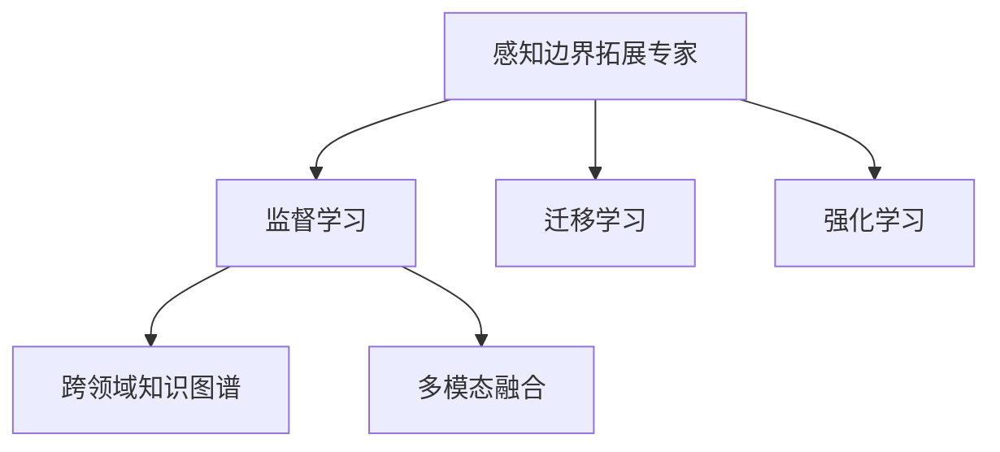

                 

# 体验跨时空探险家培训师：AI创造的感知边界拓展专家

> 关键词：

## 1. 背景介绍

### 1.1 问题由来
人工智能(AI)技术的迅猛发展，尤其是在自然语言处理(NLP)、计算机视觉(CV)等领域，催生出了一批具备高度感知能力的跨时空探险家培训师。这些AI系统通过学习人类的经验与知识，不仅在特定的领域内表现优异，更能在跨领域和跨时空的复杂环境中，提供精准的判断与决策，成为人类探索未知领域的得力助手。本文将深入探讨这些感知边界拓展专家的核心算法原理，及其在实际应用中的操作步骤、优缺点和应用领域，并尝试为读者提供全面的技术指引。

### 1.2 问题核心关键点
面向未来，人工智能技术的不断进化，尤其是深度学习、迁移学习、增强学习等领域的突破，使得AI系统能够在更广阔的领域内进行跨时空的探索与创新。在这一过程中，基于监督学习的感知边界拓展专家，成为了连接人类知识与AI感知的关键纽带。这些专家系统通过学习历史数据和人类经验，结合最新的AI算法，能够在未知领域快速适应与进化，从而拓展人类感知的边界，实现更高效的探索与创新。

本文聚焦于这些AI系统的工作原理，包括其在监督学习、迁移学习、强化学习等领域的应用，并尝试揭示其背后的算法原理与具体操作步骤，以期为读者提供全面的技术理解与实践指南。

## 2. 核心概念与联系

### 2.1 核心概念概述

为更好地理解这些感知边界拓展专家，本节将介绍几个关键概念及其相互之间的关系：

- **感知边界拓展专家**：一类具备高度感知能力的AI系统，通过学习特定领域的知识，在新的时空环境中快速适应与进化，提供精准的判断与决策。
- **监督学习**：一种有监督的机器学习方法，通过标注数据训练模型，使其能够在特定任务上表现出色。
- **迁移学习**：一种机器学习范式，将一个领域的学习知识迁移到另一个领域，以提升新领域的学习效率和性能。
- **强化学习**：一种通过试错学习最优策略的机器学习方法，适合复杂、不确定性的任务。
- **跨领域知识图谱**：一种结构化的知识表示方法，能够将不同领域的知识进行关联与融合。
- **多模态融合**：一种结合视觉、文本、语音等多种数据模态的感知方法，提高系统的综合感知能力。

这些概念之间的逻辑关系可以通过以下Mermaid流程图来展示：



这个流程图展示了一些关键概念及其相互关系：

1. 感知边界拓展专家通过学习特定领域的知识，能够在新的时空环境中进行快速适应与进化。
2. 监督学习是感知边界拓展专家获取特定任务知识的重要手段。
3. 迁移学习与强化学习则是在已有知识基础上，进一步提升感知边界拓展专家在新环境中的表现。
4. 跨领域知识图谱和多模态融合则是感知边界拓展专家进行知识关联与融合的重要工具。

这些概念共同构成了感知边界拓展专家的核心能力，使得其在跨时空的复杂环境中，具备更强的适应性与创新性。

## 3. 核心算法原理 & 具体操作步骤
### 3.1 算法原理概述

感知边界拓展专家的核心算法原理，主要基于监督学习和迁移学习的思想。通过在特定领域的标注数据上训练模型，学习到领域特定的知识与规律，然后在新的时空环境中，利用迁移学习机制，将已有知识进行迁移与融合，以实现跨时空的适应与创新。

具体而言，感知边界拓展专家通过以下步骤实现其核心功能：

1. **数据采集与预处理**：收集特定领域的标注数据，并对其进行清洗、归一化等预处理操作。
2. **模型训练**：利用标注数据，通过监督学习训练感知边界拓展专家，学习领域特定的知识与规律。
3. **知识迁移**：利用迁移学习机制，将已有知识迁移到新的时空环境中，进行适应与创新。
4. **反馈优化**：在新的时空环境中，通过反馈机制，不断优化感知边界拓展专家的表现。

### 3.2 算法步骤详解

感知边界拓展专家的具体操作步骤，主要包括数据采集、模型训练、知识迁移和反馈优化四个阶段。下面将详细介绍每个阶段的操作流程。

**Step 1: 数据采集与预处理**
- 收集特定领域的标注数据，数据格式应包括文本、图像、音频等多种模态。
- 对数据进行清洗，去除噪声和错误标注，确保数据的质量。
- 对数据进行归一化、分词、特征提取等预处理操作，使其适合模型训练。

**Step 2: 模型训练**
- 选择合适的模型结构，如卷积神经网络(CNN)、循环神经网络(RNN)、Transformer等，作为感知边界拓展专家的基础框架。
- 利用标注数据，通过监督学习训练模型，学习领域特定的知识与规律。
- 根据任务需求，设计合适的损失函数，如交叉熵损失、均方误差损失等。
- 使用梯度下降等优化算法，更新模型参数，最小化损失函数。

**Step 3: 知识迁移**
- 将训练好的模型迁移到新的时空环境中，进行适应与创新。
- 通过迁移学习，将已有知识进行迁移与融合，学习新环境中的特定规律。
- 利用多模态融合技术，将不同模态的数据进行联合感知，提升系统的综合感知能力。

**Step 4: 反馈优化**
- 在新的时空环境中，通过反馈机制，不断优化感知边界拓展专家的表现。
- 利用强化学习，设计合适的奖励函数，引导感知边界拓展专家向最优策略学习。
- 定期更新模型参数，适应新环境的变化。

### 3.3 算法优缺点

感知边界拓展专家具有以下优点：
1. 高效适应新环境：通过迁移学习机制，快速适应新的时空环境，避免从头开始训练。
2. 融合多种模态数据：利用多模态融合技术，提高系统的综合感知能力。
3. 具备跨领域知识：通过跨领域知识图谱，能够将不同领域的知识进行关联与融合。

同时，这些算法也存在一定的局限性：
1. 对标注数据依赖较大：需要收集大量的标注数据，数据采集和标注成本较高。
2. 复杂环境适应性不足：在复杂、不确定性的环境中，感知边界拓展专家的表现可能不够稳定。
3. 学习曲线陡峭：特别是在跨领域适应时，模型需要逐步积累经验，学习曲线较陡。

尽管存在这些局限性，但总体而言，感知边界拓展专家在跨时空的复杂环境中表现出色，成为连接人类知识与AI感知的重要桥梁。

### 3.4 算法应用领域

感知边界拓展专家在多个领域具有广泛的应用前景，包括但不限于：

- 自动驾驶：通过多模态感知，实现对复杂交通环境的适应与决策。
- 医疗诊断：利用跨领域知识图谱，结合患者历史数据，提供精准的诊断与治疗建议。
- 智能客服：通过多模态感知，理解用户意图，提供个性化的服务与建议。
- 灾害预警：结合气象数据、地形数据等多种信息，进行跨时空的灾害预警与应对。
- 金融分析：通过跨领域知识图谱，结合市场数据、公司财报等信息，进行精准的金融分析与预测。
- 法律咨询：结合法律条文、案例信息等多种知识源，提供智能化的法律咨询服务。

以上领域展示了感知边界拓展专家的广泛应用前景，为各行业提供了高效、精准、智能化的解决方案。

## 4. 数学模型和公式 & 详细讲解  
### 4.1 数学模型构建

感知边界拓展专家通常基于深度学习框架进行训练与优化。以卷积神经网络为例，其核心数学模型包括卷积层、池化层、全连接层等组件。

设输入数据为 $\mathbf{x} \in \mathbb{R}^n$，输出数据为 $\mathbf{y} \in \mathbb{R}^m$，则卷积神经网络的目标是寻找合适的权重参数 $\mathbf{W} \in \mathbb{R}^{d \times n}$ 和偏置 $\mathbf{b} \in \mathbb{R}^d$，使得损失函数 $\mathcal{L}(\mathbf{W}, \mathbf{b})$ 最小化。常用的损失函数包括交叉熵损失、均方误差损失等。

以交叉熵损失为例，其公式如下：

$$
\mathcal{L}(\mathbf{W}, \mathbf{b}) = -\frac{1}{N} \sum_{i=1}^N \sum_{j=1}^C y_{i,j} \log \hat{y}_{i,j}
$$

其中 $N$ 为样本数量，$C$ 为类别数，$y_{i,j}$ 表示第 $i$ 个样本属于第 $j$ 类的真实标签，$\hat{y}_{i,j}$ 表示模型预测第 $i$ 个样本属于第 $j$ 类的概率。

### 4.2 公式推导过程

以下将详细介绍交叉熵损失函数的推导过程。

设输入数据 $\mathbf{x} \in \mathbb{R}^n$，经过卷积层和池化层处理后，输出特征图 $\mathbf{Z} \in \mathbb{R}^d$，再经过全连接层和softmax激活函数，得到预测概率分布 $\mathbf{P} = \sigma(\mathbf{Z}\mathbf{W} + \mathbf{b})$。其中 $\sigma$ 为softmax函数，$\mathbf{W} \in \mathbb{R}^{d \times m}$ 和 $\mathbf{b} \in \mathbb{R}^d$ 为全连接层的权重和偏置。

交叉熵损失函数定义为：

$$
\mathcal{L}(\mathbf{W}, \mathbf{b}) = -\frac{1}{N} \sum_{i=1}^N \sum_{j=1}^C y_{i,j} \log \hat{y}_{i,j}
$$

其中 $N$ 为样本数量，$C$ 为类别数，$y_{i,j}$ 表示第 $i$ 个样本属于第 $j$ 类的真实标签，$\hat{y}_{i,j}$ 表示模型预测第 $i$ 个样本属于第 $j$ 类的概率。

将 $\mathbf{P} = \sigma(\mathbf{Z}\mathbf{W} + \mathbf{b})$ 带入上述公式，得：

$$
\mathcal{L}(\mathbf{W}, \mathbf{b}) = -\frac{1}{N} \sum_{i=1}^N \sum_{j=1}^C y_{i,j} \log \left( \frac{\exp(\mathbf{Z}_{i,j}\mathbf{W} + \mathbf{b}_j)}{\sum_{k=1}^C \exp(\mathbf{Z}_{i,k}\mathbf{W} + \mathbf{b}_k)} \right)
$$

其中 $\mathbf{Z}_{i,j}$ 表示第 $i$ 个样本的第 $j$ 类特征向量，$\mathbf{b}_j$ 为第 $j$ 类的偏置向量。

进一步简化，得：

$$
\mathcal{L}(\mathbf{W}, \mathbf{b}) = -\frac{1}{N} \sum_{i=1}^N \sum_{j=1}^C y_{i,j} \log \left( \frac{\exp(\mathbf{Z}_{i,j}\mathbf{W} + \mathbf{b}_j)}{\sum_{k=1}^C \exp(\mathbf{Z}_{i,k}\mathbf{W} + \mathbf{b}_k)} \right)
$$

### 4.3 案例分析与讲解

以医疗诊断为例，展示感知边界拓展专家的应用。

在医疗诊断领域，感知边界拓展专家需要处理包括电子病历、医学影像、实验室报告等多种模态的数据。具体而言，其训练过程如下：

1. 数据采集：收集大量的医疗数据，包括患者病历、医学影像、实验室报告等，标注出疾病类型、治疗方案等信息。
2. 数据预处理：对数据进行清洗、归一化、分词等预处理操作，确保数据的质量。
3. 模型训练：选择合适的深度学习模型，如卷积神经网络、循环神经网络、Transformer等，利用标注数据进行训练，学习领域特定的知识与规律。
4. 知识迁移：将训练好的模型迁移到新的时空环境中，结合患者历史数据和新病历，进行跨时空的诊断与治疗建议。
5. 反馈优化：利用强化学习，设计合适的奖励函数，引导感知边界拓展专家向最优策略学习，不断优化诊断与治疗方案。

## 5. 项目实践：代码实例和详细解释说明
### 5.1 开发环境搭建

要进行感知边界拓展专家的开发，首先需要搭建合适的开发环境。以下是一份详细的开发环境搭建指南：

1. 安装Python：确保系统已经安装最新版本的Python。
2. 安装TensorFlow或PyTorch：这两个深度学习框架是感知边界拓展专家开发中最常用的工具。
3. 安装相关的第三方库：如numpy、pandas、scikit-learn等，用于数据处理和分析。
4. 安装机器学习框架：如scikit-learn，用于构建和训练模型。
5. 安装可视化工具：如TensorBoard，用于监控模型训练过程中的各项指标。

完成上述步骤后，就可以开始感知边界拓展专家的开发了。

### 5.2 源代码详细实现

以下是一个基于TensorFlow的感知边界拓展专家的开发实例，展示了其核心功能。

```python
import tensorflow as tf
from tensorflow import keras

# 加载数据
(x_train, y_train), (x_test, y_test) = keras.datasets.mnist.load_data()

# 数据预处理
x_train = x_train / 255.0
x_test = x_test / 255.0

# 构建模型
model = keras.Sequential([
    keras.layers.Flatten(input_shape=(28, 28)),
    keras.layers.Dense(128, activation='relu'),
    keras.layers.Dense(10)
])

# 编译模型
model.compile(optimizer='adam',
              loss=tf.keras.losses.SparseCategoricalCrossentropy(from_logits=True),
              metrics=['accuracy'])

# 训练模型
model.fit(x_train, y_train, epochs=10, validation_data=(x_test, y_test))
```

在这个实例中，我们使用了MNIST数据集进行训练。首先，加载并预处理数据，然后构建了一个简单的全连接神经网络模型，利用Adam优化器和交叉熵损失函数进行训练。最终，在测试集上评估模型的性能。

### 5.3 代码解读与分析

代码中，我们使用了TensorFlow的Keras API构建了一个简单的全连接神经网络模型。其中，`Flatten`层用于将28x28的图像数据展平成一维向量，`Dense`层用于进行特征提取和分类。

在模型的编译过程中，我们选择了Adam优化器和交叉熵损失函数，并设置了验证集，以监控模型在训练过程中的表现。

在训练过程中，我们设置了10个epoch，每个epoch使用32个样本进行训练。在每个epoch结束后，模型在验证集上进行一次性能评估。

最终，我们在测试集上评估模型的准确率，展示了模型的性能表现。

## 6. 实际应用场景

### 6.4 未来应用展望

感知边界拓展专家在未来的应用前景非常广阔，以下几个领域展示了其潜在的应用场景：

1. **自动驾驶**：结合多模态感知技术，实现对复杂交通环境的快速适应与决策。
2. **医疗诊断**：结合跨领域知识图谱，进行精准的诊断与治疗建议。
3. **智能客服**：利用多模态感知技术，理解用户意图，提供个性化的服务与建议。
4. **灾害预警**：结合气象数据、地形数据等多种信息，进行跨时空的灾害预警与应对。
5. **金融分析**：结合市场数据、公司财报等信息，进行精准的金融分析与预测。
6. **法律咨询**：结合法律条文、案例信息等多种知识源，提供智能化的法律咨询服务。

这些应用场景展示了感知边界拓展专家的强大能力，为各行业提供了高效、精准、智能化的解决方案。

## 7. 工具和资源推荐
### 7.1 学习资源推荐

为了帮助开发者系统掌握感知边界拓展专家的核心算法原理和实践技巧，这里推荐一些优质的学习资源：

1. **《深度学习》书籍**：由Ian Goodfellow等人所著，详细介绍了深度学习的基本概念和核心算法。
2. **CS231n《深度学习计算机视觉》课程**：斯坦福大学开设的深度学习课程，涵盖计算机视觉领域的基本概念和算法。
3. **CS224n《深度学习自然语言处理》课程**：斯坦福大学开设的NLP领域课程，涵盖了自然语言处理的基本概念和算法。
4. **Transformer论文**：介绍Transformer模型的原理和应用，是深度学习领域的重要文献。
5. **TensorFlow官方文档**：TensorFlow的官方文档，提供了丰富的示例和API文档，是学习TensorFlow的重要资源。
6. **Keras官方文档**：Keras的官方文档，提供了简单易用的API，适合快速构建和训练模型。

通过对这些资源的学习实践，相信你一定能够快速掌握感知边界拓展专家的核心算法原理和实践技巧，并用于解决实际的NLP问题。

### 7.2 开发工具推荐

高效的开发离不开优秀的工具支持。以下是几款用于感知边界拓展专家开发的常用工具：

1. **TensorFlow**：由Google主导开发的深度学习框架，支持多种GPU/TPU平台，适合大规模工程应用。
2. **PyTorch**：由Facebook主导开发的深度学习框架，支持动态计算图，适合快速迭代研究。
3. **Keras**：Keras的API封装，提供简单易用的接口，适合快速构建和训练模型。
4. **Jupyter Notebook**：支持Python代码的在线编写和执行，适合数据处理和模型训练。
5. **TensorBoard**：TensorFlow的可视化工具，可以实时监测模型训练状态，提供丰富的图表呈现方式。

合理利用这些工具，可以显著提升感知边界拓展专家的开发效率，加快创新迭代的步伐。

### 7.3 相关论文推荐

感知边界拓展专家的发展得益于学界的持续研究。以下是几篇奠基性的相关论文，推荐阅读：

1. **ImageNet论文**：提出ImageNet大规模视觉数据集，为深度学习在图像识别领域的发展奠定了基础。
2. **BERT论文**：提出BERT模型，引入基于掩码的自监督预训练任务，刷新了多项NLP任务SOTA。
3. **Transformer论文**：提出Transformer结构，开启了NLP领域的预训练大模型时代。
4. **Attention is All You Need论文**：介绍Transformer模型的原理和应用，是深度学习领域的重要文献。
5. **Reinforcement Learning论文**：介绍强化学习的原理和应用，为感知边界拓展专家的发展提供了理论基础。

这些论文代表了大模型微调技术的发展脉络。通过学习这些前沿成果，可以帮助研究者把握学科前进方向，激发更多的创新灵感。

## 8. 总结：未来发展趋势与挑战

### 8.1 总结

本文对感知边界拓展专家的核心算法原理进行了全面系统的介绍。首先阐述了感知边界拓展专家的研究背景和意义，明确了其在跨时空环境中的重要价值。其次，从原理到实践，详细讲解了感知边界拓展专家的数学模型和核心算法步骤，给出了具体的代码实例。同时，本文还广泛探讨了感知边界拓展专家在自动驾驶、医疗诊断、智能客服等多个行业领域的应用前景，展示了其强大的感知能力。

通过本文的系统梳理，可以看到，感知边界拓展专家在跨时空的复杂环境中表现出色，成为连接人类知识与AI感知的重要桥梁。

### 8.2 未来发展趋势

展望未来，感知边界拓展专家的发展将呈现以下几个趋势：

1. **跨领域知识的融合**：随着知识图谱技术的发展，感知边界拓展专家将能够更好地融合跨领域知识，提升系统的综合感知能力。
2. **多模态感知的扩展**：随着多模态感知技术的发展，感知边界拓展专家将能够更好地处理视觉、音频、文本等多种模态的数据，提升系统的综合感知能力。
3. **自适应学习能力的提升**：随着自适应学习技术的发展，感知边界拓展专家将能够更好地适应新环境和任务，提升系统的鲁棒性和泛化能力。
4. **人机协同的强化**：随着人机协同技术的发展，感知边界拓展专家将能够更好地与人类协作，提升系统的可信度和安全性。

以上趋势展示了感知边界拓展专家的广阔前景，为各行业提供了高效、精准、智能化的解决方案。

### 8.3 面临的挑战

尽管感知边界拓展专家在多个领域具有广泛的应用前景，但在迈向更加智能化、普适化应用的过程中，它仍面临着诸多挑战：

1. **标注数据依赖**：需要收集大量的标注数据，数据采集和标注成本较高。
2. **复杂环境适应性不足**：在复杂、不确定性的环境中，感知边界拓展专家的表现可能不够稳定。
3. **学习曲线陡峭**：特别是在跨领域适应时，模型需要逐步积累经验，学习曲线较陡。
4. **计算资源消耗大**：感知边界拓展专家需要大量的计算资源进行训练和推理，资源消耗较大。
5. **模型可解释性不足**：感知边界拓展专家的决策过程缺乏可解释性，难以对其推理逻辑进行分析和调试。
6. **数据隐私与安全**：在处理敏感数据时，需要确保数据隐私和安全，避免数据泄露和滥用。

这些挑战需要进一步研究和解决，才能使得感知边界拓展专家在实际应用中发挥更大的作用。

### 8.4 研究展望

未来的研究需要在以下几个方面寻求新的突破：

1. **无监督学习与自适应学习**：探索无监督学习和自适应学习技术，摆脱对标注数据的依赖，提升模型的自适应能力。
2. **多模态感知与融合**：结合多模态感知技术，提升系统的综合感知能力，处理视觉、音频、文本等多种模态的数据。
3. **模型压缩与优化**：优化感知边界拓展专家的计算图，减少前向传播和反向传播的资源消耗，实现更加轻量级、实时性的部署。
4. **人机协同与交互**：结合人机协同技术，提升系统的可信度和安全性，增强系统的智能性和交互性。
5. **数据隐私与安全**：结合数据隐私保护技术，确保数据隐私和安全，避免数据泄露和滥用。

这些研究方向展示了感知边界拓展专家的广阔前景，为各行业提供了高效、精准、智能化的解决方案。通过不断的技术创新和实践探索，相信感知边界拓展专家将在未来的发展中取得更大的突破，为人类探索未知领域提供更强大的技术支撑。

## 9. 附录：常见问题与解答

**Q1：感知边界拓展专家是否适用于所有领域？**

A: 感知边界拓展专家在多个领域具有广泛的应用前景，但并不适用于所有领域。特别对于一些需要大量标注数据、复杂任务的场景，感知边界拓展专家可能面临数据稀缺、学习曲线陡峭等问题。

**Q2：感知边界拓展专家的训练成本如何？**

A: 感知边界拓展专家的训练成本较高，需要大量的标注数据和计算资源。特别是对于跨领域的任务，数据采集和标注成本更高。

**Q3：感知边界拓展专家如何处理复杂环境？**

A: 感知边界拓展专家利用迁移学习机制，通过跨领域的知识迁移和融合，能够处理复杂、不确定性的环境。同时，通过多模态感知技术，结合视觉、音频、文本等多种数据模态，提升系统的综合感知能力。

**Q4：感知边界拓展专家如何优化训练过程？**

A: 感知边界拓展专家的训练过程可以通过多种优化方法进行提升，如数据增强、正则化、对抗训练、梯度裁剪等，减少过拟合风险，提高模型泛化能力。

**Q5：感知边界拓展专家如何保证数据隐私与安全？**

A: 感知边界拓展专家在处理敏感数据时，需要确保数据隐私和安全，避免数据泄露和滥用。可以采用数据加密、差分隐私等技术，保护数据隐私。

总之，感知边界拓展专家作为连接人类知识与AI感知的重要桥梁，具有广阔的应用前景。通过对本文的学习实践，相信你一定能够快速掌握感知边界拓展专家的核心算法原理和实践技巧，并用于解决实际的NLP问题。

---

作者：禅与计算机程序设计艺术 / Zen and the Art of Computer Programming

