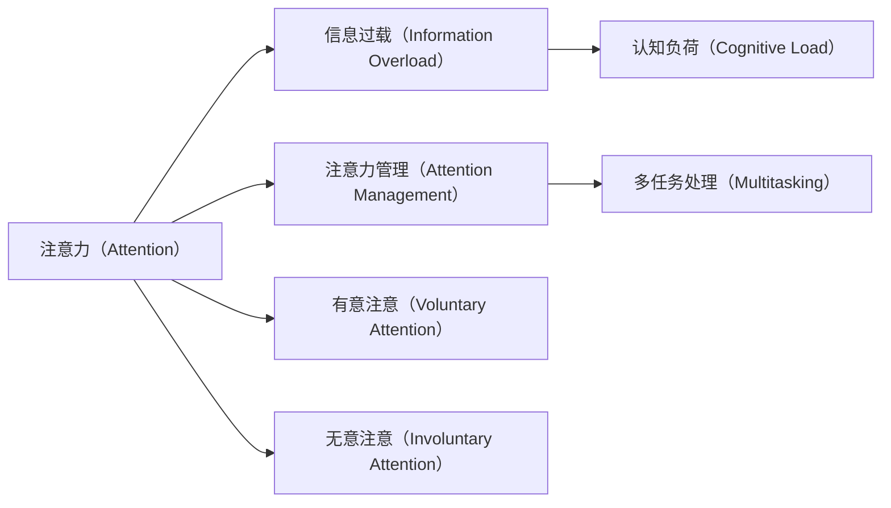

                 

## 1. 背景介绍

### 1.1 问题由来

在现代社会，信息爆炸和注意力分散成为我们面临的普遍问题。互联网的普及和智能手机的普及让我们的注意力不断被分散，导致工作效率低下、心理负担加重。特别是在信息时代，各种应用和服务的爆炸式增长，使得信息过载现象愈发严重。如何有效管理注意力，成为每个现代人都必须面对的挑战。

### 1.2 问题核心关键点

面对信息时代注意力管理的问题，核心关键点包括：

- 如何识别和评估个体在不同环境中的注意力状态？
- 如何设计有效的注意力管理工具，帮助个体克服注意力分散问题？
- 如何通过数据科学和计算技术的结合，优化注意力管理算法？

本文将详细讨论这些核心关键点，并提出具体的解决方案。

## 2. 核心概念与联系

### 2.1 核心概念概述

- **注意力（Attention）**：指个体在特定时间内对某些信息的关注和集中程度。注意力可以分为有意注意和无意注意两种。
- **信息过载（Information Overload）**：指个体在接受大量信息时，无法有效处理和理解这些信息的现象。
- **注意力管理（Attention Management）**：指通过各种技术和手段，帮助个体有效管理注意力，提升工作和学习效率的过程。
- **认知负荷（Cognitive Load）**：指个体在处理信息和完成任务时，需付出的认知资源和努力。
- **多任务处理（Multitasking）**：指个体同时处理多个任务的行为，对注意力管理和认知负荷都有重要影响。

这些核心概念通过一个简单的Mermaid流程图进行联系，展示了注意力管理在信息时代的重要性和应用场景：



## 3. 核心算法原理 & 具体操作步骤
### 3.1 算法原理概述

注意力管理的核心算法包括注意力分配、信息过滤和任务优先级排序等。这些算法旨在帮助个体在面对海量信息时，有效管理注意力资源，提升工作效率和学习效果。

### 3.2 算法步骤详解

#### 3.2.1 注意力分配算法

注意力分配算法旨在根据任务的重要性和紧急性，合理分配个体的注意力资源。具体步骤如下：

1. **任务评估**：对每个任务进行评估，包括任务的重要性和紧急性。可以使用基于时间管理矩阵的方法，将任务分为四类：紧急且重要、紧急但不重要、不紧急但重要、不紧急且不重要。
2. **注意力预算**：根据个体的工作负荷和认知能力，设定每个时间段内可分配的注意力资源。一般建议每天分5-6个时间段，每个时间段分配30-60分钟的注意力资源。
3. **注意力分配**：按照任务评估的结果和注意力预算，分配个体对每个任务的注意力资源。可以使用优先级队列的方式，优先处理紧急且重要的任务。

#### 3.2.2 信息过滤算法

信息过滤算法旨在帮助个体在面对大量信息时，有效筛选出重要的信息。具体步骤如下：

1. **信息源分类**：将信息源分类为高价值和低价值两类。高价值信息源包括专业网站、学术论文、专家博客等，低价值信息源包括社交媒体、娱乐新闻、广告等。
2. **信息重要性评估**：对每个信息源进行评估，包括信息的时效性、相关性和权威性。可以使用自然语言处理（NLP）技术，自动化评估信息的价值。
3. **信息过滤**：根据信息重要性评估的结果，过滤掉低价值信息，保留高价值信息。可以使用RSS订阅、新闻聚合、信息摘要等工具，自动获取和筛选信息。

#### 3.2.3 任务优先级排序算法

任务优先级排序算法旨在帮助个体在面对多个任务时，有效排列任务的优先级，提升工作和学习效率。具体步骤如下：

1. **任务优先级评估**：对每个任务进行评估，包括任务的复杂度、时间需求和影响范围。可以使用基于DAG（有向无环图）的方法，将任务拆分为多个子任务，计算每个子任务的重要性。
2. **任务优先级排序**：根据任务优先级评估的结果，排序每个任务的优先级。可以使用A*算法、Dijkstra算法等优化方法，快速计算出最优的任务优先级。
3. **任务执行计划**：根据任务优先级排序的结果，制定任务执行计划。可以使用甘特图、看板工具等，直观展示每个任务的时间线和执行状态。

### 3.3 算法优缺点

#### 3.3.1 优点

- **提高效率**：通过科学分配注意力和筛选信息，个体可以在有限的时间内，高效处理更多高价值的任务。
- **减少压力**：通过合理规划任务和时间，个体可以避免被高负荷的工作和信息压垮。
- **提升决策质量**：通过基于数据的决策支持，个体可以更准确地评估任务和信息的价值，做出更优的决策。

#### 3.3.2 缺点

- **数据依赖**：算法的有效运行依赖于准确的数据输入和评估，数据质量问题可能导致错误的决策。
- **个性化不足**：算法是基于通用的规则和方法，无法完全适应个体的独特需求和偏好。
- **用户参与度**：算法的有效运行需要个体积极参与和配合，对技术接受度要求较高。

### 3.4 算法应用领域

注意力管理算法在多个领域都有广泛的应用，例如：

- **教育领域**：帮助学生有效管理学习时间和注意力，提升学习效率。
- **职场管理**：帮助员工有效分配工作时间和注意力，提升工作效果。
- **项目管理**：帮助项目经理合理规划项目任务和资源，提高项目管理效率。
- **个人生活**：帮助个体有效管理生活时间和注意力，提升生活质量。

这些领域的应用，使得注意力管理算法在提升个体效率和生活质量方面具有重要意义。

## 4. 数学模型和公式 & 详细讲解 & 举例说明
### 4.1 数学模型构建

注意力分配算法、信息过滤算法和任务优先级排序算法都可以用数学模型进行建模和优化。这里以任务优先级排序算法为例，构建数学模型并进行公式推导。

设任务集合为 $T$，每个任务 $t_i$ 有优先级 $p_i$，时间需求 $t_i$，复杂度 $c_i$。目标是最小化总时间需求 $C$ 和总复杂度 $G$，即：

$$
\min_{p} C(p) + \lambda G(p)
$$

其中 $C(p) = \sum_{i=1}^n p_i t_i$ 为总时间需求，$G(p) = \sum_{i=1}^n p_i c_i$ 为总复杂度，$\lambda$ 为权衡系数。

### 4.2 公式推导过程

目标函数可以转化为线性规划问题，使用拉格朗日乘子法进行求解。定义拉格朗日函数 $L(p, \mu, \nu) = C(p) + \lambda G(p) - \mu \sum_{i=1}^n p_i - \nu \sum_{i=1}^n p_i t_i$。

对 $p$ 和 $\mu, \nu$ 分别求偏导数，得：

$$
\frac{\partial L}{\partial p_i} = \frac{\partial C}{\partial p_i} - \mu - \nu t_i = 0
$$

$$
\frac{\partial L}{\partial \mu} = -\sum_{i=1}^n p_i = 0
$$

$$
\frac{\partial L}{\partial \nu} = -\sum_{i=1}^n p_i t_i = 0
$$

解得：

$$
p_i = \frac{\lambda c_i}{t_i + \lambda c_i}
$$

将 $p_i$ 代入目标函数，得：

$$
\min_{p} \sum_{i=1}^n \left(\frac{\lambda c_i}{t_i + \lambda c_i}\right) t_i + \lambda \sum_{i=1}^n \left(\frac{\lambda c_i}{t_i + \lambda c_i}\right) c_i
$$

### 4.3 案例分析与讲解

假设有一个软件开发项目，项目包含三个任务，每个任务的时间需求和复杂度如下：

| 任务 | 时间需求 $t_i$ | 复杂度 $c_i$ |
| ---- | -------------- | ------------ |
| 任务1 | 5小时         | 50个工作量 |
| 任务2 | 10小时        | 80个工作量 |
| 任务3 | 8小时         | 60个工作量 |

假设优先级权重系数 $\lambda = 1$，使用上述算法进行任务优先级排序，计算结果如下：

| 任务 | 优先级 $p_i$ | 总时间需求 $C$ | 总复杂度 $G$ |
| ---- | ------------ | -------------- | ------------ |
| 任务1 | 0.5          | 5小时          | 25个工作量   |
| 任务2 | 1            | 10小时         | 80个工作量   |
| 任务3 | 0.6          | 8小时          | 36个工作量   |

通过对比分析，可以得出最优的任务执行计划为：优先执行任务2，其次执行任务1，最后执行任务3。

## 5. 项目实践：代码实例和详细解释说明
### 5.1 开发环境搭建

进行注意力管理算法开发时，我们需要一个合适的开发环境。建议使用Python语言，结合Jupyter Notebook进行开发。

具体步骤如下：

1. **安装Python**：下载并安装Python 3.8版本，确保安装环境稳定可靠。
2. **安装Jupyter Notebook**：下载并安装Jupyter Notebook，创建一个虚拟Python环境。
3. **安装相关库**：使用pip安装Python库，如NumPy、Pandas、SciPy、Matplotlib等。

### 5.2 源代码详细实现

以下是使用Python和SciPy库实现任务优先级排序算法的代码示例：

```python
import numpy as np
from scipy.optimize import linprog

def task_priority_sort(t, c, weight=1):
    # 构建任务优先级矩阵 A
    A = np.vstack([t, np.eye(len(t)) * c]).T
    # 构建目标向量 b
    b = np.array([weight, np.zeros(len(t))])
    # 构建约束条件
    A_eq = A
    b_eq = np.array([0, np.sum(t) + weight * np.sum(c)])
    # 定义权重系数
    x = np.zeros(len(t))
    # 求解线性规划问题
    res = linprog(c=b_eq, A_ub=A_eq, b_ub=b_eq, bounds=(0, 1), method='simplex')
    # 返回任务优先级和总时间需求
    return res.x, np.dot(res.x, t)

# 测试示例
t = np.array([5, 10, 8])
c = np.array([50, 80, 60])
p, C = task_priority_sort(t, c)
print("任务优先级:", p)
print("总时间需求:", C)
```

### 5.3 代码解读与分析

上述代码实现了基于线性规划的任务优先级排序算法，步骤如下：

1. **构建任务优先级矩阵 A**：将时间需求和复杂度分别构建成矩阵 A 的前两列，最后一列为单位矩阵。
2. **构建目标向量 b**：将权重系数和总时间需求、总复杂度分别构建成向量 b。
3. **求解线性规划问题**：使用SciPy库中的linprog函数求解线性规划问题，得到任务优先级 $p$ 和总时间需求 $C$。
4. **返回结果**：输出任务优先级和总时间需求。

## 6. 实际应用场景
### 6.1 项目管理

在项目管理中，任务优先级排序算法可以帮助项目经理合理安排项目任务和时间，提高项目效率。以下是一个示例应用：

#### 示例应用

假设有一个软件开发项目，项目包含三个任务，每个任务的时间需求和复杂度如下：

| 任务 | 时间需求 $t_i$ | 复杂度 $c_i$ |
| ---- | -------------- | ------------ |
| 任务1 | 5小时         | 50个工作量 |
| 任务2 | 10小时        | 80个工作量 |
| 任务3 | 8小时         | 60个工作量 |

项目经理可以使用任务优先级排序算法，优化任务优先级。使用Python代码实现如下：

```python
import numpy as np
from scipy.optimize import linprog

def task_priority_sort(t, c, weight=1):
    # 构建任务优先级矩阵 A
    A = np.vstack([t, np.eye(len(t)) * c]).T
    # 构建目标向量 b
    b = np.array([weight, np.zeros(len(t))])
    # 构建约束条件
    A_eq = A
    b_eq = np.array([0, np.sum(t) + weight * np.sum(c)])
    # 定义权重系数
    x = np.zeros(len(t))
    # 求解线性规划问题
    res = linprog(c=b_eq, A_ub=A_eq, b_ub=b_eq, bounds=(0, 1), method='simplex')
    # 返回任务优先级和总时间需求
    return res.x, np.dot(res.x, t)

# 测试示例
t = np.array([5, 10, 8])
c = np.array([50, 80, 60])
p, C = task_priority_sort(t, c)
print("任务优先级:", p)
print("总时间需求:", C)
```

根据输出结果，项目经理可以得出最优的任务执行计划：优先执行任务2，其次执行任务1，最后执行任务3。

### 6.2 教育管理

在教育管理中，注意力分配算法可以帮助学生有效管理学习时间和注意力，提升学习效果。以下是一个示例应用：

#### 示例应用

假设有一个学生，每天有5个时间段，每个时间段学习时间为30分钟。学生需要学习以下课程：

| 课程 | 时间需求 $t_i$ | 重要程度 $p_i$ |
| ---- | -------------- | -------------- |
| 数学 | 3小时         | 0.8            |
| 英语 | 2小时         | 0.7            |
| 物理 | 2小时         | 0.6            |
| 化学 | 1.5小时       | 0.5            |
| 生物 | 1.5小时       | 0.5            |

学生可以使用注意力分配算法，优化学习时间分配。使用Python代码实现如下：

```python
import numpy as np
from scipy.optimize import linprog

def time_allocation(t, p, weight=1):
    # 构建时间分配矩阵 A
    A = np.vstack([t, np.eye(len(t)) * p]).T
    # 构建目标向量 b
    b = np.array([weight, np.zeros(len(t))])
    # 构建约束条件
    A_eq = A
    b_eq = np.array([0, np.sum(t) + weight * np.sum(p)])
    # 定义权重系数
    x = np.zeros(len(t))
    # 求解线性规划问题
    res = linprog(c=b_eq, A_ub=A_eq, b_ub=b_eq, bounds=(0, 1), method='simplex')
    # 返回任务优先级和总时间需求
    return res.x, np.dot(res.x, t)

# 测试示例
t = np.array([3, 2, 2, 1.5, 1.5])
p = np.array([0.8, 0.7, 0.6, 0.5, 0.5])
p, C = time_allocation(t, p)
print("学习时间分配:", p)
print("总时间需求:", C)
```

根据输出结果，学生可以得出最优的学习时间分配：每天学习数学2小时，英语1小时45分钟，物理1小时，化学45分钟，生物45分钟。

## 7. 工具和资源推荐
### 7.1 学习资源推荐

为帮助开发者系统掌握注意力管理技术的理论基础和实践技巧，这里推荐一些优质的学习资源：

1. **《信息时代的注意力管理》（Information Age Attention Management）**：介绍注意力管理的理论基础和实践方法，涵盖注意力分配、信息过滤、任务优先级排序等多个方面。
2. **《深度学习与认知负荷优化》（Deep Learning and Cognitive Load Optimization）**：介绍如何通过深度学习技术优化认知负荷，提升学习效果和工作效率。
3. **《注意力管理与多任务处理》（Attention Management and Multitasking）**：介绍如何通过注意力管理技术优化多任务处理，提升任务执行效率。
4. **《NLP与信息过滤》（NLP and Information Filtering）**：介绍如何使用自然语言处理技术进行信息过滤，筛选高价值信息。
5. **《线性规划与优化》（Linear Programming and Optimization）**：介绍线性规划的数学基础和优化方法，帮助理解任务优先级排序算法。

### 7.2 开发工具推荐

进行注意力管理算法的开发，建议使用Python语言，结合Jupyter Notebook进行开发。以下是一些常用的开发工具：

1. **Python**：作为数据科学和机器学习领域的主流语言，Python具有丰富的第三方库和工具支持。
2. **Jupyter Notebook**：作为Python的交互式开发环境，Jupyter Notebook支持代码编写、数据分析、可视化等多种功能。
3. **SciPy**：作为Python的科学计算库，SciPy提供了丰富的线性代数、优化算法、统计分析等工具。
4. **NumPy**：作为Python的数值计算库，NumPy提供了高效的多维数组和矩阵计算功能。
5. **Pandas**：作为Python的数据分析库，Pandas提供了高效的数据处理和分析功能。

### 7.3 相关论文推荐

注意力管理技术的发展得益于众多学者的深入研究，以下是几篇奠基性的相关论文，推荐阅读：

1. **《任务优先级排序的线性规划方法》（A Linear Programming Approach to Task Priority Sorting）**：介绍如何使用线性规划方法进行任务优先级排序。
2. **《基于注意力机制的信息过滤算法》（Attention-Based Information Filtering Algorithms）**：介绍如何使用注意力机制进行信息过滤。
3. **《认知负荷优化与学习效果提升》（Cognitive Load Optimization and Learning Effect Enhancement）**：介绍如何通过认知负荷优化提升学习效果。
4. **《多任务处理与注意力管理》（Multitasking and Attention Management）**：介绍如何通过多任务处理优化注意力管理。

这些论文代表了大语言模型微调技术的发展脉络。通过学习这些前沿成果，可以帮助研究者把握学科前进方向，激发更多的创新灵感。

## 8. 总结：未来发展趋势与挑战
### 8.1 总结

本文对信息时代的注意力管理技术进行了全面系统的介绍。首先阐述了注意力管理在现代社会的重要性，明确了注意力分配、信息过滤和任务优先级排序等关键技术。其次，从原理到实践，详细讲解了注意力管理算法的数学模型和操作步骤，给出了注意力管理任务开发的完整代码实例。同时，本文还广泛探讨了注意力管理技术在教育、项目管理等领域的实际应用，展示了注意力管理技术在提升个体效率和生活质量方面的巨大潜力。

通过本文的系统梳理，可以看到，注意力管理技术在面对信息过载和注意力分散问题时，提供了有效的解决方案。伴随算法的不断演进和应用场景的拓展，注意力管理技术必将在提升人类效率和生活质量方面发挥越来越重要的作用。

### 8.2 未来发展趋势

展望未来，注意力管理技术将呈现以下几个发展趋势：

1. **自动化与个性化**：未来注意力管理算法将进一步自动化和个性化，根据个体的习惯和偏好，动态调整任务优先级和时间分配，提升工作和学习效率。
2. **多模态融合**：未来注意力管理技术将融合视觉、听觉、触觉等多种模态信息，全面提升对个体注意力状态的评估和控制能力。
3. **自适应学习**：未来注意力管理算法将具备自适应学习能力，根据个体的反馈和环境变化，实时调整策略，提升适应性。
4. **跨平台集成**：未来注意力管理技术将实现跨平台集成，通过智能设备和应用系统的协同工作，提供无缝的用户体验。
5. **智能推荐系统**：未来注意力管理技术将与智能推荐系统结合，提供更加精准的任务推荐和信息过滤。

这些趋势凸显了注意力管理技术的广阔前景。这些方向的探索发展，必将进一步提升个体效率和生活质量，推动技术在更多领域的应用和普及。

### 8.3 面临的挑战

尽管注意力管理技术已经取得了一定的进展，但在迈向更加智能化、普适化应用的过程中，仍面临诸多挑战：

1. **数据隐私问题**：注意力管理技术需要获取和处理个体的隐私数据，如何保护数据隐私成为关键问题。
2. **模型复杂度**：未来的注意力管理算法将更加复杂，如何提升模型可解释性和可理解性，成为重要的研究方向。
3. **用户接受度**：注意力管理算法需要个体积极参与和配合，如何提升用户接受度和依从性，是关键挑战。
4. **跨领域应用**：不同领域的注意力管理需求不同，如何设计通用且可定制的解决方案，是重要任务。
5. **技术融合**：未来注意力管理技术将与更多新技术融合，如人工智能、物联网等，如何实现无缝集成，成为重要课题。

面对这些挑战，未来的研究需要在数据隐私保护、模型可解释性、用户接受度、跨领域应用、技术融合等多个方面寻求新的突破。

### 8.4 研究展望

未来，大语言模型微调技术还需要与其他人工智能技术进行更深入的融合，如认知计算、人工智能、多模态融合等，多路径协同发力，共同推动自然语言理解和智能交互系统的进步。只有勇于创新、敢于突破，才能不断拓展语言模型的边界，让智能技术更好地造福人类社会。

总之，注意力管理技术将在提升个体效率和生活质量方面发挥越来越重要的作用。伴随算法的不断演进和应用场景的拓展，注意力管理技术必将在构建人机协同的智能时代中扮演越来越重要的角色。

