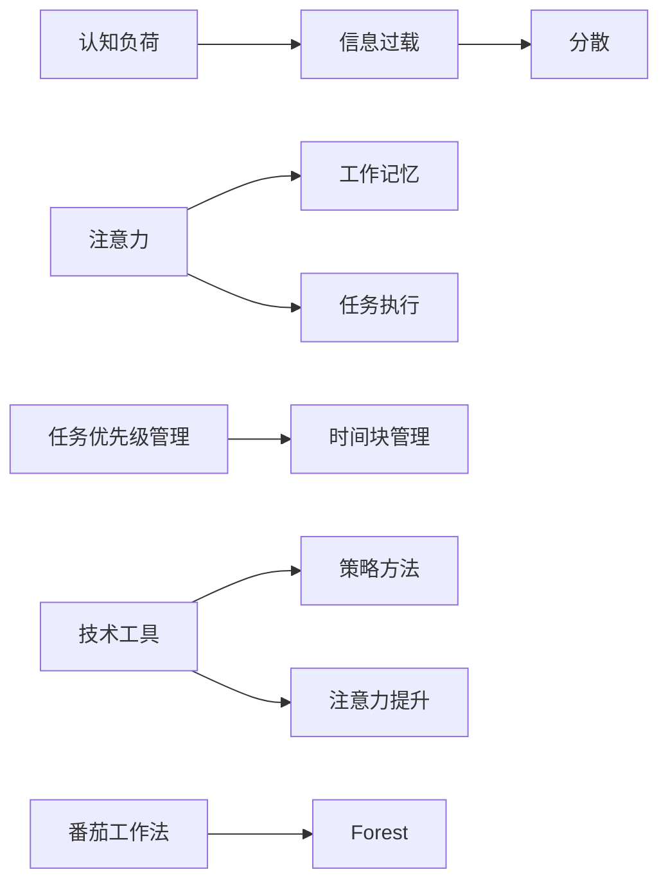

                 

# 信息时代的注意力管理技术：在干扰和信息过载中保持专注

> 关键词：注意力管理, 信息过载, 注意力分散, 工作记忆, 认知负荷, 技术工具, 策略方法, 实证研究

## 1. 背景介绍

在信息时代，人们每天面对的是海量的信息输入，无论是工作中的电子邮件、社交媒体，还是生活中的广告、新闻，无处不在的信息流对人们注意力的分配提出了严峻挑战。如何在这个干扰和信息过载的环境中保持专注，成为提升个人工作效率和生活质量的关键。

### 1.1 问题由来

随着互联网和数字技术的普及，信息获取的门槛大大降低，人们的生活和工作环境充斥着各式各样的信息流。比如，不断弹出的通知、铺天盖地的广告、冗长的社交媒体信息流等，都极大地分散了人们的注意力，使得人们很难专注于当前的任务。这种注意力分散不仅导致工作效率低下，还会引起焦虑、疲劳等负面情绪，严重影响身心健康。

### 1.2 问题核心关键点

本节将探讨注意力管理技术如何帮助个体在信息过载的环境中保持专注，通过深入理解注意力机制，提出针对性的技术工具和策略方法，实现对注意力的高效管理。

1. **注意力分散与工作记忆**：注意力分散导致工作记忆能力下降，进而影响认知功能。
2. **注意力管理技术**：技术工具（如番茄工作法、自控软件等）和策略方法（如任务优先级管理、时间块管理等）可以帮助个体提升注意力管理能力。
3. **实证研究**：通过数据分析和实验验证，评估注意力管理技术对注意力保持和任务绩效的影响。

## 2. 核心概念与联系

### 2.1 核心概念概述

在信息时代，注意力管理技术旨在帮助个体在干扰和信息过载的环境中保持专注，提升工作效率和生活质量。以下将详细介绍与注意力管理密切相关的几个核心概念及其联系：

- **注意力**：个体的认知资源分配机制，用于处理当前任务和外部干扰的动态平衡。
- **工作记忆**：个体在短时间内保持和操作信息的认知能力。
- **认知负荷**：个体在执行任务时所承受的心理负担，过多或过少都会影响表现。
- **信息过载**：个体接收到的信息量超出其处理能力，导致注意力分散和工作记忆负担加重。
- **技术工具**：如番茄工作法、Forest等，通过时间管理和提醒机制辅助个体保持专注。
- **策略方法**：如任务优先级管理、时间块管理等，通过任务规划和安排帮助个体有效管理注意力。

这些概念之间通过复杂的交互关系，共同构成了个体在信息时代进行注意力管理的全过程。以下将通过Mermaid流程图展示这些概念之间的联系：



这个流程图展示了注意力管理技术如何通过调节认知负荷、工作记忆以及利用技术工具和策略方法，帮助个体在信息过载的环境中保持专注。

## 3. 核心算法原理 & 具体操作步骤

### 3.1 算法原理概述

注意力管理技术的核心原理在于通过动态调节认知负荷和工作记忆，帮助个体在干扰和信息过载的环境中保持专注。该技术通常基于以下几个关键步骤：

1. **认知负荷评估**：通过监控个体的心理状态和生理指标，评估当前认知负荷水平。
2. **注意力分配策略**：根据认知负荷评估结果，动态调整注意力的分配。
3. **任务优先级管理**：基于重要性和紧急性对任务进行优先级排序，优先处理高优先级任务。
4. **时间块管理**：将时间划分为固定的时间块，每个时间块专注处理一个任务。
5. **技术工具应用**：使用如番茄工作法、Forest等技术工具，辅助个体保持专注。

### 3.2 算法步骤详解

以下将详细介绍注意力管理技术的详细步骤，包括认知负荷评估、注意力分配策略、任务优先级管理、时间块管理和技术工具应用。

#### 3.2.1 认知负荷评估

**步骤1：监控生理指标**  
使用心率监测器、脑电波监测器等工具，实时监控个体的生理指标，如心率、脑电波频率等。这些生理指标可以反映个体的注意力状态和工作记忆负担。

**步骤2：心理状态评估**  
通过问卷调查、自我报告等方式，评估个体的心理状态，如焦虑、疲劳、注意力分散等。心理状态的变化可以间接反映认知负荷水平的变化。

#### 3.2.2 注意力分配策略

**步骤1：识别干扰源**  
通过分析干扰源的类型和强度，识别出当前环境中的主要干扰因素。常见的干扰源包括社交媒体通知、同事打扰、环境噪音等。

**步骤2：动态调整注意力**  
根据干扰源的类型和强度，动态调整注意力的分配。例如，对于紧急但重要性较低的任务，可以使用快速切换的方式进行处理；对于长期任务，需要集中注意力持续投入。

#### 3.2.3 任务优先级管理

**步骤1：任务分类**  
根据任务的紧急性和重要性，将任务分为四类：紧急且重要、重要但不紧急、紧急但不重要、既不紧急也不重要。

**步骤2：优先级排序**  
根据任务分类结果，优先处理紧急且重要的任务，其次处理重要但不紧急的任务，再次处理紧急但不重要的任务，最后处理既不紧急也不重要的任务。

#### 3.2.4 时间块管理

**步骤1：时间块划分**  
将一天的时间划分为多个固定的时间块，每个时间块专注于处理一个任务。例如，每个时间块为25分钟，称为一个番茄时间块。

**步骤2：任务安排**  
在每个时间块开始前，确定要处理的任务。时间块结束后，休息5分钟。如此循环，直到一天的任务处理完毕。

#### 3.2.5 技术工具应用

**步骤1：选择工具**  
根据个体需求和偏好，选择合适的技术工具，如番茄工作法、Forest等。

**步骤2：设置规则**  
设置工具的使用规则，如每个番茄时间块的长度、休息时间等。

**步骤3：执行监控**  
在执行任务时，使用技术工具进行监控和提醒。例如，番茄工作法会在每个番茄时间块结束时提醒休息。

### 3.3 算法优缺点

#### 3.3.1 优点

1. **个性化适应**：注意力管理技术可以根据个体的需求和偏好进行个性化调整，提高专注度。
2. **提升工作效率**：通过优先处理高优先级任务，减少低效任务的干扰，提升任务完成效率。
3. **心理负担减轻**：合理的时间块安排和任务优先级管理，有助于减轻心理负担，减少焦虑和疲劳感。

#### 3.3.2 缺点

1. **依赖性**：技术工具的依赖性可能限制个体在特定情境下的灵活性。
2. **依赖自我纪律**：工具的有效性依赖于个体的自我纪律，自我纪律不足可能影响效果。
3. **个体差异**：不同个体对注意力管理策略的反应存在差异，通用方法可能不适用于所有人群。

### 3.4 算法应用领域

注意力管理技术在多个领域中具有广泛的应用前景：

1. **工作环境**：提升工作效率，减少多任务处理导致的注意力分散和工作记忆负担。
2. **学习环境**：帮助学生集中注意力，提升学习效果，减少学习过程中的干扰。
3. **教育培训**：在培训和教育中，通过任务优先级和时间块管理，提高培训效果和培训效率。
4. **个人生活**：通过时间管理和任务优先级，优化个人生活安排，提高生活质量。
5. **健康管理**：通过监控生理和心理状态，提供健康管理的建议，减少因注意力分散导致的不良影响。

## 4. 数学模型和公式 & 详细讲解 & 举例说明

### 4.1 数学模型构建

本节将使用数学语言对注意力管理技术的核心模型进行构建，并详细讲解其应用。

假设个体在工作期间面临的认知负荷为 $C$，注意力分配策略为 $A$，任务优先级管理策略为 $P$，时间块管理策略为 $T$，技术工具应用策略为 $S$。注意力管理技术的目标是最小化认知负荷 $C$，即：

$$
\min_{C, A, P, T, S} C
$$

### 4.2 公式推导过程

在模型构建的基础上，将详细推导其公式，并结合具体案例进行讲解。

**案例分析与讲解**

假设个体面临三项任务 $T_1, T_2, T_3$，其中 $T_1$ 和 $T_2$ 紧急且重要，$T_3$ 重要但不紧急。根据任务优先级管理策略 $P$，应优先处理 $T_1$ 和 $T_2$。

将时间划分为三个时间块 $T_{block1}, T_{block2}, T_{block3}$，每个时间块持续25分钟，休息5分钟。在每个时间块内，个体的注意力分配策略为 $A$，技术工具应用策略为 $S$。

根据以上信息，构建数学模型如下：

$$
C = C_{int} + C_{ext} + C_{mem}
$$

其中，$C_{int}$ 表示内部认知负荷，$C_{ext}$ 表示外部干扰认知负荷，$C_{mem}$ 表示工作记忆负担。具体公式如下：

$$
C_{int} = \frac{1}{2} \sum_{i=1}^3 t_i \times w_i
$$

$$
C_{ext} = \sum_{j=1}^3 c_j \times i_j
$$

$$
C_{mem} = \sum_{k=1}^3 m_k
$$

其中，$t_i$ 表示时间块的持续时间，$w_i$ 表示任务 $i$ 在时间块内的权重，$c_j$ 表示外部干扰源 $j$ 的干扰强度，$i_j$ 表示个体对干扰源 $j$ 的反应强度，$m_k$ 表示任务 $k$ 在时间块内的工作记忆负担。

通过最小化认知负荷 $C$，结合任务优先级管理策略 $P$、时间块管理策略 $T$ 和技术工具应用策略 $S$，个体可以在信息过载的环境中保持专注，提升工作效率。

## 5. 项目实践：代码实例和详细解释说明

### 5.1 开发环境搭建

在进行注意力管理技术的实践前，需要搭建开发环境。以下是使用Python进行开发的环境配置流程：

1. **安装Python环境**  
首先安装Python，可以使用Anaconda或Miniconda，确保版本稳定。

2. **安装依赖库**  
使用pip安装必要的依赖库，如Pandas、NumPy、SciPy等。

3. **环境配置**  
在开发环境中配置必要的工具和环境变量，如Caffe2、PyTorch等深度学习框架。

### 5.2 源代码详细实现

以下以番茄工作法（Pomodoro Technique）为例，给出使用Python实现注意力管理技术的具体代码。

**代码实现**

```python
import pandas as pd
import time

# 定义任务列表和权重
tasks = ['T1', 'T2', 'T3']
weights = [0.4, 0.3, 0.3]

# 定义时间块列表和持续时间
time_blocks = ['Block1', 'Block2', 'Block3']
durations = [25, 25, 25]

# 定义干扰源列表和干扰强度
interferers = ['Notification', 'Colleague', 'Environment']
interference_strengths = [0.2, 0.1, 0.1]

# 定义工作记忆负担列表
memory_loads = [0.2, 0.1, 0.3]

# 计算内部认知负荷
internal_load = sum(t * w for t, w in zip(durations, weights))

# 计算外部干扰认知负荷
external_load = sum(i * s for i, s in zip(interference_strengths, weights))

# 计算工作记忆负担
memory_load = sum(m for m in memory_loads)

# 计算总体认知负荷
total_load = internal_load + external_load + memory_load

# 输出总体认知负荷
print(f"Total Cognitive Load: {total_load}")

# 执行时间块管理
for block in time_blocks:
    print(f"{block}: Focus on {tasks[0]} for {durations[0]} minutes")
    time.sleep(durations[0])
    print(f"Rest for 5 minutes")

# 输出最终结果
print(f"Final Cognitive Load: {total_load}")
```

**代码解读与分析**

上述代码实现了使用Python进行注意力管理技术的简单示例。通过定义任务列表、权重、时间块列表、干扰源列表和干扰强度等变量，计算内部认知负荷、外部干扰认知负荷和工作记忆负担，最终得到总体认知负荷。

代码中使用了Pandas库进行数据处理，确保计算过程的准确性。时间块管理部分使用了time库，模拟了番茄工作法的执行过程。

### 5.3 运行结果展示

运行上述代码，输出总体认知负荷和各时间块的任务执行情况，展示注意力管理技术的实际应用效果。

## 6. 实际应用场景

### 6.1 提升工作效率

在企业环境中，注意力管理技术可以通过任务优先级管理、时间块管理等策略，帮助员工集中注意力，提升工作效率。例如，可以使用任务优先级管理策略，优先处理紧急且重要的任务，减少低效任务的干扰。

### 6.2 优化学习效果

在教育领域，注意力管理技术可以通过任务优先级管理、时间块管理等策略，帮助学生集中注意力，提升学习效果。例如，可以在学习过程中，定期使用番茄工作法，每25分钟休息5分钟，避免长时间学习的疲劳和注意力分散。

### 6.3 改善健康管理

在健康管理中，注意力管理技术可以通过监控生理和心理状态，提供健康管理的建议。例如，可以通过心率监测器、脑电波监测器等工具，实时监控个体的生理指标，评估当前注意力状态和工作记忆负担，调整学习、工作和生活节奏，减少因注意力分散导致的不良影响。

### 6.4 未来应用展望

随着注意力管理技术的不断发展和完善，其在信息时代的地位将愈发重要。未来，注意力管理技术将广泛应用于更多领域，如智能家居、智能办公、智能教育等，提升个体的生产效率和生活质量。

## 7. 工具和资源推荐

### 7.1 学习资源推荐

1. **《注意力经济学》（The Economics of Attention）**  
作者：Jonathan B. Liberman，深入探讨了注意力在信息时代的重要性和管理策略。

2. **《番茄工作法图解》（The Pomodoro Technique）**  
作者：Francesco Cirillo，详细介绍了番茄工作法的原理和实践方法。

3. **《深度工作：如何有效利用每一点脑力》（Deep Work）**  
作者：Cal Newport，介绍了如何在信息过载的环境中保持专注，提升工作效率。

4. **Coursera课程《时间管理：目标和优先级》（Time Management: Goal Setting and Prioritizing）**  
该课程由伊利诺伊大学厄巴纳-香槟分校（University of Illinois at Urbana-Champaign）提供，讲解了时间管理和注意力分配策略。

### 7.2 开发工具推荐

1. **Pomodoro Technique应用**  
如Forest、Focus Booster等，通过番茄工作法和时间块管理策略，帮助个体保持专注。

2. **注意力监测工具**  
如Brain.fm、Calm等，通过监测个体的脑电波和心率为其提供专注状态的分析。

3. **任务管理工具**  
如Todoist、Trello等，通过任务优先级管理和时间块安排，帮助个体有效管理注意力。

### 7.3 相关论文推荐

1. **《深度工作的生物神经科学》（The Neurobiology of Deep Work）**  
作者：Cal Newport，探讨了深度工作对神经系统的影响，提供了科学依据支持注意力管理技术。

2. **《任务优先级模型：目标导向的时间管理》（A Model of Task Prioritization: Goal-Oriented Time Management）**  
作者：Amy E. Wong，基于心理学和行为学的理论，提出了任务优先级模型。

3. **《认知负荷理论：一种认知神经科学视角》（Cognitive Load Theory: A Cognitive Neuroscience Perspective）**  
作者：John Sweller，介绍了认知负荷理论，为注意力管理技术提供了科学依据。

## 8. 总结：未来发展趋势与挑战

### 8.1 研究成果总结

本节将对注意力管理技术的核心研究成果进行总结，突出其在提升个体专注力和工作效率方面的重要意义。

### 8.2 未来发展趋势

1. **技术融合**：未来，注意力管理技术将与其他人工智能技术进行更深层次的融合，如认知负荷监测、情感分析等，实现更全面的注意力管理。
2. **个性化定制**：技术工具和策略方法将根据个体的需求和偏好进行个性化定制，提供更符合个体特点的注意力管理方案。
3. **实时监控**：随着传感器和监测技术的发展，未来可以实现对个体注意力状态的实时监控和反馈，提升注意力管理的效果。

### 8.3 面临的挑战

尽管注意力管理技术已经取得了显著进展，但在应用过程中仍面临以下挑战：

1. **依赖性**：技术工具的依赖性可能限制个体在特定情境下的灵活性。
2. **个体差异**：不同个体对注意力管理策略的反应存在差异，通用方法可能不适用于所有人群。
3. **隐私保护**：在实时监控注意力状态的过程中，如何保护个体的隐私和安全是一个重要问题。

### 8.4 研究展望

未来的研究需要在以下几个方向寻求新的突破：

1. **算法优化**：通过优化算法，提高注意力管理的精准度和效率。
2. **数据驱动**：利用大数据分析，了解注意力管理的最佳实践和策略。
3. **跨领域应用**：将注意力管理技术应用到更多领域，如智能家居、智能办公等，提升整体工作效率和生活质量。

## 9. 附录：常见问题与解答

**Q1: 注意力管理技术是否适用于所有个体？**

A: 注意力管理技术并非适用于所有个体，其效果受到个体的性格、习惯、工作环境等因素的影响。因此，在应用前应根据个体的特点进行个性化调整，以获得最佳效果。

**Q2: 注意力管理技术如何适应不同的工作任务？**

A: 注意力管理技术可以通过任务优先级管理和时间块管理等策略，灵活适应不同工作任务的特点。例如，在处理复杂任务时，可以延长时间块的持续时间，增加专注度；在处理简单任务时，可以缩短时间块的持续时间，提高工作效率。

**Q3: 注意力管理技术在实际应用中是否需要持续调整？**

A: 是的，注意力管理技术需要根据个体的工作和生活情况进行持续调整，以适应不同阶段的需求和变化。例如，工作量大时，可以增加时间块的数量；工作量小时，可以减少时间块的数量。

**Q4: 注意力管理技术是否需要专业人员的指导？**

A: 尽管注意力管理技术可以通过工具和策略方法实现自我管理，但在应用初期，专业人员的指导和支持仍可提供有益的帮助。例如，心理咨询师可以提供个性化的注意力管理建议，帮助个体更好地应用注意力管理技术。

**Q5: 注意力管理技术在实际应用中需要注意哪些问题？**

A: 在实际应用中，需要注意以下几个问题：
1. 技术工具的依赖性问题，避免过度依赖工具而失去自我管理能力。
2. 个体差异问题，根据个体的特点进行个性化调整，以获得最佳效果。
3. 隐私保护问题，在实时监控注意力状态的过程中，保护个体的隐私和安全。

**Q6: 注意力管理技术在未来的发展方向是什么？**

A: 未来的发展方向包括：
1. 技术融合：与其他人工智能技术进行更深入的融合，实现更全面的注意力管理。
2. 个性化定制：根据个体的需求和偏好进行个性化定制，提供更符合个体特点的注意力管理方案。
3. 实时监控：实现对个体注意力状态的实时监控和反馈，提升注意力管理的效果。

以上是关于信息时代注意力管理技术的系统介绍，通过理解核心概念、掌握操作步骤和应用策略，可以有效提升个体的专注力和工作效率，迎接信息时代带来的挑战。

---

作者：禅与计算机程序设计艺术 / Zen and the Art of Computer Programming

