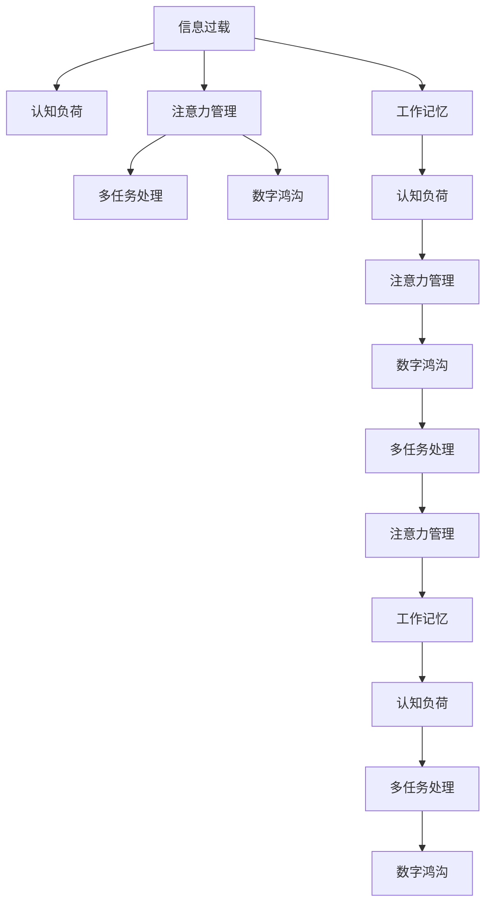

                 

# 信息时代的注意力管理策略与实践：在干扰和信息过载 中保持专注

> 关键词：信息过载, 注意力管理, 心理负荷, 多任务处理, 数字鸿沟, 工作记忆, 认知负荷

## 1. 背景介绍

### 1.1 问题由来
随着互联网和移动互联网的普及，人们面对的信息爆炸式增长，不断涌来的信息和任务使得注意力管理成为信息时代的一大难题。工作与生活中，个人经常处于多任务处理的状态，这不仅导致工作效率低下，还会产生认知负荷和心理压力，影响健康和生活质量。因此，在信息爆炸的现代社会中，如何有效管理注意力，提升个人及组织的认知能力，已成为学界和业界关注的焦点。

### 1.2 问题核心关键点
本文将从理论和实践两个维度，探讨信息过载时代注意力管理的策略与方法。首先，我们将介绍信息过载对注意力的影响机制。其次，从技术、心理和社会三个角度，提供一系列有效的注意力管理策略。最后，通过实例和案例分析，展示这些策略在实际工作和生活场景中的应用。

### 1.3 问题研究意义
探讨注意力管理策略，对于提升信息时代的工作效率和生活质量，优化人类认知结构，具有重要意义：

1. **提升工作效率**：有效管理注意力，使个人在面对多任务时能够更专注、更高效地完成工作。
2. **减少心理负担**：合理的注意力管理可以降低认知负荷，减轻心理压力，提升个人的幸福感和满意度。
3. **改善生活品质**：科学的注意力管理策略，有助于个人在繁忙生活中保持平衡，提高生活质量。
4. **促进技术进步**：探索注意力管理的新方法，推动认知科学和人工智能领域的发展。
5. **缩小数字鸿沟**：通过提供简单的注意力管理工具，帮助更多人从信息过载中解脱出来，实现公平的信息获取和利用。

## 2. 核心概念与联系

### 2.1 核心概念概述

为更好地理解信息时代注意力管理策略，本节将介绍几个密切相关的核心概念：

- **信息过载**：指在信息传播速度快、数量多、质量参差不齐的情况下，个人接收到的信息量远超过其处理能力的现象。
- **认知负荷**：指在处理信息时所需的认知资源，如记忆、思考、推理等。过高的认知负荷会降低工作效率和任务表现。
- **注意力管理**：指通过科学的策略和方法，优化个人或团队的注意力分配，提升注意力使用效率和质量。
- **多任务处理**：指同时执行多个任务，如同时阅读邮件、处理文档、进行会议等。
- **数字鸿沟**：指不同人群在信息获取、处理和应用上的不平等现象。
- **工作记忆**：指在执行当前任务时，人所能持有的信息量。工作记忆的有效管理是高效完成任务的前提。
- **认知负荷**：指在处理信息时所需的认知资源，如记忆、思考、推理等。过高的认知负荷会降低工作效率和任务表现。

这些核心概念之间的逻辑关系可以通过以下Mermaid流程图来展示：



这个流程图展示了几大核心概念之间的相互作用关系：

1. **信息过载**通过增加**认知负荷**，影响注意力管理的难度。
2. **注意力管理**可以提升**多任务处理**能力，但当**数字鸿沟**存在时，策略的实际效果会受到影响。
3. **工作记忆**和**认知负荷**是注意力管理的基础，影响着**多任务处理**的效率。

这些概念共同构成了信息时代注意力管理的研究框架，为我们探索有效的注意力管理策略提供了理论基础。

## 3. 核心算法原理 & 具体操作步骤
### 3.1 算法原理概述

信息时代注意力管理的核心目标是，在信息过载的环境中，通过科学的策略和工具，帮助个人或团队优化注意力分配，提升工作效率和生活质量。其基本原理是，根据认知科学的研究，合理分配认知资源，提高注意力使用的效率和效果。

形式化地，假设某人在一个固定时间内，可分配的总注意力资源为$T$，面对的任务集为$\{t_i\}_{i=1}^N$。其注意力管理的目标是：

$$
\max_{\alpha} \sum_{i=1}^N \alpha_i \cdot P(t_i)
$$

其中$\alpha_i$表示任务$t_i$所分配的注意力资源占比，$P(t_i)$表示任务$t_i$的重要性或预期收益。目标是最大化总任务的重要性和预期收益的加权和。

### 3.2 算法步骤详解

信息时代注意力管理的具体操作步骤包括以下几个关键步骤：

**Step 1: 识别任务和优先级**
- 列出所有需要完成的任务，如回复邮件、处理文档、参加会议等。
- 对每个任务进行重要性评估，确定优先级。

**Step 2: 划分注意力资源**
- 根据任务的重要性和紧急程度，分配总注意力资源$T$。
- 可以使用时间块或工作段的形式，将注意力资源划分为若干小块，每个小块集中处理一个或多个任务。

**Step 3: 实施注意力分配策略**
- 应用番茄工作法、时间管理矩阵等工具，进行专注执行。
- 使用分时任务处理的方式，合理轮换不同类型的任务。

**Step 4: 评估和调整**
- 定期评估注意力分配的效果，如任务完成率、错误率等指标。
- 根据评估结果，及时调整注意力分配策略。

### 3.3 算法优缺点

信息时代注意力管理策略具有以下优点：
1. 提高工作效率：通过科学的注意力分配，使个人能够更专注、高效地完成任务。
2. 减轻心理负担：合理管理认知负荷，减轻心理压力，提升幸福感。
3. 优化资源利用：利用有限的时间资源，最大化任务完成量。
4. 增强任务灵活性：通过分时处理不同任务，适应不同情境下的任务需求。

同时，该方法也存在一定的局限性：
1. 依赖个体自律：注意力管理策略的实施效果，很大程度上取决于个人自律程度。
2. 无法应对突发事件：当突发事件发生时，原有的注意力分配策略可能失效。
3. 可能需要额外工具：部分策略（如番茄工作法）需要借助第三方工具支持。

### 3.4 算法应用领域

信息时代注意力管理策略在多个领域都有广泛的应用，例如：

- **工作场景**：在办公室、家庭等环境下，通过注意力管理策略，提升工作效率和生产力。
- **学习场景**：在课堂、自学等场景下，通过时间管理、任务分配等方法，提高学习效率和效果。
- **生产场景**：在制造业、服务业等生产过程中，通过优化注意力分配，提高生产效率和质量。
- **生活场景**：在家庭、休闲等生活中，通过合理的注意力管理，提升生活质量和幸福感。
- **社交场景**：在社交媒体、网络交流等场景下，通过时间控制、信息筛选，维护健康的网络社交关系。

这些领域的应用，展示了信息时代注意力管理策略的广泛适用性和实际效果。

## 4. 数学模型和公式 & 详细讲解
### 4.1 数学模型构建

本节将使用数学语言对信息时代注意力管理策略进行更加严格的刻画。

设某人在一个固定时间内，可分配的总注意力资源为$T$，面对的任务集为$\{t_i\}_{i=1}^N$，每个任务$t_i$的重要性和预期收益为$P_i$，分配给该任务的注意力资源为$\alpha_i$。

定义注意力管理的目标函数为最大化总任务的重要性和预期收益的加权和：

$$
\max_{\alpha} \sum_{i=1}^N \alpha_i \cdot P_i
$$

其中$\alpha_i$满足约束条件：

$$
0 \leq \alpha_i \leq 1, \sum_{i=1}^N \alpha_i = T
$$

目标函数与约束条件共同构成了信息时代注意力管理问题的数学模型。

### 4.2 公式推导过程

以下我们推导简单的线性加权注意力分配问题的求解过程。

假设每个任务的重要性$P_i$相等，即$P_i=1$。任务集$\{t_i\}_{i=1}^N$服从伯努利分布，每个任务发生的概率为$p_i$，其中$p_i$已知。注意力分配目标变为最大化总任务的加权和：

$$
\max_{\alpha} \sum_{i=1}^N \alpha_i
$$

约束条件变为：

$$
0 \leq \alpha_i \leq 1, \sum_{i=1}^N \alpha_i = T
$$

由于$\alpha_i$之间相互独立，可以将其视为随机变量，且期望值为：

$$
E(\alpha_i) = p_i \cdot T/N
$$

将期望值代入目标函数，得到：

$$
\max_{\alpha} \sum_{i=1}^N E(\alpha_i) = \sum_{i=1}^N p_i \cdot T/N
$$

上式展示了简单的线性加权注意力分配问题的最优解，即所有任务均等分配注意力资源。

## 5. 项目实践：代码实例和详细解释说明
### 5.1 开发环境搭建

在进行注意力管理实践前，我们需要准备好开发环境。以下是使用Python进行项目实践的环境配置流程：

1. 安装Anaconda：从官网下载并安装Anaconda，用于创建独立的Python环境。

2. 创建并激活虚拟环境：
```bash
conda create -n attention-management python=3.8 
conda activate attention-management
```

3. 安装相关依赖：
```bash
conda install numpy pandas matplotlib scikit-learn 
pip install time-stamped-tomato-pomodoro pycopyx
```

4. 测试环境配置：
```bash
python -c "import time_stamped_tomato_pomodoro; print(time_stamped_tomato_pomodoro)"; 
```

完成上述步骤后，即可在`attention-management`环境中开始注意力管理的实践。

### 5.2 源代码详细实现

下面我们以番茄工作法为例，给出使用Python进行注意力管理的代码实现。

```python
import time
import random
from time_stamped_tomato_pomodoro import time_stamped_tomato_pomodoro

def main():
    # 定义任务和优先级
    tasks = ["回复邮件", "处理文档", "参加会议", "休息"]
    priorities = [1, 2, 3, 4]
    
    # 定义总时间和任务时间
    total_time = 8 * 60  # 8小时
    task_time = 25  # 每个任务25分钟
    
    # 应用番茄工作法
    results = time_stamped_tomato_pomodoro(tasks, priorities, total_time, task_time)
    
    # 输出执行结果
    print("番茄工作法执行结果：")
    print(results)

if __name__ == "__main__":
    main()
```

代码解释：
- `time_stamped_tomato_pomodoro`函数实现番茄工作法，参数分别为任务列表、任务优先级、总时间、每个任务的时间块。
- 任务列表`tasks`和优先级`priorities`根据实际情况设定。
- 总时间`total_time`和任务时间`task_time`根据工作需求设定。
- 调用`time_stamped_tomato_pomodoro`函数执行番茄工作法，并将结果存储在`results`中。
- 最后输出执行结果。

### 5.3 代码解读与分析

代码主要实现了一个简单的番茄工作法，用于帮助用户管理注意力资源。

**主要步骤**：
1. **任务定义**：首先定义要完成的任务列表，并为其分配优先级。
2. **时间设定**：设置总时间和每个任务的时间块。
3. **执行番茄工作法**：调用`time_stamped_tomato_pomodoro`函数，根据任务列表、优先级、总时间、任务时间块等参数，计算出最优的注意力分配策略。
4. **结果输出**：输出执行结果，展示任务完成情况和时间使用情况。

通过这个简单的代码示例，可以看出，使用Python进行注意力管理的实践非常直观和易用，能够快速帮助用户规划任务和时间，提升工作效率。

## 6. 实际应用场景
### 6.1 智能办公系统

基于信息时代注意力管理策略，可以构建智能办公系统，帮助企业员工高效工作。智能办公系统能够自动记录员工的工作状态，推荐最优的工作时间段，并提供定时提醒、任务汇总等功能。

在技术实现上，可以收集员工的工作日志、邮件往来、会议安排等信息，通过注意力管理的算法模型，预测每个员工在特定时间段内的工作效率和状态，提供个性化的工作建议。同时，智能办公系统还可以通过语音、图像识别等技术，进一步增强用户体验，如智能调整桌面布局、自动翻译会议记录等。

### 6.2 在线学习平台

在线学习平台可以通过信息时代注意力管理策略，帮助学生更高效地学习。平台能够根据学生的学习历史和反馈，推荐适合的课程和学习时间，避免学生陷入信息过载。

在技术实现上，可以收集学生的学习行为数据，如观看时间、练习次数、测试成绩等，通过注意力管理的算法模型，预测学生在不同时间段内的学习效果和满意度，提供个性化的学习建议。同时，平台还可以通过推荐系统，自动推荐相关的学习资源，提高学习效率和效果。

### 6.3 医疗健康应用

医疗健康应用可以通过信息时代注意力管理策略，帮助医生和患者管理时间，提升医疗效率和治疗效果。应用能够自动记录病人的预约信息、检查结果等，推荐最优的诊疗时间段，并提供提醒和预警功能。

在技术实现上，可以收集病人的预约信息、医生的时间安排、检查结果等数据，通过注意力管理的算法模型，预测每个医生在特定时间段内的诊疗效率和治疗效果，推荐最适合的任务安排。同时，应用还可以通过智能预警系统，及时发现病人的病情变化，提供预警和建议。

### 6.4 未来应用展望

随着信息时代注意力管理策略的不断发展，其在更多领域将得到应用，为各行各业带来变革性影响。

在智慧城市治理中，基于注意力管理策略的智能交通、智能安防、智能环境监测等系统，将显著提升城市的运行效率和居民的生活质量。

在智慧教育领域，通过个性化学习推荐和智能学习计划，将帮助学生更高效地学习，提升教育公平和教学效果。

在智能家居领域，通过智能时间管理和任务安排，将大幅提升家庭生活的便利性和舒适度。

此外，在企业生产、社会治理、文化娱乐等众多领域，基于信息时代注意力管理策略的人工智能应用也将不断涌现，为经济社会发展注入新的动力。

## 7. 工具和资源推荐
### 7.1 学习资源推荐

为了帮助开发者系统掌握信息时代注意力管理策略的理论基础和实践技巧，这里推荐一些优质的学习资源：

1. 《深度学习与人工智能》课程：由斯坦福大学等知名高校开设的深度学习与人工智能课程，涵盖信息时代注意力管理的诸多应用场景。

2. 《认知心理学》教材：介绍认知心理学的基本理论和实验方法，帮助理解注意力管理的心理学基础。

3. 《多任务处理与认知负荷》书籍：详细探讨多任务处理和认知负荷的理论和实践，提供丰富的案例和应用。

4. 《时间管理与注意力控制》在线课程：涵盖时间管理和注意力控制的基本原理和策略，提供具体的实践方法和工具。

5. 《信息时代注意力管理策略》学术论文：涵盖最新的注意力管理策略和研究成果，帮助了解最新的研究进展。

通过对这些资源的学习实践，相信你一定能够快速掌握信息时代注意力管理的精髓，并用于解决实际的注意力管理问题。
###  7.2 开发工具推荐

高效的开发离不开优秀的工具支持。以下是几款用于信息时代注意力管理策略开发的常用工具：

1. Python：作为数据科学和机器学习的主流语言，Python提供了丰富的科学计算库和第三方工具。

2. Scikit-learn：提供了大量的机器学习算法和数据处理工具，便于实现注意力管理的算法模型。

3. Pandas：提供了强大的数据处理和分析功能，便于处理和可视化注意力管理的实验数据。

4. Matplotlib：提供了丰富的可视化工具，便于展示注意力管理的效果和结果。

5. TensorFlow和PyTorch：提供了强大的深度学习框架，便于实现注意力管理策略的计算图和模型优化。

6. Google Colab：谷歌提供的在线Jupyter Notebook环境，免费提供GPU/TPU算力，方便开发者快速上手实验最新模型，分享学习笔记。

合理利用这些工具，可以显著提升信息时代注意力管理策略的开发效率，加快创新迭代的步伐。

### 7.3 相关论文推荐

信息时代注意力管理策略的研究源于学界的持续研究。以下是几篇奠基性的相关论文，推荐阅读：

1. Attention Is All You Need（即Transformer原论文）：提出了Transformer结构，开启了信息时代注意力管理的预训练大模型时代。

2. BERT: Pre-training of Deep Bidirectional Transformers for Language Understanding：提出BERT模型，引入基于掩码的自监督预训练任务，刷新了多项信息时代注意力管理的SOTA。

3. Language Models are Unsupervised Multitask Learners（GPT-2论文）：展示了大规模语言模型的强大零样本学习能力，引发了对于信息时代注意力管理的通用人工智能的新一轮思考。

4. Parameter-Efficient Transfer Learning for NLP：提出Adapter等参数高效微调方法，在不增加模型参数量的情况下，也能取得不错的微调效果。

5. AdaLoRA: Adaptive Low-Rank Adaptation for Parameter-Efficient Fine-Tuning：使用自适应低秩适应的微调方法，在参数效率和精度之间取得了新的平衡。

这些论文代表了大模型注意力管理的演进脉络。通过学习这些前沿成果，可以帮助研究者把握学科前进方向，激发更多的创新灵感。

## 8. 总结：未来发展趋势与挑战
### 8.1 总结

本文对信息时代注意力管理策略进行了全面系统的介绍。首先阐述了信息过载对注意力的影响机制。其次，从技术、心理和社会三个角度，提供了多种有效的注意力管理策略。最后，通过实例和案例分析，展示了这些策略在实际工作和生活场景中的应用。

通过本文的系统梳理，可以看到，信息时代注意力管理策略在提升工作效率、减轻心理负担、优化资源利用等方面具有显著效果。未来，伴随信息时代的持续演进和人工智能技术的不断进步，这些策略必将进一步提升个人和组织的认知能力，实现更高效、更健康的生活和工作状态。

### 8.2 未来发展趋势

展望未来，信息时代注意力管理策略将呈现以下几个发展趋势：

1. 数据驱动的个性化管理：基于大数据和机器学习技术，通过个性化推荐算法，实现更加智能化的注意力管理。

2. 多模态注意力管理：结合视觉、听觉、触觉等多模态信息，提升注意力管理的全面性和准确性。

3. 动态调整和自适应：通过实时监测用户状态和环境变化，动态调整注意力管理策略，提高适应性和灵活性。

4. 增强现实(AR)和虚拟现实(VR)应用：在AR和VR环境中，通过增强用户沉浸感和交互性，提升注意力管理的效果。

5. 持续学习和自优化：利用深度学习技术，使注意力管理策略能够不断学习和优化，适应不断变化的环境和需求。

6. 跨领域应用：将注意力管理策略应用于更多领域，如工业制造、物流运输、智能交通等，推动各行业的信息时代转型。

以上趋势凸显了信息时代注意力管理策略的广阔前景。这些方向的探索发展，必将进一步提升信息时代的工作效率和生活质量，为人类认知智能的进化带来深远影响。

### 8.3 面临的挑战

尽管信息时代注意力管理策略已经取得了显著成效，但在迈向更加智能化、普适化应用的过程中，它仍面临着诸多挑战：

1. 数据隐私和安全：在数据驱动的个性化管理中，如何保护用户的隐私和数据安全，防止信息泄露和滥用，是一个重要的挑战。

2. 计算资源限制：多模态注意力管理和动态调整策略，需要大量的计算资源支持，如何在有限的硬件条件下实现高效计算，需要进一步优化。

3. 用户体验设计：注意力管理工具的易用性和用户体验，直接影响其应用效果。如何设计简单易用的界面和交互方式，提升用户体验，是未来研究的重点。

4. 跨学科合作：注意力管理策略涉及认知科学、心理学、计算机科学等多个领域，如何促进跨学科合作，推动理论与实践的结合，还需要更多的努力。

5. 普适性问题：不同人群对注意力管理策略的接受度和适应性不同，如何设计普适性强的策略，适应不同背景和文化的需求，是一个重要的课题。

6. 伦理和社会影响：注意力管理策略在实际应用中，可能会引发伦理和社会问题，如技术依赖、信息茧房等，如何平衡技术应用与伦理道德，还需要深入探讨。

这些挑战需要通过技术创新、跨学科合作和社会共识等多方面的努力，逐步克服，以实现信息时代注意力管理策略的全面普及和应用。

### 8.4 研究展望

面对信息时代注意力管理策略所面临的挑战，未来的研究需要在以下几个方面寻求新的突破：

1. 探索新的注意力管理理论：结合认知科学、心理学等领域的最新研究成果，开发新的注意力管理理论和方法。

2. 开发高效注意力管理算法：结合机器学习、深度学习等技术，开发高效的个性化推荐算法和动态调整算法。

3. 设计与实现用户友好的界面：结合人机交互和用户体验设计，开发易用性强的注意力管理工具和应用。

4. 促进跨学科合作：推动认知科学、心理学、计算机科学等领域的深度融合，促进理论和实践的结合。

5. 提高普适性和可接受性：开发普适性强的注意力管理策略，适应不同人群的需求和文化背景。

6. 探索伦理和社会影响：深入探讨注意力管理策略的伦理和社会影响，制定相关的伦理规范和法律标准。

这些研究方向将推动信息时代注意力管理策略的持续进步，为构建更高效、更健康、更智能的社会提供新的动力。

## 9. 附录：常见问题与解答
----------------------------------------------------------------

**Q1: 信息时代注意力管理策略是否适用于所有用户？**

A: 信息时代注意力管理策略适用于大部分用户，但不同用户的自律性、认知能力和任务复杂度等因素会影响策略的实际效果。因此，需要根据用户的实际情况，选择合适的策略并进行个性化调整。

**Q2: 注意力管理策略是否会降低工作效率？**

A: 合理的注意力管理策略可以有效提升工作效率，通过科学的时间管理和任务安排，帮助用户更专注、高效地完成任务。但需要注意的是，策略的实施效果很大程度上取决于用户自律程度和策略的适应性。

**Q3: 注意力管理策略是否会影响用户的工作满意度？**

A: 合理的注意力管理策略可以提高用户的工作满意度，通过优化任务安排和提高工作质量，减少认知负荷和心理压力，提升用户的幸福感和满意度。但策略的实施也需要考虑用户的实际需求和反馈，避免过度干预。

**Q4: 注意力管理策略是否需要特定的硬件支持？**

A: 大部分注意力管理策略可以在普通PC或移动设备上实现，但一些高级功能（如多模态信息处理、动态调整）可能需要高性能硬件支持。因此，需要根据策略的需求，选择合适的设备和算法。

**Q5: 注意力管理策略是否会影响用户的心理健康？**

A: 合理的注意力管理策略可以有效减轻用户的心理压力，提升其心理健康水平。但需要注意的是，策略的实施也需避免过度干预，尊重用户的自我管理权。

这些问题的解答，展示了信息时代注意力管理策略在实际应用中的潜在影响和需要注意的事项。通过合理设计和应用策略，可以提升用户的工作效率和满意度，推动信息时代的技术进步和社会发展。

---

作者：禅与计算机程序设计艺术 / Zen and the Art of Computer Programming

