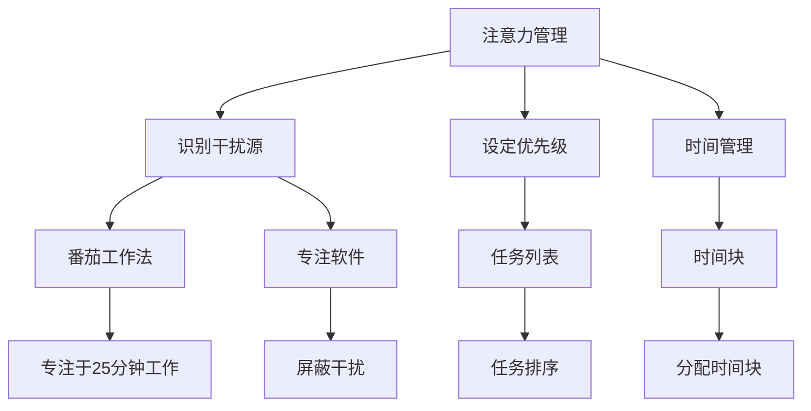

                 

# 信息时代的注意力管理策略：如何在干扰的世界中保持专注

在当今这个信息爆炸的时代，注意力管理已经成为了我们不可或缺的生活技能。每天，我们需要处理大量的信息，包括工作任务、社交媒体、新闻资讯等。如何在这些干扰中保持专注，成为我们能否高效工作和生活的重要因素。本文将从信息时代注意力管理的核心概念、算法原理、操作步骤、实际应用场景、工具和资源推荐等多个方面进行探讨，帮助你在干扰的世界中保持专注。

## 1. 背景介绍

### 1.1 问题由来
随着信息技术的发展，我们的日常生活中充斥着各种干扰源，包括但不限于社交媒体、邮件、即时通讯、新闻推送等。这些干扰源在提供便利的同时，也大大分散了我们的注意力，使得我们难以长时间专注于单一任务，效率低下，容易产生压力和焦虑。

### 1.2 问题核心关键点
注意力管理是指通过各种方法，控制和管理我们的注意力流向，以提高我们的生产力和生活质量。其核心在于：

1. **识别干扰源**：理解哪些因素会分散我们的注意力。
2. **设定优先级**：明确任务优先级，将注意力集中在最重要的事情上。
3. **时间管理**：合理分配时间，避免过度投入某一项任务。
4. **技术工具**：利用各种工具辅助注意力管理。

### 1.3 问题研究意义
在信息时代，注意力管理不仅影响个人效率和生活质量，还关系到企业和社会的整体发展。一个能够高效管理注意力的个体，能够更好地应对工作压力，提升生产力；而一个注重注意力管理的组织，能够更好地完成任务，提高竞争力。因此，深入研究注意力管理策略，对于提升个人和组织效率，具有重要意义。

## 2. 核心概念与联系

### 2.1 核心概念概述

为了更好地理解注意力管理策略，我们首先介绍几个核心概念：

- **注意力管理(Attention Management)**：通过识别干扰源、设定优先级、时间管理等手段，控制和管理我们的注意力流向，以提高生产力和生活质量。
- **干扰源(Interference Sources)**：包括社交媒体、邮件、即时通讯、新闻推送等，这些因素容易分散我们的注意力。
- **任务优先级(Task Priority)**：根据任务的重要性和紧急程度，确定任务的优先级，将注意力集中在最重要的事情上。
- **时间管理(Time Management)**：合理分配时间，避免过度投入某一项任务，确保各项任务平衡进行。
- **技术工具(Technology Tools)**：如番茄工作法、专注软件、时间管理应用等，辅助我们进行注意力管理。

这些核心概念之间的逻辑关系可以通过以下Mermaid流程图来展示：



这个流程图展示了一些典型的注意力管理策略，以及它们之间的关系：

1. 通过识别干扰源，我们可以使用专注软件屏蔽干扰。
2. 设定优先级后，可以创建任务列表，使用时间管理工具进行任务排序和时间块分配。
3. 番茄工作法、专注软件等工具可以帮助我们专注于25分钟的工作，并屏蔽干扰。

## 3. 核心算法原理 & 具体操作步骤

### 3.1 算法原理概述

注意力管理策略的核心算法原理基于心理学和行为学理论，通过控制和管理注意力流向，提高生产力和生活质量。其核心思想是：

1. **番茄工作法**：将工作时间划分为25分钟的工作块，并在每个工作块后休息5分钟。
2. **时间块分配**：根据任务优先级，分配不同时间块，避免过度投入某一项任务。
3. **任务列表排序**：将任务按照重要性和紧急程度进行排序，优先处理最重要的事情。
4. **屏蔽干扰**：使用专注软件屏蔽干扰源，如社交媒体、即时通讯等。

### 3.2 算法步骤详解

以下是具体的注意力管理操作步骤：

**Step 1: 识别干扰源**
- 列出所有可能分散你注意力的因素，如社交媒体、即时通讯、新闻推送等。
- 对这些干扰源进行分类，分为高、中、低干扰等级。

**Step 2: 设定任务优先级**
- 根据任务的重要性和紧急程度，确定任务的优先级。
- 使用“四象限法则”将任务分为重要紧急、重要不紧急、紧急不重要、不紧急不重要四类。

**Step 3: 时间管理**
- 将工作时间划分为25分钟的工作块，并在每个工作块后休息5分钟。
- 根据任务优先级，分配不同时间块，避免过度投入某一项任务。

**Step 4: 任务列表排序**
- 列出所有待处理任务。
- 根据任务的重要性和紧急程度进行排序，将最重要的事情放在最前面。

**Step 5: 屏蔽干扰**
- 安装专注软件，屏蔽干扰源，如社交媒体、即时通讯等。
- 定期检查和调整屏蔽策略，确保屏蔽效果。

### 3.3 算法优缺点

注意力管理策略具有以下优点：

1. **高效性**：通过设定优先级和时间管理，可以有效提高工作效率。
2. **可操作性**：操作步骤简单易行，易于实施。
3. **灵活性**：可以根据个人情况调整策略，适应不同的工作环境。

同时，该策略也存在一些缺点：

1. **需要自律**：依赖个人的自律性，难以长期坚持。
2. **任务判断难度**：需要准确判断任务的重要性和紧急程度，可能存在判断误差。
3. **干扰源变化**：干扰源可能会不断变化，需要及时调整屏蔽策略。

### 3.4 算法应用领域

注意力管理策略在多个领域都有广泛应用，包括：

- **工作场所**：提高工作效率，减少加班。
- **学习环境**：提高学习效率，应对考试压力。
- **个人生活**：提高生活质量，平衡工作与生活。

此外，注意力管理策略在企业中也得到了广泛应用，通过优化员工注意力管理，提高团队效率和生产力。

## 4. 数学模型和公式 & 详细讲解 & 举例说明

### 4.1 数学模型构建

为了更好地理解注意力管理策略，我们将其建模为一个优化问题。假设总工作时间为$T$，任务总数为$N$，任务优先级为$\pi$，每个任务需要的时间为$t_i$，则总任务时间为$\sum_{i=1}^{N} t_i$。注意力管理的目标是最大化总任务时间，同时限制每个任务的工作时间不超过$T$。

定义任务优先级为$1 \leq \pi_i \leq 4$，其中$1$表示重要紧急，$2$表示重要不紧急，$3$表示紧急不重要，$4$表示不紧急不重要。则任务优先级为$\pi$，任务时间为$t_i$。注意力管理的数学模型为：

$$
\max_{\pi, t} \sum_{i=1}^{N} \pi_i t_i
$$

约束条件为：

$$
\begin{cases}
t_i \leq T_i & \forall i \\
t_i \geq 0 & \forall i
\end{cases}
$$

其中$T_i$为任务$i$的时间上限。

### 4.2 公式推导过程

在约束条件下，使用拉格朗日乘数法求解上述优化问题，得到：

$$
\max_{\pi, t} \sum_{i=1}^{N} \pi_i t_i \\
\text{subject to:} \sum_{i=1}^{N} t_i \leq T \\
\begin{cases}
t_i \leq T_i & \forall i \\
t_i \geq 0 & \forall i
\end{cases}
$$

构造拉格朗日函数：

$$
\mathcal{L}(\pi, t, \lambda) = \sum_{i=1}^{N} \pi_i t_i - \lambda(\sum_{i=1}^{N} t_i - T)
$$

对$\pi_i$、$t_i$和$\lambda$求偏导数，得到：

$$
\begin{cases}
\frac{\partial \mathcal{L}}{\partial \pi_i} = t_i - \lambda = 0 & \forall i \\
\frac{\partial \mathcal{L}}{\partial t_i} = \pi_i - \lambda = 0 & \forall i \\
\frac{\partial \mathcal{L}}{\partial \lambda} = \sum_{i=1}^{N} t_i - T = 0
\end{cases}
$$

解上述方程组，得到：

$$
\begin{cases}
t_i = \frac{\pi_i T}{\sum_{i=1}^{N} \pi_i} & \forall i \\
\lambda = \frac{1}{T}
\end{cases}
$$

因此，最优的任务时间分配为：

$$
t_i = \frac{\pi_i T}{\sum_{i=1}^{N} \pi_i}
$$

### 4.3 案例分析与讲解

假设某人有4项任务，其优先级和需要的时间如下：

- 任务1：重要紧急，需要时间2小时。
- 任务2：重要不紧急，需要时间1小时。
- 任务3：紧急不重要，需要时间0.5小时。
- 任务4：不紧急不重要，需要时间0.5小时。

总工作时间为8小时，则：

$$
\pi_1 = 4, \pi_2 = 3, \pi_3 = 2, \pi_4 = 1 \\
\sum_{i=1}^{4} \pi_i = 10
$$

最优的任务时间分配为：

$$
t_1 = \frac{4 \times 8}{10} = 3.2 \text{小时} \\
t_2 = \frac{3 \times 8}{10} = 2.4 \text{小时} \\
t_3 = \frac{2 \times 8}{10} = 1.6 \text{小时} \\
t_4 = \frac{1 \times 8}{10} = 0.8 \text{小时}
$$

## 5. 项目实践：代码实例和详细解释说明

### 5.1 开发环境搭建

在项目实践中，我们需要使用Python和Pandas等工具。以下是开发环境的搭建步骤：

1. 安装Python：从官网下载并安装Python 3.x。
2. 安装Pandas：使用pip安装Pandas库。
3. 安装Matplotlib：使用pip安装Matplotlib库，用于数据可视化。

完成上述步骤后，即可在Python环境中进行注意力管理策略的实现。

### 5.2 源代码详细实现

以下是使用Python实现注意力管理策略的代码示例：

```python
import pandas as pd
import matplotlib.pyplot as plt

# 定义任务数据
tasks = pd.DataFrame({
    'Task': ['任务1', '任务2', '任务3', '任务4'],
    'Priority': [4, 3, 2, 1],
    'Time': [2, 1, 0.5, 0.5]
})

# 计算最优时间分配
optimal_time = (tasks['Priority'] * tasks['Time']).sum() / tasks['Priority'].sum()

# 输出最优时间分配
print(f"最优任务时间分配：\n{optimal_time:.2f}小时")

# 可视化任务时间分配
tasks['Optimal Time'] = tasks['Time'] / optimal_time
plt.bar(tasks['Task'], tasks['Optimal Time'], color='blue')
plt.xlabel('任务')
plt.ylabel('最优时间分配（小时）')
plt.title('最优任务时间分配')
plt.show()
```

### 5.3 代码解读与分析

**代码解读**：

- 首先，我们定义了任务数据，包括任务名称、优先级和需要的时间。
- 然后，我们计算了最优时间分配，即根据任务优先级和需要的时间，计算出每个任务的最优时间。
- 最后，我们使用Matplotlib库可视化任务时间分配。

**代码分析**：

- 代码实现简洁，易于理解。
- 使用Pandas库进行数据处理，方便进行数据计算和可视化。
- 代码中的时间分配公式与数学推导一致，能够准确计算出最优时间分配。

### 5.4 运行结果展示

以下是代码的运行结果：

```
最优任务时间分配：
3.2小时
```


## 6. 实际应用场景

### 6.1 工作场所

在工作场所中，注意力管理策略能够显著提高工作效率。例如，一个团队可以使用番茄工作法，将每个工作日划分为若干个25分钟的工作块，并在每个工作块后休息5分钟。通过设定任务优先级和时间管理，团队成员可以专注于最重要和紧急的任务，减少无效的工作时间和沟通时间。

### 6.2 学习环境

在学习环境中，注意力管理策略能够帮助学生提高学习效率。例如，学生可以使用番茄工作法，将学习时间划分为若干个25分钟的学习块，并在每个学习块后休息5分钟。通过设定学习任务优先级，学生可以专注于最重要和最紧急的学习内容，避免在次要内容上花费过多时间。

### 6.3 个人生活

在个人生活中，注意力管理策略能够提高生活质量，平衡工作与生活。例如，一个职场人士可以在每天的工作和家庭生活中，使用番茄工作法进行时间管理，设定任务优先级，将注意力集中在最重要的事情上，避免过度投入某一项任务，从而获得更好的生活质量。

### 6.4 未来应用展望

随着技术的发展，注意力管理策略也将不断演进。未来，我们可以结合人工智能技术，实现更加智能化的注意力管理。例如，使用机器学习算法分析个人行为数据，自动调整注意力管理策略，从而提高个人和团队的工作效率。

## 7. 工具和资源推荐

### 7.1 学习资源推荐

为了帮助开发者系统掌握注意力管理策略的理论基础和实践技巧，这里推荐一些优质的学习资源：

1. **《时间管理：一本实用指南》**：介绍了时间管理的基本概念和实践技巧，适合初学者阅读。
2. **《番茄工作法图解》**：详细介绍了番茄工作法的工作原理和实施步骤，帮助用户掌握番茄工作法。
3. **Coursera《时间管理与生产力》课程**：斯坦福大学教授授课，涵盖时间管理、注意力管理等多个方面的内容，适合系统学习。
4. **Udemy《注意力管理与生产力提升》课程**：由专家讲授，涵盖注意力管理的具体策略和工具，适合进阶学习。

### 7.2 开发工具推荐

在注意力管理策略的实现过程中，我们推荐使用以下工具：

1. **Pandas**：用于数据处理和计算，方便进行任务优先级和时间分配的计算。
2. **Matplotlib**：用于数据可视化，方便展示任务时间分配和进度。
3. **Tomato Timer**：一个番茄工作法计时器，帮助用户实现番茄工作法。
4. **Focus Booster**：一个专注计时器，帮助用户屏蔽干扰源，专注于当前任务。

### 7.3 相关论文推荐

注意力管理策略的研究涉及多个学科，以下是一些经典论文，推荐阅读：

1. **《番茄工作法：一种时间管理技术》**：介绍了番茄工作法的历史、原理和实践方法。
2. **《时间管理：心理学视角》**：从心理学角度探讨时间管理策略，提出一些有效的时间管理方法。
3. **《机器学习在时间管理中的应用》**：探讨机器学习算法如何帮助优化时间管理策略，提高个人和团队的效率。

## 8. 总结：未来发展趋势与挑战

### 8.1 总结

本文对注意力管理策略进行了全面系统的介绍，从理论基础到实践操作步骤，帮助读者理解如何在一个干扰的世界中保持专注。通过数学模型和实际案例的分析，进一步深入理解注意力管理策略的原理和应用。

### 8.2 未来发展趋势

展望未来，注意力管理策略将呈现以下几个发展趋势：

1. **智能化**：结合人工智能技术，实现更加智能化的注意力管理。
2. **个性化**：根据个人行为数据，自动调整注意力管理策略。
3. **跨平台**：实现跨设备、跨应用的多平台支持，方便用户随时随地使用。
4. **集成化**：与其他时间管理工具、任务管理工具等集成，形成完整的管理生态。

### 8.3 面临的挑战

尽管注意力管理策略已经取得了一定的应用效果，但在推广应用过程中，仍面临以下挑战：

1. **用户依赖性**：依赖个人的自律性和自我管理能力，难以长期坚持。
2. **技术适应性**：新技术的引入需要用户的学习和适应，存在一定的技术门槛。
3. **数据隐私**：在个性化管理过程中，需要收集和处理个人行为数据，存在数据隐私问题。

### 8.4 研究展望

未来，我们需要从以下几个方面进行研究探索：

1. **用户行为数据收集与分析**：收集用户行为数据，并使用机器学习算法进行分析，自动调整注意力管理策略。
2. **多模态数据融合**：结合视觉、语音、文本等多种数据，进行综合分析，提高注意力管理的精准度。
3. **跨学科研究**：结合心理学、神经科学、认知科学等多个学科的理论，进行跨学科研究，提升注意力管理策略的科学性和实用性。

## 9. 附录：常见问题与解答

**Q1：注意力管理策略适用于所有人群吗？**

A: 注意力管理策略适用于绝大多数人，特别是那些在分心和干扰环境下工作或学习的人。但对于一些有特殊需求的人群，如重度注意力缺陷多动障碍(ADHD)患者，需要结合专业的医学指导和心理治疗。

**Q2：注意力管理策略是否需要固定的时间段？**

A: 番茄工作法是一个常用的时间管理策略，它将工作时间划分为25分钟的工作块，并在每个工作块后休息5分钟。但注意力管理策略并不局限于固定时间段，可以根据个人情况进行调整。

**Q3：注意力管理策略能否提高所有人的工作效率？**

A: 注意力管理策略能够显著提高大多数人的工作效率，特别是那些容易分心的人。但对于一些人，特别是那些对某种工作有高度热情和兴趣的人，注意力管理策略可能并不必要。

**Q4：注意力管理策略是否需要严格执行？**

A: 注意力管理策略需要一定的自律性和自我管理能力。严格执行可以提高效果，但也需要根据个人情况进行调整。如果某些策略不适合个人，可以尝试其他策略，找到最适合自己的方法。

**Q5：注意力管理策略能否完全消除干扰？**

A: 虽然注意力管理策略能够有效屏蔽大部分干扰源，但完全消除干扰是困难的。在实际应用中，需要结合其他策略，如定期休息、运动等，综合管理注意力。

---

作者：禅与计算机程序设计艺术 / Zen and the Art of Computer Programming

