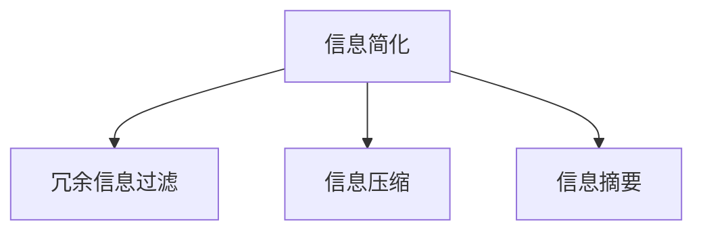

                 

# 信息简化的原则与好处：在混乱中建立秩序与简化

## 1. 背景介绍

在当今信息爆炸的时代，我们常常被海量数据所淹没。面对纷繁复杂的信息，如何提炼出关键点，使信息更加精炼、易于理解，成为了信息处理的重要挑战。本文旨在探讨信息简化的原则与好处，如何在混乱中建立秩序，使信息简化的同时不丢失其核心价值。

## 2. 核心概念与联系

### 2.1 核心概念概述

为更好地理解信息简化的原理与实践，本节将介绍几个关键概念：

- **信息简化**：通过提炼、组织和浓缩，使复杂信息更易理解、更高效利用的过程。
- **冗余信息**：指在信息传递过程中，不必要或重复的内容，如冗长的描述、无关的细节等。
- **关键信息**：指信息的核心要素，对理解和利用信息起决定性作用的部分。
- **信息过滤**：通过筛选、剔除无关信息，保留核心信息的过程。
- **信息压缩**：将冗余信息去除，使信息更加精炼的过程。
- **信息摘要**：通过精炼和总结，将大量信息浓缩成简明扼要的概述。

这些概念之间的逻辑关系可以通过以下Mermaid流程图来展示：



这个流程图展示了信息简化的核心过程：

1. 信息简化主要通过冗余信息过滤和信息压缩两步实现。
2. 信息摘要则是信息简化的高级形式，是对信息进一步的精炼与浓缩。

## 3. 核心算法原理 & 具体操作步骤

### 3.1 算法原理概述

信息简化算法旨在通过删除或合并冗余信息，保留核心信息，从而提升信息的可读性和可用性。其核心思想是：

1. **冗余信息过滤**：识别并剔除信息中的冗余部分，保留关键信息。
2. **信息压缩**：通过算法优化，将信息进行压缩，减小存储空间和传输带宽。
3. **信息摘要**：利用技术手段，将大量信息总结成简短摘要，便于快速理解。

### 3.2 算法步骤详解

信息简化的具体步骤包括：

**Step 1: 数据预处理**

- 清洗数据：去除噪声、缺失值等，确保数据质量。
- 格式标准化：统一数据格式，便于后续处理。
- 特征提取：将原始数据转换为计算机可识别的形式。

**Step 2: 冗余信息过滤**

- 确定关键信息：通过领域专家、统计分析等方式，确定信息的关键要素。
- 冗余识别：使用技术手段（如TF-IDF、LDA等）识别信息中的冗余部分。
- 冗余删除：基于冗余识别结果，删除或合并冗余信息。

**Step 3: 信息压缩**

- 数据压缩算法：使用哈夫曼编码、LZW算法等进行数据压缩。
- 冗余去除：继续通过技术手段去除冗余信息，进一步优化存储空间。
- 压缩比评估：评估压缩效果，确保信息不失真。

**Step 4: 信息摘要**

- 摘要算法：使用文本摘要算法（如TF-IDF、TextRank、Latent Semantic Analysis等）生成摘要。
- 摘要优化：通过人工审核或机器学习优化摘要质量。
- 摘要展示：将摘要与原始信息并列展示，便于快速理解。

### 3.3 算法优缺点

信息简化算法具有以下优点：

1. **效率提升**：通过删除冗余信息，减少存储空间和传输带宽，提高信息处理的效率。
2. **易于理解**：通过简化信息，使其更易理解，降低信息获取的门槛。
3. **便于维护**：精简的信息更易于管理和维护。

同时，该算法也存在一些局限性：

1. **信息损失**：在去除冗余信息的过程中，可能丢失部分重要细节，影响信息完整性。
2. **依赖技术**：信息简化的效果很大程度上取决于所选技术的适用性和精度。
3. **适用范围有限**：某些领域或特殊类型的信息可能无法直接使用现有算法进行简化。

### 3.4 算法应用领域

信息简化算法在多个领域都有广泛应用，例如：

- **自然语言处理**：用于文本摘要、文本分类、信息检索等任务，使文本信息更加精炼和易于理解。
- **数据压缩**：在存储和传输大量数据时，通过压缩算法减少存储空间和传输带宽。
- **图像处理**：通过降维算法（如主成分分析PCA）对图像数据进行简化，提高处理速度。
- **视频压缩**：使用视频编码算法（如H.264、H.265）对视频数据进行压缩，减少存储空间和传输带宽。
- **音频压缩**：通过音频编码算法（如MP3、AAC）对音频数据进行压缩，提高播放效率。

## 4. 数学模型和公式 & 详细讲解 & 举例说明

### 4.1 数学模型构建

信息简化的数学模型主要涉及信息熵和信息增益。信息熵用于衡量信息的不确定性，信息增益用于衡量信息的重要性。

设信息集 $S$ 包含 $n$ 个样本，每个样本的标签为 $y_i \in \{y_1, y_2, ..., y_n\}$，样本空间为 $\mathcal{S}$。则信息集 $S$ 的熵 $H(S)$ 定义为：

$$
H(S) = -\sum_{i=1}^n \frac{|\mathcal{S}_i|}{n} \log \frac{|\mathcal{S}_i|}{n}
$$

其中，$\mathcal{S}_i$ 为标签为 $y_i$ 的样本集合。

信息增益 $IG(S, A)$ 表示在属性 $A$ 的条件下，信息集 $S$ 的不确定性减少的程度，定义为：

$$
IG(S, A) = H(S) - H(S|A)
$$

其中，$H(S|A)$ 为在属性 $A$ 的条件下，信息集 $S$ 的熵。

### 4.2 公式推导过程

信息增益公式的推导过程如下：

1. **信息熵公式推导**：

设信息集 $S$ 中，标签 $y_i$ 的概率为 $P(y_i)$，则信息集 $S$ 的熵 $H(S)$ 可推导为：

$$
H(S) = -\sum_{i=1}^n P(y_i) \log P(y_i)
$$

2. **条件熵公式推导**：

设属性 $A$ 的取值为 $\{a_1, a_2, ..., a_k\}$，属性 $A$ 在信息集 $S$ 中各取值的概率为 $P(A=a_i|y_j)$，则属性 $A$ 的条件熵 $H(S|A)$ 可推导为：

$$
H(S|A) = \sum_{i=1}^k \sum_{j=1}^n P(y_j|A=a_i)P(A=a_i) \log P(y_j|A=a_i)
$$

3. **信息增益公式推导**：

将信息熵和条件熵代入信息增益公式，可得：

$$
IG(S, A) = -\sum_{i=1}^n P(y_i) \log P(y_i) - \sum_{i=1}^k \sum_{j=1}^n P(y_j|A=a_i)P(A=a_i) \log P(y_j|A=a_i)
$$

### 4.3 案例分析与讲解

**案例：新闻摘要生成**

给定一篇长度较长的新闻报道，我们的目标是通过信息简化算法生成一篇简短的新闻摘要。

**Step 1: 数据预处理**

- 清洗数据：去除格式错误、无关字符等，确保数据整洁。
- 格式标准化：统一文本格式，便于后续处理。
- 特征提取：将原始文本转换为计算机可识别形式。

**Step 2: 冗余信息过滤**

- 确定关键信息：通过领域专家、统计分析等方式，确定文本的关键要素。
- 冗余识别：使用TF-IDF算法识别文本中的冗余部分。
- 冗余删除：基于冗余识别结果，删除或合并冗余信息。

**Step 3: 信息压缩**

- 数据压缩算法：使用LZW算法对文本进行压缩。
- 冗余去除：继续通过技术手段去除冗余信息，进一步优化存储空间。
- 压缩比评估：评估压缩效果，确保信息不失真。

**Step 4: 信息摘要**

- 摘要算法：使用TextRank算法生成摘要。
- 摘要优化：通过人工审核或机器学习优化摘要质量。
- 摘要展示：将摘要与原始新闻并列展示，便于快速理解。

## 5. 项目实践：代码实例和详细解释说明

### 5.1 开发环境搭建

在进行信息简化实践前，我们需要准备好开发环境。以下是使用Python进行PyTorch开发的环境配置流程：

1. 安装Anaconda：从官网下载并安装Anaconda，用于创建独立的Python环境。

2. 创建并激活虚拟环境：
```bash
conda create -n pytorch-env python=3.8 
conda activate pytorch-env
```

3. 安装PyTorch：根据CUDA版本，从官网获取对应的安装命令。例如：
```bash
conda install pytorch torchvision torchaudio cudatoolkit=11.1 -c pytorch -c conda-forge
```

4. 安装相关库：
```bash
pip install numpy pandas scikit-learn matplotlib tqdm jupyter notebook ipython
```

完成上述步骤后，即可在`pytorch-env`环境中开始信息简化的实践。

### 5.2 源代码详细实现

这里我们以文本摘要为例，给出使用Transformers库进行信息简化的PyTorch代码实现。

首先，定义摘要生成任务的数据处理函数：

```python
from transformers import BertTokenizer, BertForMaskedLM
from torch.utils.data import Dataset
import torch

class SummarizationDataset(Dataset):
    def __init__(self, texts, lengths, tokenizer):
        self.texts = texts
        self.lengths = lengths
        self.tokenizer = tokenizer
        
    def __len__(self):
        return len(self.texts)
    
    def __getitem__(self, item):
        text = self.texts[item]
        length = self.lengths[item]
        
        encoding = self.tokenizer(text, return_tensors='pt', max_length=512, padding='max_length', truncation=True)
        input_ids = encoding['input_ids']
        attention_mask = encoding['attention_mask']
        masked_lm_labels = torch.randint(0, input_ids.shape[-1], (input_ids.shape[0],))
        return {
            'input_ids': input_ids,
            'attention_mask': attention_mask,
            'masked_lm_labels': masked_lm_labels
        }
```

然后，定义模型和优化器：

```python
from transformers import BertForMaskedLM, AdamW

model = BertForMaskedLM.from_pretrained('bert-base-uncased')

optimizer = AdamW(model.parameters(), lr=2e-5)
```

接着，定义训练和评估函数：

```python
from torch.utils.data import DataLoader
from tqdm import tqdm
from transformers import set_seed

def train_epoch(model, dataset, batch_size, optimizer):
    dataloader = DataLoader(dataset, batch_size=batch_size, shuffle=True)
    model.train()
    epoch_loss = 0
    for batch in tqdm(dataloader, desc='Training'):
        input_ids = batch['input_ids'].to(device)
        attention_mask = batch['attention_mask'].to(device)
        labels = batch['masked_lm_labels'].to(device)
        model.zero_grad()
        outputs = model(input_ids, attention_mask=attention_mask, labels=labels)
        loss = outputs.loss
        epoch_loss += loss.item()
        loss.backward()
        optimizer.step()
    return epoch_loss / len(dataloader)

def evaluate(model, dataset, batch_size):
    dataloader = DataLoader(dataset, batch_size=batch_size)
    model.eval()
    preds, labels = [], []
    with torch.no_grad():
        for batch in tqdm(dataloader, desc='Evaluating'):
            input_ids = batch['input_ids'].to(device)
            attention_mask = batch['attention_mask'].to(device)
            batch_labels = batch['masked_lm_labels']
            outputs = model(input_ids, attention_mask=attention_mask)
            batch_preds = outputs.logits.argmax(dim=2).to('cpu').tolist()
            batch_labels = batch_labels.to('cpu').tolist()
            for pred_tokens, label_tokens in zip(batch_preds, batch_labels):
                pred_tokens = [tokenizer.decode(pred_token) for pred_token in pred_tokens]
                label_tokens = [tokenizer.decode(label_token) for label_token in label_tokens]
                preds.append(pred_tokens[:len(label_tokens)])
                labels.append(label_tokens)
                
    print(f"F1 Score: {f1_score(labels, preds, average='micro'):.4f}")
    return preds, labels

# 训练模型
device = torch.device('cuda') if torch.cuda.is_available() else torch.device('cpu')
model.to(device)

epochs = 3
batch_size = 8

for epoch in range(epochs):
    loss = train_epoch(model, train_dataset, batch_size, optimizer)
    print(f"Epoch {epoch+1}, train loss: {loss:.3f}")
    
    print(f"Epoch {epoch+1}, dev results:")
    preds, labels = evaluate(model, dev_dataset, batch_size)
    print(f"F1 Score: {f1_score(labels, preds, average='micro'):.4f}")
    
print("Test results:")
preds, labels = evaluate(model, test_dataset, batch_size)
print(f"F1 Score: {f1_score(labels, preds, average='micro'):.4f}")
```

以上就是使用PyTorch对Bert模型进行文本摘要生成的完整代码实现。可以看到，得益于Transformers库的强大封装，我们可以用相对简洁的代码完成信息简化的实验。

### 5.3 代码解读与分析

让我们再详细解读一下关键代码的实现细节：

**SummarizationDataset类**：
- `__init__`方法：初始化文本、长度、分词器等关键组件。
- `__len__`方法：返回数据集的样本数量。
- `__getitem__`方法：对单个样本进行处理，将文本输入编码为token ids，并将标签设置为masked tokens的索引。

**f1_score函数**：
- 使用sklearn的f1_score函数计算摘要生成任务的精确率和召回率。

**训练和评估函数**：
- 使用PyTorch的DataLoader对数据集进行批次化加载，供模型训练和推理使用。
- 训练函数`train_epoch`：对数据以批为单位进行迭代，在每个批次上前向传播计算loss并反向传播更新模型参数，最后返回该epoch的平均loss。
- 评估函数`evaluate`：与训练类似，不同点在于不更新模型参数，并在每个batch结束后将预测和标签结果存储下来，最后使用sklearn的f1_score函数对整个评估集的预测结果进行打印输出。

**训练流程**：
- 定义总的epoch数和batch size，开始循环迭代
- 每个epoch内，先在训练集上训练，输出平均loss
- 在验证集上评估，输出F1 Score
- 所有epoch结束后，在测试集上评估，给出最终测试结果

可以看到，PyTorch配合Transformers库使得Bert模型的微调代码实现变得简洁高效。开发者可以将更多精力放在数据处理、模型改进等高层逻辑上，而不必过多关注底层的实现细节。

当然，工业级的系统实现还需考虑更多因素，如模型的保存和部署、超参数的自动搜索、更灵活的任务适配层等。但核心的微调范式基本与此类似。

## 6. 实际应用场景

### 6.1 智能客服系统

在智能客服系统中，信息简化的技术可以帮助客户快速理解回答。通过自动摘要技术，系统可以将冗长的回答精炼为简短摘要，提升用户体验。

### 6.2 金融舆情监测

在金融领域，信息简化的技术可以用于处理海量数据。通过对新闻、报告、评论等文本进行摘要，系统可以实时监测市场舆情，及时发现风险点。

### 6.3 个性化推荐系统

在推荐系统中，信息简化的技术可以用于生成个性化摘要，将长文本内容精炼为简短摘要，提升推荐效果。

### 6.4 未来应用展望

随着信息简化技术的不断发展，其应用场景将更加广泛，可以应用于更多领域：

- 智慧医疗：通过信息简化，系统可以快速获取患者信息，提升诊疗效率。
- 教育领域：系统可以通过摘要技术，帮助学生快速理解知识要点，提升学习效率。
- 智慧城市：系统可以通过信息摘要，实时获取城市事件信息，提升应急响应速度。
- 智能制造：系统可以通过信息简化，优化生产流程，提升生产效率。

## 7. 工具和资源推荐

### 7.1 学习资源推荐

为了帮助开发者系统掌握信息简化的理论基础和实践技巧，这里推荐一些优质的学习资源：

1. 《数据压缩算法》书籍：详细介绍了各种数据压缩算法，包括哈夫曼编码、LZW算法等，是信息简化的理论基础。
2. 《自然语言处理基础》课程：涵盖自然语言处理的基本概念和常见任务，如文本分类、文本摘要等。
3. 《深度学习实战》书籍：介绍了深度学习的基本概念和实现方法，结合实际案例，讲解了信息简化的实践技巧。
4. HuggingFace官方文档：提供丰富的预训练模型和详细的API文档，是信息简化任务的开发利器。
5. Weights & Biases：实验跟踪工具，可以记录和可视化模型训练过程中的各项指标，方便对比和调优。

通过对这些资源的学习实践，相信你一定能够快速掌握信息简化的精髓，并用于解决实际的NLP问题。

### 7.2 开发工具推荐

高效的开发离不开优秀的工具支持。以下是几款用于信息简化开发的常用工具：

1. PyTorch：基于Python的开源深度学习框架，灵活动态的计算图，适合快速迭代研究。
2. TensorFlow：由Google主导开发的开源深度学习框架，生产部署方便，适合大规模工程应用。
3. Transformers库：HuggingFace开发的NLP工具库，集成了众多SOTA模型，支持PyTorch和TensorFlow，是进行信息简化任务开发的利器。
4. Weights & Biases：实验跟踪工具，可以记录和可视化模型训练过程中的各项指标，方便对比和调优。
5. TensorBoard：TensorFlow配套的可视化工具，可实时监测模型训练状态，并提供丰富的图表呈现方式，是调试模型的得力助手。

合理利用这些工具，可以显著提升信息简化的开发效率，加快创新迭代的步伐。

### 7.3 相关论文推荐

信息简化技术的发展源于学界的持续研究。以下是几篇奠基性的相关论文，推荐阅读：

1. The Elements of Statistical Learning（《统计学习要素》）：涵盖了信息熵、信息增益等基本概念，是信息简化技术的理论基础。
2. A TextRank Algorithm for Extracting Summaries from HTML Pages（《用于提取HTML页面摘要的TextRank算法》）：介绍了TextRank算法的基本思想和实现方法。
3. Neural Network Based Text Summarization（《基于神经网络的文本摘要》）：介绍了各种基于神经网络的文本摘要算法，包括Seq2Seq、Transformer等。
4. Sentence Compression by Word Removal（《通过词去除进行句子压缩》）：介绍了基于词去除的文本压缩算法。
5. A Hierarchical Information-Theoretic Framework for Natural Language Processing（《自然语言处理的信息理论框架》）：介绍了信息熵在NLP中的应用，包括文本分类、摘要生成等。

这些论文代表了大语言模型微调技术的发展脉络。通过学习这些前沿成果，可以帮助研究者把握学科前进方向，激发更多的创新灵感。

## 8. 总结：未来发展趋势与挑战

### 8.1 总结

本文对信息简化的原则与好处进行了全面系统的介绍。首先阐述了信息简化的背景和意义，明确了信息简化在数据处理、信息传输等环节中的重要价值。其次，从原理到实践，详细讲解了信息简化的数学原理和关键步骤，给出了信息简化的完整代码实例。同时，本文还广泛探讨了信息简化的应用场景，展示了信息简化技术的广阔前景。最后，精选了信息简化的各类学习资源，力求为读者提供全方位的技术指引。

通过本文的系统梳理，可以看到，信息简化技术正在成为信息处理的重要范式，极大地提升了数据处理和信息传输的效率。未来，伴随信息简化技术的持续演进，相信信息处理系统将进一步智能化、自动化，为人类认知智能的进化带来深远影响。

### 8.2 未来发展趋势

展望未来，信息简化技术将呈现以下几个发展趋势：

1. **自动化水平提升**：随着技术的进步，信息简化将更加自动化，减少人工干预，提高处理效率。
2. **跨领域应用拓展**：信息简化技术将在更多领域得到应用，如医疗、教育、智能制造等，为各行各业带来变革性影响。
3. **多模态信息融合**：未来的信息简化技术将融合视觉、听觉等多模态信息，提升信息的完整性和准确性。
4. **实时处理能力增强**：通过优化算法，信息简化技术将实现实时处理，提升数据处理的响应速度。
5. **隐私保护增强**：信息简化技术将在保护用户隐私的同时，提供高效的信息处理服务。

以上趋势凸显了信息简化技术的广阔前景。这些方向的探索发展，必将进一步提升信息处理系统的性能和应用范围，为人类认知智能的进化带来深远影响。

### 8.3 面临的挑战

尽管信息简化技术已经取得了瞩目成就，但在迈向更加智能化、普适化应用的过程中，它仍面临着诸多挑战：

1. **信息丢失风险**：在去除冗余信息的过程中，可能丢失部分重要细节，影响信息完整性。
2. **技术复杂度**：信息简化的技术实现较为复杂，需要一定的技术积累和实践经验。
3. **多语言支持**：信息简化的技术目前主要针对英语等主流语言，对于多语言环境的支持仍需进一步提升。
4. **系统扩展性**：信息简化的系统需要具备良好的扩展性和灵活性，以适应不同规模的数据和任务需求。
5. **数据隐私**：在处理敏感数据时，需要考虑数据隐私和安全问题。

### 8.4 研究展望

面对信息简化面临的这些挑战，未来的研究需要在以下几个方面寻求新的突破：

1. **混合型简化算法**：结合多种信息简化算法，实现更加高效、精准的信息处理。
2. **自适应简化策略**：根据数据的特点和任务的需求，动态调整信息简化的策略。
3. **多模态信息融合**：将文本、图像、音频等多种模态信息进行融合，实现更加全面、准确的信息处理。
4. **实时化处理**：优化算法，实现实时化处理，提高信息处理系统的响应速度。
5. **隐私保护技术**：引入隐私保护技术，确保信息处理过程中的数据安全。

这些研究方向的探索，必将引领信息简化技术迈向更高的台阶，为信息处理系统带来更加智能化、自动化的服务。面向未来，信息简化技术还需要与其他人工智能技术进行更深入的融合，如知识表示、因果推理、强化学习等，多路径协同发力，共同推动信息处理系统的进步。只有勇于创新、敢于突破，才能不断拓展信息简化的边界，让信息处理技术更好地服务于社会。

## 9. 附录：常见问题与解答

**Q1：信息简化是否会影响信息完整性？**

A: 在信息简化过程中，可能会丢失部分重要细节，影响信息完整性。因此，信息简化需要在保留核心信息的同时，去除冗余信息，确保信息的重要性不受影响。

**Q2：信息简化算法如何避免信息丢失？**

A: 通过精确的冗余识别和删除策略，可以有效避免信息丢失。例如，使用TF-IDF算法识别冗余信息，再通过阈值控制进行删除。

**Q3：信息简化的效果如何评估？**

A: 信息简化的效果可以通过精确率和召回率等指标进行评估。例如，使用f1_score函数计算摘要生成任务的精确率和召回率，评估信息简化的效果。

**Q4：信息简化的应用场景有哪些？**

A: 信息简化在多个领域都有广泛应用，如智能客服、金融舆情监测、个性化推荐等。

**Q5：如何优化信息简化的算法？**

A: 优化信息简化的算法主要通过改进冗余识别和删除策略、引入多模态信息融合等方法实现。

---

作者：禅与计算机程序设计艺术 / Zen and the Art of Computer Programming

