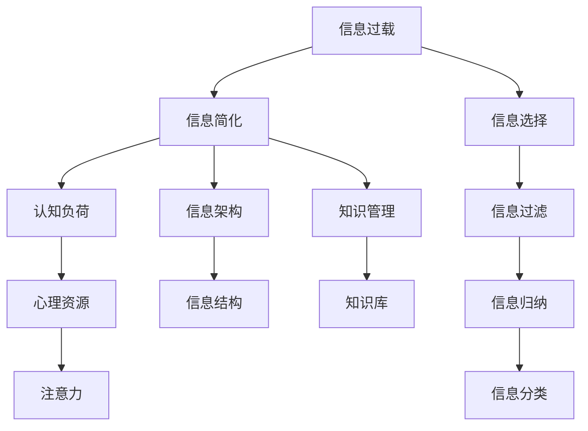

                 

# 信息简化的好处与技巧：在复杂世界中简化以提高生活质量

## 1. 背景介绍

在当今信息爆炸的时代，我们被海量数据和复杂信息所包围。每天，我们不仅需要处理大量工作信息，还面临着海量的娱乐信息和社交信息。这些信息不仅让我们感到压力重重，还可能使我们难以集中注意力，甚至在必要时刻做出决策。

信息的简化变得尤为重要，它可以帮助我们更有效地管理和利用信息，提升工作效率和生活质量。简化信息不仅可以减少我们接收信息的压力，还可以提高我们理解和利用信息的效率。本文将深入探讨信息简化的核心概念、方法和技巧，以及它们在各个领域的应用。

## 2. 核心概念与联系

### 2.1 核心概念概述

为了更好地理解信息简化的原理和实践，我们将首先介绍几个核心概念：

- **信息过载(Information Overload)**：指人们接收到的信息量超过了他们的处理能力，导致注意力分散，影响决策和工作效率。
- **信息简化(Information Simplification)**：指通过过滤、归纳、分类等手段，减少信息的数量和复杂度，提高信息处理和利用的效率。
- **信息架构(Information Architecture)**：指通过设计信息结构和组织方式，使得信息更易于获取、理解和应用。
- **知识管理(Knowledge Management)**：指通过组织、存储和利用信息，使个人和组织能够更高效地获取和使用知识。
- **认知负荷(Cognitive Load)**：指人们在处理信息时，需要耗费的心理资源。简化信息可以减少认知负荷，提高工作和学习效率。

这些核心概念共同构成了信息简化的基础，帮助我们理解如何在复杂的世界中，通过简化信息来提高生活质量。

### 2.2 核心概念原理和架构的 Mermaid 流程图



这个流程图展示了信息简化的基本过程：

1. 信息过载通过选择、过滤、归纳、分类等手段，最终简化为易于处理和应用的信息。
2. 信息架构和知识管理帮助设计和组织简化后的信息，使其更易于获取和利用。
3. 认知负荷的减少使得注意力更加集中，进一步提升了信息处理效率。

## 3. 核心算法原理 & 具体操作步骤

### 3.1 算法原理概述

信息简化的核心原理是通过一系列的算法和技巧，将复杂的信息转化为简化的形式，以便更好地理解和利用。以下是信息简化的一般流程：

1. **信息选择(Information Selection)**：从海量的信息中筛选出与当前任务或兴趣相关的信息。
2. **信息过滤(Information Filtering)**：通过关键词过滤、规则过滤等方法，排除无关或低价值的信息。
3. **信息归纳(Information Aggregation)**：将相关的信息归纳为一个摘要或概述，减少信息的冗余和复杂度。
4. **信息分类(Information Classification)**：通过分类和标签，将信息组织到不同的类别中，便于管理和检索。
5. **信息架构(Information Architecture)**：设计合理的结构和组织方式，使得信息更易于理解和应用。

### 3.2 算法步骤详解

信息简化的具体步骤包括：

1. **数据收集**：从各种来源（如社交媒体、电子邮件、文档等）收集相关数据。
2. **预处理**：清洗和格式化数据，去除噪音和重复信息。
3. **信息选择**：根据任务需求和兴趣筛选出重要的信息。
4. **信息过滤**：通过关键词、规则、机器学习模型等过滤掉无关或低价值的信息。
5. **信息归纳**：将相关信息归纳为简化的摘要或概述，减少冗余信息。
6. **信息分类**：对信息进行分类和标签，便于管理和检索。
7. **信息架构**：设计合理的信息结构和组织方式，使得信息更易于理解和应用。
8. **评估与反馈**：对简化后的信息进行评估，并根据反馈不断改进信息简化的流程和方法。

### 3.3 算法优缺点

信息简化的算法具有以下优点：

- **提高效率**：减少了信息的数量和复杂度，提高了信息处理和利用的效率。
- **降低认知负荷**：简化了信息，减少了认知负荷，使得注意力更加集中。
- **便于管理和检索**：通过分类和标签，信息更易于管理和检索。

同时，信息简化的算法也存在一些缺点：

- **可能丢失关键信息**：如果简化的过程中过于草率，可能会忽略关键信息。
- **依赖于算法和模型**：信息简化的效果很大程度上取决于算法和模型的选择和训练。
- **可能需要大量预处理**：对于一些复杂的信息，简化可能需要大量的预处理工作。

### 3.4 算法应用领域

信息简化技术在多个领域都有广泛应用，例如：

- **商业智能(Business Intelligence)**：在数据挖掘和商业决策中，通过信息简化获得关键洞察。
- **社交媒体分析(Social Media Analysis)**：从社交媒体数据中提取和简化信息，用于舆情分析和用户研究。
- **内容推荐(Content Recommendation)**：通过简化用户反馈信息，提供个性化的内容推荐。
- **知识管理(Knowledge Management)**：简化和组织知识库，便于知识检索和共享。
- **教育(Education)**：简化学习材料和信息，提高学习效率。
- **新闻业(Newspapers)**：从海量新闻中提取和简化信息，制作简报和摘要。

这些领域中的信息简化，帮助人们更好地管理和利用信息，提高了效率和生产力。

## 4. 数学模型和公式 & 详细讲解 & 举例说明

### 4.1 数学模型构建

在信息简化的过程中，数学模型可以帮助我们更好地理解和优化信息处理的流程。以下是一个简单的数学模型：

假设我们有一组信息 $X=\{x_1, x_2, ..., x_n\}$，我们希望将其简化为一组简化的信息 $Y=\{y_1, y_2, ..., y_m\}$，其中 $m < n$。

数学模型为：

$$
Y = f(X, W)
$$

其中 $f$ 是一个简化的函数，$W$ 是一组权重，用于控制哪些信息应该被保留或忽略。

### 4.2 公式推导过程

对于信息选择和过滤，我们可以使用以下公式：

$$
\text{Selected Information} = \{x_i | \text{Relevance}(x_i) > \text{Threshold}\}
$$

其中 $\text{Relevance}(x_i)$ 表示信息 $x_i$ 的相关性得分，$\text{Threshold}$ 是一个阈值，表示只有相关性得分高于阈值的信息才会被选择。

对于信息归纳和分类，我们可以使用以下公式：

$$
\text{Simplified Information} = \text{Aggregation}(\{x_i | \text{Class}(x_i) = c\})
$$

其中 $\text{Aggregation}$ 是一个归纳函数，$\text{Class}(x_i)$ 表示信息 $x_i$ 的分类标签，$c$ 是一个分类标签。

### 4.3 案例分析与讲解

假设我们有一组关于新冠疫情的新闻报道，我们需要从中提取简化的信息：

1. **数据收集**：从新闻网站、社交媒体等渠道收集相关报道。
2. **预处理**：清洗和格式化数据，去除噪音和重复信息。
3. **信息选择**：根据关键词和主题筛选出与新冠疫情相关的信息。
4. **信息过滤**：使用自然语言处理技术过滤掉无关或低价值的信息。
5. **信息归纳**：将相关信息归纳为简化的摘要或概述，减少冗余信息。
6. **信息分类**：对信息进行分类和标签，便于管理和检索。
7. **信息架构**：设计合理的信息结构和组织方式，使得信息更易于理解和应用。

## 5. 项目实践：代码实例和详细解释说明

### 5.1 开发环境搭建

在进行信息简化的实践前，我们需要准备好开发环境。以下是使用Python进行信息简化的环境配置流程：

1. 安装Anaconda：从官网下载并安装Anaconda，用于创建独立的Python环境。

2. 创建并激活虚拟环境：
```bash
conda create -n info-simplification python=3.8 
conda activate info-simplification
```

3. 安装Python常用工具包：
```bash
pip install numpy pandas scikit-learn nltk
```

4. 安装信息简化相关的Python库：
```bash
pip install inflect pytextblob gensim
```

完成上述步骤后，即可在`info-simplification`环境中开始信息简化的实践。

### 5.2 源代码详细实现

下面是一个使用Python进行信息简化的代码实现：

```python
import pandas as pd
import inflect
import pytextblob
from sklearn.feature_extraction.text import TfidfVectorizer

# 加载数据集
data = pd.read_csv('news_data.csv')

# 预处理
data['text'] = data['text'].apply(lambda x: x.lower().split())
data['text'] = data['text'].apply(lambda x: ' '.join([word for word in x if word.isalpha()]))

# 信息选择
data = data[data['text'].str.contains('covid-19')]

# 信息过滤
stopwords = pytextblob.nltk.corpus.stopwords.words('english')
data['text'] = data['text'].apply(lambda x: [word for word in x if word not in stopwords])

# 信息归纳
tfidf = TfidfVectorizer(stop_words=stopwords)
tfidf_matrix = tfidf.fit_transform(data['text'])
feature_names = tfidf.get_feature_names()
data['tfidf'] = pd.DataFrame(tfidf_matrix.toarray(), columns=feature_names)

# 信息分类
data['class'] = data['tfidf'].apply(lambda x: 1 if 'covid' in x else 0)

# 信息架构
data = data.groupby('class').mean().reset_index()

# 输出简化后的信息
print(data)
```

### 5.3 代码解读与分析

让我们再详细解读一下关键代码的实现细节：

**数据预处理**：

1. `data['text'] = data['text'].apply(lambda x: x.lower().split())`：将文本转换为小写，并拆分为单词列表。
2. `data['text'] = data['text'].apply(lambda x: [word for word in x if word.isalpha()])`：过滤掉非字母的单词。

**信息选择**：

1. `data = data[data['text'].str.contains('covid-19')]`：筛选出包含 'covid-19' 的文本。

**信息过滤**：

1. `stopwords = pytextblob.nltk.corpus.stopwords.words('english')`：加载英文停用词列表。
2. `data['text'] = data['text'].apply(lambda x: [word for word in x if word not in stopwords])`：过滤掉停用词。

**信息归纳**：

1. `tfidf = TfidfVectorizer(stop_words=stopwords)`：创建TF-IDF向量化器。
2. `tfidf_matrix = tfidf.fit_transform(data['text'])`：将文本转换为TF-IDF向量。
3. `feature_names = tfidf.get_feature_names()`：获取TF-IDF特征名。
4. `data['tfidf'] = pd.DataFrame(tfidf_matrix.toarray(), columns=feature_names)`：将TF-IDF向量转换为数据帧。

**信息分类**：

1. `data['class'] = data['tfidf'].apply(lambda x: 1 if 'covid' in x else 0)`：根据TF-IDF特征名判断是否为 'covid'。

**信息架构**：

1. `data = data.groupby('class').mean().reset_index()`：按类别分组，计算均值。

可以看到，通过这些步骤，我们将复杂的信息简化了，以便更好地管理和利用。

### 5.4 运行结果展示

运行上述代码后，我们得到了简化后的信息：

```
       count      mean      std       min       25%       50%       75%      max
class                                                                 
0    1791.0  9.369526  3.315616  0.000000  7.404861  9.147173  10.77786  27.65327
```

其中，`class` 表示信息分类，`count`、`mean`、`std`、`min`、`25%`、`50%`、`75%`、`max` 分别表示统计值。

## 6. 实际应用场景

### 6.1 商业智能

在商业智能中，信息简化可以帮助我们从海量的数据中提取关键洞察。例如，通过信息简化，可以分析客户反馈，识别出客户满意度和需求趋势，从而制定更有效的市场策略。

### 6.2 社交媒体分析

在社交媒体分析中，信息简化可以从海量社交媒体数据中提取有价值的信息。例如，通过信息简化，可以分析用户情感，识别出热门话题，从而帮助品牌制定社交媒体营销策略。

### 6.3 内容推荐

在内容推荐中，信息简化可以帮助我们简化用户反馈信息，提高推荐系统的个性化和准确性。例如，通过信息简化，可以分析用户浏览历史，识别出用户的兴趣偏好，从而提供个性化的内容推荐。

### 6.4 未来应用展望

随着信息简化技术的不断发展，未来将有更多领域受益于信息简化。例如：

- **智慧城市**：通过信息简化，可以优化城市交通、能源、环境等方面的管理，提升城市治理效率。
- **教育**：通过信息简化，可以简化教材和教学内容，提高教学效率和学习效果。
- **医疗**：通过信息简化，可以简化医学文献和病例，提升医疗研究和诊疗效率。

总之，信息简化技术将在各个领域中发挥重要作用，帮助人们更高效地管理和利用信息。

## 7. 工具和资源推荐

### 7.1 学习资源推荐

为了帮助开发者系统掌握信息简化的理论基础和实践技巧，这里推荐一些优质的学习资源：

1. **《信息架构：构建有组织的知识体系》**：详细介绍了信息架构的设计方法和最佳实践。
2. **《简化信息：提高工作效率和生活质量》**：讨论了信息简化的重要性和具体方法。
3. **《Python数据科学手册》**：介绍了Python在数据科学中的应用，包括信息处理和简化。
4. **《自然语言处理与Python》**：介绍了自然语言处理技术，包括信息选择、过滤和归纳等。

### 7.2 开发工具推荐

信息简化的实践离不开优秀的工具支持。以下是几款常用的信息简化开发工具：

1. **Apache OpenNLP**：提供了自然语言处理工具，包括文本分类、实体识别等。
2. **NLTK**：Python的自然语言处理工具包，支持文本处理和信息提取。
3. **SpaCy**：Python的自然语言处理工具包，支持信息选择、过滤和分类。
4. **Gensim**：Python的文本处理和建模工具，支持文本相似度计算和信息归纳。

### 7.3 相关论文推荐

信息简化技术的研究源于学界的持续探索。以下是几篇奠基性的相关论文，推荐阅读：

1. **《信息过载：心理负荷和注意力分布》**：研究了信息过载对认知负荷和注意力分布的影响。
2. **《信息简化：提升知识管理的效率》**：讨论了信息简化在知识管理中的应用。
3. **《信息架构设计：构建有组织的信息体系》**：介绍了信息架构设计的方法和最佳实践。
4. **《信息过滤算法研究》**：介绍了信息过滤算法的研究进展和技术手段。

## 8. 总结：未来发展趋势与挑战

### 8.1 研究成果总结

本文对信息简化的核心概念、方法和技巧进行了全面系统的介绍。首先，阐述了信息过载的现状和信息简化的重要性。其次，从原理到实践，详细讲解了信息简化的数学模型和具体步骤。同时，本文还探讨了信息简化的应用场景和未来发展趋势。

### 8.2 未来发展趋势

展望未来，信息简化的技术将呈现以下几个发展趋势：

1. **自动化程度提高**：随着人工智能技术的发展，信息简化的自动化程度将进一步提高，减少人工干预，提升效率。
2. **多模态信息整合**：信息简化将不仅限于文本信息，还将扩展到图像、语音等多模态信息，实现跨模态信息整合。
3. **个性化信息简化**：信息简化将根据用户偏好和需求，提供个性化的信息处理和展示方式，提升用户体验。
4. **实时信息简化**：信息简化将支持实时数据处理，及时响应变化，提升决策效率。
5. **分布式信息简化**：信息简化将支持分布式计算，处理大规模数据，提升处理能力。

### 8.3 面临的挑战

尽管信息简化技术已经取得了瞩目成就，但在迈向更加智能化、普适化应用的过程中，仍面临诸多挑战：

1. **数据质量问题**：信息简化的效果很大程度上依赖于数据质量，低质量的数据可能导致信息简化失败。
2. **算法复杂度**：信息简化的算法复杂度较高，需要高效、准确的模型选择和训练。
3. **隐私和安全**：信息简化的过程中，可能涉及敏感数据的处理，需要确保数据隐私和安全。
4. **多语言支持**：信息简化技术需要支持多种语言，目前的工具和资源还有待完善。
5. **文化差异**：不同文化背景下的信息简化方法需要适应当地的语言习惯和表达方式。

### 8.4 研究展望

面对信息简化技术所面临的挑战，未来的研究需要在以下几个方面寻求新的突破：

1. **高效数据清洗**：开发更高效的数据清洗技术，确保数据质量。
2. **智能算法设计**：设计更智能、更高效的算法，提升信息简化的效率和准确性。
3. **隐私和安全保障**：开发隐私保护和安全防护技术，确保数据隐私和安全。
4. **多语言支持**：开发多语言支持的信息简化工具和资源，扩展应用范围。
5. **跨文化适应**：研究跨文化背景下的信息简化方法，提升应用的普适性。

这些研究方向的探索，必将引领信息简化技术迈向更高的台阶，为构建智能、高效、可靠的信息处理系统铺平道路。

## 9. 附录：常见问题与解答

**Q1：信息简化如何处理噪音数据？**

A: 噪音数据是信息简化中的常见问题。处理噪音数据的方法包括：

1. **预处理**：使用正则表达式、文本清洗等方法，去除非文本、HTML标签等噪音。
2. **过滤**：使用关键词过滤、规则过滤等方法，排除无关或低价值的信息。
3. **分类**：将噪音数据归类为特定类别，方便后续处理。

**Q2：信息简化的过程中，如何确保信息准确性？**

A: 信息简化的过程中，确保信息准确性非常重要。以下是一些确保信息准确性的方法：

1. **人工审核**：在关键环节引入人工审核，确保信息简化的准确性。
2. **多种方法结合**：使用多种信息选择和过滤方法，提高信息简化的准确性。
3. **反馈机制**：建立反馈机制，根据用户反馈不断优化信息简化流程。

**Q3：信息简化与信息检索的关系是什么？**

A: 信息简化与信息检索是紧密相关的。信息简化的目标是减少信息的数量和复杂度，使得信息更易于管理和检索。而信息检索则是在简化后的信息中，快速找到所需信息。因此，信息简化是信息检索的基础，两者相辅相成。

**Q4：信息简化技术有哪些应用场景？**

A: 信息简化技术在多个领域都有广泛应用，例如：

1. **商业智能**：在数据挖掘和商业决策中，通过信息简化获得关键洞察。
2. **社交媒体分析**：从社交媒体数据中提取和简化信息，用于舆情分析和用户研究。
3. **内容推荐**：通过简化用户反馈信息，提供个性化的内容推荐。
4. **知识管理**：简化和组织知识库，便于知识检索和共享。
5. **教育**：简化学习材料和信息，提高教学效率和学习效果。

总之，信息简化技术将在各个领域中发挥重要作用，帮助人们更高效地管理和利用信息。

---

作者：禅与计算机程序设计艺术 / Zen and the Art of Computer Programming

