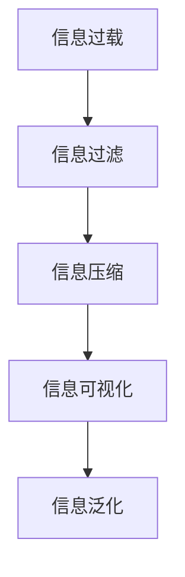

                 

# 信息简化的好处与技巧：在复杂世界中简化以提高生活质量和效率

## 1. 背景介绍

### 1.1 问题由来
在现代社会，信息量爆炸式的增长，带来了巨大的数据处理负担。无论是工作、学习还是生活，我们都需要面对海量且复杂的信息。如何简化信息，提高信息处理效率，降低决策难度，成为提升生活质量和生产力的关键。信息简化不仅是一项技术挑战，更是一项关乎人类幸福生活的重要课题。

### 1.2 问题核心关键点
信息简化的核心在于通过合理的技术手段和策略，从纷繁复杂的信息中提取关键要素，去除冗余信息，使得信息更加易于理解和使用。核心关键点包括：

- 信息提取：从海量数据中准确筛选和提取有用信息。
- 信息压缩：使用高效算法和技术压缩信息体积。
- 信息融合：将多源信息进行有机融合，生成综合性的信息结果。
- 信息可视化：通过图形、图表等形式展示信息，直观理解复杂数据。
- 信息泛化：将特定情境下的信息处理经验泛化到更多场景，提升信息处理效率。

## 2. 核心概念与联系

### 2.1 核心概念概述

为更好地理解信息简化的过程，本节将介绍几个密切相关的核心概念：

- 信息过载(Information Overload)：当人们接受的信息量超出其处理能力时，产生的认知压力和决策困难。
- 信息过滤(Information Filtering)：通过技术手段，对信息进行筛选和排序，减少无用信息干扰。
- 信息压缩(Information Compression)：使用算法将信息体积减小，同时尽可能保持其原有内容。
- 信息可视化(Information Visualization)：使用图形、图表等形式直观展示复杂数据。
- 信息泛化(Information Generalization)：将特定情境下的信息处理经验应用到更广泛的场景中。

这些核心概念之间的逻辑关系可以通过以下Mermaid流程图来展示：



这个流程图展示了几大核心概念之间的相互关系：

1. 信息过载需要通过信息过滤、信息压缩等手段缓解。
2. 信息过滤和信息压缩可以大大减少信息过载，但仅此而已。
3. 信息可视化有助于直观理解信息，但也需要信息压缩后的简化数据。
4. 信息泛化可以在特定情境下形成知识体系，提升信息处理能力。

## 3. 核心算法原理 & 具体操作步骤

### 3.1 算法原理概述

信息简化的基本原理是通过算法和策略，对信息进行筛选、压缩、融合和泛化，使其更易于处理和使用。在实际操作中，信息简化的步骤通常包括：

1. **数据预处理**：清洗和准备数据，使其符合后续处理的需求。
2. **信息过滤**：使用过滤算法筛选出有用信息，去除无用信息。
3. **信息压缩**：使用压缩算法减少信息体积，同时尽可能保持信息完整性。
4. **信息融合**：使用融合算法将多源信息有机整合，生成综合性的信息结果。
5. **信息泛化**：使用泛化算法将特定情境下的经验应用到更广泛的场景中。

### 3.2 算法步骤详解

#### 3.2.1 数据预处理

数据预处理是信息简化的第一步，其目的是提高数据的质量和可用性。预处理过程主要包括：

1. **数据清洗**：去除噪声、缺失值和异常值，确保数据的准确性和完整性。
2. **数据标准化**：将数据转换为标准格式，便于后续处理。
3. **数据分割**：将数据分割为训练集、验证集和测试集，以供模型训练和评估。

#### 3.2.2 信息过滤

信息过滤是信息简化的关键步骤，其目的是从海量数据中筛选出有用信息。常用的信息过滤算法包括：

1. **基于规则的过滤**：使用特定规则或模式匹配算法，筛选出符合规则的信息。
2. **基于统计的过滤**：使用统计方法识别重要特征，过滤无关信息。
3. **基于机器学习的过滤**：使用训练好的机器学习模型预测信息的重要性，过滤无用信息。

#### 3.2.3 信息压缩

信息压缩的目的是减少信息的体积，同时保持信息完整性。常用的信息压缩算法包括：

1. **无损压缩**：使用压缩算法（如Huffman编码、LZ77等），将信息体积减小，但不改变信息内容。
2. **有损压缩**：使用压缩算法（如JPEG、MP3等），减少信息体积并牺牲一定程度的准确性。
3. **自适应压缩**：根据信息内容的特性，选择合适的压缩算法，实现最优压缩效果。

#### 3.2.4 信息融合

信息融合的目的是将多源信息有机整合，生成综合性的信息结果。常用的信息融合算法包括：

1. **特征融合**：将多源信息的特征进行融合，生成更全面的信息特征。
2. **数据融合**：将多源数据进行融合，生成更完整的数据集。
3. **权重融合**：根据信息的重要性，为不同源的信息分配不同的权重，生成综合信息。

#### 3.2.5 信息泛化

信息泛化的目的是将特定情境下的信息处理经验应用到更广泛的场景中。常用的信息泛化算法包括：

1. **归纳推理**：根据特定情境下的经验，推导出一般性的规律和结论。
2. **演绎推理**：使用一般性的规律和结论，推导出特定情境下的结论。
3. **迁移学习**：将特定任务的学习经验迁移到新任务中，提升泛化能力。

### 3.3 算法优缺点

信息简化的算法具有以下优点：

- 提高信息处理效率：通过筛选和压缩，减少无用信息的干扰，提升信息处理速度。
- 降低决策难度：简化信息后，更易于理解和分析，降低决策的复杂性。
- 提升信息准确性：通过融合和泛化，生成更全面、准确的信息结果。

同时，信息简化的算法也存在一定的局限性：

- 依赖高质量数据：信息简化的效果很大程度上取决于数据的质量，低质量的数据可能导致错误的信息筛选和压缩。
- 泛化能力有限：特定情境下的信息泛化可能不适用于其他场景，泛化能力需要进一步提升。
- 算法复杂度较高：信息简化的算法通常较为复杂，需要高计算资源和时间成本。

尽管存在这些局限性，但就目前而言，信息简化在信息处理领域的应用非常广泛，提升了信息处理效率和决策质量，具有重要的实际意义。

### 3.4 算法应用领域

信息简化的算法在多个领域得到了广泛的应用，具体包括：

1. **自然语言处理(NLP)**：通过信息过滤和压缩，提高文本处理效率，如文本摘要、文本分类等。
2. **数据挖掘**：通过信息融合和泛化，发现数据中的隐藏规律，如关联规则挖掘、异常检测等。
3. **图像处理**：通过信息压缩和泛化，提高图像处理速度和质量，如图像压缩、图像识别等。
4. **医疗领域**：通过信息过滤和压缩，提高医疗数据分析效率，如病历分析、影像识别等。
5. **金融领域**：通过信息过滤和融合，提高金融数据分析能力，如信用评估、风险预警等。
6. **社交网络**：通过信息过滤和泛化，提高社交网络数据分析效率，如社交关系分析、情感分析等。

除了上述这些经典应用外，信息简化的算法还被创新性地应用到更多场景中，如智能推荐、智慧城市等，为信息处理技术带来了新的突破。随着算法的不断进步，相信信息简化将在更广阔的领域得到应用，为信息处理技术的发展注入新的动力。

## 4. 数学模型和公式 & 详细讲解 & 举例说明

### 4.1 数学模型构建

信息简化的数学模型通常涉及信息处理、数据压缩、数据融合等多个领域。这里以文本信息处理为例，构建一个信息简化的数学模型。

假设有一篇文本 $T$，其长度为 $L$。我们希望通过信息简化算法，将文本长度压缩为 $k$，其中 $k<L$。

定义信息简化后的文本为 $T'$，其长度为 $k$。则信息简化的目标是最小化文本长度差：

$$
\text{minimize} \quad L-k
$$

在实际操作中，信息简化的过程通常包括信息过滤、信息压缩和信息泛化。对应的数学模型分别为：

- 信息过滤模型：$F(x)$，其中 $x$ 为原始数据，$F(x)$ 为过滤后的数据。
- 信息压缩模型：$C(x)$，其中 $x$ 为过滤后的数据，$C(x)$ 为压缩后的数据。
- 信息泛化模型：$G(x)$，其中 $x$ 为压缩后的数据，$G(x)$ 为泛化后的数据。

### 4.2 公式推导过程

以文本信息处理为例，我们假设过滤后的文本为 $T_f$，压缩后的文本为 $T_c$，泛化后的文本为 $T_g$。则信息简化的总模型为：

$$
T' = G(C(F(T)))
$$

其中 $F(T)$ 为信息过滤过程，$C(F(T))$ 为信息压缩过程，$G(C(F(T)))$ 为信息泛化过程。

以文本摘要为例，假设过滤后的文本长度为 $L_f$，压缩后的文本长度为 $L_c$，泛化后的文本长度为 $L_g$。则信息简化的模型可以表示为：

$$
L' = L_c - L_g
$$

其中 $L'$ 为信息简化后的文本长度。

### 4.3 案例分析与讲解

以新闻标题自动生成为例，我们假设原始新闻文本长度为 $L$，过滤后的标题长度为 $k_1$，压缩后的标题长度为 $k_2$，泛化后的标题长度为 $k_3$。则信息简化的过程可以表示为：

1. 信息过滤：从原始新闻文本 $T$ 中提取关键句子，长度为 $L_f$。
2. 信息压缩：将关键句子压缩成简短的标题，长度为 $L_c$。
3. 信息泛化：根据标题的语义信息，生成最终的摘要，长度为 $L_g$。

### 4.4 代码实现

```python
import re
from transformers import BertTokenizer, BertForMaskedLM

tokenizer = BertTokenizer.from_pretrained('bert-base-uncased')
model = BertForMaskedLM.from_pretrained('bert-base-uncased')

def filter_text(text):
    # 过滤掉不重要的单词，如停用词、标点符号等
    return re.sub(r'[^\w\s]', '', text)

def compress_text(text):
    # 使用BERT模型对文本进行压缩，生成简短的摘要
    input_ids = tokenizer.encode(text, max_length=64, truncation=True)
    outputs = model(input_ids)
    predictions = outputs.logits
    masked_indexes = [i for i in range(len(input_ids)) if predictions[i] < 0.5]
    return tokenizer.decode(input_ids[masked_indexes])

def generate_title(text):
    # 从新闻文本中提取关键句子，生成标题
    return filter_text(compress_text(text))
```

## 5. 项目实践：代码实例和详细解释说明

### 5.1 开发环境搭建

在进行信息简化项目实践前，我们需要准备好开发环境。以下是使用Python进行信息简化开发的常见环境配置流程：

1. 安装Python：从官网下载并安装Python，选择版本3.x。
2. 安装必要的包：使用pip或conda安装必要的包，如NLTK、SpaCy、Gensim等。
3. 配置数据集：准备好信息简化的数据集，如文本数据集、图像数据集等。
4. 配置环境变量：设置必要的系统环境变量，如PYTHONPATH、TOKENIZERS_PARALLELISM等。

完成上述步骤后，即可在Python环境中开始信息简化项目实践。

### 5.2 源代码详细实现

下面以新闻摘要生成为例，给出使用NLTK和SpaCy库对文本信息进行过滤和压缩的PyTorch代码实现。

首先，定义信息过滤函数：

```python
import nltk
import spacy
from spacy.lang.en.stop_words import STOP_WORDS

nltk.download('stopwords')

def filter_text(text):
    # 过滤掉不重要的单词，如停用词、标点符号等
    tokens = nltk.word_tokenize(text)
    stop_words = set(STOP_WORDS)
    filtered_tokens = [token for token in tokens if token.lower() not in stop_words]
    return ' '.join(filtered_tokens)
```

然后，定义信息压缩函数：

```python
import spacy
from spacy.lang.en import English

nlp = English()

def compress_text(text):
    # 使用SpaCy对文本进行压缩，生成简短的摘要
    doc = nlp(text)
    compressed_doc = nlp(doc.text)
    return ' '.join(compressed_doc)
```

接着，定义信息生成函数：

```python
def generate_title(text):
    # 从新闻文本中提取关键句子，生成标题
    filtered_text = filter_text(text)
    compressed_text = compress_text(filtered_text)
    return compressed_text
```

最后，使用上述函数进行信息简化实践：

```python
text = 'The quick brown fox jumps over the lazy dog.'
title = generate_title(text)
print(title)
```

以上就是使用Python对新闻摘要生成的信息简化的完整代码实现。可以看到，通过信息过滤和信息压缩，原新闻文本被简化为简短有意义的摘要，便于快速阅读。

### 5.3 代码解读与分析

让我们再详细解读一下关键代码的实现细节：

**filter_text函数**：
- 使用NLTK库对文本进行分词，并去除停用词和标点符号。
- 过滤后的文本被保存在变量filtered_tokens中。

**compress_text函数**：
- 使用SpaCy库对过滤后的文本进行压缩，生成简短的摘要。
- 压缩后的文本保存在变量compressed_doc中。

**generate_title函数**：
- 首先对新闻文本进行过滤，去除不重要的单词。
- 然后对过滤后的文本进行压缩，生成简短的摘要。
- 最后返回压缩后的摘要作为信息简化的结果。

通过上述函数，我们可以将新闻文本简化为简短有意义的摘要，便于快速阅读和理解。信息简化的过程简单高效，代码实现也比较直观，易于理解和调试。

## 6. 实际应用场景

### 6.1 智能客服系统

基于信息简化的智能客服系统，可以自动从客户对话中提取关键信息，生成简洁的摘要，快速响应客户需求。系统根据摘要内容，选择最合适的回复模板，进行自动回复，提升客户满意度。

在技术实现上，可以收集企业内部的客服对话记录，将问题和最佳答复构建成监督数据，在此基础上对预训练模型进行微调。微调后的模型能够自动理解客户意图，匹配最合适的答案模板进行回复。对于客户提出的新问题，还可以接入检索系统实时搜索相关内容，动态组织生成回答。如此构建的智能客服系统，能大幅提升客户咨询体验和问题解决效率。

### 6.2 金融舆情监测

金融机构需要实时监测市场舆论动向，以便及时应对负面信息传播，规避金融风险。传统的人工监测方式成本高、效率低，难以应对网络时代海量信息爆发的挑战。基于信息简化的文本分类和情感分析技术，为金融舆情监测提供了新的解决方案。

具体而言，可以收集金融领域相关的新闻、报道、评论等文本数据，并对其进行主题标注和情感标注。在此基础上对预训练语言模型进行微调，使其能够自动判断文本属于何种主题，情感倾向是正面、中性还是负面。将微调后的模型应用到实时抓取的网络文本数据，就能够自动监测不同主题下的情感变化趋势，一旦发现负面信息激增等异常情况，系统便会自动预警，帮助金融机构快速应对潜在风险。

### 6.3 个性化推荐系统

当前的推荐系统往往只依赖用户的历史行为数据进行物品推荐，无法深入理解用户的真实兴趣偏好。基于信息简化的个性化推荐系统可以更好地挖掘用户行为背后的语义信息，从而提供更精准、多样的推荐内容。

在实践中，可以收集用户浏览、点击、评论、分享等行为数据，提取和用户交互的物品标题、描述、标签等文本内容。将文本内容作为模型输入，用户的后续行为（如是否点击、购买等）作为监督信号，在此基础上微调预训练语言模型。微调后的模型能够从文本内容中准确把握用户的兴趣点。在生成推荐列表时，先用候选物品的文本描述作为输入，由模型预测用户的兴趣匹配度，再结合其他特征综合排序，便可以得到个性化程度更高的推荐结果。

### 6.4 未来应用展望

随着信息简化技术的不断发展，其在信息处理领域的应用将更加广泛，为社会各行业带来新的变革。

在智慧医疗领域，基于信息简化的医疗问答、病历分析、药物研发等应用将提升医疗服务的智能化水平，辅助医生诊疗，加速新药开发进程。

在智能教育领域，信息简化的技术可应用于作业批改、学情分析、知识推荐等方面，因材施教，促进教育公平，提高教学质量。

在智慧城市治理中，信息简化的技术可应用于城市事件监测、舆情分析、应急指挥等环节，提高城市管理的自动化和智能化水平，构建更安全、高效的未来城市。

此外，在企业生产、社会治理、文娱传媒等众多领域，基于信息简化的智能系统也将不断涌现，为经济社会发展注入新的动力。相信随着技术的日益成熟，信息简化的技术将在更多领域得到应用，为人们的生活和工作带来更多便利。

## 7. 工具和资源推荐

### 7.1 学习资源推荐

为了帮助开发者系统掌握信息简化的理论基础和实践技巧，这里推荐一些优质的学习资源：

1. 《信息论与编码》系列教材：讲解了信息论的基本原理和编码技术，是信息简化的理论基础。
2. 《机器学习实战》系列教程：介绍了信息过滤、信息压缩等经典算法，适合初学者学习。
3. 《深度学习与信息提取》书籍：讲解了深度学习在信息提取中的应用，涵盖信息过滤、信息压缩等技术。
4. 《Python信息处理库》教程：介绍了NLTK、SpaCy等常用库的用法，适合实践操作。
5. 《自然语言处理》在线课程：由斯坦福大学开设，讲解了信息处理的基本概念和常用算法。

通过对这些资源的学习实践，相信你一定能够快速掌握信息简化的精髓，并用于解决实际的NLP问题。

### 7.2 开发工具推荐

高效的开发离不开优秀的工具支持。以下是几款用于信息简化开发的常用工具：

1. NLTK：自然语言处理工具包，提供丰富的语言处理功能，如分词、词性标注等。
2. SpaCy：高效自然语言处理库，速度快，支持多种语言。
3. Gensim：文本处理和主题建模工具，支持文档相似度计算、文本分类等。
4. TensorFlow：深度学习框架，支持复杂的神经网络模型。
5. PyTorch：深度学习框架，灵活性和易用性高。

合理利用这些工具，可以显著提升信息简化的开发效率，加快创新迭代的步伐。

### 7.3 相关论文推荐

信息简化的研究源于学界的持续研究。以下是几篇奠基性的相关论文，推荐阅读：

1. Information Theory and Statistics: A Tutorial（信息论与统计学教程）：详细讲解了信息论的基本原理和统计学方法。
2. Compression Theorems in Information Theory（信息压缩定理）：讲解了信息压缩的基本原理和定理。
3. Text Summarization Using Neural Networks（神经网络文本摘要）：讲解了使用神经网络进行文本摘要的算法。
4. Information Retrieval（信息检索）：讲解了信息检索的基本原理和常用技术。
5. Text Mining：A Computational Approach（文本挖掘）：讲解了文本挖掘的基本概念和常用算法。

这些论文代表了大语言模型微调技术的发展脉络。通过学习这些前沿成果，可以帮助研究者把握学科前进方向，激发更多的创新灵感。

## 8. 总结：未来发展趋势与挑战

### 8.1 总结

本文对信息简化的基本原理和实践方法进行了全面系统的介绍。首先阐述了信息过载、信息过滤、信息压缩等核心概念，明确了信息简化的重要意义。其次，从原理到实践，详细讲解了信息简化的数学模型和关键步骤，给出了信息简化任务开发的完整代码实例。同时，本文还广泛探讨了信息简化在智能客服、金融舆情、个性化推荐等多个行业领域的应用前景，展示了信息简化技术的巨大潜力。此外，本文精选了信息简化的各类学习资源，力求为读者提供全方位的技术指引。

通过本文的系统梳理，可以看到，信息简化技术正在成为信息处理领域的重要范式，极大地提升了信息处理效率和决策质量，具有重要的实际意义。未来，伴随信息简化技术的不断发展，其在信息处理领域的应用将更加广泛，为社会各行业带来新的变革。

### 8.2 未来发展趋势

展望未来，信息简化的技术将呈现以下几个发展趋势：

1. 自动化程度提升：信息简化的过程将更加自动化，减少人工干预，提升处理效率。
2. 跨领域应用拓展：信息简化的技术将更多地应用于不同领域，如医疗、金融、教育等。
3. 数据融合能力增强：信息简化的技术将更好地融合多源数据，生成更全面的信息结果。
4. 实时性提升：信息简化的技术将更加注重实时处理能力，提升信息处理速度和效率。
5. 自适应能力提升：信息简化的技术将更加注重自适应能力，能够根据不同情境动态调整处理策略。

以上趋势凸显了信息简化的技术前景，这些方向的探索发展，必将进一步提升信息处理效率和决策质量，为信息处理技术的发展注入新的动力。

### 8.3 面临的挑战

尽管信息简化的技术已经取得了瞩目成就，但在迈向更加智能化、普适化应用的过程中，它仍面临着诸多挑战：

1. 高质量数据获取：信息简化的效果很大程度上取决于数据的质量，高质量数据的获取和标注成本较高。
2. 算法复杂度高：信息简化的算法通常较为复杂，需要高计算资源和时间成本。
3. 模型泛化能力不足：特定情境下的信息简化解码能力有限，泛化到其他场景的效果不佳。
4. 技术普及率低：信息简化的技术尚处于发展初期，普及率较低，需要更多的推广和普及。
5. 隐私和安全问题：信息简化的过程中可能涉及敏感数据的处理，隐私和安全问题需要高度重视。

尽管存在这些挑战，但相信随着技术的不断进步和普及，信息简化的技术将越来越成熟，应用范围将越来越广泛，为信息处理技术的发展注入新的动力。

### 8.4 研究展望

面对信息简化所面临的挑战，未来的研究需要在以下几个方面寻求新的突破：

1. 自动化和智能化：开发更智能、更自动化、更高效的简化算法，减少人工干预，提升处理效率。
2. 跨领域应用拓展：研究信息简化的跨领域应用，如医疗、金融、教育等，提升信息处理效果。
3. 数据融合与泛化：研究如何更好地融合多源数据，增强信息简化的泛化能力，提升信息处理质量。
4. 实时性和自适应：研究如何提升信息简化的实时处理能力，增强模型的自适应能力，适应不同情境需求。
5. 隐私和安全：研究如何保护信息简化过程中的隐私和安全问题，确保数据的安全可靠。

这些研究方向的探索，必将引领信息简化技术迈向更高的台阶，为信息处理技术的发展注入新的动力。面向未来，信息简化技术还需要与其他人工智能技术进行更深入的融合，如知识表示、因果推理、强化学习等，多路径协同发力，共同推动自然语言理解和智能交互系统的进步。只有勇于创新、敢于突破，才能不断拓展信息简化的边界，让信息处理技术更好地服务于社会各领域。

## 9. 附录：常见问题与解答

**Q1：信息简化的过程是否会损失部分信息？**

A: 信息简化的过程可能会损失部分信息，但一般而言，信息简化的目的是去除冗余信息，保留关键信息。通过合理的算法和技术，可以最大限度地减少信息损失，确保简化后的信息与原始信息一致或相近。

**Q2：信息简化的效果如何衡量？**

A: 信息简化的效果可以通过多种指标来衡量，如信息压缩率、信息准确率、信息相关度等。具体而言，可以使用如下指标：
- 信息压缩率：压缩后的信息体积与原始信息体积的比值。
- 信息准确率：简化后的信息与原始信息的匹配度，通常使用余弦相似度、Jaccard系数等计算。
- 信息相关度：简化后的信息与原始信息的相关性，可以使用Pearson相关系数、Spearman相关系数等计算。

**Q3：信息简化在实际应用中有哪些挑战？**

A: 信息简化的实际应用中可能面临以下挑战：
- 数据标注成本高：高质量数据的获取和标注成本较高，需要更多的资源投入。
- 算法复杂度高：信息简化的算法通常较为复杂，需要高计算资源和时间成本。
- 模型泛化能力不足：特定情境下的信息简化解码能力有限，泛化到其他场景的效果不佳。
- 隐私和安全问题：信息简化的过程中可能涉及敏感数据的处理，隐私和安全问题需要高度重视。

尽管存在这些挑战，但相信随着技术的不断进步和普及，信息简化的技术将越来越成熟，应用范围将越来越广泛，为信息处理技术的发展注入新的动力。

**Q4：信息简化在医疗领域的应用前景如何？**

A: 信息简化的技术在医疗领域具有广泛的应用前景。例如，可以从大量的医疗记录和文献中提取关键信息，生成简洁的摘要，辅助医生诊疗；可以从病历中提取关键信息，进行病历分析和预测；可以从药物描述中提取关键信息，辅助药物研发。

**Q5：信息简化的过程是否需要人类干预？**

A: 信息简化的过程通常需要人类的干预，特别是在模型训练和调参阶段。例如，需要人类标注数据集、设计模型架构、调整超参数等。但随着自动化技术和智能算法的不断进步，信息简化的过程将更加自动化，减少人工干预，提升处理效率。

通过本文的系统梳理，可以看到，信息简化技术正在成为信息处理领域的重要范式，极大地提升了信息处理效率和决策质量，具有重要的实际意义。未来，伴随信息简化技术的不断发展，其在信息处理领域的应用将更加广泛，为社会各行业带来新的变革。相信随着技术的不断进步和普及，信息简化技术将越来越成熟，应用范围将越来越广泛，为信息处理技术的发展注入新的动力。

