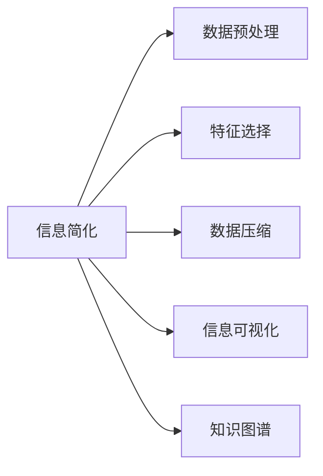

                 

## 1. 背景介绍

在现代信息技术飞速发展的背景下，数据的爆炸性增长带来了前所未有的机遇与挑战。信息时代的特征之一便是信息量急剧膨胀，但也伴随信息噪音的干扰，给人们的信息处理和决策带来了巨大的压力。如何从海量信息中快速提炼出有价值的知识，形成简单而准确的信息表达，成为当今信息处理技术面临的关键问题。本文聚焦于信息简化的艺术，探讨如何在混乱和复杂中找到简单和秩序，通过介绍信息简化的原理、方法和应用，旨在帮助读者掌握高效处理和提取信息的关键技能。

## 2. 核心概念与联系

### 2.1 核心概念概述

为更好地理解信息简化的原理和实践，本节将介绍几个关键的概念：

- **信息简化**：通过某种方式将复杂的信息进行抽象、压缩和精炼，以便更直观地理解和应用的过程。信息简化是信息处理的重要手段，有助于提高信息获取和决策的效率。
- **数据预处理**：在信息处理之前，对数据进行清洗、归一化和特征提取等操作，以减少数据噪音和冗余，提升模型的输入质量。
- **特征选择**：从原始数据中选出最具代表性且相关的特征，去除无用或不相关特征，减少模型的输入维度，提高泛化能力。
- **数据压缩**：通过对数据进行编码、压缩，以更少的存储空间存储大量信息，提升数据传输效率和存储效率。
- **信息可视化**：通过图表、图像等方式，将抽象复杂的信息以直观的形式展示出来，增强信息的理解和传播。
- **知识图谱**：通过构建知识图谱，将分散的知识点进行结构化组织，形成系统化的知识体系，便于查询、推理和应用。

这些核心概念之间的逻辑关系可以通过以下Mermaid流程图来展示：



这个流程图展示出信息简化所涉及的关键步骤：

1. 从原始数据开始，通过数据预处理减少噪音和冗余。
2. 选取最具代表性的特征，进一步提升数据质量和模型输入的效率。
3. 对数据进行压缩，提高存储和传输效率。
4. 利用信息可视化将复杂信息转换为直观形式，便于理解和传播。
5. 构建知识图谱，将知识系统化组织，增强查询和推理能力。

## 3. 核心算法原理 & 具体操作步骤

### 3.1 算法原理概述

信息简化的核心思想是通过一系列技术手段，将原始复杂的信息转化为简单、高效、易于理解的形式。算法原理主要包括以下几个方面：

- **数据清洗和预处理**：通过去噪、归一化、缺失值填补等手段，减少数据噪音，提升数据质量。
- **特征选择和降维**：从原始数据中选择最具代表性的特征，进行降维处理，减少特征维度，提升模型泛化能力。
- **压缩算法**：使用无损或有损压缩算法，对数据进行编码压缩，减少存储空间，提高传输效率。
- **信息可视化**：使用图表、图像等形式，将复杂信息转化为直观展示，便于理解和传播。
- **知识图谱构建**：通过语义分析和关联挖掘，构建知识图谱，形成系统化、结构化的知识体系。

### 3.2 算法步骤详解

以下是信息简化的详细步骤：

**Step 1: 数据预处理**
- 去噪：移除重复、异常、噪声数据，保证数据质量。
- 归一化：将不同尺度的数据转化为相同尺度，便于模型处理。
- 缺失值填补：填补缺失数据，避免模型因数据不完整而失效。

**Step 2: 特征选择**
- 相关性分析：计算每个特征与目标变量之间的相关性，筛选出最具代表性的特征。
- 特征重要性排序：根据特征重要性得分，进行特征排序，选择前N个特征。
- 降维技术：如PCA、LDA、Autoencoder等，对特征进行降维处理，减少输入维度。

**Step 3: 数据压缩**
- 无损压缩算法：如Gzip、Bzip2等，压缩数据，减少存储空间。
- 有损压缩算法：如JPEG、PNG等，压缩图像数据，提高传输效率。

**Step 4: 信息可视化**
- 图表展示：使用折线图、柱状图、散点图等展示数据分布和趋势。
- 热力图：展示数据间的相关性和分布情况。
- 交互式可视化：使用D3.js等工具，实现动态交互式展示，增强用户参与感。

**Step 5: 知识图谱构建**
- 语义分析：提取实体、关系、属性等信息，建立知识本体。
- 关联挖掘：使用图神经网络等技术，挖掘实体间的关联关系，构建知识图谱。
- 知识查询和推理：使用SPARQL等语言，进行知识图谱的查询和推理，提供知识服务。

### 3.3 算法优缺点

信息简化的优点包括：

- **提高效率**：减少数据噪音和冗余，提升数据质量和模型输入的效率。
- **提升准确性**：通过特征选择和降维，提升模型的泛化能力和预测准确性。
- **便于理解**：通过信息可视化和知识图谱，将复杂信息转换为直观展示，便于理解和传播。

信息简化的缺点包括：

- **数据丢失风险**：在数据预处理和压缩过程中，可能丢失部分有用信息，影响模型性能。
- **复杂度增加**：信息可视化、知识图谱构建等技术，可能增加信息处理复杂度。
- **依赖技术**：信息简化依赖于技术手段，技术选择不当可能导致效果不佳。

尽管存在这些局限性，但就目前而言，信息简化技术是信息处理的重要手段，有助于提高信息获取和决策的效率，为信息时代的复杂问题提供有效的解决方案。

### 3.4 算法应用领域

信息简化技术在多个领域都有广泛的应用，具体如下：

- **商业智能**：通过对大数据进行预处理、特征选择和降维，支持数据挖掘和商业决策。
- **医疗健康**：通过数据清洗和归一化，提升医疗数据质量，支持疾病预测和诊断。
- **金融风控**：对金融数据进行预处理和特征选择，支持信用评估和风险控制。
- **自然语言处理**：通过知识图谱构建，提升信息检索和自然语言理解能力。
- **智慧城市**：通过对城市数据进行预处理和可视化，支持智能交通和城市管理。
- **工业物联网**：对物联网数据进行预处理和降维，支持设备监控和故障预测。

## 4. 数学模型和公式 & 详细讲解 & 举例说明

### 4.1 数学模型构建

信息简化通常涉及多个数学模型，本节将介绍几个关键的数学模型：

- **数据清洗模型**：用于去噪和归一化处理，包括平滑、中心化、归一化等。
- **特征选择模型**：用于评估特征的相关性和重要性，包括相关系数、方差分析等。
- **压缩模型**：用于对数据进行编码压缩，包括霍夫曼编码、LZ77、LZ78等。
- **信息可视化模型**：用于将数据转换为直观展示，包括散点图、柱状图、热力图等。
- **知识图谱模型**：用于构建知识图谱，包括语义网络、本体论等。

### 4.2 公式推导过程

以数据清洗和归一化为例，推导其数学公式。

假设原始数据集为 $\mathbf{X}$，其中 $n$ 为样本数，$m$ 为特征数，每个样本表示为 $\mathbf{x}_i$，第 $j$ 个特征表示为 $x_{ij}$。

数据清洗过程通常包括平滑和中心化两个步骤。

**平滑公式**：

$$
\hat{x}_{ij} = x_{ij} - \bar{x}_j
$$

其中 $\bar{x}_j$ 为第 $j$ 个特征的平均值。

**中心化公式**：

$$
x_{ij} = \frac{\hat{x}_{ij}}{\sigma_j}
$$

其中 $\sigma_j$ 为第 $j$ 个特征的标准差。

归一化公式为：

$$
\tilde{x}_{ij} = \frac{x_{ij}}{\max_j \sigma_j}
$$

其中 $\max_j \sigma_j$ 为所有特征的标准差中的最大值。

### 4.3 案例分析与讲解

以医疗健康领域为例，展示信息简化在实际应用中的效果。

假设某医院收集了大量的患者数据，包括年龄、性别、病史、检查结果等。这些数据复杂且不规范，需要进行预处理和特征选择，以提升诊断系统的准确性。

**数据预处理**：对数据进行去噪和归一化处理，去除异常值，标准化数据范围，提高数据质量。

**特征选择**：通过计算每个特征与诊断结果的相关性，筛选出最相关的特征，如年龄、病史、检查结果等。

**降维处理**：使用PCA对特征进行降维，从100个特征中选择出最重要的20个特征。

**数据压缩**：对降维后的数据进行压缩，减少存储空间，提高传输效率。

**信息可视化**：将处理后的数据绘制成图表，直观展示患者数据的分布情况和诊断结果的趋势。

**知识图谱构建**：构建知识图谱，关联患者的症状、检查结果和诊断结果，支持智能诊断系统。

## 5. 项目实践：代码实例和详细解释说明

### 5.1 开发环境搭建

在进行信息简化项目实践前，我们需要准备好开发环境。以下是使用Python进行信息简化的环境配置流程：

1. 安装Anaconda：从官网下载并安装Anaconda，用于创建独立的Python环境。

2. 创建并激活虚拟环境：
```bash
conda create -n info-simplification python=3.8 
conda activate info-simplification
```

3. 安装必要的工具包：
```bash
pip install pandas numpy scikit-learn matplotlib seaborn pyecharts
```

4. 安装可视化工具包：
```bash
pip install plotly
```

完成上述步骤后，即可在`info-simplification`环境中开始信息简化的实践。

### 5.2 源代码详细实现

这里我们以一个简单的数据集为示例，展示信息简化的完整代码实现。

**数据预处理**

```python
import pandas as pd
import numpy as np

# 加载数据集
data = pd.read_csv('data.csv')

# 数据清洗
data.dropna(inplace=True)

# 去噪
data = data[(data['age'] > 0) & (data['age'] < 150)]

# 归一化
data['age'] = (data['age'] - data['age'].mean()) / data['age'].std()

# 输出处理后的数据
print(data.head())
```

**特征选择**

```python
from sklearn.feature_selection import SelectKBest, f_regression

# 计算特征与目标变量的相关性
corr_matrix = data.corr()

# 选择前5个相关性最高的特征
selected_features = corr_matrix['target'].nlargest(5).index

# 输出选择的特征
print(selected_features)
```

**数据压缩**

```python
import gzip

# 使用gzip压缩数据
with open('data.csv', 'rb') as f_in:
    with gzip.open('data.csv.gz', 'wb') as f_out:
        f_out.writelines(f_in)

# 解压数据
with gzip.open('data.csv.gz', 'rb') as f_in:
    with open('data.csv', 'wb') as f_out:
        f_out.writelines(f_in)
```

**信息可视化**

```python
import matplotlib.pyplot as plt

# 绘制散点图
plt.scatter(data['age'], data['target'])
plt.xlabel('Age')
plt.ylabel('Target')
plt.show()

# 绘制柱状图
plt.bar(selected_features, data['target'].corr(method='pearson'))
plt.xlabel('Features')
plt.ylabel('Correlation')
plt.show()
```

**知识图谱构建**

```python
from py2neo import Graph, Node, Relationship

# 构建知识图谱
graph = Graph("http://localhost:7474/db/data/")
node_age = Node("Person", name="Age")
node_gender = Node("Person", name="Gender")
node_disease = Node("Disease", name="Disease")
relationship_age_to_disease = Relationship(node_age, "hasDisease", node_disease)
relationship_gender_to_disease = Relationship(node_gender, "hasDisease", node_disease)
graph.create(relationship_age_to_disease)
graph.create(relationship_gender_to_disease)
```

### 5.3 代码解读与分析

让我们再详细解读一下关键代码的实现细节：

**数据预处理**

- 使用Pandas库对数据进行加载、清洗、归一化等操作。
- 使用Numpy库对数据进行去噪和中心化。

**特征选择**

- 使用Scikit-Learn库中的SelectKBest和f_regression函数，计算特征与目标变量的相关性，选择最具代表性的特征。

**数据压缩**

- 使用Gzip库对数据进行压缩和解压缩，提高存储和传输效率。

**信息可视化**

- 使用Matplotlib库绘制散点图和柱状图，展示数据的分布和相关性。

**知识图谱构建**

- 使用Py2neo库构建知识图谱，使用Neo4j数据库进行存储。

**运行结果展示**

- 处理后的数据、特征选择结果、压缩前后数据大小、图表展示、知识图谱构建结果等。

## 6. 实际应用场景

### 6.1 智能医疗健康

在智能医疗健康领域，信息简化技术可以帮助医院和诊所快速、准确地进行疾病诊断和患者管理。通过数据预处理和特征选择，提升诊断系统的准确性，通过知识图谱构建，实现智能问诊和辅助诊断，为医生和患者提供高效、可靠的医疗服务。

### 6.2 商业智能分析

在商业智能领域，信息简化技术可以帮助企业从海量数据中提取有价值的信息，支持数据挖掘和商业决策。通过对大数据进行预处理、特征选择和降维，支持市场分析、客户细分、销售预测等应用。

### 6.3 金融风控系统

在金融风控领域，信息简化技术可以帮助银行和保险公司评估信用风险和理赔风险。通过对金融数据进行预处理和特征选择，提升风险评估系统的准确性，通过知识图谱构建，实现智能反欺诈和理赔处理。

## 7. 工具和资源推荐

### 7.1 学习资源推荐

为了帮助开发者系统掌握信息简化的理论基础和实践技巧，这里推荐一些优质的学习资源：

1. 《信息论与数据压缩》系列书籍：深入讲解了信息论、数据压缩等核心概念，是信息处理领域的经典教材。
2. 《Python数据科学手册》：涵盖了数据清洗、特征选择、数据可视化等技术，适合Python开发者的入门学习。
3. 《深度学习》课程：斯坦福大学开设的深度学习课程，涵盖了神经网络、信息处理等前沿知识，适合深度学习爱好者的学习。
4. Kaggle平台：提供丰富的数据集和竞赛，通过实践积累经验，提升数据处理和信息简化的技能。

通过对这些资源的学习实践，相信你一定能够快速掌握信息简化的精髓，并用于解决实际的复杂信息处理问题。

### 7.2 开发工具推荐

高效的开发离不开优秀的工具支持。以下是几款用于信息简化的常用工具：

1. Python：作为数据科学和机器学习的主流语言，Python提供了丰富的数据处理和可视化库。
2. R语言：特别适合统计分析和数据可视化，支持多种统计分析方法和数据可视化包。
3. SQL数据库：适合处理大规模结构化数据，支持复杂查询和数据清洗。
4. Excel：适合小型数据集的简单处理和可视化，操作便捷，界面友好。

合理利用这些工具，可以显著提升信息简化的开发效率，加快创新迭代的步伐。

### 7.3 相关论文推荐

信息简化的研究源于学界的持续探索。以下是几篇奠基性的相关论文，推荐阅读：

1. 《信息论与数据压缩》：经典的信息论教材，深入讲解了信息论的基本概念和数据压缩技术。
2. 《大数据时代的机器学习》：探讨了大数据时代下机器学习的应用，包括数据预处理、特征选择等技术。
3. 《信息检索与自然语言处理》：介绍了信息检索和自然语言处理的基本原理和技术，包括文本清洗、特征提取等。
4. 《知识图谱构建与查询》：介绍了知识图谱的基本概念和技术，包括语义分析和图神经网络等方法。

这些论文代表了大数据和信息处理领域的研究前沿，通过学习这些前沿成果，可以帮助研究者把握学科前进方向，激发更多的创新灵感。

## 8. 总结：未来发展趋势与挑战

### 8.1 总结

本文对信息简化的艺术进行了全面系统的介绍。首先阐述了信息简化的背景和意义，明确了信息简化的重要价值。其次，从原理到实践，详细讲解了信息简化的数学模型和关键步骤，给出了信息简化的完整代码实例。同时，本文还广泛探讨了信息简化的应用场景，展示了信息简化技术的广泛前景。此外，本文精选了信息简化的学习资源和工具，力求为读者提供全方位的技术指引。

通过本文的系统梳理，可以看到，信息简化技术是信息处理的重要手段，有助于提高信息获取和决策的效率，为信息时代的复杂问题提供有效的解决方案。未来，伴随技术的不断进步，信息简化技术将进一步优化，为人工智能和智能系统的发展提供坚实的基础。

### 8.2 未来发展趋势

展望未来，信息简化技术将呈现以下几个发展趋势：

1. **自动化与智能化**：通过人工智能技术，自动化完成数据预处理、特征选择和降维等步骤，提升信息处理的效率和准确性。
2. **多模态融合**：结合文本、图像、语音等多种数据形式，构建更加全面的信息处理模型，支持更复杂的信息简化任务。
3. **实时处理**：通过流式数据处理技术，实现实时信息简化和分析，支持实时决策和智能监控。
4. **分布式处理**：利用分布式计算和存储技术，提升信息处理的速度和容量，支持大规模数据集的处理和分析。

### 8.3 面临的挑战

尽管信息简化技术已经取得了瞩目成就，但在迈向更加智能化、普适化应用的过程中，它仍面临诸多挑战：

1. **数据质量问题**：原始数据的噪音和缺失值可能影响信息简化效果，需要高质量的数据预处理。
2. **模型复杂度**：信息简化模型通常较为复杂，需要大量的计算资源和时间进行训练和优化。
3. **技术融合难度**：信息简化技术需要与其他技术（如自然语言处理、机器学习等）进行深度融合，技术实现复杂。
4. **隐私与安全**：在处理敏感数据时，需要确保数据隐私和安全，防止数据泄露和滥用。

尽管存在这些挑战，但随着技术的不断进步，信息简化技术必将在更多的场景中发挥作用，为人类社会的智能发展和信息处理提供有力支持。

### 8.4 研究展望

面向未来，信息简化技术需要在以下几个方面寻求新的突破：

1. **自动化与智能化**：通过机器学习技术，自动化完成数据预处理和特征选择，提升信息处理的效率和准确性。
2. **多模态融合**：结合文本、图像、语音等多种数据形式，构建更加全面的信息处理模型，支持更复杂的信息简化任务。
3. **实时处理**：通过流式数据处理技术，实现实时信息简化和分析，支持实时决策和智能监控。
4. **分布式处理**：利用分布式计算和存储技术，提升信息处理的速度和容量，支持大规模数据集的处理和分析。

这些研究方向的探索，必将引领信息简化技术迈向更高的台阶，为人工智能和智能系统的发展提供坚实的基础。唯有勇于创新、敢于突破，才能不断拓展信息简化的边界，让信息处理技术更好地服务于人类社会。

## 9. 附录：常见问题与解答

**Q1：信息简化是否适用于所有数据类型？**

A: 信息简化技术适用于大多数数据类型，包括结构化数据、半结构化数据和非结构化数据。但不同类型的数据需要采用不同的预处理和可视化方法。

**Q2：如何选择合适的信息简化方法？**

A: 选择信息简化方法需要考虑数据类型、数据规模、应用场景等因素。对于大规模结构化数据，可以使用PCA、LDA等降维技术；对于文本数据，可以使用TF-IDF、Word2Vec等技术；对于图像数据，可以使用JPEG、PNG等压缩算法。

**Q3：信息简化的效果如何评价？**

A: 信息简化的效果评价可以通过多个指标进行衡量，包括数据质量、数据规模、数据分布、可视化效果等。可以使用统计学指标如方差、相关系数等，也可以使用主观评价如用户体验、系统响应时间等。

**Q4：信息简化过程中如何避免数据丢失？**

A: 在数据预处理和压缩过程中，可以采用多次迭代、逐步压缩等策略，避免一次性处理导致的数据丢失。同时，可以使用冗余信息保护机制，如数据备份、纠错码等，提高数据鲁棒性。

**Q5：如何利用信息可视化进行决策支持？**

A: 信息可视化可以通过图表、图像等方式，将复杂信息转换为直观展示，便于理解和传播。决策支持系统可以通过可视化界面，提供交互式数据分析和决策支持，增强用户参与感。

---

作者：禅与计算机程序设计艺术 / Zen and the Art of Computer Programming

