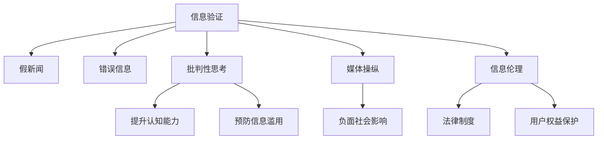

                 

# 信息验证和信息批判性思考：在假新闻、错误信息和媒体操纵时代导航

## 1. 背景介绍

### 1.1 问题由来

随着互联网的普及，信息传播的方式发生了翻天覆地的变化。传统媒体时代，信息通过层层审核和筛选，权威性和可信度较高。然而，在数字化和社交媒体兴起后，信息传播不再受到严格的管控，假新闻、错误信息、媒体操纵等问题愈发严重。这些信息不仅影响公众的认知和判断，甚至可能带来社会动荡和国家安全威胁。因此，如何在信息泛滥的时代，辨别真伪，保持理性和批判性，成为一个亟待解决的重要问题。

### 1.2 问题核心关键点

解决信息验证和批判性思考问题的关键在于：
1. 构建可信的信息验证模型。通过深度学习等技术，自动检测和识别假新闻、错误信息等，提升信息验证的效率和准确性。
2. 提升用户的批判性思维能力。通过教育和培训，使用户具备识别信息真伪的敏锐洞察力和逻辑分析能力。
3. 结合人机协作，构建综合的信息验证系统。结合人工智能和人力的优势，提升信息验证的全面性和可靠性。
4. 推动信息伦理和法律制度建设。通过立法和技术手段，规范信息传播行为，保障信息安全和公众利益。

这些关键点构成了信息验证和批判性思考的核心范式，通过技术与伦理的结合，实现对信息环境的综合治理。

## 2. 核心概念与联系

### 2.1 核心概念概述

为更好地理解信息验证和批判性思考的理论基础，本节将介绍几个密切相关的核心概念：

- 信息验证(Information Verification)：指通过技术手段，自动检测和识别假新闻、错误信息等，提升信息可信度的过程。常见的验证手段包括文本分类、事实核查、推理验证等。
- 批判性思考(Critical Thinking)：指通过分析、判断、推理等逻辑思维过程，提升信息识别和判断能力。批判性思考的培养需要系统的教育和训练。
- 媒体操纵(Media Manipulation)：指通过策划、编辑、传播等方式，故意扭曲、夸大或篡改信息，以达到特定目的的行为。常见的媒体操纵手段包括标题党、图片PS、虚假报道等。
- 假新闻(Fake News)：指捏造事实、虚构内容，旨在误导公众、影响政治或经济决策的虚假信息。假新闻具有高度迷惑性和传播力。
- 信息伦理(Information Ethics)：指在信息传播和使用中应遵守的道德规范和法律规定，包括数据隐私、版权保护、言论自由等。信息伦理的建设对保障信息安全和用户权益至关重要。
- 信息安全(Information Security)：指通过技术和管理手段，保护信息的安全性和隐私性，防止信息泄露和滥用。

这些概念之间的逻辑关系可以通过以下Mermaid流程图来展示：



这个流程图展示的信息验证和批判性思考的核心概念及其之间的关系：

1. 信息验证通过识别假新闻、错误信息等，提升信息的可信度。
2. 批判性思考通过提升用户的认知能力，识别信息的真伪。
3. 媒体操纵通过故意扭曲信息，导致负面社会影响。
4. 信息伦理通过规范信息传播，保护用户权益。
5. 信息安全通过技术和管理手段，保障信息安全。

这些概念共同构成了信息验证和批判性思考的完整框架，通过技术和伦理的结合，实现对信息环境的综合治理。

## 3. 核心算法原理 & 具体操作步骤
### 3.1 算法原理概述

信息验证和批判性思考的核心算法主要包括以下几个方面：

- 自然语言处理(Natural Language Processing, NLP)：通过文本分类、事实核查、推理验证等NLP技术，自动检测和识别假新闻、错误信息。
- 深度学习(Deep Learning)：使用神经网络模型，从大量标注数据中学习特征，提升信息验证的准确性和泛化能力。
- 逻辑推理(Logic Reasoning)：通过逻辑推理和知识图谱等技术，验证信息的真实性和合理性。
- 用户互动(Interactive Feedback)：通过用户反馈和交互，不断优化信息验证模型的性能和鲁棒性。
- 道德规范(Moral Norms)：结合信息伦理和法律制度，制定和执行信息验证的道德和法律标准。

这些算法共同构成了信息验证和批判性思考的核心技术框架，通过技术手段和伦理规范的结合，提升信息验证的全面性和可靠性。

### 3.2 算法步骤详解

信息验证和批判性思考的算法步骤主要包括以下几个环节：

**Step 1: 数据收集和预处理**
- 收集大量的新闻、文章、评论等文本数据，并对其进行标注，分为真、假、错误等类别。
- 使用NLP技术进行数据清洗、分词、去除停用词等预处理操作，将文本转换为模型可用的格式。

**Step 2: 模型训练**
- 选择合适的深度学习模型，如BERT、RoBERTa、GPT等，在标注数据上训练模型。
- 使用交叉熵损失、二分类损失等优化算法，最小化模型在验证集上的损失。
- 通过调整超参数、正则化技术等方式，优化模型性能。

**Step 3: 推理验证**
- 对于待验证的信息，输入到训练好的模型中，计算其输出概率。
- 根据模型输出和预设阈值，判断信息是否为假新闻、错误信息等。
- 使用逻辑推理和知识图谱等技术，进一步验证信息的真实性和合理性。

**Step 4: 用户互动和反馈**
- 将推理验证结果展示给用户，并让用户反馈验证结果的正确性。
- 根据用户反馈，不断调整模型参数，提升模型性能。
- 结合用户反馈，制定和执行信息验证的道德和法律标准。

**Step 5: 模型部署和监控**
- 将训练好的模型部署到实际应用中，进行信息验证。
- 实时监控模型的性能和效果，根据异常情况及时进行调整。
- 定期更新模型和数据，保持模型的有效性和适应性。

以上是信息验证和批判性思考的主要算法步骤，通过系统化的模型训练、推理验证、用户互动和反馈，提升信息验证的全面性和可靠性。

### 3.3 算法优缺点

信息验证和批判性思考的算法具有以下优点：
1. 自动化程度高。深度学习模型能够自动检测和识别信息真伪，提升验证效率。
2. 泛化能力强。通过大规模预训练，模型能够适应各种类型的文本信息。
3. 用户友好。通过直观的界面和反馈机制，提升用户体验。
4. 灵活性高。结合用户反馈和逻辑推理，模型能够不断优化和提升。

同时，该算法也存在一些局限性：
1. 数据依赖性强。模型性能依赖于标注数据的质量和多样性。
2. 模型鲁棒性不足。模型可能对数据中的噪声和偏置敏感，需要持续监控和优化。
3. 道德和法律风险。信息验证过程中可能涉及隐私和版权问题，需要严格规范和监管。
4. 技术门槛高。深度学习模型的训练和优化需要较高的技术水平和资源投入。
5. 误判率高。模型在面对复杂的语义环境和多模态信息时，可能出现误判。

尽管存在这些局限性，但就目前而言，信息验证和批判性思考的算法仍是大规模信息验证的重要手段。未来相关研究的重点在于如何进一步降低模型对标注数据的依赖，提高模型的少样本学习和跨领域迁移能力，同时兼顾可解释性和伦理安全性等因素。

### 3.4 算法应用领域

信息验证和批判性思考的算法在多个领域得到了广泛应用，包括但不限于：

- 新闻业：通过自动检测假新闻，提升新闻媒体的公信力和社会责任。
- 社交媒体：通过检测和过滤错误信息、虚假报道，保护用户免受误导。
- 政府和公共服务：通过事实核查，防止政府决策和公共服务中的信息滥用。
- 教育和培训：通过批判性思考培训，提升公众的信息素养和理性判断能力。
- 金融和商业：通过信息验证，保护投资者免受欺诈和虚假宣传的侵害。

除了上述这些经典应用外，信息验证和批判性思考的算法也被创新性地应用于更多场景中，如智能推荐、舆情监测、网络安全等，为信息验证和批判性思考技术的落地应用提供了新的方向。

## 4. 数学模型和公式 & 详细讲解 & 举例说明（备注：数学公式请使用latex格式，latex嵌入文中独立段落使用 $$，段落内使用 $)
### 4.1 数学模型构建

信息验证和批判性思考的数学模型主要包括以下几个部分：

- 文本分类模型：使用交叉熵损失函数，训练文本分类模型，将文本分为真、假、错误等类别。
- 事实核查模型：使用向量相似度、实体链接等技术，验证文本中提到的实体和事实是否真实可信。
- 逻辑推理模型：使用逻辑推理规则和知识图谱，验证文本中逻辑关系的正确性。

形式化地，假设文本分类模型为 $M_{\theta}$，其中 $\theta$ 为模型参数。训练集为 $D=\{(x_i,y_i)\}_{i=1}^N$，$x_i$ 为文本，$y_i$ 为分类标签。训练目标为：

$$
\theta^* = \mathop{\arg\min}_{\theta} \mathcal{L}(M_{\theta},D)
$$

其中 $\mathcal{L}$ 为交叉熵损失函数，定义为：

$$
\mathcal{L}(M_{\theta},D) = -\frac{1}{N}\sum_{i=1}^N \log M_{\theta}(x_i)
$$

对于事实核查模型，假设模型输入为 $(x,y)$，$x$ 为待验证的文本，$y$ 为待核查的事实。核查目标为：

$$
M_{\theta}(x,y) = \begin{cases}
1 & \text{if fact is true} \\
0 & \text{if fact is false}
\end{cases}
$$

对于逻辑推理模型，假设模型输入为 $(x,y)$，$x$ 为待推理的文本，$y$ 为待验证的逻辑关系。推理目标为：

$$
M_{\theta}(x,y) = \begin{cases}
1 & \text{if reasoning is correct} \\
0 & \text{if reasoning is incorrect}
\end{cases}
$$

### 4.2 公式推导过程

以下我们以文本分类模型为例，推导交叉熵损失函数及其梯度的计算公式。

假设模型 $M_{\theta}$ 在输入 $x$ 上的输出为 $\hat{y}=M_{\theta}(x) \in [0,1]$，表示文本为正类的概率。真实标签 $y \in \{0,1\}$。则二分类交叉熵损失函数定义为：

$$
\ell(M_{\theta}(x),y) = -[y\log \hat{y} + (1-y)\log (1-\hat{y})]
$$

将其代入经验风险公式，得：

$$
\mathcal{L}(\theta) = -\frac{1}{N}\sum_{i=1}^N [y_i\log M_{\theta}(x_i)+(1-y_i)\log(1-M_{\theta}(x_i))]
$$

根据链式法则，损失函数对参数 $\theta_k$ 的梯度为：

$$
\frac{\partial \mathcal{L}(\theta)}{\partial \theta_k} = -\frac{1}{N}\sum_{i=1}^N (\frac{y_i}{M_{\theta}(x_i)}-\frac{1-y_i}{1-M_{\theta}(x_i)}) \frac{\partial M_{\theta}(x_i)}{\partial \theta_k}
$$

其中 $\frac{\partial M_{\theta}(x_i)}{\partial \theta_k}$ 可进一步递归展开，利用自动微分技术完成计算。

在得到损失函数的梯度后，即可带入参数更新公式，完成模型的迭代优化。重复上述过程直至收敛，最终得到适应下游任务的最优模型参数 $\theta^*$。

## 5. 项目实践：代码实例和详细解释说明
### 5.1 开发环境搭建

在进行信息验证和批判性思考的实践前，我们需要准备好开发环境。以下是使用Python进行PyTorch开发的环境配置流程：

1. 安装Anaconda：从官网下载并安装Anaconda，用于创建独立的Python环境。

2. 创建并激活虚拟环境：
```bash
conda create -n info-verification-env python=3.8 
conda activate info-verification-env
```

3. 安装PyTorch：根据CUDA版本，从官网获取对应的安装命令。例如：
```bash
conda install pytorch torchvision torchaudio cudatoolkit=11.1 -c pytorch -c conda-forge
```

4. 安装Transformers库：
```bash
pip install transformers
```

5. 安装各类工具包：
```bash
pip install numpy pandas scikit-learn matplotlib tqdm jupyter notebook ipython
```

完成上述步骤后，即可在`info-verification-env`环境中开始信息验证和批判性思考的实践。

### 5.2 源代码详细实现

这里我们以文本分类模型为例，给出使用Transformers库进行信息验证的PyTorch代码实现。

首先，定义文本分类任务的数据处理函数：

```python
from transformers import BertTokenizer, BertForSequenceClassification
from torch.utils.data import Dataset
import torch

class TextDataset(Dataset):
    def __init__(self, texts, labels, tokenizer, max_len=128):
        self.texts = texts
        self.labels = labels
        self.tokenizer = tokenizer
        self.max_len = max_len
        
    def __len__(self):
        return len(self.texts)
    
    def __getitem__(self, item):
        text = self.texts[item]
        label = self.labels[item]
        
        encoding = self.tokenizer(text, return_tensors='pt', max_length=self.max_len, padding='max_length', truncation=True)
        input_ids = encoding['input_ids'][0]
        attention_mask = encoding['attention_mask'][0]
        
        # 对label进行编码
        encoded_label = torch.tensor([label], dtype=torch.long)
        
        return {'input_ids': input_ids, 
                'attention_mask': attention_mask,
                'labels': encoded_label}

# 标签编码
label2id = {'True': 1, 'False': 0}
id2label = {v: k for k, v in label2id.items()}

# 创建dataset
tokenizer = BertTokenizer.from_pretrained('bert-base-cased')

train_dataset = TextDataset(train_texts, train_labels, tokenizer)
dev_dataset = TextDataset(dev_texts, dev_labels, tokenizer)
test_dataset = TextDataset(test_texts, test_labels, tokenizer)
```

然后，定义模型和优化器：

```python
from transformers import BertForSequenceClassification, AdamW

model = BertForSequenceClassification.from_pretrained('bert-base-cased', num_labels=2)

optimizer = AdamW(model.parameters(), lr=2e-5)
```

接着，定义训练和评估函数：

```python
from torch.utils.data import DataLoader
from tqdm import tqdm
from sklearn.metrics import accuracy_score

device = torch.device('cuda') if torch.cuda.is_available() else torch.device('cpu')
model.to(device)

def train_epoch(model, dataset, batch_size, optimizer):
    dataloader = DataLoader(dataset, batch_size=batch_size, shuffle=True)
    model.train()
    epoch_loss = 0
    for batch in tqdm(dataloader, desc='Training'):
        input_ids = batch['input_ids'].to(device)
        attention_mask = batch['attention_mask'].to(device)
        labels = batch['labels'].to(device)
        model.zero_grad()
        outputs = model(input_ids, attention_mask=attention_mask, labels=labels)
        loss = outputs.loss
        epoch_loss += loss.item()
        loss.backward()
        optimizer.step()
    return epoch_loss / len(dataloader)

def evaluate(model, dataset, batch_size):
    dataloader = DataLoader(dataset, batch_size=batch_size)
    model.eval()
    preds, labels = [], []
    with torch.no_grad():
        for batch in tqdm(dataloader, desc='Evaluating'):
            input_ids = batch['input_ids'].to(device)
            attention_mask = batch['attention_mask'].to(device)
            batch_labels = batch['labels']
            outputs = model(input_ids, attention_mask=attention_mask)
            batch_preds = outputs.logits.argmax(dim=1).to('cpu').tolist()
            batch_labels = batch_labels.to('cpu').tolist()
            for pred, label in zip(batch_preds, batch_labels):
                preds.append(pred)
                labels.append(label)
                
    print("Accuracy: {:.2f}%".format(accuracy_score(labels, preds)))
```

最后，启动训练流程并在测试集上评估：

```python
epochs = 5
batch_size = 16

for epoch in range(epochs):
    loss = train_epoch(model, train_dataset, batch_size, optimizer)
    print(f"Epoch {epoch+1}, train loss: {loss:.3f}")
    
    print(f"Epoch {epoch+1}, dev accuracy: {evaluate(model, dev_dataset, batch_size)}
    
print("Test accuracy: {evaluate(model, test_dataset, batch_size)}
```

以上就是使用PyTorch对BERT进行文本分类任务的信息验证的完整代码实现。可以看到，得益于Transformers库的强大封装，我们可以用相对简洁的代码完成BERT模型的加载和训练。

### 5.3 代码解读与分析

让我们再详细解读一下关键代码的实现细节：

**TextDataset类**：
- `__init__`方法：初始化文本、标签、分词器等关键组件。
- `__len__`方法：返回数据集的样本数量。
- `__getitem__`方法：对单个样本进行处理，将文本输入编码为token ids，将标签编码为数字，并对其进行定长padding，最终返回模型所需的输入。

**label2id和id2label字典**：
- 定义了标签与数字id之间的映射关系，用于将模型预测结果解码回真实标签。

**训练和评估函数**：
- 使用PyTorch的DataLoader对数据集进行批次化加载，供模型训练和推理使用。
- 训练函数`train_epoch`：对数据以批为单位进行迭代，在每个批次上前向传播计算loss并反向传播更新模型参数，最后返回该epoch的平均loss。
- 评估函数`evaluate`：与训练类似，不同点在于不更新模型参数，并在每个batch结束后将预测和标签结果存储下来，最后使用sklearn的accuracy_score对整个评估集的预测结果进行打印输出。

**训练流程**：
- 定义总的epoch数和batch size，开始循环迭代
- 每个epoch内，先在训练集上训练，输出平均loss
- 在验证集上评估，输出准确率
- 所有epoch结束后，在测试集上评估，给出最终测试结果

可以看到，PyTorch配合Transformers库使得信息验证的代码实现变得简洁高效。开发者可以将更多精力放在数据处理、模型改进等高层逻辑上，而不必过多关注底层的实现细节。

当然，工业级的系统实现还需考虑更多因素，如模型的保存和部署、超参数的自动搜索、更灵活的任务适配层等。但核心的信息验证范式基本与此类似。

## 6. 实际应用场景
### 6.1 新闻编辑室

新闻编辑室可以利用信息验证和批判性思考技术，自动检测和筛选假新闻、错误信息等，提升新闻媒体的公信力和社会责任。具体而言，可以收集各类新闻、文章、评论等文本数据，构建大规模标注数据集，在此基础上训练信息验证模型。在新闻发布前，通过模型对文本进行自动验证，及时发现并修正可能的错误信息，确保新闻的真实性和可信度。

### 6.2 社交媒体平台

社交媒体平台可以应用信息验证和批判性思考技术，自动检测和过滤错误信息、虚假报道等，保护用户免受误导。通过收集用户举报的文本数据，构建标注数据集，训练信息验证模型。在用户发布或转发文本时，模型自动识别和标记可疑信息，供用户参考，提升信息环境的清洁度。

### 6.3 政府和公共服务

政府和公共服务机构可以利用信息验证和批判性思考技术，自动核查政策文件、法律法规等文本的真实性和准确性。通过构建大规模标注数据集，训练信息验证模型，自动检测和纠正可能的错误信息，确保政府决策和公共服务的透明度和公正性。

### 6.4 教育和培训

教育机构可以应用信息验证和批判性思考技术，提升学生的批判性思维能力和信息素养。通过教学软件，自动检测和标记假新闻、错误信息等，引导学生进行批判性分析，提升其对复杂信息的识别和判断能力。

### 6.5 金融和商业

金融机构可以应用信息验证和批判性思考技术，保护投资者免受欺诈和虚假宣传的侵害。通过构建大规模标注数据集，训练信息验证模型，自动检测和验证金融产品、市场信息的真实性和准确性，提升投资者决策的科学性和可靠性。

### 6.6 医疗和健康

医疗和健康机构可以利用信息验证和批判性思考技术，自动检测和验证医学研究、药品广告等文本的真实性和可信度。通过构建大规模标注数据集，训练信息验证模型，自动筛选和标记可能的错误信息，确保医疗信息的准确性和安全性。

### 6.7 公共安全和应急响应

公共安全和应急响应机构可以利用信息验证和批判性思考技术，自动检测和验证各类信息的安全性和可靠性。通过构建大规模标注数据集，训练信息验证模型，及时发现和纠正潜在的安全威胁，提升应急响应的效率和准确性。

### 6.8 媒体和广告

媒体和广告机构可以利用信息验证和批判性思考技术，自动检测和筛选虚假广告、夸大宣传等，保护用户权益。通过构建大规模标注数据集，训练信息验证模型，自动标记和屏蔽可疑广告，提升广告的公正性和透明度。

### 6.9 电子商务

电子商务平台可以利用信息验证和批判性思考技术，自动检测和过滤假冒伪劣商品、虚假评论等，保护用户权益。通过收集用户举报的商品和评论数据，构建标注数据集，训练信息验证模型，自动识别和屏蔽可疑商品和评论，提升电商平台的信誉度和用户体验。

### 6.10 法律和司法

法律和司法机构可以利用信息验证和批判性思考技术，自动核查证据、判决书等文本的真实性和准确性。通过构建大规模标注数据集，训练信息验证模型，自动检测和标记可能的错误信息，确保司法判决的公正性和准确性。

## 7. 工具和资源推荐
### 7.1 学习资源推荐

为了帮助开发者系统掌握信息验证和批判性思考的理论基础和实践技巧，这里推荐一些优质的学习资源：

1. 《自然语言处理基础》（O'Reilly出版社）：一本系统介绍NLP基础知识的书籍，涵盖文本分类、事实核查、推理验证等关键技术。

2. 《深度学习入门》（清华出版社）：一本深入浅出介绍深度学习技术的书籍，包含文本分类、事实核查等NLP任务的代码实现。

3. 《Python自然语言处理》（开源社区）：一本开源社区编写的Python自然语言处理入门书籍，涵盖NLP模型的训练和部署。

4. 《信息验证和批判性思考》（Coursera课程）：斯坦福大学开设的课程，系统介绍信息验证和批判性思考的理论和实践。

5. 《自然语言处理与深度学习》（中国科学院大学）：一门线上课程，涵盖NLP基础、信息验证等关键技术。

通过对这些资源的学习实践，相信你一定能够快速掌握信息验证和批判性思考的精髓，并用于解决实际的信息验证问题。
### 7.2 开发工具推荐

高效的开发离不开优秀的工具支持。以下是几款用于信息验证和批判性思考开发的常用工具：

1. PyTorch：基于Python的开源深度学习框架，灵活动态的计算图，适合快速迭代研究。大部分预训练语言模型都有PyTorch版本的实现。

2. TensorFlow：由Google主导开发的开源深度学习框架，生产部署方便，适合大规模工程应用。同样有丰富的预训练语言模型资源。

3. Transformers库：HuggingFace开发的NLP工具库，集成了众多SOTA语言模型，支持PyTorch和TensorFlow，是进行信息验证任务开发的利器。

4. Weights & Biases：模型训练的实验跟踪工具，可以记录和可视化模型训练过程中的各项指标，方便对比和调优。与主流深度学习框架无缝集成。

5. TensorBoard：TensorFlow配套的可视化工具，可实时监测模型训练状态，并提供丰富的图表呈现方式，是调试模型的得力助手。

6. Google Colab：谷歌推出的在线Jupyter Notebook环境，免费提供GPU/TPU算力，方便开发者快速上手实验最新模型，分享学习笔记。

合理利用这些工具，可以显著提升信息验证和批判性思考任务的开发效率，加快创新迭代的步伐。

### 7.3 相关论文推荐

信息验证和批判性思考的发展源于学界的持续研究。以下是几篇奠基性的相关论文，推荐阅读：

1. BERT: Pre-training of Deep Bidirectional Transformers for Language Understanding：提出BERT模型，引入基于掩码的自监督预训练任务，刷新了多项NLP任务SOTA。

2. DistilBERT: A Distilled BERT Base for On-device Embeddings：提出DistilBERT模型，通过知识蒸馏技术，减小模型规模，提升推理速度，适合移动端应用。

3. HAN: Hierarchical Attention Networks for Document Classification：提出HAN模型，结合注意力机制和层次结构，提升文本分类效果。

4. SQuAD: 100,000+ Question Answering Data Sets for Research and Development：提出SQuAD数据集，涵盖问答任务，为信息验证任务提供了丰富的标注数据。

5. SnLI: A Large Dataset to Train Compositional General Explanation Generation Models：提出SnLI数据集，涵盖自然语言推理任务，为信息验证任务提供了新的挑战。

6. TAPAS: Full-context Attention for Question Answering with Disparate Mention Sizes：提出TAPAS模型，结合多注意力机制和全上下文策略，提升问答任务效果。

这些论文代表了大语言模型和微调技术的发展脉络。通过学习这些前沿成果，可以帮助研究者把握学科前进方向，激发更多的创新灵感。

## 8. 总结：未来发展趋势与挑战

### 8.1 总结

本文对信息验证和批判性思考的理论基础和实践技术进行了全面系统的介绍。首先阐述了信息验证和批判性思考的研究背景和意义，明确了其在假新闻、错误信息和媒体操纵时代的独特价值。其次，从原理到实践，详细讲解了信息验证和批判性思考的数学模型和算法步骤，给出了信息验证任务开发的完整代码实例。同时，本文还广泛探讨了信息验证和批判性思考在多个领域的应用前景，展示了其巨大潜力。此外，本文精选了信息验证和批判性思考的学习资源和工具推荐，力求为读者提供全方位的技术指引。

通过本文的系统梳理，可以看到，信息验证和批判性思考在假新闻、错误信息和媒体操纵时代具有重要的应用价值，能够有效提升信息环境的清洁度和可信度，保障公众的权益和安全。未来，伴随信息验证和批判性思考技术的不断演进，相信在信息验证和批判性思考技术的引导下，公众的信息素养和理性判断能力将不断提升，构建更公正、透明、可信的信息社会。

### 8.2 未来发展趋势

展望未来，信息验证和批判性思考技术将呈现以下几个发展趋势：

1. 技术融合趋势：信息验证和批判性思考将与其他AI技术融合，如知识图谱、逻辑推理、强化学习等，提升系统的综合能力和鲁棒性。

2. 数据驱动趋势：信息验证和批判性思考将更多依赖于大规模无标签数据，通过自监督学习提升模型的泛化能力和泛化性。

3. 用户参与趋势：信息验证和批判性思考将引入用户参与，通过众包、标注等方式，构建大规模标注数据集，提升模型的多样性和鲁棒性。

4. 跨模态趋势：信息验证和批判性思考将从文本扩展到图像、视频、音频等多模态数据，实现跨模态信息验证和批判性思考。

5. 隐私保护趋势：信息验证和批判性思考将更加注重隐私保护，通过差分隐私等技术，保护用户数据的隐私和安全。

6. 伦理规范趋势：信息验证和批判性思考将结合伦理规范，制定和执行信息验证的道德和法律标准，保障信息安全和用户权益。

以上趋势凸显了信息验证和批判性思考技术的广阔前景。这些方向的探索发展，必将进一步提升信息验证和批判性思考系统的性能和应用范围，为构建公正、透明、可信的信息社会提供强大的技术支撑。

### 8.3 面临的挑战

尽管信息验证和批判性思考技术已经取得了显著进展，但在迈向更加智能化、普适化应用的过程中，它仍面临着诸多挑战：

1. 数据依赖性强。信息验证和批判性思考依赖于大量高质量的标注数据，标注成本高，获取困难。

2. 模型鲁棒性不足。信息验证和批判性思考模型对噪声和偏置敏感，容易受到数据集偏差的影响。

3. 道德和法律风险。信息验证和批判性思考过程中可能涉及隐私和版权问题，需要严格规范和监管。

4. 技术门槛高。信息验证和批判性思考涉及深度学习、自然语言处理等多领域的知识，技术门槛高。

5. 误判率高。信息验证和批判性思考模型在面对复杂的语义环境和多模态信息时，可能出现误判。

尽管存在这些挑战，但就目前而言，信息验证和批判性思考技术仍是大规模信息验证的重要手段。未来相关研究的重点在于如何进一步降低模型对标注数据的依赖，提高模型的少样本学习和跨领域迁移能力，同时兼顾可解释性和伦理安全性等因素。

### 8.4 研究展望

面向未来，信息验证和批判性思考技术需要在以下几个方面寻求新的突破：

1. 探索无监督和半监督信息验证方法。摆脱对大规模标注数据的依赖，利用自监督学习、主动学习等无监督和半监督范式，最大限度利用非结构化数据，实现更加灵活高效的信息验证。

2. 研究参数高效和计算高效的信息验证范式。开发更加参数高效的验证方法，在固定大部分预训练参数的同时，只更新极少量的任务相关参数。同时优化验证模型的计算图，减少前向传播和反向传播的资源消耗，实现更加轻量级、实时性的部署。

3. 融合因果和对比学习范式。通过引入因果推断和对比学习思想，增强信息验证建立稳定因果关系的能力，学习更加普适、鲁棒的语言表征，从而提升验证泛化性和抗干扰能力。

4. 引入更多先验知识。将符号化的先验知识，如知识图谱、逻辑规则等，与神经网络模型进行巧妙融合，引导信息验证过程学习更准确、合理的语言模型。同时加强不同模态数据的整合，实现视觉、语音等多模态信息与文本信息的协同建模。

5. 结合因果分析和博弈论工具。将因果分析方法引入信息验证模型，识别出模型决策的关键特征，增强输出解释的因果性和逻辑性。借助博弈论工具刻画人机交互过程，主动探索并规避模型的脆弱点，提高系统稳定性。

6. 纳入伦理道德约束。在信息验证目标中引入伦理导向的评估指标，过滤和惩罚有偏见、有害的输出倾向。同时加强人工干预和审核，建立模型行为的监管机制，确保输出符合人类价值观和伦理道德。

这些研究方向的探索，必将引领信息验证和批判性思考技术迈向更高的台阶，为构建安全、可靠、可解释、可控的智能系统铺平道路。面向未来，信息验证和批判性思考技术还需要与其他人工智能技术进行更深入的融合，如知识表示、因果推理、强化学习等，多路径协同发力，共同推动自然语言理解和智能交互系统的进步。只有勇于创新、敢于突破，才能不断拓展语言模型的边界，让智能技术更好地造福人类社会。

## 9. 附录：常见问题与解答

**Q1：信息验证和批判性思考的算法是否适用于所有文本类型？**

A: 信息验证和批判性思考的算法主要针对文本数据进行验证和推理，对图像、音频、视频等多模态数据效果有限。但对于文本数据，算法可以覆盖绝大多数常见文本类型，包括新闻、文章、评论、推文、社交媒体帖子等。

**Q2：如何选择合适的信息验证模型？**

A: 信息验证模型的选择应结合具体的文本类型和验证目标。对于新闻、文章等长篇文本，可以选择预训练的BERT、RoBERTa等模型，通过微调进行信息验证。对于推文、评论等短文本，可以选择DistilBERT、TinyBERT等轻量级模型，提升推理速度。对于特定领域的文本，可以选择领域适应的模型，如医学、法律等领域的模型。

**Q3：信息验证和批判性思考的算法是否需要大规模标注数据？**

A: 信息验证和批判性思考的算法通常依赖于大规模标注数据进行模型训练。标注数据的质量和多样性直接影响模型的性能。如果标注数据不足，可以通过数据增强、多任务学习等方式提升模型的泛化能力。

**Q4：信息验证和批判性思考的算法是否需要进行超参数调优？**

A: 信息验证和批判性思考的算法需要选择合适的超参数，如学习率、批大小、优化器等。通常通过交叉验证和网格搜索等方法进行调优。调优过程中需要关注模型的收敛速度、准确率、鲁棒性等指标，选择最优的超参数组合。

**Q5：信息验证和批判性思考的算法是否需要实时更新？**

A: 信息验证和批判性思考的算法需要定期更新模型和数据，以保持模型的有效性和适应性。更新过程中需要重新训练模型，调整超参数，确保模型在新数据上的性能。实时更新可以提升模型的实时性和响应速度，但需要额外的计算资源和时间投入。

**Q6：信息验证和批判性思考的算法是否需要结合用户反馈？**

A: 信息验证和批判性思考的算法通常需要结合用户反馈进行迭代优化。用户反馈可以提供模型的误判情况，帮助调整模型参数和优化算法，提升模型的准确率和鲁棒性。同时，用户反馈也可以帮助发现模型存在的偏见和漏洞，提升模型的公平性和可解释性。

**Q7：信息验证和批判性思考的算法是否需要考虑隐私和版权问题？**

A: 信息验证和批判性思考的算法需要严格遵守隐私和版权法律，保护用户数据的隐私和安全。在处理用户数据时，需要采取差分隐私、数据匿名化等技术手段，保护用户隐私。同时，需要遵守版权法规，确保模型使用的数据合法合规。

通过本文的系统梳理，可以看到，信息验证和批判性思考在假新闻、错误信息和媒体操纵时代具有重要的应用价值，能够有效提升信息环境的清洁度和可信度，保障公众的权益和安全。未来，伴随信息验证和批判性思考技术的不断演进，相信在信息验证和批判性思考技术的引导下，公众的信息素养和理性判断能力将不断提升，构建更公正、透明、可信的信息社会。

