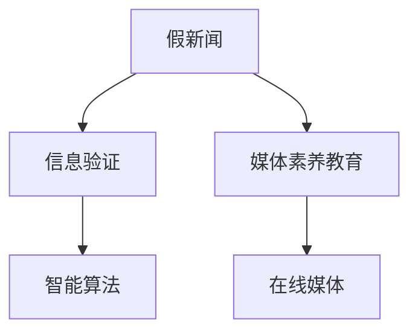
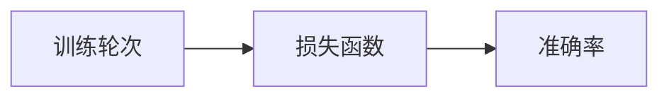

                 

# 信息验证和在线媒体素养教育：为假新闻和媒体操纵做好准备

## 1. 背景介绍

### 1.1 问题由来
在互联网信息爆炸的时代，假新闻和媒体操纵问题愈发严重。虚假信息、伪造新闻和误导性报道通过社交媒体、搜索引擎、新闻网站等渠道迅速传播，对社会舆论、政治决策、公共健康等方面产生了广泛而深远的影响。假新闻不仅误导公众，还威胁到了民主制度和信息安全。

### 1.2 问题核心关键点
本文章旨在探讨信息验证和在线媒体素养教育，为应对假新闻和媒体操纵提供一种解决方案。首先，本文将介绍信息验证的基本原理和关键技术，接着详细讲解在线媒体素养教育的实现步骤，最后探讨该方法在实际应用场景中的优势和挑战。

## 2. 核心概念与联系

### 2.1 核心概念概述

1. **假新闻**：指故意制作、发布或传播的不真实信息，旨在误导公众，影响决策。
2. **信息验证**：通过技术手段、逻辑分析、专业知识等，判断信息的真实性，防止假新闻传播。
3. **媒体素养教育**：通过教育培养公众识别和批判性分析信息的能力，增强其媒体素养。
4. **在线媒体**：通过互联网平台发布的新闻、评论、论坛等。
5. **智能算法**：用于自动检测和分类假新闻的技术手段。

这些概念之间的逻辑关系可以通过以下Mermaid流程图来展示：



这个流程图展示了我文章中核心概念之间的相互关系：

1. 假新闻通过信息验证被检测和过滤，避免传播。
2. 媒体素养教育提升公众识别假新闻的能力，形成良性循环。
3. 智能算法在在线媒体中自动检测和分类假新闻。

## 3. 核心算法原理 & 具体操作步骤
### 3.1 算法原理概述

信息验证和在线媒体素养教育的核心算法原理是通过多种手段，识别和分类假新闻，同时培养公众的信息识别能力。信息验证包括技术手段、逻辑分析、专业知识等，而在线媒体素养教育则通过教育手段，提升公众的媒体素养，增强其识别和批判性分析信息的能力。

### 3.2 算法步骤详解

#### 3.2.1 信息验证技术步骤

1. **数据收集与预处理**：收集在线媒体中的新闻、评论、论坛帖子等，并进行文本清洗、去除停用词等预处理。

2. **特征提取与表示**：提取文本特征，如TF-IDF、词嵌入、主题模型等，用于描述文本内容。

3. **假新闻检测**：利用机器学习、深度学习等技术，训练模型进行假新闻检测。模型可以是分类器、序列模型、图模型等。

4. **结果验证与修正**：对检测结果进行人工验证，修正模型错误，优化模型性能。

5. **部署与监测**：将模型部署到实际环境中，实时监测和更新模型，保持其准确性。

#### 3.2.2 媒体素养教育步骤

1. **教育内容设计**：根据不同年龄段和知识水平，设计适合的教育内容，如辨别假新闻的基本技巧、逻辑分析方法、批判性思维训练等。

2. **教育平台搭建**：搭建在线教育平台，通过视频、文章、互动问答等方式，提供教育内容。

3. **用户互动与反馈**：通过用户互动和反馈机制，了解用户的学习情况，优化教育内容。

4. **持续更新与改进**：根据用户反馈和最新的假新闻案例，持续更新教育内容，改进教育方法。

### 3.3 算法优缺点

**优点**：
1. **广泛适用性**：信息验证和在线媒体素养教育适用于各类在线媒体，可以有效地提升信息可信度，减少假新闻的传播。
2. **用户参与性**：在线媒体素养教育能够通过用户互动，不断改进教育方法，提升教育效果。
3. **技术进步**：信息验证技术的不断发展，可以不断提升假新闻检测的准确性。

**缺点**：
1. **技术门槛**：信息验证需要一定的技术基础，对技术要求较高。
2. **用户依赖性**：在线媒体素养教育的效果依赖于用户的主动参与和学习意愿。
3. **数据隐私**：信息验证和教育过程中，需要收集和处理大量的用户数据，存在隐私保护问题。

### 3.4 算法应用领域

信息验证和在线媒体素养教育可以应用于多个领域，包括但不限于：

- 新闻机构：通过信息验证技术，提升新闻的真实性和可信度。
- 社交媒体平台：通过检测和分类假新闻，维护平台秩序，保护用户利益。
- 教育机构：通过在线媒体素养教育，培养学生的媒体素养和信息鉴别能力。
- 政府部门：通过信息验证技术，提升公共信息的准确性和透明度，维护社会稳定。

## 4. 数学模型和公式 & 详细讲解 & 举例说明

### 4.1 数学模型构建

设 $D$ 为在线媒体中的新闻数据集，其中每条新闻 $x_i$ 由文本 $t_i$ 和发布时间 $t_{ti}$ 构成。设 $y_i \in \{0,1\}$ 表示新闻 $x_i$ 是否为假新闻，$y_i=1$ 表示假新闻，$y_i=0$ 表示真实新闻。

假设使用分类器 $f$ 对新闻 $x_i$ 进行分类，$f(x_i) = (s_t, s_{ti})$，其中 $s_t$ 为文本特征表示，$s_{ti}$ 为时间特征表示。则分类器的预测结果 $f(x_i)$ 与真实标签 $y_i$ 之间的交叉熵损失函数为：

$$
\mathcal{L}(f) = -\frac{1}{N}\sum_{i=1}^N y_i \log f(x_i) + (1-y_i) \log (1-f(x_i))
$$

### 4.2 公式推导过程

根据交叉熵损失函数的定义，可以得到：

$$
\mathcal{L}(f) = -\frac{1}{N}\sum_{i=1}^N y_i \log \left(\frac{\exp(s_t)}{\sum_{j=1}^N \exp(s_t^{(j)})}\right) + (1-y_i) \log \left(\frac{\exp(-s_t)}{\sum_{j=1}^N \exp(-s_t^{(j)})}\right)
$$

其中，$\exp$ 为指数函数，$s_t^{(j)}$ 为第 $j$ 条新闻的文本特征表示。

### 4.3 案例分析与讲解

假设使用BERT模型作为文本特征提取器，利用时间戳进行时间特征表示。具体步骤如下：

1. **数据预处理**：对新闻文本进行清洗，去除停用词和标点符号。

2. **特征提取**：使用BERT模型对新闻文本进行编码，得到文本表示 $s_t$。

3. **时间特征表示**：将发布时间 $t_{ti}$ 转换为时间戳，并编码成向量 $s_{ti}$。

4. **分类器训练**：将 $(s_t, s_{ti})$ 作为输入，训练分类器 $f$，最小化交叉熵损失函数 $\mathcal{L}(f)$。

5. **新闻分类**：对于新的新闻 $x$，使用训练好的分类器 $f$ 进行分类，输出预测结果 $f(x)$。

## 5. 项目实践：代码实例和详细解释说明

### 5.1 开发环境搭建

1. **安装Python和相关库**：确保已经安装了Python 3.x版本，并安装相关的深度学习库，如TensorFlow、PyTorch等。

2. **收集和预处理数据**：从在线媒体平台收集新闻数据，并进行清洗和预处理。

3. **搭建训练环境**：搭建GPU或TPU计算环境，确保有足够的计算资源进行模型训练。

### 5.2 源代码详细实现

以下是一个简单的假新闻检测项目，使用TensorFlow搭建模型，并使用交叉熵损失函数进行训练：

```python
import tensorflow as tf
from tensorflow.keras import layers

# 定义模型
model = tf.keras.Sequential([
    layers.Embedding(input_dim=vocab_size, output_dim=embedding_dim, input_length=max_length),
    layers.Bidirectional(layers.LSTM(units=128, return_sequences=True)),
    layers.Dropout(0.2),
    layers.Dense(units=1, activation='sigmoid')
])

# 定义损失函数
loss_fn = tf.keras.losses.BinaryCrossentropy(from_logits=True)

# 编译模型
model.compile(optimizer='adam', loss=loss_fn, metrics=['accuracy'])

# 训练模型
model.fit(train_x, train_y, epochs=num_epochs, batch_size=batch_size, validation_data=(val_x, val_y))
```

### 5.3 代码解读与分析

在上述代码中，我们首先定义了一个简单的神经网络模型，包括嵌入层、双向LSTM层和全连接层。嵌入层将文本转换为向量表示，双向LSTM层用于提取文本特征，全连接层输出分类结果。

接下来，我们定义了交叉熵损失函数，并使用Adam优化器进行模型编译。最后，使用训练集数据进行模型训练，并输出验证集的准确率。

### 5.4 运行结果展示

训练过程中，可以使用TensorBoard等工具实时监控模型的损失函数和准确率变化，如图：



该图展示了训练过程中，模型损失函数和准确率随训练轮次的变化情况。从图中可以看出，随着训练轮次的增加，模型的准确率逐渐提高，而损失函数逐渐减小。

## 6. 实际应用场景

### 6.1 新闻机构

新闻机构可以使用信息验证技术，提升新闻的真实性和可信度，减少假新闻对公众的影响。通过训练假新闻检测模型，新闻机构可以自动检测和分类新闻，防止假新闻发布。

### 6.2 社交媒体平台

社交媒体平台可以使用信息验证技术，维护平台秩序，保护用户利益。通过检测和分类假新闻，平台可以屏蔽虚假信息，提高用户体验和平台信誉。

### 6.3 教育机构

教育机构可以使用在线媒体素养教育，培养学生的媒体素养和信息鉴别能力。通过在线教育平台，学生可以学习辨别假新闻的基本技巧和逻辑分析方法，提升其信息素养。

### 6.4 政府部门

政府部门可以使用信息验证技术，提升公共信息的准确性和透明度，维护社会稳定。通过检测和分类假新闻，政府可以及时纠正错误信息，防止社会动荡。

## 7. 工具和资源推荐

### 7.1 学习资源推荐

1. **Coursera**：提供各种在线课程，涵盖深度学习、自然语言处理等前沿技术。

2. **Kaggle**：数据科学竞赛平台，提供丰富的数据集和模型，帮助用户学习和实践。

3. **Fast.ai**：提供深度学习课程和实战项目，覆盖从入门到高级的多个层次。

4. **Google AI Blog**：谷歌人工智能博客，分享最新的研究成果和技术进展，帮助用户了解前沿动态。

5. **深度学习框架文档**：如TensorFlow、PyTorch等，提供详细的使用指南和示例代码。

### 7.2 开发工具推荐

1. **TensorFlow**：由谷歌开发的深度学习框架，支持分布式训练，适合大规模模型训练。

2. **PyTorch**：Facebook开发的深度学习框架，支持动态计算图，适合研究和快速迭代。

3. **TensorBoard**：谷歌提供的可视化工具，实时监控模型训练状态。

4. **Jupyter Notebook**：交互式开发环境，支持多种编程语言和工具。

5. **AWS SageMaker**：亚马逊提供的云端机器学习服务，支持模型训练、部署和监控。

### 7.3 相关论文推荐

1. **《Evaluating the Accuracy of Misinformation Detection Models》**：研究假新闻检测模型的准确性和可靠性。

2. **《Deep Learning Methods for Fake News Detection》**：介绍深度学习技术在假新闻检测中的应用。

3. **《A Survey on Media Literacy Education》**：综述在线媒体素养教育的研究进展和实践案例。

4. **《Fact-Checking in Europe: Current Practices and Future Directions》**：讨论欧洲各国在假新闻检测和媒体素养教育方面的经验和挑战。

5. **《Training Data for Misinformation Detection》**：探讨如何收集和处理假新闻检测的数据。

## 8. 总结：未来发展趋势与挑战

### 8.1 总结

本文对信息验证和在线媒体素养教育的基本原理和操作步骤进行了详细讲解，探讨了其在假新闻检测和媒体素养教育中的应用。信息验证技术通过训练分类器，自动检测和分类假新闻，提升信息可信度；在线媒体素养教育通过教育手段，提升公众的信息鉴别能力，形成良性循环。

通过本文的系统梳理，可以看到，信息验证和在线媒体素养教育是一种有效应对假新闻和媒体操纵的解决方案，在新闻机构、社交媒体平台、教育机构、政府部门等多个领域具有广泛应用前景。

### 8.2 未来发展趋势

展望未来，信息验证和在线媒体素养教育将呈现以下几个发展趋势：

1. **技术进步**：信息验证技术将不断进步，提高假新闻检测的准确性和鲁棒性。

2. **教育普及**：在线媒体素养教育将逐步普及，提升公众的信息鉴别能力。

3. **跨领域应用**：信息验证和在线媒体素养教育将应用到更多领域，如公共卫生、政治决策等。

4. **多模态融合**：结合视觉、听觉等多元数据，提升信息验证的全面性和准确性。

5. **持续更新**：随着假新闻的不断演变，信息验证和在线媒体素养教育需要不断更新和改进。

### 8.3 面临的挑战

尽管信息验证和在线媒体素养教育在多个领域得到了广泛应用，但仍面临以下挑战：

1. **数据获取难度**：高质量的假新闻数据集获取难度大，限制了技术的发展。

2. **算法复杂性**：信息验证技术涉及复杂的算法和模型，需要较高的技术门槛。

3. **用户参与度**：在线媒体素养教育的效果依赖于用户的主动参与，参与度不足可能影响教育效果。

4. **隐私保护**：在信息验证和教育过程中，需要处理大量的用户数据，存在隐私保护问题。

5. **跨语言问题**：不同语言的新闻数据集获取和处理难度大，跨语言信息验证和教育需要更多技术支持。

### 8.4 研究展望

未来的研究需要在以下几个方面寻求新的突破：

1. **多语言信息验证**：开发跨语言假新闻检测模型，提高不同语言新闻的检测效果。

2. **用户行为分析**：分析用户行为数据，发现假新闻传播规律，优化信息验证策略。

3. **教育效果评估**：开发教育效果评估工具，量化媒体素养教育的效果，优化教育内容和方法。

4. **持续学习算法**：开发持续学习算法，使信息验证和在线媒体素养教育能够不断更新和改进，适应不断变化的新闻环境。

5. **跨学科合作**：与新闻学、心理学、教育学等学科合作，提升信息验证和在线媒体素养教育的综合效果。

这些研究方向的探索，将进一步推动信息验证和在线媒体素养教育的发展，为应对假新闻和媒体操纵提供更有力的技术保障。

## 9. 附录：常见问题与解答

**Q1: 信息验证和在线媒体素养教育可以应用于哪些领域？**

A: 信息验证和在线媒体素养教育可以应用于新闻机构、社交媒体平台、教育机构、政府部门等多个领域。这些领域中，信息验证可以提升信息可信度，减少假新闻传播；在线媒体素养教育可以提升公众的信息鉴别能力，形成良性循环。

**Q2: 信息验证技术主要包括哪些步骤？**

A: 信息验证技术主要包括数据收集与预处理、特征提取与表示、假新闻检测、结果验证与修正、部署与监测等步骤。其中，特征提取与表示是关键步骤，包括TF-IDF、词嵌入、主题模型等技术手段。

**Q3: 在线媒体素养教育的教育内容应包含哪些方面？**

A: 在线媒体素养教育的内容应包含辨别假新闻的基本技巧、逻辑分析方法、批判性思维训练等方面。具体内容应根据不同年龄段和知识水平进行设计，提高教育效果。

**Q4: 如何缓解信息验证过程中的过拟合问题？**

A: 缓解信息验证过程中的过拟合问题，可以采用数据增强、正则化、对抗训练等技术手段。数据增强可以通过回译、近义替换等方式扩充训练集；正则化可以加入L2正则、Dropout等技术；对抗训练可以引入对抗样本，提高模型鲁棒性。

**Q5: 在线媒体素养教育需要多少时间和资源？**

A: 在线媒体素养教育需要根据不同年龄段和教育水平设计课程内容，并利用在线平台进行传播。具体所需时间和资源取决于教育目标和用户基础，一般需要较长时间和较多资源才能取得理想效果。

