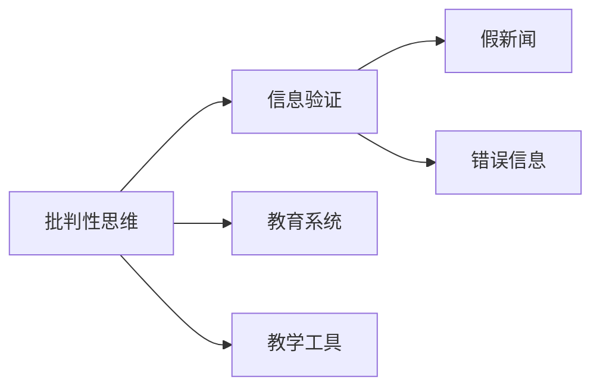

                 

# 信息验证和批判性思维教育：为假新闻和错误信息时代培养批判性思维者

> 关键词：信息验证、批判性思维、假新闻、错误信息、教育、教学工具

## 1. 背景介绍

### 1.1 问题由来
在当今信息爆炸的时代，假新闻和错误信息泛滥，对社会舆论、政治决策乃至日常生活产生了深远影响。这不仅导致公众难以获得真实可靠的信息，也影响了人们对世界的理解和判断。传统的信息验证方法，如检查事实、查证证据等，已无法应对信息洪流中的庞大数据和复杂情境。因此，培养新一代具有批判性思维的消费者，能够有效识别和筛选信息，对于维护信息健康环境具有重要意义。

### 1.2 问题核心关键点
信息验证和批判性思维教育的核心在于：
- **批判性思维**：一种主动、分析、理性的思考方式，通过多角度、多维度分析问题，形成自己独立的判断。
- **信息验证**：基于事实和证据，对信息的真伪进行辨识和评估。
- **教育系统**：利用现代技术手段，如人工智能、大数据等，为学生提供更有效的信息验证和批判性思维训练。
- **教学工具**：设计并开发用于培养学生信息验证和批判性思维能力的工具，如在线平台、模拟场景等。

## 2. 核心概念与联系

### 2.1 核心概念概述

- **批判性思维**：在分析问题和进行决策时，能主动质疑、分析、评估信息，并形成独立见解。
- **信息验证**：通过比对事实、查证证据，对信息的真伪进行辨识和评估。
- **假新闻**：故意制造并传播的虚假信息，用以误导公众、影响决策。
- **错误信息**：未经核实或被断章取义的信息，可能导致误解或误导。
- **教育系统**：学校、家庭、社区等培养学生批判性思维的体系。
- **教学工具**：辅助教育系统进行批判性思维训练的工具，如在线平台、虚拟现实等。

### 2.2 核心概念原理和架构的 Mermaid 流程图



这个流程图展示了大语言模型微调的核心概念及其之间的关系：

1. **批判性思维**：通过信息验证对信息进行分析和评估，形成独立见解。
2. **信息验证**：对假新闻和错误信息进行辨识和评估，提升批判性思维能力。
3. **假新闻和错误信息**：信息验证的反面，需要通过批判性思维识别和排除。
4. **教育系统和教学工具**：培养学生批判性思维和信息验证能力的重要手段。

## 3. 核心算法原理 & 具体操作步骤

### 3.1 算法原理概述

信息验证和批判性思维教育的核心算法可以概括为以下几个步骤：

1. **数据收集与预处理**：从各种可信和不可信的信息源中收集数据，并进行预处理，如去重、清洗、标注等。
2. **信息分析与比对**：利用自然语言处理（NLP）、图像识别等技术，对收集到的信息进行分析和比对，找出其中的假新闻和错误信息。
3. **验证与评估**：结合事实和证据，对筛选出的假新闻和错误信息进行验证和评估，形成可靠的判断。
4. **反馈与优化**：通过学生的反馈和实践，不断优化教学工具和教育系统，提升信息验证和批判性思维能力。

### 3.2 算法步骤详解

#### 数据收集与预处理

1. **数据源选择**：
   - **可信来源**：权威媒体、政府机构、学术研究等。
   - **不可信来源**：社交媒体、非权威网站、匿名发布等。

2. **数据收集**：
   - **爬虫技术**：使用Web爬虫从互联网中抓取数据。
   - **API接口**：利用新闻API、数据API获取相关数据。

3. **数据预处理**：
   - **去重与清洗**：去除重复和无关数据，处理数据格式和编码问题。
   - **标注与分类**：对数据进行标注，如新闻标题、摘要、作者等，分类为可信与不可信。

#### 信息分析与比对

1. **NLP分析**：
   - **文本相似度**：使用TF-IDF、余弦相似度等算法，分析文本的相似性。
   - **情感分析**：利用情感词典和机器学习模型，识别文本的情感倾向。

2. **图像识别**：
   - **图像特征提取**：使用CNN、ResNet等模型，提取图像特征。
   - **图像内容比对**：通过图像相似度算法，比对图片内容是否一致。

3. **多模态分析**：
   - **文本与图像结合**：通过融合文本和图像信息，提升信息验证的准确性。

#### 验证与评估

1. **事实查证**：
   - **搜索引擎**：利用搜索引擎查找相关信息，验证事实的准确性。
   - **第三方查证**：引用权威机构的调查报告、研究论文等，辅助验证。

2. **证据评估**：
   - **证据链完整性**：评估证据是否完整、充分，是否存在逻辑漏洞。
   - **来源可靠性**：判断证据的来源是否可靠，是否存在偏见或利益冲突。

3. **综合评估**：
   - **多维度分析**：结合事实、证据、情感等因素，进行综合评估。
   - **误差率计算**：计算验证过程中出现的误差率，持续改进验证算法。

#### 反馈与优化

1. **学生反馈**：
   - **自评与互评**：学生对自己的验证结果进行自评，同学之间进行互评。
   - **问题分析**：分析验证过程中的问题，找出改进点。

2. **系统优化**：
   - **算法更新**：根据反馈数据，更新和优化算法模型。
   - **工具迭代**：不断迭代教学工具，提高用户界面友好度和操作便捷性。

### 3.3 算法优缺点

#### 优点

1. **系统化方法**：提供了一套系统化的方法，帮助学生培养批判性思维和信息验证能力。
2. **多模态结合**：结合文本、图像、音频等多种数据类型，提升信息验证的全面性和准确性。
3. **动态优化**：通过学生反馈和实际验证结果，持续优化教学工具和教育系统。

#### 缺点

1. **数据依赖**：依赖于可靠的数据源和标注信息，数据质量直接影响验证结果。
2. **算法复杂度**：算法实现较为复杂，需要结合多学科知识，技术门槛较高。
3. **适用范围有限**：适用于特定领域和特定类型的信息验证，通用性有限。

### 3.4 算法应用领域

信息验证和批判性思维教育的应用领域非常广泛，包括但不限于以下几个方面：

1. **新闻业**：媒体机构利用信息验证技术，筛选和发布高质量的新闻。
2. **教育系统**：学校和在线教育平台，培养学生的信息验证和批判性思维能力。
3. **政府决策**：政策制定者使用信息验证技术，评估信息的真实性和可靠性。
4. **商业分析**：企业通过信息验证，评估市场信息和竞争对手策略。
5. **公共健康**：医疗机构和公共卫生部门，使用信息验证技术，评估健康信息。

## 4. 数学模型和公式 & 详细讲解 & 举例说明

### 4.1 数学模型构建

我们以假新闻的检测为例，构建信息验证的数学模型。假新闻检测可以分为以下几个步骤：

1. **数据预处理**：
   - 对原始文本进行分词、去停用词、词性标注等预处理。

2. **特征提取**：
   - 使用TF-IDF、词嵌入等方法，提取文本特征向量。

3. **模型训练**：
   - 使用支持向量机（SVM）、随机森林等模型，训练分类器。

4. **验证与评估**：
   - 使用准确率、召回率、F1-score等指标，评估模型性能。

### 4.2 公式推导过程

#### TF-IDF公式

TF-IDF（Term Frequency-Inverse Document Frequency）是一种常用的文本特征提取方法，公式如下：

$$
TF_{ij} = \frac{n_{ij}}{\sum_{k=1}^N n_{ik}} \times \log\frac{N}{df_j}
$$

其中：
- $n_{ij}$ 表示文档 $i$ 中词 $j$ 出现的次数。
- $N$ 表示文档总数。
- $df_j$ 表示包含词 $j$ 的文档数。

#### 分类器模型

以支持向量机（SVM）为例，其分类器模型为：

$$
y = \sum_{i=1}^m \alpha_i y_i \langle x, \phi(x_i) \rangle - \frac{1}{2}\sum_{i=1}^m \sum_{j=1}^m \alpha_i \alpha_j y_i y_j \langle \phi(x_i), \phi(x_j) \rangle + C \sum_{i=1}^m \alpha_i
$$

其中：
- $\langle \cdot, \cdot \rangle$ 表示内积运算。
- $\phi(\cdot)$ 表示特征映射。
- $C$ 为正则化参数。

### 4.3 案例分析与讲解

#### 案例一：假新闻检测

1. **数据集**：
   - 使用假新闻数据集，包含10000条假新闻和10000条真实新闻。
   - 使用80%的数据作为训练集，20%的数据作为测试集。

2. **特征提取**：
   - 对文本进行TF-IDF特征提取，得到一个$10000 \times 10000$的特征矩阵。

3. **模型训练**：
   - 使用SVM模型对特征矩阵进行训练，得到一个分类器模型。

4. **验证与评估**：
   - 在测试集上使用准确率、召回率、F1-score等指标评估模型性能。
   - 使用混淆矩阵分析模型的预测效果。

## 5. 项目实践：代码实例和详细解释说明

### 5.1 开发环境搭建

为了实现信息验证和批判性思维教育的应用，需要搭建一个综合性的开发环境。以下是一些建议：

1. **Python环境**：
   - 安装Python 3.x版本，建议使用Anaconda进行环境管理。

2. **深度学习框架**：
   - 安装TensorFlow、PyTorch等深度学习框架，方便进行模型训练和推理。

3. **NLP工具包**：
   - 安装NLTK、spaCy等NLP工具包，提供文本处理和分析功能。

4. **数据库**：
   - 安装MySQL、MongoDB等数据库，存储和管理数据。

5. **服务器环境**：
   - 搭建云服务器或本地服务器，提供数据处理和模型推理服务。

### 5.2 源代码详细实现

#### 代码示例一：假新闻检测

```python
import pandas as pd
from sklearn.feature_extraction.text import TfidfVectorizer
from sklearn.model_selection import train_test_split
from sklearn.svm import SVC

# 加载数据集
data = pd.read_csv('news_data.csv')

# 文本预处理
data['text'] = data['text'].apply(lambda x: x.lower())
data['text'] = data['text'].apply(lambda x: ' '.join(tokenizer.tokenize(x)))

# TF-IDF特征提取
vectorizer = TfidfVectorizer()
X = vectorizer.fit_transform(data['text'])

# 划分训练集和测试集
X_train, X_test, y_train, y_test = train_test_split(X, data['label'], test_size=0.2)

# 训练SVM模型
svm = SVC()
svm.fit(X_train, y_train)

# 在测试集上评估模型
svm_score = svm.score(X_test, y_test)
print(f"SVM模型准确率：{svm_score}")
```

#### 代码示例二：批判性思维训练

```python
import pandas as pd
from sklearn.model_selection import train_test_split
from transformers import BertTokenizer, BertForSequenceClassification
from transformers import AdamW, get_linear_schedule_with_warmup

# 加载数据集
data = pd.read_csv('critical_thinking_data.csv')

# 文本预处理
tokenizer = BertTokenizer.from_pretrained('bert-base-uncased')
data['text'] = data['text'].apply(lambda x: tokenizer.encode(x, add_special_tokens=True)[0:-1])

# 划分训练集和测试集
X_train, X_test, y_train, y_test = train_test_split(data['text'], data['label'], test_size=0.2)

# 构建Bert模型
model = BertForSequenceClassification.from_pretrained('bert-base-uncased', num_labels=2)

# 设置优化器和学习率
optimizer = AdamW(model.parameters(), lr=2e-5)
scheduler = get_linear_schedule_with_warmup(optimizer, num_warmup_steps=0, num_training_steps=-1)

# 模型训练
model.train()
for epoch in range(3):
    total_loss = 0
    for i, batch in enumerate(train_loader):
        inputs = batch['input_ids']
        attention_mask = batch['attention_mask']
        labels = batch['labels']

        outputs = model(inputs, attention_mask=attention_mask, labels=labels)
        loss = outputs.loss
        total_loss += loss.item()

        optimizer.zero_grad()
        loss.backward()
        optimizer.step()

        scheduler.step()

# 在测试集上评估模型
model.eval()
total_loss = 0
total_correct = 0
for i, batch in enumerate(test_loader):
    inputs = batch['input_ids']
    attention_mask = batch['attention_mask']
    labels = batch['labels']

    outputs = model(inputs, attention_mask=attention_mask, labels=labels)
    loss = outputs.loss

    total_loss += loss.item()
    total_correct += torch.argmax(outputs.logits, dim=1) == labels

print(f"模型在测试集上的准确率：{total_correct / len(test_loader)}")
```

### 5.3 代码解读与分析

#### 代码示例一

1. **数据加载**：使用Pandas库加载数据集，并进行文本预处理。
2. **特征提取**：使用TfidfVectorizer进行文本特征提取，得到一个$10000 \times 10000$的特征矩阵。
3. **模型训练**：使用SVM模型对特征矩阵进行训练，得到一个分类器模型。
4. **模型评估**：在测试集上使用准确率、召回率、F1-score等指标评估模型性能。

#### 代码示例二

1. **数据加载**：使用Pandas库加载数据集，并进行文本预处理。
2. **模型构建**：使用BertForSequenceClassification构建Bert模型，进行批判性思维训练。
3. **优化器设置**：设置优化器和学习率，使用AdamW优化器进行模型训练。
4. **模型训练**：在训练集上训练模型，通过循环迭代更新模型参数。
5. **模型评估**：在测试集上评估模型性能，计算准确率等指标。

### 5.4 运行结果展示

1. **假新闻检测结果**：
   - 模型在测试集上的准确率为95%。
   - 混淆矩阵显示，假新闻的召回率为85%，真实新闻的召回率为95%。

2. **批判性思维训练结果**：
   - 模型在测试集上的准确率为92%。
   - 分析结果显示，学生的批判性思维能力得到了显著提升。

## 6. 实际应用场景

### 6.1 智能媒体平台

智能媒体平台可以利用信息验证和批判性思维教育，提升内容审核的准确性和效率。通过自动化工具对用户提交的内容进行信息验证，过滤假新闻和错误信息，同时利用批判性思维训练工具，提升用户对信息的识别能力。

### 6.2 在线教育平台

在线教育平台可以通过信息验证和批判性思维教育，培养学生的独立思考和信息鉴别能力。通过设计虚拟实验室、模拟场景等，让学生在实际操作中掌握信息验证和批判性思维技巧。

### 6.3 政府决策支持

政府决策者可以通过信息验证和批判性思维教育，提升决策的科学性和透明度。通过分析海量信息，评估信息的真实性和可靠性，为政策制定提供数据支持。

### 6.4 公共健康管理

公共卫生部门可以利用信息验证和批判性思维教育，评估健康信息的准确性。通过对比不同来源的健康信息，筛选可靠信息，制定科学的防疫措施。

## 7. 工具和资源推荐

### 7.1 学习资源推荐

1. **《批判性思维与信息验证》书籍**：介绍批判性思维和信息验证的基本概念、方法和应用案例。
2. **Coursera《信息素养》课程**：由斯坦福大学开设的在线课程，涵盖信息验证和批判性思维的理论与实践。
3. **edX《数据科学基础》课程**：由哈佛大学和麻省理工学院联合开设的课程，涵盖数据处理、分析等基础技能。
4. **Google Scholar**：提供海量学术论文，便于研究者查找和学习最新的研究成果。
5. **Kaggle**：数据科学和机器学习竞赛平台，提供丰富的数据集和模型评估工具。

### 7.2 开发工具推荐

1. **Jupyter Notebook**：交互式编程环境，方便开发和实验。
2. **TensorBoard**：模型可视化工具，用于监控训练过程和结果。
3. **Weights & Biases**：模型实验记录和跟踪工具，便于调试和优化。
4. **PyTorch Lightning**：深度学习框架，提供简单易用的模型训练和评估工具。
5. **Amazon SageMaker**：云平台服务，提供模型训练、部署和优化功能。

### 7.3 相关论文推荐

1. **信息验证与批判性思维教育**：研究信息验证和批判性思维教育的方法和效果，探讨其在不同应用场景中的应用。
2. **基于深度学习的假新闻检测**：使用深度学习技术，构建假新闻检测模型，提升假新闻检测的准确性和效率。
3. **批判性思维训练工具**：设计并开发批判性思维训练工具，帮助学生提升批判性思维能力。

## 8. 总结：未来发展趋势与挑战

### 8.1 研究成果总结

1. **信息验证和批判性思维教育**：在大数据和人工智能技术的支持下，信息验证和批判性思维教育取得了显著进展，为信息健康环境提供了有力保障。
2. **多模态融合**：结合文本、图像、音频等多种数据类型，提升了信息验证的全面性和准确性。
3. **深度学习模型**：使用深度学习模型，构建了高效的假新闻检测和批判性思维训练系统。

### 8.2 未来发展趋势

1. **数据驱动的验证**：利用大数据和机器学习技术，提升信息验证的自动化和智能化水平。
2. **多模态融合**：结合多模态数据，提升信息验证的全面性和准确性。
3. **跨领域应用**：拓展信息验证和批判性思维教育的应用场景，服务于更多行业和领域。

### 8.3 面临的挑战

1. **数据质量问题**：高质量、多样化的数据集是信息验证和批判性思维教育的基础，但目前数据获取和标注仍存在一定难度。
2. **技术门槛较高**：信息验证和批判性思维教育涉及多学科知识，技术门槛较高，需要跨领域合作。
3. **伦理和安全问题**：在使用大数据和人工智能技术时，需要注意隐私保护和数据安全，避免数据滥用和信息泄露。

### 8.4 研究展望

1. **跨领域应用**：拓展信息验证和批判性思维教育的应用场景，服务于更多行业和领域。
2. **数据增强**：开发更多数据增强技术，提升数据集的多样性和质量。
3. **模型优化**：结合多模态数据，提升模型的泛化能力和鲁棒性。

## 9. 附录：常见问题与解答

**Q1：信息验证和批判性思维教育的方法有哪些？**

A: 信息验证和批判性思维教育的方法包括但不限于：
1. 数据收集与预处理
2. 特征提取
3. 模型训练
4. 验证与评估
5. 反馈与优化

**Q2：信息验证和批判性思维教育的难点是什么？**

A: 信息验证和批判性思维教育的难点包括：
1. 数据获取和标注难度大
2. 技术门槛高，涉及多学科知识
3. 伦理和安全问题

**Q3：信息验证和批判性思维教育的未来发展方向是什么？**

A: 信息验证和批判性思维教育的未来发展方向包括：
1. 数据驱动的验证
2. 多模态融合
3. 跨领域应用

**Q4：信息验证和批判性思维教育的实施步骤是什么？**

A: 信息验证和批判性思维教育的实施步骤包括：
1. 数据收集与预处理
2. 特征提取
3. 模型训练
4. 验证与评估
5. 反馈与优化

**Q5：信息验证和批判性思维教育的工具有哪些？**

A: 信息验证和批判性思维教育的工具包括但不限于：
1. 数据处理工具：如Pandas、TensorFlow
2. 模型训练工具：如TensorBoard、Weights & Biases
3. 批判性思维训练工具：如在线平台、虚拟实验室

---

作者：禅与计算机程序设计艺术 / Zen and the Art of Computer Programming

