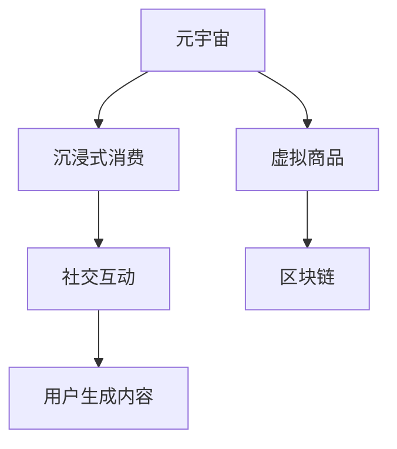

                 

# 元宇宙体验经济：沉浸式消费的新形态

> 关键词：元宇宙, 沉浸式消费, 虚拟商品, 社交互动, 虚拟体验, 区块链, 用户生成内容

## 1. 背景介绍

### 1.1 问题由来
随着虚拟现实(VR)、增强现实(AR)、混合现实(MR)等技术的迅速发展，人们对于虚拟世界体验的向往和需求日益强烈。传统消费方式已经无法满足人们对于沉浸式体验的需求，元宇宙概念应运而生。元宇宙是一个基于虚拟现实技术构建的虚拟世界，具有实时性、多维性、社交性等特征。用户可以在其中自由互动，体验各种沉浸式消费内容，如虚拟商品购物、虚拟旅游、虚拟演唱会等。

### 1.2 问题核心关键点
元宇宙体验经济的核心在于通过虚拟现实技术，构建沉浸式消费场景，使消费者能够在虚拟世界中享受丰富多彩的体验。其关键点包括：
- 如何构建真实感强烈的虚拟商品和场景
- 如何实现用户与虚拟世界的深度互动
- 如何保证用户的数据安全和隐私保护
- 如何通过区块链技术实现虚拟物品的透明流通和交易
- 如何利用用户生成内容(UGC)提升用户体验和粘性

### 1.3 问题研究意义
研究元宇宙体验经济，对于推动虚拟现实技术的广泛应用，激发新的消费增长点，提升用户体验，具有重要意义：
- 促进虚拟现实技术的商业化应用。元宇宙提供了一个广阔的试验场，使企业能够在真实环境中验证技术可行性。
- 拓展消费模式。元宇宙消费模式打破了物理世界的时空限制，使消费者享受更加丰富、个性化的消费体验。
- 提升用户粘性。沉浸式体验能够激发用户的兴趣和参与度，增加消费频率和消费时长。
- 创造新的增长点。元宇宙经济将催生新的商业模式和产业链，带来新的增长机会。

## 2. 核心概念与联系

### 2.1 核心概念概述

为更好地理解元宇宙体验经济，本节将介绍几个密切相关的核心概念：

- 元宇宙(Metaverse)：基于虚拟现实技术构建的虚拟世界，具有高度的真实感、社交性和互动性。用户可以在其中进行各种虚拟活动。

- 沉浸式消费(Immersive Consumption)：通过虚拟现实技术，使消费者能够深度沉浸在虚拟世界中，享受更加真实、互动的消费体验。

- 虚拟商品(Virtual Goods)：在元宇宙中，以虚拟形式呈现的商品，包括但不限于衣物、家具、装饰品等。

- 社交互动(Social Interaction)：用户在虚拟世界中的互动行为，如聊天、游戏、合作等。

- 区块链(Blockchain)：去中心化的分布式账本技术，保障虚拟物品的透明流通和交易安全。

- 用户生成内容(UGC)：用户创作和分享的内容，如虚拟世界中的建筑、艺术品、音乐等，提升虚拟世界的丰富性和活跃度。

这些核心概念之间的逻辑关系可以通过以下Mermaid流程图来展示：



这个流程图展示了几者之间的联系：

1. 元宇宙为沉浸式消费提供了虚拟环境。
2. 虚拟商品和场景通过区块链实现透明流通。
3. 社交互动和用户生成内容丰富了虚拟世界。

## 3. 核心算法原理 & 具体操作步骤
### 3.1 算法原理概述

元宇宙体验经济的核心算法原理包括虚拟商品生成、用户互动模拟和区块链交易等。

- **虚拟商品生成**：利用3D建模、纹理贴图、物理引擎等技术，生成具有真实感的虚拟商品和场景。
- **用户互动模拟**：通过虚拟现实技术，使消费者能够与虚拟世界进行自然交互，如点击、拖动、碰撞等。
- **区块链交易**：利用区块链技术，保障虚拟物品的透明流通和交易安全。

### 3.2 算法步骤详解

#### 步骤1: 虚拟商品生成
- 利用3D建模软件，创建虚拟商品的几何模型。
- 添加材质和纹理，使商品更具真实感。
- 使用物理引擎模拟光照、碰撞等物理效果。
- 将生成的模型导入虚拟世界引擎，如Unity、Unreal Engine等。

#### 步骤2: 用户互动模拟
- 设计虚拟世界的交互逻辑，如点击、拖动、碰撞等。
- 在虚拟世界引擎中实现交互效果，如物体运动、碰撞效果等。
- 利用AI技术，如自然语言处理(NLP)、计算机视觉(CV)，使虚拟世界能够理解用户行为，进行自然回应。

#### 步骤3: 区块链交易
- 选择一个合适的区块链平台，如Ethereum、Binance Smart Chain等。
- 开发智能合约，定义虚拟物品的创建、转移和销毁等操作。
- 在虚拟世界引擎中集成区块链，实现虚拟物品的区块链存储和交易。

### 3.3 算法优缺点

元宇宙体验经济具有以下优点：
- 提供沉浸式体验，满足消费者对高质量、个性化体验的需求。
- 打破物理世界的时空限制，拓展消费空间。
- 通过区块链技术，保障虚拟物品的透明流通和交易安全。
- 利用用户生成内容，提升虚拟世界的丰富性和活跃度。

同时，该方法也存在一定的局限性：
- 技术门槛高，需要专业的建模、编程和AI技能。
- 需要投入大量资源进行技术研发和内容制作。
- 虚拟物品的真实感和互动性可能不如物理世界的实物，影响用户体验。
- 虚拟物品的物理损坏和交易风险仍需处理。

### 3.4 算法应用领域

元宇宙体验经济的应用领域非常广泛，包括但不限于：
- 虚拟购物：在虚拟世界中进行虚拟商品购物，享受沉浸式购物体验。
- 虚拟旅游：在虚拟世界中探索名胜古迹，体验异国风情。
- 虚拟娱乐：参与虚拟演唱会、虚拟体育比赛等，享受沉浸式娱乐体验。
- 虚拟社交：在虚拟世界中与朋友聚会、聊天、游戏等，增强社交互动。
- 虚拟教育：在虚拟世界中进行虚拟课堂、实验等，提升学习效果。

## 4. 数学模型和公式 & 详细讲解  
### 4.1 数学模型构建

元宇宙体验经济涉及的数学模型较为复杂，主要包括以下几个方面：

- **虚拟商品生成**：涉及几何建模、纹理贴图、物理模拟等，属于计算机图形学和物理学的交叉领域。
- **用户互动模拟**：涉及人机交互和自然语言处理，属于计算机科学和认知科学的交叉领域。
- **区块链交易**：涉及分布式账本技术和智能合约，属于密码学和计算机科学的交叉领域。

### 4.2 公式推导过程

#### 虚拟商品生成
- 假设虚拟商品的几何模型为 $\mathcal{M}$，纹理贴图为 $\mathcal{T}$，光照效果为 $\mathcal{L}$。则虚拟商品的生成过程可以表示为：
$$
\mathcal{V} = \mathcal{M} \times \mathcal{T} \times \mathcal{L}
$$
其中 $\times$ 表示组合操作。

#### 用户互动模拟
- 假设用户行为为 $B$，虚拟世界的交互逻辑为 $I$。则用户互动模拟的过程可以表示为：
$$
\mathcal{O} = B \times I
$$
其中 $\mathcal{O}$ 表示虚拟世界的输出。

#### 区块链交易
- 假设虚拟物品为 $G$，区块链平台为 $\mathcal{B}$，智能合约为 $\mathcal{C}$。则虚拟物品的区块链交易过程可以表示为：
$$
\mathcal{T} = G \times \mathcal{B} \times \mathcal{C}
$$
其中 $\times$ 表示交互操作。

### 4.3 案例分析与讲解

#### 案例1: 虚拟购物
- 假设用户在虚拟世界中挑选一件虚拟服装 $\mathcal{G}$，并通过虚拟现实界面进行操作 $\mathcal{O}$。则虚拟购物的过程可以表示为：
$$
\mathcal{V} = \mathcal{G} \times \mathcal{O} \times \mathcal{V}
$$
其中 $\mathcal{V}$ 表示虚拟世界的整体状态。

#### 案例2: 虚拟旅游
- 假设用户通过虚拟现实界面，浏览虚拟旅游地 $\mathcal{L}$，并通过交互逻辑 $\mathcal{I}$ 进行探索。则虚拟旅游的过程可以表示为：
$$
\mathcal{E} = \mathcal{L} \times \mathcal{I} \times \mathcal{E}
$$
其中 $\mathcal{E}$ 表示用户的沉浸式体验。

#### 案例3: 虚拟社交
- 假设用户在虚拟世界中与朋友进行聊天 $\mathcal{C}$，并通过游戏合作 $\mathcal{G}$ 进行互动。则虚拟社交的过程可以表示为：
$$
\mathcal{S} = \mathcal{C} \times \mathcal{G} \times \mathcal{S}
$$
其中 $\mathcal{S}$ 表示社交互动的结果。

## 5. 项目实践：代码实例和详细解释说明
### 5.1 开发环境搭建

在进行元宇宙体验经济项目实践前，我们需要准备好开发环境。以下是使用Python和Unity进行开发的环境配置流程：

1. 安装Unity 2020或以上版本。
2. 安装Visual Studio 2019或以上版本。
3. 安装Python 3.8或以上版本。
4. 安装相关开发库，如Numpy、Pandas、OpenCV等。

完成上述步骤后，即可在Unity环境中进行元宇宙体验经济的开发。

### 5.2 源代码详细实现

以下是使用Unity和Python实现虚拟购物的代码示例：

#### Unity脚本
```csharp
using UnityEngine;
using UnityEngine.UI;

public class VirtualShopping : MonoBehaviour
{
    public GameObject productPrefab;
    public GameObject shoppingCart;

    public void OnBuyButtonClick()
    {
        // 创建虚拟商品
        GameObject virtualProduct = Instantiate(productPrefab, transform.position, Quaternion.identity);

        // 将虚拟商品添加到购物车
        shoppingCart.GetComponent<VirtualCart>().AddItem(virtualProduct);
    }
}

public class VirtualCart : MonoBehaviour
{
    public GameObject cartPrefab;
    public GameObject inventory;

    public void AddItem(GameObject item)
    {
        // 创建购物车条目
        GameObject cartItem = Instantiate(cartPrefab, inventory.transform, Quaternion.identity);

        // 设置商品信息
        cartItem.GetComponent<VirtualCartItem>().product = item;
    }
}
```

#### Python脚本
```python
import numpy as np
import pandas as pd

# 加载虚拟商品数据
data = pd.read_csv('virtual_goods.csv')

# 生成虚拟商品
def generate_virtual_goods(data):
    virtual_goods = []
    for item in data['item']:
        virtual_goods.append(item)

    return virtual_goods

# 生成购物车
def generate_virtual_cart(virtual_goods):
    cart = []
    for item in virtual_goods:
        cart.append(item)

    return cart

# 主函数
def main():
    virtual_goods = generate_virtual_goods(data)
    virtual_cart = generate_virtual_cart(virtual_goods)
    print(virtual_cart)

if __name__ == '__main__':
    main()
```

### 5.3 代码解读与分析

让我们再详细解读一下关键代码的实现细节：

#### Unity脚本
- `VirtualShopping` 类：实现虚拟购物的功能。
- `OnBuyButtonClick` 方法：在用户点击购买按钮时，生成虚拟商品并添加到购物车。
- `VirtualCart` 类：实现购物车的管理。
- `AddItem` 方法：将虚拟商品添加到购物车条目中。

#### Python脚本
- 导入相关库，包括Numpy和Pandas，用于数据处理和生成。
- `generate_virtual_goods` 函数：从CSV文件中加载虚拟商品数据，生成虚拟商品列表。
- `generate_virtual_cart` 函数：生成购物车列表，存储虚拟商品。
- `main` 函数：调用上述函数，生成虚拟商品和购物车，并打印输出。

## 6. 实际应用场景
### 6.1 智能客服系统

元宇宙体验经济在智能客服系统中有着广泛的应用前景。传统的客服系统无法满足用户的沉浸式体验需求，而元宇宙客服系统可以提供更加真实、自然的交互体验。用户可以在虚拟世界中自由提问，客服人员通过自然语言处理技术，自动理解和回复用户的问题，大大提升用户满意度。

在技术实现上，可以构建虚拟客服环境，将客服人员以虚拟角色的形式呈现。用户通过虚拟现实设备进入虚拟世界，与虚拟客服进行自然对话。客服人员通过语音识别和自然语言理解技术，自动生成回答，通过虚拟现实设备输出。

### 6.2 虚拟旅游

虚拟旅游是元宇宙体验经济的另一大应用场景。用户可以在虚拟世界中自由探索名胜古迹，享受异国风情。通过虚拟现实技术，用户可以身临其境地感受真实的旅游体验。

在技术实现上，可以构建虚拟旅游地，利用3D建模和纹理贴图技术，生成真实感强烈的场景。用户可以通过虚拟现实设备，自由探索虚拟旅游地，体验各种互动活动，如拍照、观光、探险等。

### 6.3 虚拟娱乐

虚拟娱乐是元宇宙体验经济的又一重要领域。用户可以在虚拟世界中享受各种沉浸式娱乐活动，如虚拟演唱会、虚拟体育比赛、虚拟电影等。

在技术实现上，可以构建虚拟娱乐平台，利用3D建模和AI技术，生成逼真的娱乐场景。用户可以通过虚拟现实设备，与虚拟角色互动，参与各种游戏和活动，享受沉浸式娱乐体验。

### 6.4 未来应用展望

随着元宇宙技术的不断发展，未来的应用场景将更加丰富和多样化。元宇宙体验经济不仅能够提供沉浸式消费体验，还将成为各行各业的重要创新方向。

在智慧医疗领域，元宇宙可以提供虚拟诊疗、虚拟手术等沉浸式体验，帮助医生和患者进行实时互动和协作。在教育领域，元宇宙可以提供虚拟课堂、虚拟实验等沉浸式学习体验，提升教育效果和学生参与度。在城市治理中，元宇宙可以提供虚拟市政厅、虚拟社区等沉浸式交互平台，提升城市管理的智能化水平。

## 7. 工具和资源推荐
### 7.1 学习资源推荐

为了帮助开发者系统掌握元宇宙体验经济的理论基础和实践技巧，这里推荐一些优质的学习资源：

1. Unity官方文档：Unity的官方文档，提供丰富的开发资源和样例，涵盖虚拟现实、AR/MR等技术。
2. VR开发者社区：如Steam VR、Oculus Developer Hub，提供大量开发资源和社区支持，帮助开发者快速上手。
3. Coursera VR课程：提供虚拟现实和增强现实技术的系统课程，涵盖基础知识和开发实践。
4. AR/VR开发者指南：由Unity提供，涵盖虚拟现实和增强现实技术，提供详细的开发指导和案例分析。
5. 《Virtual Reality: Making Immersive Worlds in Unity》书籍：介绍使用Unity构建虚拟世界的技术，涵盖虚拟商品生成、用户互动模拟等核心技术。

通过对这些资源的学习实践，相信你一定能够快速掌握元宇宙体验经济的精髓，并用于解决实际的元宇宙应用问题。
### 7.2 开发工具推荐

高效的开发离不开优秀的工具支持。以下是几款用于元宇宙体验经济开发的常用工具：

1. Unity：基于C#的跨平台游戏引擎，支持虚拟现实和增强现实开发。
2. Unreal Engine：由Epic Games开发的商业级游戏引擎，支持大规模高保真度开发。
3. Blender：免费开源的3D建模软件，支持3D建模和纹理贴图等技术。
4. Adobe Creative Suite：提供视频剪辑、音频处理等工具，支持虚拟现实和增强现实内容的创作。
5. Maya：专业级的3D建模软件，支持复杂3D模型的制作和渲染。
6. Blender GRENAULT：开源的实时渲染引擎，支持虚拟现实和增强现实应用。

合理利用这些工具，可以显著提升元宇宙体验经济的开发效率，加快创新迭代的步伐。

### 7.3 相关论文推荐

元宇宙体验经济的发展离不开学界的持续研究。以下是几篇奠基性的相关论文，推荐阅读：

1. "Towards an Ideal World"：Jaron Lanier，探讨虚拟现实技术对社会的影响，提出元宇宙的概念。
2. "Blockchain Technology and the Metaverse"：Dolphinmagic，探讨区块链技术在元宇宙中的应用，保障虚拟物品的透明流通和交易安全。
3. "Virtual reality and immersive immersive"：Jesse Johnson，探讨虚拟现实和沉浸式技术的融合，提升用户体验。
4. "Augmented Reality in the metaverse"：Tomasz Mazur，探讨增强现实技术在元宇宙中的应用，丰富虚拟世界的互动体验。
5. "AI in the Metaverse"：Anthony G. H salaries，探讨人工智能技术在元宇宙中的应用，提升虚拟世界的智能水平。

这些论文代表了大元宇宙体验经济的发展脉络。通过学习这些前沿成果，可以帮助研究者把握学科前进方向，激发更多的创新灵感。

## 8. 总结：未来发展趋势与挑战
### 8.1 总结

本文对元宇宙体验经济进行了全面系统的介绍。首先阐述了元宇宙体验经济的研究背景和意义，明确了虚拟现实技术和区块链技术对沉浸式消费的重要价值。其次，从原理到实践，详细讲解了虚拟商品生成、用户互动模拟和区块链交易等核心算法，给出了元宇宙体验经济的完整代码实例。同时，本文还广泛探讨了元宇宙体验经济在智能客服、虚拟旅游、虚拟娱乐等多个行业领域的应用前景，展示了元宇宙体验经济的广阔潜力。此外，本文精选了元宇宙体验经济的学习资源，力求为读者提供全方位的技术指引。

通过本文的系统梳理，可以看到，元宇宙体验经济将引领新一轮的沉浸式消费革命，提供更加真实、互动的虚拟体验。未来的元宇宙体验经济还将拓展到更多行业，带来新的消费模式和产业链，促进数字经济的繁荣发展。

### 8.2 未来发展趋势

展望未来，元宇宙体验经济将呈现以下几个发展趋势：

1. 技术不断进步。随着硬件设备的发展，虚拟现实技术的分辨率、帧率等指标将不断提升，用户体验将更加逼真。区块链技术也将不断完善，保障虚拟物品的透明流通和交易安全。

2. 应用场景不断拓展。元宇宙体验经济将进一步拓展到更多行业，如智慧医疗、虚拟教育、城市治理等，提供丰富的虚拟体验。

3. 社会接受度提高。随着元宇宙体验经济的不断发展，用户对虚拟世界的接受度将不断提高，虚拟与现实的界限将更加模糊。

4. 产业链逐步完善。元宇宙体验经济将催生新的产业链，包括内容制作、平台运营、技术支持等，带来新的就业机会和经济增长点。

5. 跨平台互通性增强。未来的元宇宙体验经济将实现跨平台互通，用户可以自由切换不同平台，享受无缝的沉浸式体验。

### 8.3 面临的挑战

尽管元宇宙体验经济前景广阔，但在迈向广泛应用的过程中，仍面临诸多挑战：

1. 技术瓶颈。当前元宇宙体验经济的许多核心技术，如虚拟现实技术、区块链技术等，仍存在一定局限性，需要进一步突破。

2. 成本高昂。构建虚拟世界和开发虚拟内容需要大量资源和成本，可能超出中小企业的能力范围。

3. 用户隐私和安全问题。虚拟世界中的用户数据安全和隐私保护问题，需要进一步研究和解决。

4. 虚拟与现实的边界。虚拟世界与现实世界之间的界限变得模糊，可能带来混淆和误导。

5. 社会伦理和道德问题。元宇宙体验经济可能带来新的伦理和道德问题，如虚拟暴力、虚拟诈骗等。

### 8.4 研究展望

面对元宇宙体验经济所面临的挑战，未来的研究需要在以下几个方面寻求新的突破：

1. 提升技术性能。进一步提升虚拟现实技术的分辨率、帧率等指标，使虚拟体验更加真实。研究新的区块链技术，保障虚拟物品的透明流通和交易安全。

2. 降低开发成本。开发更加轻量级、高效的元宇宙体验经济平台，降低开发门槛。利用云计算等技术，降低硬件资源的消耗。

3. 保护用户隐私。研究更加安全和高效的数据加密和隐私保护技术，保障用户数据的安全和隐私。

4. 明确虚拟与现实的边界。通过政策法规和技术手段，明确虚拟世界和现实世界之间的边界，防止混淆和误导。

5. 建立伦理道德规范。制定元宇宙体验经济的伦理道德规范，引导用户行为，防止虚拟暴力、虚拟诈骗等行为。

这些研究方向的探索，将引领元宇宙体验经济迈向更高的台阶，为构建安全、可靠、可控的沉浸式体验经济奠定基础。相信随着学界和产业界的共同努力，元宇宙体验经济必将成为未来消费经济的重要组成部分，推动数字经济的全面繁荣。

## 9. 附录：常见问题与解答

**Q1：元宇宙体验经济是否只适用于游戏领域？**

A: 元宇宙体验经济不仅适用于游戏领域，还适用于智能客服、虚拟旅游、虚拟娱乐等多个行业领域。虚拟商品和场景的生成、用户互动模拟和区块链交易等技术，在多个领域都有广泛应用前景。

**Q2：元宇宙体验经济是否需要投入大量资源进行开发？**

A: 元宇宙体验经济的开发确实需要投入大量资源，包括资金、人力和技术支持等。但随着技术的不断进步和规模化应用，开发成本将逐渐降低。未来，元宇宙体验经济有望成为新一轮的数字经济增长点，带来新的商业机会。

**Q3：元宇宙体验经济是否会带来新的伦理和道德问题？**

A: 元宇宙体验经济可能会带来新的伦理和道德问题，如虚拟暴力、虚拟诈骗等。因此，需要在制定元宇宙体验经济的伦理道德规范方面进行深入研究和探讨，引导用户行为，保护用户利益。

**Q4：如何提升元宇宙体验经济的开发效率？**

A: 提升元宇宙体验经济的开发效率，需要从多个方面入手：
1. 利用云计算和边缘计算技术，降低硬件资源消耗。
2. 开发轻量级、高效的元宇宙体验经济平台，降低开发门槛。
3. 采用模块化开发模式，提升开发效率。
4. 引入团队协作工具，如Git、JIRA等，提升团队协作效率。

**Q5：元宇宙体验经济是否具有商业价值？**

A: 元宇宙体验经济具有巨大的商业价值。通过虚拟现实技术和区块链技术，可以提供高质量、个性化的沉浸式体验，满足用户对美好生活的向往。未来，元宇宙体验经济将催生新的商业模式和产业链，带来新的经济增长点。

---

作者：禅与计算机程序设计艺术 / Zen and the Art of Computer Programming

