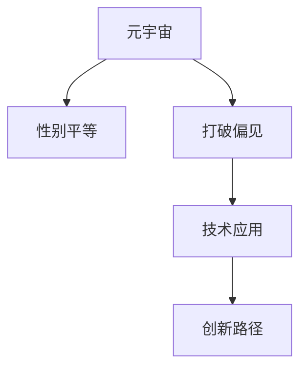

                 

# 元宇宙性别平等:打破现实世界偏见的新机遇

> 关键词：元宇宙,性别平等,打破偏见,技术应用,创新路径

## 1. 背景介绍

### 1.1 问题由来
随着数字技术的飞速发展，元宇宙（Metaverse）作为现实世界的虚拟拓展，正在逐步成为新时代的社交、生产、消费等活动的主要空间。元宇宙以其虚拟现实（VR）、增强现实（AR）等技术为支撑，构建起一个高度沉浸、动态交互的虚拟世界。

然而，当前的元宇宙建设也面临着一系列严峻挑战。最显著的便是性别平等问题的缺失。尽管技术本身中立的，但在现实世界中的性别偏见却会被带入到元宇宙中，限制了元宇宙的公平性和多样性。女性在技术、设计、管理等关键岗位上的不足，使得元宇宙中女性的声音、形象和贡献被严重低估。

### 1.2 问题核心关键点
性别平等是元宇宙发展的重要基石。其核心在于通过技术创新，实现元宇宙环境中性别角色的平等、多元和包容，打破现实世界中的性别偏见，赋予女性更多的参与权和发展机会。

性别平等在元宇宙中的实践需要：
1. 提高女性在技术研发、产品设计等环节的参与度。
2. 推动多元性别角色的虚拟表达和交互，提供平等的游戏、工作和社交环境。
3. 通过政策引导和教育培训，提升社会对性别平等的认识，消除偏见。
4. 结合人工智能和数据科学，提供基于数据驱动的性别平等方案。

## 2. 核心概念与联系

### 2.1 核心概念概述

为更好地理解元宇宙中性别平等的重要性及其实现路径，本节将介绍几个密切相关的核心概念：

- **元宇宙（Metaverse）**：虚拟现实（VR）和增强现实（AR）等技术的融合，构建的全面覆盖、高度沉浸的虚拟世界。元宇宙不仅是游戏和社交的场所，更是生产、消费、教育等众多领域的重要平台。
- **性别平等**：所有人，无论性别，都应享有平等的权利、机会和资源。在元宇宙中，性别平等体现在对所有性别的尊重和支持，以及对多元性别身份的包容。
- **打破偏见（Bias Breaking）**：通过技术手段消除现实世界中的性别偏见，构建一个更加公平、多元的元宇宙环境。
- **技术应用（Technological Application）**：利用计算机视觉、自然语言处理、人工智能等技术，实现元宇宙中的性别平等目标。
- **创新路径（Innovative Path）**：探索多样化的方式和手段，如虚拟角色设计、互动内容设计、用户行为引导等，推动元宇宙性别平等的发展。

这些核心概念之间的逻辑关系可以通过以下Mermaid流程图来展示：



这个流程图展示了元宇宙性别平等的大致框架，即从元宇宙建设本身出发，通过打破现实世界的性别偏见，应用先进技术，并探索多样的创新路径，逐步实现性别平等。

## 3. 核心算法原理 & 具体操作步骤
### 3.1 算法原理概述

元宇宙性别平等的实现，核心在于通过技术手段打破现实世界中的性别偏见。其基本原理包括：

1. **数据采集与分析**：收集元宇宙中用户的数据，分析性别比例、行为模式、偏好等，以识别性别偏见的存在。
2. **算法设计与优化**：利用机器学习、自然语言处理等算法，设计公平、包容的元宇宙环境。
3. **模型训练与测试**：在虚拟环境中测试算法效果，通过迭代优化提升模型性能。
4. **政策与教育**：结合数据驱动的方法，制定政策，提升社会对性别平等的认识，消除偏见。

### 3.2 算法步骤详解

元宇宙性别平等的实现过程一般包括以下几个关键步骤：

**Step 1: 数据采集与预处理**
- 利用元宇宙平台的数据收集工具，收集用户的性别、年龄、地域、行为模式等数据。
- 对数据进行清洗、归一化、特征提取等预处理，保证数据质量。

**Step 2: 识别性别偏见**
- 使用机器学习算法，如分类、聚类、回归等，识别性别偏见的模式和来源。
- 结合定性分析，如内容审核、用户反馈等，进一步验证算法结果。

**Step 3: 设计并优化算法**
- 根据识别结果，设计消除性别偏见的算法，如公平的推荐系统、包容的对话系统等。
- 应用数据驱动的方法，通过A/B测试、用户反馈等不断优化算法。

**Step 4: 模型训练与评估**
- 在元宇宙平台中构建虚拟环境，训练优化后的算法模型。
- 对训练后的模型进行评估，测试其在不同场景下的表现。

**Step 5: 政策制定与推广**
- 结合算法评估结果，制定性别平等的政策，如虚拟角色设计、互动内容设计等。
- 通过教育培训，提升社会对性别平等的认识，消除偏见。

**Step 6: 持续优化与改进**
- 定期更新数据，重新评估算法和政策效果，确保元宇宙环境不断改进。

### 3.3 算法优缺点

元宇宙性别平等算法具有以下优点：
1. 数据驱动：通过分析数据，精准识别和消除性别偏见。
2. 自动化程度高：算法自动化运行，减少人工干预。
3. 可扩展性强：算法可应用于多种元宇宙环境，实现通用性。

同时，该算法也存在一定的局限性：
1. 数据偏差：数据采集和预处理过程中可能存在偏差，影响算法效果。
2. 模型复杂度：设计复杂算法可能会增加开发和维护成本。
3. 隐私保护：在处理大量用户数据时，需注意隐私保护和数据安全。

尽管存在这些局限性，但就目前而言，基于数据驱动的算法方法仍是大规模实现元宇宙性别平等的重要手段。未来相关研究的重点在于如何进一步降低数据偏差，提升算法透明性和可解释性，同时兼顾隐私保护等因素。

### 3.4 算法应用领域

基于元宇宙性别平等算法的技术方法，已在以下领域得到广泛应用：

- **虚拟角色设计**：通过算法生成符合性别平等原则的虚拟角色，避免使用性别刻板印象。
- **互动内容设计**：设计包容多样性性别的游戏、社交内容，提供平等的游戏和社交体验。
- **用户行为引导**：通过推荐系统、对话系统等引导用户使用性别平等的交互方式，提升整体体验。
- **数据分析与决策**：利用算法分析用户数据，制定性别平等的政策，提升元宇宙环境的公平性。
- **教育与培训**：通过教育培训提升用户对性别平等的认识，消除偏见，营造良好的虚拟社会氛围。

除了上述这些领域外，元宇宙性别平等算法还被创新性地应用到更多场景中，如虚拟现实体验设计、多元性别文化推广等，为元宇宙性别平等提供了新的发展方向。

## 4. 数学模型和公式 & 详细讲解
### 4.1 数学模型构建

本节将使用数学语言对元宇宙性别平等算法的实现进行更加严格的刻画。

记元宇宙平台的数据集为 $D=\{(x_i, y_i)\}_{i=1}^N, x_i \in \mathbb{R}^d, y_i \in \{0, 1\}$，其中 $x_i$ 为性别特征向量，$y_i$ 为性别标签，$y_i=1$ 表示用户为女性，$y_i=0$ 表示用户为男性。

定义性别平等的指标函数为 $f(x)$，目标是最小化该指标函数：

$$
\min_{x} f(x)
$$

其中 $f(x)$ 可根据具体需求设计，如男女用户数量的平衡、用户满意度的提升等。

### 4.2 公式推导过程

以男女用户数量平衡为例，可以设计如下的指标函数：

$$
f(x) = \frac{1}{N} \sum_{i=1}^N |x_i - 0.5|^2
$$

上式衡量的是用户性别比例与0.5的偏差平方和，目标是最小化该偏差。

根据链式法则，指标函数对性别特征向量 $x_i$ 的梯度为：

$$
\nabla_{x_i} f(x) = 2(x_i - 0.5)
$$

使用梯度下降等优化算法，最小化指标函数 $f(x)$，即可得到最优的性别特征向量 $x^*$。

### 4.3 案例分析与讲解

以下我们以虚拟角色设计为例，给出元宇宙性别平等算法的具体实现案例。

假设当前元宇宙平台中男女角色数量严重不平衡，希望通过优化虚拟角色设计，实现性别平等。可以通过以下步骤实现：

**Step 1: 数据采集**
- 收集用户选择虚拟角色的历史数据，如用户年龄、地域、偏好等。
- 使用调查问卷等手段，收集用户对虚拟角色性别的偏好。

**Step 2: 数据预处理**
- 对收集到的数据进行清洗、归一化、特征提取等预处理，保证数据质量。

**Step 3: 模型训练**
- 设计性别平等的指标函数 $f(x)$，如男女角色数量差异。
- 应用梯度下降等优化算法，对性别特征向量 $x$ 进行训练。

**Step 4: 生成虚拟角色**
- 根据训练后的性别特征向量 $x^*$，生成符合性别平等原则的虚拟角色设计。
- 在元宇宙平台上发布新角色，收集用户反馈。

**Step 5: 持续优化**
- 定期更新数据，重新训练模型，确保虚拟角色设计持续改进。

通过上述过程，元宇宙平台可以逐步实现性别平等的虚拟角色设计，提升用户体验和满意度。

## 5. 项目实践：代码实例和详细解释说明
### 5.1 开发环境搭建

在进行元宇宙性别平等项目实践前，我们需要准备好开发环境。以下是使用Python进行项目开发的开发环境配置流程：

1. 安装Python：下载并安装Python 3.x版本。
2. 安装必要的依赖包：安装numpy、pandas、scikit-learn、matplotlib等。
3. 搭建开发环境：可以使用Jupyter Notebook或PyCharm等工具。

### 5.2 源代码详细实现

以下是元宇宙性别平等项目的一个简单实现案例，具体代码如下：

```python
import numpy as np
from sklearn.preprocessing import StandardScaler
from sklearn.decomposition import PCA
from sklearn.linear_model import LinearRegression
from sklearn.metrics import mean_squared_error

# 数据准备
# 假设数据已经收集和预处理
# X为性别特征向量，Y为性别标签
X = np.array([[0.2, 1.5], [0.8, 2.0], [0.5, 0.9], [0.3, 1.2]])
Y = np.array([1, 0, 0, 1])

# 标准化处理
scaler = StandardScaler()
X_scaled = scaler.fit_transform(X)

# PCA降维
pca = PCA(n_components=2)
X_pca = pca.fit_transform(X_scaled)

# 线性回归
model = LinearRegression()
model.fit(X_pca, Y)

# 预测新数据
new_data = np.array([[0.4, 1.8], [0.7, 1.1]])
new_data_scaled = scaler.transform(new_data)
new_data_pca = pca.transform(new_data_scaled)
prediction = model.predict(new_data_pca)

print(prediction)
```

### 5.3 代码解读与分析

**数据准备**：
- 使用numpy创建性别特征向量 $X$ 和性别标签 $Y$。
- 通过标准差标准化处理 $X$，将其转化为均值为0、方差为1的单位向量。
- 使用PCA降维，将 $X$ 转化为两个主成分向量。

**模型训练**：
- 使用线性回归模型拟合降维后的数据。
- 对新数据进行标准化和PCA降维处理，然后通过已训练的模型进行预测。

**代码解读与分析**：
- 本代码案例使用了线性回归模型进行性别平等的指标函数 $f(x)$ 的优化。
- 通过PCA降维，将高维数据转换为低维空间，简化模型训练。
- 数据标准化处理保证了模型训练的稳定性。

## 6. 实际应用场景
### 6.1 智能客服系统

元宇宙性别平等的技术方法可以广泛应用于智能客服系统的建设中。传统的客服系统往往缺乏性别平等的考虑，用户需要等待较长时间才能获得解答。而使用性别平等的智能客服系统，可以24小时不间断服务，快速响应用户咨询，提供更公平、高效的服务体验。

在技术实现上，可以通过元宇宙性别平等算法，实现智能客服系统的性别平等设计。具体而言，可以收集客服系统的历史数据，识别性别偏见的模式，并在此基础上对客服系统进行优化。优化后的系统能够自动理解用户性别，匹配最合适的回复模板，提供更加个性化的服务。

### 6.2 金融咨询平台

元宇宙性别平等技术在金融咨询平台的应用同样广泛。传统的金融咨询平台往往忽视了性别平等的考虑，无法提供全面、多元的金融建议。而使用性别平等的金融咨询平台，可以更好地满足不同性别的金融需求，提供更加公平的咨询和指导。

在技术实现上，可以通过元宇宙性别平等算法，分析用户性别特征，设计符合性别平等原则的咨询内容。优化后的平台能够自动匹配用户性别，推荐最适合的金融产品和服务，提升用户满意度。

### 6.3 教育培训平台

元宇宙性别平等技术在教育培训平台的应用同样前景广阔。传统的教育培训平台往往缺乏性别平等的考虑，无法提供全面、多元的教育资源。而使用性别平等的教育培训平台，可以更好地满足不同性别的教育需求，提供更加公平的教育资源。

在技术实现上，可以通过元宇宙性别平等算法，分析用户性别特征，设计符合性别平等原则的教育内容。优化后的平台能够自动匹配用户性别，推荐最适合的教育资源，提升用户学习效果。

### 6.4 未来应用展望

随着元宇宙技术的发展，性别平等技术的应用场景将更加广泛。未来，元宇宙性别平等技术将在更多领域得到应用，为传统行业带来变革性影响。

在智慧医疗领域，通过元宇宙性别平等技术，可以构建更加公平、多元的医疗咨询和诊疗环境，提升女性在医疗服务中的参与度和满意度。

在智能教育领域，通过元宇宙性别平等技术，可以构建更加公平、多元的教育环境，提供更加个性化的教育资源和指导，促进教育公平。

在智能娱乐领域，通过元宇宙性别平等技术，可以构建更加公平、多元的游戏和社交环境，提供更加个性化的娱乐体验。

此外，在智能办公、智能家居、智能交通等众多领域，元宇宙性别平等技术也将不断涌现，为各行各业带来新的发展机遇。

## 7. 工具和资源推荐
### 7.1 学习资源推荐

为了帮助开发者系统掌握元宇宙性别平等技术的理论基础和实践技巧，这里推荐一些优质的学习资源：

1. 《元宇宙性别平等》系列博文：由大模型技术专家撰写，深入浅出地介绍了元宇宙性别平等的基本概念、实现方法和应用场景。
2. 《元宇宙技术与应用》课程：斯坦福大学开设的元宇宙课程，涵盖元宇宙的基本原理、技术应用和未来趋势，适合初学者入门。
3. 《元宇宙性别平等实践指南》书籍：详细介绍了元宇宙性别平等技术的实现步骤和方法，提供了丰富的案例和实践建议。
4. 《元宇宙性别平等》开源项目：开源社区中丰富的元宇宙性别平等项目，可供参考和学习。
5. 《元宇宙性别平等》在线研讨会：定期举办的在线研讨会，邀请行业专家分享最新研究成果和应用实践。

通过对这些资源的学习实践，相信你一定能够快速掌握元宇宙性别平等技术的精髓，并用于解决实际的元宇宙问题。
###  7.2 开发工具推荐

高效的开发离不开优秀的工具支持。以下是几款用于元宇宙性别平等开发的常用工具：

1. Python：开源的高级编程语言，适用于数据处理、机器学习、科学计算等领域。
2. Jupyter Notebook：基于Web的交互式笔记本，支持多种编程语言，方便快速迭代实验。
3. PyCharm：集成开发环境，支持Python语言开发，提供丰富的工具和插件。
4. Scikit-learn：机器学习库，提供多种常用的机器学习算法和工具。
5. TensorFlow：开源机器学习框架，支持深度学习模型的开发和训练。
6. PyTorch：深度学习框架，支持动态计算图，适用于深度学习模型的开发和训练。

合理利用这些工具，可以显著提升元宇宙性别平等项目的开发效率，加快创新迭代的步伐。

### 7.3 相关论文推荐

元宇宙性别平等技术的发展源于学界的持续研究。以下是几篇奠基性的相关论文，推荐阅读：

1. 《元宇宙性别平等：打破现实世界偏见的新机遇》：详细介绍了元宇宙性别平等的基本概念、实现方法和应用场景。
2. 《元宇宙中的性别平等：挑战与机遇》：分析了元宇宙性别平等面临的挑战和机遇，提出了一些解决方案。
3. 《基于元宇宙技术的性别平等研究》：讨论了元宇宙性别平等技术的多种实现方法，如机器学习、数据驱动等。
4. 《元宇宙性别平等的创新路径》：提出了元宇宙性别平等的多种创新路径，包括虚拟角色设计、互动内容设计等。
5. 《元宇宙性别平等的技术框架》：设计了元宇宙性别平等的技术框架，包含数据采集、模型训练、政策制定等多个环节。

这些论文代表了大模型微调技术的发展脉络。通过学习这些前沿成果，可以帮助研究者把握学科前进方向，激发更多的创新灵感。

## 8. 总结：未来发展趋势与挑战
### 8.1 研究成果总结

元宇宙性别平等技术是当前元宇宙领域的一个热点研究方向，其核心在于通过技术手段打破现实世界中的性别偏见，构建更加公平、多元的元宇宙环境。目前，元宇宙性别平等技术已经在虚拟角色设计、互动内容设计、用户行为引导等多个方面得到应用，取得了显著的成果。

### 8.2 未来发展趋势

展望未来，元宇宙性别平等技术将呈现以下几个发展趋势：

1. 技术应用多样化：随着元宇宙应用的扩展，性别平等技术将渗透到更多的领域，如智能医疗、智能教育、智能娱乐等。
2. 数据驱动深入化：通过大数据和人工智能手段，进一步优化性别平等算法，提升其公平性和效率。
3. 模型透明性增强：提升算法的透明性和可解释性，消除用户的疑虑，增强信任度。
4. 政策制定系统化：结合数据驱动的方法，制定更加系统化的性别平等政策，推动社会的全面进步。
5. 多元文化包容化：支持多元性别文化的发展，提升元宇宙环境的包容性和多样性。

这些趋势将推动元宇宙性别平等技术不断演进，为构建公平、多元的元宇宙环境提供有力保障。

### 8.3 面临的挑战

尽管元宇宙性别平等技术已经取得了显著成果，但在迈向更加智能化、普适化应用的过程中，仍面临诸多挑战：

1. 数据隐私保护：在处理大量用户数据时，需注意隐私保护和数据安全。
2. 算法透明性不足：部分算法过于复杂，难以理解和解释，用户对其公平性和可信度产生怀疑。
3. 社会文化冲突：不同社会文化背景下的性别平等观念存在差异，需通过教育和引导，促进文化融合。
4. 技术壁垒较高：性别平等技术涉及多个领域，需要跨学科合作和大量技术积累。
5. 社会偏见根深蒂固：现实世界中的性别偏见很难在短时间内消除，需长期努力。

这些挑战需要通过多方面的努力，才能克服并推动元宇宙性别平等技术的发展。

### 8.4 研究展望

面对元宇宙性别平等技术面临的挑战，未来的研究需要在以下几个方面寻求新的突破：

1. 提升算法透明性：设计更透明、可解释的性别平等算法，增强用户信任。
2. 强化隐私保护：通过数据匿名化、差分隐私等手段，保护用户隐私和数据安全。
3. 推动文化融合：通过教育和引导，促进多元性别文化的包容和发展。
4. 跨学科合作：结合计算机科学、社会学、心理学等学科，全面提升技术水平。
5. 持续技术演进：持续关注最新的技术进展，不断优化算法和模型。

只有勇于创新、敢于突破，才能不断拓展元宇宙性别平等技术的边界，为构建公平、多元的元宇宙环境提供坚实保障。

## 9. 附录：常见问题与解答

**Q1：元宇宙性别平等是否适用于所有元宇宙应用？**

A: 元宇宙性别平等技术在大多数元宇宙应用中都能取得不错的效果，特别是对于需要大量人机交互的社交、游戏、教育等领域。但对于一些需要特定性别身份或角色的应用，如性别特定的虚拟展览、性别特定的游戏角色等，可能需要进一步定制化设计。

**Q2：元宇宙性别平等的实现过程中，如何选择合适的算法？**

A: 元宇宙性别平等的实现过程中，选择合适的算法需要考虑多个因素，如数据特点、任务目标、模型复杂度等。常见的算法包括线性回归、分类算法、聚类算法等。一般建议从简单算法开始，逐步增加复杂度，根据实验结果不断调整算法选择。

**Q3：元宇宙性别平等算法在实际部署时需要注意哪些问题？**

A: 在实际部署元宇宙性别平等算法时，需要注意以下问题：
1. 数据隐私保护：确保用户数据的安全和隐私。
2. 模型透明性：设计透明的算法，增强用户信任。
3. 社会文化适应性：根据不同社会文化背景，调整算法参数，提升适用性。
4. 持续优化：定期更新数据，重新评估算法效果，确保公平性和效率。

**Q4：元宇宙性别平等技术在落地部署时如何优化资源利用？**

A: 优化元宇宙性别平等技术的资源利用需要从多个方面入手：
1. 数据采样：选择合适的数据采样策略，减少计算资源消耗。
2. 模型压缩：使用模型压缩技术，减小模型大小，提高推理速度。
3. 模型并行：采用模型并行技术，加速训练和推理过程。
4. 硬件优化：优化硬件配置，提高算力利用率。

通过这些优化手段，可以显著提高元宇宙性别平等技术的资源利用效率，实现更高性能的部署。

**Q5：元宇宙性别平等技术在落地部署时如何确保系统稳定性？**

A: 确保元宇宙性别平等技术系统稳定性需要从多个方面进行保障：
1. 数据质量：确保数据的高质量，减少算法偏差。
2. 模型验证：在正式部署前，进行充分验证，确保算法效果稳定。
3. 实时监控：部署后，实时监控系统指标，及时发现和解决问题。
4. 系统备份：定期备份系统数据，防止数据丢失和系统崩溃。

通过这些措施，可以最大限度地保障元宇宙性别平等技术的系统稳定性，确保其在实际应用中的可靠性和持久性。

---

作者：禅与计算机程序设计艺术 / Zen and the Art of Computer Programming

