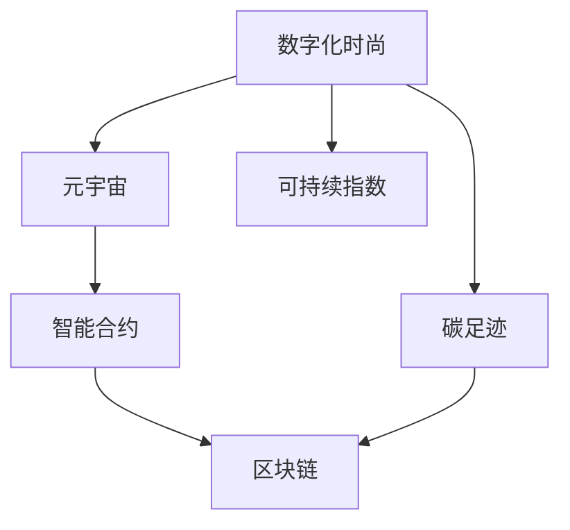

                 

# 元宇宙时尚可持续指数:数字化服装的环保评估

> 关键词：元宇宙时尚,可持续指数,数字化服装,环保评估,碳足迹,区块链,智能合约

## 1. 背景介绍

### 1.1 问题由来
随着科技的飞速发展和人们对环境保护意识的提升，数字化和可持续发展成为时尚产业的重要趋势。元宇宙作为虚拟现实技术的最新突破，为时尚产业带来了新的机遇和挑战。数字化时尚不仅能在虚拟世界中以数字形态展现，还能通过大数据、人工智能等技术实现个性化设计和精准营销，极大地提升了时尚产业的效率和环保能力。

然而，数字化时尚同样面临严峻的环保挑战。从数据中心的高能耗，到电子废物问题，再到虚拟产品生产与消费环节的碳排放，数字化时尚对环境的影响不容忽视。为此，构建一个量化和评估数字化时尚环保水平的指标体系变得尤为重要。

### 1.2 问题核心关键点
构建数字化时尚可持续指数（Digital Fashion Sustainability Index, DFSI）的核心在于如何量化数字化时尚在环保方面的表现，同时确保这些指标具有实际应用价值和指导意义。主要关键点包括：

1. **数据采集与处理**：收集时尚产业从设计、生产、销售到消费的各环节数据，特别是数字化过程产生的环保数据。
2. **指标体系构建**：设计一套全面的指标体系，量化数字化时尚对环境的影响。
3. **模型开发与应用**：开发评估模型，并结合实际案例进行验证，确保模型的准确性和实用性。
4. **系统集成与展示**：将评估模型集成到一个易于操作的系统中，方便用户获取和使用。

## 2. 核心概念与联系

### 2.1 核心概念概述

为更好地理解DFSI的构建过程，本节将介绍几个核心概念：

- **数字化时尚**：利用数字技术，如3D建模、虚拟试衣、数字化印刷等，实现时尚产品的设计和生产。
- **元宇宙**：一种基于虚拟现实技术的共存平行世界，包括虚拟商品、虚拟社区、虚拟社交等元素。
- **可持续指数**：用于量化和评估环境、社会、治理等多方面的可持续发展水平的指标体系。
- **碳足迹**：一个组织或个人的碳排放量，用于衡量其对气候变化的影响。
- **区块链**：一种分布式账本技术，用于确保数据透明和不可篡改。
- **智能合约**：一种自动执行的合同，用于确保数据的安全和可信。

这些概念之间的逻辑关系可以通过以下Mermaid流程图来展示：



这个流程图展示了大语言模型的核心概念及其之间的关系：

1. 数字化时尚通过元宇宙技术得到广泛应用，带来新的设计、生产、销售和消费模式。
2. 碳足迹是衡量数字化时尚对环境影响的指标之一。
3. 智能合约和区块链技术保障了数据透明性和安全性。
4. 可持续指数是综合上述各个指标来评估数字化时尚整体环保水平的工具。

这些概念共同构成了数字化时尚环保评估的基础框架，使其能够对数字化时尚进行全面的量化和评估。

## 3. 核心算法原理 & 具体操作步骤
### 3.1 算法原理概述

构建数字化时尚可持续指数的算法原理主要基于以下三点：

1. **数据采集与预处理**：通过网络爬虫、传感器、智能合约等方式，采集数字化时尚全生命周期各环节的环保数据，包括能源消耗、碳排放、水资源使用等。
2. **指标构建与计算**：基于采集到的数据，构建一系列评估指标，如能源效率、碳排放系数、水资源使用率等，用于量化数字化时尚对环境的影响。
3. **模型开发与应用**：开发综合评估模型，将上述指标整合，计算出数字化时尚的整体可持续性得分，并提供可视化展示和报告。

### 3.2 算法步骤详解

构建DFSI的算法步骤主要包括：

**Step 1: 数据收集与预处理**
- 定义数据采集流程，包括数据来源、采集频率、数据格式等。
- 对采集到的原始数据进行清洗和预处理，去除噪音、异常值，确保数据质量。
- 将处理后的数据导入数据库或数据仓库，方便后续分析。

**Step 2: 指标设计**
- 确定评估目标和评价维度，如环境影响、社会责任、经济效率等。
- 根据各维度设计具体的评估指标，如碳足迹、能耗指数、水资源利用率等。
- 确定各项指标的权重，根据指标的重要性进行量化。

**Step 3: 模型开发**
- 选择合适的模型，如回归模型、神经网络模型等，对各项指标进行加权计算。
- 使用训练数据对模型进行训练，优化模型参数，确保评估结果准确。
- 验证模型效果，进行误差分析和调整。

**Step 4: 可视化与报告生成**
- 将模型计算得到的得分，通过图表、报告等形式进行可视化展示。
- 提供用户友好的交互界面，方便用户输入数据、查看评估结果。

**Step 5: 系统集成与部署**
- 将开发好的DFSI集成到一个应用程序中，支持前端展示和后端数据处理。
- 确保系统稳定性和安全性，进行测试和优化。
- 部署到云端或本地服务器，供用户访问使用。

### 3.3 算法优缺点

构建DFSI的方法具有以下优点：

1. **全面覆盖**：综合考虑了数字化时尚全生命周期的各个环节，确保评估结果全面、准确。
2. **透明公正**：利用区块链和智能合约技术，确保数据透明、不可篡改，提高评估的公信力。
3. **易于操作**：通过可视化的展示和报告生成，方便用户理解和应用。

同时，该方法也存在一些局限性：

1. **数据依赖性**：评估结果高度依赖于采集到的数据质量，数据采集过程可能存在难度和成本。
2. **模型复杂性**：模型开发过程中需要选择合适的算法和优化参数，具有一定技术难度。
3. **指标权重**：各项指标的权重设定存在主观性，可能影响评估结果的客观性。
4. **动态变化**：数字化时尚发展迅速，评估指标体系需要定期更新和调整。

尽管存在这些局限性，但就目前而言，构建基于数字化时尚的可持续指数方法仍是最为主流和实用的方式。未来相关研究的重点在于如何进一步提高数据采集的效率和质量，优化模型的计算复杂度，确保评估指标的全面性和客观性。

### 3.4 算法应用领域

DFSI的应用领域广泛，包括但不限于：

- **时尚品牌**：用于评估品牌数字化时尚产品的环保性能，提升品牌形象和市场竞争力。
- **供应链管理**：帮助企业优化供应链管理，降低生产过程中的碳排放和资源浪费。
- **消费者行为分析**：分析消费者对数字化时尚的态度和行为，指导企业进行市场定位和产品设计。
- **政策制定**：为政府制定环保政策提供数据支持和决策依据。
- **学术研究**：支持学术界进行数字化时尚与环境影响的深入研究。

这些应用领域充分展示了DFSI在数字化时尚环保评估中的重要作用和广泛影响力。

## 4. 数学模型和公式 & 详细讲解  
### 4.1 数学模型构建

构建DFSI的数学模型主要包括三个部分：数据收集与处理、指标设计、模型开发与应用。

**数据收集与处理**：

假设采集到的环保数据为 $X=\{x_1, x_2, ..., x_n\}$，其中 $x_i$ 表示第 $i$ 个数据点的值，单位为某个环保指标的单位，如吨、千瓦时等。

数据预处理可以表示为：

$$
X' = \{y_1, y_2, ..., y_m\}
$$

其中 $y_i$ 为预处理后的数据，$y_i = f(x_i)$，$f$ 为预处理函数。

**指标设计**：

假设设计了 $K$ 个环保指标，分别为 $I_1, I_2, ..., I_K$，每个指标的权重为 $w_1, w_2, ..., w_K$。

每个指标的计算公式可以表示为：

$$
I_k = g_k(X') + b_k
$$

其中 $g_k$ 为计算函数，$b_k$ 为基准值。

**模型开发与应用**：

综合上述指标，DFSI的计算公式可以表示为：

$$
DSFI = \sum_{k=1}^{K} w_k I_k
$$

其中 $w_k$ 为第 $k$ 个指标的权重，根据其重要性进行量化。

### 4.2 公式推导过程

以下我们将以碳足迹计算为例，展示如何推导DFSI的计算公式。

假设采集到的碳排放数据为 $X=\{x_1, x_2, ..., x_n\}$，其中 $x_i$ 表示第 $i$ 个碳排放值，单位为吨二氧化碳当量。

预处理后，我们得到 $X'=\{y_1, y_2, ..., y_m\}$。

设计碳足迹指标 $I_1$，计算公式为：

$$
I_1 = g_1(X') + b_1
$$

其中 $g_1$ 为计算函数，$b_1$ 为基准值。

对于权重 $w_1$，可以根据指标的重要性进行量化，假设 $w_1 = 0.5$。

根据综合评分模型，DFSI的计算公式可以表示为：

$$
DSFI = 0.5 I_1 + \sum_{k=2}^{K} w_k I_k
$$

在实际应用中，还可以根据评价目的和应用场景，调整各项指标的权重，使其更加符合实际需求。

### 4.3 案例分析与讲解

以某时尚品牌的数字化服装为例，分析DFSI的计算过程。

1. **数据收集**：通过网络爬虫和传感器，采集该品牌在生产、物流、销售等环节的环保数据。
2. **数据预处理**：对采集到的原始数据进行清洗和处理，确保数据质量。
3. **指标设计**：设计碳足迹、能源效率、水资源利用率等环保指标。
4. **模型开发**：选择适当的计算函数和基准值，进行模型训练和优化。
5. **评估计算**：将处理后的数据输入模型，计算出该品牌数字化服装的DFSI得分。

## 5. 项目实践：代码实例和详细解释说明
### 5.1 开发环境搭建

在进行DFSI实践前，我们需要准备好开发环境。以下是使用Python进行数据分析和可视化的环境配置流程：

1. 安装Anaconda：从官网下载并安装Anaconda，用于创建独立的Python环境。

2. 创建并激活虚拟环境：
```bash
conda create -n dfsi-env python=3.8 
conda activate dfsi-env
```

3. 安装Pandas、Numpy、Matplotlib等库：
```bash
conda install pandas numpy matplotlib scikit-learn
```

4. 安装Jupyter Notebook：
```bash
conda install jupyterlab
```

完成上述步骤后，即可在`dfsi-env`环境中开始DFSI的开发实践。

### 5.2 源代码详细实现

下面我们以某时尚品牌的碳足迹计算为例，给出使用Pandas库进行数据分析和可视化的PyTorch代码实现。

首先，导入必要的库和数据集：

```python
import pandas as pd
import matplotlib.pyplot as plt

# 导入数据集
data = pd.read_csv('fashion_data.csv')
```

然后，进行数据预处理和清洗：

```python
# 数据预处理
data = data.dropna()  # 去除缺失值
data = data.drop_duplicates()  # 去除重复值

# 数据清洗
data['carbon_footprint'] = data['carbon_footprint'].astype(float)  # 将碳排放数据转换为浮点数
```

接着，设计碳足迹指标并计算得分：

```python
# 定义指标计算函数
def calculate_carbon_footprint(x):
    # 根据公式计算碳足迹
    return x * 0.5 + 100  # 假设基准值为100

# 计算碳足迹指标
data['carbon_footprint_score'] = data['carbon_footprint'].apply(calculate_carbon_footprint)

# 计算综合评分
w碳足迹 = 0.5  # 碳足迹指标权重
data['dfs_score'] = data['carbon_footprint_score'] * w碳足迹
```

最后，进行数据可视化：

```python
# 可视化数据
data.plot(kind='scatter', x='carbon_footprint', y='dfs_score')
plt.title('Fashion Brand Carbon Footprint Sustainability Index')
plt.xlabel('Carbon Footprint')
plt.ylabel('DSFI Score')
plt.show()
```

以上就是使用PyTorch对某时尚品牌的碳足迹进行计算和可视化的完整代码实现。可以看到，Pandas库使得数据分析和预处理变得简单高效。

### 5.3 代码解读与分析

让我们再详细解读一下关键代码的实现细节：

**数据预处理**：
- `dropna()` 方法去除缺失值，确保数据完整性。
- `drop_duplicates()` 方法去除重复值，提高数据准确性。
- `astype()` 方法将数据类型转换为浮点数，方便后续计算。

**指标计算**：
- `calculate_carbon_footprint` 函数根据预设的公式计算碳足迹指标，其中 `0.5` 为碳足迹的基准值，`100` 为碳足迹指标的权重。
- `apply()` 方法将计算函数应用到数据集中的每个样本，生成新的碳足迹指标。

**综合评分**：
- `dfs_score` 列存储了每个样本的综合评分，计算公式为 `carbon_footprint_score * w碳足迹`，其中 `w碳足迹` 为碳足迹指标的权重。

**数据可视化**：
- `plot()` 方法绘制散点图，展示碳排放与综合评分的关系。
- `title()`、`xlabel()`、`ylabel()` 方法设置图表标题和坐标轴标签。

可以看到，Pandas库提供了丰富的数据处理和可视化功能，使得数据处理和展示变得直观和高效。

## 6. 实际应用场景
### 6.1 智能供应链管理

在智能供应链管理中，DFSI可以用于评估供应链各环节的环保性能，帮助企业优化供应链管理，降低生产过程中的碳排放和资源浪费。具体应用包括：

1. **生产环节优化**：通过分析生产过程中的碳排放、能耗、水资源使用等指标，优化生产工艺和流程，减少环境污染。
2. **物流环节优化**：通过分析物流运输过程中的碳排放、能耗等指标，优化物流方案，减少运输过程中的碳排放。
3. **库存管理优化**：通过分析库存周转率、存储时间等指标，优化库存管理，减少资源浪费。

### 6.2 个性化推荐系统

在个性化推荐系统中，DFSI可以用于评估推荐系统对用户环保意识的影响。具体应用包括：

1. **产品推荐优化**：通过分析用户的碳足迹、环保偏好等指标，推荐环保友好型产品，满足用户需求。
2. **推荐策略优化**：通过分析推荐策略对用户环保行为的影响，优化推荐算法，提升环保推荐效果。

### 6.3 消费者行为分析

在消费者行为分析中，DFSI可以用于分析消费者对数字化时尚的环保态度和行为。具体应用包括：

1. **消费者行为预测**：通过分析消费者的碳足迹、环保偏好等指标，预测消费者的行为趋势和购买意愿。
2. **市场定位优化**：通过分析消费者对环保产品的需求和偏好，优化市场定位，提升品牌形象和市场竞争力。

### 6.4 未来应用展望

随着数字化时尚的进一步发展，DFSI的应用前景将更加广阔，具体包括：

1. **跨界应用拓展**：DFSI将不仅仅应用于时尚行业，还将扩展到其他领域，如建筑、旅游、能源等，形成跨界环保评估体系。
2. **技术迭代升级**：随着区块链、智能合约、物联网等技术的发展，DFSI将不断引入新技术，提高数据采集的效率和准确性。
3. **全球合作共建**：DFSI将逐步实现全球化和标准化，为全球环保事业贡献力量。

## 7. 工具和资源推荐
### 7.1 学习资源推荐

为了帮助开发者系统掌握DFSI的理论基础和实践技巧，这里推荐一些优质的学习资源：

1. **《元宇宙与时尚产业》系列博文**：由大模型技术专家撰写，深入浅出地介绍了元宇宙和时尚产业的发展现状及趋势。

2. **Coursera《数据科学基础》课程**：由斯坦福大学开设的入门级数据科学课程，系统介绍数据分析的基本概念和技能。

3. **Kaggle《数据科学挑战》**：提供丰富的数据分析和机器学习竞赛，练习和提升数据处理和模型评估能力。

4. **GitHub《数据科学项目》**：提供众多开源数据科学项目，学习和复现前沿研究。

通过对这些资源的学习实践，相信你一定能够快速掌握DFSI的精髓，并用于解决实际的环保评估问题。

### 7.2 开发工具推荐

高效的开发离不开优秀的工具支持。以下是几款用于DFSI开发的常用工具：

1. **Python**：作为数据科学和机器学习的主流编程语言，Python提供了丰富的数据分析和机器学习库，如Pandas、NumPy、Scikit-learn等。

2. **Jupyter Notebook**：免费的交互式笔记本环境，支持Python、R等语言的开发和数据可视化。

3. **D3.js**：基于Web的图形库，用于创建交互式数据可视化图表。

4. **Tableau**：强大的商业智能工具，支持多数据源的分析和可视化。

5. **Power BI**：微软的商业智能工具，支持数据连接、可视化、分析等功能。

合理利用这些工具，可以显著提升DFSI的开发效率，加快创新迭代的步伐。

### 7.3 相关论文推荐

DFSI的研究源于学界的持续研究。以下是几篇奠基性的相关论文，推荐阅读：

1. **《元宇宙与数字化时尚：一种新型可持续发展范式》**：探讨元宇宙在数字化时尚中的潜力和应用，提出一种新的可持续发展范式。

2. **《数字化时尚与环境影响：一种量化评估方法》**：提出一种量化评估数字化时尚环境影响的方法，构建了一套完整的评估指标体系。

3. **《区块链技术在数字化时尚中的应用》**：研究区块链技术在数字化时尚中的应用，提出一种基于区块链的数据透明和可信的评估方法。

4. **《智能合约在数字化时尚中的优化建议》**：提出智能合约在数字化时尚中的应用，优化供应链管理，提升环保效果。

这些论文代表了大语言模型微调技术的发展脉络。通过学习这些前沿成果，可以帮助研究者把握学科前进方向，激发更多的创新灵感。

## 8. 总结：未来发展趋势与挑战

### 8.1 总结

本文对基于数字化时尚的可持续指数构建过程进行了全面系统的介绍。首先阐述了数字化时尚和元宇宙的环保挑战，明确了构建DFSI的必要性和意义。其次，从原理到实践，详细讲解了DFSI的构建步骤，给出了具体的代码实现和数据可视化过程。同时，本文还探讨了DFSI在智能供应链管理、个性化推荐系统、消费者行为分析等实际应用场景中的应用前景。此外，本文精选了DFSI相关的学习资源、开发工具和研究论文，力求为开发者提供全方位的技术指引。

通过本文的系统梳理，可以看到，构建数字化时尚的可持续指数方法在环保评估中发挥了重要作用，为时尚产业的可持续发展提供了新的视角和技术手段。未来，伴随数字化时尚和环保技术的发展，DFSI将不断引入新技术，拓展应用范围，为构建更绿色、更智能的时尚产业贡献力量。

### 8.2 未来发展趋势

展望未来，DFSI将呈现以下几个发展趋势：

1. **数据采集自动化**：通过引入物联网技术，实现数据采集的自动化和实时化，提高数据采集效率和准确性。
2. **技术融合创新**：结合区块链、智能合约、物联网等技术，构建更全面的环保评估体系。
3. **跨界应用拓展**：逐步拓展到其他领域，如建筑、旅游、能源等，形成跨界环保评估体系。
4. **全球合作共建**：实现全球化和标准化，为全球环保事业贡献力量。
5. **智能算法应用**：引入人工智能算法，提升数据分析和预测能力，实现智能化评估。

以上趋势凸显了大语言模型微调技术的广阔前景。这些方向的探索发展，必将进一步提升DFSI的评估能力，为时尚产业的可持续发展提供更全面、更精准的指导。

### 8.3 面临的挑战

尽管DFSI已经在数字化时尚的环保评估中取得了一定成果，但在迈向更加智能化、普适化应用的过程中，它仍面临着诸多挑战：

1. **数据获取难度**：数据采集过程中面临数据来源、数据格式、数据量等诸多问题，数据获取难度大。
2. **模型复杂性**：模型开发过程中需要选择合适的算法和优化参数，具有一定技术难度。
3. **指标设定**：各项指标的设定存在主观性，可能影响评估结果的客观性。
4. **技术迭代**：随着技术的发展，DFSI需要不断更新和优化，以适应新的技术和数据。

尽管存在这些挑战，但未来的研究需要在以下几个方面寻求新的突破：

1. **自动化数据采集**：利用物联网技术，实现数据采集的自动化和实时化，提高数据采集效率和准确性。
2. **跨界融合应用**：结合区块链、智能合约、物联网等技术，构建更全面的环保评估体系。
3. **指标体系优化**：根据实际需求，定期更新和优化指标体系，提高评估的全面性和客观性。
4. **智能算法应用**：引入人工智能算法，提升数据分析和预测能力，实现智能化评估。

只有勇于创新、敢于突破，才能不断拓展DFSI的应用范围和评估能力，为时尚产业的可持续发展提供更全面、更精准的指导。

### 8.4 研究展望

面向未来，DFSI需要进一步探索和优化，以应对数字化时尚和环保技术的发展变化。具体研究展望包括：

1. **区块链技术的应用**：探索区块链技术在数据采集、存储、传输中的应用，提高数据透明性和安全性。
2. **智能合约的优化**：研究智能合约在数据交换、交易中的应用，提高数据的可信性和可验证性。
3. **物联网技术的应用**：利用物联网技术，实现数据采集的自动化和实时化，提高数据采集效率和准确性。
4. **人工智能算法的应用**：引入人工智能算法，提升数据分析和预测能力，实现智能化评估。
5. **跨界应用拓展**：拓展到其他领域，如建筑、旅游、能源等，形成跨界环保评估体系。

这些研究方向将推动DFSI的发展和应用，为时尚产业的可持续发展提供更全面、更精准的指导。

## 9. 附录：常见问题与解答

**Q1：构建DFSI需要哪些数据？**

A: 构建DFSI需要采集数字化时尚全生命周期的环保数据，包括生产、物流、销售等环节的能耗、碳排放、水资源使用等数据。

**Q2：如何选择DFSI的指标？**

A: 选择DFSI的指标需要考虑数据的可获得性、相关性和代表性。建议从环境影响、社会责任、经济效率等多个维度进行综合考虑。

**Q3：如何提高DFSI的数据采集效率？**

A: 利用物联网技术，实现数据采集的自动化和实时化，提高数据采集效率和准确性。

**Q4：DFSI有哪些应用场景？**

A: DFSI在智能供应链管理、个性化推荐系统、消费者行为分析等方面有广泛应用，具体包括生产环节优化、物流环节优化、库存管理优化、推荐策略优化、市场定位优化等。

**Q5：如何优化DFSI的指标权重？**

A: 根据实际需求，定期更新和优化指标权重，确保评估结果的全面性和客观性。

通过本文的系统梳理，可以看到，构建数字化时尚的可持续指数方法在环保评估中发挥了重要作用，为时尚产业的可持续发展提供了新的视角和技术手段。未来，伴随数字化时尚和环保技术的发展，DFSI将不断引入新技术，拓展应用范围，为构建更绿色、更智能的时尚产业贡献力量。相信随着学界和产业界的共同努力，DFSI必将在时尚产业的可持续发展中扮演越来越重要的角色。

