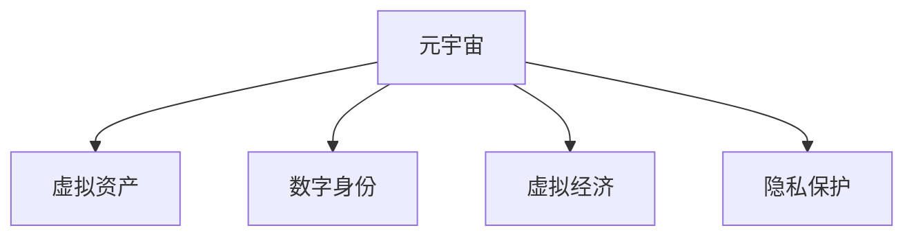
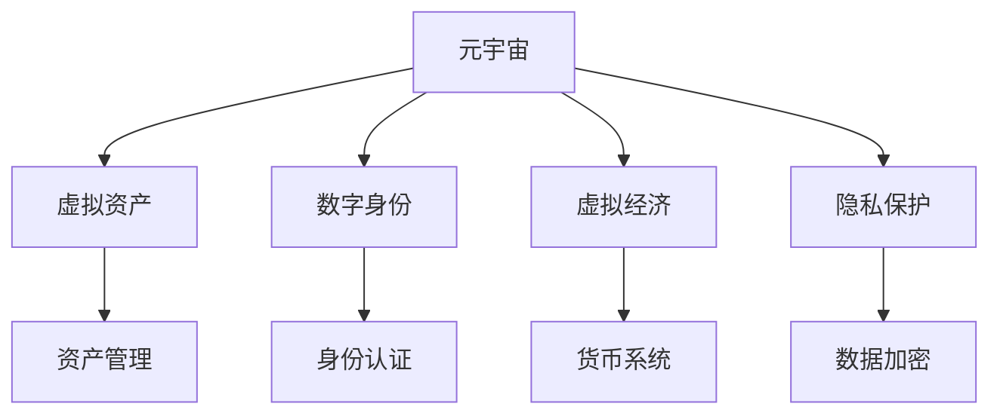

                 

# 元宇宙法律体系：虚拟世界的规则制定

> 关键词：元宇宙,虚拟世界,法律体系,虚拟资产,数字身份,虚拟经济,隐私保护

## 1. 背景介绍

随着人工智能、区块链、物联网、云计算等技术的融合发展，元宇宙（Metaverse）的概念逐渐走入大众视野。元宇宙是一个虚拟的、三维的、互联的数字空间，它不仅是一个技术系统，更是一个社会系统。虚拟世界与现实世界的深度融合，将会极大地影响人类的生产、生活、经济和社会结构。

与此同时，随着虚拟世界的扩展和深化，越来越多的社会关系和业务活动转移到虚拟空间，构建一个完整、公正、高效的法律体系，成为元宇宙健康发展的基础。如何在虚拟世界中实现公平交易、保护数字资产、维护用户隐私，是构建元宇宙法律体系面临的主要挑战。

## 2. 核心概念与联系

### 2.1 核心概念概述

为更好地理解元宇宙法律体系构建的必要性和关键点，本节将介绍几个核心概念：

- **元宇宙**：一个由计算机生成的、可交互的、三维虚拟空间，包括虚拟资产、数字身份、虚拟经济、社交网络等多维内容。
- **虚拟资产**：在虚拟世界中的资产，如虚拟土地、虚拟房产、数字艺术品等。
- **数字身份**：在虚拟世界中的身份标识，用户可以创建、修改和共享自己的虚拟形象和个人信息。
- **虚拟经济**：虚拟世界中的货币系统、市场交易等经济活动。
- **隐私保护**：在虚拟世界中的个人数据和通信隐私，需保证用户信息的安全和匿名性。

这些核心概念之间的逻辑关系可以通过以下Mermaid流程图来展示：



### 2.2 核心概念原理和架构的 Mermaid 流程图



这个流程图展示了几类核心概念的逻辑关系：

- **元宇宙**作为基础框架，包括虚拟资产、数字身份、虚拟经济、隐私保护等多维内容。
- **虚拟资产**通过资产管理实现价值流转。
- **数字身份**通过身份认证实现用户权益。
- **虚拟经济**通过货币系统进行交易活动。
- **隐私保护**通过数据加密等手段保障用户隐私。

## 3. 核心算法原理 & 具体操作步骤

### 3.1 算法原理概述

元宇宙法律体系的核心算法原理，基于区块链技术的安全性、透明性和分布式特性，通过智能合约自动执行规则，确保虚拟世界的公平、透明和高效。以下是构建元宇宙法律体系的核心算法：

- **智能合约**：一种自动执行、控制资产转移的协议，实现虚拟世界的交易和资产管理。
- **分布式账本技术**：如区块链，确保交易记录的不可篡改和透明性。
- **共识机制**：如PoW、PoS等，确保系统的一致性和安全性。
- **数字身份认证**：基于公钥基础设施（PKI），实现虚拟世界的身份认证和权限管理。
- **隐私保护算法**：如零知识证明、同态加密等，保障用户隐私和数据安全。

### 3.2 算法步骤详解

构建元宇宙法律体系的主要算法步骤包括：

**Step 1: 智能合约设计**

- 定义虚拟资产的创建、转移、销毁等操作，如Deed智能合约管理虚拟土地。
- 定义虚拟经济系统的货币发行、交易、贷款等操作，如Crypto货币智能合约。
- 定义数字身份的创建、认证、修改等操作，如身份认证智能合约。
- 定义隐私保护措施，如数据加密、隐私货币等，如隐私智能合约。

**Step 2: 分布式账本实现**

- 选择适合的区块链平台，如以太坊、EOS、波卡等，实现分布式账本。
- 设计并实现智能合约，确保交易记录不可篡改和透明性。
- 通过共识机制，如PoW、PoS等，确保交易记录的一致性和安全性。

**Step 3: 数字身份认证**

- 设计数字身份认证协议，如基于公钥的认证、零知识证明等。
- 实现数字身份管理系统，管理用户的身份信息、权限和访问控制。
- 在虚拟世界中实现基于身份的数字资产管理。

**Step 4: 隐私保护**

- 实现隐私保护算法，如零知识证明、同态加密等，保护用户隐私。
- 设计隐私货币系统，使用户在虚拟世界的交易行为匿名化。
- 在智能合约中嵌入隐私保护机制，确保交易过程中数据的隐私性和安全性。

**Step 5: 测试和部署**

- 在测试网络上进行智能合约和系统功能的测试，确保系统稳定和安全。
- 部署系统到主网，实时监控系统状态和交易情况，及时解决问题。
- 定期更新和升级系统，确保其持续性和扩展性。

### 3.3 算法优缺点

元宇宙法律体系的算法具有以下优点：

- 基于区块链的安全性和透明性，确保虚拟世界的公平和透明。
- 通过智能合约的自动执行，提高交易效率和系统稳定性。
- 分布式账本和共识机制，确保数据的一致性和安全性。
- 数字身份认证和隐私保护算法，保障用户权益和隐私安全。

但该体系也存在一定的局限性：

- 系统复杂度高，需要高度专业化的技术支持和维护。
- 智能合约和系统的部署和升级成本较高。
- 用户对新技术的接受度较低，可能影响系统的普及和应用。
- 法律和监管框架尚未完善，可能存在法律和监管风险。

### 3.4 算法应用领域

元宇宙法律体系的应用领域非常广泛，包括但不限于以下几个方面：

- **虚拟资产管理**：虚拟土地的购买、销售、租赁，虚拟房产的买卖等。
- **数字身份认证**：虚拟世界的身份注册、认证和权限管理。
- **虚拟经济交易**：虚拟货币的交易、贷款、投资等经济活动。
- **隐私保护**：用户数据的加密和匿名化，保护用户隐私。
- **虚拟政府治理**：虚拟世界中的政府管理和公共服务。
- **虚拟教育和培训**：虚拟课堂、在线考试等教育活动。
- **虚拟文化和娱乐**：虚拟游戏、虚拟演唱会等娱乐活动。

这些应用领域涵盖了元宇宙中的各种场景，将为虚拟世界的良性发展提供坚实的法律保障。

## 4. 数学模型和公式 & 详细讲解

### 4.1 数学模型构建

元宇宙法律体系的数学模型构建，主要基于区块链技术和智能合约的原理。以下是核心数学模型：

- **智能合约模型**：定义交易操作的逻辑和规则，如资产管理智能合约。
- **分布式账本模型**：记录交易数据，确保数据的不可篡改和透明性。
- **共识机制模型**：确保交易的一致性和安全性，如PoW和PoS。
- **隐私保护模型**：保护用户隐私，如同态加密和零知识证明。

### 4.2 公式推导过程

以智能合约为例，假设虚拟土地管理智能合约的公式为：

$$
\text{Deed}(x,t)=\text{Deed}(x,t-1)+\Delta \text{Deed}(x,t-1)
$$

其中，$x$为虚拟土地的位置和属性，$t$为时间，$\Delta \text{Deed}(x,t-1)$为土地转移的智能合约操作。

在分布式账本中，交易数据的记录公式为：

$$
\text{Block}(t)=\text{Block}(t-1)+\Delta \text{Block}(t-1)
$$

其中，$\Delta \text{Block}(t-1)$为新增的交易数据。

共识机制的推导相对复杂，涉及网络中各节点间的通信和协调。以PoW为例，共识机制的公式为：

$$
\text{Consensus}(t)=\text{Min}(\text{Proof\_of\_Work}(x),\text{Proof\_of\_Work}(y),\ldots,\text{Proof\_of\_Work}(z))
$$

其中，$\text{Proof\_of\_Work}(x)$表示节点$x$的计算工作量证明。

隐私保护的公式推导涉及复杂的密码学算法，如同态加密和零知识证明。以同态加密为例，其公式为：

$$
\text{Enc}(M)=E(M)\cdot E(c_1)
$$

其中，$M$为明文，$E$为加密算法，$c_1$为随机密钥。

### 4.3 案例分析与讲解

假设某虚拟土地管理系统，使用智能合约和分布式账本技术。土地属性$x$包括位置、大小和用途，土地使用权的转移公式为：

$$
\text{Deed}(x,t)=\text{Deed}(x,t-1)+\Delta \text{Deed}(x,t-1)
$$

其中，$\Delta \text{Deed}(x,t-1)$表示土地使用权转移的操作，如买卖、租赁、继承等。

该智能合约使用以太坊的Solidity语言实现，在智能合约中嵌入分布式账本的记录逻辑：

```solidity
contract LandDeed {
    address owner;
    bool[] public landUsages;
    uint256 public landSize;
    uint256 public landLocation;
    
    constructor(uint256 landSize, uint256 landLocation) public {
        owner = msg.sender;
        this.landSize = landSize;
        this.landLocation = landLocation;
        landUsages = new bool[](landSize);
    }
    
    function buyLand(uint256 x, uint256 price) public payable {
        require(msg.sender != owner, "Land is already owned");
        require(x < landSize, "Invalid land index");
        require(landUsages[x], "Land is already used");
        require(price > 0, "Invalid price");
        
        uint256 newOwner = msg.sender;
        landUsages[x] = false;
        owner = newOwner;
        
        emit LandPurchased(x, price, newOwner);
    }
    
    function sellLand(uint256 x, uint256 price) public payable {
        require(msg.sender == owner, "Not authorized to sell land");
        require(x < landSize, "Invalid land index");
        require(landUsages[x], "Land is not used");
        
        uint256 newOwner = msg.sender;
        landUsages[x] = false;
        owner = newOwner;
        
        emit LandSold(x, price, newOwner);
    }
    
    function listLand(uint256 x) public view returns (uint256 price) {
        require(x < landSize, "Invalid land index");
        return 0;
    }
    
    event LandPurchased(uint256 x, uint256 price, address buyer);
    event LandSold(uint256 x, uint256 price, address buyer);
}
```

该智能合约实现了土地的购买、销售和查询功能，同时记录在以太坊的分布式账本中，确保数据的一致性和不可篡改性。

## 5. 项目实践：代码实例和详细解释说明

### 5.1 开发环境搭建

进行元宇宙法律体系的开发，需要搭建一个集成了区块链技术和智能合约开发环境。以下是搭建开发环境的步骤：

1. **安装Python**：确保开发环境中已经安装了Python 3.8及以上版本，并设置环境变量。

2. **安装Solidity编译器**：使用npm安装Solidity编译器，命令如下：

   ```bash
   npm install -g solc
   ```

3. **安装Truffle框架**：使用npm安装Truffle框架，命令如下：

   ```bash
   npm install -g truffle
   ```

4. **安装Metamask**：下载并安装Metamask钱包，用于与以太坊网络交互。

5. **安装GitHub**：下载并安装GitHub客户端，用于版本控制和代码管理。

6. **安装区块链浏览器**：下载并安装Etherscan浏览器，用于查看以太坊区块链的交易和合约信息。

### 5.2 源代码详细实现

以实现一个简单的虚拟土地管理系统为例，源代码如下：

```solidity
pragma solidity ^0.8.0;

contract LandDeed {
    address owner;
    bool[] public landUsages;
    uint256 public landSize;
    uint256 public landLocation;
    
    constructor(uint256 landSize, uint256 landLocation) public {
        owner = msg.sender;
        this.landSize = landSize;
        this.landLocation = landLocation;
        landUsages = new bool[](landSize);
    }
    
    function buyLand(uint256 x, uint256 price) public payable {
        require(msg.sender != owner, "Land is already owned");
        require(x < landSize, "Invalid land index");
        require(landUsages[x], "Land is already used");
        require(price > 0, "Invalid price");
        
        uint256 newOwner = msg.sender;
        landUsages[x] = false;
        owner = newOwner;
        
        emit LandPurchased(x, price, newOwner);
    }
    
    function sellLand(uint256 x, uint256 price) public payable {
        require(msg.sender == owner, "Not authorized to sell land");
        require(x < landSize, "Invalid land index");
        require(landUsages[x], "Land is not used");
        
        uint256 newOwner = msg.sender;
        landUsages[x] = false;
        owner = newOwner;
        
        emit LandSold(x, price, newOwner);
    }
    
    function listLand(uint256 x) public view returns (uint256 price) {
        require(x < landSize, "Invalid land index");
        return 0;
    }
    
    event LandPurchased(uint256 x, uint256 price, address buyer);
    event LandSold(uint256 x, uint256 price, address buyer);
}
```

该代码实现了一个虚拟土地管理系统，包括土地的购买、销售和查询功能，使用Solidity语言编写，并部署在以太坊区块链上。

### 5.3 代码解读与分析

以下是代码的详细解读和分析：

- **构造函数**：
  - `constructor`函数用于初始化土地属性和所有者，设置土地的位置、大小和用途。

- **土地购买**：
  - `buyLand`函数用于购买土地，需要验证所有者、土地索引、土地使用情况和价格。
  - 在函数中，记录土地所有者、用途和位置，并触发`LandPurchased`事件。

- **土地销售**：
  - `sellLand`函数用于销售土地，需要验证所有者、土地索引和土地使用情况。
  - 在函数中，记录土地所有者、用途和位置，并触发`LandSold`事件。

- **土地查询**：
  - `listLand`函数用于查询土地信息，返回土地的价格。

- **事件触发**：
  - 在每个关键操作中，触发相应的事件，记录土地买卖信息，确保数据的透明性和可追溯性。

### 5.4 运行结果展示

通过测试该智能合约，可以验证其功能是否正确。使用Metamask钱包进行测试，可以在区块链上查看智能合约的运行结果和交易记录。

## 6. 实际应用场景

### 6.1 虚拟资产管理

虚拟资产管理是元宇宙法律体系的核心应用之一。虚拟土地、虚拟房产、数字艺术品等虚拟资产的交易和管理系统，需要完善的法律框架和智能合约支持。元宇宙法律体系可以通过智能合约自动执行交易规则，确保资产的安全、透明和高效流转。

### 6.2 数字身份认证

数字身份认证是元宇宙中的基础保障。用户需要创建和管理虚拟身份，通过身份认证实现权限管理和访问控制。元宇宙法律体系通过智能合约和分布式账本技术，确保数字身份的安全和匿名性，防止身份盗用和滥用。

### 6.3 虚拟经济交易

虚拟经济是元宇宙中的重要组成部分，包括虚拟货币、虚拟市场等。元宇宙法律体系通过智能合约和分布式账本技术，实现虚拟货币的交易、贷款、投资等经济活动，确保交易的安全和透明性。

### 6.4 隐私保护

隐私保护是元宇宙中的重要议题。元宇宙法律体系通过隐私保护算法和智能合约，确保用户数据的安全和匿名性，防止数据泄露和滥用。

### 6.5 虚拟政府治理

虚拟政府治理是元宇宙中的重要应用场景，涉及虚拟世界的管理、公共服务和法律法规的制定和执行。元宇宙法律体系通过智能合约和分布式账本技术，实现虚拟政府的透明、高效和公正治理，保障公民权益和公共利益。

## 7. 工具和资源推荐

### 7.1 学习资源推荐

为帮助开发者系统掌握元宇宙法律体系的原理和实践，这里推荐一些优质的学习资源：

1. **《区块链原理与智能合约开发》**：全面介绍了区块链技术和智能合约开发的基本原理和实践技巧，适合初学者和进阶开发者。

2. **《以太坊智能合约开发实战》**：详细讲解了以太坊智能合约的开发和部署流程，通过实际案例帮助读者理解智能合约的实现。

3. **《Web3.0与智能合约开发》**：介绍了Web3.0技术栈和智能合约开发的基本概念和应用场景，适合有一定编程基础的读者。

4. **《元宇宙技术与商业模式》**：深入探讨了元宇宙的技术架构和商业模式，帮助读者理解元宇宙的法律体系构建。

5. **《数字身份认证与隐私保护》**：讲解了数字身份认证和隐私保护的基本原理和应用场景，适合安全领域的专业人士。

### 7.2 开发工具推荐

在元宇宙法律体系的开发过程中，需要使用到多种工具，以下是推荐的工具：

1. **Solidity编译器**：用于编写和编译Solidity智能合约代码。

2. **Truffle框架**：提供了智能合约的开发、测试和部署工具，方便开发者进行项目管理。

3. **Metamask钱包**：用于与以太坊网络交互，进行智能合约的测试和部署。

4. **GitHub**：用于版本控制和代码管理，方便团队协作和版本迭代。

5. **Etherscan浏览器**：用于查看以太坊区块链的交易和合约信息，确保智能合约的正确性和安全性。

6. **Remix IDE**：提供了智能合约的开发和测试环境，支持Solidity代码的调试和测试。

### 7.3 相关论文推荐

以下是几篇关于元宇宙法律体系构建的论文，推荐阅读：

1. **《区块链技术在元宇宙中的应用》**：探讨了区块链技术在元宇宙中的应用场景和法律体系构建。

2. **《智能合约与元宇宙的法律框架》**：研究了智能合约的法律地位和元宇宙法律体系的构建。

3. **《元宇宙中的数字身份认证与隐私保护》**：探讨了数字身份认证和隐私保护的基本原理和应用场景。

4. **《元宇宙中的虚拟资产管理与法律体系》**：研究了虚拟资产管理的基本原理和法律框架。

5. **《元宇宙中的虚拟经济与法律体系》**：探讨了虚拟经济的基本原理和法律框架。

这些论文代表了当前元宇宙法律体系的研究方向，帮助读者理解元宇宙技术的基本原理和应用场景。

## 8. 总结：未来发展趋势与挑战

### 8.1 研究成果总结

本文详细介绍了元宇宙法律体系的构建原理和实现方法，涵盖智能合约、分布式账本、共识机制、数字身份认证和隐私保护等核心概念。通过实际案例和代码实现，帮助读者理解元宇宙法律体系的核心算法和应用场景。

### 8.2 未来发展趋势

展望未来，元宇宙法律体系将呈现以下几个发展趋势：

1. **智能合约的普及**：随着智能合约技术的成熟，智能合约将广泛应用于元宇宙的各个领域，实现自动化、高效化和透明化的管理。

2. **隐私保护技术的提升**：随着隐私保护技术的发展，元宇宙中的隐私保护将更加完善，保障用户的数据安全和隐私权。

3. **跨链技术的融合**：未来元宇宙中的区块链系统将更加多样化，跨链技术将实现不同区块链之间的互操作和数据共享。

4. **去中心化治理的实现**：通过智能合约和分布式账本技术，元宇宙中的治理将更加去中心化和透明化。

5. **法律法规的完善**：随着元宇宙的不断发展，相关的法律法规将逐步完善，保障元宇宙的法律环境和社会秩序。

### 8.3 面临的挑战

尽管元宇宙法律体系的发展前景广阔，但仍然面临以下挑战：

1. **技术复杂度高**：智能合约和分布式账本技术的复杂度较高，需要高度专业化的技术支持和维护。

2. **法律和监管框架尚未完善**：元宇宙中的法律和监管框架尚未完全建立，可能存在法律和监管风险。

3. **用户接受度低**：元宇宙技术尚未普及，用户对新技术的接受度较低，可能影响系统的普及和应用。

4. **性能瓶颈**：智能合约和分布式账本技术的性能瓶颈，需要进一步优化和改进。

### 8.4 研究展望

未来元宇宙法律体系的研究方向在于：

1. **智能合约的标准化**：制定智能合约的标准化规范，提高智能合约的可维护性和可扩展性。

2. **隐私保护技术的突破**：探索更先进的隐私保护技术，保障用户的数据安全和隐私权。

3. **跨链技术的优化**：优化跨链技术，实现不同区块链之间的互操作和数据共享。

4. **去中心化治理的实现**：通过智能合约和分布式账本技术，实现元宇宙中的去中心化治理。

5. **法律法规的完善**：逐步完善元宇宙中的法律和监管框架，保障元宇宙的法律环境和社会秩序。

通过不断创新和优化，元宇宙法律体系将为虚拟世界的良性发展提供坚实的法律保障，推动元宇宙技术向更广阔的领域扩展。

## 9. 附录：常见问题与解答

### Q1: 什么是元宇宙法律体系？

A: 元宇宙法律体系是一个基于区块链技术的安全、透明、高效的法律框架，用于规范虚拟世界中的各种社会行为和业务活动。

### Q2: 如何构建元宇宙法律体系？

A: 构建元宇宙法律体系主要涉及智能合约设计、分布式账本实现、数字身份认证和隐私保护等核心算法，通过区块链技术自动执行规则。

### Q3: 元宇宙法律体系有哪些核心算法？

A: 元宇宙法律体系的核心算法包括智能合约、分布式账本、共识机制、数字身份认证和隐私保护等，确保虚拟世界的公平、透明和高效。

### Q4: 如何确保元宇宙中的数据隐私？

A: 元宇宙中的数据隐私可以通过同态加密、零知识证明等隐私保护算法实现，确保数据的安全和匿名性。

### Q5: 元宇宙法律体系的应用场景有哪些？

A: 元宇宙法律体系的应用场景包括虚拟资产管理、数字身份认证、虚拟经济交易、隐私保护、虚拟政府治理等，涵盖元宇宙中的各种业务活动。

---

作者：禅与计算机程序设计艺术 / Zen and the Art of Computer Programming

