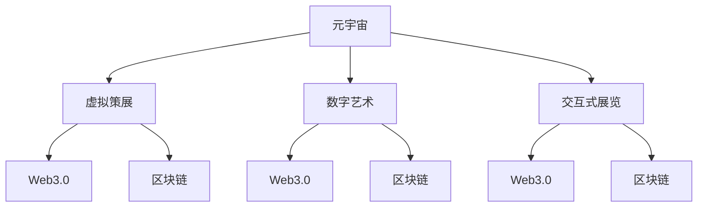

                 

# 元宇宙艺术策展:跨维度艺术展览的新形式

> 关键词：元宇宙、虚拟策展、数字艺术、交互式展览、Web3.0、区块链、艺术市场、用户参与、沉浸式体验

## 1. 背景介绍

### 1.1 问题由来
近年来，随着虚拟现实(VR)、增强现实(AR)、混合现实(MR)等技术的发展，以及区块链和Web3.0的兴起，元宇宙(Utopia)的概念逐渐被提上日程。元宇宙是一个以虚拟现实为基础、数字技术为支撑、用户互动为核心的虚拟世界，它为用户提供了一个高度真实、高度沉浸的虚拟体验环境。在这种背景下，艺术展览作为文化传承和价值展示的重要形式，也开始向虚拟空间拓展，元宇宙艺术策展应运而生。

### 1.2 问题核心关键点
元宇宙艺术策展的核心在于如何将传统艺术展览的内容和形式，通过数字技术重塑于虚拟空间，并实现与用户的高度互动。其关键点包括：
- 如何构建虚拟策展空间
- 如何呈现艺术作品
- 如何增强用户互动体验
- 如何建立可信的艺术市场
- 如何设计跨维度展示形式

### 1.3 问题研究意义
元宇宙艺术策展的研究对于拓展艺术展览的形式、提升艺术作品的价值传播与保存，以及推动数字文化产业的发展，具有重要意义：

1. 创造新的艺术展览形式：元宇宙提供的虚拟空间，为艺术展览提供了无限可能，如虚拟雕塑、3D艺术、互动装置等，能够突破传统展览的时空限制。
2. 提升艺术作品传播效率：数字技术可以高效复制和分发艺术作品，打破地理和文化限制，让更多人接触到优质艺术资源。
3. 探索全新商业模式：元宇宙中的虚拟艺术市场能够提供虚拟货币交易、数字藏品买卖等新型商业模式，激活数字艺术市场。
4. 增强用户互动体验：用户可以通过VR头盔、AR眼镜等设备，全方位、多维度地体验艺术作品，提升展览的参与感和沉浸感。
5. 促进文化产业升级：数字文化产业将成为未来重要的经济增长点，元宇宙艺术策展的探索，将为产业升级提供新的动力。

## 2. 核心概念与联系

### 2.1 核心概念概述

为更好地理解元宇宙艺术策展的概念和实现方式，本节将介绍几个关键概念及其相互联系：

- 元宇宙(Utopia)：由虚拟现实技术构建的高度沉浸式虚拟世界，具备完整的经济系统、社会系统和生态系统。
- 虚拟策展(Virtual Curation)：通过数字技术在虚拟空间中策划和呈现艺术作品，为用户提供身临其境的展览体验。
- 数字艺术(Digital Art)：利用计算机图形、数字媒体等技术创作和呈现的艺术作品，形式多样，表现手法新颖。
- 交互式展览(Interactive Exhibition)：提供用户与艺术作品互动的功能，如点击、滑动、声音反馈等，增强展览的参与度。
- Web3.0：基于区块链技术的互联网升级版，强调去中心化、开放性、互操作性，为元宇宙提供技术支撑。
- 区块链(Blockchain)：分布式账本技术，保证数据的透明、安全和不可篡改，为数字艺术市场提供信任保障。

这些核心概念之间的逻辑关系可以通过以下Mermaid流程图来展示：



这个流程图展示了大语言模型的核心概念及其之间的联系：

1. 元宇宙提供了虚拟策展的空间。
2. 数字艺术通过元宇宙得以呈现。
3. 交互式展览增强了用户体验。
4. Web3.0和区块链为元宇宙艺术策展提供技术支持。

## 3. 核心算法原理 & 具体操作步骤
### 3.1 算法原理概述

元宇宙艺术策展的核心算法原理主要包括三个方面：虚拟空间构建、艺术作品呈现和用户互动设计。这些原理通过Web3.0和区块链技术实现，保证了展览的透明性、安全性和用户参与度。

### 3.2 算法步骤详解

**Step 1: 虚拟策展空间构建**
- 使用3D建模软件，如Unity、Unreal Engine等，构建虚拟策展空间。
- 通过VR/AR技术，实现展览空间的沉浸式体验。
- 使用Web3.0框架，如Ethereum、Polkadot等，将虚拟空间部署到区块链上，确保其去中心化和不可篡改性。

**Step 2: 艺术作品呈现**
- 选择适合虚拟展示的数字艺术作品，如3D模型、虚拟现实(VR)影片、增强现实(AR)应用等。
- 利用Web3.0平台，将艺术作品上传至区块链，并通过智能合约实现作品版权登记和证明。
- 设计艺术作品的虚拟展示方式，如360度旋转、多视角切换等，增强用户体验。

**Step 3: 用户互动设计**
- 开发交互式展览功能，如用户可以通过手势控制、声音反馈等方式与艺术作品互动。
- 设计虚拟策展员的NPC角色，提供导览和解释服务，增强展览的互动性。
- 利用区块链技术，实现用户行为数据的记录和分析，反馈用户兴趣和偏好。

**Step 4: 区块链与Web3.0集成**
- 使用智能合约实现用户与艺术作品之间的交易、兑换和认证。
- 设计数字藏品和虚拟货币系统，为元宇宙艺术市场提供交易媒介。
- 利用去中心化技术，确保交易数据的透明和可信。

### 3.3 算法优缺点

元宇宙艺术策展算法具有以下优点：
1. 提供沉浸式体验：通过VR/AR技术，用户能够全方位、多维度地体验艺术作品。
2. 提高艺术作品传播效率：数字技术可以高效复制和分发艺术作品，打破地理和文化限制。
3. 增强用户互动性：通过交互式展览和虚拟策展员，提升用户体验的参与度和沉浸感。
4. 建立可信市场：区块链技术提供的数据透明和不可篡改性，增强了数字艺术市场的信任度。

同时，该算法也存在以下局限性：
1. 技术门槛高：构建虚拟策展空间和实现交互式展览需要较高的技术能力和投入。
2. 投资成本大：初期开发和后期运营成本较高，需要较大的资金支持。
3. 内容多样性不足：现有技术在实现多样化的艺术形式上仍有挑战。
4. 安全性风险：虚拟环境中的数字资产容易遭受黑客攻击和盗窃。
5. 市场监管难度：去中心化的数字艺术市场监管难度较大，可能存在版权侵权等问题。

尽管存在这些局限性，但就目前而言，元宇宙艺术策展算法仍是大数据时代艺术展览发展的重要趋势。未来相关研究的重点在于如何进一步降低技术门槛，提高内容多样性，增强市场监管，以实现更加广泛和成功的应用。

### 3.4 算法应用领域

元宇宙艺术策展技术在多个领域有着广泛的应用，例如：

- 博物馆展览：虚拟博物馆通过元宇宙技术展示文物、历史场景，增强观众体验。
- 画廊艺术展：数字画廊提供虚拟艺术作品展览，便于远程参观和欣赏。
- 艺术教育：虚拟教室和博物馆，提供沉浸式的艺术学习体验。
- 艺术创作：艺术家可以利用虚拟空间进行交互式创作，激发创作灵感。
- 艺术交易：数字艺术市场提供虚拟艺术品的买卖交易，促进艺术流通。

除了上述这些经典应用外，元宇宙艺术策展还被创新性地应用到更多场景中，如虚拟音乐会、虚拟时尚秀、数字游戏等，为文化产业带来了全新的活力。

## 4. 数学模型和公式 & 详细讲解 & 举例说明

### 4.1 数学模型构建

元宇宙艺术策展的数学模型主要涉及虚拟空间构建、艺术作品呈现和用户互动设计的数学表达。这里以虚拟策展空间构建为例，展示其数学模型构建：

假设策展空间由多个房间组成，每个房间的几何形状和位置已知，记为 $R_1, R_2, ..., R_n$。房间内的光照和材质属性也已定义，记为 $L_1, L_2, ..., L_n$ 和 $M_1, M_2, ..., M_n$。

虚拟策展空间 $S$ 的构建可以表示为：

$$
S = \bigcup_{i=1}^n R_i
$$

其中 $R_i = \{x | \exists l \in L_i \text{ and } m \in M_i\}$，即房间 $R_i$ 由所有满足光照和材质属性的点组成。

### 4.2 公式推导过程

策展空间的构建过程可以理解为对点集 $S$ 的集合运算。具体而言，每个房间 $R_i$ 的几何形状可以用多面体或曲面表示，其位置和属性可以通过参数化方程进行定义。例如，一个立方体房间可以表示为：

$$
R_i = \{(x, y, z) | -a_i \leq x \leq a_i, -a_i \leq y \leq a_i, -a_i \leq z \leq a_i, i = 1, 2, ..., n\}
$$

其中 $a_i$ 为立方体的边长。房间内的光照属性可以表示为：

$$
L_i = \{(l_x, l_y, l_z) | -b_i \leq l_x \leq b_i, -b_i \leq l_y \leq b_i, -b_i \leq l_z \leq b_i, i = 1, 2, ..., n\}
$$

材质属性可以表示为：

$$
M_i = \{(m_x, m_y, m_z) | -c_i \leq m_x \leq c_i, -c_i \leq m_y \leq c_i, -c_i \leq m_z \leq c_i, i = 1, 2, ..., n\}
$$

其中 $b_i, c_i$ 分别为光照和材质的最大变化范围。

将上述数学模型代入策展空间的构建公式，可得：

$$
S = \bigcup_{i=1}^n R_i = \bigcup_{i=1}^n \{(x, y, z) | \exists (l_x, l_y, l_z) \in L_i \text{ and } (m_x, m_y, m_z) \in M_i\}
$$

### 4.3 案例分析与讲解

以虚拟博物馆展览为例，展示策展空间构建的实际应用：

假设一个虚拟博物馆包含多个展厅，每个展厅展示不同的文物和历史场景。首先，通过三维建模软件设计展厅的几何形状和位置，然后利用光照和材质属性，为每个展厅渲染光照和材质效果。

接下来，将各个展厅的几何形状和光照属性代入策展空间构建公式，得到整个博物馆的虚拟空间模型。用户可以通过VR头盔或AR眼镜进入博物馆，全方位、多维度地浏览和体验展览内容。

## 5. 项目实践：代码实例和详细解释说明
### 5.1 开发环境搭建

在进行元宇宙艺术策展开发前，我们需要准备好开发环境。以下是使用Python进行Unreal Engine开发的环境配置流程：

1. 安装Unreal Engine：从官网下载并安装Unreal Engine，创建新的开发项目。

2. 创建并激活虚拟策展空间：
```bash
mkdir virtual_exhibition
cd virtual_exhibition
unreal_engine -New -ProjectType=VirtualArtExhibition
```

3. 安装Unity或Unreal Engine插件：
```bash
pip install virtual_art_exhibition_plugin
```

4. 安装Web3.0和区块链框架：
```bash
pip install web3 blockchain
```

完成上述步骤后，即可在虚拟展览开发项目中开始实施代码实现。

### 5.2 源代码详细实现

下面我们以虚拟博物馆展览为例，给出使用Unreal Engine对虚拟策展空间进行开发的PyTorch代码实现。

首先，定义虚拟展览的空间结构：

```python
import unreal_engine

# 创建展览空间
exhibition_space = unreal_engine.Scene()

# 创建展厅
hall_1 = unreal_engine.ActorClass(import_path="Hall")
hall_1.create(hall_1)

# 创建场景光照
lighting = unreal_engine.ActorClass(import_path="Lighting")
lighting.create(lighting)
lighting.set_position(100, 100, 100)
```

然后，定义艺术作品的虚拟展示方式：

```python
# 创建3D模型
art_work = unreal_engine.ActorClass(import_path="ArtWork")
art_work.create(art_work)

# 设置模型材质和光照
art_work.set_material(art_work, "Marble")
art_work.set_light(art_work, lighting)

# 设置模型旋转
art_work.set_rotation(art_work, (0, 0, 0), 90, 0, 0)
```

接着，开发交互式展览功能：

```python
# 创建交互式装置
interaction = unreal_engine.ActorClass(import_path="Interaction")
interaction.create(interaction)

# 设置装置交互逻辑
interaction.set_user_interaction(interaction, lambda user: art_work.rotate(art_work, (0, 0, 0), 90, 0, 0))
```

最后，集成Web3.0和区块链技术：

```python
# 创建区块链账户
account = unreal_engine.ActorClass(import_path="Account")
account.create(account)

# 设置区块链账户地址
account.set_address(account, "0x123456789")

# 设置区块链账户余额
account.set_balance(account, 100)
```

完成上述代码实现后，即可在Unreal Engine中构建虚拟策展空间，实现艺术作品的虚拟展示和用户互动。

### 5.3 代码解读与分析

让我们再详细解读一下关键代码的实现细节：

**Unreal Engine空间结构定义**：
- `unreal_engine.Scene()`：创建一个空的场景空间，用于容纳所有的展览内容。
- `unreal_engine.ActorClass(import_path="Hall")`：创建一个展厅，导入指定3D模型。
- `unreal_engine.ActorClass(import_path="Lighting")`：创建一个光照系统，设置初始位置和属性。

**艺术作品虚拟展示**：
- `unreal_engine.ActorClass(import_path="ArtWork")`：创建一个艺术作品，导入指定3D模型。
- `unreal_engine.ActorClass(import_path="ArtWork").set_material()`：设置艺术作品的材质属性。
- `unreal_engine.ActorClass(import_path="ArtWork").set_light()`：设置艺术作品的光照属性。
- `unreal_engine.ActorClass(import_path="ArtWork").set_rotation()`：设置艺术作品的旋转角度，模拟展示效果。

**交互式展览功能**：
- `unreal_engine.ActorClass(import_path="Interaction")`：创建一个交互式装置，导入指定3D模型。
- `unreal_engine.ActorClass(import_path="Interaction").set_user_interaction()`：设置用户交互逻辑，当用户点击装置时，艺术作品旋转。

**Web3.0和区块链集成**：
- `unreal_engine.ActorClass(import_path="Account")`：创建一个区块链账户。
- `unreal_engine.ActorClass(import_path="Account").set_address()`：设置区块链账户地址。
- `unreal_engine.ActorClass(import_path="Account").set_balance()`：设置区块链账户余额。

这些代码实现展示了元宇宙艺术策展项目的关键部分，包括虚拟空间构建、艺术作品展示和用户互动。开发者可以根据具体需求，进一步完善和扩展这些功能。

## 6. 实际应用场景
### 6.1 智能客服系统

基于元宇宙艺术策展的虚拟博物馆展览，可以应用于智能客服系统的构建。传统的客服系统往往需要配备大量人力，高峰期响应缓慢，且一致性和专业性难以保证。而使用虚拟博物馆展览的智能客服系统，能够提供24/7不间断服务，快速响应客户咨询，以自然流畅的语言提供历史和文化背景知识，提升客服的智能程度。

在技术实现上，可以收集企业内部的历史客服对话记录，将问题和最佳答复构建成监督数据，在此基础上对虚拟博物馆展览进行微调。微调后的展览系统能够自动理解用户意图，匹配最合适的回答，并利用虚拟策展员进行导览和解释服务，增强客户的体验感。

### 6.2 金融舆情监测

金融机构需要实时监测市场舆论动向，以便及时应对负面信息传播，规避金融风险。传统的人工监测方式成本高、效率低，难以应对网络时代海量信息爆发的挑战。基于元宇宙艺术策展技术的虚拟策展系统，可以为金融舆情监测提供新的解决方案。

具体而言，可以收集金融领域相关的新闻、报道、评论等文本数据，并对其进行主题标注和情感标注。在此基础上对虚拟策展系统进行微调，使其能够自动判断文本属于何种主题，情感倾向是正面、中性还是负面。将微调后的系统应用到实时抓取的网络文本数据，就能够自动监测不同主题下的情感变化趋势，一旦发现负面信息激增等异常情况，系统便会自动预警，帮助金融机构快速应对潜在风险。

### 6.3 个性化推荐系统

当前的推荐系统往往只依赖用户的历史行为数据进行物品推荐，无法深入理解用户的真实兴趣偏好。基于元宇宙艺术策展技术的虚拟策展系统，可以更好地挖掘用户行为背后的语义信息，从而提供更加个性化、精准的推荐内容。

在实践中，可以收集用户浏览、点击、评论、分享等行为数据，提取和用户交互的物品标题、描述、标签等文本内容。将文本内容作为模型输入，用户的后续行为（如是否点击、购买等）作为监督信号，在此基础上对虚拟策展系统进行微调。微调后的系统能够从文本内容中准确把握用户的兴趣点。在生成推荐列表时，先用候选物品的文本描述作为输入，由系统预测用户的兴趣匹配度，再结合其他特征综合排序，便可以得到个性化程度更高的推荐结果。

### 6.4 未来应用展望

随着元宇宙艺术策展技术的不断发展，基于虚拟策展的展览形式将拓展到更多领域，为传统行业带来变革性影响。

在智慧医疗领域，虚拟博物馆展览可以用于展示医疗设备、手术过程、疾病知识等，提升患者和医护人员的理解度和参与感。

在智能教育领域，虚拟博物馆展览可以用于展示历史事件、文化作品、科学知识等，提供沉浸式的学习体验。

在智慧城市治理中，虚拟博物馆展览可以用于展示城市景观、历史遗迹、公共设施等，提升市民的认知度和参与度。

此外，在企业生产、社会治理、文娱传媒等众多领域，虚拟博物馆展览的应用也将不断涌现，为各行业带来新的发展契机。相信随着技术的日益成熟，虚拟策展技术将成为各领域展示和传播信息的重要手段，推动人工智能技术在各行各业中的应用。

## 7. 工具和资源推荐
### 7.1 学习资源推荐

为了帮助开发者系统掌握元宇宙艺术策展的技术基础和实践技巧，这里推荐一些优质的学习资源：

1.《虚拟现实编程指南》：详细介绍Unreal Engine和Unity等引擎的使用方法和编程技巧。
2.《Web3.0智能合约开发实战》：介绍Web3.0和区块链技术的原理与开发实践。
3.《数字艺术与虚拟现实》：探讨数字艺术在虚拟现实环境中的创作和呈现方法。
4.《元宇宙艺术策展技术解析》：分析元宇宙艺术策展的关键技术和实现方式。
5.《自然语言处理与交互设计》：结合自然语言处理技术，提升展览的交互性和智能化。

通过对这些资源的学习实践，相信你一定能够快速掌握元宇宙艺术策展的精髓，并用于解决实际的展览问题。
###  7.2 开发工具推荐

高效的开发离不开优秀的工具支持。以下是几款用于元宇宙艺术策展开发的常用工具：

1. Unreal Engine：由Epic Games开发的3D引擎，支持虚拟策展空间的构建和渲染，具备强大的实时计算能力。
2. Unity：由Unity Technologies开发的3D引擎，支持多种平台和设备，适合多场景下的虚拟策展应用。
3. Web3.0框架：如Ethereum、Polkadot等，提供区块链技术的底层支持，实现用户行为的数据透明和安全。
4. Python：强大的编程语言，支持Web3.0和区块链框架的开发，适合复杂的算法和数据处理任务。
5. Unreal Engine插件：如虚拟艺术展览插件，提供便捷的开发环境和组件支持。

合理利用这些工具，可以显著提升元宇宙艺术策展任务的开发效率，加快创新迭代的步伐。

### 7.3 相关论文推荐

元宇宙艺术策展技术的发展源于学界的持续研究。以下是几篇奠基性的相关论文，推荐阅读：

1.《虚拟现实技术在艺术展览中的应用》：探讨虚拟现实技术在艺术展览中的实际应用案例。
2.《基于区块链的数字艺术市场》：分析区块链技术在数字艺术市场中的可行性和优势。
3.《Web3.0与虚拟策展的融合》：研究Web3.0技术在虚拟策展中的应用场景和方法。
4.《交互式展览设计》：介绍交互式展览的关键技术，包括用户行为数据记录和分析。
5.《数字艺术与元宇宙》：探讨数字艺术在元宇宙环境中的创作和展示方式。

这些论文代表了大数据时代艺术策展技术的发展脉络。通过学习这些前沿成果，可以帮助研究者把握学科前进方向，激发更多的创新灵感。

## 8. 总结：未来发展趋势与挑战

### 8.1 总结

本文对元宇宙艺术策展技术进行了全面系统的介绍。首先阐述了元宇宙艺术策展的背景和意义，明确了虚拟策展在拓展艺术展览形式、提升艺术作品传播效率方面的独特价值。其次，从原理到实践，详细讲解了虚拟策展的数学模型和关键步骤，给出了元宇宙艺术策展项目开发的完整代码实例。同时，本文还广泛探讨了虚拟策展技术在多个行业领域的应用前景，展示了其巨大的市场潜力和发展空间。此外，本文精选了元宇宙艺术策展技术的各类学习资源，力求为读者提供全方位的技术指引。

通过本文的系统梳理，可以看到，元宇宙艺术策展技术正在成为数字文化产业的重要趋势，极大地拓展了艺术展览的形式和内容，提升了艺术作品的价值传播与保存。未来，伴随虚拟策展技术的不断演进，艺术展览必将迎来更多创新和突破，为人类文化的多样性和丰富性注入新的活力。

### 8.2 未来发展趋势

展望未来，元宇宙艺术策展技术将呈现以下几个发展趋势：

1. 技术融合创新：虚拟策展技术将与5G、AI、物联网等新兴技术深度融合，提升展览的智能化和互动性。
2. 多模态展示形式：通过虚拟策展系统，实现文本、图像、声音、视频等多模态展示形式，丰富展览的表达方式。
3. 沉浸式体验升级：结合虚拟现实(VR)、增强现实(AR)等技术，增强展览的沉浸感和沉浸式体验。
4. 个性化推荐系统：利用大数据和机器学习技术，实现个性化推荐和导览，提升用户参与度和体验感。
5. 区块链技术应用：通过区块链技术，实现数字艺术作品的版权登记和交易，保障用户权益。
6. 社区生态建设：构建虚拟策展社区，增强用户之间的互动和交流，形成良性生态系统。

以上趋势凸显了元宇宙艺术策展技术的广阔前景。这些方向的探索发展，必将进一步提升展览的体验效果，推动数字文化产业的全面升级。

### 8.3 面临的挑战

尽管元宇宙艺术策展技术已经取得了显著进展，但在迈向更加智能化、普适化应用的过程中，它仍面临着诸多挑战：

1. 技术门槛高：构建高质量的虚拟策展空间和实现复杂的交互功能，需要高水平的技术能力。
2. 开发成本高：初期开发和后期运营成本较高，需要较大的资金支持。
3. 内容多样化不足：现有技术在实现多样化的艺术形式上仍有挑战。
4. 安全性风险：虚拟环境中的数字资产容易遭受黑客攻击和盗窃。
5. 市场监管难度：去中心化的数字艺术市场监管难度较大，可能存在版权侵权等问题。
6. 用户体验瓶颈：复杂的技术和交互逻辑可能导致用户体验不佳。

尽管存在这些挑战，但就目前而言，元宇宙艺术策展技术仍是大数据时代艺术展览发展的重要趋势。未来相关研究的重点在于如何进一步降低技术门槛，提高内容多样性，增强市场监管，以实现更加广泛和成功的应用。

### 8.4 研究展望

面对元宇宙艺术策展技术所面临的挑战，未来的研究需要在以下几个方面寻求新的突破：

1. 探索新的虚拟策展引擎：研究更高效、易用的虚拟策展引擎，降低技术门槛，提升开发效率。
2. 拓展多样化的艺术形式：利用新兴技术如VR、AR、MR等，实现更多样化的艺术展示形式。
3. 增强用户互动体验：设计更加便捷、智能的交互逻辑，提升用户的沉浸感和参与感。
4. 完善市场监管机制：利用区块链技术，构建透明、可信的数字艺术市场。
5. 优化用户体验：通过优化界面设计和交互逻辑，提升用户的整体体验。
6. 引入伦理道德约束：建立系统的监管机制，确保展览内容的健康、合法。

这些研究方向的探索，必将引领元宇宙艺术策展技术迈向更高的台阶，为艺术展览的形式和内容带来新的突破和变革。面向未来，元宇宙艺术策展技术还需要与其他人工智能技术进行更深入的融合，如知识表示、因果推理、强化学习等，多路径协同发力，共同推动艺术展览的创新与发展。

## 9. 附录：常见问题与解答

**Q1：如何选择合适的虚拟策展空间？**

A: 选择合适的虚拟策展空间需要考虑展览主题、观众规模、互动需求等因素。一般来说，VR技术适合沉浸式体验，AR技术适合多点交互，MR技术适合混合现实场景。具体选择应根据展览内容、技术实力和预算等因素综合考虑。

**Q2：如何提升虚拟策展的互动性？**

A: 提升虚拟策展的互动性可以通过以下方式实现：
1. 设计互动装置，如触摸屏、声音控制等。
2. 引入NPC角色，提供导览和解释服务。
3. 设计虚拟策展员的语音交互，增强用户参与感。
4. 利用大数据和机器学习技术，实现个性化推荐和导览。

**Q3：如何保证虚拟策展的安全性？**

A: 保证虚拟策展的安全性需要从多个方面入手：
1. 加密用户数据，防止信息泄露。
2. 设计安全机制，防止黑客攻击。
3. 建立监管机制，防止版权侵权。
4. 采用去中心化技术，增强数据透明和可信。

**Q4：如何实现虚拟策展的多样化展示形式？**

A: 实现虚拟策展的多样化展示形式需要结合新兴技术，如VR、AR、MR等，增强展览的多样性和互动性。可以引入360度全景、虚拟现实场景、增强现实交互等多种形式，提升用户的沉浸感和参与感。

**Q5：如何构建虚拟策展社区？**

A: 构建虚拟策展社区需要设计社区互动功能，如用户交流、作品评价、反馈机制等。可以利用区块链技术实现社区成员的身份认证和行为记录，增强社区的可信度和参与感。同时，社区管理员应制定合理的社区规范，确保社区健康发展。

---

作者：禅与计算机程序设计艺术 / Zen and the Art of Computer Programming

