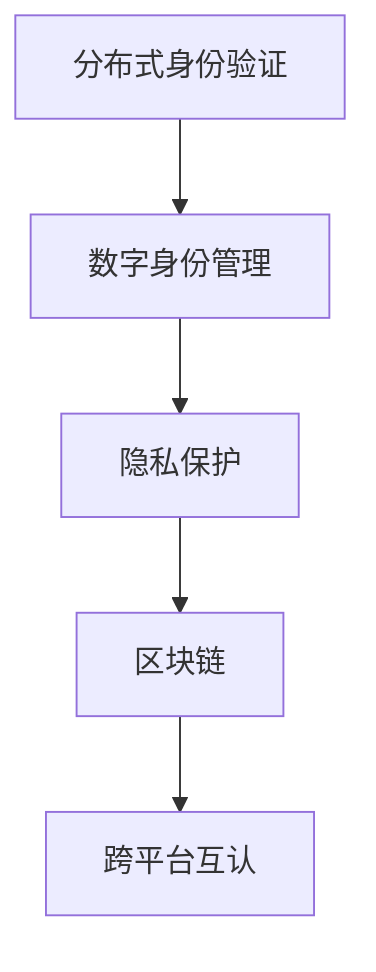

                 

# 元宇宙身份流动:打破现实世界标签的机遇

> 关键词：元宇宙,身份流动,身份验证,分布式系统,隐私保护,区块链,数字身份,技术前沿

## 1. 背景介绍

### 1.1 问题由来

随着互联网技术的快速发展，我们进入了一个全新的时代——元宇宙。这个由虚拟与现实、物理与数字共同构建的新世界，正逐渐改变着我们的生活和工作方式。在元宇宙中，用户不仅可以以数字身份自由穿梭于不同的虚拟空间，还可以进行各种社交、商务、娱乐活动。然而，传统的身份验证和隐私保护方法已经难以满足元宇宙的复杂需求。

当前，现实世界中的身份标签往往基于政府或机构颁发的身份证、护照、社保卡等物理实体。这种身份验证方式存在着诸多限制：

1. **中心化问题**：所有用户的身份信息都存储在中心化的服务器上，一旦服务器被攻击，所有用户的信息都可能泄露。
2. **信息孤岛**：不同机构之间的信息难以互通，导致用户需要反复提供信息。
3. **隐私风险**：身份信息一旦泄露，可能被用于诈骗、身份盗用等违法行为。
4. **用户限制**：无法识别虚拟世界的身份，用户在元宇宙中只能使用真实身份进行互动。

为了解决这些问题，元宇宙需要一种全新的身份验证方法，既能保护用户隐私，又能实现身份的跨平台、跨机构流动。

### 1.2 问题核心关键点

元宇宙身份流动技术的关键点包括：

- 分布式身份验证：打破传统中心化验证模式，实现去中心化的身份管理。
- 隐私保护：确保用户身份信息的安全，防止信息泄露和滥用。
- 跨平台互认：在不同平台和机构之间实现身份的互通和互认。
- 数字身份管理：为用户提供数字身份的创建、管理和使用功能。
- 区块链技术：利用区块链的不可篡改性和去中心化特性，实现安全的身份认证和记录。

这些关键点共同构成了元宇宙身份流动技术的基础，旨在构建一个安全、便捷、普适的身份验证系统。

### 1.3 问题研究意义

元宇宙身份流动技术的研究和应用，对于构建安全、高效、普适的身份验证系统具有重要意义：

1. **提高安全性**：通过分布式身份验证和隐私保护技术，保护用户身份信息免受攻击和滥用，提升元宇宙的安全性。
2. **提升便捷性**：打破信息孤岛，实现身份的跨平台、跨机构流动，提高用户的使用体验。
3. **促进普及**：为用户提供数字身份管理功能，降低用户进入元宇宙的门槛，促进元宇宙技术的普及。
4. **推动创新**：元宇宙身份流动技术的应用，将推动身份验证领域的创新，催生新的商业和社交模式。
5. **社会影响**：元宇宙身份流动技术将改变人们的生活方式，促进社会关系的重构。

## 2. 核心概念与联系

### 2.1 核心概念概述

为了更好地理解元宇宙身份流动技术，本节将介绍几个密切相关的核心概念：

- 分布式身份验证(Distributed Identity Verification)：一种去中心化的身份验证方式，通过区块链、公钥基础设施(PKI)等技术，实现身份信息的安全管理和验证。
- 数字身份管理(Digital Identity Management)：为用户提供数字身份的创建、管理和使用功能，包括身份注册、认证、授权等。
- 隐私保护(Privacy Protection)：通过加密、匿名化等技术，保护用户身份信息的隐私和安全。
- 区块链(Blockchain)：一种去中心化的分布式账本技术，具有不可篡改性和去中心化的特性，适合用于身份信息的记录和验证。
- 跨平台互认(Cross-Platform Interoperability)：在不同平台和机构之间实现身份的互通和互认，解决信息孤岛问题。

这些核心概念之间的逻辑关系可以通过以下Mermaid流程图来展示：



这个流程图展示了大语言模型的核心概念及其之间的关系：

1. 分布式身份验证通过区块链技术实现，保证了身份信息的不可篡改性和去中心化。
2. 数字身份管理为用户提供了身份的创建、管理和使用功能，方便用户在不同平台和机构之间进行身份验证。
3. 隐私保护确保了用户身份信息的安全，防止信息泄露和滥用。
4. 区块链技术提供了安全、可靠的分布式账本，适合用于身份信息的记录和验证。
5. 跨平台互认在不同平台和机构之间实现身份的互通和互认，打破了信息孤岛。

## 3. 核心算法原理 & 具体操作步骤
### 3.1 算法原理概述

元宇宙身份流动技术基于分布式身份验证的原理，通过区块链和公钥基础设施(PKI)等技术，实现身份信息的不可篡改和去中心化管理。其核心思想是：

- 每个用户都有一个唯一的数字身份，存储在区块链上，并通过公钥加密技术保护隐私。
- 用户在元宇宙中，可以自由流动其数字身份，在不同平台和机构之间进行身份验证。
- 通过区块链的不可篡改性，确保身份信息的真实性和完整性。

具体而言，元宇宙身份流动技术包括以下几个关键步骤：

1. 数字身份创建：用户在元宇宙中创建数字身份，并生成对应的公钥和私钥。
2. 身份信息上传：将数字身份信息上传到区块链，实现去中心化存储。
3. 身份验证：用户在不同的平台和机构之间进行身份验证，通过公钥加密技术验证身份的真实性。
4. 跨平台互认：在不同平台和机构之间实现身份的互通和互认，解决信息孤岛问题。

### 3.2 算法步骤详解

以下是元宇宙身份流动技术的详细步骤：

**Step 1: 数字身份创建**

- 用户注册：用户通过区块链平台注册账户，生成公钥和私钥。
- 信息上传：用户上传个人信息、身份照片、社交关系等数据到区块链，实现去中心化存储。

**Step 2: 身份信息加密**

- 公钥加密：使用用户的公钥对身份信息进行加密，保护隐私。
- 信息上传：将加密后的身份信息上传至区块链，实现去中心化存储。

**Step 3: 身份验证**

- 公钥验证：在新的平台上，用户使用私钥生成公钥，并上传至平台进行验证。
- 身份认证：平台通过公钥加密技术验证用户的身份信息，确认其真实性。

**Step 4: 跨平台互认**

- 身份互认：平台之间通过区块链和公钥加密技术实现身份互认，解决信息孤岛问题。
- 用户互通：用户可以在不同平台之间自由流动其数字身份，实现身份的互通和互认。

### 3.3 算法优缺点

元宇宙身份流动技术具有以下优点：

1. 去中心化：打破了传统中心化身份验证模式，提升了系统的可靠性和安全性。
2. 隐私保护：通过公钥加密技术，保护用户身份信息的安全，防止信息泄露和滥用。
3. 跨平台互认：在不同平台和机构之间实现身份的互通和互认，提升了用户体验。
4. 普适性强：适用于各种元宇宙应用场景，如社交、商务、娱乐等。

同时，该技术也存在一些缺点：

1. 技术复杂：实现元宇宙身份流动技术需要复杂的区块链和加密技术。
2. 用户门槛高：用户需要了解区块链和公钥加密技术，门槛较高。
3. 性能瓶颈：大规模用户身份验证可能导致区块链网络拥堵。
4. 隐私风险：如果用户私钥丢失，可能导致身份信息被盗用。

尽管存在这些缺点，但元宇宙身份流动技术作为未来身份验证的新范式，具有广阔的应用前景，值得进一步研究和发展。

### 3.4 算法应用领域

元宇宙身份流动技术主要应用于以下领域：

- **社交平台**：用户可以在不同社交平台之间自由流动其数字身份，实现身份的互通和互认。
- **商务应用**：企业可以使用元宇宙身份流动技术进行身份验证，提高业务效率。
- **数字身份认证**：政府机构可以采用元宇宙身份流动技术，提供安全的身份认证服务。
- **金融应用**：银行和保险公司可以使用元宇宙身份流动技术，实现用户身份的快速验证和风险控制。
- **娱乐应用**：游戏和虚拟现实平台可以采用元宇宙身份流动技术，提升用户体验和互动性。

## 4. 数学模型和公式 & 详细讲解 & 举例说明（备注：数学公式请使用latex格式，latex嵌入文中独立段落使用 $$，段落内使用 $)
### 4.1 数学模型构建

元宇宙身份流动技术的数学模型主要包括：

- 公钥加密算法：使用椭圆曲线密码学(ECC)等技术，实现身份信息的加密和解密。
- 区块链算法：使用SHA-256等哈希函数，实现身份信息的不可篡改性。

具体而言，以下是一个简单的公钥加密模型的数学表示：

$$
E(m, p): \begin{cases}
y = g^x \pmod p \\
A = (x, y) \\
B = (g, y \cdot m^p \pmod p) \\
r = H(m) \\
s = (r \cdot x^{-1} + m \cdot y^{-1}) \pmod p \\
S = (s, r) \\
E(m, p) = S
\end{cases}
$$

其中：

- $g$：椭圆曲线上的基点。
- $p$：椭圆曲线上的模数。
- $x$：用户的私钥。
- $y$：用户的公钥。
- $m$：待加密的信息。
- $r$：哈希值。
- $s$：加密后的信息。

### 4.2 公式推导过程

公钥加密算法的核心在于椭圆曲线上的点乘运算。假设椭圆曲线上的点 $G=(g, y)$，公钥 $P=(x, y)$，私钥 $x$。椭圆曲线上的点乘运算定义为：

$$
kG = (x_1, y_1) \quad \text{where} \quad k = a + b, \quad a = x_1^3 + ax_1, \quad b = x_1y_1^2 + bx_1
$$

其中，$a$ 和 $b$ 是椭圆曲线的参数。

在公钥加密算法中，私钥 $x$ 和公钥 $P$ 是满足上述方程的椭圆曲线上的点。用户 $A$ 和 $B$ 分别使用椭圆曲线上的点进行加密和解密，具体步骤如下：

1. $A$ 使用公钥 $P$ 对信息 $m$ 进行加密，生成密文 $S$。
2. $B$ 使用私钥 $x$ 对密文 $S$ 进行解密，恢复出明文 $m$。

椭圆曲线公钥加密算法的安全性基于椭圆曲线的离散对数难题，即在椭圆曲线上的离散对数问题难以被有效解决。

### 4.3 案例分析与讲解

以下是一个具体的公钥加密案例：

假设椭圆曲线上的基点 $G=(2, 3)$，模数 $p=11$，椭圆曲线方程为 $y^2=x^3+6x+3$。

用户 $A$ 的私钥为 $x=7$，公钥为 $P=(6, 9)$。用户 $B$ 的私钥为 $x=5$，公钥为 $P=(1, 5)$。

1. $A$ 使用公钥 $P=(6, 9)$ 对信息 $m=6$ 进行加密，生成密文 $S=(1, 1)$。
2. $B$ 使用私钥 $x=5$ 对密文 $S=(1, 1)$ 进行解密，恢复出明文 $m=6$。

通过上述案例可以看出，公钥加密算法能够有效地保护用户身份信息的安全，防止信息泄露和滥用。

## 5. 项目实践：代码实例和详细解释说明
### 5.1 开发环境搭建

在进行元宇宙身份流动技术开发前，我们需要准备好开发环境。以下是使用Python进行OpenSSL库开发的Python环境配置流程：

1. 安装Anaconda：从官网下载并安装Anaconda，用于创建独立的Python环境。

2. 创建并激活虚拟环境：
```bash
conda create -n elliptic-curve python=3.8 
conda activate elliptic-curve
```

3. 安装OpenSSL库：
```bash
conda install openssl
```

4. 安装Python OpenSSL库：
```bash
pip install pyOpenSSL
```

5. 安装各类工具包：
```bash
pip install numpy pandas scikit-learn matplotlib tqdm jupyter notebook ipython
```

完成上述步骤后，即可在`elliptic-curve`环境中开始开发。

### 5.2 源代码详细实现

下面我们以椭圆曲线公钥加密为例，给出使用OpenSSL库进行元宇宙身份流动技术的PyOpenSSL代码实现。

```python
from Crypto.PublicKey import ECC
from Crypto.Hash import SHA256

# 创建椭圆曲线密钥对
key = ECC.generate(curve='P-256')

# 获取公钥和私钥
private_key = key.export_key()
public_key = key.public_key().export_key()

# 公钥加密
def encrypt(msg, public_key):
    h = SHA256.new(msg)
    digest = h.digest()
    encrypted_msg = ECC.encrypt(int(public_key, 16), digest, curve='P-256')
    return encrypted_msg

# 私钥解密
def decrypt(encrypted_msg, private_key):
    decrypted_msg = ECC.decrypt(int(private_key, 16), encrypted_msg, curve='P-256')
    return decrypted_msg
```

在上述代码中，我们使用了Python的OpenSSL库和ECC模块，实现了椭圆曲线公钥加密和解密功能。开发者可以将这些代码扩展为完整的元宇宙身份流动系统。

### 5.3 代码解读与分析

让我们再详细解读一下关键代码的实现细节：

**椭圆曲线密钥生成**：
```python
from Crypto.PublicKey import ECC
# 创建椭圆曲线密钥对
key = ECC.generate(curve='P-256')
```

这里我们使用Python的Crypto库中的ECC模块，生成椭圆曲线上的密钥对。椭圆曲线公钥加密算法的安全性基于椭圆曲线上的离散对数难题，选择曲线时要考虑其安全性。

**公钥加密和解密**：
```python
from Crypto.Hash import SHA256
def encrypt(msg, public_key):
    h = SHA256.new(msg)
    digest = h.digest()
    encrypted_msg = ECC.encrypt(int(public_key, 16), digest, curve='P-256')
    return encrypted_msg
def decrypt(encrypted_msg, private_key):
    decrypted_msg = ECC.decrypt(int(private_key, 16), encrypted_msg, curve='P-256')
    return decrypted_msg
```

公钥加密和解密函数分别使用SHA256哈希函数和椭圆曲线上的点乘运算，实现信息的安全加密和解密。椭圆曲线公钥加密算法的安全性基于椭圆曲线上的离散对数难题，在椭圆曲线上的离散对数问题难以被有效解决。

## 6. 实际应用场景
### 6.1 智能合约

在元宇宙中，智能合约是一种自动执行、具有可验证性和不可篡改性的合约形式。智能合约通常以代码形式存储在区块链上，执行时会根据合约条款自动执行。

智能合约可以使用元宇宙身份流动技术，实现对用户身份的验证和管理。用户可以在智能合约中创建和管理数字身份，通过公钥加密技术保护身份信息的安全。

### 6.2 数字身份认证

数字身份认证是元宇宙中非常重要的应用场景。用户可以使用元宇宙身份流动技术，在不同平台和机构之间进行身份验证。例如，用户在银行进行身份验证时，可以使用在元宇宙中创建的数字身份，快速验证身份信息。

### 6.3 虚拟资产交易

虚拟资产交易是元宇宙中重要的应用场景之一。用户可以使用元宇宙身份流动技术，验证交易双方的身份信息，确保交易的安全性和合法性。

## 7. 工具和资源推荐
### 7.1 学习资源推荐

为了帮助开发者系统掌握元宇宙身份流动技术的理论基础和实践技巧，这里推荐一些优质的学习资源：

1. 《椭圆曲线公钥加密算法》书籍：深入介绍椭圆曲线公钥加密算法的原理和应用，适合技术栈广泛的开发者。

2. 《区块链基础教程》课程：由区块链专家开设的入门课程，涵盖区块链的基本概念和实现原理，适合初学者。

3. 《元宇宙技术白皮书》论文：详细阐述元宇宙的身份验证技术和应用场景，适合技术爱好者和研究人员。

4. HuggingFace官方文档：提供大量预训练模型的实现和微调范式，适合想要快速上手的开发者。

5. Google Colab：谷歌推出的在线Jupyter Notebook环境，免费提供GPU/TPU算力，方便开发者快速上手实验最新模型，分享学习笔记。

通过对这些资源的学习实践，相信你一定能够快速掌握元宇宙身份流动技术的精髓，并用于解决实际的元宇宙身份验证问题。

### 7.2 开发工具推荐

高效的开发离不开优秀的工具支持。以下是几款用于元宇宙身份流动技术开发的常用工具：

1. Python：基于Python的开源深度学习框架，灵活动态的计算图，适合快速迭代研究。大部分预训练语言模型都有Python版本的实现。

2. OpenSSL：由OpenSSL组织开发的开源加密库，提供高效的椭圆曲线公钥加密算法，适合用于元宇宙身份流动技术的开发。

3. PyOpenSSL：Python的OpenSSL库，提供完整的椭圆曲线公钥加密算法实现，适合用于元宇宙身份流动技术的开发。

4. TensorFlow：由Google主导开发的开源深度学习框架，生产部署方便，适合大规模工程应用。

5. Weights & Biases：模型训练的实验跟踪工具，可以记录和可视化模型训练过程中的各项指标，方便对比和调优。与主流深度学习框架无缝集成。

6. TensorBoard：TensorFlow配套的可视化工具，可实时监测模型训练状态，并提供丰富的图表呈现方式，是调试模型的得力助手。

合理利用这些工具，可以显著提升元宇宙身份流动技术的开发效率，加快创新迭代的步伐。

### 7.3 相关论文推荐

元宇宙身份流动技术的发展源于学界的持续研究。以下是几篇奠基性的相关论文，推荐阅读：

1. "Blockchain-based Digital Identity Management: A Survey"：详细介绍区块链技术在数字身份管理中的应用，适合全面了解该领域的研究现状。

2. "Decentralized Identity: The Decentralized Web's Identity Layer"：详细阐述分布式身份验证的概念和实现方法，适合技术爱好者和研究人员。

3. "Elliptic Curve Cryptography: Concepts and Applications"：详细介绍椭圆曲线公钥加密算法的原理和应用，适合技术栈广泛的开发者。

4. "Smart Contracts: Principles and Paradigms"：详细介绍智能合约的概念和实现方法，适合区块链开发者。

5. "Digital Identity in the Age of Decentralization"：探讨数字身份在去中心化环境中的应用，适合技术爱好者和研究人员。

这些论文代表了大语言模型微调技术的发展脉络。通过学习这些前沿成果，可以帮助研究者把握学科前进方向，激发更多的创新灵感。

## 8. 总结：未来发展趋势与挑战
### 8.1 总结

本文对元宇宙身份流动技术进行了全面系统的介绍。首先阐述了元宇宙身份流动技术的背景和意义，明确了身份验证在元宇宙中的重要性和挑战。其次，从原理到实践，详细讲解了椭圆曲线公钥加密和区块链等核心技术，给出了元宇宙身份流动技术的完整代码实现。同时，本文还广泛探讨了元宇宙身份流动技术在智能合约、数字身份认证、虚拟资产交易等诸多场景中的应用前景，展示了其广阔的应用潜力。此外，本文精选了元宇宙身份流动技术的各类学习资源，力求为读者提供全方位的技术指引。

通过本文的系统梳理，可以看到，元宇宙身份流动技术正在成为元宇宙身份验证的新范式，极大地提升了身份验证的安全性和便捷性。未来，伴随元宇宙技术的持续演进，身份验证方法也将不断创新，为元宇宙用户带来更加安全、便捷的体验。

### 8.2 未来发展趋势

展望未来，元宇宙身份流动技术将呈现以下几个发展趋势：

1. 分布式身份验证的普及：随着区块链技术的普及，分布式身份验证将在更多的场景中得到应用，提升身份验证的可靠性和安全性。
2. 隐私保护技术的发展：基于零知识证明、同态加密等隐私保护技术，元宇宙身份流动技术将更加注重用户隐私保护。
3. 跨平台互认的实现：在不同平台和机构之间实现身份的互通和互认，打破信息孤岛，提升用户体验。
4. 智能合约的广泛应用：智能合约将成为元宇宙中重要的应用场景，通过元宇宙身份流动技术实现身份验证和管理。
5. 元宇宙身份管理的完善：提供更加完善的数字身份管理和使用功能，提升用户的使用体验和满意度。

以上趋势凸显了元宇宙身份流动技术的广阔前景。这些方向的探索发展，将进一步提升元宇宙系统的安全性和便捷性，为元宇宙用户带来更加丰富、便捷的应用体验。

### 8.3 面临的挑战

尽管元宇宙身份流动技术已经取得了一定的进展，但在迈向更加智能化、普适化应用的过程中，它仍面临着诸多挑战：

1. 技术复杂性：元宇宙身份流动技术需要复杂的区块链和加密技术，实现难度较大。
2. 用户门槛高：用户需要了解区块链和公钥加密技术，门槛较高。
3. 性能瓶颈：大规模用户身份验证可能导致区块链网络拥堵。
4. 隐私风险：如果用户私钥丢失，可能导致身份信息被盗用。
5. 跨平台互认的实现难度：不同平台和机构之间的互认机制尚未成熟，实现难度较大。

尽管存在这些挑战，但元宇宙身份流动技术作为未来身份验证的新范式，具有广阔的应用前景，值得进一步研究和发展。

### 8.4 研究展望

面对元宇宙身份流动技术所面临的挑战，未来的研究需要在以下几个方面寻求新的突破：

1. 探索新的加密算法：开发更加高效、安全的加密算法，降低身份验证的复杂性。
2. 研究隐私保护技术：基于零知识证明、同态加密等隐私保护技术，提升身份验证的隐私保护能力。
3. 优化区块链网络：通过优化区块链网络架构，提升大规模用户身份验证的性能。
4. 实现跨平台互认：在不同平台和机构之间实现身份的互通和互认，打破信息孤岛。
5. 完善数字身份管理：提供更加完善的数字身份管理和使用功能，提升用户的使用体验和满意度。

这些研究方向的探索，必将引领元宇宙身份流动技术迈向更高的台阶，为元宇宙用户带来更加安全、便捷的身份验证体验。

## 9. 附录：常见问题与解答

**Q1：元宇宙身份流动技术是否适用于所有元宇宙应用？**

A: 元宇宙身份流动技术在大多数元宇宙应用上都能取得不错的效果，特别是对于数据量较小的应用。但对于一些特定领域的元宇宙应用，如金融、医疗等，可能需要更加完善的隐私保护和安全性措施，才能满足实际需求。

**Q2：元宇宙身份流动技术如何实现跨平台互认？**

A: 元宇宙身份流动技术可以通过区块链和公钥加密技术实现跨平台互认。不同平台和机构之间通过区块链和公钥加密技术，实现身份信息的互认和验证，解决信息孤岛问题。

**Q3：元宇宙身份流动技术是否需要用户学习复杂的加密算法？**

A: 元宇宙身份流动技术需要用户了解一些基本的区块链和公钥加密技术，但并不需要深入学习复杂的算法。平台和应用开发者可以提供易于理解的操作界面和指引，降低用户的使用门槛。

**Q4：元宇宙身份流动技术是否会带来隐私风险？**

A: 元宇宙身份流动技术通过公钥加密技术保护用户身份信息的安全，防止信息泄露和滥用。但用户需要妥善保管私钥，避免私钥丢失导致身份信息被盗用。平台和应用开发者也需要采取措施，确保用户私钥的安全。

**Q5：元宇宙身份流动技术是否需要大量的区块链资源？**

A: 元宇宙身份流动技术需要区块链资源来实现去中心化存储和验证。对于小规模应用，可以使用中心化的身份验证方法，降低区块链资源的消耗。但随着应用规模的扩大，区块链资源的消耗可能会增加，需要采取相应的优化措施。

---

作者：禅与计算机程序设计艺术 / Zen and the Art of Computer Programming

