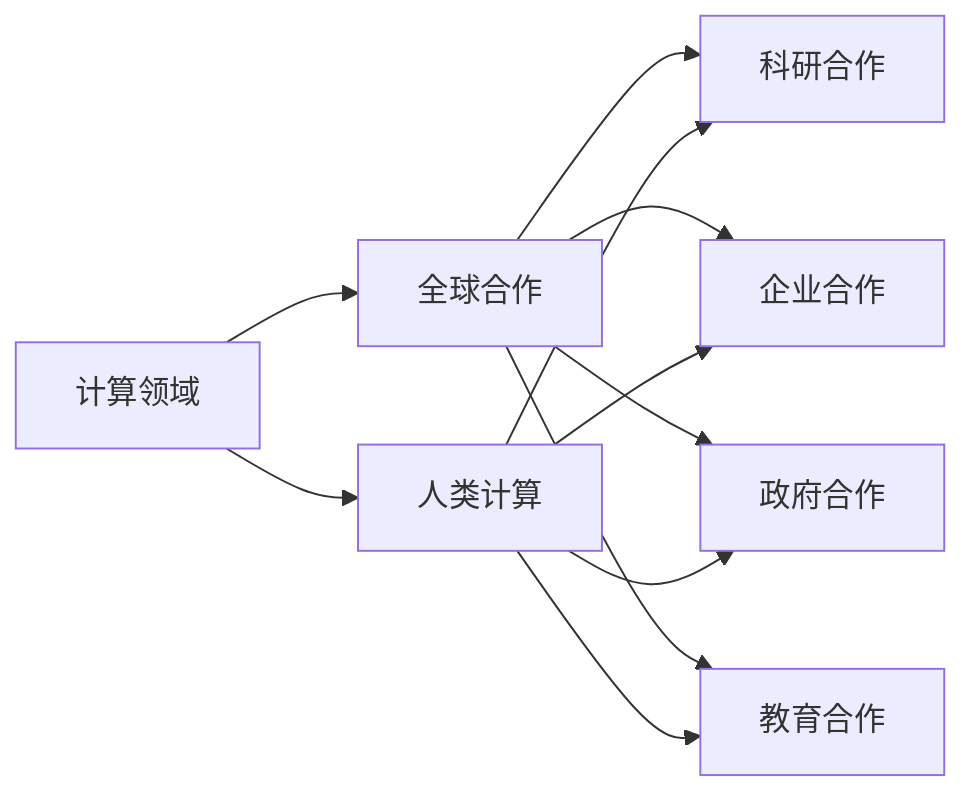

                 

# 全球合作：共同推动人类计算领域的进步

## 1. 背景介绍

在当今信息技术迅猛发展的时代，计算领域已成为驱动社会进步和经济发展的关键力量。作为计算领域的先驱，我们应充分认识到这一领域的全球合作潜力。全球计算合作不仅能够加速技术的研发和应用，更能在应对全球性挑战方面发挥重要作用。本文将深入探讨全球合作在人类计算领域的必要性、现有合作模式以及未来发展趋势。

## 2. 核心概念与联系

### 2.1 核心概念概述

为深入理解全球合作在计算领域的作用，我们首先需要明确几个核心概念：

- **计算领域（Computing Field）**：包括计算机硬件、软件、网络、数据、算法、人工智能等技术在内的领域。
- **全球合作（Global Collaboration）**：跨国组织、科研机构、企业及个人间的协同工作，共同推动计算技术的发展与应用。
- **人类计算（Human-Centric Computing）**：以人为中心，关注计算技术对社会、经济、环境等的影响，推动技术为人类带来更大福祉。

### 2.2 核心概念原理和架构的 Mermaid 流程图(Mermaid 流程节点中不要有括号、逗号等特殊字符)



这个流程图展示了计算领域、全球合作、科研合作、企业合作、政府合作及教育合作之间的逻辑联系。全球合作是计算领域内推动人类计算发展的核心驱动力，涉及科研、企业、政府和教育等多方面的协同合作。

## 3. 核心算法原理 & 具体操作步骤

### 3.1 算法原理概述

全球合作在计算领域内的核心算法原理主要包括以下几个方面：

1. **数据共享与协同计算**：跨国组织通过共享大数据集和协同计算平台，提升数据的利用效率，加速科学发现和技术创新。
2. **知识传播与教育普及**：通过跨国的教育和培训项目，促进计算技能和知识的普及，提升全球科研和技术人员的整体水平。
3. **开放源代码与标准制定**：推动开放源代码项目和标准的制定，促进技术交流与整合，降低技术壁垒。
4. **跨界合作与创新**：鼓励不同领域的专业人士跨界合作，推动技术在各行业的应用，实现技术的商业化和产业化。

### 3.2 算法步骤详解

全球合作的具体操作步骤可以概括为以下几个关键步骤：

1. **确定合作目标**：明确合作的方向和具体目标，如科研合作、技术交流、教育培训等。
2. **选择合作方**：根据目标选择合适的合作伙伴，包括科研机构、企业、政府、教育机构等。
3. **制定合作计划**：包括合作方式、任务分配、资源配置等具体安排。
4. **执行合作计划**：按照计划进行具体的工作，如数据共享、知识传播、协同计算等。
5. **评估与反馈**：定期评估合作效果，收集反馈信息，调整和优化合作计划。

### 3.3 算法优缺点

全球合作在推动人类计算领域发展的同时，也存在一些缺点：

- **复杂性高**：跨国合作涉及不同国家的法律、文化、语言等多重因素，协调难度大。
- **资源分配不均**：不同国家之间的资源和技术水平差异较大，资源分配不均衡。
- **安全与隐私问题**：跨国数据共享和合作可能涉及敏感数据，存在安全与隐私风险。
- **利益分配不均**：合作过程中利益分配不均，可能导致部分参与方积极性不足。

### 3.4 算法应用领域

全球合作在多个计算应用领域都有显著影响，包括但不限于：

1. **科学研究**：全球合作推动了大数据、人工智能、量子计算等前沿科技的研究进展。
2. **医疗健康**：通过跨国合作开发基于计算的医疗解决方案，提升全球医疗水平。
3. **环境保护**：利用计算技术监测和分析全球环境数据，推动全球环境保护。
4. **教育普及**：通过在线教育平台和跨国培训项目，提升全球教育水平。
5. **经济发展**：推动计算技术的全球应用，促进各国经济发展。

## 4. 数学模型和公式 & 详细讲解 & 举例说明

### 4.1 数学模型构建

全球合作在计算领域的数学模型通常包括：

- **协同计算模型**：描述多台计算机协同完成复杂计算任务的过程。
- **数据共享模型**：建模数据在不同机构间的共享机制。
- **知识传播模型**：描述知识在不同文化背景下的传播和接受过程。

### 4.2 公式推导过程

以数据共享模型为例，我们可以使用以下公式进行推导：

设 $S$ 为数据共享平台，$I$ 为参与方集合，$D$ 为数据集，$P$ 为数据共享政策。

$$
S=\sum_{i \in I}\sum_{d \in D}P_{i d}
$$

其中 $P_{i d}$ 表示第 $i$ 个参与方 $d$ 数据共享的概率。

### 4.3 案例分析与讲解

以谷歌AI的TPU为例，其构建了一个全球性的数据中心网络，实现了多个国家间的计算资源共享和协同计算。通过TPU网络，谷歌在全球范围内进行大规模机器学习和深度学习的计算，提升了数据利用效率，加速了科研和技术创新。

## 5. 项目实践：代码实例和详细解释说明

### 5.1 开发环境搭建

要实现全球计算合作的实践，需要搭建一个跨国的计算平台。以下是使用Python和Hadoop搭建一个基本计算平台的步骤：

1. 安装Hadoop：从官网下载安装包，安装到服务器上。
2. 安装Python：从官网下载安装包，安装到服务器上。
3. 配置环境变量：配置Python和Hadoop的环境变量，确保能够互相调用。

### 5.2 源代码详细实现

下面是一个简单的Python程序，用于数据共享的分布式计算：

```python
import multiprocessing
from multiprocessing import Pool

def distribute_computation(data):
    # 分布式计算代码
    pass

if __name__ == '__main__':
    # 数据集
    data = [1, 2, 3, 4, 5]
    # 创建进程池
    pool = Pool(processes=multiprocessing.cpu_count())
    # 分布式计算
    results = pool.map(distribute_computation, data)
    # 输出结果
    for result in results:
        print(result)
```

### 5.3 代码解读与分析

以上代码使用了Python的multiprocessing模块实现了简单的分布式计算。程序首先定义了一个distribute_computation函数，该函数将具体的数据计算逻辑封装在分布式计算中。接着，在主程序中创建了一个进程池，利用CPU的所有核心并行计算数据集，最后将结果输出。

### 5.4 运行结果展示

执行以上代码后，程序会输出数据集中的每个元素，展示了分布式计算的效果。

## 6. 实际应用场景

### 6.1 科学研究

全球合作在科学研究领域的应用尤为显著。例如，Einstein@Home项目利用全球志愿者的计算资源，搜寻宇宙中的射电脉冲信号，发现了多个新的脉冲星。该项目展示了全球合作在科学探索中的巨大潜力。

### 6.2 医疗健康

通过全球合作，多个国家和机构的科学家共同研发了一种新型抗疟疾药物，通过计算模拟验证了其有效性。这种跨国合作不仅加速了药物研发过程，也提升了全球抗疟疾的能力。

### 6.3 环境保护

利用计算技术，多个国家的环保组织联合监测全球气候变化。通过分析不同国家的环境数据，全球合作推动了气候变化问题的科学研究和政策制定。

### 6.4 未来应用展望

未来，全球合作在计算领域的应用将更加广泛和深入。例如：

1. **量子计算**：通过跨国合作，推动量子计算技术的全球发展，解决全球性的复杂计算问题。
2. **可持续发展**：利用计算技术监测和分析全球资源利用情况，推动可持续发展目标的实现。
3. **智能城市**：通过全球合作，推动智慧城市技术的发展，提升全球城市的智能化水平。

## 7. 工具和资源推荐

### 7.1 学习资源推荐

要深入理解全球合作在计算领域的应用，以下是一些推荐的资源：

1. 《计算思维：全球视角》（Computing for Global Impact）：介绍计算技术在全球范围内的应用和发展。
2. 《分布式计算：原理与实践》（Distributed Computing）：阐述分布式计算的基本原理和实践方法。
3. 《人工智能伦理：全球视野》（AI Ethics: A Global Perspective）：探讨人工智能技术在全球范围内的伦理问题。

### 7.2 开发工具推荐

为了推动全球合作，以下是一些推荐的开发工具：

1. Apache Hadoop：开源的分布式计算框架，支持跨机构的数据共享和协同计算。
2. TensorFlow：开源的深度学习框架，支持跨平台的模型训练和应用。
3. GitHub：全球最大的开源社区，支持全球科研和技术人员的协作开发。

### 7.3 相关论文推荐

以下是几篇重要的相关论文，推荐阅读：

1. "Global Collaboration in Scientific Computing"（全球科学计算的协作）：介绍全球科研计算的协作机制。
2. "Cross-Border Data Sharing in Healthcare"（跨国医疗数据共享）：探讨全球医疗数据共享的技术和政策。
3. "Human-Centric Computing: A Global Perspective"（以人为中心计算：全球视角）：探讨人类计算的全球合作和发展趋势。

## 8. 总结：未来发展趋势与挑战

### 8.1 研究成果总结

全球合作在推动人类计算领域的发展方面取得了显著成就，但仍然面临诸多挑战：

- 数据共享和隐私保护
- 跨国法律和政策协调
- 全球资源分配不均

### 8.2 未来发展趋势

未来，全球合作在计算领域的发展趋势包括：

1. 跨国协作平台建设：推动全球性的计算平台和基础设施建设，实现更高效的数据共享和协同计算。
2. 开放源代码与标准制定：推动更多开放源代码项目和标准的制定，促进技术交流与整合。
3. 多学科交叉融合：鼓励跨学科、跨领域的科研合作，推动计算技术在更多领域的应用。

### 8.3 面临的挑战

尽管全球合作在计算领域取得了显著进展，但仍然面临以下挑战：

1. 跨国法律和政策协调：不同国家的法律和政策差异，可能影响全球合作的顺利进行。
2. 数据安全和隐私保护：跨国数据共享可能涉及敏感数据，存在安全与隐私风险。
3. 资源分配不均：不同国家之间的资源和技术水平差异较大，资源分配不均衡。

### 8.4 研究展望

未来的研究应在以下几个方面寻求新的突破：

1. 推动跨国数据共享政策制定：制定全球性的数据共享政策，保障数据安全和隐私。
2. 提升全球计算平台的技术水平：推动全球计算平台的技术升级，提升计算效率和可靠性。
3. 促进跨学科科研合作：鼓励跨学科、跨领域的科研合作，推动计算技术在更多领域的应用。

## 9. 附录：常见问题与解答

**Q1：全球合作在计算领域有哪些具体应用？**

A: 全球合作在计算领域的应用包括：

1. 科学研究：如Einstein@Home项目，利用全球志愿者的计算资源，搜寻宇宙中的射电脉冲信号。
2. 医疗健康：多个国家和机构的科学家共同研发新型抗疟疾药物，提升全球抗疟疾能力。
3. 环境保护：利用计算技术监测和分析全球环境数据，推动环境保护。
4. 智能城市：通过全球合作，推动智慧城市技术的发展，提升全球城市的智能化水平。

**Q2：如何进行跨国数据共享和协同计算？**

A: 跨国数据共享和协同计算通常通过以下方式实现：

1. 建立全球性的数据共享平台：如Google AI的TPU网络，实现多国间的计算资源共享。
2. 制定数据共享政策：明确数据共享的原则和流程，保障数据安全和隐私。
3. 采用分布式计算框架：如Apache Hadoop，支持大规模的分布式计算任务。

**Q3：全球合作面临哪些挑战？**

A: 全球合作在计算领域面临的挑战包括：

1. 跨国法律和政策协调：不同国家的法律和政策差异，可能影响全球合作的顺利进行。
2. 数据安全和隐私保护：跨国数据共享可能涉及敏感数据，存在安全与隐私风险。
3. 资源分配不均：不同国家之间的资源和技术水平差异较大，资源分配不均衡。

**Q4：如何推动全球合作在计算领域的发展？**

A: 推动全球合作在计算领域的发展，可以从以下几个方面入手：

1. 建立全球性的计算平台：如Google AI的TPU网络，实现多国间的计算资源共享。
2. 推动开放源代码项目和标准的制定：如TensorFlow，促进技术交流与整合。
3. 鼓励跨学科、跨领域的科研合作：如多国科学家共同研发新型抗疟疾药物，推动计算技术在更多领域的应用。

---

作者：禅与计算机程序设计艺术 / Zen and the Art of Computer Programming

