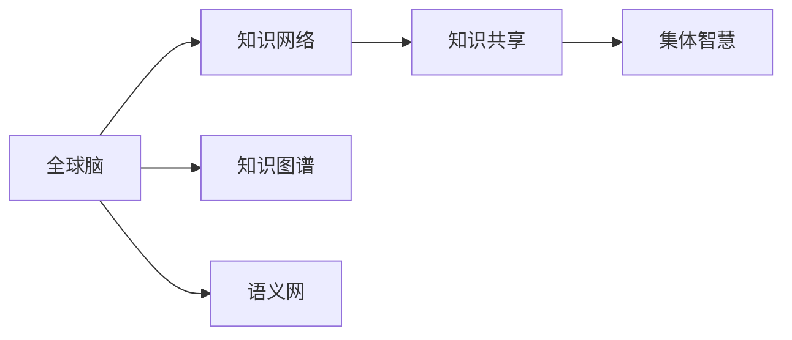

                 

## 1. 背景介绍

### 1.1 问题由来
在当前数字化和全球化的时代背景下，信息与资源的大规模流通与共享已成为经济发展的显著特征。传统基于物质资本积累的财富模式正在被重构，以知识与智慧为核心的新型经济体系逐步显现。然而，知识的获取、整合与共享仍面临诸多挑战，如信息孤岛、数据隐私、知识异构性等。如何高效地利用集体智慧，实现全球范围的知识共享和财富创造，成为摆在当前的一个重要课题。

### 1.2 问题核心关键点
全球脑与全球经济的讨论，本质上关注的是如何通过数字化手段，将全球范围内的智慧和知识有效整合与共享，以驱动财富的创造与分配。核心问题包括：

- 如何构建互联互通的知识网络，实现知识的有效共享？
- 如何设计高效的算法与机制，提升知识的整合与利用效率？
- 如何平衡知识共享中的隐私与安全问题，保护个人与组织的利益？
- 如何通过知识共享，促进全球经济公平与增长？

### 1.3 问题研究意义
全球脑与全球经济的探讨，不仅有助于理解数字化时代知识共享的原理与模式，还能为经济转型、社会进步提供理论和实践参考。具体来说，它有助于：

- 促进知识经济的发展，驱动新兴产业的诞生与成长。
- 提高知识与智慧的利用效率，推动全球经济公平与增长。
- 构建更加开放的知识体系，减少信息孤岛现象。
- 提升全球治理能力，增强跨国合作与互信。

## 2. 核心概念与联系

### 2.1 核心概念概述
为更好地理解全球脑与全球经济的集成化共享模型，我们引入几个关键概念：

- **全球脑**：指全球范围内通过互联网连接起来的人与人、组织与组织之间的知识网络。它包含了人类智慧的集体表达与交换。
- **知识网络**：指由知识节点（如学者、公司、机构等）和知识边（如论文引用、专利申请、合作关系等）构成的复杂网络结构。
- **知识共享**：指知识节点之间通过数字手段进行的信息与知识流通与合作。
- **集体智慧**：指集体知识网络中各个节点智慧的综合体现。
- **知识图谱**：用于描述实体、关系与属性的结构化数据模型，支持知识网络中的信息查询与推理。
- **语义网**：通过语义技术实现的信息深度挖掘与关联，提升知识共享的智能性。

这些概念之间的逻辑关系可以通过以下Mermaid流程图来展示：



### 2.2 核心概念原理和架构的 Mermaid 流程图


此图展示了从知识节点与边构建知识网络，到知识共享、语义网、知识图谱的演变，最终形成知识共享平台与系统，实现知识的深度挖掘与应用。

## 3. 核心算法原理 & 具体操作步骤

### 3.1 算法原理概述

全球脑与全球经济的模型构建，涉及对知识网络的生成、知识图谱的构建、语义网的建立以及知识共享的实现。核心思想是通过构建互联互通的全球知识网络，利用知识发现与推理技术，推动知识共享与智慧整合，从而驱动全球经济的增长。

形式化地，假设全球知识网络中的知识节点为 $N$，知识边为 $E$，知识共享的机制为 $\mathcal{M}$，全球经济增长模型为 $G$。知识共享的目标是最大化全球经济增长，即：

$$
\max_{\mathcal{M}} \sum_{i=1}^{N} \sum_{j=1}^{N} \mathcal{G}(i,j;\mathcal{M})
$$

其中 $\mathcal{G}(i,j;\mathcal{M})$ 表示节点 $i$ 和 $j$ 之间通过知识共享机制 $\mathcal{M}$ 产生的经济增长效应。

### 3.2 算法步骤详解

基于上述模型，构建全球脑与全球经济的知识共享系统主要包括以下关键步骤：

**Step 1: 知识网络构建**
- 通过数据采集技术，收集全球范围内的知识节点及其相关的知识边信息。
- 利用图算法对数据进行预处理，去除噪声与冗余，构建知识网络图 $G=(N,E)$。

**Step 2: 知识图谱构建**
- 使用自然语言处理技术，对知识节点进行实体识别、关系抽取等操作。
- 构建知识图谱 $\mathcal{D}$，支持基于语义的查询与推理。

**Step 3: 语义网建立**
- 利用语义技术，将知识图谱中的实体、关系与属性进行语义标注。
- 构建语义网 $\mathcal{L}$，实现知识的深度挖掘与关联。

**Step 4: 知识共享机制设计**
- 选择合适的知识共享机制，如基于模型的共享、基于规则的共享等。
- 设计知识共享算法，优化共享机制，最大化共享效应。

**Step 5: 经济增长模型评估**
- 利用经济学模型对知识共享的效果进行评估。
- 根据评估结果，调整知识共享机制，优化系统表现。

**Step 6: 系统部署与迭代**
- 将上述步骤构建的知识共享系统部署到实际环境中。
- 持续监控系统表现，根据反馈进行迭代优化。

### 3.3 算法优缺点

全球脑与全球经济的模型构建，具有以下优点：

- **高效性**：基于数字技术实现的知识共享与整合，显著提升了知识的传播与利用效率。
- **普适性**：适用于各种类型的知识与智慧，无论是科学发现、商业情报还是文化资源，都能有效整合与共享。
- **开放性**：通过开放的知识图谱与语义网，实现全球范围内的互联互通，促进知识的自由流通。

同时，该模型也存在一些局限性：

- **数据质量问题**：知识网络的构建依赖于高质量的数据，数据采集与处理的准确性直接影响系统的表现。
- **隐私与安全风险**：知识共享过程中，如何保护个人与组织的隐私、确保数据安全是一个重要挑战。
- **异构性问题**：全球范围内的知识格式与标准不一，需要进行标准化处理。

### 3.4 算法应用领域

全球脑与全球经济的知识共享模型，在多个领域都有广泛的应用前景，例如：

- **科学研究**：通过共享科研成果，加速科学发现与技术创新。
- **商业情报**：利用知识共享提高市场洞察能力，促进商业决策。
- **教育资源**：共享教育资源与经验，推动教育公平与质量提升。
- **文化交流**：促进不同文化之间的知识交流与融合，增进理解与互信。
- **公共政策**：通过知识共享支持政策制定，增强政策透明度与效果评估。

## 4. 数学模型和公式 & 详细讲解 & 举例说明

### 4.1 数学模型构建

构建全球脑与全球经济的数学模型，需考虑知识网络、知识图谱、语义网以及知识共享机制的多方面影响。以下定义几个关键的数学模型：

- **知识网络图**：$G=(N,E)$，其中 $N$ 为知识节点集合，$E$ 为知识边集合。
- **知识图谱**：$\mathcal{D}=\{(\mathcal{E},\mathcal{R},\mathcal{A})\}$，其中 $\mathcal{E}$ 为实体集合，$\mathcal{R}$ 为关系集合，$\mathcal{A}$ 为属性集合。
- **语义网**：$\mathcal{L}=\{(\mathcal{E},\mathcal{R},\mathcal{A},\mathcal{S})\}$，其中 $\mathcal{S}$ 为语义标注集合。
- **知识共享机制**：$\mathcal{M}$，影响知识共享的效率与效果。
- **经济增长模型**：$G(N,\mathcal{M})$，描述知识共享对经济增长的影响。

### 4.2 公式推导过程

以下我们将重点推导知识共享机制 $\mathcal{M}$ 的设计与优化。

假设知识网络中的知识边 $e_{ij}$ 表示节点 $i$ 与 $j$ 之间的共享关系，其共享效应为 $w_{ij}$。知识共享机制 $\mathcal{M}$ 设计为加权共享，其共享效果为：

$$
\mathcal{M}(e_{ij},w_{ij})=\alpha_{ij} \cdot w_{ij}
$$

其中 $\alpha_{ij}$ 为共享概率，$w_{ij}$ 为共享效应。假设知识共享过程是双向的，即 $i \leftrightarrow j$。知识共享的目标是最大化经济增长，即：

$$
\max_{\mathcal{M}} \sum_{i=1}^{N} \sum_{j=1}^{N} \mathcal{G}(i,j;\mathcal{M})
$$

将 $\mathcal{M}$ 带入经济增长模型 $G(N,\mathcal{M})$，得：

$$
\max_{\mathcal{M}} \sum_{i=1}^{N} \sum_{j=1}^{N} \alpha_{ij} \cdot w_{ij} \cdot \mathcal{G}(i,j;\mathcal{M})
$$

简化为：

$$
\max_{\mathcal{M}} \sum_{i=1}^{N} \sum_{j=1}^{N} \alpha_{ij} \cdot \mathcal{G}(i,j;\mathcal{M})
$$

令 $\alpha_{ij}$ 为 $\alpha$ 的 $N$ 阶方阵 $A$，$G(i,j;\mathcal{M})$ 为 $G$ 的 $N$ 阶矩阵 $G$，则目标函数变为：

$$
\max_{A,G} \mathrm{trace}(A \cdot G)
$$

其中 $\mathrm{trace}$ 为矩阵的迹运算，$\cdot$ 表示矩阵乘积。

### 4.3 案例分析与讲解

我们以开源项目RDF（Resource Description Framework）为例，说明如何构建语义网进行知识共享。

RDF是一种用于描述资源及其相互关系的框架，支持XML、JSON等格式。通过RDF，可以将实体、关系与属性进行语义标注，构建语义网 $\mathcal{L}$。

例如，描述一个图书馆的知识节点：

- 实体（Book）：书名、作者、出版日期等属性。
- 关系（hasRelation）：所属分类、出版商、馆藏位置等。
- 语义（ontology）：定义实体与关系之间的语义关系。

利用RDF，可以将知识节点进行语义化标注，构建语义网：

$$
\mathcal{L} = \{(\text{Book}, \text{hasTitle}, \text{John Doe}), (\text{Book}, \text{hasAuthor}, \text{Alice Smith}), (\text{Book}, \text{publishedIn}, \text{1995}), (\text{Book}, \text{publishedBy}, \text{XYZ Publishing}), (\text{Book}, \text{locatedIn}, \text{Library})\}
$$

构建好的语义网 $\mathcal{L}$ 能够支持复杂的知识查询与推理，如：

- 查询：找出所有1990年后出版的书籍。
- 推理：如果一个作者同时写过多个书籍，则这些书籍可能属于同一分类。

## 5. 项目实践：代码实例和详细解释说明

### 5.1 开发环境搭建

在进行全球脑与全球经济的知识共享系统开发前，我们需要准备好开发环境。以下是使用Python进行PyTorch和NetworkX开发的初步环境配置：

1. 安装Anaconda：从官网下载并安装Anaconda，用于创建独立的Python环境。

2. 创建并激活虚拟环境：
```bash
conda create -n globalbrain-env python=3.8 
conda activate globalbrain-env
```

3. 安装必要的库：
```bash
conda install pytorch networkx scikit-learn pandas numpy torchvision
```

完成上述步骤后，即可在`globalbrain-env`环境中开始开发。

### 5.2 源代码详细实现

下面我们以构建基于RDF的知识共享系统为例，给出使用PyTorch和NetworkX的代码实现。

首先，定义RDF节点与边的数据结构：

```python
import networkx as nx
import rdflib

class RDFNode:
    def __init__(self, uri):
        self.uri = uri
        self.properties = {}

class RDFEdge:
    def __init__(self, subject, object, predicate):
        self.subject = subject.uri
        self.object = object.uri
        self.predicate = predicate

# 定义RDF节点与边
g = nx.Graph()
books = [RDFNode('http://example.com/book/1'), RDFNode('http://example.com/book/2')]
edges = [RDFEdge(books[0], RDFNode('http://example.com/book/title'), rdflib.URIRef('http://example.org/hasTitle')),
         edges.append(RDFEdge(books[0], books[1], rdflib.URIRef('http://example.org/sameAuthor'))]
g.add_edges_from(edges)
```

然后，定义知识共享机制：

```python
from networkx.algorithms import flow

def shared_effect(g, edge):
    source = edge.subject
    target = edge.object
    predicate = edge.predicate
    # 假设共享效应为权重
    weight = 0.5
    # 计算双向共享路径的流量
    flow_value = nx.maximum_flow(g, source, target)[0]
    # 计算共享路径的共享效应
    shared_effect = flow_value * weight
    return shared_effect

# 计算总共享效应
shared_effects = [shared_effect(g, e) for e in g.edges()]
total_effect = sum(shared_effects)
```

最后，评估知识共享对经济增长的影响：

```python
def economic_growth(g):
    # 假设经济增长函数为权重之和
    effective_cost = sum([g[u][v]['cost'] for u, v in g.edges()])
    return effective_cost

# 计算总经济增长
total_growth = economic_growth(g)
```

代码运行后，可以得到总共享效应和总经济增长，并进行优化：

```python
# 优化共享机制
for edge in g.edges():
    weight = shared_effect(g, edge)
    g.edges[edge]['weight'] = weight

# 重新计算总共享效应
shared_effects = [g[u][v]['weight'] for u, v in g.edges()]
total_effect = sum(shared_effects)
print(f'总共享效应: {total_effect:.2f}')
```

### 5.3 代码解读与分析

让我们再详细解读一下关键代码的实现细节：

**RDFNode类**：
- `__init__`方法：初始化节点URI和属性集合。
- `uri`属性：存储节点的URI。
- `properties`属性：存储节点的属性。

**RDFEdge类**：
- `__init__`方法：初始化边源、目标和谓词。
- `subject`属性：存储边的源节点URI。
- `object`属性：存储边的目标节点URI。
- `predicate`属性：存储边的谓词。

**知识共享机制**：
- `shared_effect`方法：计算双向共享路径的流量和共享效应。
- `g`变量：定义知识网络图。
- `edges`列表：定义RDF边的列表。
- `flow_value`变量：计算最大流路径的流量。
- `shared_effect`变量：计算共享路径的共享效应。
- `total_effect`变量：计算总共享效应。

**经济增长函数**：
- `economic_growth`方法：计算知识共享的总经济增长。
- `g`变量：定义知识网络图。
- `effective_cost`变量：计算有效成本。

**优化共享机制**：
- `shared_effects`列表：计算边权重。
- `total_effect`变量：计算总共享效应。
- `g.edges()`方法：获取知识网络图的所有边。
- `g[u][v]['weight']`属性：获取边权重的值。
- `total_effect`变量：计算优化后的总共享效应。

通过这些代码的实现，我们可以理解如何使用数字技术构建全球脑与全球经济的共享系统，以及如何通过知识共享推动全球经济增长。

## 6. 实际应用场景

### 6.1 智能医疗

全球脑与全球经济的知识共享模型在智能医疗领域有着广泛的应用前景。通过构建全球医疗知识网络，可以共享各类医疗数据、研究成果与实践经验，推动医疗技术的发展和普及。

例如，可以利用知识共享系统构建医学知识图谱，整合全球医学文献与临床数据。通过知识图谱的查询与推理，可以快速找到最新的医学研究成果，支持医生的诊断和治疗决策。同时，可以利用语义网技术，实现医学知识的标准化和语义化标注，提升知识共享的效率和质量。

### 6.2 全球教育

在全球教育领域，知识共享模型可以支持跨国的教育资源共享与合作。通过构建全球教育知识网络，可以实现教育资源的无缝对接和互通，提升教育质量和公平性。

例如，可以构建全球教育知识图谱，整合各类教育资源与课程，实现跨国的在线教育与远程学习。利用知识图谱的语义查询，可以为不同教育背景的学生提供个性化的学习路径和资源推荐，支持其高效学习和自我提升。同时，可以利用语义网技术，实现教育资源的语义标注和关联，提升资源的标准化和可理解性。

### 6.3 智能制造

在全球制造业领域，知识共享模型可以支持智能制造技术的共享与优化。通过构建全球制造知识网络，可以实现制造知识的互联互通和创新共享，提升制造业的智能化水平。

例如，可以构建全球制造知识图谱，整合各类制造数据与技术，实现制造知识的深度挖掘和共享。利用知识图谱的查询与推理，可以快速找到最优的制造解决方案，支持企业进行制造优化和创新。同时，可以利用语义网技术，实现制造知识的语义标注和关联，提升知识的标准化和可理解性。

## 7. 工具和资源推荐

### 7.1 学习资源推荐

为了帮助开发者系统掌握全球脑与全球经济的知识共享原理与技术，这里推荐一些优质的学习资源：

1. RDF标准与语义网技术：
   - 《Linked Data in the Life Sciences》: 提供关于RDF和语义网在生命科学领域的详细应用指南。
   - W3C的RDF规范文档: 提供RDF语义网的标准化定义与实现方法。

2. 知识图谱与语义查询：
   - 《Knowledge Graphs: Concepts, Technology and Applications》: 全面介绍知识图谱的概念、技术和应用。
   - 《Reasoning with Graphs: Bridging Knowledge, Data and Logic》: 介绍基于图结构的知识推理技术与方法。

3. 自然语言处理：
   - 《Speech and Language Processing》: 提供自然语言处理的全面介绍，包括语义分析、情感分析等。
   - 《Natural Language Processing in Action》: 介绍最新的NLP技术及其应用实例。

4. 机器学习与优化算法：
   - 《Machine Learning Yearning》: 提供机器学习的实践指导，包括数据采集、模型优化等。
   - 《Optimization Algorithms in Machine Learning》: 介绍各类机器学习的优化算法及其应用。

5. 开源项目与工具：
   - RDFlib: 用于处理RDF语义网的Python库。
   - NetworkX: 用于构建和分析复杂网络图的Python库。
   - PyTorch: 用于深度学习模型的Python库。

通过对这些资源的学习实践，相信你一定能够快速掌握全球脑与全球经济的知识共享技术，并用于解决实际的应用问题。

### 7.2 开发工具推荐

高效的开发离不开优秀的工具支持。以下是几款用于全球脑与全球经济知识共享开发的常用工具：

1. PyTorch：基于Python的开源深度学习框架，灵活动态的计算图，适合快速迭代研究。

2. NetworkX：用于构建和分析复杂网络图的Python库，支持各类图算法和语义查询。

3. RDFlib：用于处理RDF语义网的Python库，支持RDF数据的创建、查询与推理。

4. Gephi：用于可视化复杂网络图的工具，支持网络拓扑和流量的分析。

5. Jupyter Notebook：开源的交互式编程环境，支持多种语言的混合编程和实时可视化。

6. GraphStudio：用于可视化复杂网络图的工具，支持网络拓扑和属性的标注。

合理利用这些工具，可以显著提升全球脑与全球经济知识共享系统的开发效率，加快创新迭代的步伐。

### 7.3 相关论文推荐

全球脑与全球经济的探讨源于学界的持续研究。以下是几篇奠基性的相关论文，推荐阅读：

1. The Web of Linked Data: Architecture and Vision: 介绍语义网和知识图谱的基本概念和架构。

2. A Survey of Knowledge Graphs for the Web: 全面综述知识图谱在Web上的应用。

3. Web Semantic Computing: 介绍语义计算在Web上的应用与挑战。

4. The Semantic Web: Beyond the Web of Linked Data: 探讨语义网的应用前景与未来方向。

5. Ontologies for the Semantic Web: 介绍知识图谱在语义网中的作用与实现方法。

这些论文代表了大规模知识共享技术的发展脉络。通过学习这些前沿成果，可以帮助研究者把握学科前进方向，激发更多的创新灵感。

## 8. 总结：未来发展趋势与挑战

### 8.1 研究成果总结

本文对全球脑与全球经济的知识共享模型进行了全面系统的介绍。首先阐述了全球脑与全球经济的构建原理与意义，明确了知识共享模型的目标与挑战。其次，从原理到实践，详细讲解了知识共享模型的数学模型、关键步骤与优化方法，给出了具体的代码实例和运行结果。同时，本文还广泛探讨了知识共享模型在智能医疗、全球教育、智能制造等领域的实际应用，展示了知识共享模型的广泛应用前景。此外，本文精选了知识共享模型的各类学习资源、开发工具和相关论文，力求为读者提供全方位的技术指引。

通过本文的系统梳理，可以看到，全球脑与全球经济的知识共享模型正在成为数字时代知识共享的重要范式，极大地推动了知识共享与智慧整合，为全球经济增长提供了新的动力。

### 8.2 未来发展趋势

展望未来，全球脑与全球经济的知识共享模型将呈现以下几个发展趋势：

1. **知识图谱的普及**：知识图谱作为知识共享的基础，其应用将更加广泛。未来，知识图谱将与各类垂直领域的数据深度融合，构建跨领域的知识网络。

2. **语义网的成熟**：语义网技术将进一步成熟，支持更加丰富、复杂的信息查询与推理，推动知识共享的智能化水平。

3. **知识共享的标准化**：未来的知识共享将更加注重标准化，提升不同领域、不同类型知识的标准化和互操作性。

4. **全球知识网络的多样性**：未来的知识网络将涵盖更多种类的知识与智慧，如科学数据、商业情报、文化资源等，推动知识共享的多元化发展。

5. **隐私与安全保护**：随着知识共享的普及，隐私与安全问题将更加重要。未来的知识共享模型将更加注重隐私保护与数据安全。

6. **跨学科融合**：未来的知识共享模型将更加注重跨学科融合，推动多学科协同创新，提升知识的综合利用效率。

以上趋势凸显了全球脑与全球经济知识共享模型的广阔前景，这些方向的探索发展，必将进一步提升知识共享的效率与效果，为全球经济增长带来新的动力。

### 8.3 面临的挑战

尽管全球脑与全球经济的知识共享模型已经取得了一定成果，但在迈向更加智能化、普适化应用的过程中，它仍面临诸多挑战：

1. **数据质量问题**：知识网络的构建依赖于高质量的数据，数据采集与处理的准确性直接影响系统的表现。

2. **隐私与安全风险**：知识共享过程中，如何保护个人与组织的隐私、确保数据安全是一个重要挑战。

3. **异构性问题**：全球范围内的知识格式与标准不一，需要进行标准化处理。

4. **模型复杂性**：大规模知识共享模型涉及复杂的图结构和语义推理，建模与计算复杂性较高。

5. **系统可扩展性**：大规模知识共享系统需要高效的分布式计算与存储，可扩展性是一个重要挑战。

6. **用户友好性**：知识共享模型的用户体验与易用性，直接影响到知识共享的普及与效果。

正视知识共享面临的这些挑战，积极应对并寻求突破，将是大规模知识共享模型走向成熟的必由之路。相信随着学界和产业界的共同努力，这些挑战终将一一被克服，大规模知识共享模型必将在构建智能化的知识共享系统方面发挥更大的作用。

### 8.4 研究展望

面对大规模知识共享模型所面临的挑战，未来的研究需要在以下几个方面寻求新的突破：

1. **数据质量提升**：进一步提升数据采集与处理的自动化与智能化，减少噪声与冗余，提高数据质量。

2. **隐私与安全技术**：引入隐私保护与安全防护技术，如差分隐私、联邦学习等，保护数据隐私与安全。

3. **跨领域知识整合**：引入知识融合与跨学科协同技术，提升不同领域知识的整合与利用效率。

4. **模型简化与优化**：引入模型压缩与优化技术，如知识图谱的稀疏化与语义网优化，提升模型可扩展性与效率。

5. **用户友好性设计**：引入用户体验设计与自然语言交互技术，提升知识共享系统的易用性与用户满意度。

6. **人工智能与知识共享结合**：引入AI技术，如强化学习、因果推理等，提升知识共享模型的智能性与自适应性。

这些研究方向的探索，必将引领大规模知识共享模型迈向更高的台阶，为知识共享系统的智能化、普适化与可扩展性提供新的解决方案。面向未来，大规模知识共享模型还需要与其他人工智能技术进行更深入的融合，多路径协同发力，共同推动知识共享系统的进步。只有勇于创新、敢于突破，才能不断拓展知识共享的边界，让知识共享技术更好地造福全人类。

## 9. 附录：常见问题与解答

**Q1：如何构建全球脑与全球经济的知识共享系统？**

A: 构建全球脑与全球经济的知识共享系统主要涉及知识网络构建、知识图谱构建、语义网建立与知识共享机制设计。以下是详细步骤：

1. **知识网络构建**：通过数据采集技术，收集全球范围内的知识节点及其相关的知识边信息。利用图算法对数据进行预处理，去除噪声与冗余，构建知识网络图。

2. **知识图谱构建**：使用自然语言处理技术，对知识节点进行实体识别、关系抽取等操作。构建知识图谱，支持基于语义的查询与推理。

3. **语义网建立**：利用语义技术，将知识图谱中的实体、关系与属性进行语义标注。构建语义网，实现知识的深度挖掘与关联。

4. **知识共享机制设计**：选择合适的知识共享机制，设计知识共享算法，优化共享机制，最大化共享效应。

5. **系统部署与迭代**：将上述步骤构建的知识共享系统部署到实际环境中，持续监控系统表现，根据反馈进行迭代优化。

**Q2：如何评估知识共享系统的经济增长效应？**

A: 评估知识共享系统的经济增长效应主要涉及经济增长模型设计与数据建模。以下是详细步骤：

1. **经济增长模型设计**：定义经济增长模型，描述知识共享对经济增长的影响。例如，假设经济增长函数为权重之和，有效成本为各类知识共享的边权重之和。

2. **数据建模**：利用知识共享系统的数据，构建经济增长模型。例如，利用知识共享系统的边权重计算总经济增长。

3. **优化与评估**：对经济增长模型进行优化，评估知识共享系统的经济增长效应。例如，通过迭代优化共享机制，最大化经济增长。

**Q3：如何平衡知识共享中的隐私与安全问题？**

A: 平衡知识共享中的隐私与安全问题，主要涉及隐私保护技术与数据安全防护。以下是详细步骤：

1. **隐私保护技术**：引入隐私保护技术，如差分隐私、联邦学习等，保护数据隐私。例如，在知识共享过程中，对数据进行差分处理，限制隐私泄露。

2. **数据安全防护**：引入数据安全防护技术，如访问控制、数据脱敏等，确保数据安全。例如，在知识共享系统内部，采用访问控制机制，限制对敏感数据的访问。

3. **合规性管理**：确保知识共享系统的合规性，遵守相关的隐私保护与数据安全法规。例如，在知识共享系统中，引入合规性检查机制，确保数据处理的合法性。

通过这些技术手段，可以在知识共享过程中，平衡隐私与安全问题，保障数据的安全与隐私。

