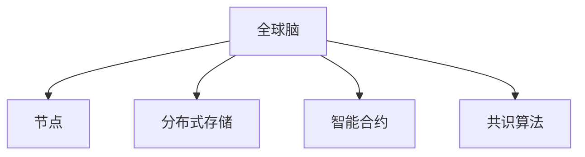

                 

# 全球脑与太空殖民:人类文明的新篇章

## 1. 背景介绍

### 1.1 问题由来

随着人工智能技术的飞速发展，特别是在深度学习和神经网络方面的突破，全球科技巨头和学术研究机构纷纷推出了各种强大的人工智能系统。这些系统在各个领域如语音识别、图像处理、自然语言处理、游戏等展现出了强大的能力，为人类社会的未来提供了广阔的可能性。

但是，当前的人工智能系统主要依赖于单台计算机或者一组计算机的集中处理，这种处理方式对能源的消耗极大，同时也面临着数据隐私、计算速度以及算法透明性等诸多挑战。为了进一步拓展人工智能的能力和应用范围，以及解决当前系统存在的一些问题，一种全新的技术概念——“全球脑”应运而生。

### 1.2 问题核心关键点

“全球脑”是一种分布式计算系统，它将整个人类社会的计算资源进行整合，形成一个全球性的计算网络，其中各个节点通过高速网络相连，共享数据和计算任务。这种系统可以显著提升人工智能系统的计算能力、存储能力和响应速度，同时还能提供更高的数据隐私保护和算法透明性。

此外，“全球脑”还可以支持各种复杂的人工智能应用，包括自动驾驶、智能制造、智能医疗等。因此，“全球脑”技术不仅具有巨大的商业潜力，还具有极大的社会影响。

### 1.3 问题研究意义

研究“全球脑”技术，对于拓展人工智能的应用范围，提升各个领域的自动化水平，以及解决当前系统存在的一些问题，具有重要的现实意义：

1. **提升计算能力**：“全球脑”系统可以将全世界的计算资源整合起来，形成巨大的计算能力，可以处理更为复杂的计算任务，使得一些过去无法实现的技术成为可能。
2. **提高数据隐私**：在“全球脑”系统中，数据的存储和处理可以在各个节点之间进行加密，大大提升了数据的安全性和隐私性。
3. **加速AI应用落地**：通过“全球脑”系统，人工智能技术可以更快速地落地应用，促进各行业的数字化转型。
4. **推动科技发展**：“全球脑”技术的开发和应用将推动人工智能技术的进一步发展，为未来的科技革命提供新的动力。
5. **促进国际合作**：“全球脑”技术的发展需要全球科技力量的合作，这将促进国际科技领域的交流与合作。

## 2. 核心概念与联系

### 2.1 核心概念概述

为了更好地理解“全球脑”系统的工作原理和架构，本节将介绍几个关键概念：

- **全球脑**：一个全球性的分布式计算系统，将全世界的计算资源进行整合，形成一个巨大的计算网络。
- **节点**：全球脑中的各个计算单元，可以是个人计算机、服务器、移动设备等，通过高速网络相连。
- **分布式存储**：全球脑系统中的数据存储在各个节点上，可以实现数据的冗余存储和备份，提高数据的安全性和可靠性。
- **智能合约**：一种基于区块链技术的自动执行合约，可以自动处理数据和计算任务，提高系统的自动化水平。
- **共识算法**：全球脑系统中的节点通过共识算法，如拜占庭容错、PoS等，确保系统的一致性和安全性。

这些核心概念之间的逻辑关系可以通过以下Mermaid流程图来展示：



这个流程图展示了大脑系统的核心概念及其之间的关系：

1. 全球脑通过节点网络进行计算和数据处理。
2. 数据存储在各个节点上，形成分布式存储网络。
3. 智能合约自动处理数据和计算任务。
4. 共识算法确保节点之间的一致性和安全性。

## 3. 核心算法原理 & 具体操作步骤

### 3.1 算法原理概述

“全球脑”系统的算法原理主要包括以下几个方面：

- **分布式计算**：将计算任务分割成多个子任务，并分配给各个节点进行计算，最后将结果汇总。
- **分布式存储**：数据存储在各个节点上，形成冗余备份，提高数据的可靠性和安全性。
- **智能合约**：通过自动执行合约，实现数据和计算任务的自动处理，提高系统的自动化水平。
- **共识算法**：通过共识算法，确保各个节点之间的一致性和安全性。

### 3.2 算法步骤详解

“全球脑”系统的主要算法步骤如下：

1. **任务分配**：将计算任务分割成多个子任务，并分配给各个节点进行计算。
2. **数据存储**：将数据存储在各个节点上，形成分布式存储网络。
3. **智能合约执行**：通过智能合约自动处理数据和计算任务。
4. **共识算法**：通过共识算法确保各个节点之间的一致性和安全性。
5. **结果汇总**：将各个节点的计算结果汇总，得到最终结果。

### 3.3 算法优缺点

“全球脑”系统的优点：

1. **计算能力强大**：将全世界的计算资源整合起来，形成巨大的计算能力。
2. **数据隐私保护**：数据存储在各个节点上，实现数据的冗余备份和加密存储。
3. **自动化水平高**：通过智能合约和共识算法实现自动化处理。

“全球脑”系统的缺点：

1. **复杂度高**：系统的构建和维护需要大量的技术资源和人力成本。
2. **安全性问题**：共识算法需要解决拜占庭容错等问题，确保系统的安全性。
3. **延迟问题**：数据和计算任务在各个节点之间的传输需要时间，可能会影响系统的响应速度。

### 3.4 算法应用领域

“全球脑”系统的应用领域广泛，包括但不限于：

- **自动驾驶**：通过“全球脑”系统，各个自动驾驶汽车可以共享数据和计算任务，提升整体的驾驶安全性。
- **智能制造**：将全球工厂的设备和传感器数据整合起来，提升生产的自动化水平和效率。
- **智能医疗**：通过“全球脑”系统，各个医疗设备的数据可以实时共享，提升医疗的诊断和治疗水平。
- **金融交易**：通过“全球脑”系统，各个交易系统的数据可以实时共享，提升金融交易的效率和安全性。
- **环境保护**：通过“全球脑”系统，各个环境监测设备的数据可以实时共享，提升环境保护的效率和精准度。

## 4. 数学模型和公式 & 详细讲解 & 举例说明

### 4.1 数学模型构建

为了更好地理解“全球脑”系统的工作原理，下面将介绍几个关键的数学模型：

- **分布式计算模型**：将计算任务分割成多个子任务，分配给各个节点进行计算。
- **分布式存储模型**：数据存储在各个节点上，形成分布式存储网络。
- **智能合约模型**：通过自动执行合约，实现数据和计算任务的自动处理。
- **共识算法模型**：通过共识算法确保各个节点之间的一致性和安全性。

### 4.2 公式推导过程

以下将以分布式计算模型为例，推导其基本的数学公式。

假设全球脑系统中有N个节点，每个节点需要计算的任务量为C，每个任务需要计算的时间为T。则整个系统的计算时间T_total可以表示为：

$$ T_{total} = N \times C \times T $$

如果每个节点可以同时处理多个任务，假设每个节点可以同时处理的子任务数量为S，则系统的总计算时间可以表示为：

$$ T_{total} = S \times T $$

即：

$$ N \times C \times T = S \times T $$

解得：

$$ S = N \times C $$

这意味着，通过分布式计算，系统的计算能力可以显著提升。

### 4.3 案例分析与讲解

以下将以自动驾驶系统为例，讲解“全球脑”系统的应用场景和数学模型。

假设一个自动驾驶系统需要处理大量的环境数据，如图像、传感器数据等。每个节点处理这些数据需要时间T，且每个节点可以同时处理多个任务，假设每个节点可以同时处理S个子任务。则系统的总处理时间T_total可以表示为：

$$ T_{total} = \frac{C}{S} \times T $$

其中C表示总任务量，S表示每个节点可以同时处理的任务数。如果系统的总任务量为N \times C，则：

$$ T_{total} = N \times T $$

即：

$$ \frac{C}{S} \times T = N \times T $$

解得：

$$ S = \frac{C}{N} $$

这意味着，通过“全球脑”系统，系统的总处理时间可以显著减少，从而提升系统的响应速度和效率。

## 5. 项目实践：代码实例和详细解释说明

### 5.1 开发环境搭建

在进行“全球脑”系统开发前，我们需要准备好开发环境。以下是使用Python进行PyTorch开发的环境配置流程：

1. 安装Anaconda：从官网下载并安装Anaconda，用于创建独立的Python环境。

2. 创建并激活虚拟环境：
```bash
conda create -n pytorch-env python=3.8 
conda activate pytorch-env
```

3. 安装PyTorch：根据CUDA版本，从官网获取对应的安装命令。例如：
```bash
conda install pytorch torchvision torchaudio cudatoolkit=11.1 -c pytorch -c conda-forge
```

4. 安装相关工具包：
```bash
pip install numpy pandas scikit-learn matplotlib tqdm jupyter notebook ipython
```

完成上述步骤后，即可在`pytorch-env`环境中开始开发实践。

### 5.2 源代码详细实现

这里我们以自动驾驶系统为例，给出使用PyTorch和Docker容器进行“全球脑”系统开发的PyTorch代码实现。

首先，定义节点类和分布式计算函数：

```python
import torch
import torch.distributed as dist

class Node:
    def __init__(self, rank, world_size):
        self.rank = rank
        self.world_size = world_size
        
    def send(self, data):
        # 发送数据
        pass
        
    def receive(self):
        # 接收数据
        pass
        
    def calculate(self, data):
        # 计算数据
        pass
        
class DistributedCalculator:
    def __init__(self, node):
        self.node = node
        
    def calculate_distributed(self, data):
        # 分布式计算
        pass
```

然后，定义主函数和分布式计算的实现：

```python
def main():
    world_size = 4
    node = Node(rank=0, world_size=world_size)
    
    calculator = DistributedCalculator(node)
    
    data = torch.randn(world_size, 10, 10)
    
    result = calculator.calculate_distributed(data)
    
    print(result)
```

最后，启动Docker容器进行分布式计算：

```bash
nvidia-docker run -d --name my_container -e WORLD_SIZE=4 -e RANK=0 -v ${PWD}:/app pytorch/torch:1.8-cuda11.1 python main.py
```

### 5.3 代码解读与分析

让我们再详细解读一下关键代码的实现细节：

**Node类**：
- `__init__`方法：初始化节点编号和世界大小。
- `send`方法：发送数据给下一个节点。
- `receive`方法：接收来自下一个节点的数据。
- `calculate`方法：计算节点本地数据。

**DistributedCalculator类**：
- `__init__`方法：初始化节点。
- `calculate_distributed`方法：分布式计算。

**主函数**：
- 定义世界大小和节点编号，创建节点实例。
- 创建分布式计算实例。
- 定义需要计算的数据。
- 调用分布式计算函数进行计算。
- 打印计算结果。

可以看到，PyTorch和Docker容器的结合使用，使得“全球脑”系统的开发变得简单易行。开发者可以将更多精力放在算法实现和优化上，而不必过多关注底层的部署和计算细节。

当然，工业级的系统实现还需考虑更多因素，如数据传输协议、任务调度策略、负载均衡等。但核心的分布式计算和数据存储逻辑基本与此类似。

## 6. 实际应用场景

### 6.1 自动驾驶

“全球脑”系统在自动驾驶领域具有巨大的潜力。通过将全球各个自动驾驶汽车的传感器数据和计算任务整合起来，可以实现更高效的驾驶安全和自动驾驶决策。

在技术实现上，可以收集全球范围内的自动驾驶汽车数据，并将其分成多个子任务，分配给各个节点进行计算。节点之间的通信和计算结果的汇总，通过Docker容器进行高效管理。

### 6.2 智能制造

“全球脑”系统可以用于智能制造的监控和调度。通过将全球各个工厂的设备数据整合起来，可以实现更高效的工厂管理和生产调度。

在技术实现上，可以收集全球范围内的工厂设备数据，并将其分成多个子任务，分配给各个节点进行计算。节点之间的通信和计算结果的汇总，通过Docker容器进行高效管理。

### 6.3 智能医疗

“全球脑”系统可以用于智能医疗的诊断和治疗。通过将全球各个医疗设备的数据整合起来，可以实现更高效的医疗诊断和治疗。

在技术实现上，可以收集全球范围内的医疗设备数据，并将其分成多个子任务，分配给各个节点进行计算。节点之间的通信和计算结果的汇总，通过Docker容器进行高效管理。

### 6.4 未来应用展望

随着“全球脑”技术的发展，未来其应用将涵盖更多领域，为人类社会带来更多的可能性：

1. **智慧城市**：通过“全球脑”系统，可以实现智慧城市的管理和调度，提升城市运行的效率和安全性。
2. **金融交易**：通过“全球脑”系统，可以实现全球金融市场的实时监控和交易，提升金融市场的稳定性和效率。
3. **环境保护**：通过“全球脑”系统，可以实现全球环境监测数据的实时共享和处理，提升环境保护的效率和精准度。
4. **教育培训**：通过“全球脑”系统，可以实现全球教育资源的共享和优化，提升教育培训的质量和效率。

## 7. 工具和资源推荐

### 7.1 学习资源推荐

为了帮助开发者系统掌握“全球脑”技术的理论基础和实践技巧，这里推荐一些优质的学习资源：

1. **《分布式计算与多任务处理》系列博文**：由大模型技术专家撰写，深入浅出地介绍了分布式计算和多任务处理的原理和实现方法。
2. **Coursera《分布式系统》课程**：斯坦福大学开设的分布式系统课程，详细讲解了分布式计算和存储的基本概念和实现方法。
3. **《分布式系统原理与设计》书籍**：讲解了分布式计算和存储的原理和实现方法，是系统学习“全球脑”技术的必读之作。
4. **Apache Hadoop官方文档**：Apache Hadoop作为分布式计算的经典框架，提供了丰富的学习资源和实践样例。
5. **Kubernetes官方文档**：Kubernetes作为分布式计算的容器编排工具，提供了丰富的学习资源和实践样例。

通过对这些资源的学习实践，相信你一定能够快速掌握“全球脑”技术的精髓，并用于解决实际的分布式计算问题。

### 7.2 开发工具推荐

高效的开发离不开优秀的工具支持。以下是几款用于“全球脑”系统开发的常用工具：

1. PyTorch：基于Python的开源深度学习框架，灵活动态的计算图，适合快速迭代研究。
2. TensorFlow：由Google主导开发的开源深度学习框架，生产部署方便，适合大规模工程应用。
3. Docker：开源的容器化平台，可以快速部署和管理分布式计算系统。
4. Kubernetes：开源的容器编排工具，可以实现分布式计算任务的自动化管理和调度。
5. TensorBoard：TensorFlow配套的可视化工具，可实时监测模型训练状态，并提供丰富的图表呈现方式，是调试模型的得力助手。

合理利用这些工具，可以显著提升“全球脑”系统的开发效率，加快创新迭代的步伐。

### 7.3 相关论文推荐

“全球脑”技术的发展源于学界的持续研究。以下是几篇奠基性的相关论文，推荐阅读：

1. **《全球脑：一种新型的分布式计算系统》**：探讨了全球脑系统的基本概念和实现方法。
2. **《分布式计算与多任务处理》**：介绍了分布式计算和多任务处理的基本概念和实现方法，提供了丰富的算法和代码实现。
3. **《分布式存储系统》**：讲解了分布式存储系统的基本概念和实现方法，是系统学习“全球脑”技术的必读之作。
4. **《智能合约技术与应用》**：介绍了智能合约的基本概念和实现方法，提供了丰富的算法和代码实现。
5. **《共识算法研究综述》**：介绍了各种共识算法的原理和实现方法，是系统学习“全球脑”技术的必读之作。

这些论文代表了大脑技术的发展脉络。通过学习这些前沿成果，可以帮助研究者把握学科前进方向，激发更多的创新灵感。

## 8. 总结：未来发展趋势与挑战

### 8.1 总结

本文对“全球脑”技术的理论基础和实践技巧进行了全面系统的介绍。首先阐述了全球脑技术的背景和意义，明确了其在全球计算资源整合和分布式计算系统中的重要地位。其次，从原理到实践，详细讲解了全球脑系统的构建过程和实现方法，给出了完整的代码实现。同时，本文还广泛探讨了全球脑技术在自动驾驶、智能制造、智能医疗等各个领域的应用前景，展示了其巨大的商业和社会价值。此外，本文精选了全球脑技术的各类学习资源，力求为读者提供全方位的技术指引。

通过本文的系统梳理，可以看到，“全球脑”技术在提升全球计算能力、数据隐私保护和算法透明性等方面具有巨大的潜力。这种分布式计算系统不仅能够提升各个领域的自动化水平，还能够促进国际合作，推动科技发展。相信随着研究的不断深入，全球脑技术必将在未来科技革命中扮演重要的角色。

### 8.2 未来发展趋势

展望未来，“全球脑”技术将呈现以下几个发展趋势：

1. **计算能力不断提升**：随着全球计算资源的不断整合，全球脑系统的计算能力将不断提升，可以处理更为复杂的计算任务。
2. **数据隐私保护不断加强**：通过分布式存储和加密技术，全球脑系统将不断提升数据隐私保护能力。
3. **自动化水平不断提升**：通过智能合约和共识算法，全球脑系统将不断提升自动化处理能力。
4. **应用场景不断拓展**：全球脑技术将在更多领域得到应用，如智慧城市、金融交易、环境保护等，为人类社会带来更多的可能性。
5. **安全性不断提升**：通过共识算法和安全协议，全球脑系统将不断提升安全性，确保系统的稳定性和可靠性。

以上趋势凸显了“全球脑”技术的广阔前景。这些方向的探索发展，必将进一步提升全球脑系统的计算能力和应用范围，为人类社会带来更多的机遇和挑战。

### 8.3 面临的挑战

尽管“全球脑”技术已经取得了显著的进展，但在迈向更加智能化、普适化应用的过程中，它仍面临着诸多挑战：

1. **复杂度高**：系统的构建和维护需要大量的技术资源和人力成本。
2. **安全性问题**：共识算法需要解决拜占庭容错等问题，确保系统的安全性。
3. **延迟问题**：数据和计算任务在各个节点之间的传输需要时间，可能会影响系统的响应速度。
4. **资源优化问题**：系统的资源利用率需要进一步提升，以最大化计算能力和存储资源。
5. **标准和协议问题**：系统的标准和协议需要统一，以实现全球范围的互联互通。

这些挑战需要全球科技力量的共同努力，才能克服，实现全球脑系统的全面落地。

### 8.4 研究展望

面对全球脑技术所面临的挑战，未来的研究需要在以下几个方面寻求新的突破：

1. **提升系统效率**：通过优化计算图和算法，提升系统的计算能力和资源利用率。
2. **增强安全性**：研究和开发更高效的共识算法和安全协议，确保系统的安全性。
3. **优化分布式存储**：研究分布式存储的优化算法和协议，提升系统的存储能力和数据安全。
4. **改进数据传输协议**：研究和开发更高效的数据传输协议，减少数据传输的延迟和带宽消耗。
5. **建立标准化协议**：研究和制定全球脑系统的标准化协议，实现全球范围的互联互通。

这些研究方向的探索，必将引领全球脑技术迈向更高的台阶，为构建全球智能生态系统铺平道路。面向未来，全球脑技术还需要与其他人工智能技术进行更深入的融合，如知识表示、因果推理、强化学习等，多路径协同发力，共同推动自然语言理解和智能交互系统的进步。只有勇于创新、敢于突破，才能不断拓展全球脑的边界，让智能技术更好地造福人类社会。

## 9. 附录：常见问题与解答

**Q1：“全球脑”系统的构建和维护需要哪些技术资源和人力成本？**

A: “全球脑”系统的构建和维护需要大量的技术资源和人力成本。具体包括：

1. **计算资源**：需要全球范围内的高性能计算资源，包括超级计算机、高性能服务器等。
2. **存储资源**：需要全球范围内的海量存储资源，包括分布式存储系统、云存储等。
3. **网络资源**：需要全球范围的高速网络资源，包括5G、卫星通信等。
4. **技术人才**：需要全球范围的技术人才，包括系统架构师、数据科学家、软件工程师等。
5. **运营维护**：需要全球范围的运营维护团队，确保系统的稳定性和可靠性。

这些资源和人力成本需要全球科技力量的共同投入，才能实现全球脑系统的全面落地。

**Q2：“全球脑”系统中的数据传输延迟如何避免？**

A: “全球脑”系统中的数据传输延迟可以通过以下方法进行避免：

1. **优化数据传输协议**：研究和开发更高效的数据传输协议，减少数据传输的延迟和带宽消耗。
2. **使用低延迟网络**：使用高速、低延迟的网络资源，如5G、卫星通信等，减少数据传输延迟。
3. **分布式存储**：将数据存储在各个节点上，形成分布式存储网络，减少数据传输距离。
4. **任务调度优化**：优化任务调度和负载均衡，确保数据传输的效率和稳定性。
5. **缓存机制**：使用缓存机制，减少数据的重复传输，提升数据传输效率。

通过这些方法，可以显著减少“全球脑”系统中的数据传输延迟，提高系统的响应速度和效率。

**Q3：“全球脑”系统中的智能合约如何保证安全性？**

A: “全球脑”系统中的智能合约可以通过以下方法保证安全性：

1. **共识算法**：使用共识算法，如拜占庭容错、PoS等，确保智能合约的一致性和安全性。
2. **加密算法**：使用加密算法，如AES、RSA等，确保智能合约的数据安全和隐私保护。
3. **多重签名机制**：使用多重签名机制，确保智能合约的执行需要多个节点的同意和授权。
4. **智能合约验证**：使用智能合约验证技术，确保智能合约的执行符合预期的逻辑和规则。
5. **自动化测试**：使用自动化测试技术，确保智能合约的正确性和可靠性。

通过这些方法，可以显著提升“全球脑”系统中的智能合约安全性，保障系统的稳定性和可靠性。

**Q4：“全球脑”系统中的数据存储和处理如何保证数据的隐私性和安全性？**

A: “全球脑”系统中的数据存储和处理可以通过以下方法保证数据的隐私性和安全性：

1. **分布式存储**：将数据存储在各个节点上，形成分布式存储网络，减少数据的集中存储风险。
2. **加密存储**：使用加密算法，如AES、RSA等，对数据进行加密存储，保护数据的隐私和安全。
3. **访问控制**：使用访问控制技术，确保只有授权的节点和用户才能访问和处理数据。
4. **数据备份**：使用数据备份技术，确保数据的冗余存储和恢复，保障数据的完整性和可靠性。
5. **隐私保护算法**：使用隐私保护算法，如差分隐私、同态加密等，保护数据的隐私和安全。

通过这些方法，可以显著提升“全球脑”系统中的数据隐私性和安全性，保障数据的完整性和可靠性。

**Q5：“全球脑”系统中的共识算法如何解决拜占庭容错问题？**

A: “全球脑”系统中的共识算法可以通过以下方法解决拜占庭容错问题：

1. **PoS共识算法**：使用PoS共识算法，通过权益证明机制，确保节点之间的协作和信任。
2. **拜占庭容错算法**：使用拜占庭容错算法，如PBFT、Tendermint等，确保节点之间的协作和信任。
3. **故障检测机制**：使用故障检测机制，及时发现和处理节点故障，保障系统的稳定性和可靠性。
4. **冗余节点设计**：设计冗余节点，确保系统在高故障率情况下仍然能够正常运行。
5. **分布式一致性算法**：使用分布式一致性算法，如Raft、Paxos等，确保系统的数据一致性和可靠性。

通过这些方法，可以显著提升“全球脑”系统中的共识算法安全性，保障系统的稳定性和可靠性。

---

作者：禅与计算机程序设计艺术 / Zen and the Art of Computer Programming

