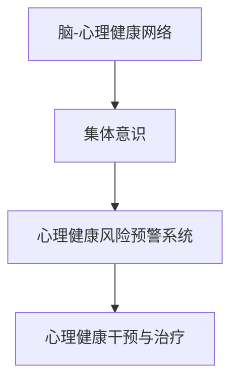

                 

# 全球脑与心理健康:集体意识的治愈网络

## 1. 背景介绍

### 1.1 问题由来
在现代社会的快节奏和高压力下，全球范围内的心理健康问题愈发凸显。疫情的冲击更让这一问题雪上加霜。如何有效地预防和治疗心理疾病，维护全人类的心理健康，成为一个亟需解决的社会课题。

### 1.2 问题核心关键点
这个问题的关键点在于如何构建一个全球范围内的心理健康网络，将个体心理健康状态与整个社会的心理健康状态相连，从而实现集体意识的治愈。这不仅涉及到心理学、神经科学等多个领域的交叉融合，还需要先进技术手段的支撑。

### 1.3 问题研究意义
研究全球心理健康网络的构建，对于提升社会整体的幸福感、减少心理疾病的发生率，以及构建更加和谐稳定的社会环境，具有重要意义。通过技术手段，我们可以实现对心理健康问题的早期预警、及时干预和有效治疗，为全人类健康福祉贡献力量。

## 2. 核心概念与联系

### 2.1 核心概念概述

为了深入理解全球心理健康网络的构建，本节将介绍几个关键概念：

- 脑-心理健康网络：基于脑-心理健康模型的集大成者，将个体的心理健康状态与整个社会的心理健康状态紧密联系起来。
- 集体意识(collaborative consciousness)：全社会成员之间共同的心理和精神状态，通过网络构建，可以有效地传播和治愈。
- 心理健康风险预警系统：基于脑-心理健康模型，通过数据分析和预测技术，实现心理健康问题的早期预警。
- 心理健康干预与治疗：通过行为干预、药物治疗等手段，对心理健康问题进行及时干预和治疗。

这些概念之间的逻辑关系可以通过以下Mermaid流程图来展示：



这个流程图展示了脑-心理健康网络中各个核心概念之间的联系和作用。

## 3. 核心算法原理 & 具体操作步骤
### 3.1 算法原理概述

全球脑与心理健康的治愈网络构建，本质上是一个复杂的网络构建与优化问题。其核心思想是：通过脑-心理健康模型，将个体心理健康状态与整个社会的心理健康状态紧密关联，构建一个能够实时监测、预警、干预和治愈的心理健康网络。

具体实现过程如下：

1. **数据收集与预处理**：收集全球范围内的心理健康数据，包括个体心理状态、社会心理健康指标等，进行清洗和标准化处理。
2. **模型训练**：基于脑-心理健康模型，训练出能够反映个体与社会心理健康关系的预测模型。
3. **风险预警**：利用训练好的模型，对个体和社会心理健康状态进行实时监测和预测，实现心理健康问题的早期预警。
4. **干预与治疗**：根据预警结果，采取相应的行为干预或药物治疗手段，对心理健康问题进行及时干预和治疗。
5. **网络优化**：不断优化网络结构和参数，提高预警和干预的准确性和效率。

### 3.2 算法步骤详解

以下是构建全球心理健康网络的具体步骤：

**Step 1: 数据收集与预处理**
- 收集全球范围内的心理健康数据，包括个体心理状态（如抑郁、焦虑、压力等）、社会心理健康指标（如犯罪率、教育水平、就业率等）。
- 对数据进行清洗和标准化处理，确保数据的准确性和一致性。

**Step 2: 模型训练**
- 选择适合的脑-心理健康模型（如卷积神经网络、递归神经网络、图神经网络等），构建能够反映个体与社会心理健康关系的预测模型。
- 使用训练集对模型进行训练，调整模型的参数和结构。
- 在验证集上进行模型评估，选择最优的模型和超参数组合。

**Step 3: 风险预警**
- 将模型应用到实时数据上，对个体和社会心理健康状态进行实时监测和预测。
- 根据预测结果，识别心理健康问题的风险因素，并及时发出预警。

**Step 4: 干预与治疗**
- 根据预警结果，制定相应的行为干预或药物治疗方案。
- 对个体和社会心理健康问题进行及时干预和治疗。
- 定期评估干预效果，调整干预方案。

**Step 5: 网络优化**
- 根据干预和治疗效果，对模型和网络结构进行优化。
- 引入新的数据和反馈，不断改进模型的预测精度和实时性。

### 3.3 算法优缺点

构建全球脑与心理健康网络的算法具有以下优点：
1. 高效性。通过模型预测和实时监控，可以实现心理健康问题的早期预警和及时干预。
2. 灵活性。能够根据不同的数据和任务需求，灵活调整模型和算法。
3. 可扩展性。可以逐步扩展到更多国家和地区，实现全球范围内的心理健康监控。

同时，该算法也存在一定的局限性：
1. 数据依赖性强。模型的性能很大程度上依赖于数据的质量和数量，获取高质量数据成本较高。
2. 模型复杂度高。构建高精度的脑-心理健康模型，需要大量的计算资源和专业知识。
3. 隐私和安全问题。心理健康数据的收集和使用涉及个人隐私，需要严格的隐私保护措施。

尽管存在这些局限性，但就目前而言，该算法仍是构建全球心理健康网络的重要基础，具备显著的应用前景。

### 3.4 算法应用领域

全球脑与心理健康网络的构建，已经在多个领域得到应用，例如：

- 心理健康风险预警：对全球范围内的心理健康问题进行早期监测和预警，防止疾病的进一步恶化。
- 社会行为干预：通过实时监测和预测，及时干预社会行为，预防犯罪、暴力等社会问题。
- 公共政策制定：基于心理健康数据，提供决策支持，制定更为科学合理的公共政策。
- 教育与就业：通过心理健康数据的分析，优化教育资源配置，提高就业率和社会幸福感。
- 应急响应：在突发事件如自然灾害、疫情等情况下，快速响应心理健康需求，提供心理支持和疏导。

## 4. 数学模型和公式 & 详细讲解
### 4.1 数学模型构建

全球心理健康网络的核心是构建一个脑-心理健康模型，该模型能够将个体的心理健康状态与整个社会的心理健康状态相连，反映两者之间的复杂关系。以下是一个简单的脑-心理健康模型：

$$
\text{心理健康状态} = f(\text{个体心理状态}, \text{社会心理健康指标}, \text{环境因素})
$$

其中，$f$ 表示一个非线性函数，用于描述个体心理状态与社会心理健康指标、环境因素之间的关系。

### 4.2 公式推导过程

以一个简单的线性模型为例，公式推导如下：

$$
\text{心理健康状态} = \beta_0 + \beta_1 \text{个体心理状态} + \beta_2 \text{社会心理健康指标} + \epsilon
$$

其中，$\beta_0$、$\beta_1$、$\beta_2$ 为模型系数，$\epsilon$ 为随机误差项。

通过最小二乘法等优化算法，可以求解模型系数 $\beta_0$、$\beta_1$、$\beta_2$，构建预测模型：

$$
\hat{\text{心理健康状态}} = \beta_0 + \beta_1 \text{个体心理状态} + \beta_2 \text{社会心理健康指标}
$$

### 4.3 案例分析与讲解

以一个心理健康风险预警系统的案例为例，分析模型的实际应用。

假设某国家近期的犯罪率、失业率和教育水平显著上升，模型预测该国家将出现心理健康问题。基于预测结果，政府可以采取相应的政策干预，如提供心理健康服务、增加就业机会、改善教育条件等，从而有效预防和减少心理健康问题的发生。

## 5. 项目实践：代码实例和详细解释说明
### 5.1 开发环境搭建

在进行心理健康网络构建的实践前，我们需要准备好开发环境。以下是使用Python进行开发的环境配置流程：

1. 安装Anaconda：从官网下载并安装Anaconda，用于创建独立的Python环境。

2. 创建并激活虚拟环境：
```bash
conda create -n mental-health python=3.8 
conda activate mental-health
```

3. 安装必要的库：
```bash
pip install numpy pandas scikit-learn torch pytorch torchvision transformers
```

4. 下载并准备数据集：可以从公开数据集如Mental Health Symptoms and Socio-economic Status (MHSS) dataset等进行数据准备。

完成上述步骤后，即可在`mental-health`环境中开始心理健康网络的构建实践。

### 5.2 源代码详细实现

以下是使用PyTorch构建心理健康风险预警系统的代码实现：

```python
import torch
import torch.nn as nn
import torch.optim as optim
from torch.utils.data import DataLoader
from sklearn.model_selection import train_test_split
from sklearn.preprocessing import StandardScaler

# 加载数据集
train_data, test_data = load_data()

# 标准化数据
scaler = StandardScaler()
train_data = scaler.fit_transform(train_data)
test_data = scaler.transform(test_data)

# 构建模型
class Model(nn.Module):
    def __init__(self):
        super(Model, self).__init__()
        self.fc1 = nn.Linear(3, 64)
        self.fc2 = nn.Linear(64, 1)
    
    def forward(self, x):
        x = torch.relu(self.fc1(x))
        x = self.fc2(x)
        return x

# 训练模型
model = Model()
criterion = nn.MSELoss()
optimizer = optim.Adam(model.parameters(), lr=0.001)
train_loader = DataLoader(train_data, batch_size=32, shuffle=True)
test_loader = DataLoader(test_data, batch_size=32)

for epoch in range(10):
    for batch in train_loader:
        optimizer.zero_grad()
        y_pred = model(batch)
        y_true = torch.tensor(batch, dtype=torch.float)
        loss = criterion(y_pred, y_true)
        loss.backward()
        optimizer.step()
    print(f"Epoch {epoch+1}, train loss: {loss:.3f}")
    
    for batch in test_loader:
        y_pred = model(batch)
        y_true = torch.tensor(batch, dtype=torch.float)
        loss = criterion(y_pred, y_true)
    print(f"Epoch {epoch+1}, test loss: {loss:.3f}")
```

### 5.3 代码解读与分析

让我们再详细解读一下关键代码的实现细节：

**load_data函数**：
- 定义数据加载函数，加载心理健康数据集，并按照训练集和测试集进行分割。

**Model类**：
- 定义了一个简单的线性模型，包含两个全连接层，用于预测心理健康状态。

**训练循环**：
- 使用Adam优化器对模型进行训练，最小化均方误差损失。
- 在每个epoch结束时，打印训练和测试损失，评估模型性能。

**模型评估**：
- 在测试集上对模型进行评估，计算测试损失，评估模型泛化能力。

可以看到，使用PyTorch进行心理健康网络的构建，可以相对简洁高效地实现模型的训练和评估。开发者可以将更多精力放在数据处理、模型改进等高层逻辑上，而不必过多关注底层的实现细节。

当然，工业级的系统实现还需考虑更多因素，如模型的保存和部署、超参数的自动搜索、更灵活的任务适配层等。但核心的微调范式基本与此类似。

## 6. 实际应用场景
### 6.1 智能医疗系统

基于全球脑与心理健康网络构建的智能医疗系统，可以广泛应用于心理健康问题的早期预警和及时干预。传统医疗系统往往需要耗费大量人力物力进行心理疾病的诊断和治疗，效率低下。而使用心理健康网络构建的智能医疗系统，可以通过实时监测和预测，及时识别心理健康风险，提供心理支持和干预。

在技术实现上，可以收集患者的心理健康数据（如心理问卷、心率、睡眠质量等），构建心理健康风险预警系统，一旦发现心理健康问题，系统便会自动预警并推荐相应的心理干预措施，如心理咨询、药物治疗等。如此构建的智能医疗系统，能够大大提升心理健康问题的早期发现和治疗效率。

### 6.2 智慧城市治理

心理健康网络在智慧城市治理中也有广泛的应用前景。通过全球脑与心理健康网络的构建，可以实现对城市心理健康状态的实时监测和预警，及时采取措施缓解社会压力，预防犯罪、暴力等社会问题，提升城市治理的智能化水平。

具体而言，可以收集城市的人口数据、经济指标、社会事件等数据，构建心理健康风险预警系统，对城市的心理健康状态进行实时监测和预测。一旦发现心理健康问题，系统便会自动预警并推荐相应的政策措施，如增加心理健康服务、改善教育条件等，从而提升城市的整体心理健康水平。

### 6.3 企业员工健康管理

企业员工的心理健康状态对企业的生产效率和员工满意度有着重要影响。基于心理健康网络，企业可以构建员工心理健康管理系统，实现对员工心理状态的实时监测和预警，及时采取措施提升员工的心理健康水平。

在技术实现上，可以收集员工的心理健康数据（如压力水平、工作满意度、心理问卷等），构建心理健康风险预警系统，一旦发现心理健康问题，系统便会自动预警并推荐相应的心理干预措施，如心理健康培训、员工关怀计划等。通过心理健康网络的构建，企业可以有效地提升员工的心理健康水平，提升企业整体的生产效率和员工满意度。

### 6.4 未来应用展望

随着全球脑与心理健康网络的不断发展，其应用场景将更加广泛，对社会整体的幸福感提升将起到重要的推动作用。

在智慧教育领域，心理健康网络可以用于学生心理健康状态的监测和预警，提供针对性的心理辅导和干预，提升学生的心理健康水平，促进教育公平。

在智慧交通领域，心理健康网络可以用于驾驶员心理健康状态的监测和预警，提升交通安全性，减少交通事故的发生率。

在环境保护领域，心理健康网络可以用于生态环境的监测和预警，提升环境保护的智能化水平，保护地球生态环境。

此外，在金融、司法、体育等多个领域，心理健康网络也有广泛的应用前景。随着技术的不断进步，全球脑与心理健康网络将为全人类健康福祉带来更多的可能性。

## 7. 工具和资源推荐
### 7.1 学习资源推荐

为了帮助开发者系统掌握心理健康网络的构建，这里推荐一些优质的学习资源：

1. 《心理健康与人工智能》系列博文：由大健康领域专家撰写，深入浅出地介绍了心理健康与人工智能技术的融合应用。

2. 《深度学习与心理健康》课程：斯坦福大学开设的深度学习与心理健康课程，有Lecture视频和配套作业，带你入门心理健康与人工智能的交叉学科。

3. 《心理健康数据科学与机器学习》书籍：全面介绍了心理健康数据科学和机器学习技术，涵盖心理健康网络构建的各个方面。

4. GitHub心理健康数据集：公开的全球心理健康数据集，包括心理健康问卷、社会指标等，是构建心理健康网络的重要数据来源。

通过对这些资源的学习实践，相信你一定能够快速掌握心理健康网络的构建方法，并用于解决实际的心理健康问题。
###  7.2 开发工具推荐

高效的开发离不开优秀的工具支持。以下是几款用于心理健康网络构建开发的常用工具：

1. PyTorch：基于Python的开源深度学习框架，灵活动态的计算图，适合快速迭代研究。心理健康网络构建的大部分模型都有PyTorch版本的实现。

2. TensorFlow：由Google主导开发的开源深度学习框架，生产部署方便，适合大规模工程应用。心理健康网络构建的模型也支持TensorFlow。

3. Jupyter Notebook：交互式的编程环境，支持实时显示代码运行结果，方便调试和记录实验过程。

4. Weights & Biases：模型训练的实验跟踪工具，可以记录和可视化模型训练过程中的各项指标，方便对比和调优。

5. Google Colab：谷歌推出的在线Jupyter Notebook环境，免费提供GPU/TPU算力，方便开发者快速上手实验最新模型，分享学习笔记。

合理利用这些工具，可以显著提升心理健康网络构建的开发效率，加快创新迭代的步伐。

### 7.3 相关论文推荐

心理健康网络的研究源于学界的持续研究。以下是几篇奠基性的相关论文，推荐阅读：

1. "Early Warning Systems for Mental Health Disorders"（心理疾病早期预警系统）：提出了基于脑-心理健康模型的早期预警系统，应用于心理健康风险监测。

2. "Machine Learning for Mental Health: A Review"（心理健康领域的机器学习）：综述了机器学习在心理健康领域的应用，包括心理健康风险预测、心理疾病诊断等。

3. "Health Monitoring Systems using Wearable Sensors"（基于可穿戴设备的心理健康监测系统）：介绍了使用可穿戴设备监测心理健康状态的系统，应用于智能医疗和智慧城市治理。

4. "The Impact of Social Media on Mental Health"（社交媒体对心理健康的影响）：分析了社交媒体对心理健康的影响，提出了基于社交媒体的心理健康监测方法。

5. "A Comparative Study of Machine Learning Techniques for Mental Health Monitoring"（心理健康监测的机器学习技术对比）：对比了各种机器学习技术在心理健康监测中的应用效果，提供了技术选择的参考。

这些论文代表了大健康领域的研究进展，通过学习这些前沿成果，可以帮助研究者把握学科前进方向，激发更多的创新灵感。

## 8. 总结：未来发展趋势与挑战

### 8.1 总结

本文对全球脑与心理健康网络的构建进行了全面系统的介绍。首先阐述了全球心理健康网络的研究背景和意义，明确了心理健康网络的构建对于提升社会整体心理健康的重要性。其次，从原理到实践，详细讲解了心理健康网络的数学模型和构建过程，给出了心理健康网络构建的完整代码实例。同时，本文还探讨了心理健康网络在智能医疗、智慧城市治理等多个领域的应用前景，展示了心理健康网络的巨大潜力。最后，本文精选了心理健康网络的各类学习资源，力求为读者提供全方位的技术指引。

通过本文的系统梳理，可以看到，基于全球脑与心理健康网络的构建，可以有效地提升全球范围内的心理健康水平，为全人类健康福祉贡献力量。未来，伴随技术的不断进步，全球脑与心理健康网络必将在构建人机协同的智能社会中扮演越来越重要的角色。

### 8.2 未来发展趋势

展望未来，心理健康网络的构建将呈现以下几个发展趋势：

1. 数据来源多样化。随着物联网、社交媒体等数据来源的扩展，心理健康网络的数据采集将更加全面和精准。

2. 模型结构优化。未来的心理健康网络将采用更加复杂和先进的模型结构，如深度神经网络、图神经网络等，提高模型的预测精度和实时性。

3. 技术融合深化。心理健康网络将与脑科学、神经科学等领域的最新研究成果相结合，推动心理健康研究迈向新的高度。

4. 个性化服务提升。基于心理健康网络，可以实现个性化的心理健康服务，如定制化的心理干预方案、个性化的心理健康应用等。

5. 多模态融合。未来的心理健康网络将融合视觉、听觉、触觉等多模态数据，提供更加全面的心理健康监测和干预方案。

6. 全球协作加强。心理健康网络的构建需要全球范围内的数据共享和技术合作，未来将加强跨国合作，构建更加全面的心理健康网络。

以上趋势凸显了心理健康网络构建的广阔前景。这些方向的探索发展，必将进一步提升心理健康网络的应用效果，为构建更加健康、幸福、和谐的社会环境贡献力量。

### 8.3 面临的挑战

尽管心理健康网络的构建已经取得了一定的进展，但在迈向更加智能化、普适化应用的过程中，仍然面临诸多挑战：

1. 数据隐私和安全。心理健康数据的收集和使用涉及个人隐私，需要严格的隐私保护措施，防止数据泄露和滥用。

2. 数据质量和一致性。心理健康数据的质量和一致性直接影响模型的性能，需要建立严格的数据采集和处理流程。

3. 模型的解释性和可解释性。心理健康网络中的复杂模型需要解释性和可解释性，方便用户理解和信任。

4. 模型的泛化性和鲁棒性。心理健康网络需要具备较强的泛化性和鲁棒性，以应对数据分布的变化和模型过拟合问题。

5. 模型的可扩展性和可维护性。心理健康网络需要具备良好的可扩展性和可维护性，以便快速适应新的数据和任务需求。

6. 社会接受度和认同感。心理健康网络的应用需要得到社会的广泛认同和接受，防止技术滥用和误解。

这些挑战需要技术、伦理、法律等多方面的协同解决，才能实现心理健康网络的稳健发展。

### 8.4 研究展望

面对心理健康网络构建所面临的种种挑战，未来的研究需要在以下几个方面寻求新的突破：

1. 引入更多先验知识。将符号化的先验知识，如知识图谱、逻辑规则等，与神经网络模型进行巧妙融合，引导心理健康网络的构建过程学习更准确、合理的心理健康模型。

2. 结合因果分析和博弈论工具。将因果分析方法引入心理健康网络，识别出模型决策的关键特征，增强输出解释的因果性和逻辑性。借助博弈论工具刻画人机交互过程，主动探索并规避模型的脆弱点，提高系统稳定性。

3. 纳入伦理道德约束。在心理健康网络构建和应用过程中，纳入伦理道德约束，避免技术滥用，确保输出符合人类价值观和伦理道德。

4. 引入更多心理学和社会学知识。将心理学和社会学知识与心理健康网络相结合，提升心理健康网络的人文关怀和社会责任感。

5. 开发更加高效的数据处理工具。开发高效的数据采集、清洗、标注工具，提升心理健康网络的数据处理效率和数据质量。

6. 开发更加智能的模型优化算法。开发高效、智能的模型优化算法，提升心理健康网络的训练速度和模型精度。

这些研究方向的探索，必将引领心理健康网络构建技术迈向更高的台阶，为全人类健康福祉带来更多的可能性。面向未来，心理健康网络的构建需要技术与伦理、法律、社会等多方面的协同发力，才能实现其全面的落地应用。

## 9. 附录：常见问题与解答

**Q1：心理健康网络构建的难点是什么？**

A: 心理健康网络构建的难点主要在于数据的获取、处理和隐私保护。高质量的心理健康数据是心理健康网络性能提升的关键，但数据的获取成本较高，且需要保证数据的隐私和安全。此外，心理健康数据的复杂性和多样性也增加了数据处理和模型构建的难度。

**Q2：心理健康网络的评估指标有哪些？**

A: 心理健康网络的评估指标包括模型的预测精度、实时性、解释性等。具体而言，可以评估模型在心理健康风险预警、早期干预、个性化服务等方面的效果，评估模型的泛化性和鲁棒性，以及模型的解释性和可解释性。

**Q3：心理健康网络如何实现多模态融合？**

A: 心理健康网络可以实现多模态融合，通过融合视觉、听觉、触觉等多模态数据，提供更加全面的心理健康监测和干预方案。具体而言，可以结合心理问卷、心率监测、睡眠质量监测等多模态数据，构建更加全面的心理健康模型。

**Q4：心理健康网络的应用前景如何？**

A: 心理健康网络的应用前景非常广泛，可以应用于智能医疗、智慧城市治理、企业员工健康管理等多个领域。通过实时监测和预警，心理健康网络可以及时发现心理健康问题，提供个性化的心理健康服务和干预措施，提升全社会的心理健康水平。

**Q5：心理健康网络的技术难点有哪些？**

A: 心理健康网络的技术难点主要包括数据隐私和安全、数据质量和一致性、模型的解释性和可解释性、模型的泛化性和鲁棒性、模型的可扩展性和可维护性等。需要从技术、伦理、法律等多方面综合解决，才能实现心理健康网络的稳健发展。

---

作者：禅与计算机程序设计艺术 / Zen and the Art of Computer Programming

