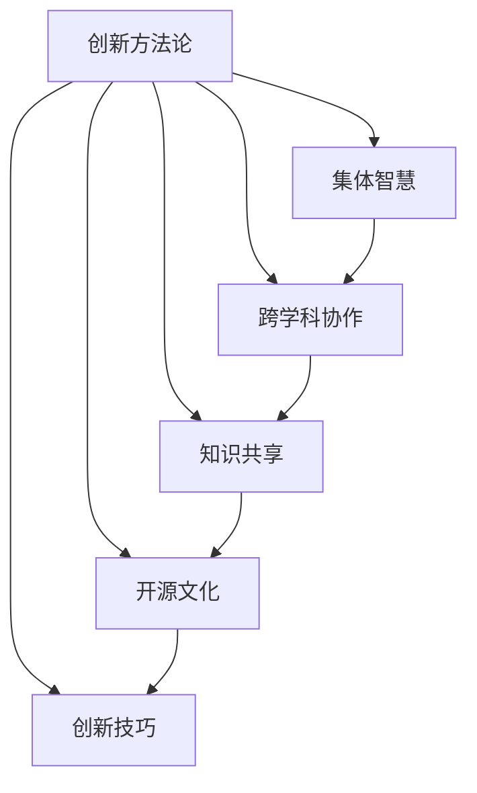

                 

# 全球脑创新方法论:集体智慧激发的创新技巧

> 关键词：创新方法论,集体智慧,知识管理,跨学科协作,开源文化,创新技巧

## 1. 背景介绍

### 1.1 问题由来
在全球化、信息化时代，知识更新迭代加速，技术变革不断涌现。从区块链、人工智能到量子计算，每一次的科技突破都带来新的发展机遇，同时也对企业、组织和个人的创新能力提出了更高要求。如何在瞬息万变的环境中持续保持创新能力，成为现代企业和研究机构所面临的重要课题。

本文旨在探讨一种新兴的创新方法论——全球脑创新方法论，该方法论以集体智慧为核心，将不同领域的知识、技术、方法有机整合，通过跨学科协作、知识共享和创新技巧，激发全员创新潜力，推动企业和组织的持续发展。

### 1.2 问题核心关键点
全球脑创新方法论的核心在于以下几个方面：

1. **集体智慧**：集众人之智，汲取跨领域知识，增强创新团队的整体能力。
2. **跨学科协作**：打破学科壁垒，促进不同领域专家的交流与合作，融合多种视角。
3. **知识共享**：构建开放的知识管理系统，推动信息的快速流动和共享。
4. **创新技巧**：提炼总结行之有效的创新方法和策略，引导全员实践。
5. **开源文化**：推崇开放、透明、合作的工作方式，激发更多人参与创新。

这些关键点共同构成了全球脑创新方法论的核心理念，帮助企业和组织在复杂多变的环境中，灵活应对挑战，抓住机遇。

### 1.3 问题研究意义
研究全球脑创新方法论，对于提升企业和组织的创新能力，加速技术革新，具有重要意义：

1. **增强竞争力**：通过整合多领域知识，提升企业技术水平和市场竞争力。
2. **促进知识创新**：跨学科协作和知识共享加速新知识的产生和应用，推动企业持续创新。
3. **降低创新成本**：通过开源文化，利用外部资源和智慧，降低内部研发成本。
4. **培养创新人才**：提供平台和机制，激励员工创新，培养一大批高素质的创新人才。
5. **提升组织活力**：建立开放、透明的创新文化，激发全体员工的积极性和创造力。

## 2. 核心概念与联系

### 2.1 核心概念概述

为更好地理解全球脑创新方法论，本节将介绍几个密切相关的核心概念：

1. **创新方法论**：指导创新的系统化、结构化的理论和方法，旨在提升创新效率和质量。
2. **集体智慧**：一群或多个人通过合作，整合各自的知识和技能，共同解决复杂问题，产生的综合智慧。
3. **跨学科协作**：不同学科背景的人员通过合作，整合知识和方法，共同攻关复杂问题的过程。
4. **知识共享**：通过信息交流和知识管理，促进知识在组织内的传播和应用。
5. **开源文化**：强调开放、透明、合作的工作方式，鼓励知识共享和共同创造。
6. **创新技巧**：在创新实践中总结和提炼出的有效方法和技巧。

这些核心概念之间的逻辑关系可以通过以下Mermaid流程图来展示：



这个流程图展示出创新方法论与其他核心概念之间的联系：

1. 创新方法论指导集体智慧的实践，指导跨学科协作和知识共享。
2. 集体智慧通过跨学科协作和知识共享获得，同时依赖于创新技巧的运用。
3. 跨学科协作和知识共享是集体智慧和开源文化的重要组成部分。
4. 开源文化通过知识共享和创新技巧，进一步推动创新实践。

这些概念共同构成了一个完整的创新生态系统，帮助企业和组织实现高效的创新。

## 3. 核心算法原理 & 具体操作步骤
### 3.1 算法原理概述

全球脑创新方法论的核心原理是：通过集体的智慧和力量，打破学科壁垒，整合跨领域知识，应用有效的创新技巧，推动复杂问题的解决。其实质是一种自上而下的指导方法和自下而上的实践过程的结合。

### 3.2 算法步骤详解

全球脑创新方法论的主要操作步骤包括以下几个关键步骤：

**Step 1: 建立跨学科团队**
- 根据创新项目的需求，组建由不同学科背景专家组成的跨学科团队。
- 确保团队成员具有多元化的知识背景，以覆盖项目的各个方面。

**Step 2: 制定创新目标**
- 明确创新目标和需求，确保项目方向明确。
- 与利益相关方进行沟通，确保目标与实际需求相符。

**Step 3: 知识共享与协作**
- 建立开放的知识共享平台，促进团队成员之间的信息交流。
- 定期组织跨学科讨论会，促进团队成员之间的深度交流。

**Step 4: 实践与验证**
- 在团队中推广创新技巧，鼓励成员实践创新。
- 通过实验和原型验证，不断优化创新方案。

**Step 5: 反馈与优化**
- 对创新过程和结果进行持续的反馈和评估。
- 根据反馈结果进行优化和改进，确保创新方案的可行性和有效性。

### 3.3 算法优缺点

全球脑创新方法论具有以下优点：
1. **综合性强**：整合多领域知识，增强创新团队的整体能力。
2. **灵活性高**：打破学科壁垒，促进跨学科交流，提高创新灵活性。
3. **效率高**：利用集体智慧和跨学科协作，提高问题解决的效率。
4. **可操作性强**：通过开放的知识共享和创新技巧，提升创新实践的可行性。

同时，该方法论也存在一些局限性：
1. **协调复杂**：跨学科团队的协调和沟通需要高水平的管理和领导。
2. **资源依赖**：依赖于团队成员的积极性、知识水平和沟通能力。
3. **时间成本高**：跨学科协作和知识共享需要较长的前期准备和沟通时间。
4. **风险高**：创新过程中的不确定性和风险较高，需具备较高的容错能力。

尽管存在这些局限性，但全球脑创新方法论以其综合性和灵活性，成为现代创新实践中的重要工具。

### 3.4 算法应用领域

全球脑创新方法论已经在多个领域得到应用，产生了显著的效果，例如：

- **科技创新**：在生物医药、信息技术等高科技领域，通过跨学科协作，开发新技术和新产品。
- **工程创新**：在建筑工程、航空航天等工程领域，整合不同领域的知识，解决复杂问题。
- **社会创新**：在城市规划、环境保护等社会问题中，通过知识共享和跨学科协作，推动社会进步。
- **教育创新**：在高等教育和职业教育中，通过跨学科教学和研究，培养复合型人才。
- **企业管理**：在企业战略、人力资源管理等领域，推动企业变革和创新。

除了这些传统应用领域外，全球脑创新方法论还在新兴行业如智慧城市、智能制造等得到广泛应用，为各行各业带来新的发展机遇。

## 4. 数学模型和公式 & 详细讲解 & 举例说明
### 4.1 数学模型构建

全球脑创新方法论的数学模型构建，主要涉及以下几个关键要素：

- **创新目标函数**：定义创新目标和需求，确保项目方向明确。
- **知识共享矩阵**：建立知识共享平台，量化团队成员之间的信息流动。
- **创新过程模型**：描述创新过程的各个环节和步骤，确保过程可控。

### 4.2 公式推导过程

以知识共享矩阵为例，假设一个由n个成员组成的跨学科团队，每个成员的知识水平用$k_i$表示，知识共享的效率用$e_{ij}$表示，其中$i$和$j$分别表示团队成员的编号。则知识共享矩阵可以表示为：

$$
K = \begin{bmatrix}
k_1 & e_{12} & e_{13} & \cdots & e_{1n} \\
e_{21} & k_2 & e_{23} & \cdots & e_{2n} \\
e_{31} & e_{32} & k_3 & \cdots & e_{3n} \\
\vdots & \vdots & \vdots & \ddots & \vdots \\
e_{n1} & e_{n2} & e_{n3} & \cdots & k_n
\end{bmatrix}
$$

通过该矩阵，可以计算团队的知识共享效率和知识总水平，指导团队成员的知识提升和信息流动优化。

### 4.3 案例分析与讲解

以智能交通系统的创新为例：

**案例背景**：某城市交通状况复杂，交通拥堵严重。现有团队由交通规划专家、计算机科学家、城市规划师组成。

**操作步骤**：
1. **组建团队**：确定团队成员及其专业背景。
2. **明确目标**：定义创新目标为“减少交通拥堵，提升交通效率”。
3. **知识共享**：建立知识共享平台，定期举行跨学科讨论会。
4. **实践验证**：通过仿真和实验验证创新方案的可行性。
5. **反馈优化**：根据反馈结果进行优化和改进。

**创新过程**：
1. 交通规划专家提出基于大数据分析的交通流预测模型。
2. 计算机科学家提出智能交通信号灯控制系统。
3. 城市规划师提出城市交通基础设施优化方案。
4. 通过跨学科协作，整合不同领域的知识，形成综合的创新方案。

通过全球脑创新方法论，团队成功实施了智能交通系统，显著改善了城市交通状况，取得了显著的创新成果。

## 5. 项目实践：代码实例和详细解释说明
### 5.1 开发环境搭建

在进行全球脑创新方法论实践前，我们需要准备好开发环境。以下是使用Python进行开发的Python环境配置流程：

1. 安装Anaconda：从官网下载并安装Anaconda，用于创建独立的Python环境。

2. 创建并激活虚拟环境：
```bash
conda create -n innovation-env python=3.8 
conda activate innovation-env
```

3. 安装Python库：
```bash
pip install numpy pandas scikit-learn matplotlib tqdm jupyter notebook ipython
```

4. 安装相关工具包：
```bash
pip install openpyxl pyexcel
```

完成上述步骤后，即可在`innovation-env`环境中开始实践。

### 5.2 源代码详细实现

下面以开发一个简单的创新项目管理工具为例，展示如何使用Python进行全球脑创新方法论的实践。

```python
import pandas as pd
from openpyxl import Workbook

# 创建数据表
def create_data_table():
    wb = Workbook()
    ws = wb.active
    ws.title = "Innovation Project"
    
    # 定义表头
    ws.append(["Team Member", "Knowledge Level", "Collaboration Efficiency"])
    
    # 添加示例数据
    ws.append(["Alice", 80, 90])
    ws.append(["Bob", 70, 85])
    ws.append(["Charlie", 60, 75])
    
    # 保存文件
    wb.save("project.xlsx")

# 导入并处理数据
def read_and_process_data():
    data = pd.read_excel("project.xlsx")
    data.head()

# 计算知识共享效率
def calculate_knowledge_sharing_efficiency(data):
    # 计算知识总水平
    total_knowledge = data["Knowledge Level"].sum()
    
    # 计算知识共享效率
    collaboration_efficiency = (data["Collaboration Efficiency"] * data["Knowledge Level"]).sum() / total_knowledge
    
    return collaboration_efficiency

# 运行示例
create_data_table()
read_and_process_data()
collaboration_efficiency = calculate_knowledge_sharing_efficiency(data)
print(f"知识共享效率为: {collaboration_efficiency:.2f}")
```

以上就是使用Python进行全球脑创新方法论实践的完整代码实现。可以看到，通过简单的Excel表格和Python脚本，即可实现知识共享效率的计算，方便进行数据分析和优化。

### 5.3 代码解读与分析

让我们再详细解读一下关键代码的实现细节：

**create_data_table函数**：
- 使用`openpyxl`库创建Excel文件。
- 定义表头和数据列。
- 添加示例数据。

**read_and_process_data函数**：
- 使用`pandas`库读取Excel文件。
- 输出数据前几行。

**calculate_knowledge_sharing_efficiency函数**：
- 计算知识总水平。
- 计算知识共享效率，公式为：$\frac{\sum(e_{ij} \cdot k_j)}{\sum k_i}$。
- 返回知识共享效率。

**运行示例**：
- 先创建数据表。
- 读取并处理数据。
- 计算知识共享效率，并输出结果。

可以看到，通过Python的简单工具和库，可以方便地实现知识共享效率的计算，为全球脑创新方法论的实践提供了有力的支持。

当然，实际的创新项目管理工具需要考虑更多因素，如项目进度跟踪、风险管理、绩效评估等，但核心的知识共享和协作过程基本与此类似。

## 6. 实际应用场景
### 6.1 智能交通系统

全球脑创新方法论在智能交通系统的创新中得到了广泛应用。传统交通系统管理复杂，容易受到突发事件的影响，导致交通堵塞和事故频发。通过全球脑创新方法论，可以将跨学科知识整合，实现智能交通管理。

具体而言，可以组织交通规划专家、计算机科学家和城市规划师等多领域专家，通过知识共享和协作，提出综合的创新方案。例如，设计基于大数据的交通流预测模型，优化交通信号灯控制系统，提升城市交通基础设施。通过这些创新措施，可以实现交通流的动态调整和优化，有效缓解交通压力，提升交通效率。

### 6.2 智慧医疗系统

全球脑创新方法论在智慧医疗系统中也有着广阔的应用前景。医疗领域涉及众多学科，如医学、药学、工程等。通过跨学科协作，可以有效解决医疗技术难题，提升医疗服务质量。

例如，可以组建由医学专家、工程师、数据科学家组成的团队，通过知识共享和协作，提出创新的医疗解决方案。例如，设计基于大数据和AI的疾病诊断模型，开发智能医疗设备，优化医疗流程。通过这些创新措施，可以显著提升疾病诊断的准确性，优化医疗资源配置，改善患者治疗体验。

### 6.3 教育改革

全球脑创新方法论在教育改革中也有着重要作用。传统教育模式往往偏重理论知识的传授，忽视学生实践能力的培养。通过全球脑创新方法论，可以将跨学科知识整合，推动教育创新。

例如，可以组织教育专家、心理学家、工程师等多领域专家，通过知识共享和协作，提出创新的教育方案。例如，设计基于项目式学习的课程，引入AI技术辅助教学，开发互动式学习平台。通过这些创新措施，可以提升学生的实践能力和创新思维，培养出更多高素质的复合型人才。

### 6.4 未来应用展望

随着全球脑创新方法论的不断发展和应用，其在更多领域将得到广泛应用，为各行各业带来新的发展机遇。

- **智慧城市**：通过跨学科协作，推动城市管理智能化、精细化。
- **智能制造**：整合不同领域的知识，提升制造业的效率和智能化水平。
- **环境保护**：跨学科团队合作，提出创新的环境保护解决方案，推动可持续发展。
- **智能农业**：整合农业科学、信息技术等领域的知识，提升农业生产效率和智能化水平。
- **金融科技**：跨学科团队合作，推动金融科技的发展，提升金融服务质量。

此外，在教育、医疗、公共安全等众多领域，全球脑创新方法论也将不断得到应用，推动社会进步和经济发展。

## 7. 工具和资源推荐
### 7.1 学习资源推荐

为了帮助开发者系统掌握全球脑创新方法论的理论基础和实践技巧，这里推荐一些优质的学习资源：

1. 《创新方法论：从理论到实践》系列书籍：详细介绍了创新方法论的理论基础和实践技巧，是学习全球脑创新方法论的重要参考资料。
2. Coursera《创新管理》课程：斯坦福大学开设的创新管理课程，涵盖创新方法论的各个方面，适合初学者入门。
3. IEEE Xplore《创新研究》专题：包含大量全球脑创新方法论的最新研究论文，是了解前沿创新的重要渠道。
4. TED Talk《如何激发集体智慧》：知名创新专家TED Talk，深入探讨如何激发集体智慧，值得一看。
5. InnoHackathon：全球创新黑客松，汇聚全球创新者，通过实践锻炼创新技巧，体验集体智慧的力量。

通过对这些资源的学习实践，相信你一定能够快速掌握全球脑创新方法论的精髓，并用于解决实际的创新问题。
###  7.2 开发工具推荐

高效的开发离不开优秀的工具支持。以下是几款用于全球脑创新方法论开发的常用工具：

1. JIRA：项目管理工具，帮助团队高效跟踪项目进度和任务。
2. Slack：团队沟通工具，促进跨学科团队的协作和沟通。
3. Miro：在线协作工具，支持实时白板协作和知识共享。
4. Google Drive：云存储和共享工具，方便团队成员共享文件和文档。
5. GitHub：代码管理和版本控制工具，支持团队协作开发。
6. Tableau：数据可视化工具，帮助团队分析数据，提取知识。

合理利用这些工具，可以显著提升全球脑创新方法论的开发效率，加快创新迭代的步伐。

### 7.3 相关论文推荐

全球脑创新方法论的发展源于学界的持续研究。以下是几篇奠基性的相关论文，推荐阅读：

1. 《集体智慧：跨学科协作在创新中的作用》：分析了跨学科协作在创新中的重要性。
2. 《知识共享与创新：案例分析》：通过案例分析，总结了知识共享与创新的关系。
3. 《创新技巧：成功创新案例的总结与提炼》：总结了行之有效的创新技巧和方法。
4. 《全球脑创新：基于跨学科协作的创新实践》：介绍了全球脑创新方法论的实践案例。
5. 《开源文化：推动全球脑创新的方法论》：探讨了开源文化在推动创新中的作用。

这些论文代表了大脑脑创新方法论的发展脉络。通过学习这些前沿成果，可以帮助研究者把握学科前进方向，激发更多的创新灵感。

## 8. 总结：未来发展趋势与挑战
### 8.1 总结

本文对全球脑创新方法论进行了全面系统的介绍。首先阐述了全球脑创新方法论的背景和意义，明确了其在提升企业和组织创新能力方面的独特价值。其次，从原理到实践，详细讲解了全球脑创新方法论的数学模型和操作步骤，给出了全球脑创新方法论的代码实现。同时，本文还广泛探讨了全球脑创新方法论在多个行业领域的应用前景，展示了其广阔的发展潜力。此外，本文精选了全球脑创新方法论的学习资源，力求为读者提供全方位的技术指引。

通过本文的系统梳理，可以看到，全球脑创新方法论正在成为企业和组织创新实践的重要工具，极大地拓展了跨学科协作的创新能力。面向未来，全球脑创新方法论还将不断探索新的应用场景，推动技术与社会的深度融合。

### 8.2 未来发展趋势

展望未来，全球脑创新方法论将呈现以下几个发展趋势：

1. **自动化和智能化**：引入AI技术，自动化管理创新过程，提升效率和精度。
2. **多模态融合**：整合视觉、听觉、触觉等多模态数据，增强创新模型的感知能力。
3. **区块链技术**：利用区块链技术，实现知识共享和协作的透明化、可信化。
4. **生态系统建设**：建立全球脑创新生态系统，促进知识共享和创新资源的流动。
5. **边缘计算**：将创新过程引入边缘计算平台，实时处理和分析数据，提升响应速度。

这些趋势凸显了全球脑创新方法论的潜力和发展方向，将进一步提升企业和组织的创新能力。

### 8.3 面临的挑战

尽管全球脑创新方法论已经取得了显著成效，但在迈向更加智能化、普适化应用的过程中，仍面临诸多挑战：

1. **管理复杂**：跨学科团队的协调和沟通需要高水平的管理和领导。
2. **资源依赖**：依赖于团队成员的积极性、知识水平和沟通能力。
3. **成本高**：跨学科协作和知识共享需要较高的前期投入和资源配置。
4. **风险高**：创新过程中的不确定性和风险较高，需具备较高的容错能力。
5. **知识隔离**：不同领域的知识难以有效整合，可能存在知识隔离现象。

尽管存在这些挑战，但全球脑创新方法论以其综合性和灵活性，成为现代创新实践中的重要工具。相信随着学界和产业界的共同努力，这些挑战终将一一被克服，全球脑创新方法论必将在构建人机协同的智能时代中扮演越来越重要的角色。

### 8.4 研究展望

面对全球脑创新方法论所面临的挑战，未来的研究需要在以下几个方面寻求新的突破：

1. **管理机制优化**：研究高效的管理机制和领导方式，提升跨学科团队的协作效率。
2. **知识融合技术**：开发知识融合技术，解决跨领域知识整合中的难题。
3. **资源优化配置**：研究资源优化配置策略，降低创新成本，提升资源利用率。
4. **风险管理**：研究创新过程中的风险管理方法，降低不确定性和风险。
5. **知识共享平台**：开发高效的知识共享平台，推动知识的快速流动和共享。

这些研究方向的探索，必将引领全球脑创新方法论迈向更高的台阶，为构建安全、可靠、可解释、可控的智能系统铺平道路。面向未来，全球脑创新方法论还需要与其他人工智能技术进行更深入的融合，如知识表示、因果推理、强化学习等，多路径协同发力，共同推动自然语言理解和智能交互系统的进步。只有勇于创新、敢于突破，才能不断拓展全球脑创新方法论的边界，让智能技术更好地造福人类社会。

## 9. 附录：常见问题与解答
----------------------------------------------------------------

**Q1：全球脑创新方法论适用于所有企业和组织吗？**

A: 全球脑创新方法论适用于各类企业和组织，特别是那些需要跨领域知识整合和协作的领域。例如，高科技企业、研究机构、教育机构等。但对于一些偏重于单一领域的组织，可能需要结合具体情况，灵活应用。

**Q2：全球脑创新方法论的实施是否需要高昂的成本？**

A: 全球脑创新方法论的实施确实需要一定的前期投入，包括建立跨学科团队、开发知识共享平台等。但随着技术的发展和普及，这些成本逐渐降低，并且通过跨学科协作和知识共享，可以实现更大的价值。

**Q3：全球脑创新方法论如何确保创新过程的可控性？**

A: 通过科学的项目管理和知识共享机制，全球脑创新方法论可以确保创新过程的可控性。例如，制定明确的项目目标和阶段，定期评估创新进展，引入风险管理机制等。

**Q4：全球脑创新方法论在实际应用中如何与传统方法结合？**

A: 全球脑创新方法论可以与传统方法结合使用。例如，在技术开发阶段，可以采用全球脑创新方法论整合跨学科知识，提升创新效率；在产品推广阶段，可以结合传统市场推广方法，提高产品接受度。

**Q5：全球脑创新方法论是否适用于小型团队？**

A: 全球脑创新方法论同样适用于小型团队。虽然大型团队可以整合更多资源，但小型团队同样可以通过高效的沟通和协作，实现创新目标。

综上所述，全球脑创新方法论以其独特的优势和灵活性，成为企业和组织创新实践中的重要工具。通过跨学科协作和知识共享，可以最大化利用集体智慧，提升创新效率和质量，推动技术和社会的深度融合。

