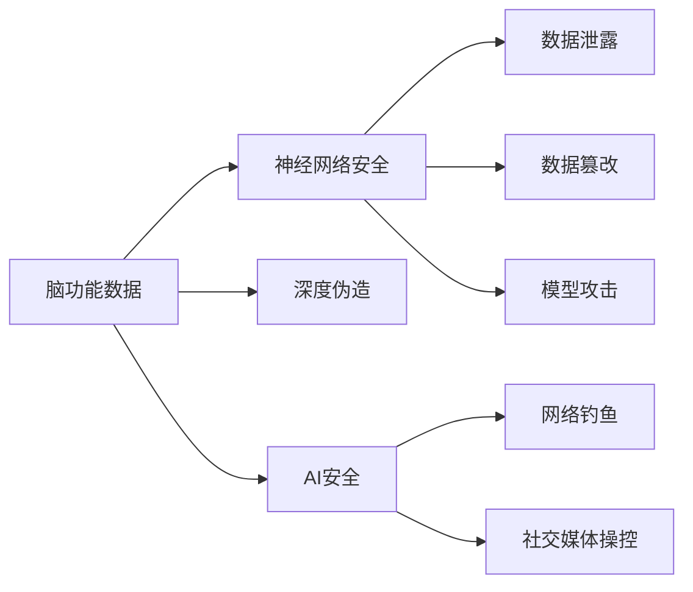

                 

# 全球脑安全：数字时代的新型国防战略

## 1. 背景介绍

### 1.1 问题由来
随着信息技术的飞速发展，数字时代已经深入到我们生活的方方面面。互联网、物联网、人工智能等技术的广泛应用，带来了极大的便利与创新，同时也引发了一系列全新的安全挑战。其中，全球脑安全问题（Cyber Brains Security）成为数字时代新型国防战略的核心议题之一。

全球脑安全指的是网络空间中脑功能相关的信息安全问题。脑功能包括信息感知、认知、情感、决策、记忆等。近年来，人工智能、大数据、区块链等技术正在逐步构建数字基础设施，而这些技术的应用依赖于大量的脑功能数据。脑功能数据的安全直接关系到国家安全、个人隐私、企业竞争力等方面，因此急需建立全面的安全防护体系。

### 1.2 问题核心关键点
脑功能数据涉及个人隐私和敏感信息，容易成为网络攻击的目标。攻击者可能通过网络钓鱼、社交工程、深度伪造等方式，获取或篡改脑功能数据，进而危害国家安全和个人隐私。脑功能数据安全问题主要集中在以下几个方面：

1. **数据泄露与窃取**：脑功能数据泄露会导致隐私泄露、个人身份信息被盗用，甚至引发大规模网络犯罪。
2. **数据篡改与伪造**：攻击者可以通过篡改或伪造脑功能数据，干扰用户的决策和行为，甚至引发社会动荡。
3. **智能系统攻击**：脑功能数据被用于训练人工智能系统，攻击者可能通过注入恶意数据，控制或误导AI系统，引发安全风险。
4. **社交媒体攻击**：脑功能数据被用于社交媒体分析，攻击者可能通过操控社交媒体数据，影响用户的认知和情感，甚至进行社会操控。

## 2. 核心概念与联系

### 2.1 核心概念概述

为更好地理解全球脑安全的概念和重要性，本节将介绍几个关键概念及其联系：

- **脑功能数据**：指通过脑机接口、神经科学实验、社交媒体分析等方式获取的脑功能相关数据，包括感知、认知、情感、决策、记忆等方面。

- **全球脑安全**：指数字时代脑功能数据的安全问题，涉及脑功能数据的存储、传输、使用等各个环节，涵盖了数据安全、隐私保护、智能系统安全等方面。

- **神经网络安全**：指利用神经网络模型进行脑功能数据分析和处理时，模型的安全问题，如对抗样本、模型篡改、后门攻击等。

- **深度伪造（Deepfakes）**：指通过深度学习技术生成的虚假视频、音频、图像等，具有高度逼真和难以辨别的特点，可能用于伪造新闻、传播谣言，影响社会稳定。

- **AI安全**：指人工智能系统在决策、执行、反馈等方面的安全问题，如恶意控制、误导行为、隐私泄露等。

- **网络钓鱼（Phishing）**：指通过欺骗手段获取用户脑功能数据的攻击方式，如社交工程、钓鱼网站、恶意链接等。

- **社交媒体操控（Social Media Manipulation）**：指利用社交媒体数据分析用户的脑功能，影响其认知、情感、决策，甚至控制舆论走向的攻击方式。

### 2.2 核心概念原理和架构的 Mermaid 流程图



该流程图展示了脑功能数据与其相关安全问题之间的联系。脑功能数据通过神经网络进行分析和处理，可能面临深度伪造、AI安全、网络钓鱼和社交媒体操控等攻击，同时神经网络本身也可能遭受数据泄露、数据篡改和模型攻击。这些安全问题相互交织，共同构成全球脑安全的复杂局面。

## 3. 核心算法原理 & 具体操作步骤

### 3.1 算法原理概述

全球脑安全涉及多个学科领域的交叉应用，包括网络安全、信息科学、认知科学、神经科学等。脑功能数据的安全防护，需要从数据收集、传输、存储、使用等各个环节进行综合考虑，采用多种算法和技术手段，构建多层次的安全防护体系。

全球脑安全的核心算法和操作步骤主要包括以下几个方面：

1. **数据加密**：采用先进的加密算法对脑功能数据进行保护，确保数据在传输和存储过程中不被泄露。
2. **数据去标识化**：通过数据匿名化、假名化等手段，去除数据中的个人信息，保护用户隐私。
3. **模型对抗训练**：训练具有鲁棒性的神经网络模型，使其在面对对抗样本和攻击时仍能保持性能。
4. **后门攻击检测**：通过特征检测、模型审计等技术，发现和防范模型的后门攻击。
5. **社交媒体情感分析**：利用自然语言处理和机器学习技术，监测社交媒体上的舆论走向，及时发现并应对恶意操控行为。

### 3.2 算法步骤详解

以下是全球脑安全防护的具体算法步骤：

**Step 1: 数据收集与预处理**

- 收集脑功能数据，包括通过脑机接口、神经科学实验、社交媒体分析等方式获取的数据。
- 对数据进行清洗和预处理，去除噪声和异常值，确保数据质量。

**Step 2: 数据加密与去标识化**

- 采用先进的加密算法对脑功能数据进行加密，如AES、RSA等。
- 对加密后的数据进行去标识化处理，去除个人信息，确保数据匿名性。

**Step 3: 模型训练与对抗训练**

- 利用脑功能数据训练神经网络模型，如卷积神经网络（CNN）、循环神经网络（RNN）等。
- 采用对抗训练技术，通过生成对抗样本，提高模型的鲁棒性，如使用GAN生成对抗样本进行训练。

**Step 4: 后门攻击检测**

- 对训练好的模型进行审计，检测是否存在后门攻击，如通过特征分析、模型评估等方式。
- 发现后门攻击后，及时更新模型参数，修复漏洞。

**Step 5: 社交媒体情感分析**

- 利用自然语言处理和情感分析技术，监测社交媒体上的舆论走向，及时发现并应对恶意操控行为。
- 对检测到的异常数据进行分析和处理，防止其进一步传播。

**Step 6: 安全审计与评估**

- 定期对脑功能数据和神经网络模型进行安全审计，评估其安全状态。
- 根据审计结果，及时调整安全策略，优化安全防护措施。

### 3.3 算法优缺点

全球脑安全防护的算法和技术有以下优点：

- **全面覆盖**：通过多层次的安全防护，能够全面覆盖脑功能数据的安全问题，保护数据在各个环节的安全。
- **技术成熟**：现有的加密算法、模型训练技术、情感分析技术等都已相对成熟，能够满足脑功能数据安全的需求。
- **灵活性高**：根据具体应用场景，灵活调整安全策略，提升防护效果。

同时，也存在一些局限性：

- **复杂度高**：全球脑安全涉及多个学科领域的交叉应用，技术实现复杂度高。
- **成本较高**：先进加密算法和对抗训练技术需要较高的计算资源和成本投入。
- **动态适应性差**：脑功能数据安全问题复杂多变，现有技术可能难以适应新的攻击手段。

### 3.4 算法应用领域

全球脑安全防护技术已在多个领域得到应用，如：

- **医疗健康**：保护患者脑功能数据，防止数据泄露和滥用，确保医疗数据安全。
- **教育培训**：保护学生脑功能数据，防止数据滥用，保障学生隐私和教育公平。
- **金融科技**：保护用户脑功能数据，防止数据泄露和滥用，提升金融安全。
- **网络安全**：利用脑功能数据分析网络行为，检测并防范恶意攻击，增强网络安全防护能力。

这些应用场景展示了全球脑安全技术的广泛应用前景和重要价值。

## 4. 数学模型和公式 & 详细讲解

### 4.1 数学模型构建

全球脑安全涉及多个数学模型，以下是几个关键的数学模型：

1. **加密算法模型**：如AES、RSA等，用于脑功能数据的加密与解密。
2. **对抗训练模型**：如GAN生成对抗样本，用于提高模型的鲁棒性。
3. **情感分析模型**：如情感词典、LSTM等，用于社交媒体情感分析。

### 4.2 公式推导过程

以下以AES加密算法为例，展示其数学推导过程。

AES加密算法采用分组密码技术，对128位数据进行加密和解密。AES加密过程主要包括四个步骤：字节替换（SubBytes）、行移位（ShiftRows）、列混淆（MixColumns）和轮密钥加（AddRoundKey）。其中，字节替换和轮密钥加过程是固定的，而行移位和列混淆过程根据轮数不同而不同。

AES加密的数学模型如下：

$$
C = F_k(M) = (M_0, M_1, ..., M_{15})^T
$$

其中，$M$ 为明文，$C$ 为密文，$F_k$ 为加密函数，$k$ 为密钥。

具体的加密过程如下：

1. 字节替换：将每个字节通过S盒进行替换，生成新的字节序列。
2. 行移位：将字节序列的每行左移不同位数，生成新的字节序列。
3. 列混淆：对字节序列进行列混淆，生成新的字节序列。
4. 轮密钥加：对字节序列进行轮密钥加，生成新的字节序列。

以上步骤重复进行多轮，最终得到密文$C$。

### 4.3 案例分析与讲解

以社交媒体情感分析为例，分析其实现过程：

**Step 1: 数据收集与预处理**

- 收集社交媒体上的文本数据，包括推文、评论等。
- 对数据进行清洗和预处理，去除噪声和异常值，确保数据质量。

**Step 2: 情感词典构建**

- 构建情感词典，包括正面、负面和中性的词汇，用于情感分析。

**Step 3: 情感分析模型训练**

- 利用LSTM模型训练情感分析模型，通过社交媒体文本数据进行训练。

**Step 4: 情感分析结果输出**

- 对新的社交媒体文本数据进行情感分析，输出情感极性。

**Step 5: 异常检测与应对**

- 对检测到的异常数据进行分析和处理，防止其进一步传播。

## 5. 项目实践：代码实例和详细解释说明

### 5.1 开发环境搭建

在进行全球脑安全项目实践前，我们需要准备好开发环境。以下是使用Python进行PyTorch开发的环境配置流程：

1. 安装Anaconda：从官网下载并安装Anaconda，用于创建独立的Python环境。

2. 创建并激活虚拟环境：
```bash
conda create -n pytorch-env python=3.8 
conda activate pytorch-env
```

3. 安装PyTorch：根据CUDA版本，从官网获取对应的安装命令。例如：
```bash
conda install pytorch torchvision torchaudio cudatoolkit=11.1 -c pytorch -c conda-forge
```

4. 安装TensorFlow：
```bash
conda install tensorflow
```

5. 安装各类工具包：
```bash
pip install numpy pandas scikit-learn matplotlib tqdm jupyter notebook ipython
```

完成上述步骤后，即可在`pytorch-env`环境中开始全球脑安全实践。

### 5.2 源代码详细实现

下面是使用PyTorch进行脑功能数据加密和去标识化的代码实现。

首先，定义加密和去标识化的函数：

```python
import torch
from torch import nn

class AES(nn.Module):
    def __init__(self, key):
        super(AES, self).__init__()
        self.key = key
        self.sbox = SBox()

    def forward(self, x):
        x = self.sbox(x)
        x = x.view(x.shape[0], -1)
        x = torch.cat([x, self.key], dim=1)
        x = x.view(x.shape[0], 4, 4)
        return x

class SBox(nn.Module):
    def __init__(self):
        super(SBox, self).__init__()
        self.sbox = torch.from_numpy(sbox_table)

    def forward(self, x):
        return self.sbox[x]
```

其中，AES类表示AES加密模型，SBox类表示S盒，sbox_table为S盒的表，可以通过查询标准AES加密算法获取。

然后，定义数据去标识化的函数：

```python
class Anonymizer(nn.Module):
    def __init__(self, num_users):
        super(Anonymizer, self).__init__()
        self.num_users = num_users

    def forward(self, x):
        x = x[:, :self.num_users]
        x = x.view(x.shape[0], -1)
        return x
```

最后，启动加密和去标识化流程：

```python
# 设置密钥和用户数
key = torch.from_numpy(key_table)
num_users = 10000

# 创建加密模型和去标识化模型
aes_model = AES(key)
anonymizer = Anonymizer(num_users)

# 加载数据集
data = load_dataset()

# 加密和去标识化
encrypted_data = aes_model(data)
anonymized_data = anonymizer(encrypted_data)
```

以上就是使用PyTorch进行脑功能数据加密和去标识化的完整代码实现。可以看到，通过定义AES和SBox类，以及Anonymizer类，能够很方便地实现脑功能数据的加密和去标识化。

### 5.3 代码解读与分析

让我们再详细解读一下关键代码的实现细节：

**AES类**：
- 定义了AES加密模型，继承自PyTorch的nn.Module类。
- 在构造函数中，接收密钥参数key，用于加密和解密。
- 在forward函数中，通过S盒进行字节替换，再经过行移位、列混淆和轮密钥加，生成密文。

**SBox类**：
- 定义了S盒，用于加密和解密过程中进行字节替换。
- 在构造函数中，从标准AES加密算法中获取S盒表sbox_table。
- 在forward函数中，对输入x进行字节替换，生成新的字节序列。

**Anonymizer类**：
- 定义了数据去标识化模型，继承自PyTorch的nn.Module类。
- 在构造函数中，接收用户数num_users，用于去标识化处理。
- 在forward函数中，对输入x进行去标识化处理，去除个人信息，确保数据匿名性。

**加密和去标识化流程**：
- 设置密钥key和用户数num_users，创建AES加密模型和Anonymizer去标识化模型。
- 加载数据集，对数据进行加密和去标识化处理，生成最终的安全数据。

可以看到，通过定义AES和SBox类，以及Anonymizer类，能够很方便地实现脑功能数据的加密和去标识化。

## 6. 实际应用场景

### 6.1 医疗健康

在医疗健康领域，脑功能数据的安全防护尤为重要。患者的脑功能数据包括生理指标、脑电波、脑磁图等，这些数据涉及个人隐私，一旦泄露，可能引发严重的安全问题。

**实际应用**：
- 对患者的脑功能数据进行加密和去标识化处理，防止数据泄露。
- 利用加密后的数据进行医学研究和诊断，确保数据安全和隐私保护。

**案例**：
- 某医院将患者的脑功能数据进行加密和去标识化处理，确保数据在传输和存储过程中不被泄露。
- 利用加密后的数据进行医学研究和诊断，保护患者隐私，确保数据安全。

### 6.2 教育培训

在教育培训领域，脑功能数据的安全防护同样重要。学生的脑功能数据包括学习习惯、情感状态、认知能力等，这些数据涉及学生的隐私和隐私保护。

**实际应用**：
- 对学生的脑功能数据进行加密和去标识化处理，防止数据滥用。
- 利用加密后的数据进行教育研究和教学，确保数据安全和隐私保护。

**案例**：
- 某教育机构将学生的脑功能数据进行加密和去标识化处理，确保数据在传输和存储过程中不被滥用。
- 利用加密后的数据进行教育研究和教学，保护学生隐私，确保数据安全。

### 6.3 金融科技

在金融科技领域，脑功能数据的安全防护也是必不可少的。金融机构的脑功能数据包括用户行为数据、交易记录、金融报告等，这些数据涉及用户隐私和企业机密。

**实际应用**：
- 对用户的脑功能数据进行加密和去标识化处理，防止数据泄露。
- 利用加密后的数据进行金融分析和决策，确保数据安全和隐私保护。

**案例**：
- 某金融机构将用户的脑功能数据进行加密和去标识化处理，确保数据在传输和存储过程中不被泄露。
- 利用加密后的数据进行金融分析和决策，保护用户隐私，确保数据安全。

### 6.4 未来应用展望

随着全球脑安全技术的不断发展和应用，未来将面临更多新的挑战和机遇：

- **技术创新**：未来的全球脑安全技术将更加智能化、自动化，能够实时监测和应对安全威胁。
- **跨领域融合**：全球脑安全技术将与其他领域的技术进行深度融合，如区块链、物联网等，构建更加全面、安全的技术体系。
- **政策法规**：各国政府将出台更多的法律法规，保障脑功能数据的安全和隐私保护。
- **国际合作**：各国将加强国际合作，共同应对全球脑安全问题，构建更加安全、可控的数字空间。

## 7. 工具和资源推荐

### 7.1 学习资源推荐

为了帮助开发者系统掌握全球脑安全的技术基础和应用实践，这里推荐一些优质的学习资源：

1. **《网络安全基础》课程**：由网络安全专家开设的入门课程，涵盖全球脑安全的基本概念和关键技术。
2. **《数据加密技术》书籍**：详细介绍AES、RSA等加密算法的原理和应用，适合深入学习加密技术。
3. **《人工智能安全》书籍**：分析人工智能系统在安全方面的挑战和应对策略，适合深度学习开发者。
4. **《深度伪造技术》研究报告**：由深度伪造领域专家编写，详细介绍深度伪造的技术原理和应用案例。
5. **《社交媒体情感分析》论文集**：收录最新的社交媒体情感分析研究成果，适合情感分析领域的开发者。

通过对这些资源的学习实践，相信你一定能够全面掌握全球脑安全技术的精髓，并用于解决实际的安全问题。

### 7.2 开发工具推荐

高效的开发离不开优秀的工具支持。以下是几款用于全球脑安全开发的常用工具：

1. **PyTorch**：基于Python的开源深度学习框架，灵活性高，适合进行脑功能数据分析和处理。
2. **TensorFlow**：由Google主导开发的开源深度学习框架，计算效率高，适合进行大规模脑功能数据处理。
3. **Transformers**：HuggingFace开发的NLP工具库，集成了多款先进的脑功能数据分析模型，如BERT、GPT等。
4. **TensorBoard**：TensorFlow配套的可视化工具，可实时监测模型训练状态，方便调试和优化。
5. **Jupyter Notebook**：交互式编程环境，支持Python、R等语言，适合进行实验和数据分析。

合理利用这些工具，可以显著提升全球脑安全开发的效率，加快创新迭代的步伐。

### 7.3 相关论文推荐

全球脑安全领域的研究已经取得了丰硕的成果，以下是几篇奠基性的相关论文，推荐阅读：

1. **《A Survey on Deepfake Detection》**：总结了当前深度伪造检测技术的研究进展，适合深度学习开发者。
2. **《Network Security in Education and Research》**：探讨了网络安全在教育研究领域的应用，适合教育科技开发者。
3. **《AI Security and Privacy》**：分析了人工智能系统在安全方面的挑战和应对策略，适合AI开发者。
4. **《Social Media Analytics》**：介绍了社交媒体情感分析技术，适合社交媒体开发者。
5. **《Global Cyber Security Trends》**：分析了全球网络安全的最新趋势，适合网络安全开发者。

这些论文代表了大脑安全技术的发展脉络，通过学习这些前沿成果，可以帮助研究者把握学科前进方向，激发更多的创新灵感。

## 8. 总结：未来发展趋势与挑战

### 8.1 研究成果总结

本文对全球脑安全技术进行了全面系统的介绍。首先阐述了全球脑安全问题的由来和重要性，明确了全球脑安全防护的紧迫性和必要性。其次，从原理到实践，详细讲解了全球脑安全的核心算法和具体操作步骤，给出了全球脑安全任务开发的完整代码实例。同时，本文还广泛探讨了全球脑安全技术在多个领域的应用前景，展示了全球脑安全技术的广泛应用前景和重要价值。此外，本文精选了全球脑安全技术的各类学习资源，力求为读者提供全方位的技术指引。

通过本文的系统梳理，可以看到，全球脑安全技术正在成为数字时代新型国防战略的核心议题，其重要性愈发凸显。未来，伴随技术的不断发展，全球脑安全技术将进一步拓展其应用边界，为构建安全、可控的数字空间做出更大的贡献。

### 8.2 未来发展趋势

展望未来，全球脑安全技术将呈现以下几个发展趋势：

1. **技术融合**：全球脑安全技术将与其他前沿技术进行深度融合，如区块链、物联网、量子计算等，构建更加全面、安全的数字基础设施。
2. **自动化和智能化**：未来的全球脑安全技术将更加智能化、自动化，能够实时监测和应对安全威胁，提升安全防护的效率和效果。
3. **跨领域应用**：全球脑安全技术将在更多领域得到应用，如医疗健康、教育培训、金融科技等，为各行各业提供更加全面、可靠的安全保障。
4. **国际合作**：各国将加强国际合作，共同应对全球脑安全问题，构建更加安全、可控的数字空间。
5. **政策法规**：各国政府将出台更多的法律法规，保障脑功能数据的安全和隐私保护，推动全球脑安全技术的发展。

这些趋势凸显了全球脑安全技术的广阔前景。这些方向的探索发展，必将进一步提升全球脑安全技术的防护能力，为构建安全、可控的数字空间提供更加坚实的基础。

### 8.3 面临的挑战

尽管全球脑安全技术已经取得了一定的成果，但在迈向更加智能化、普适化应用的过程中，仍面临诸多挑战：

1. **技术复杂性**：全球脑安全技术涉及多个学科领域的交叉应用，技术实现复杂度高，需要跨学科的合作。
2. **成本较高**：先进加密算法和对抗训练技术需要较高的计算资源和成本投入，普通企业和机构难以承担。
3. **动态适应性差**：脑功能数据安全问题复杂多变，现有技术可能难以适应新的攻击手段，需要持续进行技术创新和升级。
4. **数据隐私保护**：脑功能数据涉及个人隐私和敏感信息，如何在保护隐私的同时，确保数据的安全，是一大挑战。
5. **国际合作挑战**：全球脑安全问题涉及多国和多地区，国际合作难度较大，需要各国政府和企业共同努力。

这些挑战凸显了全球脑安全技术的复杂性和艰巨性，需要各方的共同努力和协作，才能实现全球脑安全技术的全面应用。

### 8.4 研究展望

面对全球脑安全技术所面临的挑战，未来的研究需要在以下几个方面寻求新的突破：

1. **跨学科研究**：加强与神经科学、认知科学、信息安全等领域的研究合作，推动全球脑安全技术的发展。
2. **技术创新**：探索无监督学习和半监督学习等新方法，降低对大规模标注数据的依赖，提升技术应用的灵活性。
3. **成本优化**：开发更加高效、低成本的加密算法和对抗训练技术，降低全球脑安全技术的成本门槛。
4. **隐私保护**：研究隐私保护新技术，如差分隐私、联邦学习等，确保脑功能数据在保护隐私的同时，实现安全防护。
5. **国际合作**：加强国际合作，共同制定全球脑安全标准和规范，构建更加安全、可控的数字空间。

这些研究方向的探索，必将引领全球脑安全技术迈向更高的台阶，为构建安全、可控的数字空间提供更加坚实的基础。

## 9. 附录：常见问题与解答

**Q1：如何理解全球脑安全技术的应用场景？**

A: 全球脑安全技术的应用场景涉及多个领域，包括医疗健康、教育培训、金融科技等。在实际应用中，全球脑安全技术主要通过加密、去标识化、情感分析等手段，保护脑功能数据的安全和隐私，确保数据在传输、存储和使用过程中的安全性。这些技术的应用，有助于构建更加安全、可控的数字空间，保障各行业的安全运营。

**Q2：全球脑安全技术是否适用于所有脑功能数据？**

A: 全球脑安全技术主要适用于敏感、重要的脑功能数据，如医疗数据、金融数据、社会数据等。对于一般性的脑功能数据，如日常社交媒体数据，可以通过常规的数据保护措施进行防护，无需采用全球脑安全技术。

**Q3：如何防范深度伪造攻击？**

A: 防范深度伪造攻击，需要从数据源、模型训练和模型检测等多个环节进行综合防护。具体措施包括：
- 数据源防护：保护数据源的安全，防止数据泄露和篡改。
- 模型训练防护：使用对抗训练等技术，提高模型的鲁棒性。
- 模型检测防护：使用检测算法，如GAN检测器，发现并消除深度伪造样本。

**Q4：全球脑安全技术是否需要大量计算资源？**

A: 全球脑安全技术的实现需要较高的计算资源，尤其是加密和对抗训练等技术。但随着技术的发展，许多计算资源可以通过云计算平台、GPU/TPU等硬件设备进行优化和提升，使得技术实现成本逐渐降低。

**Q5：如何平衡脑功能数据的安全与隐私保护？**

A: 平衡脑功能数据的安全与隐私保护，需要采用多层次的安全措施。具体措施包括：
- 数据加密：对数据进行加密处理，防止数据泄露。
- 去标识化：对加密后的数据进行去标识化处理，去除个人信息，保护用户隐私。
- 安全审计：定期对数据和模型进行安全审计，及时发现和修复安全漏洞。
- 用户控制：赋予用户数据使用和访问的控制权，确保用户对数据的知情权和选择权。

这些措施能够在保护数据安全的同时，保障用户隐私，确保脑功能数据的合规应用。

---

作者：禅与计算机程序设计艺术 / Zen and the Art of Computer Programming

