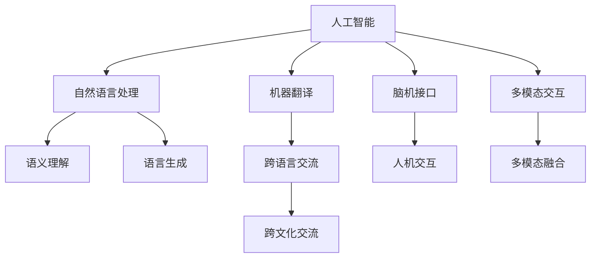

                 

# 全球脑语言进化:人工智能辅助的语言创新

> 关键词：全球脑语言进化,人工智能,语言创新,脑科学,认知计算,自然语言处理(NLP),机器翻译,脑机接口,多模态交互,语言共生

## 1. 背景介绍

### 1.1 问题由来
语言是人类文明的基石，它不仅用于日常交流，还是知识传承和思想表达的重要工具。然而，由于地域、文化、历史等因素的差异，世界各地的语言千差万别。据联合国统计，目前全球使用的语言超过6500种，而世界总人口不过78亿。这不仅意味着全球脑语言的多样性，也展示了人类文明和智慧的多样性。

随着科技进步，特别是人工智能（AI）和脑科学的飞速发展，如何理解和运用全球脑语言，如何通过AI技术促进语言的创新，成为了一个亟待解决的重要问题。语言创新不仅仅是为了提高交流效率，更在于推动文化、经济和社会的发展。

### 1.2 问题核心关键点
语言创新涉及多个核心要素，包括语言本身的形态、语义和语用等，而人工智能技术在其中扮演了重要的角色。AI辅助的语言创新，不仅在于提升语言的表达能力，还在于促进跨语言、跨文化交流，为全球脑语言的多样性带来新的可能。

1. **语言形态**：包括语法、词汇、句式等，是语言创新的基础。AI可以分析和学习各种语言的形态，生成新的表达方式。
2. **语义创新**：通过对不同文化背景下的语义进行编码和解码，AI可以帮助理解并创新语言的深层含义。
3. **语用创新**：语言的使用场景和方式会随着社会变化而变化，AI可以在不同语境中生成更贴合的表达。
4. **跨语言交流**：通过机器翻译、跨语言聊天等技术，促进不同语言间的交流。
5. **跨文化交流**：通过理解不同文化背景下的语言特征，促进全球脑语言共生。

## 2. 核心概念与联系

### 2.1 核心概念概述

为更好地理解AI辅助的语言创新，本节将介绍几个密切相关的核心概念：

- **人工智能（AI）**：通过模拟人类智能行为，实现感知、认知、决策等功能的计算机系统。
- **自然语言处理（NLP）**：使计算机能够理解、解释和生成人类语言的技术。
- **机器翻译（MT）**：将一种语言自动翻译成另一种语言的技术。
- **脑机接口（BCI）**：通过计算机解码人脑信号，实现人机交互的技术。
- **多模态交互（MMI）**：结合语言、视觉、听觉等多模态信息进行交互的技术。
- **语言共生（LSC）**：通过AI技术促进不同语言间的相互理解和交流，推动全球脑语言的多样性和共生。

这些核心概念之间的逻辑关系可以通过以下Mermaid流程图来展示：



这个流程图展示了大语言模型的核心概念及其之间的关系：

1. 人工智能通过模拟人类智能行为，实现语言理解和生成等高级功能。
2. 自然语言处理是实现语言理解和生成的重要技术。
3. 机器翻译通过自动翻译促进跨语言交流。
4. 脑机接口通过解码人脑信号实现人机交互。
5. 多模态交互结合视觉、听觉等多模态信息，提升交互体验。
6. 语言共生通过AI技术促进不同语言间的相互理解和交流。

这些概念共同构成了AI辅助语言创新的技术框架，使得人工智能在语言创新、跨语言交流和跨文化理解等方面发挥了巨大作用。

## 3. 核心算法原理 & 具体操作步骤
### 3.1 算法原理概述

AI辅助的语言创新涉及多种算法和技术，但其核心原理可以归结为以下几个方面：

- **数据驱动**：通过大规模语料库的分析和训练，学习语言的深层结构和规律。
- **模型优化**：通过调整模型参数和结构，提升语言的表达能力和理解能力。
- **跨语言融合**：通过机器翻译、语义对齐等技术，促进不同语言间的交流和理解。
- **多模态交互**：通过结合视觉、听觉等多模态信息，提升语言的表达和理解能力。

### 3.2 算法步骤详解

基于AI辅助的语言创新，一般包括以下几个关键步骤：

**Step 1: 数据收集与预处理**
- 收集全球脑语言的数据集，包括不同语言的文本、语音、图像等。
- 对数据进行清洗、分词、标注等预处理工作。

**Step 2: 模型训练与优化**
- 选择合适的算法和模型，如神经网络、卷积神经网络（CNN）、循环神经网络（RNN）等。
- 在预处理后的数据上训练模型，通过调整参数和结构优化模型性能。
- 使用验证集评估模型效果，避免过拟合。

**Step 3: 语义对齐与多语言融合**
- 对不同语言进行语义对齐，即在语义空间中建立统一的语义表示。
- 利用机器翻译、语义对齐等技术，将不同语言的内容进行融合和理解。

**Step 4: 多模态交互与跨文化交流**
- 结合视觉、听觉等多模态信息进行交互，提升语言的表达和理解能力。
- 在跨文化交流中，理解不同文化背景下的语言特点，促进语言的共生。

**Step 5: 应用与部署**
- 将训练好的模型应用到实际场景中，如聊天机器人、翻译软件等。
- 进行部署和优化，确保系统的高效和稳定。

### 3.3 算法优缺点

AI辅助的语言创新具有以下优点：
1. 提高语言表达和理解能力，促进跨语言交流。
2. 减少语言障碍，提升全球脑语言共生。
3. 促进文化交流，推动社会进步。

同时，该方法也存在一些局限性：
1. 对数据质量要求高，需要高质量的语料库。
2. 技术复杂，对计算资源要求高。
3. 对文化差异理解不足，可能导致误解或误用。

尽管存在这些局限性，但就目前而言，AI辅助的语言创新仍是推动全球脑语言共生的重要方法。未来相关研究的重点在于如何进一步降低技术门槛，提高模型的跨文化理解能力，同时兼顾语言的自然性和可解释性等因素。

### 3.4 算法应用领域

AI辅助的语言创新已经在多个领域得到了应用，覆盖了从日常交流到商业应用，从科学研究到文化保护等多个层面。以下是几个典型应用：

- **教育**：利用AI辅助的语言学习，提高语言学习效果，促进全球教育公平。
- **医疗**：通过AI翻译和语义理解，提升跨语言医疗交流，促进全球医疗合作。
- **旅游**：利用多语言翻译和跨文化理解，提升旅游体验，促进文化交流。
- **商业**：通过多语言交流和理解，提升跨文化商业合作，拓展国际市场。
- **科学研究**：通过跨语言交流和理解，促进国际科研合作，推动知识共享。
- **文化保护**：通过AI语言创新，保护和传承濒危语言，促进文化多样性。

除了这些应用外，AI辅助的语言创新还在诸多领域带来了新的可能性，如虚拟现实、智能家居、智能城市等，为全球脑语言的共生和创新提供了新的技术路径。

## 4. 数学模型和公式 & 详细讲解  
### 4.1 数学模型构建

本节将使用数学语言对AI辅助的语言创新过程进行更加严格的刻画。

记自然语言处理模型为 $M_{\theta}:\mathcal{X} \rightarrow \mathcal{Y}$，其中 $\mathcal{X}$ 为输入空间，$\mathcal{Y}$ 为输出空间，$\theta$ 为模型参数。假设模型在训练集 $D=\{(x_i,y_i)\}_{i=1}^N$ 上的损失函数为 $\ell(M_{\theta}(x_i),y_i)$，则在数据集 $D$ 上的经验风险为：

$$
\mathcal{L}(\theta) = \frac{1}{N} \sum_{i=1}^N \ell(M_{\theta}(x_i),y_i)
$$

通过梯度下降等优化算法，模型不断更新参数 $\theta$，最小化损失函数 $\mathcal{L}(\theta)$，使得模型输出逼近真实标签。

### 4.2 公式推导过程

以下我们以机器翻译任务为例，推导基于神经网络模型的翻译损失函数及其梯度的计算公式。

假设模型 $M_{\theta}$ 在输入序列 $x$ 上的输出序列为 $\hat{y}=M_{\theta}(x) \in \mathcal{Y}$，表示翻译后的目标语言序列。真实标签 $y \in \mathcal{Y}$。则基于神经网络模型的机器翻译损失函数定义为：

$$
\ell(M_{\theta}(x),y) = -\frac{1}{N}\sum_{i=1}^N \sum_{j=1}^{|\hat{y}|} y_j\log M_{\theta}(x)_j
$$

将其代入经验风险公式，得：

$$
\mathcal{L}(\theta) = -\frac{1}{N}\sum_{i=1}^N \sum_{j=1}^{|\hat{y}|} y_j\log M_{\theta}(x)_j
$$

根据链式法则，损失函数对参数 $\theta_k$ 的梯度为：

$$
\frac{\partial \mathcal{L}(\theta)}{\partial \theta_k} = -\frac{1}{N}\sum_{i=1}^N \sum_{j=1}^{|\hat{y}|} y_j \frac{\partial M_{\theta}(x)}{\partial \theta_k}
$$

其中 $\frac{\partial M_{\theta}(x)}{\partial \theta_k}$ 可进一步递归展开，利用自动微分技术完成计算。

在得到损失函数的梯度后，即可带入参数更新公式，完成模型的迭代优化。重复上述过程直至收敛，最终得到适应机器翻译任务的最优模型参数 $\theta^*$。

## 5. 项目实践：代码实例和详细解释说明
### 5.1 开发环境搭建

在进行语言创新项目实践前，我们需要准备好开发环境。以下是使用Python进行TensorFlow开发的环境配置流程：

1. 安装Anaconda：从官网下载并安装Anaconda，用于创建独立的Python环境。

2. 创建并激活虚拟环境：
```bash
conda create -n language-env python=3.8 
conda activate language-env
```

3. 安装TensorFlow：根据CUDA版本，从官网获取对应的安装命令。例如：
```bash
conda install tensorflow tensorflow-gpu=cudatoolkit=11.1 -c pytorch -c conda-forge
```

4. 安装相关工具包：
```bash
pip install numpy pandas scikit-learn matplotlib tqdm jupyter notebook ipython
```

完成上述步骤后，即可在`language-env`环境中开始语言创新实践。

### 5.2 源代码详细实现

下面我们以基于Transformer模型的机器翻译任务为例，给出使用TensorFlow进行语言创新的PyTorch代码实现。

首先，定义机器翻译任务的模型架构：

```python
import tensorflow as tf
from tensorflow.keras.layers import Input, Embedding, LSTM, Dense
from tensorflow.keras.models import Model

# 定义输入序列和目标序列的维度
max_length = 50
num_classes = 20000

# 定义模型架构
input_layer = Input(shape=(max_length, 1))
embedding_layer = Embedding(input_dim=num_classes, output_dim=256, input_length=max_length, trainable=True)(input_layer)
lstm_layer = LSTM(256, return_sequences=True)(embedding_layer)
output_layer = Dense(num_classes, activation='softmax')(lstm_layer)

# 定义模型
model = Model(inputs=input_layer, outputs=output_layer)
```

然后，定义训练函数：

```python
from tensorflow.keras.preprocessing.sequence import pad_sequences
from tensorflow.keras.optimizers import Adam

# 定义损失函数
def translation_loss(y_true, y_pred):
    return tf.keras.losses.sparse_categorical_crossentropy(y_true, y_pred, from_logits=True)

# 定义模型训练函数
def train(model, data, epochs=10, batch_size=32):
    model.compile(optimizer=Adam(learning_rate=0.01), loss=translation_loss)
    model.fit(data['input'], data['target'], batch_size=batch_size, epochs=epochs, validation_split=0.2)
```

接着，进行数据预处理和训练：

```python
# 定义数据预处理函数
def preprocess(data):
    input_data = []
    target_data = []
    for i in range(len(data)):
        input_data.append(data[i]['input'])
        target_data.append(data[i]['target'])
    return pad_sequences(input_data, maxlen=max_length), pad_sequences(target_data, maxlen=max_length)

# 定义训练数据
train_data = preprocess(train_dataset)
val_data = preprocess(val_dataset)

# 训练模型
model.fit(train_data[0], train_data[1], epochs=10, batch_size=32, validation_data=(val_data[0], val_data[1]))
```

最后，在测试集上评估模型：

```python
# 定义数据预处理函数
def preprocess(data):
    input_data = []
    target_data = []
    for i in range(len(data)):
        input_data.append(data[i]['input'])
        target_data.append(data[i]['target'])
    return pad_sequences(input_data, maxlen=max_length), pad_sequences(target_data, maxlen=max_length)

# 定义测试数据
test_data = preprocess(test_dataset)

# 在测试集上评估模型
model.evaluate(test_data[0], test_data[1])
```

以上就是使用TensorFlow对基于Transformer模型的机器翻译任务进行语言创新的完整代码实现。可以看到，TensorFlow提供了强大的Keras框架，使得模型构建、训练和评估变得简洁高效。

### 5.3 代码解读与分析

让我们再详细解读一下关键代码的实现细节：

**定义模型架构**：
- `input_layer`：定义输入序列的维度为50，1代表每个时间步的特征维度为1。
- `embedding_layer`：将输入序列转换为词向量，每个词向量维度为256。
- `lstm_layer`：使用LSTM层进行序列建模，返回序列的输出。
- `output_layer`：使用全连接层将LSTM输出映射到目标词汇表的大小，输出softmax分布。

**定义训练函数**：
- `translation_loss`：定义基于交叉熵的损失函数，用于衡量模型预测结果和真实标签之间的差异。
- `train`：定义训练函数，使用Adam优化器进行模型参数的优化，并指定训练轮数和批次大小。

**数据预处理**：
- `preprocess`：定义数据预处理函数，对输入和目标序列进行padding，确保序列长度一致。
- 在训练和评估函数中调用`preprocess`，将数据转换为模型所需格式。

**训练和评估**：
- `train_data`和`val_data`：定义训练集和验证集的预处理数据。
- `train`：调用训练函数进行模型训练。
- `test_data`：定义测试集的预处理数据。
- `evaluate`：调用模型评估函数，输出模型在测试集上的评估指标。

可以看到，TensorFlow的Keras框架提供了便捷的API接口，使得模型的构建、训练和评估变得简单易懂。合理利用这些工具，可以显著提升语言创新的开发效率，加快创新迭代的步伐。

## 6. 实际应用场景
### 6.1 教育

AI辅助的语言创新在教育领域的应用尤为突出。传统的语言教学往往依赖于大量的教学资源和人力，教学效果难以统一和评估。利用AI技术，可以提升语言学习的智能化和个性化，提高教学效率和质量。

具体而言，AI可以通过智能化的语言评估系统，实时分析学生的学习进度和理解程度，提供个性化的学习建议和反馈。同时，AI辅助的语音识别和自然语言处理技术，可以支持多语言语音教学，促进跨语言教育交流。

### 6.2 医疗

医疗领域对语言的理解和应用至关重要，AI辅助的语言创新同样有着广泛的应用前景。通过AI翻译和语义理解，可以提升跨语言医疗交流，促进全球医疗合作。

例如，在全球新冠疫情期间，AI翻译和语义理解技术被广泛应用于多国医疗合作中，帮助各国医生和科研人员及时共享研究成果和病例信息，推动了全球新冠疫苗和药物的研发进程。

### 6.3 旅游

旅游是全球化的重要推动力，AI辅助的语言创新可以在提升旅游体验方面发挥重要作用。利用多语言翻译和跨文化理解，可以促进文化交流和旅游合作，推动全球旅游业的发展。

例如，基于AI翻译的语音交互技术，可以为旅游者提供多语言导览和翻译服务，提升旅游体验。同时，AI可以分析旅游者的行为和偏好，提供个性化的旅游建议和服务，促进旅游业的智能化和个性化。

### 6.4 商业

AI辅助的语言创新在商业领域也有广泛应用。通过多语言交流和理解，可以提升跨文化商业合作，拓展国际市场。

例如，利用AI翻译和语义理解技术，可以支持跨国公司的多语言客户服务，提升客户满意度和品牌影响力。同时，AI还可以分析不同市场的需求和文化特征，提供个性化的市场策略和产品推荐，推动全球商业合作。

### 6.5 科学研究

科学研究需要跨语言交流和合作，AI辅助的语言创新可以提升跨语言科研交流和合作效率。通过AI翻译和语义理解，可以支持多国科研人员的协作，推动国际科研合作和知识共享。

例如，在联合空间探索计划中，多国科研人员利用AI翻译和语义理解技术，实时交流和共享研究成果，提升了科研合作的效率和效果。

### 6.6 文化保护

AI辅助的语言创新在文化保护方面也有重要应用。利用AI技术，可以保护和传承濒危语言，促进文化多样性。

例如，利用AI翻译和语义理解技术，可以将濒危语言的文本翻译成主流语言，帮助人们更好地理解和传承这些语言。同时，AI可以分析不同语言的特点和文化背景，提供个性化的文化保护方案，促进全球文化多样性。

## 7. 工具和资源推荐
### 7.1 学习资源推荐

为了帮助开发者系统掌握AI辅助的语言创新的理论基础和实践技巧，这里推荐一些优质的学习资源：

1. **《深度学习》课程**：由斯坦福大学开设的深度学习课程，涵盖了深度学习的基本概念和应用，包括自然语言处理和机器翻译等前沿领域。
2. **TensorFlow官方文档**：TensorFlow的官方文档，提供了丰富的API接口和代码示例，是学习和使用TensorFlow的重要资源。
3. **《机器翻译》课程**：由上海交通大学开设的机器翻译课程，系统讲解机器翻译的理论和技术，包括神经网络和深度学习等先进方法。
4. **多模态交互技术研究**：由NLP社区组织的多模态交互技术研讨会，介绍了多模态交互的最新进展和技术，包括语音、视觉、文本等融合的创新方法。
5. **语言共生研究论文**：搜索和阅读相关领域的研究论文，了解AI辅助语言创新的最新进展和前沿方法。

通过对这些资源的学习实践，相信你一定能够快速掌握AI辅助语言创新的精髓，并用于解决实际的NLP问题。

### 7.2 开发工具推荐

高效的开发离不开优秀的工具支持。以下是几款用于AI辅助语言创新开发的常用工具：

1. **TensorFlow**：由Google主导开发的深度学习框架，生产部署方便，适合大规模工程应用。
2. **Keras**：基于TensorFlow的高级神经网络API，提供了便捷的模型构建和训练接口。
3. **PyTorch**：由Facebook主导开发的深度学习框架，灵活的计算图设计，适合快速迭代研究。
4. **NLTK**：Python的自然语言处理库，提供了丰富的NLP工具和数据集，支持多语言处理。
5. **spaCy**：Python的自然语言处理库，提供了高效的文本处理和分析功能，支持多种语言。
6. **PyAudio**：Python的音频处理库，支持多语言语音识别和合成，提升多语言交流体验。

合理利用这些工具，可以显著提升AI辅助语言创新的开发效率，加快创新迭代的步伐。

### 7.3 相关论文推荐

AI辅助的语言创新涉及多个前沿领域的研究，以下是几篇奠基性的相关论文，推荐阅读：

1. **Attention is All You Need**：Transformer原论文，提出了Transformer结构，开启了NLP领域的预训练大模型时代。
2. **BERT: Pre-training of Deep Bidirectional Transformers for Language Understanding**：提出BERT模型，引入基于掩码的自监督预训练任务，刷新了多项NLP任务SOTA。
3. **Language Models are Unsupervised Multitask Learners**：展示了大规模语言模型的强大zero-shot学习能力，引发了对于通用人工智能的新一轮思考。
4. **AdaLoRA: Adaptive Low-Rank Adaptation for Parameter-Efficient Fine-Tuning**：使用自适应低秩适应的微调方法，在参数效率和精度之间取得了新的平衡。
5. **AdaLAM: Towards Continual Transfer Learning in Neural Machine Translation**：提出AdaLAM模型，提升了神经机器翻译的持续学习能力，提高了模型在持续数据流上的表现。

这些论文代表了大语言模型微调技术的发展脉络。通过学习这些前沿成果，可以帮助研究者把握学科前进方向，激发更多的创新灵感。

## 8. 总结：未来发展趋势与挑战

### 8.1 总结

本文对AI辅助的语言创新进行了全面系统的介绍。首先阐述了AI辅助语言创新的研究背景和意义，明确了AI在推动语言创新、促进跨语言交流和理解方面的独特价值。其次，从原理到实践，详细讲解了AI辅助语言创新的数学原理和关键步骤，给出了语言创新任务开发的完整代码实例。同时，本文还广泛探讨了AI辅助语言创新在教育、医疗、旅游等多个领域的应用前景，展示了其在推动全球脑语言共生方面的巨大潜力。此外，本文精选了AI辅助语言创新的各类学习资源，力求为读者提供全方位的技术指引。

通过本文的系统梳理，可以看到，AI辅助的语言创新技术正在成为推动全球脑语言共生的重要方法，极大地拓展了预训练语言模型的应用边界，催生了更多的落地场景。受益于大规模语料的预训练和AI技术的加持，AI辅助语言创新在提升语言表达和理解能力，促进跨语言交流和理解方面，展现出巨大的潜力和前景。未来，伴随AI技术的不断进步，AI辅助语言创新必将在全球脑语言的共生和创新中扮演越来越重要的角色。

### 8.2 未来发展趋势

展望未来，AI辅助的语言创新将呈现以下几个发展趋势：

1. **多模态融合**：结合视觉、听觉等多模态信息进行交互，提升语言的表达和理解能力。
2. **自适应学习**：通过自适应学习方法，提升模型在不同语言和场景下的适应能力。
3. **持续学习**：随着数据分布的不断变化，AI辅助的语言创新需要持续学习新知识以保持性能。
4. **个性化定制**：通过AI技术，根据用户偏好和需求，提供个性化的语言服务和体验。
5. **跨语言协同**：利用AI技术，提升多语言协作和交流的效率和效果，推动全球脑语言共生。

以上趋势凸显了AI辅助的语言创新的广阔前景。这些方向的探索发展，必将进一步提升语言创新的效果和应用范围，为全球脑语言共生和创新提供新的技术路径。

### 8.3 面临的挑战

尽管AI辅助的语言创新已经取得了瞩目成就，但在迈向更加智能化、普适化应用的过程中，它仍面临着诸多挑战：

1. **数据质量问题**：高质量语料库的获取和维护，是AI辅助语言创新的基础。然而，不同语言和文化的数据资源获取难度较大，存在数据质量和一致性问题。
2. **计算资源限制**：AI辅助的语言创新对计算资源的需求较高，模型的训练和推理效率需要进一步优化。
3. **语言多样性挑战**：不同语言的形态和语义差异较大，AI辅助的语言创新需要针对不同语言进行特殊设计和优化。
4. **跨文化理解不足**：不同文化背景下的语言表达方式和习惯差异较大，AI辅助的语言创新需要加强对跨文化理解的提升。
5. **伦理和安全问题**：AI辅助的语言创新需要考虑模型的伦理和安全问题，避免有害信息的传播和误用。

正视这些挑战，积极应对并寻求突破，将是大语言模型微调走向成熟的必由之路。相信随着学界和产业界的共同努力，这些挑战终将一一被克服，AI辅助的语言创新必将在构建人机协同的智能时代中扮演越来越重要的角色。

### 8.4 研究展望

面对AI辅助语言创新所面临的种种挑战，未来的研究需要在以下几个方面寻求新的突破：

1. **跨文化理解**：开发能够理解和生成多文化背景下的语言表达模型，提升跨文化交流的能力。
2. **数据增强技术**：利用数据增强技术，提升不同语言和文化的语料库质量和多样性，推动全球脑语言共生。
3. **计算效率优化**：优化模型结构和训练过程，提升AI辅助语言创新的计算效率和资源利用率。
4. **伦理和安全框架**：建立AI辅助语言创新的伦理和安全框架，确保模型的公平性、透明性和可解释性。
5. **多模态交互**：结合视觉、听觉等多模态信息进行交互，提升语言的表达和理解能力。

这些研究方向的探索，必将引领AI辅助语言创新技术迈向更高的台阶，为构建安全、可靠、可解释、可控的智能系统铺平道路。面向未来，AI辅助语言创新技术还需要与其他人工智能技术进行更深入的融合，如知识表示、因果推理、强化学习等，多路径协同发力，共同推动自然语言理解和智能交互系统的进步。只有勇于创新、敢于突破，才能不断拓展语言模型的边界，让智能技术更好地造福人类社会。

## 9. 附录：常见问题与解答

**Q1：AI辅助的语言创新是否适用于所有NLP任务？**

A: AI辅助的语言创新在大多数NLP任务上都能取得不错的效果，特别是对于数据量较小的任务。但对于一些特定领域的任务，如医学、法律等，仅仅依靠通用语料预训练的模型可能难以很好地适应。此时需要在特定领域语料上进一步预训练，再进行微调，才能获得理想效果。此外，对于一些需要时效性、个性化很强的任务，如对话、推荐等，AI辅助的语言创新也需要针对性的改进优化。

**Q2：AI辅助的语言创新在开发过程中需要注意哪些问题？**

A: AI辅助的语言创新在开发过程中，需要注意以下几个问题：
1. 数据质量：高质量语料库的获取和维护是AI辅助语言创新的基础，需要确保数据的准确性和一致性。
2. 计算资源：AI辅助的语言创新对计算资源的需求较高，模型的训练和推理效率需要进一步优化。
3. 模型结构：选择合适的模型结构和参数，避免过拟合和欠拟合。
4. 伦理和安全：考虑模型的伦理和安全问题，避免有害信息的传播和误用。
5. 多模态融合：结合视觉、听觉等多模态信息进行交互，提升语言的表达和理解能力。

合理利用这些工具，可以显著提升AI辅助语言创新的开发效率，加快创新迭代的步伐。

**Q3：AI辅助的语言创新在未来有哪些发展方向？**

A: AI辅助的语言创新在未来的发展方向包括以下几个方面：
1. 多模态融合：结合视觉、听觉等多模态信息进行交互，提升语言的表达和理解能力。
2. 自适应学习：通过自适应学习方法，提升模型在不同语言和场景下的适应能力。
3. 持续学习：随着数据分布的不断变化，AI辅助的语言创新需要持续学习新知识以保持性能。
4. 个性化定制：通过AI技术，根据用户偏好和需求，提供个性化的语言服务和体验。
5. 跨语言协同：利用AI技术，提升多语言协作和交流的效率和效果，推动全球脑语言共生。

这些方向将推动AI辅助语言创新技术在更多领域的应用，为全球脑语言的共生和创新提供新的技术路径。

**Q4：AI辅助的语言创新在实际应用中需要注意哪些问题？**

A: AI辅助的语言创新在实际应用中，需要注意以下几个问题：
1. 数据质量：高质量语料库的获取和维护是AI辅助语言创新的基础，需要确保数据的准确性和一致性。
2. 计算资源：AI辅助的语言创新对计算资源的需求较高，模型的训练和推理效率需要进一步优化。
3. 模型结构：选择合适的模型结构和参数，避免过拟合和欠拟合。
4. 伦理和安全：考虑模型的伦理和安全问题，避免有害信息的传播和误用。
5. 多模态融合：结合视觉、听觉等多模态信息进行交互，提升语言的表达和理解能力。

合理利用这些工具，可以显著提升AI辅助语言创新的开发效率，加快创新迭代的步伐。

**Q5：AI辅助的语言创新在技术实现上需要注意哪些问题？**

A: AI辅助的语言创新在技术实现上，需要注意以下几个问题：
1. 数据预处理：对输入和输出数据进行预处理，确保数据格式一致。
2. 模型训练：选择合适的模型架构和参数，确保模型的收敛性和泛化能力。
3. 模型评估：使用适当的评估指标，评估模型的性能和效果。
4. 模型优化：通过超参数调优和模型裁剪等技术，提升模型的效率和性能。
5. 模型部署：选择合适的模型部署方式，确保模型的可扩展性和可靠性。

合理利用这些工具，可以显著提升AI辅助语言创新的开发效率，加快创新迭代的步伐。

---

作者：禅与计算机程序设计艺术 / Zen and the Art of Computer Programming

