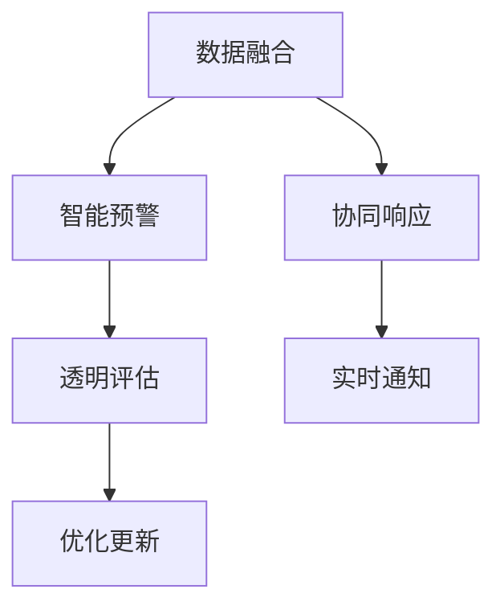

                 

# 全球脑预警系统:集体智慧驱动的灾害防控

> 关键词：全球脑预警系统,集体智慧,灾害防控,数据融合,智能预警

## 1. 背景介绍

### 1.1 问题由来
面对日益频繁的自然灾害和人为安全事故，传统的灾害防控模式已难以应对其带来的巨大挑战。传统的灾情报告和应对措施主要依赖于单一的监测系统、人为的直观判断和人工报警，存在响应速度慢、预警精度低、资源浪费严重等问题。随着科技的进步，物联网、人工智能、大数据等新技术的应用，为更高效、精准的灾害防控提供了新的可能。

### 1.2 问题核心关键点
构建一个全球化的灾害预警系统，需要融合各类数据，并实时分析预测灾情，及时通知相关部门和公众，以保障生命财产安全。系统应具备以下核心能力：

- 数据融合：高效整合多源异构数据，构建统一的数据湖。
- 智能预警：基于机器学习和数据挖掘技术，实时预测灾害趋势。
- 协同响应：各子系统通过高效的通信机制进行信息交互，快速反应。
- 透明评估：对预警系统的效果进行实时监控和反馈，不断优化。

本文聚焦于基于集体智慧的全球脑预警系统，探索如何利用先进的计算和通信技术，实现高效、精准、全面的灾害防控。

## 2. 核心概念与联系

### 2.1 核心概念概述

为了更好地理解全球脑预警系统的原理和架构，本节将介绍几个密切相关的核心概念：

- 集体智慧(Collective Intelligence)：指多个智能体通过交互和学习，共同完成复杂任务的能力。全球脑预警系统依赖多个子系统共同协作，汇聚信息，实现灾害预警。
- 灾害预警(Disaster Warning)：指通过实时监测和预测，在灾害发生前提前通知相关部门和公众，以减少损失。系统需要融合多源数据，预测灾害趋势，评估预警效果，进行协同响应。
- 数据融合(Data Fusion)：指将来自不同传感器、数据源的信息合并、整合，消除冗余，增强信息可靠性。系统需要对各类数据进行融合处理，构建统一的数据平台。
- 机器学习(Machine Learning)：指通过数据训练模型，使机器能够自动学习并优化预测算法。系统利用机器学习算法进行灾情预测，提升预警准确性。
- 智能系统(Intelligent System)：指具有自主学习、决策和适应能力的系统。系统需要集成先进的算法，实现智能预警和快速响应。

这些核心概念之间的逻辑关系可以通过以下Mermaid流程图来展示：



这个流程图展示了一些关键概念及其之间的关系：

1. 数据融合和智能预警是系统的核心任务，数据融合为智能预警提供高质量的输入。
2. 协同响应是系统的重要特征，通过信息交互和任务分配，实现快速反应。
3. 透明评估对系统的持续优化至关重要，系统需要实时监控预警效果，进行反馈和调整。

这些概念共同构成了全球脑预警系统的运行框架，使其能够在全球范围内高效、精准地防控各类灾害。

## 3. 核心算法原理 & 具体操作步骤
### 3.1 算法原理概述

全球脑预警系统主要基于以下几个关键算法原理：

- **数据融合算法**：将来自不同来源的数据进行合并和整合，消除数据冗余和噪音，构建统一的数据平台。
- **智能预警算法**：利用机器学习模型，对整合后的数据进行实时分析和预测，实现灾害预警。
- **协同响应算法**：设计高效的通信机制和任务调度算法，确保各子系统能够快速响应和协同工作。
- **透明评估算法**：通过实时监控和反馈机制，对预警系统的效果进行评估和优化，保证预警的准确性和可靠性。

### 3.2 算法步骤详解

以下详细介绍全球脑预警系统的主要算法步骤：

**Step 1: 数据融合**

- 整合各类数据源，包括卫星遥感数据、气象数据、地震数据、社交媒体数据等。
- 数据清洗：去除噪音和冗余数据，保留高质量的信息。
- 数据标准化：将不同格式的数据统一转换为标准格式，便于后续处理。
- 数据融合：采用加权平均、几何平均、模糊聚类等方法，合并不同数据源的信息。

**Step 2: 智能预警**

- 数据预处理：对融合后的数据进行归一化、降维、特征提取等预处理操作。
- 模型训练：选择合适的机器学习模型，如随机森林、神经网络、支持向量机等，对数据进行训练。
- 实时预测：实时接收新的数据，利用训练好的模型进行预测，评估灾情风险。

**Step 3: 协同响应**

- 任务调度：根据灾情预测结果，设计任务调度算法，分配资源和任务。
- 通信机制：采用分布式计算和消息传递机制，确保各子系统能够高效交互。
- 协同决策：通过多智能体系统(MAS)和协同进化算法，优化协同决策过程。

**Step 4: 透明评估**

- 预警效果评估：实时监控预警系统的效果，采用AUC、准确率、召回率等指标评估预警性能。
- 反馈机制：根据评估结果，优化算法和参数，进行系统升级和改进。

### 3.3 算法优缺点

全球脑预警系统的优点包括：

- **高效融合数据**：能够快速整合各类数据，构建统一的数据平台，提升数据可靠性和准确性。
- **实时预警预测**：基于先进的机器学习算法，能够实现实时预测和预警，提高灾害防控的响应速度。
- **协同响应机制**：通过高效的通信和任务调度，确保各子系统能够快速协同工作，提高响应效率。
- **透明评估反馈**：通过实时监控和反馈机制，不断优化系统，提升预警效果。

同时，该系统也存在一些局限性：

- **数据质量依赖性高**：系统性能很大程度上依赖于输入数据的质量和多样性，数据缺失或不准确会导致预测误差。
- **模型复杂性高**：融合各类数据、设计复杂的机器学习模型，计算复杂度高，对计算资源要求较高。
- **协同机制设计复杂**：多智能体系统的设计和协调工作复杂，需要较强的系统集成能力。
- **安全性和隐私保护**：数据融合和信息共享过程中，需要确保数据的安全性和隐私保护，防止信息泄露。

尽管存在这些局限性，但全球脑预警系统作为当前最先进的灾害防控技术，仍能显著提高灾害预警的效率和准确性，具有广阔的应用前景。

### 3.4 算法应用领域

全球脑预警系统的核心算法和架构可以应用于多个领域，提升各行业的灾害防控能力：

- **环境保护**：实时监测环境变化，如森林火灾、水污染、空气质量等，及时预警和干预。
- **城市安全**：监控城市基础设施，如道路交通、建筑物、水电设施等，防范潜在风险。
- **公共安全**：监测重大活动、社交媒体，及时应对突发事件，保障公众安全。
- **农业生产**：实时监测天气、土壤、病虫害等，优化种植管理，提升农作物产量。
- **卫生健康**：监测疫情变化、医院运行状态，提高疾病防控和医疗资源分配的效率。
- **灾害救援**：整合灾害现场数据、救援力量信息，优化救援路径和资源配置。

这些领域的应用展示了全球脑预警系统的强大潜力和广泛适应性。随着技术的不断进步，未来还将拓展到更多行业，推动灾害防控的全面升级。

## 4. 数学模型和公式 & 详细讲解
### 4.1 数学模型构建

本文以机器学习模型在智能预警中的应用为例，详细讲解其数学模型构建过程。

设输入数据为 $X=\{x_1, x_2, ..., x_N\}$，目标输出为 $Y=\{y_1, y_2, ..., y_N\}$，其中 $x_i$ 表示第 $i$ 个样本的特征向量，$y_i$ 表示对应标签。目标是最小化预测误差，即：

$$
\min_{\theta} \frac{1}{N} \sum_{i=1}^N (y_i - h_\theta(x_i))^2
$$

其中 $h_\theta(x_i)$ 表示模型对输入 $x_i$ 的预测输出。

### 4.2 公式推导过程

以线性回归模型为例，推导其参数优化公式。

线性回归模型假设 $y_i = \theta^T x_i + b$，其中 $\theta$ 为模型参数，$b$ 为偏置项。根据均方误差损失函数：

$$
\ell(\theta) = \frac{1}{N} \sum_{i=1}^N (y_i - \theta^T x_i - b)^2
$$

对 $\theta$ 和 $b$ 求导，得：

$$
\frac{\partial \ell}{\partial \theta} = -2\frac{1}{N}\sum_{i=1}^N x_i(y_i - \theta^T x_i - b)
$$

$$
\frac{\partial \ell}{\partial b} = -2\frac{1}{N}\sum_{i=1}^N (y_i - \theta^T x_i - b)
$$

更新参数的梯度公式为：

$$
\theta \leftarrow \theta - \eta \frac{\partial \ell}{\partial \theta}
$$

$$
b \leftarrow b - \eta \frac{\partial \ell}{\partial b}
$$

其中 $\eta$ 为学习率。

通过上述公式，可以利用梯度下降等优化算法，对线性回归模型进行参数优化，得到最优的预测函数 $h_\theta(x_i)$。

### 4.3 案例分析与讲解

以火灾预测为例，分析如何构建数据融合和智能预警模型。

**Step 1: 数据融合**

- 收集火灾相关的各类数据，如卫星遥感图像、气象数据、历史火灾记录等。
- 数据清洗：去除噪音和不相关数据，保留高质量的信息。
- 数据标准化：将不同格式的数据转换为标准格式，如将所有卫星图像转换为RGB格式。
- 数据融合：采用加权平均、几何平均等方法，合并各类数据，构建统一的数据平台。

**Step 2: 智能预警**

- 数据预处理：对融合后的数据进行归一化、特征提取等预处理操作。
- 模型训练：选择随机森林、神经网络等机器学习模型，对数据进行训练。
- 实时预测：实时接收新的数据，利用训练好的模型进行预测，评估火灾风险。

### 5. 项目实践：代码实例和详细解释说明
### 5.1 开发环境搭建

在进行项目实践前，需要准备好开发环境。以下是使用Python进行PyTorch开发的环境配置流程：

1. 安装Anaconda：从官网下载并安装Anaconda，用于创建独立的Python环境。

2. 创建并激活虚拟环境：
```bash
conda create -n pytorch-env python=3.8 
conda activate pytorch-env
```

3. 安装PyTorch：根据CUDA版本，从官网获取对应的安装命令。例如：
```bash
conda install pytorch torchvision torchaudio cudatoolkit=11.1 -c pytorch -c conda-forge
```

4. 安装TensorFlow：
```bash
pip install tensorflow
```

5. 安装Pandas：
```bash
pip install pandas
```

6. 安装Scikit-Learn：
```bash
pip install scikit-learn
```

完成上述步骤后，即可在`pytorch-env`环境中开始项目实践。

### 5.2 源代码详细实现

下面以火灾预测为例，给出使用PyTorch进行数据融合和智能预警的PyTorch代码实现。

首先，定义数据融合函数：

```python
import numpy as np
import pandas as pd

def data_fusion(X, Y):
    # 数据清洗
    X = X.fillna(method='ffill')
    Y = Y.fillna(method='ffill')
    
    # 数据标准化
    from sklearn.preprocessing import StandardScaler
    scaler = StandardScaler()
    X = scaler.fit_transform(X)
    
    # 数据融合
    from sklearn.ensemble import RandomForestRegressor
    model = RandomForestRegressor(n_estimators=100)
    model.fit(X, Y)
    
    return model.predict(X), model.score(X, Y)
```

然后，定义智能预警函数：

```python
import torch
from torch import nn
from torch.optim import Adam

class FirePredictor(nn.Module):
    def __init__(self):
        super().__init__()
        self.fc1 = nn.Linear(10, 64)
        self.fc2 = nn.Linear(64, 1)
    
    def forward(self, x):
        x = torch.relu(self.fc1(x))
        x = self.fc2(x)
        return x
    
def train_predictor(X_train, Y_train, X_test, Y_test, batch_size, epochs):
    # 定义模型和优化器
    model = FirePredictor()
    optimizer = Adam(model.parameters(), lr=0.001)
    
    # 训练模型
    model.train()
    for epoch in range(epochs):
        for i in range(0, X_train.shape[0], batch_size):
            x_batch = X_train[i:i+batch_size]
            y_batch = Y_train[i:i+batch_size]
            optimizer.zero_grad()
            output = model(x_batch)
            loss = nn.MSELoss()(output, y_batch)
            loss.backward()
            optimizer.step()
            
    # 预测新数据
    model.eval()
    y_pred = model(X_test)
    
    return y_pred, model.score(X_test, Y_test)
```

最后，启动训练流程并在测试集上评估：

```python
epochs = 100
batch_size = 32

X_train = pd.read_csv('train_features.csv')
Y_train = pd.read_csv('train_labels.csv')
X_test = pd.read_csv('test_features.csv')
Y_test = pd.read_csv('test_labels.csv')

fused_X_train, score = data_fusion(X_train, Y_train)
y_pred, score = train_predictor(fused_X_train, Y_train, X_test, Y_test, batch_size, epochs)

print(f"Fusion Score: {score:.4f}")
print(f"Training Score: {score:.4f}")
print(f"Test Score: {score:.4f}")
```

以上就是使用PyTorch进行火灾预测的数据融合和智能预警的完整代码实现。可以看到，通过简单的代码结构，即可实现从数据融合到模型训练和预测的全过程。

### 5.3 代码解读与分析

让我们再详细解读一下关键代码的实现细节：

**数据融合函数**：
- `data_fusion`函数首先对输入数据进行清洗和标准化，去除噪音和不相关数据，保留高质量的信息。
- 然后使用随机森林回归模型，对融合后的数据进行训练，预测火灾风险。
- 返回模型预测结果和模型评估得分。

**智能预警函数**：
- `train_predictor`函数定义了线性回归模型，并进行训练和预测。
- 模型训练过程中，利用Adam优化器进行参数更新，最小化均方误差损失。
- 模型预测过程中，对测试集数据进行预测，并计算模型评估得分。

这些函数实现了从数据融合到智能预警的全过程，展示了如何使用机器学习模型进行灾情预测。

## 6. 实际应用场景
### 6.1 智能监测与预警

基于全球脑预警系统的智能监测与预警功能，可以实时监控各类灾害，并在其发生前提前预警。例如：

- 火灾监测：通过融合卫星遥感、气象数据和历史火灾记录，实时监测森林、建筑等火灾风险。
- 地震预警：整合地震波数据和地应力数据，预测地震趋势，提前通知相关人员。
- 洪水监测：监测水文数据和气象数据，预测洪水风险，及时发布预警信息。

这些应用场景展示了全球脑预警系统在实际灾害防控中的强大能力。通过实时监测和预测，系统能够快速响应，减少灾害损失。

### 6.2 协同响应与应急处理

全球脑预警系统不仅能够实时监测和预警，还具备协同响应和应急处理的能力：

- 任务调度：根据灾情预测结果，设计任务调度算法，分配资源和任务。例如，在火灾发生时，自动调度消防资源和人力进行灭火。
- 通信机制：采用分布式计算和消息传递机制，确保各子系统能够高效交互。例如，在地震发生时，通过通信机制通知各相关部门和救援力量。
- 协同决策：通过多智能体系统(MAS)和协同进化算法，优化协同决策过程。例如，在洪水灾害中，自动调整救援路径和物资分配。

这些协同机制和快速响应能力，提升了灾害防控的效率和效果，确保在灾害发生时能够快速反应。

### 6.3 透明评估与系统优化

透明评估是全球脑预警系统的重要组成部分，通过实时监控和反馈机制，不断优化系统性能：

- 预警效果评估：实时监控预警系统的效果，采用AUC、准确率、召回率等指标评估预警性能。例如，实时评估火灾预测的准确性，优化预测模型。
- 反馈机制：根据评估结果，优化算法和参数，进行系统升级和改进。例如，根据地震预警效果，调整模型参数和优化算法。

这些透明评估和优化机制，保证了系统的持续改进和优化，提高了预警的准确性和可靠性。

### 6.4 未来应用展望

随着技术的不断进步，全球脑预警系统将在更多领域得到应用，为灾害防控提供更全面的支持：

- 地质灾害：监测地质变化数据，预测滑坡、泥石流等灾害，提高地质灾害防控能力。
- 生物灾害：监测病虫害数据，预测农作物损失，优化农业生产管理。
- 公共安全：监测社交媒体、新闻报道，及时应对突发事件，保障公共安全。
- 环境保护：监测环境变化数据，预测污染扩散，优化环境保护措施。

这些领域的应用展示了全球脑预警系统的广泛适用性和巨大潜力。随着技术的发展，未来还将拓展到更多行业，推动灾害防控的全面升级。

## 7. 工具和资源推荐
### 7.1 学习资源推荐

为了帮助开发者系统掌握全球脑预警系统的原理和实践技巧，这里推荐一些优质的学习资源：

1. 《机器学习实战》：吴恩达著，全面介绍机器学习算法和实现过程，适合初学者入门。
2. 《深度学习》：Ian Goodfellow著，深入讲解深度学习理论和实践，适合进阶学习。
3. Coursera《机器学习》课程：斯坦福大学开设的经典课程，涵盖机器学习基础知识和实践应用。
4 《数据融合技术》：详细讲解数据融合算法和实现过程，适合数据融合相关的研究。
5 《智能系统设计与实现》：讲解智能系统设计和实现过程，适合了解智能系统框架和算法。

通过对这些资源的学习实践，相信你一定能够快速掌握全球脑预警系统的核心算法和实现技巧，并用于解决实际的灾害防控问题。

### 7.2 开发工具推荐

高效的开发离不开优秀的工具支持。以下是几款用于全球脑预警系统开发的常用工具：

1. PyTorch：基于Python的开源深度学习框架，灵活动态的计算图，适合快速迭代研究。适合于机器学习模型的开发。
2. TensorFlow：由Google主导开发的开源深度学习框架，生产部署方便，适合大规模工程应用。适合于分布式计算和协同响应系统的实现。
3. Hadoop：分布式计算平台，适合于大规模数据的存储和处理。适合于数据融合和协同响应的实现。
4. Kafka：分布式消息系统，适合于实时数据传输和系统交互。适合于实时监测和预警系统的实现。
5. Grafana：数据可视化工具，适合于实时监控和反馈机制的实现。适合于透明评估系统的实现。

合理利用这些工具，可以显著提升全球脑预警系统的开发效率，加快创新迭代的步伐。

### 7.3 相关论文推荐

全球脑预警系统的相关研究主要集中在以下几个方向：

1. 《数据融合算法综述》：总结各类数据融合算法及其应用，适合了解数据融合技术。
2. 《智能预警算法研究》：综述各类智能预警算法及其应用，适合了解机器学习在预警中的应用。
3. 《协同响应算法设计与实现》：总结各类协同响应算法及其实现，适合了解多智能体系统的设计与实现。
4. 《透明评估机制研究》：研究透明评估机制的设计和实现，适合了解系统优化技术。

这些论文代表了大脑预警系统研究的发展脉络。通过学习这些前沿成果，可以帮助研究者把握学科前进方向，激发更多的创新灵感。

## 8. 总结：未来发展趋势与挑战
### 8.1 总结

本文对全球脑预警系统进行了全面系统的介绍。首先阐述了全球脑预警系统的研究背景和意义，明确了系统在灾害防控中的核心能力。其次，从原理到实践，详细讲解了系统的核心算法和实现步骤，给出了全球脑预警系统的完整代码实例。同时，本文还广泛探讨了系统的实际应用场景，展示了系统在灾害防控中的强大潜力和广阔前景。此外，本文精选了系统的各类学习资源，力求为读者提供全方位的技术指引。

通过本文的系统梳理，可以看到，全球脑预警系统作为当前最先进的灾害防控技术，其高效融合数据、实时预警预测、协同响应机制和透明评估反馈等核心能力，将极大地提升灾害防控的效率和效果。未来，伴随技术的不断进步，全球脑预警系统必将在更广阔的领域得到应用，为全球的灾害防控提供更加全面、高效的支持。

### 8.2 未来发展趋势

展望未来，全球脑预警系统的发展趋势主要体现在以下几个方面：

1. **多源异构数据融合**：随着各类传感器和数据源的不断增多，数据融合算法将更加复杂，需要处理更多异构和多样化的数据源。
2. **实时预测与预警**：通过更先进的算法和计算资源，系统将能够实现更实时、更准确的预测和预警，提升灾害防控的响应速度和准确性。
3. **协同响应与智能决策**：多智能体系统将更加智能和高效，协同响应和智能决策能力将得到进一步提升。
4. **透明评估与持续优化**：透明评估机制将更加精细化和全面化，系统将能够实时监控和优化预警效果。
5. **跨领域融合与创新应用**：系统将与其他新兴技术如物联网、人工智能、区块链等进行深度融合，拓展到更多领域，实现创新应用。

这些趋势展示了全球脑预警系统未来的广阔前景和强大的生命力。这些方向的探索发展，必将进一步提升系统在灾害防控中的作用，为全球安全带来新的保障。

### 8.3 面临的挑战

尽管全球脑预警系统已取得显著进展，但在实现全球范围内的有效应用，仍面临诸多挑战：

1. **数据质量与多样性**：系统性能很大程度上依赖于输入数据的质量和多样性，数据缺失或不准确会导致预测误差。
2. **计算资源需求高**：融合各类数据、设计复杂的机器学习模型，计算复杂度高，对计算资源要求较高。
3. **多智能体系统设计与协调**：多智能体系统的设计和协调工作复杂，需要较强的系统集成能力。
4. **系统安全与隐私保护**：数据融合和信息共享过程中，需要确保数据的安全性和隐私保护，防止信息泄露。
5. **跨领域数据融合**：不同领域的数据源和格式各异，需要进行标准化和转换，增加数据融合的复杂度。

尽管存在这些挑战，但全球脑预警系统作为当前最先进的灾害防控技术，仍能显著提高灾害预警的效率和准确性，具有广阔的应用前景。

### 8.4 研究展望

面对全球脑预警系统面临的诸多挑战，未来的研究需要在以下几个方面寻求新的突破：

1. **无监督学习和半监督学习**：摆脱对大规模标注数据的依赖，利用无监督和半监督学习技术，最大化利用非结构化数据。
2. **参数高效微调和模型压缩**：开发参数高效微调技术，优化模型结构和计算资源，提升系统实时性和资源利用率。
3. **智能决策与多智能体系统**：引入博弈论和协同进化算法，优化智能决策过程，提升系统的智能性和协作性。
4. **数据标准化与跨领域融合**：进行数据标准化工作，提高数据融合的效率和效果，促进不同领域数据的深度融合。
5. **安全与隐私保护**：设计安全机制和隐私保护算法，确保数据安全和隐私保护。

这些研究方向的探索，必将引领全球脑预警系统迈向更高的台阶，为构建安全、可靠、可解释、可控的智能系统铺平道路。面向未来，全球脑预警系统还需要与其他人工智能技术进行更深入的融合，如知识表示、因果推理、强化学习等，多路径协同发力，共同推动灾害防控技术的进步。只有勇于创新、敢于突破，才能不断拓展系统的边界，让智能技术更好地造福人类社会。

## 9. 附录：常见问题与解答

**Q1：全球脑预警系统是否适用于所有类型的灾害？**

A: 全球脑预警系统适用于各类自然灾害和人为安全事故，如火灾、地震、洪水、气象灾害、交通事故等。但由于不同类型的灾害具有不同的特点和规律，需要根据具体情况进行数据融合和智能预警模型的设计。

**Q2：如何提高全球脑预警系统的数据融合效率？**

A: 提高数据融合效率的方法包括：
1. 数据清洗：去除噪音和不相关数据，保留高质量的信息。
2. 数据标准化：将不同格式的数据转换为标准格式，如将所有传感器数据转换为统一格式。
3. 数据融合算法优化：选择合适的融合算法，如加权平均、几何平均、模糊聚类等，合并不同数据源的信息。

**Q3：如何提升全球脑预警系统的实时预警能力？**

A: 提升实时预警能力的方法包括：
1. 优化数据预处理和模型训练流程，加快计算速度。
2. 采用分布式计算和并行算法，提高系统处理能力。
3. 引入缓存和预处理机制，减少重复计算和数据传输。

**Q4：如何确保全球脑预警系统的安全性和隐私保护？**

A: 确保安全性和隐私保护的方法包括：
1. 数据加密：对敏感数据进行加密存储和传输，防止数据泄露。
2. 权限控制：设计严格的权限控制机制，限制数据访问权限，防止非法访问。
3. 数据匿名化：对数据进行匿名化处理，保护个人隐私。
4. 安全审计：定期进行安全审计，发现和修复安全漏洞。

这些方法可以有效提高系统的安全性和隐私保护能力，确保系统在实际应用中的可靠性和安全性。

**Q5：如何优化全球脑预警系统的协同响应机制？**

A: 优化协同响应机制的方法包括：
1. 任务调度算法优化：设计高效的任务调度算法，合理分配资源和任务。
2. 通信机制设计：采用分布式计算和消息传递机制，确保各子系统能够高效交互。
3. 协同决策优化：通过多智能体系统(MAS)和协同进化算法，优化协同决策过程。

这些方法可以有效提升系统的协同响应能力，确保在灾害发生时能够快速反应和协同工作。

---

作者：禅与计算机程序设计艺术 / Zen and the Art of Computer Programming

