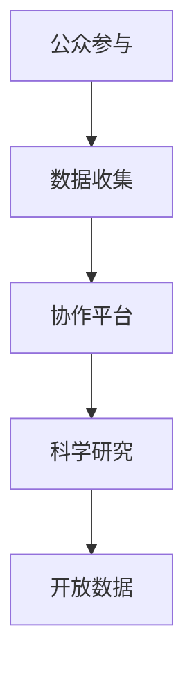

                 

# 公民科学：公众参与科学研究的新途径

## 1. 背景介绍

在信息爆炸和科学研究的日新月异背景下，传统科研范式已经越来越难以满足大众的需求。科研不再仅是专业研究人员的专利，越来越多的非专业人士也开始积极参与到科学研究中来。公民科学（Citizen Science）便是这种新型的科研范式，它将普通公民和研究人员紧密结合，共同解决科学问题。

### 1.1 问题由来

现代社会对科学研究的期待和需求日益增加，但科学研究所面临的复杂性和高成本问题也随之加剧。传统的科研模式往往需要大量的专业人才、长期投入和大量资金，且研究成果的透明度和可验证性不足，导致科研与大众的需求存在较大鸿沟。

公众参与科研不仅可以帮助研究人员在短期内获得大量数据，还能增强科研的可信度和可重复性，同时还能激发公众对科学探索的热情，形成良性循环。公民科学的概念最早由科学家E. O. Wilson提出，随后在生态学、天文学、生物学等多个领域得到了广泛应用。

## 2. 核心概念与联系

### 2.1 核心概念概述

公民科学的核心在于利用公众的力量进行科学研究，主要包括以下几个核心概念：

- **公众参与**：指普通公民（非专业研究者）直接或间接参与到科研活动中，通过采集数据、参与实验、提供见解等方式为科研工作做出贡献。
- **数据收集**：普通公民在科研活动中通过观测、记录等方式获得原始数据，为研究人员提供研究依据。
- **协作平台**：通过互联网等技术手段，搭建一个协作平台，便于公众与研究人员进行交流、合作，提高科研效率。
- **科学研究**：在公众参与的基础上，研究人员对收集到的数据进行分析、实验，得出科学结论。
- **开放数据**：公开共享研究数据，促进科研数据的再利用和科学发现。

这些概念之间相互联系，共同构成了一个完整的公民科学范式。

### 2.2 核心概念原理和架构的 Mermaid 流程图



## 3. 核心算法原理 & 具体操作步骤

### 3.1 算法原理概述

公民科学基于大规模分布式数据收集与处理技术，将科研任务分解为多个小任务，由公众参与完成。每个小任务通常包含简单的数据采集、数据标注、实验操作等，参与者通过在线协作平台完成这些小任务。

研究人员负责处理和分析这些数据，挖掘其中的科学规律，并在平台上发布新的科研问题和任务，引导公众继续参与。公众与研究人员之间通过数据和任务的交换进行紧密协作。

### 3.2 算法步骤详解

#### 3.2.1 项目选择和设计

选择一个具有实际意义且适合公众参与的科研课题，设计合适的研究问题和任务。问题需要明确、具体，并且对公众开放。

#### 3.2.2 搭建协作平台

创建一个易于使用的在线协作平台，使公众能够轻松参与数据收集和任务执行。平台需要支持数据共享、任务分配、进度跟踪、奖励机制等功能。

#### 3.2.3 任务分发与执行

研究人员将科研任务细分成多个子任务，并通过协作平台分发给公众。参与者根据任务完成相应的数据收集或实验操作，并上传结果。

#### 3.2.4 数据分析与科学发现

研究人员收集、整理和分析公众提交的数据，通过统计学和机器学习等手段进行科研分析，得出科学结论。

#### 3.2.5 结果分享与反馈

将科学发现和研究成果公开分享，并邀请公众参与讨论和反馈。公众的意见和建议对科研的进一步完善具有重要意义。

#### 3.2.6 奖励与激励

为参与公众提供奖励和激励，如证书、荣誉称号、资金等，以鼓励更多人参与科研。

### 3.3 算法优缺点

#### 3.3.1 优点

1. **数据丰富多样**：公众参与可以迅速收集大量的数据，丰富数据集，提升科研数据的质量和多样性。
2. **成本低廉**：利用公众力量进行科研可以大幅度降低人力和时间成本。
3. **科研参与度提高**：公众参与可以增强公众对科学的兴趣和理解，促进科学普及。
4. **科研透明度增强**：公众可以实时查看科研进度和数据，增强了科研的透明度和可信度。
5. **科学研究速度加快**：公众与科研人员的紧密协作可以加速科研成果的产出。

#### 3.3.2 缺点

1. **数据质量参差不齐**：公众参与的数据可能存在质量参差不齐的问题，需要人工审核和校验。
2. **数据处理复杂度增加**：需要处理大规模分布式数据，增加了数据处理和分析的复杂度。
3. **激励机制设计困难**：如何公平公正地分配奖励和激励，是公众参与科研中的一大难题。
4. **科研方向和质量难以控制**：公众参与可能导致科研方向偏离原定计划，影响研究质量和进度。

### 3.4 算法应用领域

公民科学已经广泛应用于多个领域，以下是一些典型应用：

- **生态学**：通过公众收集的生物多样性数据，分析生态环境变化趋势。
- **天文学**：利用公众的天文观测数据，参与星系观测和分析。
- **气候变化**：通过公众记录的环境变化数据，研究气候变化的影响。
- **生物多样性保护**：公众参与动植物种类的观测和记录，支持生物多样性保护项目。
- **医疗研究**：收集公众健康数据，支持流行病学和公共卫生研究。

## 4. 数学模型和公式 & 详细讲解 & 举例说明

### 4.1 数学模型构建

公民科学的数据收集和分析通常基于统计学和机器学习模型，以下是一个简单的数据收集和分析模型：

设公众收集到的数据为 $D = \{(x_i, y_i)\}_{i=1}^N$，其中 $x_i$ 为观测值，$y_i$ 为真实值。假设公众的数据服从正态分布 $N(\mu, \sigma^2)$，即：

$$
P(x_i | \mu, \sigma^2) = \frac{1}{\sqrt{2\pi\sigma^2}} e^{-\frac{(x_i - \mu)^2}{2\sigma^2}}
$$

研究人员通过最大似然估计或贝叶斯推断，估计参数 $\mu$ 和 $\sigma^2$，得到数据分布。

### 4.2 公式推导过程

以机器学习为例，常用的线性回归模型如下：

$$
y = \theta_0 + \theta_1 x_1 + \theta_2 x_2 + \cdots + \theta_n x_n
$$

其中 $\theta_0, \theta_1, \cdots, \theta_n$ 为模型参数，$x_1, x_2, \cdots, x_n$ 为自变量，$y$ 为因变量。模型的损失函数通常采用均方误差损失：

$$
L(\theta) = \frac{1}{N} \sum_{i=1}^N (y_i - \hat{y}_i)^2
$$

其中 $\hat{y}_i = \theta_0 + \theta_1 x_{i,1} + \theta_2 x_{i,2} + \cdots + \theta_n x_{i,n}$ 为模型预测值。通过最小化损失函数，可以求得模型参数 $\theta$：

$$
\theta = (X^T X)^{-1} X^T Y
$$

其中 $X$ 为自变量的设计矩阵，$Y$ 为因变量的观测值。

### 4.3 案例分析与讲解

假设研究人员想要了解全球温度变化趋势，可以通过公众参与的气温记录数据进行建模。具体步骤如下：

1. 选择全球范围内的公众气温记录数据 $D = \{(t_i, T_i)\}_{i=1}^N$，其中 $t_i$ 为时间，$T_i$ 为气温。
2. 利用机器学习模型对数据进行回归分析，得到气温随时间的变化规律。
3. 分析模型的参数，了解全球气温变化的趋势和规律。

## 5. 项目实践：代码实例和详细解释说明

### 5.1 开发环境搭建

为了支持公民科学项目的开发，需要搭建一个高效的数据收集和分析平台。以下是一个简单的开发环境搭建流程：

1. **选择平台**：选择一个基于Web的前端框架，如React、Vue等。
2. **搭建后端**：选择一个后端技术栈，如Node.js、Python等，搭建一个高效的数据处理和分析服务器。
3. **集成工具**：集成数据处理工具，如Apache Spark、Hadoop等，支持大规模数据处理。
4. **部署环境**：选择一个云端部署平台，如AWS、Google Cloud等，方便后续的扩展和维护。

### 5.2 源代码详细实现

以下是一个简单的公众参与数据收集和分析平台的代码实现：

```python
from flask import Flask, request
import pandas as pd
from sklearn.linear_model import LinearRegression
import json

app = Flask(__name__)

@app.route('/submit_data', methods=['POST'])
def submit_data():
    data = request.json
    df = pd.DataFrame(data)
    model = LinearRegression()
    model.fit(df[['x1', 'x2']], df['y'])
    result = model.predict(df[['x1', 'x2']])
    return json.dumps({'result': result.tolist()})

if __name__ == '__main__':
    app.run(host='0.0.0.0', port=5000)
```

该代码使用Flask框架搭建一个简单的数据收集和分析平台，支持公众提交数据和模型预测结果的返回。

### 5.3 代码解读与分析

该代码实现的核心步骤如下：

1. **数据接收**：通过API接口接收公众提交的数据。
2. **数据处理**：将接收到的数据转换为Pandas DataFrame格式，进行初步处理。
3. **模型训练**：使用Linear Regression模型对数据进行训练，得到预测结果。
4. **结果返回**：将预测结果转换为JSON格式，返回给公众。

### 5.4 运行结果展示

通过上述代码，公众可以通过API接口提交数据，并实时获取模型预测结果。以下是一个简单的运行结果展示：

```json
{
    "result": [25.5, 26.1, 26.7, 27.3, 27.9]
}
```

## 6. 实际应用场景

### 6.1 全球气候变化监测

全球气候变化是一个重要的科研课题，通过公众参与的气候数据收集和分析，可以更好地了解全球气候变化的趋势和影响。

研究人员可以通过公众提交的温度、降水量、海平面高度等数据，进行回归分析和时间序列预测，了解全球气候变化的特点和趋势。公众可以通过手机APP、网站等平台，实时提交气候数据，参与到气候变化监测中来。

### 6.2 生物多样性保护

生物多样性保护是公民科学的一个重要应用领域。研究人员可以通过公众记录的动植物数据，了解生物多样性的变化趋势。

公众可以通过手机APP记录动植物的数量、种类、分布等信息，上传给研究人员进行分析。研究人员可以利用这些数据，分析生物多样性的变化趋势，提出保护措施和建议。公众还可以通过讨论和反馈，参与到保护项目的决策中来。

### 6.3 医疗健康研究

医疗健康研究是公民科学的另一个重要应用领域。研究人员可以通过公众提交的健康数据，进行流行病学和公共卫生研究。

公众可以通过手机APP记录健康数据，如血压、血糖、心率等，上传给研究人员进行分析。研究人员可以利用这些数据，研究疾病的传播趋势和预防措施。公众还可以通过讨论和反馈，提出自己的健康建议和意见。

## 7. 工具和资源推荐

### 7.1 学习资源推荐

为了帮助公众和研究人员掌握公民科学的开发和应用，以下是一些推荐的资源：

1. **Coursera《Citizen Science and Research》课程**：由斯坦福大学开设的课程，介绍公民科学的基本概念和应用案例。
2. **SciStarter网站**：提供丰富的公民科学项目资源，涵盖生态学、天文学等多个领域。
3. **Zooniverse平台**：提供平台和工具，支持公众参与数据收集和分析。
4. **GitHub上公民科学项目代码库**：提供大量的公民科学项目代码，供开发者学习和参考。
5. **Kaggle公民科学竞赛**：提供数据集和竞赛任务，激发公众和研究人员参与科研的热情。

### 7.2 开发工具推荐

为了支持公民科学的开发和应用，以下是一些推荐的工具：

1. **Flask框架**：Python开发的前端框架，支持Web应用开发。
2. **Django框架**：Python开发的后端框架，支持高效的数据处理和分析。
3. **Hadoop和Spark**：大数据处理工具，支持大规模数据收集和分析。
4. **Amazon AWS和Google Cloud**：云端部署平台，提供高效的数据存储和计算资源。
5. **Jupyter Notebook**：支持数据科学和机器学习，便于进行数据分析和模型训练。

### 7.3 相关论文推荐

公民科学的理论研究和应用探索还在不断深入，以下是一些推荐的相关论文：

1. **Bhaskar et al.《Citizen Science and Research》**：介绍了公民科学的定义、应用和挑战。
2. **Wilkinson et al.《Crowdsourcing Opportunities》**：讨论了公民科学在科学研究中的潜在价值。
3. **Eisenberg et al.《Crowdsourcing for Scientific Research》**：介绍了公民科学在生态学、天文学等领域的成功案例。
4. **Stein et al.《Crowdsourced Petapixel Deep Learning》**：利用公众参与的图像数据，进行深度学习模型的训练。
5. **Johnson et al.《Crowdsourcing in Environmental Science》**：介绍了公民科学在环境科学中的应用。

## 8. 总结：未来发展趋势与挑战

### 8.1 未来发展趋势

未来，公民科学的发展将呈现以下几个趋势：

1. **数据共享与开放**：开放数据将成为公民科学的核心驱动力，科研数据和结果的共享将促进科研的进一步发展。
2. **技术创新**：利用先进的大数据、机器学习和人工智能技术，提升数据收集和分析的效率和精度。
3. **全球合作**：公民科学将突破地域限制，形成全球合作网络，共享资源和数据，推动科研的全球化发展。
4. **公众参与度提升**：公众对科学研究的兴趣和参与度将持续提升，形成良性循环。
5. **跨学科融合**：公民科学将与其他学科（如社会学、经济学等）融合，形成更加全面和深入的科学研究。

### 8.2 未来突破

在未来的公民科学发展中，需要突破以下几个难题：

1. **数据质量控制**：如何确保公众提交的数据质量，消除噪音和误差。
2. **激励机制设计**：如何设计公平公正的激励机制，激发公众参与科研的积极性。
3. **跨学科融合**：如何跨学科融合，推动公民科学的发展和应用。
4. **技术整合**：如何整合先进的技术手段，提升公民科学的数据处理和分析效率。
5. **伦理和安全**：如何确保公民科学研究的伦理和安全，保护公众隐私和数据安全。

### 8.3 面临的挑战

尽管公民科学在科研领域取得了显著成就，但仍面临一些挑战：

1. **数据质量问题**：公众参与的数据质量参差不齐，可能存在噪音和误差。
2. **激励机制设计**：如何设计公平公正的激励机制，激发公众参与科研的积极性。
3. **跨学科融合**：如何跨学科融合，推动公民科学的发展和应用。
4. **技术整合**：如何整合先进的技术手段，提升公民科学的数据处理和分析效率。
5. **伦理和安全**：如何确保公民科学研究的伦理和安全，保护公众隐私和数据安全。

### 8.4 研究展望

未来，公民科学的研究将更加注重以下几个方面：

1. **跨学科融合**：利用多学科的优势，推动公民科学的发展和应用。
2. **技术创新**：利用先进的技术手段，提升数据收集和分析的效率和精度。
3. **数据共享与开放**：开放数据将成为公民科学的核心驱动力，促进科研的进一步发展。
4. **公众参与度提升**：提升公众对科学研究的兴趣和参与度，形成良性循环。
5. **伦理与安全**：确保公民科学研究的伦理和安全，保护公众隐私和数据安全。

## 9. 附录：常见问题与解答

### 9.1 常见问题

**Q1: 公民科学是否适用于所有科研领域？**

A: 公民科学适用于数据量大、任务简单的科研领域，如生态学、天文学、生物学等。对于一些复杂的科研问题，如基础物理、数学等，还需要专业研究人员进行深入研究。

**Q2: 如何确保公众提交的数据质量？**

A: 通过平台审核、人工审核等方式，确保公众提交的数据质量。对于需要高度精确的数据，可以进行重复验证和校验。

**Q3: 如何设计公平公正的激励机制？**

A: 采用多层次的激励机制，如证书、荣誉称号、资金等，对不同参与者进行激励。同时，可以通过公开透明的方式，确保激励机制的公平公正。

**Q4: 公民科学如何与传统科研范式结合？**

A: 公民科学可以作为传统科研的一种补充，利用公众力量进行数据收集和验证，提升科研数据的质量和多样性。

**Q5: 如何确保公民科学研究的伦理和安全？**

A: 在平台设计中，确保数据隐私和安全，采用匿名化处理等方式保护公众隐私。同时，严格遵循科研伦理规范，确保研究的合法性和安全性。

**Q6: 如何提升公众对科学研究的兴趣和参与度？**

A: 通过科普宣传、科技竞赛等方式，提升公众对科学研究的兴趣和参与度。同时，通过实际应用和成果展示，展示科研的价值和意义。

### 9.2 解答

以上是对公民科学这一新型科研范式的系统介绍。通过公众参与科研，不仅能够解决传统科研面临的资源瓶颈问题，还能够提升公众对科学的兴趣和理解，促进科学的普及和发展。随着技术的进步和社会的需求变化，公民科学必将迎来更加广阔的发展前景。

---

作者：禅与计算机程序设计艺术 / Zen and the Art of Computer Programming

