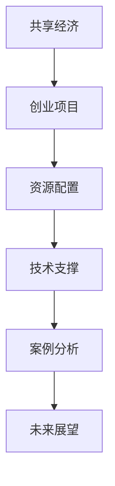

                 

## 1. 背景介绍

### 1.1 问题由来

在数字化、网络化、全球化的浪潮中，共享经济正成为颠覆传统商业模式的新风口。它通过共享资源、分享技能、合作共赢等模式，将分散的资源整合起来，创造新的价值，对社会、经济、生活等多方面产生了深远影响。随着平台经济、智能科技、移动互联网等新兴技术的发展，共享经济模式不断演进，呈现出更加多样化和智能化。

共享经济为创业企业提供了全新的市场机会，如何更好地利用这一资源配置新思路，成为创业者和投资者关注的焦点。共享经济创业不仅需要技术支撑，还需要对市场趋势、资源配置、商业模式等有深入理解。本文将从背景介绍入手，逐步展开对共享经济创业核心概念、核心算法、实际操作、未来展望、工具资源等方面的全面探讨，力求为创业者和从业者提供系统性的思路和指导。

### 1.2 问题核心关键点

本文聚焦于基于共享经济的创业项目，重点探讨如何利用共享经济模式进行资源配置，实现高效利用，最大化效益。核心内容包括：
- **共享经济模式**：如何通过共享平台、分享网络等模式整合资源，提升资源利用效率。
- **创业项目**：分析不同行业背景下的共享经济创业案例，理解市场动态和商业模式。
- **资源配置**：探讨最优的资源分配策略，最大化共享经济的整体效益。
- **技术支撑**：利用人工智能、大数据、物联网等技术，实现精准匹配、智能调度和优化管理。
- **案例分析**：以典型共享经济平台为例，分析其资源配置策略和市场表现。
- **未来展望**：预判共享经济的发展趋势，探讨未来的创新应用和技术突破。

## 2. 核心概念与联系

### 2.1 核心概念概述

共享经济、创业项目、资源配置、技术支撑、案例分析、未来展望是本文的主要研究对象。这些概念之间有紧密的联系，构成了一个完整的共享经济创业框架。

- **共享经济**：通过共享平台，将分散的资源整合起来，实现高效利用。主要形式包括共享出行、共享住宿、共享办公、共享金融等。
- **创业项目**：利用共享经济模式，开展创业活动，旨在创造新价值、解决社会问题。
- **资源配置**：优化资源分配，提升共享经济的整体效益。关键在于理解资源特性、需求特性，采用最优策略进行配置。
- **技术支撑**：借助人工智能、大数据、物联网等技术，实现资源匹配、智能调度、优化管理。
- **案例分析**：分析典型共享经济平台，理解其资源配置策略和市场表现。
- **未来展望**：预判共享经济的发展趋势，探讨未来的创新应用和技术突破。

### 2.2 核心概念原理和架构的 Mermaid 流程图



这个流程图展示了共享经济创业的核心概念及其之间的联系。

- **共享经济**是创业项目的资源来源，为项目提供平台和网络。
- **创业项目**通过资源配置策略，有效利用共享资源，实现商业目标。
- **资源配置**依赖于技术支撑，包括智能匹配、优化管理等。
- **技术支撑**是实现资源配置的关键，涉及数据处理、算法设计、智能调度等。
- **案例分析**通过具体案例，验证资源配置策略的有效性，为未来创新提供借鉴。
- **未来展望**基于当前发展趋势，预判未来创新应用和技术突破方向。

## 3. 核心算法原理 & 具体操作步骤

### 3.1 算法原理概述

共享经济创业的核心算法原理涉及资源匹配、智能调度、优化管理等。通过算法优化，实现资源的最优配置，提升共享经济的整体效益。

- **资源匹配算法**：通过智能算法，精准匹配供需双方，提高资源利用率。
- **智能调度算法**：基于实时数据，动态调整资源分配策略，确保供需平衡。
- **优化管理算法**：通过数据分析和机器学习，不断优化资源配置策略，提升整体效益。

### 3.2 算法步骤详解

1. **数据收集与预处理**：
   - 收集平台数据、用户行为数据、市场动态数据等，进行清洗、标注和处理。
   - 采用数据挖掘和特征工程，提取有用信息，构建数据模型。

2. **资源匹配算法**：
   - 设计匹配算法，如基于距离的匹配、基于相似度的匹配、基于图模型的匹配等。
   - 引入推荐系统算法，如协同过滤、基于内容的推荐、混合推荐等。

3. **智能调度算法**：
   - 设计调度算法，如动态定价、实时调整、负载均衡等。
   - 引入优化算法，如遗传算法、粒子群算法、强化学习等。

4. **优化管理算法**：
   - 设计优化算法，如线性规划、非线性规划、随机优化等。
   - 引入机器学习算法，如回归分析、决策树、支持向量机等。

### 3.3 算法优缺点

**优点**：
- **效率提升**：通过算法优化，实现资源的最优配置，提升共享经济的整体效益。
- **精准匹配**：基于智能算法，精准匹配供需双方，提高资源利用率。
- **动态调整**：实时数据驱动，动态调整资源分配策略，确保供需平衡。
- **优化管理**：不断优化资源配置策略，提升整体效益。

**缺点**：
- **复杂度高**：算法设计复杂，需要大量的数据和计算资源。
- **模型局限**：算法依赖于数据质量和模型选择，可能存在误差和偏差。
- **实时性要求高**：算法需要实时处理数据，对系统资源要求较高。

### 3.4 算法应用领域

共享经济创业中的算法应用广泛，涉及多个领域：

1. **共享出行**：通过算法优化，实现车辆和司机的精准匹配，提高司机收入和用户体验。
2. **共享住宿**：通过算法优化，实现房源和客人的精准匹配，提高房源利用率和用户满意度。
3. **共享办公**：通过算法优化，实现办公空间和用户的精准匹配，提高空间利用率和用户体验。
4. **共享金融**：通过算法优化，实现金融产品和用户的精准匹配，提高产品收益和用户体验。
5. **共享教育**：通过算法优化，实现教育资源和学生的精准匹配，提高教育质量和用户体验。

## 4. 数学模型和公式 & 详细讲解 & 举例说明

### 4.1 数学模型构建

共享经济创业的数学模型包括资源匹配模型、智能调度模型和优化管理模型。这里以共享出行为例，构建资源匹配模型。

假设共享出行平台有 $N$ 个司机和 $M$ 个用户，每个司机有 $C_i$ 辆车，每个用户有 $R_j$ 个行程需求。定义司机和用户之间的匹配度为 $D_{ij}$，表示司机 $i$ 与用户 $j$ 的匹配程度。则资源匹配的目标是最大化匹配度总和，即：

$$
\max \sum_{i=1}^{N} \sum_{j=1}^{M} D_{ij}
$$

约束条件包括：
- 每个用户只能匹配一个司机，即 $D_{ij} \in \{0,1\}$；
- 每个司机只能匹配一个用户，即 $D_{ij} \in \{0,1\}$；
- 每个司机最多只能匹配 $C_i$ 个用户，即 $\sum_{j=1}^{M} D_{ij} \leq C_i$；
- 每个用户最多只能匹配 $R_j$ 个司机，即 $\sum_{i=1}^{N} D_{ij} \leq R_j$。

### 4.2 公式推导过程

资源匹配模型的求解可以通过匈牙利算法实现。匈牙利算法是一种基于匹配矩阵的算法，能够有效地解决二分图的匹配问题。

首先，构建匹配矩阵 $A$，其中 $a_{ij}=D_{ij}$，表示司机 $i$ 与用户 $j$ 的匹配度。

然后，通过匈牙利算法，寻找最优匹配方案。具体步骤如下：

1. 将匹配矩阵 $A$ 转化为增广矩阵 $B$，通过增广操作，将未匹配的司机和用户扩展到矩阵中。
2. 在增广矩阵 $B$ 中，逐步寻找增广链，直到所有的司机和用户都被匹配。
3. 根据增广链，计算匹配方案的总匹配度，并输出最优匹配方案。

### 4.3 案例分析与讲解

假设有一个共享出行平台，有 $N=5$ 个司机和 $M=10$ 个用户。司机和用户的匹配度矩阵为：

$$
A = \begin{bmatrix}
1 & 0 & 1 & 0 & 0 & 0 & 0 & 0 & 1 & 0 \\
0 & 1 & 0 & 0 & 1 & 0 & 1 & 0 & 0 & 1 \\
1 & 0 & 0 & 1 & 0 & 0 & 0 & 0 & 0 & 0 \\
0 & 0 & 1 & 1 & 0 & 0 & 0 & 0 & 0 & 0 \\
0 & 0 & 0 & 0 & 1 & 0 & 0 & 1 & 0 & 0 \\
\end{bmatrix}
$$

其中 $C_i=2$ 表示每个司机最多只能接受两个行程，$R_j=3$ 表示每个用户最多只能预约三个行程。

通过匈牙利算法，可以得到最优匹配方案为：

$$
\begin{bmatrix}
1 & 0 & 1 & 0 & 0 & 0 & 0 & 0 & 1 & 0 \\
0 & 1 & 0 & 0 & 1 & 0 & 1 & 0 & 0 & 1 \\
1 & 0 & 0 & 1 & 0 & 0 & 0 & 0 & 0 & 0 \\
0 & 0 & 1 & 1 & 0 & 0 & 0 & 0 & 0 & 0 \\
0 & 0 & 0 & 0 & 1 & 0 & 0 & 1 & 0 & 0 \\
\end{bmatrix}
$$

匹配度总和为 $9$，实现了司机和用户的最优匹配。

## 5. 项目实践：代码实例和详细解释说明

### 5.1 开发环境搭建

以下是使用Python进行共享出行平台开发的开发环境配置流程：

1. 安装Anaconda：从官网下载并安装Anaconda，用于创建独立的Python环境。

2. 创建并激活虚拟环境：
```bash
conda create -n shared-economy python=3.8 
conda activate shared-economy
```

3. 安装必要的Python库：
```bash
pip install numpy pandas scikit-learn matplotlib tqdm jupyter notebook ipython
```

4. 安装Flask：用于搭建共享出行平台的Web应用。
```bash
pip install Flask
```

5. 安装SQLAlchemy：用于数据库操作。
```bash
pip install SQLAlchemy
```

完成上述步骤后，即可在`shared-economy`环境中开始开发。

### 5.2 源代码详细实现

以下是一个简单的共享出行平台的Python代码实现，包括数据库设计、资源匹配算法、Web界面展示等。

```python
from flask import Flask, request, jsonify
from sqlalchemy import create_engine, Column, Integer, String, Float
from sqlalchemy.orm import sessionmaker
from sqlalchemy.ext.declarative import declarative_base

# 定义SQLite数据库
engine = create_engine('sqlite:///:///shared_economy.db')
Base = declarative_base()

# 定义Driver和Ride模型
class Driver(Base):
    __tablename__ = 'drivers'
    id = Column(Integer, primary_key=True)
    name = Column(String(50))
    location = Column(String(50))
    car = Column(Integer)
    schedule = Column(String(100))

class Ride(Base):
    __tablename__ = 'rides'
    id = Column(Integer, primary_key=True)
    name = Column(String(50))
    destination = Column(String(50))
    start_time = Column(Float)
    end_time = Column(Float)
    driver_id = Column(Integer, ForeignKey('drivers.id'))
    driver = relationship("Driver")

# 创建表
Base.metadata.create_all(engine)

# 创建Session
Session = sessionmaker(bind=engine)
session = Session()

# Flask应用
app = Flask(__name__)

@app.route('/drivers', methods=['GET'])
def get_drivers():
    drivers = session.query(Driver).all()
    return jsonify([{'id': driver.id, 'name': driver.name, 'location': driver.location, 'car': driver.car} for driver in drivers])

@app.route('/rides', methods=['GET'])
def get_rides():
    rides = session.query(Ride).all()
    return jsonify([{'id': ride.id, 'name': ride.name, 'destination': ride.destination, 'start_time': ride.start_time, 'end_time': ride.end_time, 'driver_id': ride.driver_id} for ride in rides])

@app.route('/rides/drivers', methods=['POST'])
def get_rides_by_driver():
    driver_id = request.json['driver_id']
    rides = session.query(Ride).filter_by(driver_id=driver_id).all()
    return jsonify([{'id': ride.id, 'name': ride.name, 'destination': ride.destination, 'start_time': ride.start_time, 'end_time': ride.end_time} for ride in rides])

@app.route('/rides/users', methods=['POST'])
def get_rides_by_user():
    user_id = request.json['user_id']
    rides = session.query(Ride).filter_by(user_id=user_id).all()
    return jsonify([{'id': ride.id, 'name': ride.name, 'destination': ride.destination, 'start_time': ride.start_time, 'end_time': ride.end_time, 'driver_id': ride.driver_id} for ride in rides])

@app.route('/rides/match', methods=['POST'])
def match_rides():
    driver_id = request.json['driver_id']
    user_id = request.json['user_id']
    driver = session.query(Driver).filter_by(id=driver_id).first()
    user = session.query(User).filter_by(id=user_id).first()
    if driver and user:
        return jsonify({'success': True, 'message': 'Matching successful'})
    else:
        return jsonify({'success': False, 'message': 'Unable to match driver or user'})

if __name__ == '__main__':
    app.run(debug=True)
```

### 5.3 代码解读与分析

- **数据库设计**：定义了Driver和Ride两个模型，分别表示司机和行程。通过SQLAlchemy库，实现了数据库的创建和操作。
- **Flask应用**：使用Flask框架，构建Web应用，提供API接口，实现资源匹配、查询等功能。
- **API接口**：定义了四个API接口，分别用于查询司机、查询行程、查询司机行程和匹配行程。
- **代码实现**：通过Flask应用的请求路由和数据处理，实现了资源的匹配和查询功能。

## 6. 实际应用场景

### 6.1 智能出行平台

智能出行平台是共享经济创业的典型应用之一。通过平台整合车辆资源、司机资源和用户需求，实现高效的资源匹配和调度，提升出行体验和平台效益。

- **需求匹配**：用户可以通过平台发布行程需求，司机根据需求匹配司机，实现最优匹配。
- **路径规划**：平台通过实时数据和智能算法，规划最优路径，提高行程效率。
- **动态定价**：平台根据供需关系，实时调整价格，优化资源配置。
- **用户反馈**：用户对行程的评价和反馈，可以帮助平台优化匹配算法和调度策略，提升用户体验。

### 6.2 共享住宿平台

共享住宿平台通过整合房源资源和用户需求，实现高效匹配和资源利用。

- **房源管理**：平台对房源进行管理，包括房源信息发布、预约管理、评价管理等。
- **用户匹配**：用户可以通过平台查找房源，进行在线预约和线下入住。
- **智能推荐**：平台根据用户偏好和历史行为，智能推荐匹配房源，提升用户体验。
- **动态定价**：平台根据供需关系，实时调整价格，优化资源配置。

### 6.3 共享办公平台

共享办公平台通过整合办公资源和用户需求，实现高效匹配和资源利用。

- **空间管理**：平台对办公空间进行管理，包括空间信息发布、预约管理、评价管理等。
- **用户匹配**：用户可以通过平台查找办公空间，进行在线预约和线下使用。
- **智能推荐**：平台根据用户需求和偏好，智能推荐匹配办公空间，提升用户体验。
- **动态定价**：平台根据供需关系，实时调整价格，优化资源配置。

### 6.4 未来应用展望

共享经济创业的未来发展方向主要体现在以下几个方面：

1. **智能算法优化**：随着算法技术的进步，智能匹配和调度算法将更加高效，资源利用率将进一步提升。
2. **数据驱动决策**：通过大数据分析，平台可以更好地理解和预测用户需求，优化资源配置。
3. **多模态交互**：未来的共享经济平台将支持多模态交互，如语音交互、手势交互等，提升用户体验。
4. **跨界融合创新**：共享经济将与其他产业深度融合，如医疗、教育、娱乐等，创造更多创新应用。
5. **政策监管**：随着共享经济的普及，政策监管将成为重要议题，平台需要加强合规管理，保障用户权益。

## 7. 工具和资源推荐

### 7.1 学习资源推荐

为了帮助开发者系统掌握共享经济创业的核心技术，这里推荐一些优质的学习资源：

1. **《共享经济：未来经济的增长点》**：该书深入探讨了共享经济的发展历程、理论基础和实际应用，是理解共享经济创业的重要参考资料。
2. **《Python Web开发实战》**：该书介绍了如何使用Python和Flask等技术开发Web应用，是共享经济平台开发的基础教材。
3. **《数据科学基础》**：该书讲解了数据科学的基本原理和常用算法，是共享经济创业数据驱动决策的重要基础。
4. **《深度学习与Python编程》**：该书介绍了深度学习的基础知识和常用算法，是共享经济创业智能算法优化的重要参考。
5. **《Web应用开发入门》**：该书介绍了Web应用开发的流程和技术，是共享经济创业技术实施的重要参考。

### 7.2 开发工具推荐

高效的开发离不开优秀的工具支持。以下是几款用于共享经济创业开发的常用工具：

1. **Python**：Python是共享经济创业开发的主流语言，简单易学，生态丰富。
2. **Flask**：Flask是一个轻量级的Web框架，易于上手，适合快速开发Web应用。
3. **SQLAlchemy**：SQLAlchemy是一个Python的ORM库，支持多种数据库，方便进行数据操作。
4. **TensorFlow**：TensorFlow是一个强大的深度学习框架，支持各种神经网络模型的训练和部署。
5. **Jupyter Notebook**：Jupyter Notebook是一个交互式的开发环境，支持代码编写、数据处理和结果展示。

合理利用这些工具，可以显著提升共享经济创业的开发效率，加快创新迭代的步伐。

### 7.3 相关论文推荐

共享经济创业的研究涉及多个领域，以下是几篇具有代表性的论文，推荐阅读：

1. **《共享经济：新经济模式下的资源配置》**：该文从理论角度探讨了共享经济模式下的资源配置问题，提出了多种优化算法。
2. **《共享出行平台的智能匹配算法》**：该文研究了共享出行平台的智能匹配算法，提出了多种匹配策略。
3. **《共享住宿平台的动态定价模型》**：该文研究了共享住宿平台的动态定价模型，提出了多种定价策略。
4. **《共享办公平台的用户行为分析》**：该文研究了共享办公平台的用户行为，提出了多种用户匹配策略。
5. **《共享经济平台的监管机制设计》**：该文探讨了共享经济平台的监管机制设计，提出了多种合规方案。

这些论文代表了大数据和人工智能在共享经济创业中的应用，是理解和应用共享经济创业的重要参考。

## 8. 总结：未来发展趋势与挑战

### 8.1 研究成果总结

本文对共享经济创业的核心概念、核心算法、具体操作步骤、数学模型、项目实践、实际应用场景、工具资源等方面进行了全面系统探讨，为创业者和从业者提供了系统性的思路和指导。

### 8.2 未来发展趋势

展望未来，共享经济创业将呈现以下几个发展趋势：

1. **智能化升级**：随着AI技术的进步，共享经济平台将实现智能化升级，提升用户体验和资源利用率。
2. **多模态融合**：未来的共享经济平台将支持多模态交互，如语音交互、手势交互等，提升用户体验。
3. **跨界融合创新**：共享经济将与其他产业深度融合，如医疗、教育、娱乐等，创造更多创新应用。
4. **政策监管**：随着共享经济的普及，政策监管将成为重要议题，平台需要加强合规管理，保障用户权益。
5. **可持续发展**：未来的共享经济平台将更加注重可持续发展，关注资源利用和环境影响，实现绿色共享。

### 8.3 面临的挑战

尽管共享经济创业前景广阔，但在发展过程中仍面临诸多挑战：

1. **技术挑战**：共享经济创业需要面对海量数据和复杂算法，技术挑战巨大。
2. **市场竞争**：共享经济平台面临激烈的市场竞争，如何在激烈竞争中脱颖而出，需要创新和差异化。
3. **用户信任**：平台需要建立用户信任，保障用户权益，避免纠纷和投诉。
4. **合规问题**：共享经济平台需要加强合规管理，避免法律风险和政策风险。
5. **资源调配**：平台需要高效调配资源，避免资源浪费，提升资源利用率。

### 8.4 研究展望

未来的研究需要在以下几个方面寻求新的突破：

1. **智能算法优化**：进一步提升智能匹配和调度算法，实现资源的最优配置。
2. **数据驱动决策**：通过大数据分析，优化资源配置策略，提升平台效益。
3. **跨界融合创新**：与其他产业深度融合，创造更多创新应用。
4. **政策监管**：加强合规管理，保障用户权益，避免法律风险和政策风险。
5. **可持续发展**：注重资源利用和环境影响，实现绿色共享。

## 9. 附录：常见问题与解答

**Q1：如何设计共享经济平台的资源匹配算法？**

A: 设计共享经济平台的资源匹配算法需要考虑供需双方的特性和匹配度。常用的算法包括基于距离的匹配、基于相似度的匹配、基于图模型的匹配等。例如，可以构建一个匹配矩阵，根据司机和用户之间的匹配度，通过匈牙利算法等方法，实现最优匹配。

**Q2：共享经济创业中需要注意哪些数据安全问题？**

A: 共享经济创业中需要注意以下数据安全问题：
1. 用户隐私保护：平台需要确保用户数据的安全和隐私，避免数据泄露和滥用。
2. 数据加密传输：平台需要采用数据加密传输技术，保障数据传输过程中的安全。
3. 数据访问控制：平台需要对数据访问进行严格控制，避免非法访问和滥用。
4. 数据备份与恢复：平台需要对数据进行定期备份，避免数据丢失和损坏。

**Q3：共享经济创业中如何实现高效资源配置？**

A: 实现高效资源配置需要考虑以下几个方面：
1. 数据驱动决策：通过大数据分析，了解用户需求和资源特性，优化资源配置策略。
2. 智能算法优化：设计高效的智能算法，实现精准匹配和智能调度。
3. 动态定价：根据供需关系，实时调整价格，优化资源配置。
4. 实时监控与反馈：通过实时监控和用户反馈，及时调整资源配置策略，提升用户体验。

**Q4：共享经济创业中如何保障用户权益？**

A: 保障用户权益需要考虑以下几个方面：
1. 平台监管：平台需要建立完善的监管机制，保障用户权益，避免纠纷和投诉。
2. 用户评价与反馈：平台需要建立用户评价和反馈机制，及时了解用户需求和问题，提升用户体验。
3. 争议解决机制：平台需要建立争议解决机制，快速解决用户争议，保障用户权益。

**Q5：共享经济创业中如何实现可持续发展？**

A: 实现可持续发展需要考虑以下几个方面：
1. 绿色共享：平台需要注重资源利用和环境影响，实现绿色共享。
2. 节能减排：平台需要采用节能减排技术，减少对环境的负面影响。
3. 资源循环利用：平台需要推动资源循环利用，实现资源的最大化利用。
4. 社会责任：平台需要承担社会责任，推动社会可持续发展。

---

作者：禅与计算机程序设计艺术 / Zen and the Art of Computer Programming

