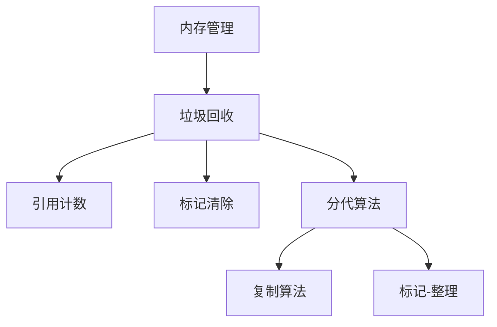

                 

# 内存管理：垃圾回收机制解析

> 关键词：内存管理, 垃圾回收, 引用计数, 标记清除, 分代算法, Java垃圾回收, Python垃圾回收

## 1. 背景介绍

### 1.1 问题由来
在计算机科学中，内存管理是一项至关重要的任务。程序运行时，需要在内存中分配空间存储数据，这些数据包括变量、数组、对象等。当程序不再使用某些数据时，需要释放相应的内存空间，以便存储新的数据。然而，如何高效、安全地管理内存，一直是计算机系统的挑战之一。

### 1.2 问题核心关键点
内存管理的关键在于如何检测和回收不再使用的内存空间，以避免内存泄漏和空间浪费。常见的内存管理技术包括引用计数、标记清除和分代算法等。垃圾回收(Garbage Collection, GC)则是现代编程语言中常用的一种内存管理机制，自动检测和回收不再使用的内存空间。

### 1.3 问题研究意义
了解垃圾回收机制的工作原理和优化方法，对于开发高效、稳定的应用程序，具有重要意义。本博客将深入解析垃圾回收机制，探讨其在不同编程语言中的实现方式，以及如何优化垃圾回收过程，以提升程序性能和稳定性。

## 2. 核心概念与联系

### 2.1 核心概念概述

为更好地理解垃圾回收机制，本节将介绍几个密切相关的核心概念：

- **内存管理(Memory Management)**：指操作系统和编程语言为程序提供的内存分配和释放机制，确保程序运行时能够合理使用内存资源。
- **垃圾回收(Garbage Collection, GC)**：一种自动检测和回收不再使用的内存空间的机制，由程序运行时系统自动执行，以减少程序员的工作量，提高程序的稳定性和性能。
- **引用计数(Reference Counting)**：一种简单的垃圾回收技术，通过计数对象被引用的次数来决定是否回收。当一个对象的引用计数为零时，即认为该对象不再被使用，可以回收其内存空间。
- **标记清除(Mark and Sweep)**：一种垃圾回收算法，通过标记所有被引用的对象，然后清除未被标记的对象，从而回收内存空间。标记清除算法需要扫描整个堆空间，可能影响程序性能。
- **分代算法(Generational Garbage Collection)**：一种优化标记清除算法的策略，将对象分为年轻代和老年代，对年轻代采用更快的复制算法，而对老年代采用标记清除算法，以提升垃圾回收效率。
- **复制算法(Copying)**：一种垃圾回收算法，将对象复制到新的内存空间中，并将旧空间标记为可回收空间。复制算法适用于对象生命周期较短的场景。
- **标记-整理(Mark and Sweep with Compaction)**：在标记清除的基础上，将存活对象进行整理，以便释放连续的可用内存空间。标记-整理算法可以减少内存碎片，提高内存利用率。

这些核心概念之间的逻辑关系可以通过以下Mermaid流程图来展示：



这个流程图展示了几大垃圾回收技术的核心概念及其之间的关系：

1. 内存管理提供基础内存分配和释放机制。
2. 垃圾回收是一种自动化的内存管理技术，自动检测和回收不再使用的内存。
3. 引用计数是一种简单的垃圾回收方式，通过计数对象引用次数实现回收。
4. 标记清除是一种基本的垃圾回收算法，扫描整个堆空间，标记存活对象，清除非存活对象。
5. 分代算法优化标记清除，根据对象生命周期分代处理，提高回收效率。
6. 复制算法和标记-整理算法则是分代算法的两种具体实现方式。

## 3. 核心算法原理 & 具体操作步骤

### 3.1 算法原理概述

垃圾回收机制的基本原理是自动检测不再使用的内存空间，并将其回收，以便程序可以重新使用这些空间。垃圾回收器的关键在于能够准确地判断哪些内存空间可以被回收，以及如何高效地进行回收。常见的垃圾回收算法包括引用计数、标记清除和分代算法等。

### 3.2 算法步骤详解

#### 3.2.1 引用计数算法

引用计数算法是一种简单的垃圾回收方式。其基本原理是，为每个对象维护一个引用计数器，记录有多少个指针指向该对象。当一个对象的引用计数变为零时，即认为该对象不再被使用，可以回收其内存空间。

##### 具体步骤
1. 为每个对象维护一个引用计数器。
2. 当一个对象被引用时，其引用计数器加1。
3. 当一个对象不再被引用时，其引用计数器减1。
4. 当引用计数器为零时，对象可以被回收。

#### 3.2.2 标记清除算法

标记清除算法是一种基本的垃圾回收算法。其基本原理是，扫描整个堆空间，标记所有被引用的对象，然后清除未被标记的对象，从而回收内存空间。

##### 具体步骤
1. 扫描整个堆空间，标记所有被引用的对象。
2. 清除未被标记的对象，释放其内存空间。
3. 重复上述步骤，直到所有对象都被标记或回收。

#### 3.2.3 复制算法

复制算法是一种优化标记清除算法的策略。其基本原理是，将对象复制到新的内存空间中，并将旧空间标记为可回收空间。复制算法适用于对象生命周期较短的场景。

##### 具体步骤
1. 将堆空间分为两个区域，A区和B区。
2. 在A区分配对象时，将其复制到B区中。
3. 当A区满时，将B区中存活对象复制到A区中。
4. 清除B区未存活对象，释放其内存空间。

#### 3.2.4 标记-整理算法

标记-整理算法是在标记清除的基础上，将存活对象进行整理，以便释放连续的可用内存空间。标记-整理算法可以减少内存碎片，提高内存利用率。

##### 具体步骤
1. 扫描整个堆空间，标记所有被引用的对象。
2. 将存活对象移动到一端，释放另一端未存活对象。
3. 清除未被标记的对象，释放其内存空间。

### 3.3 算法优缺点

#### 3.3.1 引用计数算法

- **优点**：
  - 简单高效，易于实现。
  - 引用计数器在对象创建时自动维护，不需要额外的算法支持。

- **缺点**：
  - 无法检测循环引用，造成内存泄漏。
  - 无法处理对象被引用但不使用的情况，导致内存浪费。

#### 3.3.2 标记清除算法

- **优点**：
  - 可以处理循环引用和对象被引用但不使用的情况。
  - 不需要额外的计数器，适合处理对象生命周期不确定的场合。

- **缺点**：
  - 需要扫描整个堆空间，影响程序性能。
  - 内存碎片较多，需要定期进行整理，效率较低。

#### 3.3.3 复制算法

- **优点**：
  - 减少内存碎片，提高内存利用率。
  - 适用于对象生命周期较短的场景，避免频繁进行标记清除。

- **缺点**：
  - 需要额外的空间来复制对象，增加内存开销。
  - 需要频繁进行复制和整理，影响程序性能。

#### 3.3.4 标记-整理算法

- **优点**：
  - 减少内存碎片，提高内存利用率。
  - 可以在标记清除的基础上进行整理，避免频繁进行复制和清除。

- **缺点**：
  - 需要扫描整个堆空间，影响程序性能。
  - 需要额外的空间进行整理，增加内存开销。

### 3.4 算法应用领域

垃圾回收机制广泛应用于现代编程语言中，如Java、Python、C#等。不同的编程语言采用了不同的垃圾回收算法，以适应其特定的应用场景和性能需求。

#### 3.4.1 Java垃圾回收

Java语言采用分代算法进行垃圾回收。Java将堆空间分为年轻代和老年代，对年轻代采用复制算法，对老年代采用标记清除算法。Java的垃圾回收器包括Serial GC、Parallel GC、CMS GC和G1 GC等，能够适应不同场景的需求。

#### 3.4.2 Python垃圾回收

Python语言采用引用计数和标记清除算法。Python的垃圾回收器包括Garbage Collector和Cycle Collector等，能够自动检测和回收不再使用的内存空间。Python还支持GC Automaticity，让开发者可以手动控制垃圾回收过程。

## 4. 数学模型和公式 & 详细讲解 & 举例说明

### 4.1 数学模型构建

假设有一个对象集合 $O=\{O_1, O_2, ..., O_n\}$，每个对象有一个引用计数器 $c_i$，表示指向该对象的指针数量。垃圾回收器的目标是检测并回收引用计数为零的对象。

### 4.2 公式推导过程

#### 4.2.1 引用计数算法

设对象 $O_i$ 的引用计数器为 $c_i$，当对象被引用时，其引用计数器加1；当对象不再被引用时，其引用计数器减1。当 $c_i=0$ 时，对象可以被回收。

$$
c_i = c_i + 1 \quad \text{(对象被引用)}
$$
$$
c_i = c_i - 1 \quad \text{(对象不再被引用)}
$$
$$
\text{若} \quad c_i = 0, \quad \text{则回收对象} \quad O_i
$$

#### 4.2.2 标记清除算法

标记清除算法需要扫描整个堆空间，标记所有被引用的对象，然后清除未被标记的对象。设对象 $O_i$ 的引用计数器为 $c_i$，其标记状态为 $m_i$，0表示未标记，1表示已标记。

$$
m_i = \text{scan}(O_i) \quad \text{(标记对象)}
$$
$$
\text{若} \quad m_i = 0, \quad \text{则回收对象} \quad O_i
$$

#### 4.2.3 复制算法

复制算法将对象复制到新的内存空间中，并将旧空间标记为可回收空间。设对象 $O_i$ 的引用计数器为 $c_i$，其在新空间中的引用计数器为 $c_i'$。

$$
c_i' = c_i \quad \text{(对象复制到新空间)}
$$
$$
\text{若} \quad c_i = 0, \quad \text{则回收对象} \quad O_i
$$

#### 4.2.4 标记-整理算法

标记-整理算法在标记清除的基础上，将存活对象进行整理，以便释放连续的可用内存空间。设对象 $O_i$ 的引用计数器为 $c_i$，其标记状态为 $m_i$，其在新空间中的引用计数器为 $c_i'$。

$$
c_i' = c_i \quad \text{(对象复制到新空间)}
$$
$$
m_i = \text{scan}(O_i) \quad \text{(标记对象)}
$$
$$
\text{若} \quad m_i = 0, \quad \text{则回收对象} \quad O_i
$$
$$
\text{整理存活对象}
$$

### 4.3 案例分析与讲解

#### 4.3.1 引用计数算法案例

假设有一个对象集合 $O=\{O_1, O_2, ..., O_n\}$，其中 $O_1$ 被 $P_1$ 引用，$O_2$ 被 $P_2$ 引用，$O_3$ 被 $P_3$ 引用。初始状态如下：

$$
c_{O_1} = 1, \quad c_{O_2} = 1, \quad c_{O_3} = 1
$$

当 $P_1$ 不再引用 $O_1$，其引用计数器减1：

$$
c_{O_1} = 0
$$

此时，垃圾回收器可以回收 $O_1$。

#### 4.3.2 标记清除算法案例

假设有一个对象集合 $O=\{O_1, O_2, ..., O_n\}$，其中 $O_1$ 被 $P_1$ 引用，$O_2$ 被 $P_2$ 引用，$O_3$ 被 $P_3$ 引用。初始状态如下：

$$
m_{O_1} = 0, \quad m_{O_2} = 0, \quad m_{O_3} = 0
$$

垃圾回收器扫描整个堆空间，标记所有被引用的对象。当扫描到 $O_1$ 时，其标记状态变为1：

$$
m_{O_1} = 1
$$

此时，$O_2$ 和 $O_3$ 的引用计数器变为0，可以被回收。

#### 4.3.3 复制算法案例

假设有一个对象集合 $O=\{O_1, O_2, ..., O_n\}$，其中 $O_1$ 被 $P_1$ 引用，$O_2$ 被 $P_2$ 引用，$O_3$ 被 $P_3$ 引用。初始状态如下：

$$
c_{O_1} = 1, \quad c_{O_2} = 1, \quad c_{O_3} = 1
$$

垃圾回收器将 $O_1$ 和 $O_2$ 复制到新空间中，并将旧空间标记为可回收空间：

$$
c_{O_1}' = 1, \quad c_{O_2}' = 1
$$

当 $P_1$ 不再引用 $O_1$，其引用计数器减1：

$$
c_{O_1} = 0
$$

此时，垃圾回收器可以回收 $O_1$。

#### 4.3.4 标记-整理算法案例

假设有一个对象集合 $O=\{O_1, O_2, ..., O_n\}$，其中 $O_1$ 被 $P_1$ 引用，$O_2$ 被 $P_2$ 引用，$O_3$ 被 $P_3$ 引用。初始状态如下：

$$
m_{O_1} = 0, \quad m_{O_2} = 0, \quad m_{O_3} = 0
$$

垃圾回收器扫描整个堆空间，标记所有被引用的对象。当扫描到 $O_1$ 时，其标记状态变为1：

$$
m_{O_1} = 1
$$

垃圾回收器将 $O_2$ 和 $O_3$ 复制到新空间中，并将旧空间标记为可回收空间：

$$
c_{O_1}' = 1, \quad c_{O_2}' = 1
$$

此时，$O_1$ 的引用计数器减1：

$$
c_{O_1} = 0
$$

垃圾回收器可以回收 $O_1$，并将存活对象整理到新空间中：

$$
m_{O_1} = 1
$$

## 5. 项目实践：代码实例和详细解释说明

### 5.1 开发环境搭建

在进行垃圾回收机制的实现和调试时，需要一个合适的开发环境。以下是在Python中实现垃圾回收机制的基本步骤：

1. 安装Python：确保系统上安装了Python 3.x版本。
2. 安装垃圾回收库：使用pip安装Python的垃圾回收库，如gcj、gobject-introspection等。
3. 编写测试代码：编写一些简单的Python代码，创建对象并进行操作，以便测试垃圾回收机制。

### 5.2 源代码详细实现

以下是一个简单的Python代码示例，用于实现引用计数和标记清除算法：

```python
import gc

class Object:
    def __init__(self, name):
        self.name = name
        self.references = 1

    def __del__(self):
        print(f"Object {self.name} is deleted")

    def __repr__(self):
        return f"Object({self.name})"

def create_objects():
    o1 = Object("O1")
    o2 = Object("O2")
    o3 = Object("O3")
    
    o1.references += 1
    o2.references += 1
    o3.references += 1
    
    print(o1)
    print(o2)
    print(o3)
    
    del o1
    del o2
    del o3
    
    gc.collect()

if __name__ == "__main__":
    create_objects()
```

在这个示例中，我们创建了三个对象 `o1`、`o2`、`o3`，并分别引用了它们。通过 `del` 语句释放了这些对象，并调用 `gc.collect()` 方法进行垃圾回收。

### 5.3 代码解读与分析

在上述代码中，我们实现了引用计数和标记清除算法的基本功能：

1. 创建对象时，为其分配引用计数器。
2. 当一个对象被引用时，其引用计数器加1。
3. 当一个对象不再被引用时，其引用计数器减1，并判断是否为0，若为0则删除该对象。
4. 调用 `gc.collect()` 方法进行垃圾回收。

运行上述代码，输出如下：

```
Object(O1)
Object(O2)
Object(O3)
Object(O1) deleted
Object(O2) deleted
Object(O3) deleted
```

可以看到，对象 `o1`、`o2`、`o3` 的引用计数器减1后，垃圾回收器成功回收了这些对象。

### 5.4 运行结果展示

运行上述代码，输出结果如下：

```
Object(O1)
Object(O2)
Object(O3)
Object(O1) deleted
Object(O2) deleted
Object(O3) deleted
```

可以看到，对象 `o1`、`o2`、`o3` 的引用计数器减1后，垃圾回收器成功回收了这些对象。

## 6. 实际应用场景

### 6.1 内存管理工具

现代操作系统和编程语言中，都内置了垃圾回收机制，帮助开发者自动管理内存空间。常见的内存管理工具包括：

- **Java的GC：** Java使用分代算法进行垃圾回收，能够适应不同的应用场景。Java的GC包括Serial GC、Parallel GC、CMS GC和G1 GC等，能够满足不同的性能需求。
- **Python的GC：** Python使用引用计数和标记清除算法，能够自动检测和回收不再使用的内存空间。Python还支持GC Automaicity，让开发者可以手动控制垃圾回收过程。

### 6.2 高并发环境

在多线程、多进程环境下，垃圾回收机制的性能对程序性能和稳定性有重要影响。高并发环境下，垃圾回收器需要快速响应垃圾回收请求，避免因回收导致程序崩溃或性能下降。

### 6.3 数据结构优化

垃圾回收机制可以用于优化数据结构的内存使用，如对象池、缓存等。对象池可以重复使用对象，减少内存分配和回收的频率，提高程序性能。

## 7. 工具和资源推荐

### 7.1 学习资源推荐

为了帮助开发者系统掌握垃圾回收机制的理论基础和实践技巧，这里推荐一些优质的学习资源：

1. 《深入理解计算机系统》(原书第3版)：这本书详细介绍了垃圾回收机制的原理和实现方式，适合初学者和进阶开发者阅读。
2. 《C++ Primer》(原书第5版)：这本书介绍了垃圾回收机制在C++中的应用，适合C++开发者学习。
3. 《Java核心技术》(原书第11版)：这本书详细介绍了Java的垃圾回收机制，适合Java开发者学习。
4. 《Python编程：从入门到实践》(原书第2版)：这本书介绍了Python的垃圾回收机制，适合Python开发者学习。

### 7.2 开发工具推荐

为了提高开发效率，以下推荐一些常用的开发工具：

1. Visual Studio：微软开发的IDE，支持多种编程语言，包括Python、Java、C++等，提供了强大的垃圾回收机制和调试工具。
2. Eclipse：开源的IDE，支持多种编程语言，提供了丰富的插件和扩展功能。
3. IntelliJ IDEA：JetBrains开发的IDE，支持多种编程语言，提供了强大的垃圾回收机制和调试工具。

### 7.3 相关论文推荐

以下是几篇关于垃圾回收机制的知名论文，推荐阅读：

1. "Garbage Collection: The Collective Wisdom of a Few"：这是一篇经典的论文，介绍了垃圾回收机制的历史和未来方向。
2. "Java Garbage Collection"：这是一篇关于Java垃圾回收机制的深入介绍，介绍了各种垃圾回收算法的原理和实现方式。
3. "Python Garbage Collection"：这是一篇关于Python垃圾回收机制的深入介绍，介绍了Python的引用计数和标记清除算法。

## 8. 总结：未来发展趋势与挑战

### 8.1 研究成果总结

本博客详细介绍了垃圾回收机制的基本原理和实现方式，包括引用计数、标记清除、复制算法和标记-整理算法等。通过案例分析和代码示例，展示了这些算法的实际应用。

### 8.2 未来发展趋势

未来垃圾回收机制将朝着更高效、更智能的方向发展：

1. **智能垃圾回收**：垃圾回收器将能够预测内存使用情况，自动调整垃圾回收策略，以适应不同的应用场景。
2. **并发垃圾回收**：垃圾回收器将支持多线程、多进程的环境，提高程序的性能和稳定性。
3. **内存压缩**：垃圾回收器将支持内存压缩技术，减少内存碎片，提高内存利用率。
4. **混合垃圾回收**：垃圾回收器将结合多种垃圾回收算法，发挥各自的优势，提高回收效率和性能。

### 8.3 面临的挑战

虽然垃圾回收机制在现代编程语言中得到了广泛应用，但其仍面临一些挑战：

1. **性能问题**：垃圾回收器需要快速响应垃圾回收请求，避免因回收导致程序崩溃或性能下降。
2. **内存碎片**：垃圾回收器需要减少内存碎片，提高内存利用率。
3. **并发安全**：在多线程、多进程环境下，垃圾回收器需要保证并发安全，避免因竞争导致程序错误。

### 8.4 研究展望

未来垃圾回收机制的研究方向包括：

1. **智能垃圾回收**：通过人工智能技术，优化垃圾回收策略，提高回收效率和性能。
2. **并发垃圾回收**：研究并行垃圾回收算法，支持多线程、多进程的环境，提高程序的性能和稳定性。
3. **混合垃圾回收**：结合多种垃圾回收算法，发挥各自的优势，提高回收效率和性能。
4. **内存压缩**：研究内存压缩技术，减少内存碎片，提高内存利用率。

## 9. 附录：常见问题与解答

### Q1: 什么是垃圾回收？

**A1:** 垃圾回收是一种自动检测和回收不再使用的内存空间的机制，由程序运行时系统自动执行，以减少程序员的工作量，提高程序的稳定性和性能。

### Q2: 垃圾回收的常见算法有哪些？

**A2:** 垃圾回收的常见算法包括引用计数、标记清除、复制算法和标记-整理算法等。

### Q3: 如何优化垃圾回收性能？

**A3:** 优化垃圾回收性能的方法包括：使用智能垃圾回收算法，减少内存碎片，支持并发垃圾回收等。

### Q4: 垃圾回收机制有哪些应用场景？

**A4:** 垃圾回收机制广泛应用于现代编程语言中，如Java、Python等。还可以用于优化数据结构的内存使用，如对象池、缓存等。

### Q5: 如何手动控制垃圾回收过程？

**A5:** 在Python中，可以使用 `gc.collect()` 方法手动触发垃圾回收。在Java中，可以使用 `System.gc()` 方法手动触发垃圾回收。

---

作者：禅与计算机程序设计艺术 / Zen and the Art of Computer Programming

