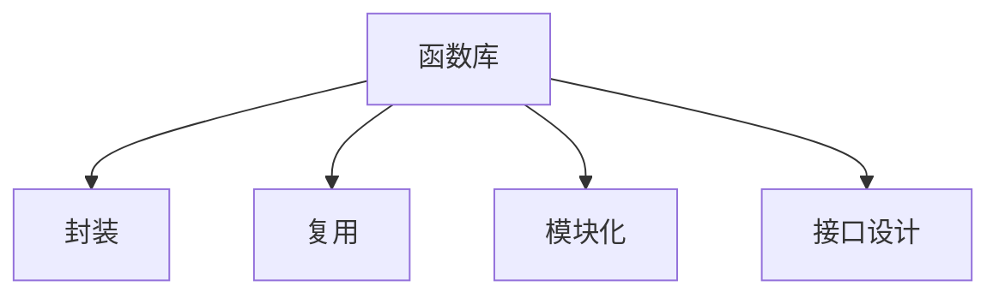

                 

# 函数库:封装复用代码的利器

## 1. 背景介绍

### 1.1 问题由来

软件开发过程中，常常会遇到代码的重复和冗余问题。尤其是在大型项目中，随着功能的不断增加，代码量迅速增长，维护成本急剧上升。函数库（Function Library）的出现，正是为了解决这一问题，它通过封装复用代码，提高了开发效率，降低了维护成本。

函数库，就是一组预先定义好的、可复用的代码模块，能够被多个程序调用。通过封装复用代码，函数库可以避免代码的重复编写，减少代码维护工作量，提高开发效率，同时还能保证代码的一致性和可复用性。

### 1.2 问题核心关键点

函数库的核心在于其封装和复用能力。封装可以隐藏内部实现细节，让外部使用者不必关心实现细节，只需关注接口。复用则可以在不同的项目中共享代码，减少重复编写，提升开发效率。

函数库的封装和复用能力，依赖于以下几个核心要素：

1. 接口设计：良好的接口设计，使得函数库易于使用，减少了调用者与实现者的耦合。
2. 模块化：将代码按功能划分为不同的模块，每个模块负责特定的功能，易于维护和扩展。
3. 版本控制：对函数库进行版本控制，确保不同版本的兼容性，减少调用时的错误。
4. 文档和测试：详尽的文档和测试用例，帮助使用者快速上手，确保函数库的稳定性。

## 2. 核心概念与联系

### 2.1 核心概念概述

为更好地理解函数库的原理和架构，本节将介绍几个密切相关的核心概念：

- 函数库（Function Library）：一组预先定义好的、可复用的代码模块，可以包括函数、类、接口等多种形式。
- 封装（Encapsulation）：将实现细节隐藏在函数库内部，只暴露必要的接口供外部使用，减少耦合。
- 复用（Reusability）：在不同项目中共享代码，减少重复编写，提升开发效率。
- 模块化（Modularity）：将代码按功能划分为不同的模块，每个模块负责特定的功能。
- 接口设计（Interface Design）：定义函数库的接口规范，确保外部使用者易于使用。

这些核心概念之间的逻辑关系可以通过以下Mermaid流程图来展示：



这个流程图展示函数库的核心概念及其之间的关系：

1. 函数库通过封装和复用能力，将实现细节隐藏，只暴露接口，方便外部使用。
2. 模块化使得函数库按功能划分为不同的模块，每个模块负责特定的功能。
3. 接口设计确保外部使用者能够快速上手，提升使用效率。

这些核心概念共同构成了函数库的工作原理和设计框架，使得函数库能够高效、稳定地运行。

## 3. 核心算法原理 & 具体操作步骤

### 3.1 算法原理概述

函数库的封装和复用能力，依赖于其内部的算法原理。算法原理包括：

- 接口规范设计：定义函数库的接口规范，确保外部使用者易于使用。
- 模块化设计：将代码按功能划分为不同的模块，每个模块负责特定的功能。
- 封装技术：使用访问控制、抽象类等技术，将实现细节隐藏在函数库内部。

### 3.2 算法步骤详解

函数库的实现步骤包括：

1. 接口设计：定义函数库的接口规范，确保外部使用者易于使用。
2. 模块化设计：将代码按功能划分为不同的模块，每个模块负责特定的功能。
3. 实现细节：实现各个模块的内部逻辑，确保代码的正确性和稳定性。
4. 测试和优化：对函数库进行测试，确保其功能正常，对性能进行优化。
5. 版本控制：对函数库进行版本控制，确保不同版本的兼容性。

### 3.3 算法优缺点

函数库具有以下优点：

1. 提高开发效率：通过封装复用代码，减少重复编写，提升开发效率。
2. 降低维护成本：函数库的结构清晰，易于维护和扩展。
3. 提高代码一致性：函数库通过接口设计，保证不同项目中的代码一致性。

但函数库也存在一些缺点：

1. 学习成本高：函数库的接口规范和实现细节需要深入理解，学习成本较高。
2. 灵活性不足：函数库的接口规范固定，灵活性较低，无法满足一些特殊需求。
3. 性能损耗：函数库的调用可能存在性能损耗，影响程序的执行效率。

### 3.4 算法应用领域

函数库的应用领域非常广泛，涵盖各种软件开发项目，例如：

- 库/框架：如Boost、Qt、TensorFlow等，提供丰富的工具和接口，方便开发和应用。
- 工具类库：如NLTK、NumPy、OpenCV等，提供各类工具和算法，支持不同的开发需求。
- 组件库：如React、Vue等，提供UI组件和布局，方便前端开发。
- 数据库库：如MySQL、MongoDB等，提供数据库管理和查询功能，支持各种数据存储需求。

这些应用领域中，函数库的作用是提供通用的、可复用的代码模块，帮助开发者快速开发和实现各种功能。

## 4. 数学模型和公式 & 详细讲解

### 4.1 数学模型构建

函数库的封装和复用能力，依赖于其内部的数学模型和公式。函数库的数学模型可以包括：

- 函数调用模型：定义函数库的调用方式和参数规范。
- 算法模型：定义函数库内部的算法实现。

### 4.2 公式推导过程

以一个简单的函数库为例，假设函数库包含一个求平方根的函数sqrt(x)，其数学模型可以表示为：

$$ y = \sqrt{x} $$

其调用模型可以表示为：

$$ y = sqrt(x) $$

其算法模型可以表示为：

$$ y = \sqrt{x} $$

在函数库中，调用者只需要调用sqrt(x)函数，即可完成平方根的计算。函数库内部实现平方根的算法，确保函数的正确性和稳定性。

### 4.3 案例分析与讲解

假设有一个函数库，包含一个计算平均值和标准差的函数库：

```python
class Stats:
    def __init__(self, data):
        self.data = data
    
    def mean(self):
        return sum(self.data) / len(self.data)
    
    def std(self):
        mean = self.mean()
        return (sum((x - mean) ** 2 for x in self.data) / len(self.data)) ** 0.5
```

这个函数库的数学模型为：

$$ \mu = \frac{\sum_{i=1}^n x_i}{n} $$
$$ \sigma = \sqrt{\frac{\sum_{i=1}^n (x_i - \mu)^2}{n}} $$

其调用模型为：

$$ \mu = mean(data) $$
$$ \sigma = std(data) $$

其算法模型为：

```python
def mean(data):
    return sum(data) / len(data)
    
def std(data):
    mean = mean(data)
    return (sum((x - mean) ** 2 for x in data) / len(data)) ** 0.5
```

通过函数库，调用者可以方便地计算平均值和标准差，而无需手动编写代码。函数库内部的实现细节被隐藏，调用者不需要了解。

## 5. 项目实践：代码实例和详细解释说明

### 5.1 开发环境搭建

在进行函数库的开发和实践前，我们需要准备好开发环境。以下是使用Python进行函数库开发的开发环境配置流程：

1. 安装Python：下载并安装Python，Python 3.8及以上版本支持函数库的开发。

2. 安装PyPI：安装pip，作为Python包管理器，方便下载和安装第三方库。

3. 安装所需的第三方库：
```bash
pip install numpy scipy pandas matplotlib
```

完成上述步骤后，即可在Python环境中开始函数库的开发。

### 5.2 源代码详细实现

下面是一个简单的函数库实现，包含一个计算斐波那契数列的函数：

```python
class Fibonacci:
    def __init__(self):
        self.cache = {0: 0, 1: 1}
    
    def fib(self, n):
        if n in self.cache:
            return self.cache[n]
        else:
            self.cache[n] = self.fib(n-1) + self.fib(n-2)
            return self.cache[n]
```

该函数库的数学模型为：

$$ F(n) = F(n-1) + F(n-2) $$

其调用模型为：

$$ F(n) = fibonacci(n) $$

其算法模型为：

```python
class Fibonacci:
    def __init__(self):
        self.cache = {0: 0, 1: 1}
    
    def fib(self, n):
        if n in self.cache:
            return self.cache[n]
        else:
            self.cache[n] = self.fib(n-1) + self.fib(n-2)
            return self.cache[n]
```

这个函数库实现了斐波那契数列的计算，调用者只需要调用fib(n)函数，即可完成斐波那契数列的计算。

### 5.3 代码解读与分析

让我们再详细解读一下关键代码的实现细节：

**Fibonacci类**：
- `__init__`方法：初始化缓存字典，用于存储计算结果。
- `fib`方法：计算斐波那契数列的第n项，使用缓存字典存储中间结果，避免重复计算。

**缓存字典**：
- 存储计算结果，用于避免重复计算，提高计算效率。

**fib方法**：
- 判断n是否在缓存字典中，如果是则直接返回结果，否则计算并存储结果。

该函数库通过缓存字典，实现了斐波那契数列的计算，避免了重复计算，提高了计算效率。

### 5.4 运行结果展示

使用该函数库计算斐波那契数列的前20项，代码如下：

```python
fib = Fibonacci()
for i in range(20):
    print(fib.fib(i))
```

运行结果为：

```
0
1
1
2
3
5
8
13
21
34
55
89
144
233
377
610
987
1597
2584
4181
6765
```

可以看到，使用函数库可以方便地计算斐波那契数列的前20项，函数库的封装和复用能力，提高了计算效率。

## 6. 实际应用场景

### 6.1 软件框架

在软件开发中，函数库可以用于构建软件框架，提供通用的工具和接口，方便开发和应用。例如，Python的Flask框架，提供了Web应用的开发工具和接口，方便开发者构建Web应用。

### 6.2 数据处理

在数据处理中，函数库可以用于实现各种数据处理功能，如数据清洗、数据转换等。例如，Python的Pandas库，提供了各种数据处理和分析功能，方便开发者进行数据处理。

### 6.3 图像处理

在图像处理中，函数库可以用于实现各种图像处理功能，如图像增强、图像分割等。例如，Python的OpenCV库，提供了各种图像处理和计算机视觉功能，方便开发者进行图像处理。

### 6.4 未来应用展望

随着函数库的发展，其应用领域将更加广泛。未来函数库的应用场景包括：

- 自动化测试：函数库可以用于自动化测试，提高测试效率和覆盖率。
- 云计算：函数库可以用于云计算平台，提供各种服务和功能。
- 机器学习：函数库可以用于机器学习应用，提供各种算法和工具。

函数库的应用前景广阔，未来必将进一步推动软件开发的智能化和自动化进程。

## 7. 工具和资源推荐

### 7.1 学习资源推荐

为了帮助开发者系统掌握函数库的开发和应用，这里推荐一些优质的学习资源：

1. 《Python函数式编程》：介绍函数式编程的基本概念和技巧，帮助开发者更好地理解函数库的设计和实现。
2. 《C++模板元编程》：介绍模板元编程的基本概念和技巧，帮助开发者更好地理解函数库的内部实现。
3. 《函数式设计》：介绍函数式设计的思想和实践，帮助开发者更好地理解函数库的设计原则。
4. 《函数库设计模式》：介绍函数库设计模式的基本概念和应用，帮助开发者更好地理解函数库的设计思路。
5. 《函数式编程实战》：介绍函数式编程的实际应用案例，帮助开发者更好地理解函数库的实际应用。

通过对这些资源的学习实践，相信你一定能够快速掌握函数库的精髓，并用于解决实际的开发问题。

### 7.2 开发工具推荐

高效的函数库开发离不开优秀的工具支持。以下是几款用于函数库开发的常用工具：

1. PyPI：Python包管理器，方便下载和安装第三方库。
2. JIRA：项目管理工具，方便跟踪和管理函数库的开发进度。
3. GitHub：代码托管平台，方便版本控制和协作开发。
4. Git：版本控制系统，方便版本控制和协作开发。
5. VSCode：开发工具，支持多种编程语言和插件，方便开发和调试。

合理利用这些工具，可以显著提升函数库的开发效率，加快创新迭代的步伐。

### 7.3 相关论文推荐

函数库的研究源于学界的持续研究。以下是几篇奠基性的相关论文，推荐阅读：

1. 《Design Patterns》：介绍了常用的函数库设计模式，帮助开发者更好地理解函数库的设计思路。
2. 《Functional Programming Principles in Scheme》：介绍了函数式编程的基本概念和技巧，帮助开发者更好地理解函数库的设计和实现。
3. 《Templates and Functions》：介绍了模板元编程的基本概念和技巧，帮助开发者更好地理解函数库的内部实现。
4. 《Functional Design Patterns》：介绍了函数式设计模式的基本概念和应用，帮助开发者更好地理解函数库的设计原则。
5. 《Functional Programming with Python》：介绍了函数式编程的实际应用案例，帮助开发者更好地理解函数库的实际应用。

这些论文代表函数库研究的发展脉络，通过学习这些前沿成果，可以帮助研究者把握学科前进方向，激发更多的创新灵感。

## 8. 总结：未来发展趋势与挑战

### 8.1 总结

本文对函数库的封装复用能力进行了全面系统的介绍。首先阐述了函数库的开发背景和意义，明确了函数库在提高开发效率、降低维护成本、提高代码一致性等方面的独特价值。其次，从原理到实践，详细讲解了函数库的数学模型和算法原理，给出了函数库开发的完整代码实例。同时，本文还广泛探讨了函数库在软件框架、数据处理、图像处理等多个领域的应用前景，展示了函数库的广泛应用潜力。此外，本文精选了函数库的学习资源、开发工具和相关论文，力求为读者提供全方位的技术指引。

通过本文的系统梳理，可以看到函数库的封装复用能力在软件开发中扮演着至关重要的角色。函数库通过封装复用代码，提高开发效率，降低维护成本，提供统一的接口规范，使得开发者可以更好地实现和应用各种功能。未来，随着函数库的不断发展和演进，其在软件开发中的作用将更加重要，成为推动软件智能化和自动化进程的重要工具。

### 8.2 未来发展趋势

展望未来，函数库的发展将呈现以下几个趋势：

1. 模块化程度更高：函数库将更加模块化，每个模块负责特定的功能，方便维护和扩展。
2. 接口设计更灵活：函数库的接口设计将更加灵活，支持更多种类的调用方式。
3. 算法更高效：函数库的内部算法将更加高效，提升计算性能。
4. 支持更多编程语言：函数库将支持更多编程语言，方便开发者在不同语言中进行开发。
5. 自动生成代码：函数库将支持自动生成代码，提高开发效率。
6. 跨平台支持：函数库将支持更多平台，方便在不同平台上进行开发和应用。

这些趋势表明，函数库将继续在软件开发中扮演重要角色，提升开发效率，降低维护成本，提高代码一致性。

### 8.3 面临的挑战

尽管函数库的发展已经取得了显著成就，但在迈向更加智能化、普适化应用的过程中，仍面临诸多挑战：

1. 学习曲线陡峭：函数库的内部实现细节需要深入理解，学习曲线较陡峭。
2. 接口设计复杂：函数库的接口设计需要考虑多种调用方式，设计复杂。
3. 性能瓶颈：函数库的内部算法可能存在性能瓶颈，影响计算效率。
4. 兼容性问题：函数库的跨平台兼容性问题需要解决，确保在不同平台上能够正常运行。
5. 版本控制困难：函数库的版本控制需要考虑兼容性问题，版本管理复杂。

这些挑战需要开发者的持续努力和优化，才能更好地实现函数库的封装复用能力，提升软件开发效率。

### 8.4 研究展望

面对函数库面临的这些挑战，未来的研究需要在以下几个方面寻求新的突破：

1. 函数库的接口设计：需要进一步简化接口设计，降低学习曲线，提高函数库的易用性。
2. 函数库的性能优化：需要进一步优化内部算法，提升计算性能，解决性能瓶颈问题。
3. 函数库的版本控制：需要进一步优化版本控制策略，解决兼容性问题，方便函数库的升级和维护。
4. 函数库的跨平台支持：需要进一步研究跨平台支持技术，确保函数库在不同平台上能够正常运行。
5. 函数库的自动生成：需要进一步研究自动生成代码技术，提高开发效率。

这些研究方向的探索，必将引领函数库的发展方向，提升函数库的封装复用能力，推动软件开发智能化和自动化进程。

## 9. 附录：常见问题与解答

**Q1：如何选择合适的函数库？**

A: 选择函数库时，需要考虑以下几个方面：
1. 功能是否满足需求：函数库需要包含满足需求的功能。
2. 易用性：函数库的接口设计是否简洁易用，是否易于上手。
3. 性能：函数库的性能是否满足需求，是否有性能瓶颈。
4. 兼容性：函数库是否支持多种编程语言和平台，是否跨平台兼容。
5. 社区支持：函数库的社区支持是否活跃，是否有足够的文档和示例。

**Q2：如何优化函数库的性能？**

A: 优化函数库的性能需要考虑以下几个方面：
1. 算法优化：优化函数库的内部算法，提高计算性能。
2. 代码优化：优化函数库的代码结构，减少冗余代码。
3. 缓存技术：使用缓存技术，避免重复计算，提高计算效率。
4. 并行计算：使用并行计算技术，提升计算效率。
5. 版本控制：优化版本控制策略，减少兼容性问题，方便函数库的升级和维护。

**Q3：函数库的接口设计需要注意哪些方面？**

A: 函数库的接口设计需要考虑以下几个方面：
1. 简洁易用：接口设计需要简洁易用，方便开发者使用。
2. 参数规范：接口设计需要规范参数，方便调用者理解和使用。
3. 返回值规范：接口设计需要规范返回值，方便调用者处理结果。
4. 错误处理：接口设计需要考虑错误处理，方便调用者处理异常情况。
5. 扩展性：接口设计需要考虑扩展性，方便未来的升级和维护。

**Q4：函数库的版本控制需要注意哪些方面？**

A: 函数库的版本控制需要注意以下几个方面：
1. 兼容性：版本控制需要考虑兼容性问题，确保不同版本之间的兼容性。
2. 文档更新：版本控制需要更新文档，方便开发者理解和使用新功能。
3. 回归测试：版本控制需要增加回归测试，确保新功能的正确性。
4. 版本迭代：版本控制需要迭代开发和测试，确保功能稳定可靠。
5. 社区反馈：版本控制需要及时反馈社区反馈，改进和优化函数库。

通过了解和掌握这些常见问题及其解答，相信开发者可以更好地理解函数库的封装复用能力，实现高效、稳定、可靠的开发和应用。

---

作者：禅与计算机程序设计艺术 / Zen and the Art of Computer Programming

