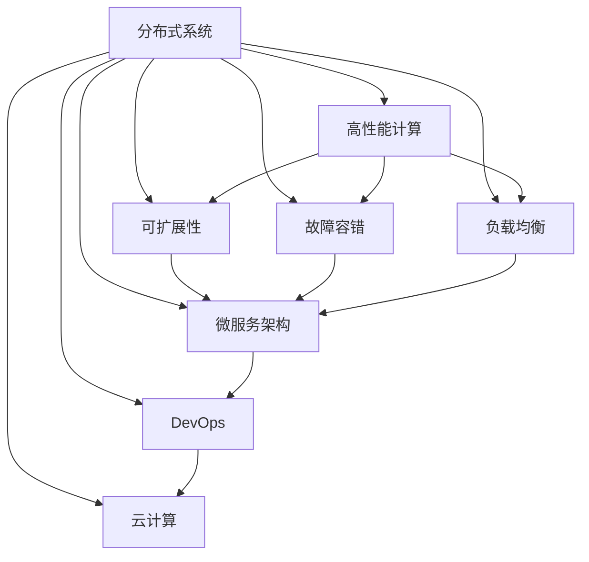

                 

# 分布式系统设计：原理与实践

> 关键词：分布式系统,原理与实践,系统架构,高性能计算,可扩展性,故障容错,负载均衡,微服务,DevOps,云计算

## 1. 背景介绍

### 1.1 问题由来
随着互联网的蓬勃发展，各类型网络应用的规模和复杂度不断扩大，单一的单机系统已经难以满足不断增长的用户需求。分布式系统作为一种能够实现高可用性、高扩展性的解决方案，被广泛应用于各类互联网应用，如搜索引擎、电商平台、社交网络等。

然而，分布式系统设计复杂、调试困难，其故障、性能瓶颈等问题也成为众多企业技术架构发展的瓶颈。近年来，分布式系统设计不断迎来新的理念和挑战，如服务网格(Servicemesh)、微服务架构(Microservice Architecture)、事件驱动架构(Event-Driven Architecture)等，使分布式系统设计更为灵活，但同时也对开发者提出了更高的要求。

### 1.2 问题核心关键点
本文聚焦于分布式系统设计中的核心问题，从原理到实践，从单个模块到全局架构，将深入解析分布式系统的关键组成模块和设计原则，以期为读者提供全面的分布式系统设计思路和技术指导。

### 1.3 问题研究意义
研究分布式系统设计对提升系统可靠性、扩展性和性能具有重要意义：

1. 提高系统可用性。分布式系统通过冗余设计、数据分片等方式，大幅降低单点故障风险，提升系统持续服务能力。
2. 促进系统扩展。分布式系统可以按需扩展服务实例，支持动态负载均衡，实现线性扩展。
3. 优化系统性能。通过合理的设计和调度，分布式系统可以充分利用硬件资源，显著提升系统吞吐量和响应速度。
4. 增强系统韧性。分布式系统具有自动故障恢复机制，能够快速识别并消除故障，保障系统服务持续稳定。
5. 降低系统开发成本。分布式系统通过模块化和组件化设计，使得系统开发和维护更加高效。

## 2. 核心概念与联系

### 2.1 核心概念概述

为更好地理解分布式系统设计，本节将介绍几个关键概念：

- 分布式系统(Distributed System)：由分布在不同地理位置的多个计算节点组成，通过网络通信实现协同工作，解决单机系统无法处理的计算、存储等问题的系统。
- 高性能计算(High Performance Computing, HPC)：通过高效的数据并行处理和多核计算，实现大批量数据的高效计算，提升系统性能。
- 可扩展性(Scalability)：系统能够通过增加资源或节点，支持持续增长的用户需求和数据处理量。
- 故障容错(Fault Tolerance)：系统设计中包含冗余、数据备份、自动恢复等机制，在节点故障或网络中断时能够自动恢复服务，保证系统的高可用性。
- 负载均衡(Load Balancing)：将用户请求或任务平均分配到多个计算节点上，提升系统吞吐量和响应速度。
- 微服务架构(Microservice Architecture)：将大型应用拆分成多个小型、自治的服务，每个服务负责独立的功能模块，实现系统的高可扩展性和灵活性。
- DevOps：将开发、测试、运维等环节紧密结合，提升软件开发和系统运维的效率和质量。
- 云计算(Cloud Computing)：基于互联网的计算和存储服务，通过弹性计算和按需支付的模式，提升资源利用率和服务灵活性。

这些概念之间的逻辑关系可以通过以下Mermaid流程图来展示：



这个流程图展示了一个分布式系统的关键组成部分和它们之间的关系：

1. 分布式系统作为核心，通过高性能计算、可扩展性、故障容错、负载均衡等关键技术，实现对大批量数据的高效处理和存储。
2. 微服务架构作为分布式系统的一种实现方式，通过模块化设计和自动化部署，进一步提升系统灵活性和可维护性。
3. DevOps、云计算等现代技术，为分布式系统的开发、部署和运维提供了有力支持，进一步推动了分布式系统设计的演进。

## 3. 核心算法原理 & 具体操作步骤
### 3.1 算法原理概述

分布式系统设计的主要目标是实现高可用性、高扩展性和高性能，其中核心的算法原理包括：

- 冗余设计：通过数据冗余和节点备份，保障系统在节点故障时仍能继续服务。
- 数据分片：将大数据集分成多个片段，分布式存储在多个节点上，提升读取效率。
- 负载均衡：将请求或任务均衡分配到多个计算节点上，提升系统吞吐量和响应速度。
- 数据一致性：通过分布式事务和同步技术，确保系统各节点的数据一致性。
- 自动化运维：通过DevOps工具和自动化脚本，实现系统的快速部署、故障恢复和性能优化。

分布式系统设计需要考虑这些核心算法原理，通过合理的系统架构和机制，保障系统的可靠性和性能。

### 3.2 算法步骤详解

分布式系统设计通常包括以下关键步骤：

**Step 1: 系统需求分析**
- 明确系统的业务需求和目标，包括系统的容量、性能指标、用户量等。
- 识别系统可能面临的挑战，如高并发、数据量大、可靠性要求高等。

**Step 2: 系统架构设计**
- 选择合适的分布式架构，如主从架构、对等架构、微服务架构等。
- 设计系统组件和模块，包括数据存储、任务处理、消息通信等。
- 确定组件之间的通信协议和数据格式。

**Step 3: 系统实现与部署**
- 根据设计方案，编写分布式系统的代码实现。
- 选择合适的编程语言和技术栈，如Java、Scala、Hadoop、Spark等。
- 设计系统的部署方案，包括资源规划、网络配置、监控部署等。

**Step 4: 系统测试与优化**
- 设计系统测试方案，包括功能测试、性能测试、压力测试等。
- 在测试中发现和解决性能瓶颈、故障问题等。
- 根据测试结果，优化系统架构和实现细节。

**Step 5: 系统运维与监控**
- 设计系统的运维方案，包括日志记录、错误报告、系统恢复等。
- 设计系统的监控方案，包括性能指标监控、故障报警、异常处理等。
- 定期评估系统性能和稳定性，进行持续优化。

以上步骤中，系统需求分析和系统架构设计是最为关键的一环，直接决定了系统的实现和性能。

### 3.3 算法优缺点

分布式系统设计具有以下优点：
1. 高可用性：通过冗余设计，系统能够在节点故障时仍能提供服务。
2. 高扩展性：通过数据分片和负载均衡，系统可以按需扩展。
3. 高性能：通过分布式计算和多核计算，系统可以高效处理大数据集。
4. 自动化运维：通过DevOps工具和自动化脚本，系统运维更加高效可靠。

同时，分布式系统设计也存在以下缺点：
1. 系统复杂性高：设计、实现和维护分布式系统都需要较高的技术水平和经验。
2. 调试困难：系统故障难以定位，需要较强的故障排查能力。
3. 一致性问题：系统节点间数据一致性难以完全保证，需要仔细设计同步机制。
4. 开发成本高：系统设计需要大量人力和技术投入，前期开发成本较高。

尽管存在这些缺点，但分布式系统设计仍是大规模系统的重要选择，且随着技术的发展，这些缺点正在逐步得到解决。

### 3.4 算法应用领域

分布式系统设计在许多领域中得到了广泛应用，如：

- 互联网应用：如社交网络、电商平台、搜索引擎等。
- 金融系统：如银行交易系统、证券交易系统等。
- 企业应用：如ERP、CRM、HR等。
- 科研计算：如气象预测、基因分析等。
- 政府服务：如电子政务、公安系统等。

除了这些常见领域，分布式系统设计还在医疗、教育、交通等领域不断扩展，未来前景广阔。

## 4. 数学模型和公式 & 详细讲解  
### 4.1 数学模型构建

为更好地理解分布式系统设计的算法原理，本节将使用数学语言对关键算法进行详细刻画。

- 冗余设计：
  - 定义节点数为 $n$，每个节点存储数据的份数为 $k$，则系统数据的总份数为 $n \times k$。
  - 若一个节点故障，剩余节点仍能通过冗余数据恢复该节点存储的数据。
  
  - 冗余度：$R = \frac{k}{n}$，表示每个节点存储的数据占总数据的份数。

- 数据分片：
  - 定义数据集大小为 $D$，分片数为 $m$，每个节点的存储容量为 $S$。
  - 将数据集分片后，每个节点的存储容量为 $\frac{D}{m}$。
  - 数据读取：一个数据片的读操作需要 $\frac{D}{S}$ 时间，分片读操作总时间为 $\frac{D}{S} \times m$。

  - 数据写操作：将数据分片后，每个节点的写操作需要 $\frac{D}{S}$ 时间，总时间为 $\frac{D}{S} \times m$。

  - 数据一致性：定义分布式系统的同步机制为 $T$，数据同步的时间为 $T \times m$。
  
  - 系统总处理时间为 $T \times m + \frac{D}{S} \times m$。

### 4.2 公式推导过程

以下我们以数据分片为例，推导数据读取和写操作的时间复杂度。

假设系统有 $n$ 个节点，每个节点存储数据的份数为 $k$，数据集大小为 $D$，数据读取和写操作需要 $\frac{D}{S}$ 时间，系统同步时间为 $T$，则读取和写操作的总时间 $T_{read}$ 和 $T_{write}$ 分别为：

$$
T_{read} = T \times m + \frac{D}{S} \times m
$$

$$
T_{write} = T \times m + \frac{D}{S} \times m
$$

通过上述公式，可以清晰地看到数据分片对系统读、写操作的影响。

### 4.3 案例分析与讲解

假设系统有 $n=4$ 个节点，每个节点存储数据的份数为 $k=3$，数据集大小为 $D=100GB$，数据读取和写操作需要 $\frac{D}{S}=5s$ 时间，系统同步时间为 $T=0.5s$，则读取和写操作的总时间分别为：

$$
T_{read} = 0.5 \times 4 + 5 \times 4 = 24s
$$

$$
T_{write} = 0.5 \times 4 + 5 \times 4 = 24s
$$

由此可见，数据分片对系统读、写操作效率的提升作用显著。

## 5. 项目实践：代码实例和详细解释说明
### 5.1 开发环境搭建

在进行分布式系统设计实践前，我们需要准备好开发环境。以下是使用Java进行Hadoop分布式计算的环境配置流程：

1. 安装Java：确保JDK 1.8及以上版本安装，并设置JAVA_HOME环境变量。

2. 安装Hadoop：从官网下载安装包，解压后修改配置文件，启动Hadoop集群。

3. 安装Hive：从官网下载安装包，解压后修改配置文件，启动Hive服务。

4. 安装Spark：从官网下载安装包，解压后修改配置文件，启动Spark服务。

5. 安装Eclipse IDE：作为开发和调试环境，安装Eclipse IDE，并下载需要的Java库和依赖。

完成上述步骤后，即可在Eclipse环境中开始分布式计算实践。

### 5.2 源代码详细实现

这里我们以Hadoop MapReduce框架为例，给出分布式计算的Java代码实现。

```java
import java.io.IOException;
import org.apache.hadoop.conf.Configuration;
import org.apache.hadoop.fs.Path;
import org.apache.hadoop.io.IntWritable;
import org.apache.hadoop.io.Text;
import org.apache.hadoop.mapreduce.Job;
import org.apache.hadoop.mapreduce.Mapper;
import org.apache.hadoop.mapreduce.Reducer;
import org.apache.hadoop.mapreduce.lib.input.FileInputFormat;
import org.apache.hadoop.mapreduce.lib.output.FileOutputFormat;

public class WordCount {
    public static class TokenizerMapper extends Mapper<LongWritable, Text, Text, IntWritable> {
        private final static IntWritable one = new IntWritable(1);
        private Text word = new Text();

        public void map(LongWritable key, Text value, Context context) throws IOException, InterruptedException {
            StringTokenizer itr = new StringTokenizer(value.toString());
            while (itr.hasMoreTokens()) {
                word.set(itr.nextToken());
                context.write(word, one);
            }
        }
    }

    public static class IntSumReducer extends Reducer<Text, IntWritable, Text, IntWritable> {
        private IntWritable result = new IntWritable();

        public void reduce(Text key, Iterable<IntWritable> values, Context context) throws IOException, InterruptedException {
            int sum = 0;
            for (IntWritable val : values) {
                sum += val.get();
            }
            result.set(sum);
            context.write(key, result);
        }
    }

    public static void main(String[] args) throws Exception {
        Configuration conf = new Configuration();
        Job job = Job.getInstance(conf, "word count");
        job.setJarByClass(WordCount.class);
        job.setMapperClass(TokenizerMapper.class);
        job.setCombinerClass(IntSumReducer.class);
        job.setReducerClass(IntSumReducer.class);
        job.setOutputKeyClass(Text.class);
        job.setOutputValueClass(IntWritable.class);
        FileInputFormat.addInputPath(job, new Path(args[0]));
        FileOutputFormat.setOutputPath(job, new Path(args[1]));
        System.exit(job.waitForCompletion(true) ? 0 : 1);
    }
}
```

以上代码实现了基于MapReduce的单词计数功能，主要包括：

- Mapper类：将输入的文本文件分词，统计每个单词出现的次数。
- Reducer类：将相同单词的出现次数相加，输出最终结果。
- main方法：配置分布式计算环境和任务参数，启动MapReduce作业。

### 5.3 代码解读与分析

以下是关键代码的解读和分析：

**Mapper类**：
- 实现Map函数，将输入的文本数据进行分词，统计单词出现次数。
- 使用`StringTokenizer`进行分词，将单词输出到`context`中。

**Reducer类**：
- 实现Reduce函数，将相同单词的出现次数相加，输出最终结果。
- 通过迭代器读取`context`中的值，将其累加到`sum`变量中，最后输出到`context`中。

**main方法**：
- 配置Hadoop计算环境，设置任务名称、类名、输入输出路径等。
- 设置Mapper和Reducer的类名，确保作业按照预期方式执行。
- 调用`waitForCompletion`方法，等待作业执行结果。

可以看到，MapReduce框架使得分布式计算的实现变得简单高效。

## 6. 实际应用场景
### 6.1 大数据处理

大数据处理是分布式系统设计最重要的应用场景之一。无论是传统行业的数据分析、金融系统的交易处理、社交网络的实时分析，还是物联网设备的实时数据采集，都依赖分布式系统来实现高效的计算和存储。

### 6.2 云计算平台

云计算平台如AWS、阿里云、腾讯云等，基于分布式系统架构，提供了弹性的计算和存储资源。通过DevOps工具和自动化部署，用户可以快速搭建应用环境，实现高性能计算和高可用性。

### 6.3 互联网应用

互联网应用如社交网络、电商平台、搜索引擎等，通过分布式系统设计，实现了对海量用户数据的处理和存储。通过微服务架构、服务网格等技术，提升了系统的扩展性和弹性。

### 6.4 未来应用展望

随着分布式系统设计理念的不断演进，未来将有更多新兴应用场景被引入。

- 边缘计算：将计算任务分配到网络边缘的计算节点上，缩短数据传输时间，提升响应速度。
- 量子计算：利用量子计算机的高效并行计算能力，提升大规模数据处理和优化问题求解效率。
- 区块链：通过分布式账本和共识机制，实现安全可靠的数据存储和交换。

未来分布式系统设计将更加灵活、高效，结合新兴技术，推动计算和存储能力的不断提升。

## 7. 工具和资源推荐
### 7.1 学习资源推荐

为了帮助开发者系统掌握分布式系统设计的原理和实践，这里推荐一些优质的学习资源：

1. 《分布式系统原理与实现》书籍：深入浅出地介绍了分布式系统设计的各个方面，包括分布式存储、分布式计算、故障容错等。
2. 《Java分布式计算实战》书籍：通过实际案例，介绍了Hadoop、Spark等分布式计算框架的使用，适合Java开发者学习。
3. Coursera《Distributed Systems》课程：斯坦福大学开设的分布式系统经典课程，涵盖分布式系统的核心概念和设计原则。
4. Udacity《Advanced Distributed Systems》课程：深度讲解了分布式系统的高级设计和实现技巧，适合有一定基础的技术人员学习。
5. Linux命令实战手册：系统学习了Linux命令和工具的使用，为分布式系统部署和运维提供了有力支持。

通过对这些资源的学习实践，相信你一定能够系统掌握分布式系统设计的核心原理和实现技巧，在实际项目中游刃有余。

### 7.2 开发工具推荐

高效的开发离不开优秀的工具支持。以下是几款用于分布式系统开发的常用工具：

1. Hadoop：Apache基金会开发的大数据计算框架，支持分布式文件系统和MapReduce计算模型。
2. Spark：Apache基金会开发的分布式计算引擎，支持批处理、流处理等多种计算模式。
3. Kafka：Apache基金会开发的分布式消息队列，支持高吞吐量、高可靠性的数据传输。
4. Docker：开源的容器化平台，支持分布式应用的快速部署和运维。
5. Kubernetes：开源的容器编排系统，支持大规模分布式应用的自动化部署和管理。

合理利用这些工具，可以显著提升分布式系统设计的开发效率，加快创新迭代的步伐。

### 7.3 相关论文推荐

分布式系统设计的研究源于学界的持续研究。以下是几篇奠基性的相关论文，推荐阅读：

1. Google File System：介绍Google分布式文件系统GFS的设计和实现，奠定了现代分布式文件系统的基础。
2. MapReduce: Simplified Data Processing on Large Clusters：介绍Google分布式计算框架MapReduce的设计和实现，开创了大规模数据处理的先河。
3. Paxos Made Simple：介绍Paxos协议的简单实现，广泛应用于分布式系统的共识算法设计。
4. RAFT Consensus Algorithm：介绍分布式一致性协议RAFT的实现，提供了高可用性分布式系统的设计参考。
5. Fast Forward: Towards a Truly High-Performance Distributed System：介绍Future系统的高性能设计，展示了未来分布式系统的发展方向。

这些论文代表了大规模分布式系统设计的研究脉络。通过学习这些前沿成果，可以帮助研究者把握学科前进方向，激发更多的创新灵感。

## 8. 总结：未来发展趋势与挑战
### 8.1 总结

本文对分布式系统设计进行了全面系统的介绍。首先阐述了分布式系统设计的背景和意义，明确了系统设计的基本目标和核心概念。其次，从原理到实践，详细讲解了分布式系统的关键组件和设计原则，给出了分布式计算的Java代码实现。同时，本文还广泛探讨了分布式系统在实际应用中的场景，展示了其广阔的应用前景。

通过本文的系统梳理，可以看到，分布式系统设计在提高系统可靠性、扩展性和性能方面具有重要价值，是大规模系统设计的重要选择。未来，伴随分布式系统设计理念和技术的不断演进，系统设计的灵活性和可扩展性将不断提升，为各类应用场景提供更强大的技术支持。

### 8.2 未来发展趋势

展望未来，分布式系统设计将呈现以下几个发展趋势：

1. 云计算的广泛应用。云计算平台将更加成熟，提供弹性资源、自动运维、安全保障等功能，进一步降低分布式系统设计的门槛。
2. DevOps的深入实践。DevOps工具和自动化流程的普及，将提升分布式系统的开发效率和运维质量。
3. 微服务架构的广泛应用。微服务架构将推动系统解耦、模块化设计，提升系统的灵活性和可维护性。
4. 边缘计算的普及。边缘计算将实现在网络边缘的高性能计算，提升数据处理效率和响应速度。
5. 自动化运维的普及。自动化运维工具和脚本将大幅提升系统运维效率，减少人为错误。
6. 量子计算的应用。量子计算将提升分布式系统的高性能计算能力，推动计算能力的极限突破。

以上趋势凸显了分布式系统设计的广阔前景。这些方向的探索发展，必将进一步提升系统的可靠性和性能，为应用场景提供更强大的技术支持。

### 8.3 面临的挑战

尽管分布式系统设计取得了不少成就，但在迈向更加智能化、普适化应用的过程中，它仍面临着诸多挑战：

1. 系统复杂性高：分布式系统设计需要综合考虑多个组件和模块，系统复杂性高，调试困难。
2. 故障排查难：分布式系统中的故障难以定位，需要较强的故障排查能力。
3. 数据一致性问题：分布式系统中的数据一致性难以完全保证，需要仔细设计同步机制。
4. 资源利用率低：分布式系统中的资源利用率往往较低，难以最大化硬件资源。
5. 安全性问题：分布式系统中的数据安全和隐私保护问题需要引起重视。

尽管存在这些挑战，但随着技术的发展和研究者的不断努力，这些问题正在逐步得到解决。

### 8.4 研究展望

面对分布式系统设计所面临的挑战，未来的研究需要在以下几个方面寻求新的突破：

1. 自动化设计和运维：通过自动化工具和算法，提升分布式系统的设计和运维效率。
2. 分布式算法研究：研究更加高效、可靠的分布式算法，提升系统的计算和存储能力。
3. 数据一致性优化：设计更高效的数据同步和一致性算法，保障分布式系统的高可用性。
4. 系统安全性设计：设计安全的分布式系统架构和协议，保障数据安全和隐私保护。
5. 跨学科融合：结合计算机科学、数学、物理学等多学科知识，推动分布式系统设计的突破性进展。

这些研究方向将引领分布式系统设计迈向更高的台阶，为应用场景提供更强大的技术支持。

## 9. 附录：常见问题与解答

**Q1: 分布式系统设计需要哪些核心技术？**

A: 分布式系统设计需要掌握的核心技术包括：

1. 高性能计算：通过多核计算和数据并行，提升系统性能。
2. 可扩展性：通过数据分片和负载均衡，支持系统的扩展。
3. 故障容错：通过冗余设计和自动恢复机制，保障系统的可用性。
4. 数据一致性：通过分布式事务和同步机制，保障数据一致性。
5. 自动化运维：通过DevOps工具和自动化脚本，提升系统运维效率。

这些技术是分布式系统设计的基础，必须全面掌握才能设计出高效、可靠的系统。

**Q2: 分布式系统设计中常见的问题有哪些？**

A: 分布式系统设计中常见的问题包括：

1. 高延迟问题：由于数据传输和处理的开销，系统延迟较高。
2. 数据一致性问题：分布式系统中数据一致性难以保证，需要仔细设计同步机制。
3. 资源利用率低：分布式系统中的资源利用率往往较低，难以最大化硬件资源。
4. 安全性问题：分布式系统中的数据安全和隐私保护问题需要引起重视。
5. 故障排查难：分布式系统中的故障难以定位，需要较强的故障排查能力。

这些问题需要系统地解决，才能设计出高效的分布式系统。

**Q3: 如何提升分布式系统的性能？**

A: 提升分布式系统性能的常见方法包括：

1. 数据分片：将大数据集分成多个片段，分布式存储在多个节点上，提升读取效率。
2. 负载均衡：将请求或任务均衡分配到多个计算节点上，提升系统吞吐量和响应速度。
3. 数据压缩：采用数据压缩技术，减少数据传输的开销，提升系统性能。
4. 多核计算：通过多核计算，提升系统的并行处理能力。
5. 缓存优化：采用缓存技术，减少数据库的读取次数，提升系统性能。

这些方法可以显著提升分布式系统的性能。

**Q4: 分布式系统设计和单体系统设计有什么区别？**

A: 分布式系统设计和单体系统设计的主要区别包括：

1. 架构不同：分布式系统由多个节点组成，通过网络通信实现协同工作，而单体系统由单一的计算节点组成。
2. 扩展性不同：分布式系统可以按需扩展服务实例，支持动态负载均衡，而单体系统扩展性较差。
3. 故障容忍不同：分布式系统设计包含冗余、数据备份等机制，具有较强的故障容忍能力，而单体系统单点故障风险较大。
4. 可维护性不同：分布式系统设计模块化和组件化，便于开发和维护，而单体系统复杂性高，维护难度大。
5. 性能不同：分布式系统设计通过并行计算和多核计算，提升系统性能，而单体系统性能有限。

这些区别使得分布式系统设计适用于大规模、高并发、高扩展性的应用场景。

**Q5: 分布式系统设计中如何保证数据一致性？**

A: 分布式系统中的数据一致性通常通过以下方法保证：

1. 分布式事务：通过分布式事务，保证系统各节点的数据一致性。
2. 同步机制：通过同步机制，确保系统各节点数据一致。
3. 版本控制：通过版本控制，保证数据的一致性。
4. 数据缓存：通过数据缓存，减少数据库的读写次数，提升系统性能。
5. 数据校验：通过数据校验，确保数据的完整性和一致性。

这些方法可以保证分布式系统中的数据一致性。

通过本文的系统梳理，可以看到，分布式系统设计在提高系统可靠性、扩展性和性能方面具有重要价值，是大规模系统设计的重要选择。未来，伴随分布式系统设计理念和技术的不断演进，系统设计的灵活性和可扩展性将不断提升，为各类应用场景提供更强大的技术支持。相信随着技术的发展和研究者的不断努力，这些挑战终将一一被克服，分布式系统设计必将在构建人机协同的智能时代中扮演越来越重要的角色。

