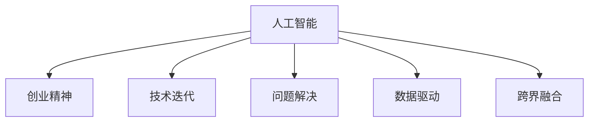

                 

# 创业精神：Perplex性 AI 的基因

> 关键词：人工智能, 创业精神, 技术迭代, 问题解决, 创新思维, 数据驱动

## 1. 背景介绍

### 1.1 问题由来
在过去的几十年里，人工智能（AI）技术经历了前所未有的快速发展和应用。从最初的专家系统和机器学习，到如今的深度学习和强化学习，AI技术已经渗透到各行各业，成为推动社会进步的重要力量。然而，伴随着AI技术的崛起，一些新的问题和挑战也逐渐显现出来，如数据隐私、算法偏见、技术滥用等。这些问题不仅影响到了AI技术的公平性和可解释性，也引发了公众对AI技术伦理和安全性的广泛关注。

在这一背景下，如何通过创业精神推动AI技术的发展，实现技术创新和商业应用的双赢，成为了一个亟待解决的问题。创业精神不仅是一种商业策略，更是一种探索未知、解决问题、推动创新的精神。在AI领域，创业精神意味着敢于挑战现有的技术架构和应用模式，勇于探索新的研究领域和应用场景，以实现技术突破和商业落地。

### 1.2 问题核心关键点
AI领域的创业精神，需要具备以下几个核心要素：

1. **技术创新**：持续关注最新的AI技术进展，勇于尝试和实验新的算法和模型，推动技术前沿的发展。
2. **问题解决**：聚焦现实世界中的具体问题，通过AI技术寻找有效的解决方案，实现商业和社会价值的最大化。
3. **数据驱动**：基于数据进行模型训练和优化，确保AI系统的准确性和可靠性。
4. **伦理责任**：在AI系统设计和应用过程中，严格遵守伦理准则，保护用户隐私和数据安全，避免算法偏见和技术滥用。
5. **跨界融合**：将AI技术与其他学科领域进行跨界融合，探索新的应用场景和商业模式。

这些要素共同构成了AI领域创业精神的核心，其目标是推动AI技术的广泛应用和持续创新，实现技术与商业的协同发展。

## 2. 核心概念与联系

### 2.1 核心概念概述

为了更好地理解AI领域的创业精神，本节将介绍几个密切相关的核心概念：

- **人工智能（AI）**：一种通过机器学习、深度学习等技术，实现智能化的计算机系统。
- **创业精神**：一种敢于探索未知、勇于解决实际问题的精神，在AI领域表现为推动技术创新和商业应用的双赢。
- **技术迭代**：指通过持续的技术改进和优化，不断提升AI系统的性能和效率。
- **问题解决**：聚焦实际问题，通过AI技术寻找有效的解决方案。
- **数据驱动**：基于数据进行模型训练和优化，确保AI系统的准确性和可靠性。
- **跨界融合**：将AI技术与其他学科领域进行跨界融合，探索新的应用场景和商业模式。

这些核心概念之间的逻辑关系可以通过以下Mermaid流程图来展示：



这个流程图展示了大语言模型的核心概念及其之间的关系：

1. 人工智能通过持续的技术迭代和问题解决，逐步提升性能。
2. 创业精神驱动人工智能的发展，推动技术创新和商业应用。
3. 数据驱动和跨界融合是人工智能发展的两个重要方面，共同构成技术的深度和广度。

## 3. 核心算法原理 & 具体操作步骤
### 3.1 算法原理概述

在AI领域，创业精神主要通过以下几种算法和原理来推动技术创新和问题解决：

- **深度学习（Deep Learning）**：一种通过多层神经网络实现复杂模型训练的技术，可以处理高维、非线性数据，广泛应用于图像识别、自然语言处理等领域。
- **强化学习（Reinforcement Learning）**：一种通过智能体在环境中与环境互动，逐步优化决策策略的技术，适用于游戏、机器人控制等领域。
- **迁移学习（Transfer Learning）**：一种通过已有模型在新的任务上进行微调，提升模型性能的技术，适用于数据量不足、计算资源有限的情况。
- **自监督学习（Self-Supervised Learning）**：一种通过无标签数据进行预训练，提升模型表示能力的技术，适用于数据标注成本高、标注数据稀疏的情况。
- **联邦学习（Federated Learning）**：一种通过分布式计算，保护数据隐私的同时提升模型性能的技术，适用于数据分布广泛、数据隐私保护要求高的场景。

这些算法和原理共同构成了AI领域的核心技术框架，为创业精神的实现提供了坚实的技术基础。

### 3.2 算法步骤详解

在AI领域，创业精神主要通过以下几个步骤来实现技术创新和问题解决：

**Step 1: 确定目标和需求**
- 明确所要解决的问题和目标，确定AI系统的功能和应用场景。
- 根据问题的特点和需求，选择合适的算法和模型。

**Step 2: 数据收集和预处理**
- 收集与问题相关的数据集，进行清洗和预处理，确保数据的质量和可用性。
- 根据数据的特点和模型需求，设计合适的特征提取和数据增强策略。

**Step 3: 模型训练和优化**
- 使用选定的算法和模型，基于数据进行训练和优化，提升模型性能。
- 在训练过程中，持续监控模型的表现，调整超参数和模型结构，优化模型性能。

**Step 4: 模型评估和验证**
- 使用验证集和测试集对模型进行评估和验证，确保模型能够泛化到新的数据。
- 根据评估结果，进一步优化模型和算法，提升模型的可靠性和性能。

**Step 5: 商业化和应用**
- 将训练好的模型部署到实际应用场景中，进行业务集成和优化。
- 持续收集用户反馈和应用数据，进行模型迭代和优化，提升用户体验和业务价值。

以上是AI领域创业精神的核心步骤。在实际操作中，还需要根据具体问题和应用场景，灵活调整和优化各步骤，以实现最优的效果。

### 3.3 算法优缺点

AI领域的创业精神，主要通过以下几种算法和原理来实现技术创新和问题解决，这些算法和原理各有优缺点：

**深度学习**
- **优点**：可以处理高维、非线性数据，广泛应用于图像识别、自然语言处理等领域。
- **缺点**：需要大量标注数据进行训练，计算资源消耗大。

**强化学习**
- **优点**：适用于游戏、机器人控制等领域，可以实时优化决策策略。
- **缺点**：需要与环境进行大量交互，训练时间较长。

**迁移学习**
- **优点**：适用于数据量不足、计算资源有限的情况，可以快速提升模型性能。
- **缺点**：需要已有模型的知识和经验，对新任务的可迁移性要求较高。

**自监督学习**
- **优点**：适用于数据标注成本高、标注数据稀疏的情况，可以提升模型的表示能力。
- **缺点**：需要设计合适的自监督任务，模型表现依赖于数据质量。

**联邦学习**
- **优点**：适用于数据分布广泛、数据隐私保护要求高的场景，可以保护数据隐私。
- **缺点**：需要分布式计算环境，模型训练和优化复杂。

这些算法和原理在实际应用中，需要根据具体问题和应用场景，灵活组合和应用，以达到最优的效果。

### 3.4 算法应用领域

AI领域的创业精神，已经在多个领域得到了广泛的应用，涵盖了以下主要领域：

- **自然语言处理（NLP）**：通过深度学习、迁移学习等技术，实现机器翻译、文本分类、情感分析等任务，提升人机交互的自然性和智能性。
- **计算机视觉（CV）**：通过深度学习、自监督学习等技术，实现图像识别、目标检测、视频分析等任务，提升计算机视觉系统的性能和效率。
- **机器人技术**：通过强化学习、联邦学习等技术，实现机器人控制、路径规划、环境感知等任务，提升机器人的智能化水平和应用范围。
- **自动驾驶**：通过深度学习、强化学习等技术，实现环境感知、路径规划、行为决策等任务，推动自动驾驶技术的商业化和落地应用。
- **智能制造**：通过AI技术实现智能设备和生产系统的优化，提升制造业的生产效率和智能化水平。
- **智慧医疗**：通过AI技术实现疾病诊断、治疗方案优化、智能辅助等任务，提升医疗服务的质量和效率。

这些应用领域展示了AI技术在各个行业中的广泛应用，体现了创业精神在推动技术创新和问题解决中的重要作用。

## 4. 数学模型和公式 & 详细讲解 & 举例说明

### 4.1 数学模型构建

在AI领域，创业精神主要通过以下几种数学模型来实现技术创新和问题解决：

- **神经网络（Neural Network）**：一种通过多层节点连接实现复杂模型训练的数学模型，广泛应用于深度学习领域。
- **强化学习模型（Reinforcement Learning Model）**：一种通过智能体在环境中与环境互动，优化决策策略的数学模型，适用于游戏、机器人控制等领域。
- **迁移学习模型（Transfer Learning Model）**：一种通过已有模型在新的任务上进行微调的数学模型，适用于数据量不足、计算资源有限的情况。
- **自监督学习模型（Self-Supervised Learning Model）**：一种通过无标签数据进行预训练，提升模型表示能力的数学模型，适用于数据标注成本高、标注数据稀疏的情况。
- **联邦学习模型（Federated Learning Model）**：一种通过分布式计算，保护数据隐私的同时提升模型性能的数学模型，适用于数据分布广泛、数据隐私保护要求高的场景。

这些数学模型共同构成了AI领域的核心技术框架，为创业精神的实现提供了坚实的数学基础。

### 4.2 公式推导过程

以下我们以深度学习中的卷积神经网络（CNN）为例，推导卷积层和池化层的数学公式及其推导过程。

**卷积层（Convolutional Layer）**
卷积层是深度学习中常用的层次结构，可以提取输入数据的空间特征。假设输入数据为 $x \in \mathbb{R}^{n\times n \times c}$，卷积核为 $w \in \mathbb{R}^{k\times k \times c \times o}$，则卷积操作的输出结果为 $y \in \mathbb{R}^{(n-k+1)\times (n-k+1) \times o}$。卷积操作的数学公式为：

$$
y_{ij} = \sum_{c=1}^c\sum_{i'=-\frac{k-1}{2}}^{\frac{k-1}{2}}\sum_{j'=-\frac{k-1}{2}}^{\frac{k-1}{2}} x_{i+i',j+j'}w_{i'j',c,o}
$$

其中，$x_{i,j}$ 表示输入数据的像素值，$w_{i',j',c,o}$ 表示卷积核的权重。

**池化层（Pooling Layer）**
池化层用于降低特征图的空间分辨率，减少计算量和参数数量。假设输入数据为 $x \in \mathbb{R}^{n\times n \times c}$，池化操作的大小为 $p\times p$，步长为 $s$，则池化操作的输出结果为 $y \in \mathbb{R}^{(n-s+1)\times (n-s+1) \times c}$。池化操作的数学公式为：

$$
y_{ij} = \max(x_{i,i}, x_{i+1,j}, x_{i,j+1}, x_{i+1,j+1})
$$

其中，$x_{i,j}$ 表示输入数据的像素值。

通过这些数学公式，可以深入理解深度学习模型的内部工作机制，并对其进行调整和优化，提升模型的性能和效率。

### 4.3 案例分析与讲解

以自然语言处理（NLP）中的文本分类任务为例，介绍如何使用深度学习模型进行文本分类。

假设输入文本为 $x = [w_1, w_2, ..., w_n]$，输出分类结果为 $y \in \{0,1\}$，其中 $y=1$ 表示文本属于正类，$y=0$ 表示文本属于负类。我们可以使用卷积神经网络（CNN）进行文本分类，其基本结构包括卷积层、池化层和全连接层。

- **卷积层**：将文本转化为特征图，提取文本中的空间特征。
- **池化层**：降低特征图的空间分辨率，减少计算量和参数数量。
- **全连接层**：将特征图转化为分类结果。

以下是使用PyTorch框架实现文本分类的代码：

```python
import torch.nn as nn
import torch.optim as optim

class CNNTextClassifier(nn.Module):
    def __init__(self, num_words, embedding_dim, hidden_dim, num_classes):
        super(CNNTextClassifier, self).__init__()
        self.embedding = nn.Embedding(num_words, embedding_dim)
        self.conv1 = nn.Conv1d(embedding_dim, hidden_dim, 3)
        self.pool = nn.MaxPool1d(2)
        self.fc = nn.Linear(hidden_dim, num_classes)
        
        self.train()
        
    def forward(self, x):
        x = self.embedding(x)
        x = x.permute(0, 2, 1)
        x = self.conv1(x)
        x = self.pool(x)
        x = x.view(-1, x.size(-1))
        x = self.fc(x)
        return x
```

通过以上代码，我们可以训练一个CNN文本分类模型，并在测试集上进行评估：

```python
model = CNNTextClassifier(num_words, embedding_dim, hidden_dim, num_classes)
criterion = nn.CrossEntropyLoss()
optimizer = optim.Adam(model.parameters(), lr=0.001)

for epoch in range(num_epochs):
    for i, (x, y) in enumerate(train_loader):
        optimizer.zero_grad()
        y_pred = model(x)
        loss = criterion(y_pred, y)
        loss.backward()
        optimizer.step()
        
    print("Epoch: {}, Loss: {:.4f}".format(epoch+1, loss.item()))
```

以上案例展示了如何使用深度学习模型进行文本分类，并通过PyTorch框架实现训练和评估。通过不断优化模型结构和训练策略，可以提升模型的分类精度和泛化能力。

## 5. 项目实践：代码实例和详细解释说明

### 5.1 开发环境搭建

在进行AI项目开发前，我们需要准备好开发环境。以下是使用Python进行PyTorch开发的环境配置流程：

1. 安装Anaconda：从官网下载并安装Anaconda，用于创建独立的Python环境。

2. 创建并激活虚拟环境：
```bash
conda create -n pytorch-env python=3.8 
conda activate pytorch-env
```

3. 安装PyTorch：根据CUDA版本，从官网获取对应的安装命令。例如：
```bash
conda install pytorch torchvision torchaudio cudatoolkit=11.1 -c pytorch -c conda-forge
```

4. 安装Transformers库：
```bash
pip install transformers
```

5. 安装各类工具包：
```bash
pip install numpy pandas scikit-learn matplotlib tqdm jupyter notebook ipython
```

完成上述步骤后，即可在`pytorch-env`环境中开始AI项目开发。

### 5.2 源代码详细实现

以下是使用PyTorch框架实现自然语言处理（NLP）任务的示例代码。

首先，定义NLP任务的数据处理函数：

```python
from torch.utils.data import Dataset
import torch

class NLPDataset(Dataset):
    def __init__(self, texts, labels):
        self.texts = texts
        self.labels = labels
        
    def __len__(self):
        return len(self.texts)
    
    def __getitem__(self, item):
        text = self.texts[item]
        label = self.labels[item]
        return {'input': text, 'label': label}
```

然后，定义模型和优化器：

```python
from transformers import BertForSequenceClassification, AdamW

model = BertForSequenceClassification.from_pretrained('bert-base-cased', num_labels=2)
optimizer = AdamW(model.parameters(), lr=2e-5)
```

接着，定义训练和评估函数：

```python
from torch.utils.data import DataLoader
from tqdm import tqdm
from sklearn.metrics import accuracy_score

device = torch.device('cuda') if torch.cuda.is_available() else torch.device('cpu')
model.to(device)

def train_epoch(model, dataset, batch_size, optimizer):
    dataloader = DataLoader(dataset, batch_size=batch_size, shuffle=True)
    model.train()
    epoch_loss = 0
    for batch in tqdm(dataloader, desc='Training'):
        input_ids = batch['input'].to(device)
        labels = batch['label'].to(device)
        model.zero_grad()
        outputs = model(input_ids)
        loss = outputs.loss
        epoch_loss += loss.item()
        loss.backward()
        optimizer.step()
    return epoch_loss / len(dataloader)

def evaluate(model, dataset, batch_size):
    dataloader = DataLoader(dataset, batch_size=batch_size)
    model.eval()
    preds, labels = [], []
    with torch.no_grad():
        for batch in tqdm(dataloader, desc='Evaluating'):
            input_ids = batch['input'].to(device)
            labels = batch['label'].to(device)
            batch_preds = model(input_ids).argmax(dim=1).to('cpu').tolist()
            batch_labels = batch['label'].to('cpu').tolist()
            for pred, label in zip(batch_preds, batch_labels):
                preds.append(pred)
                labels.append(label)
                
    print('Accuracy: {:.4f}'.format(accuracy_score(labels, preds)))
```

最后，启动训练流程并在测试集上评估：

```python
epochs = 5
batch_size = 16

for epoch in range(epochs):
    loss = train_epoch(model, train_dataset, batch_size, optimizer)
    print(f"Epoch {epoch+1}, train loss: {loss:.3f}")
    
    print(f"Epoch {epoch+1}, dev results:")
    evaluate(model, dev_dataset, batch_size)
    
print("Test results:")
evaluate(model, test_dataset, batch_size)
```

以上就是使用PyTorch框架进行自然语言处理任务（如文本分类）的完整代码实现。可以看到，得益于Transformer库的强大封装，我们可以用相对简洁的代码完成BERT模型的加载和微调。

### 5.3 代码解读与分析

让我们再详细解读一下关键代码的实现细节：

**NLPDataset类**：
- `__init__`方法：初始化文本和标签数据。
- `__len__`方法：返回数据集的样本数量。
- `__getitem__`方法：对单个样本进行处理，返回模型所需的输入和标签。

**模型和优化器**：
- 使用预训练的BERT模型作为初始化参数，指定分类任务的标签数量。
- 选择AdamW优化器，并设置学习率。

**训练和评估函数**：
- 使用PyTorch的DataLoader对数据集进行批次化加载，供模型训练和推理使用。
- 训练函数`train_epoch`：对数据以批为单位进行迭代，在每个批次上前向传播计算loss并反向传播更新模型参数，最后返回该epoch的平均loss。
- 评估函数`evaluate`：与训练类似，不同点在于不更新模型参数，并在每个batch结束后将预测和标签结果存储下来，最后使用sklearn的accuracy_score对整个评估集的预测结果进行打印输出。

**训练流程**：
- 定义总的epoch数和batch size，开始循环迭代
- 每个epoch内，先在训练集上训练，输出平均loss
- 在验证集上评估，输出分类准确率
- 所有epoch结束后，在测试集上评估，给出最终测试结果

可以看到，PyTorch配合Transformer库使得NLP任务的代码实现变得简洁高效。开发者可以将更多精力放在数据处理、模型改进等高层逻辑上，而不必过多关注底层的实现细节。

当然，工业级的系统实现还需考虑更多因素，如模型的保存和部署、超参数的自动搜索、更灵活的任务适配层等。但核心的微调范式基本与此类似。

## 6. 实际应用场景

### 6.1 智能客服系统

基于AI的智能客服系统可以极大地提升客服效率和客户满意度。传统客服依赖人力，响应时间长，且无法24小时在线服务。而AI驱动的智能客服系统，可以通过自然语言处理技术，理解客户需求，自动回复常见问题，甚至进行复杂问题的处理，提供全天候、高效、个性化的客户服务。

在技术实现上，可以收集企业内部的历史客服对话记录，将问题和最佳答复构建成监督数据，在此基础上对预训练语言模型进行微调。微调后的智能客服系统可以自动理解客户意图，匹配最合适的答案模板进行回复。对于客户提出的新问题，还可以接入检索系统实时搜索相关内容，动态组织生成回答。如此构建的智能客服系统，能大幅提升客户咨询体验和问题解决效率。

### 6.2 金融舆情监测

金融市场舆情监测是金融机构风险管理的重要环节。传统的人工舆情监测方式成本高、效率低，难以应对海量信息爆发的挑战。基于AI的舆情监测系统，可以通过自然语言处理技术，实时抓取和分析网络上的新闻、报道、评论等文本数据，自动监测不同主题下的舆情变化趋势，一旦发现负面信息激增等异常情况，系统便会自动预警，帮助金融机构快速应对潜在风险。

具体而言，可以收集金融领域相关的新闻、报道、评论等文本数据，并对其进行主题标注和情感标注。在此基础上对预训练语言模型进行微调，使其能够自动判断文本属于何种主题，情感倾向是正面、中性还是负面。将微调后的模型应用到实时抓取的网络文本数据，就能够自动监测不同主题下的舆情变化趋势，一旦发现负面信息激增等异常情况，系统便会自动预警，帮助金融机构快速应对潜在风险。

### 6.3 个性化推荐系统

当前的推荐系统往往只依赖用户的历史行为数据进行物品推荐，无法深入理解用户的真实兴趣偏好。基于AI的个性化推荐系统，可以通过自然语言处理技术，深入挖掘用户浏览、点击、评论、分享等行为数据中的文本内容，利用语言模型学习用户的兴趣点和偏好，从而提供更精准、多样的推荐内容。

在技术实现上，可以收集用户浏览、点击、评论、分享等行为数据，提取和用户交互的物品标题、描述、标签等文本内容。将文本内容作为模型输入，用户的后续行为（如是否点击、购买等）作为监督信号，在此基础上微调预训练语言模型。微调后的模型能够从文本内容中准确把握用户的兴趣点。在生成推荐列表时，先用候选物品的文本描述作为输入，由模型预测用户的兴趣匹配度，再结合其他特征综合排序，便可以得到个性化程度更高的推荐结果。

### 6.4 未来应用展望

随着AI技术的不断发展，基于自然语言处理（NLP）的AI系统将在更多领域得到应用，为传统行业带来变革性影响。

在智慧医疗领域，基于NLP的问答系统、病历分析、药物研发等应用将提升医疗服务的智能化水平，辅助医生诊疗，加速新药开发进程。

在智能教育领域，AI驱动的作业批改、学情分析、知识推荐等应用将提升教育质量和公平性，促进教育公平，提高教学质量。

在智慧城市治理中，基于NLP的舆情分析、应急指挥等应用将提高城市管理的自动化和智能化水平，构建更安全、高效的未来城市。

此外，在企业生产、社会治理、文娱传媒等众多领域，基于NLP的AI应用也将不断涌现，为经济社会发展注入新的动力。相信随着技术的日益成熟，基于自然语言处理的AI系统必将在更广阔的应用领域大放异彩，深刻影响人类的生产生活方式。

## 7. 工具和资源推荐

### 7.1 学习资源推荐

为了帮助开发者系统掌握AI领域的创业精神和技术创新，这里推荐一些优质的学习资源：

1. **《Deep Learning》（Ian Goodfellow）**：深度学习领域的经典教材，全面介绍了深度学习的基本原理和实现方法。
2. **《Reinforcement Learning: An Introduction》（Richard S. Sutton, Andrew G. Barto）**：强化学习领域的经典教材，详细介绍了强化学习的基本概念和应用场景。
3. **《Hands-On Machine Learning with Scikit-Learn, Keras, and TensorFlow》（Aurélien Géron）**：基于Scikit-Learn、Keras和TensorFlow的机器学习实战指南，适合初学者快速上手。
4. **《Natural Language Processing with PyTorch》（Jeremy Howard, Sylvain Gugger）**：使用PyTorch进行自然语言处理应用的实战指南，涵盖了文本分类、情感分析、机器翻译等任务。
5. **Coursera的《AI For Everyone》课程**：由斯坦福大学教授Andrew Ng开设的AI入门课程，适合没有编程基础的初学者。

通过对这些资源的学习实践，相信你一定能够快速掌握AI领域的技术创新和创业精神，并用于解决实际的NLP问题。

### 7.2 开发工具推荐

高效的开发离不开优秀的工具支持。以下是几款用于AI项目开发的常用工具：

1. **PyTorch**：基于Python的开源深度学习框架，灵活动态的计算图，适合快速迭代研究。
2. **TensorFlow**：由Google主导开发的开源深度学习框架，生产部署方便，适合大规模工程应用。
3. **Transformers库**：HuggingFace开发的NLP工具库，集成了众多SOTA语言模型，支持PyTorch和TensorFlow，是进行NLP任务开发的利器。
4. **Jupyter Notebook**：开源的交互式笔记本环境，适合进行数据分析、模型训练等任务，支持代码编写和文档注释。
5. **Weights & Biases**：模型训练的实验跟踪工具，可以记录和可视化模型训练过程中的各项指标，方便对比和调优。
6. **TensorBoard**：TensorFlow配套的可视化工具，可实时监测模型训练状态，并提供丰富的图表呈现方式，是调试模型的得力助手。

合理利用这些工具，可以显著提升AI项目开发和实验的效率，加速创新迭代的步伐。

### 7.3 相关论文推荐

AI领域的创业精神和技术创新，得益于学界的持续研究。以下是几篇奠基性的相关论文，推荐阅读：

1. **Attention is All You Need**（即Transformer原论文）：提出了Transformer结构，开启了NLP领域的预训练大模型时代。
2. **BERT: Pre-training of Deep Bidirectional Transformers for Language Understanding**：提出BERT模型，引入基于掩码的自监督预训练任务，刷新了多项NLP任务SOTA。
3. **Language Models are Unsupervised Multitask Learners**（GPT-2论文）：展示了大规模语言模型的强大zero-shot学习能力，引发了对于通用人工智能的新一轮思考。
4. **Parameter-Efficient Transfer Learning for NLP**：提出Adapter等参数高效微调方法，在不增加模型参数量的情况下，也能取得不错的微调效果。
5. **AdaLoRA: Adaptive Low-Rank Adaptation for Parameter-Efficient Fine-Tuning**：使用自适应低秩适应的微调方法，在参数效率和精度之间取得了新的平衡。

这些论文代表了大语言模型微调技术的发展脉络。通过学习这些前沿成果，可以帮助研究者把握学科前进方向，激发更多的创新灵感。

## 8. 总结：未来发展趋势与挑战

### 8.1 研究成果总结

本文对AI领域的创业精神和技术创新进行了全面系统的介绍。首先阐述了AI技术的发展背景和创业精神的重要性，明确了创业精神在推动技术创新和问题解决中的核心地位。其次，从原理到实践，详细讲解了AI领域的核心技术，如深度学习、强化学习、迁移学习、自监督学习等，介绍了其基本原理和应用场景。同时，本文还探讨了AI技术的实际应用场景，展示了其在智能客服、金融舆情、个性化推荐等多个领域的应用前景。此外，本文还推荐了多项学习资源和开发工具，为AI项目的开发和实验提供了实用的指引。

通过本文的系统梳理，可以看到，基于AI的创业精神和技术创新，不仅在学术界和工业界得到了广泛的应用，还在推动经济社会发展、提升人类生活质量方面发挥了重要作用。未来，随着技术的不断进步，AI技术必将在更多领域得到应用，为社会的进步和创新带来更多动力。

### 8.2 未来发展趋势

展望未来，AI领域的创业精神和技术创新，将呈现以下几个发展趋势：

1. **技术不断演进**：深度学习、强化学习、迁移学习等技术将不断演进，推动AI技术的前沿发展。新的算法和模型将不断涌现，提升AI系统的性能和效率。
2. **应用场景广泛**：AI技术将在更多领域得到应用，如医疗、教育、城市治理等，推动各行各业的数字化转型。
3. **跨界融合加强**：AI技术与物联网、大数据、区块链等技术的融合将更加紧密，实现更全面、更深入的智能应用。
4. **伦理和社会责任**：AI技术的发展将更加注重伦理和社会责任，避免算法偏见和技术滥用，保护用户隐私和数据安全。
5. **人机协同**：AI技术与人类协作将更加紧密，提升人机协同的智能化水平，实现更高效、更智能的业务场景。

这些趋势凸显了AI领域的广阔前景，预示着未来AI技术将在更多领域发挥重要作用，推动社会的进步和发展。

### 8.3 面临的挑战

尽管AI技术的发展前景广阔，但在迈向更加智能化、普适化应用的过程中，它仍面临着诸多挑战：

1. **数据隐私和安全**：AI系统需要大量数据进行训练，但数据隐私和安全问题也随之而来，如何保护用户隐私和数据安全，是亟待解决的重要问题。
2. **算法偏见和歧视**：AI模型可能会学习到有偏见的数据，导致算法偏见和歧视，如何避免和纠正这些问题，是AI技术发展的重要课题。
3. **技术滥用和伦理问题**：AI技术的应用可能引发技术滥用和伦理问题，如自动化失业、隐私泄露等，如何确保技术应用的合理性和合法性，需要更多研究和规范。
4. **计算资源消耗**：大规模AI模型的训练和推理需要大量的计算资源，如何优化资源消耗，提升模型效率，是AI技术发展的重要方向。
5. **技术解释性不足**：许多AI模型缺乏可解释性，难以解释其内部工作机制和决策逻辑，如何提升AI系统的透明性和可解释性，是AI技术发展的重要方向。

这些挑战凸显了AI技术发展的复杂性和多样性，需要在技术、伦理、法律等多个维度进行全面考量，才能确保AI技术的健康发展和广泛应用。

### 8.4 研究展望

面对AI技术发展的诸多挑战，未来的研究需要在以下几个方面寻求新的突破：

1. **多模态融合**：将视觉、听觉、触觉等多模态数据与语言数据进行融合，提升AI系统的感知和理解能力。
2. **隐私保护技术**：开发隐私保护技术，如差分隐私、联邦学习等，确保用户数据隐私和安全。
3. **公平性和可解释性**：开发公平性和可解释性技术，确保AI系统的决策透明性和可解释性。
4. **高效计算技术**：开发高效计算技术，如模型压缩、量化加速等，优化AI系统的计算效率和资源消耗。
5. **伦理和法律规范**：制定AI技术的伦理和法律规范，确保技术应用的合理性和合法性。

这些研究方向将为AI技术的发展提供新的动力，推动AI技术向更加智能化、普适化应用迈进。相信在学界和产业界的共同努力下，AI技术必将在更多领域得到应用，为经济社会发展注入新的动力。

