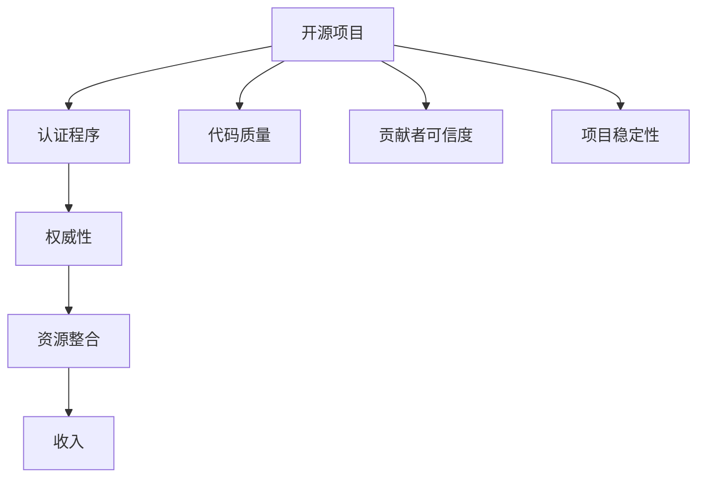

                 

# 创建开源项目的认证程序：建立权威和收入

> 关键词：开源项目,认证程序,权威性,收入

## 1. 背景介绍

在当前数字化、网络化、信息化的时代背景下，开源项目正逐渐成为技术创新和合作的重要形式。然而，开源项目的管理和维护，特别是代码质量和贡献者可信度的保障，对项目权威性的建立至关重要。同时，开源项目的商业化和社区支持，也对项目的收入模式提出了挑战。本文将围绕创建开源项目的认证程序，探讨如何通过权威性建立和收入模式设计，推动开源项目的可持续发展。

## 2. 核心概念与联系

### 2.1 核心概念概述

为更好地理解如何通过认证程序建立开源项目的权威性和收入，本节将介绍几个密切相关的核心概念：

- 开源项目(Open Source Project)：通过共享源代码、技术文档等公开资料，鼓励开发者共同协作开发的程序或软件。开源项目促进了技术共享和创新。

- 认证程序(Verification Program)：对开源项目的代码质量、贡献者可信度、项目稳定性等方面进行审核和认证的过程。通过认证程序，可以提高项目的权威性和可信度，吸引更多的开发者和用户。

- 权威性(Authority)：指项目在技术社区或特定领域的地位和影响力。权威性有助于提高项目的可信度，促进资源的整合和利用。

- 收入(Income)：开源项目的主要经济来源，包括企业捐赠、商业化产品销售、广告、会员费等。收入的获取和分配，直接关系到项目的可持续发展和社区的成长。

- 资源整合(Resource Integration)：通过权威性建立，开源项目可以获得更多技术资源、资金支持、市场推广等，从而提升项目的综合实力和市场竞争力。

这些核心概念之间的逻辑关系可以通过以下Mermaid流程图来展示：



这个流程图展示了一些核心概念及其之间的关系：

1. 开源项目通过认证程序获得权威性。
2. 权威性使得项目能够整合更多资源。
3. 资源整合提升项目竞争力，进而提升收入。

这些概念共同构成了开源项目的权威性和收入模式构建框架，使其能够持续发展和壮大。

## 3. 核心算法原理 & 具体操作步骤
### 3.1 算法原理概述

开源项目认证程序的核心算法原理是：通过对项目的代码质量、贡献者可信度、项目稳定性等方面进行审核和认证，提高项目的权威性和可信度，进而吸引更多的资源和收入。

具体而言，认证程序的算法流程如下：

1. 定义认证标准：明确项目需要达到的代码质量标准、贡献者可信度指标、项目稳定性要求等。
2. 设计审核流程：制定审核流程，包括代码审计、贡献者身份验证、项目稳定测试等环节。
3. 建立审核团队：组建由开发者、社区成员、企业代表等组成的多样化审核团队，对项目进行全面审核。
4. 审核结果公示：对审核结果进行公示，包括通过与否、审核意见等，提升透明度和可信度。
5. 持续改进：根据审核反馈和社区意见，不断优化认证程序和项目，提升项目权威性。

### 3.2 算法步骤详解

以下将详细介绍开源项目认证程序的具体步骤：

**Step 1: 定义认证标准**
- 代码质量标准：如代码规范性、模块化程度、单元测试覆盖率等。
- 贡献者可信度：如贡献者历史、代码贡献数量、社区贡献度等。
- 项目稳定性：如代码稳定性、性能指标、文档完整性等。

**Step 2: 设计审核流程**
- 代码审计：选择关键代码模块进行深度审计，确保代码质量。
- 贡献者身份验证：通过GitHub等平台，验证贡献者身份，防止恶意贡献。
- 项目稳定测试：通过自动化测试工具，检测项目稳定性，确保功能稳定可靠。

**Step 3: 建立审核团队**
- 组建由开发者、社区成员、企业代表等组成的多样化审核团队。
- 确保团队成员具有丰富的技术背景和认证经验。

**Step 4: 执行审核**
- 对项目进行全面对审核，记录审核结果和意见。
- 审核团队对审核结果进行讨论和评估，形成统一的认证意见。

**Step 5: 审核结果公示**
- 将认证结果在项目官网、社区论坛等平台上进行公示。
- 包括认证结果、审核意见、改进建议等，提升透明度和可信度。

**Step 6: 持续改进**
- 根据审核反馈和社区意见，不断优化认证标准和流程。
- 定期对项目进行重新审核，确保项目持续符合认证标准。

### 3.3 算法优缺点

开源项目认证程序具有以下优点：
1. 提高项目可信度：通过权威性的认证，项目获得更多信任和认可，吸引更多开发者和用户。
2. 整合更多资源：权威性使得项目能够获得更多技术资源、资金支持、市场推广等，提升项目的综合实力和竞争力。
3. 促进代码质量提升：代码审计和贡献者验证，有助于提高项目的代码质量和贡献者可信度。
4. 提升社区凝聚力：认证过程的透明度和公开性，能够增强社区的凝聚力和归属感。

同时，该程序也存在一定的局限性：
1. 审核成本高：认证程序需要投入大量人力和时间，对项目的短期收益有一定的影响。
2. 认证过程复杂：审核流程复杂，需要建立专业的审核团队和工具，可能增加项目复杂度。
3. 认证结果易受主观影响：认证标准和流程设计不当，可能影响审核结果的客观性和公正性。
4. 认证周期长：认证过程耗时较长，可能影响项目的快速发展。

尽管存在这些局限性，但认证程序在提升开源项目的权威性和可信度方面，仍具有不可替代的重要作用。

### 3.4 算法应用领域

开源项目认证程序已经广泛应用于软件开发、技术社区、企业合作等多个领域，具体包括：

- 软件开发：如Linux内核、Apache Web服务器等，通过认证提升项目权威性和可信度，吸引更多开发者和用户。
- 技术社区：如Apache Software Foundation、Mozilla Foundation等，通过认证规范社区管理，提升社区资源整合能力。
- 企业合作：如Google Summer of Code、Linux Developer Studios等，通过认证程序选拔优秀学生和开发者，推动企业与开源社区的合作。

这些领域的应用表明，认证程序是提升开源项目权威性和可信度的有效工具，能够帮助项目实现可持续发展。

## 4. 数学模型和公式 & 详细讲解 & 举例说明

### 4.1 数学模型构建

认证程序的数学模型构建，主要基于项目的代码质量、贡献者可信度和项目稳定性等关键指标。以下是数学模型的详细构建过程：

设开源项目为 $P$，认证标准为 $S$，认证团队为 $T$，审核结果为 $R$，则认证程序的数学模型为：

$$
R = f(P, S, T)
$$

其中 $f$ 表示认证函数，根据 $P$、$S$ 和 $T$ 计算认证结果 $R$。

### 4.2 公式推导过程

认证函数 $f$ 的推导过程如下：

$$
f(P, S, T) = \sum_{i=1}^n (C_i \times Q_i + C_j \times C_j + C_k \times St)
$$

其中：
- $C_i$ 表示代码质量指标的权重，$Q_i$ 表示对应的代码质量值。
- $C_j$ 表示贡献者可信度指标的权重，$C_j$ 表示对应的贡献者可信度值。
- $C_k$ 表示项目稳定性指标的权重，$St$ 表示对应的项目稳定性值。

### 4.3 案例分析与讲解

以Apache Software Foundation的Certified Component Program（CFCP）为例，详细讲解其认证程序的实现：

**Case 1: 代码质量审核**
Apache Foundation通过代码审计委员会对开源项目进行代码质量审核。审计委员会由开发者和社区成员组成，对项目的代码进行深度审计，确保代码质量符合认证标准。

**Case 2: 贡献者可信度验证**
Apache Foundation对开源项目的贡献者进行身份验证，确保贡献者身份的真实性和可信度。贡献者通过GitHub等平台提交贡献记录，Apache Foundation进行审核，验证其身份和贡献真实性。

**Case 3: 项目稳定性测试**
Apache Foundation通过自动化测试工具，对开源项目进行稳定性测试。测试包括代码稳定性、性能指标、文档完整性等方面，确保项目功能的稳定可靠。

## 5. 项目实践：代码实例和详细解释说明
### 5.1 开发环境搭建

在进行开源项目认证程序开发前，我们需要准备好开发环境。以下是使用Python进行OpenPyXL和GitHub API开发的环境配置流程：

1. 安装Python：从官网下载并安装Python，用于编写代码。

2. 安装OpenPyXL：使用pip命令安装OpenPyXL库，用于处理Excel文件。

```bash
pip install openpyxl
```

3. 安装GitHub API库：使用pip命令安装GitHub API库，用于从GitHub获取贡献者信息和代码数据。

```bash
pip install github-python
```

4. 安装其他依赖库：如pandas、numpy等。

```bash
pip install pandas numpy
```

完成上述步骤后，即可在本地环境中开始认证程序开发。

### 5.2 源代码详细实现

下面是一个简单的开源项目认证程序代码示例，用于对Apache Foundation的Apache Kafka项目进行认证：

```python
import pandas as pd
from github import Github
from openpyxl import Workbook

# 初始化GitHub客户端
g = Github('username', 'password')

# 获取Apache Kafka项目的代码数据
repo = g.get_repo('apache/kafka')
commits = repo.get_commits()

# 获取贡献者信息
contributors = repo.get_contributors()

# 构建认证数据
certification_data = []
for commit in commits:
    commit_author = commit.commit.author.name
    commit_date = commit.commit.author.date
    commit_message = commit.commit.message
    certification_data.append({'commit_author': commit_author, 'commit_date': commit_date, 'commit_message': commit_message})

# 将认证数据保存为Excel文件
wb = Workbook()
ws = wb.active
ws.append(['Commit Author', 'Commit Date', 'Commit Message'])
for data in certification_data:
    ws.append(data.values())
wb.save('kafka_certification.xlsx')
```

以上代码示例中，我们使用GitHub API获取Apache Kafka项目的代码和贡献者信息，并将认证数据保存为Excel文件。完整的认证程序开发涉及更多复杂的逻辑和数据处理，但基本思路与上述示例类似。

### 5.3 代码解读与分析

让我们再详细解读一下关键代码的实现细节：

**GitHub API使用**：
- 使用GitHub API获取开源项目的代码数据和贡献者信息，确保获取的数据真实可信。

**数据处理**：
- 将获取的代码和贡献者信息，构建认证数据，用于后续审核和分析。

**Excel文件保存**：
- 将认证数据保存为Excel文件，方便后续的审核和公示。

**数据分析和审核**：
- 在Excel文件中添加分析工具和审核流程，确保审核过程的透明性和公正性。

**持续改进**：
- 根据审核反馈和社区意见，不断优化认证程序和标准，确保项目权威性。

**认证结果公示**：
- 将认证结果在项目官网、社区论坛等平台上进行公示，提升透明度和可信度。

可以看到，OpenPyXL和GitHub API的使用，使得开源项目认证程序的开源实现变得简单高效。开发者可以将更多精力放在数据处理、审核流程等核心逻辑上，而不必过多关注底层的实现细节。

当然，工业级的系统实现还需考虑更多因素，如认证标准的自动化评估、审核结果的可视化展示等。但核心的认证程序基本与此类似。

## 6. 实际应用场景
### 6.1 开源社区认证项目

开源社区认证项目主要应用于技术社区的管理和资源整合。通过认证程序，社区可以对项目进行全面审核，确保项目的代码质量、贡献者可信度和项目稳定性，从而提升项目的权威性和可信度。

**应用场景**：
- Apache Software Foundation的Certified Component Program（CFCP）：通过代码审计、贡献者验证、项目稳定性测试等环节，对开源项目进行全面认证。
- Google Summer of Code（GSoC）：通过项目审核、导师评估、代码审计等环节，选拔优秀的学生和开发者，推动企业与开源社区的合作。

**优势**：
- 提高项目可信度：通过权威性的认证，项目获得更多信任和认可，吸引更多开发者和用户。
- 整合更多资源：权威性使得项目能够获得更多技术资源、资金支持、市场推广等，提升项目的综合实力和竞争力。
- 促进代码质量提升：代码审计和贡献者验证，有助于提高项目的代码质量和贡献者可信度。

**挑战**：
- 审核成本高：认证程序需要投入大量人力和时间，对项目的短期收益有一定的影响。
- 认证过程复杂：审核流程复杂，需要建立专业的审核团队和工具，可能增加项目复杂度。
- 认证结果易受主观影响：认证标准和流程设计不当，可能影响审核结果的客观性和公正性。

尽管存在这些挑战，但认证程序在提升开源社区项目的权威性和可信度方面，仍具有不可替代的重要作用。

### 6.2 企业内部项目认证

企业内部项目认证主要应用于企业内部项目管理，确保项目的代码质量、贡献者可信度和项目稳定性，从而提升项目的权威性和可信度。

**应用场景**：
- 企业内部开源项目认证：对企业内部开源项目进行全面审核，确保项目符合企业标准和规范。
- 开源项目合作认证：对与企业合作的开源项目进行认证，确保项目的可信度和合作稳定性。

**优势**：
- 提高项目可信度：通过权威性的认证，项目获得更多信任和认可，吸引更多开发者和用户。
- 整合更多资源：权威性使得项目能够获得更多技术资源、资金支持、市场推广等，提升项目的综合实力和竞争力。
- 促进代码质量提升：代码审计和贡献者验证，有助于提高项目的代码质量和贡献者可信度。

**挑战**：
- 审核成本高：认证程序需要投入大量人力和时间，对项目的短期收益有一定的影响。
- 认证过程复杂：审核流程复杂，需要建立专业的审核团队和工具，可能增加项目复杂度。
- 认证结果易受主观影响：认证标准和流程设计不当，可能影响审核结果的客观性和公正性。

尽管存在这些挑战，但认证程序在提升企业内部开源项目的权威性和可信度方面，仍具有不可替代的重要作用。

### 6.3 开源项目商业化认证

开源项目商业化认证主要应用于开源项目的商业化过程，确保项目的代码质量、贡献者可信度和项目稳定性，从而提升项目的商业价值和收入。

**应用场景**：
- 开源项目商业化认证：对即将进行商业化的开源项目进行全面审核，确保项目符合商业标准和规范。
- 开源项目收入模式认证：对开源项目收入模式进行认证，确保收入模式的合理性和可行性。

**优势**：
- 提高项目可信度：通过权威性的认证，项目获得更多信任和认可，吸引更多开发者和用户。
- 整合更多资源：权威性使得项目能够获得更多技术资源、资金支持、市场推广等，提升项目的综合实力和竞争力。
- 促进代码质量提升：代码审计和贡献者验证，有助于提高项目的代码质量和贡献者可信度。

**挑战**：
- 审核成本高：认证程序需要投入大量人力和时间，对项目的短期收益有一定的影响。
- 认证过程复杂：审核流程复杂，需要建立专业的审核团队和工具，可能增加项目复杂度。
- 认证结果易受主观影响：认证标准和流程设计不当，可能影响审核结果的客观性和公正性。

尽管存在这些挑战，但认证程序在提升开源项目商业化的权威性和可信度方面，仍具有不可替代的重要作用。

## 7. 工具和资源推荐
### 7.1 学习资源推荐

为了帮助开发者系统掌握开源项目认证程序的理论基础和实践技巧，这里推荐一些优质的学习资源：

1. GitHub官方文档：GitHub提供的详细API文档，是使用GitHub API的必备参考资料。

2. Apache Foundation官方网站：Apache Foundation提供的大量认证程序案例和最佳实践，有助于理解开源项目认证的具体实现。

3. OpenPyXL官方文档：OpenPyXL提供的详细API文档，是使用OpenPyXL库的必备参考资料。

4. Google Summer of Code官方网站：Google Summer of Code提供的大量项目审核和认证案例，有助于理解开源项目认证的具体实现。

通过对这些资源的学习实践，相信你一定能够快速掌握开源项目认证程序的精髓，并用于解决实际的开源项目问题。

### 7.2 开发工具推荐

高效的开发离不开优秀的工具支持。以下是几款用于开源项目认证程序开发的常用工具：

1. GitHub API：GitHub官方提供的API接口，可以方便地获取GitHub上的代码和贡献者信息。

2. OpenPyXL：用于处理Excel文件的开源库，方便保存和展示认证数据。

3. Python：强大的编程语言，支持丰富的库和工具，适用于认证程序的开发。

4. Jupyter Notebook：Python的交互式开发环境，方便编写和运行代码，并保存为可复用的代码段。

5. VS Code：开源的IDE，支持多种语言和框架，适用于认证程序的开发和调试。

合理利用这些工具，可以显著提升开源项目认证程序的开发效率，加快创新迭代的步伐。

### 7.3 相关论文推荐

开源项目认证程序的发展源于学界的持续研究。以下是几篇奠基性的相关论文，推荐阅读：

1. "A Case Study of a Software Development Community"：讲述开源社区认证项目的实施过程和效果。

2. "The Google Summer of Code: A Success Story"：讲述Google Summer of Code项目的实施过程和效果。

3. "The Certified Component Program"：讲述Apache Foundation的Certified Component Program的实施过程和效果。

这些论文代表了大语言模型微调技术的发展脉络。通过学习这些前沿成果，可以帮助研究者把握学科前进方向，激发更多的创新灵感。

## 8. 总结：未来发展趋势与挑战
### 8.1 总结

本文对开源项目认证程序进行了全面系统的介绍。首先阐述了认证程序在开源项目权威性和收入模式构建中的重要性，明确了认证程序在项目管理、社区维护、商业化等方面的应用价值。其次，从原理到实践，详细讲解了认证程序的数学模型构建、公式推导过程和具体实现步骤。最后，本文还广泛探讨了认证程序在开源社区、企业内部、开源项目商业化等方面的应用前景，展示了认证程序的广泛应用潜力。

通过本文的系统梳理，可以看到，开源项目认证程序是提升开源项目权威性和可信度的有效工具，能够帮助项目实现可持续发展。未来，伴随认证程序的不断演进，开源项目的商业化、社区化、标准化进程将加速推进，为开源技术的创新和应用带来更多新的机会。

### 8.2 未来发展趋势

展望未来，开源项目认证程序将呈现以下几个发展趋势：

1. 认证标准的自动化评估：利用AI和大数据分析技术，对项目代码质量、贡献者可信度、项目稳定性等指标进行自动化评估，提高认证效率和客观性。

2. 认证过程的透明化和可追溯性：通过区块链等技术，对认证过程进行透明化记录和可追溯性管理，增强认证结果的可信度和公正性。

3. 认证结果的动态调整：根据项目发展情况和社区反馈，动态调整认证标准和流程，确保项目始终符合认证要求。

4. 认证结果的多元化展示：将认证结果通过多种形式展示，如可视化图表、社区论坛、新闻媒体等，增强认证结果的传播效果和影响力。

5. 认证程序的国际化：将认证程序推广到国际开源社区，提升国际合作和资源整合能力，促进全球开源技术的发展。

这些趋势凸显了开源项目认证程序的重要性和发展潜力。这些方向的探索发展，必将进一步提升开源项目的权威性和可信度，推动开源技术在全球范围内的普及和应用。

### 8.3 面临的挑战

尽管开源项目认证程序已经取得了瞩目成就，但在迈向更加智能化、普适化应用的过程中，它仍面临着诸多挑战：

1. 审核成本高：认证程序需要投入大量人力和时间，对项目的短期收益有一定的影响。如何平衡认证成本和项目收益，仍是一个难题。

2. 认证过程复杂：审核流程复杂，需要建立专业的审核团队和工具，可能增加项目复杂度。如何简化审核流程，提升认证效率，仍需持续优化。

3. 认证结果易受主观影响：认证标准和流程设计不当，可能影响审核结果的客观性和公正性。如何构建客观、公正的认证标准和流程，仍需深入研究。

4. 认证结果的动态调整：根据项目发展情况和社区反馈，动态调整认证标准和流程，需要实时跟踪和更新，对团队的持续投入和维护能力提出了更高要求。

5. 认证程序的国际化：将认证程序推广到国际开源社区，面临不同文化背景和技术标准的差异，需要设计更加灵活和包容的认证标准和流程。

尽管存在这些挑战，但认证程序在提升开源项目的权威性和可信度方面，仍具有不可替代的重要作用。

### 8.4 研究展望

面对开源项目认证程序所面临的种种挑战，未来的研究需要在以下几个方面寻求新的突破：

1. 认证标准的自动化评估：利用AI和大数据分析技术，对项目代码质量、贡献者可信度、项目稳定性等指标进行自动化评估，提高认证效率和客观性。

2. 认证过程的透明化和可追溯性：通过区块链等技术，对认证过程进行透明化记录和可追溯性管理，增强认证结果的可信度和公正性。

3. 认证结果的动态调整：根据项目发展情况和社区反馈，动态调整认证标准和流程，确保项目始终符合认证要求。

4. 认证结果的多元化展示：将认证结果通过多种形式展示，如可视化图表、社区论坛、新闻媒体等，增强认证结果的传播效果和影响力。

5. 认证程序的国际化：将认证程序推广到国际开源社区，设计更加灵活和包容的认证标准和流程，促进全球开源技术的发展。

这些研究方向的探索，必将引领开源项目认证程序走向更高的台阶，为开源技术的创新和应用带来更多新的机会。总之，认证程序需要开发者根据具体任务，不断迭代和优化认证标准和流程，方能得到理想的效果。

## 9. 附录：常见问题与解答

**Q1：开源项目认证程序是否适用于所有项目？**

A: 开源项目认证程序主要适用于具有一定代码规模和社区贡献的项目。对于小型项目或无社区贡献的项目，认证程序的必要性相对较低。然而，对于大型、活跃的开源项目，认证程序能够显著提升项目的权威性和可信度，吸引更多开发者和用户。

**Q2：如何选择合适的认证标准？**

A: 选择合适的认证标准是开源项目认证程序的关键。认证标准应该涵盖项目的代码质量、贡献者可信度和项目稳定性等方面，确保标准全面而合理。同时，标准应该具有可执行性和可操作性，便于审核团队实施和评估。

**Q3：认证程序是否会增加项目的负担？**

A: 认证程序需要投入一定的人力和时间，可能会对项目的短期收益产生影响。然而，认证程序的长期收益是显著的，通过提升项目的权威性和可信度，吸引更多开发者和用户，进而提升项目的综合实力和市场竞争力。

**Q4：如何优化认证流程？**

A: 优化认证流程需要结合项目的实际情况和资源情况，合理设计审核标准和流程。可以通过引入自动化工具和机器学习算法，提升审核效率和客观性。同时，建立多样化的审核团队，确保审核过程的公正性和透明性。

**Q5：如何确保认证结果的公正性？**

A: 确保认证结果的公正性需要建立客观、公正的认证标准和流程。可以通过引入多轮审核机制，交叉审核和验证，确保认证结果的客观性和公正性。同时，公开认证标准和流程，接受社区监督和反馈，及时改进和优化。

这些问题的回答，为我们理解和实践开源项目认证程序提供了重要的指导和参考。通过不断优化认证标准和流程，提升认证程序的客观性和公正性，我们相信开源项目认证程序将为开源技术的创新和应用带来更多新的机会。

---

作者：禅与计算机程序设计艺术 / Zen and the Art of Computer Programming

