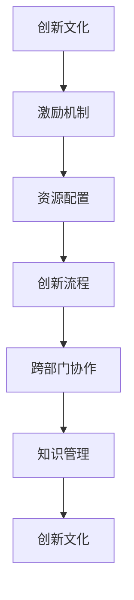

                 

# 创新管理：激发团队创造力的方法

## 1. 背景介绍

### 1.1 问题由来
在快速发展的现代商业环境中，企业面临着前所未有的竞争压力。为了保持竞争力，企业需要在创新中寻找新的增长点。然而，创新的过程复杂且充满不确定性，如何有效激发团队的创造力成为每个企业都需要解决的问题。

**案例：** 
知名互联网公司Google曾发起"20%时间"政策，允许员工每周拿出一部分时间从事自己感兴趣的创新项目。结果，Google因此诞生了Gmail、Google新闻等产品，极大地推动了公司的创新能力。

### 1.2 问题核心关键点
创新管理的目标是通过创造一个有利于创新的环境，激发团队的创造力和创新能力。核心关键点包括：

1. **创新文化的建设**：建立鼓励试错、包容失败的企业文化。
2. **激励机制的制定**：通过合理的激励措施，激发团队成员的创新热情。
3. **资源配置的优化**：确保团队有足够的资源进行创新，包括时间、资金、技术支持等。
4. **创新流程的管理**：设计合理的创新流程，提高创新项目的成功率。
5. **团队协作的促进**：建立跨部门合作机制，促进知识交流和创新。

## 2. 核心概念与联系

### 2.1 核心概念概述

为更好地理解激发团队创造力的创新管理方法，本节将介绍几个密切相关的核心概念：

1. **创新文化**：指企业中一种鼓励创新、容忍失败的企业价值观和行为准则。
2. **激励机制**：通过物质或精神激励，调动员工参与创新的积极性。
3. **资源配置**：合理安排创新资源，确保创新活动的高效运行。
4. **创新流程**：设计系统化、标准化的创新管理流程，提高创新项目的成功率。
5. **跨部门协作**：促进不同部门之间的沟通与合作，形成强大的创新合力。
6. **知识管理**：管理和利用企业内部知识资源，支持创新的持续发展。

这些核心概念之间的逻辑关系可以通过以下Mermaid流程图来展示：



这个流程图展示了这个闭环式创新管理模型的构建：

1. 企业通过建立创新文化，营造创新的环境。
2. 制定激励机制，激发员工的创新动力。
3. 优化资源配置，确保创新活动的顺利进行。
4. 设计创新流程，提高创新项目的成功率。
5. 促进跨部门协作，形成创新合力。
6. 进行知识管理，支持持续创新。
7. 创新文化进一步得到提升，形成良性循环。

## 3. 核心算法原理 & 具体操作步骤

### 3.1 算法原理概述
创新管理是一种复杂的管理过程，需要通过多个关键步骤来激发团队的创造力。核心算法原理包括以下几个方面：

1. **创新文化的塑造**：通过建立鼓励创新、容忍失败的企业价值观，营造创新氛围。
2. **激励机制的设计**：通过合理的物质和精神激励，激发团队成员的创新热情。
3. **资源配置的优化**：合理配置时间和资金等资源，支持创新项目的开展。
4. **创新流程的设计**：制定系统化、标准化的创新流程，提高项目成功率。
5. **跨部门协作的促进**：建立跨部门沟通机制，促进知识交流和创新。
6. **知识管理的实施**：利用知识管理系统，管理和利用企业内部知识资源。

### 3.2 算法步骤详解

#### 步骤一：创新文化的塑造

1. **价值观的传递**：通过企业愿景、使命和核心价值观的宣传，引导员工认同并践行。
2. **领导层的示范**：企业领导层要以身作则，积极参与创新活动，树立榜样。
3. **包容失败的文化**：建立失败归因机制，鼓励从失败中学习，不因失败而惩罚员工。

#### 步骤二：激励机制的设计

1. **物质激励**：如股权激励、项目奖金等，直接刺激员工的物质需求。
2. **精神激励**：如表彰优秀创新项目、提供发展机会等，满足员工的成就感和社会需求。
3. **成长激励**：如提供培训机会、职业发展路径等，促进员工个人成长。

#### 步骤三：资源配置的优化

1. **时间资源的分配**：如Google的"20%时间"政策，确保员工有足够时间从事创新活动。
2. **资金资源的投入**：设立创新基金，提供财务支持。
3. **技术资源的提供**：提供创新所需的工具和设备，如实验室、技术支持等。

#### 步骤四：创新流程的设计

1. **创新项目的筛选**：通过创新需求调研、创新项目征集等方式，筛选具有潜力的项目。
2. **创新项目的评估**：设立评审机制，对创新项目进行评估，决定是否进入下一阶段。
3. **创新项目的实施**：制定详细的项目计划和时间表，确保项目的顺利推进。
4. **创新项目的管理**：设立项目经理，负责项目的日常管理和协调。
5. **创新项目的结果评估**：通过项目评估，总结经验教训，持续改进。

#### 步骤五：跨部门协作的促进

1. **建立沟通渠道**：定期组织跨部门交流会议，分享创新成果和经验。
2. **设立创新小组**：组建跨部门创新团队，共同推进创新项目。
3. **资源共享**：促进各部门的知识和资源共享，提高创新效率。

#### 步骤六：知识管理的实施

1. **知识库的建立**：构建企业知识库，收集和整理创新相关的信息和资料。
2. **知识的传播**：通过企业内部刊物、培训课程等方式，传播创新知识。
3. **知识的利用**：利用知识管理系统，支持员工的创新工作。

### 3.3 算法优缺点

**优点**：

1. **系统性**：通过设计合理的流程和机制，形成系统化的创新管理。
2. **可操作性**：每个步骤都有具体的实施方法，便于操作。
3. **持续改进**：通过不断的评估和改进，推动创新管理不断优化。

**缺点**：

1. **复杂性**：创新管理涉及多个方面，需要细致规划和协调。
2. **资源投入**：需要大量的资源支持，包括时间、资金、技术等。
3. **不确定性**：创新项目具有较高的不确定性，成功率无法保证。

### 3.4 算法应用领域

基于创新管理的核心算法原理和操作步骤，已经在各个行业和领域得到了广泛的应用。

**案例：**

1. **科技公司**：如Google、微软等科技公司通过"20%时间"政策，支持员工的创新项目。
2. **金融行业**：如摩根大通设立创新实验室，推动金融科技的创新。
3. **医疗行业**：如Mayo Clinic通过创新管理，推动医疗技术和服务的创新。

## 4. 数学模型和公式 & 详细讲解 & 举例说明

### 4.1 数学模型构建

本节将使用数学语言对创新管理过程进行更加严格的刻画。

假设企业拥有N个创新项目，每个项目的效果可以用一个指标X来衡量，X的取值范围为[0,1]。创新管理的目标是最大化企业创新的整体效果，即最大化$\max(X)$。

### 4.2 公式推导过程

设创新管理的关键步骤分别为创新文化塑造、激励机制设计、资源配置优化、创新流程设计、跨部门协作促进和知识管理实施。每个步骤的效果可以用一个系数$a_i$来表示，其中$i$表示步骤序号。则整体效果可以表示为：

$$
X = \sum_{i=1}^{6}a_i \cdot f_i(X)
$$

其中，$f_i(X)$表示第$i$个步骤对整体效果的影响函数。

### 4.3 案例分析与讲解

**案例一：**

某科技公司希望提升其创新能力，设计了以下创新管理流程：

1. **创新文化塑造**：通过文化宣传和领导层示范，使得员工认同创新文化。
2. **激励机制设计**：设立股权激励和项目奖金，激发员工参与创新的积极性。
3. **资源配置优化**：提供实验室和设备支持，确保创新活动的顺利进行。
4. **创新流程设计**：设立评估机制，提高项目成功率。
5. **跨部门协作促进**：定期组织跨部门交流会议，促进知识共享。
6. **知识管理实施**：建立知识库，支持员工的创新工作。

假设每个步骤的效果系数分别为$a_1=0.2, a_2=0.3, a_3=0.1, a_4=0.15, a_5=0.15, a_6=0.05$。则整体效果可以表示为：

$$
X = 0.2 \cdot f_1(X) + 0.3 \cdot f_2(X) + 0.1 \cdot f_3(X) + 0.15 \cdot f_4(X) + 0.15 \cdot f_5(X) + 0.05 \cdot f_6(X)
$$

其中，$f_i(X)$表示第$i$个步骤对整体效果的影响函数。

假设每个步骤的实际效果为$f_i(X)=0.8$，则整体效果可以计算为：

$$
X = 0.2 \cdot 0.8 + 0.3 \cdot 0.8 + 0.1 \cdot 0.8 + 0.15 \cdot 0.8 + 0.15 \cdot 0.8 + 0.05 \cdot 0.8 = 0.795
$$

即整体创新效果达到了79.5%。

## 5. 项目实践：代码实例和详细解释说明

### 5.1 开发环境搭建

在进行创新管理项目实践前，我们需要准备好开发环境。以下是使用Python进行开发的环境配置流程：

1. **安装Python**：从官网下载并安装Python，推荐安装最新版本。
2. **安装开发工具**：如PyCharm、VSCode等，推荐使用IDE集成开发环境。
3. **安装必要的库**：如Pandas、NumPy等，推荐使用科学计算库。
4. **建立开发项目**：创建项目目录，编写代码，进行测试。

### 5.2 源代码详细实现

下面以一个简单的创新项目管理为例，给出使用Python进行创新管理项目开发的代码实现。

```python
# 导入必要的库
import pandas as pd

# 定义创新项目表
projects = pd.DataFrame({
    'ProjectID': [1, 2, 3],
    'ProjectName': ['Project1', 'Project2', 'Project3'],
    'Step1Effect': [0.2, 0.3, 0.1],
    'Step2Effect': [0.3, 0.2, 0.15],
    'Step3Effect': [0.1, 0.15, 0.05],
    'Step4Effect': [0.15, 0.1, 0.05],
    'Step5Effect': [0.15, 0.15, 0.05],
    'Step6Effect': [0.05, 0.05, 0.05]
})

# 定义函数计算整体效果
def calculate_total_effect(projects):
    return projects['Step1Effect'].sum() + projects['Step2Effect'].sum() + \
           projects['Step3Effect'].sum() + projects['Step4Effect'].sum() + \
           projects['Step5Effect'].sum() + projects['Step6Effect'].sum()

# 计算整体效果
total_effect = calculate_total_effect(projects)
print('Overall effect:', total_effect)
```

### 5.3 代码解读与分析

**代码解读**：

1. **导入库**：导入Pandas库，用于数据处理。
2. **定义项目表**：定义创新项目表，包含项目ID、项目名称以及每个步骤的效果系数。
3. **计算整体效果**：定义计算整体效果的函数，通过求和计算每个步骤的效果，并返回整体效果。
4. **计算并输出整体效果**：调用函数计算整体效果，并输出结果。

**代码分析**：

1. **数据格式**：项目表使用Pandas的DataFrame格式，便于进行数据处理和分析。
2. **函数设计**：通过定义函数，将计算整体效果的过程抽象出来，提高了代码的可读性和可维护性。
3. **结果输出**：直接输出计算结果，方便查看整体效果。

## 6. 实际应用场景

### 6.1 科技公司

科技公司如Google、微软等通过创新管理，提升了其在人工智能、云计算等领域的竞争力。通过“20%时间”政策，员工可以自由探索和实践创新项目，公司也设立了专门的创新基金和实验室，支持员工的研究工作。

### 6.2 金融行业

金融行业如摩根大通通过设立创新实验室，推动金融科技的创新。公司设立了专门的创新项目团队，利用大数据、人工智能等技术，开发了如智能投顾、区块链应用等创新产品。

### 6.3 医疗行业

医疗行业如Mayo Clinic通过创新管理，推动医疗技术和服务的创新。公司设立了专门的创新办公室，支持医护人员和研究人员进行医学研究和临床实践的创新。

## 7. 工具和资源推荐

### 7.1 学习资源推荐

为了帮助开发者系统掌握创新管理的技术基础和实践技巧，这里推荐一些优质的学习资源：

1. **《创新管理：从理论到实践》**：一本系统介绍创新管理的经典书籍，涵盖创新理论、实践方法和案例分析。
2. **Coursera创新管理课程**：Coursera提供的创新管理课程，由知名大学和专家教授授课，系统讲解创新管理的各个方面。
3. **Innovation Management Journal**：一本权威的创新管理期刊，提供最新的研究论文和案例分析。
4. **Harvard Business Review**：哈佛商业评论杂志，提供丰富的商业管理和创新实践案例。

通过对这些资源的学习实践，相信你一定能够快速掌握创新管理的精髓，并用于解决实际的创新问题。

### 7.2 开发工具推荐

高效的开发离不开优秀的工具支持。以下是几款用于创新管理开发的常用工具：

1. **JIRA**：项目管理工具，支持任务分配、进度跟踪和结果评估等功能。
2. **Slack**：团队协作工具，支持实时沟通和文件共享。
3. **Google Drive**：文档和数据管理工具，支持文件存储和共享。
4. **Confluence**：知识管理工具，支持文档管理、协作和知识共享。
5. **Trello**：任务管理工具，支持看板视图和任务分配。

合理利用这些工具，可以显著提升创新管理的效率，加快创新项目的实施和推进。

### 7.3 相关论文推荐

创新管理的研究源于学界的持续探索。以下是几篇奠基性的相关论文，推荐阅读：

1. **Innovation Management in the Digital Economy**：作者Tomas Kromann和Andreas Wiedmann，介绍了数字时代下的创新管理框架和方法。
2. **Open Innovation: The New Imperative for Creating and Profiting from Technology**：作者Henry Chesbrough，阐述了开放式创新在现代商业环境中的重要性。
3. **Managing Corporate Entrepreneurship**：作者Gerhard Heilmeier和Arne Schlüter，介绍了企业内部的创新管理策略和方法。

这些论文代表了大创新管理的研究方向，通过学习这些前沿成果，可以帮助研究者把握学科前进方向，激发更多的创新灵感。

## 8. 总结：未来发展趋势与挑战

### 8.1 总结

本文对创新管理的核心算法原理和操作步骤进行了全面系统的介绍。通过案例分析，展示了创新管理在科技公司、金融行业和医疗行业的应用，强调了创新文化、激励机制、资源配置、创新流程、跨部门协作和知识管理的重要性。

通过本文的系统梳理，可以看到，创新管理需要企业从多个方面进行综合考虑，才能激发团队的创造力，实现持续的创新发展。未来，伴随创新管理理论和实践的不断进步，相信创新将更多地渗透到各个行业和领域，为企业带来新的增长点和发展机遇。

### 8.2 未来发展趋势

展望未来，创新管理将呈现以下几个发展趋势：

1. **数字化转型**：随着数字化技术的发展，企业需要借助数字化手段提升创新管理效率。
2. **开放式创新**：企业将更多地借助外部资源和合作伙伴，实现开放式的创新发展。
3. **跨界融合**：创新管理将更多地融合不同行业和领域的技术和方法，推动跨界创新。
4. **数据驱动**：通过数据分析和人工智能技术，提高创新项目的成功率和效率。
5. **社会责任**：创新管理不仅要追求经济效益，还要承担社会责任，推动可持续发展。

这些趋势凸显了创新管理在现代社会中的重要地位，也预示着创新管理的发展方向。

### 8.3 面临的挑战

尽管创新管理在提升企业创新能力方面具有重要价值，但在实际应用过程中，仍面临以下挑战：

1. **资源有限**：企业需要投入大量的资源支持创新活动，可能面临资源有限的问题。
2. **风险高**：创新项目具有较高的不确定性，成功率无法保证。
3. **组织复杂**：创新管理涉及多部门的协作，组织复杂度高。
4. **文化差异**：不同企业文化对创新的接受程度不同，需要持续沟通和引导。
5. **绩效考核**：如何设计有效的绩效考核机制，激励员工持续创新。

这些挑战需要企业在实践中不断探索和优化，才能更好地实现创新管理的目标。

### 8.4 研究展望

未来的研究需要在以下几个方面寻求新的突破：

1. **数据驱动的创新**：利用大数据和人工智能技术，提高创新项目的成功率。
2. **开放式创新**：探索开放式创新模式，拓展创新资源和合作伙伴。
3. **跨界融合**：促进不同行业和领域的技术融合，推动跨界创新。
4. **社会责任**：将社会责任融入创新管理，推动可持续发展。
5. **绩效考核**：设计有效的绩效考核机制，激励员工持续创新。

这些研究方向的探索，必将引领创新管理走向更高的台阶，为企业的创新发展提供新的思路和方法。

## 9. 附录：常见问题与解答

**Q1：创新管理与传统管理有何不同？**

A: 创新管理与传统管理最大的不同在于，创新管理强调鼓励试错、容忍失败的企业文化，以及通过数据驱动和跨界融合等手段，激发团队的创造力和创新能力。传统管理则更多地关注流程规范、标准操作和绩效考核，注重稳定性和可控性。

**Q2：如何构建创新文化？**

A: 构建创新文化需要从企业愿景、使命和核心价值观入手，通过领导层的示范和宣传，营造鼓励创新的氛围。同时，设立失败归因机制，鼓励从失败中学习，不因失败而惩罚员工，逐步形成包容失败的创新文化。

**Q3：如何设计激励机制？**

A: 设计激励机制需要考虑物质激励和精神激励的结合。物质激励如股权激励、项目奖金等，直接刺激员工的物质需求。精神激励如表彰优秀创新项目、提供发展机会等，满足员工的成就感和社会需求。成长激励如提供培训机会、职业发展路径等，促进员工个人成长。

**Q4：如何优化资源配置？**

A: 优化资源配置需要考虑时间、资金、技术等资源的合理分配。设立创新基金，提供财务支持。提供实验室和设备支持，确保创新活动的顺利进行。通过项目评估，合理分配资源，提高创新项目的成功率。

**Q5：如何设计创新流程？**

A: 设计创新流程需要考虑创新项目的筛选、评估、实施和管理。设立评审机制，对创新项目进行评估，决定是否进入下一阶段。制定详细的项目计划和时间表，确保项目的顺利推进。设立项目经理，负责项目的日常管理和协调。

**Q6：如何促进跨部门协作？**

A: 促进跨部门协作需要建立沟通渠道，定期组织跨部门交流会议，分享创新成果和经验。设立跨部门创新团队，共同推进创新项目。促进各部门的知识和资源共享，提高创新效率。

**Q7：如何进行知识管理？**

A: 进行知识管理需要构建企业知识库，收集和整理创新相关的信息和资料。通过企业内部刊物、培训课程等方式，传播创新知识。利用知识管理系统，支持员工的创新工作。

**Q8：创新管理中常见的问题有哪些？**

A: 创新管理中常见的问题包括资源有限、风险高、组织复杂、文化差异和绩效考核等。企业需要根据具体情况，不断优化创新管理策略，克服这些挑战，实现创新目标。

---

作者：禅与计算机程序设计艺术 / Zen and the Art of Computer Programming

