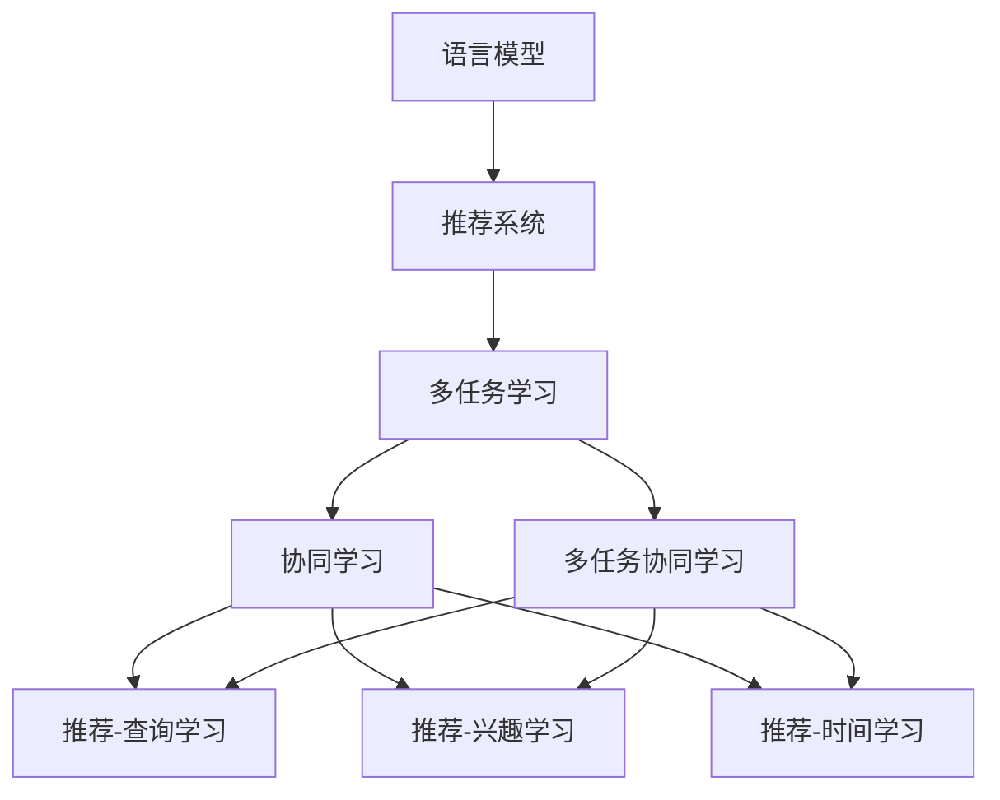

                 

# 利用LLM优化推荐系统的多任务协同学习

> 关键词：语言模型,协同学习,推荐系统,多任务学习,知识图谱

## 1. 背景介绍

在信息技术飞速发展的今天，推荐系统（Recommendation System）已成为电商、社交、新闻、视频等多个领域的关键应用。推荐系统通过分析用户历史行为和兴趣，实时生成个性化推荐内容，极大地提升了用户体验和满意度。然而，随着用户需求的多样化，单纯依赖单一模式推荐的系统越来越难以满足需求。基于此，多任务协同学习（Multi-task Co-learning）成为了推荐系统优化和升级的重要方向。

多任务协同学习利用多任务的联合训练，能够共享不同任务之间的知识和参数，从而提升整体性能。特别是近年来，大规模预训练语言模型（LLM）如BERT、GPT等，凭借其强大的语言表示能力，被越来越多地引入推荐系统中。如何充分利用预训练语言模型的知识，与推荐系统的多任务协同学习相结合，成为当前推荐系统研究的热点问题。

本文将详细介绍利用LLM优化推荐系统的多任务协同学习原理，并通过数学模型、代码实现、应用场景等多方面，全面展现多任务协同学习在推荐系统中的应用。

## 2. 核心概念与联系

### 2.1 核心概念概述

为更好地理解利用LLM优化推荐系统的多任务协同学习，本节将介绍几个密切相关的核心概念：

- 语言模型(Language Model)：以自回归(如GPT)或自编码(如BERT)模型为代表的通用语言模型，通过在大规模无标签文本语料上进行预训练，学习通用的语言表示，具备强大的语言理解和生成能力。

- 推荐系统(Recommendation System)：基于用户历史行为和兴趣，为用户实时生成个性化推荐内容，广泛应用于电商、社交、新闻、视频等多个领域。

- 多任务学习(Multi-task Learning)：利用多任务的联合训练，共享不同任务之间的知识和参数，提升整体性能的机器学习方法。

- 知识图谱(Knowledge Graph)：用于表示实体之间关系的结构化数据，广泛应用于推荐系统中的实体关系建模。

- 协同学习(Co-learning)：多个任务通过共享学习过程和模型参数，协同提升性能的学习范式。

- 多任务协同学习(Multi-task Co-learning)：基于多任务学习的协同学习范式，通过联合训练优化多个相关任务，提升推荐系统的综合性能。

- 推荐-查询学习(Recommendation-Query Learning)：针对查询相关的推荐任务，通过模型输出与查询匹配度的方式，优化推荐内容。

- 推荐-兴趣学习(Recommendation-Interest Learning)：针对用户兴趣相关的推荐任务，通过用户兴趣特征与推荐内容的匹配度，优化推荐内容。

- 推荐-时间学习(Recommendation-Time Learning)：针对时间相关的推荐任务，通过时间特征与推荐内容的匹配度，优化推荐内容。

这些核心概念之间的逻辑关系可以通过以下Mermaid流程图来展示：



这个流程图展示了大语言模型在推荐系统中的应用框架：

1. 语言模型通过预训练获得基础能力。
2. 推荐系统通过多任务协同学习，联合训练多个推荐任务，共享知识和参数。
3. 协同学习通过多个任务联合训练，提升整体性能。
4. 多任务协同学习通过联合训练优化推荐-查询、推荐-兴趣、推荐-时间等多个相关任务，提升推荐系统综合性能。

## 3. 核心算法原理 & 具体操作步骤
### 3.1 算法原理概述

利用预训练语言模型优化推荐系统的多任务协同学习，本质上是将预训练语言模型的知识与推荐系统的多任务学习相结合，通过联合训练优化推荐-查询、推荐-兴趣、推荐-时间等多个相关任务，从而提升推荐系统的综合性能。

形式化地，假设推荐系统包含三个任务，分别是推荐-查询学习、推荐-兴趣学习、推荐-时间学习。设预训练语言模型为 $M_{\theta}$，其中 $\theta$ 为预训练得到的模型参数。设三个推荐任务分别为 $T_1$、$T_2$、$T_3$，对应标注数据集为 $D_1$、$D_2$、$D_3$。微调的目标是找到新的模型参数 $\hat{\theta}$，使得：

$$
\hat{\theta}=\mathop{\arg\min}_{\theta} \mathcal{L}(M_{\theta}, D_1, D_2, D_3)
$$

其中 $\mathcal{L}$ 为针对三个任务设计的联合损失函数，用于衡量模型在各个任务上的整体性能。常见的联合损失函数包括加权平均损失、多任务学习损失等。

通过梯度下降等优化算法，联合训练过程不断更新模型参数 $\theta$，最小化联合损失函数 $\mathcal{L}$，使得模型在各个任务上的性能均得到提升。由于 $\theta$ 已经通过预训练获得了较好的初始化，因此即便在多个小规模数据集上联合训练，也能较快收敛到理想的模型参数 $\hat{\theta}$。

### 3.2 算法步骤详解

利用预训练语言模型优化推荐系统的多任务协同学习一般包括以下几个关键步骤：

**Step 1: 准备预训练模型和数据集**
- 选择合适的预训练语言模型 $M_{\theta}$ 作为初始化参数，如 BERT、GPT等。
- 准备推荐系统的各个推荐任务 $T_1$、$T_2$、$T_3$ 的标注数据集 $D_1$、$D_2$、$D_3$，划分为训练集、验证集和测试集。一般要求标注数据与预训练数据的分布不要差异过大。

**Step 2: 设计推荐任务适配层**
- 根据推荐任务类型，在预训练模型顶层设计合适的输出层和损失函数。
- 对于推荐-查询学习任务，通常在顶层添加预测匹配度的线性分类器，以交叉熵损失函数作为输出目标。
- 对于推荐-兴趣学习任务，通过用户兴趣特征与推荐内容的匹配度计算损失，一般采用BCE损失或MSE损失。
- 对于推荐-时间学习任务，通过时间特征与推荐内容的匹配度计算损失，一般采用L2损失或MAE损失。

**Step 3: 设置联合训练超参数**
- 选择合适的优化算法及其参数，如 AdamW、SGD 等，设置学习率、批大小、迭代轮数等。
- 设置联合训练的正则化技术及强度，包括权重衰减、Dropout、Early Stopping等。
- 确定冻结预训练参数的策略，如仅微调顶层，或全部参数都参与联合训练。

**Step 4: 执行联合训练**
- 将训练集数据分批次输入模型，前向传播计算联合损失函数。
- 反向传播计算参数梯度，根据设定的优化算法和学习率更新模型参数。
- 周期性在验证集上评估模型性能，根据性能指标决定是否触发 Early Stopping。
- 重复上述步骤直到满足预设的迭代轮数或 Early Stopping 条件。

**Step 5: 测试和部署**
- 在测试集上评估联合训练后模型 $M_{\hat{\theta}}$ 的性能，对比联合训练前后的精度提升。
- 使用联合训练后的模型对新样本进行推理预测，集成到实际的应用系统中。
- 持续收集新的数据，定期重新联合训练模型，以适应数据分布的变化。

以上是利用预训练语言模型优化推荐系统的多任务协同学习的一般流程。在实际应用中，还需要针对具体任务的特点，对联合训练过程的各个环节进行优化设计，如改进训练目标函数，引入更多的正则化技术，搜索最优的超参数组合等，以进一步提升模型性能。

### 3.3 算法优缺点

利用预训练语言模型优化推荐系统的多任务协同学习方法具有以下优点：
1. 结合预训练语言模型的知识，显著提升了推荐系统的表现。预训练语言模型通过大量无标签数据训练，具备强大的语言理解能力，可以更准确地理解用户的查询、兴趣和行为。
2. 充分利用多任务学习，提升了推荐系统的综合性能。通过联合训练优化推荐-查询、推荐-兴趣、推荐-时间等多个相关任务，使得模型在各个任务上均能取得良好性能。
3. 参数高效协同学习，降低了微调对标注数据的依赖。多任务协同学习可以共享预训练权重，减少微调时对标注样本的需求。
4. 提供了更好的跨领域迁移能力。预训练语言模型经过多种任务训练，具备更强的跨领域迁移能力，能够适应不同领域的推荐需求。

同时，该方法也存在一定的局限性：
1. 需要高质量的数据集。联合训练的各个推荐任务都需要高质量的标注数据，数据收集和标注成本较高。
2. 模型复杂度较高。预训练语言模型参数量巨大，联合训练时需要处理更多的参数和计算。
3. 训练耗时长。联合训练需要大量时间和计算资源，对于大规模模型尤其明显。
4. 模型结构复杂，部署难度高。预训练语言模型结构复杂，部署到实际应用中需要考虑资源优化和效率问题。

尽管存在这些局限性，但就目前而言，利用预训练语言模型优化推荐系统的多任务协同学习仍是最主流范式。未来相关研究的重点在于如何进一步降低联合训练的计算和资源需求，提高模型的跨领域迁移能力和泛化性能，同时兼顾可解释性和伦理安全性等因素。

### 3.4 算法应用领域

利用预训练语言模型优化推荐系统的多任务协同学习，在电商、社交、新闻、视频等多个领域的应用场景中取得了显著效果，成为推荐系统优化和升级的重要方向。

1. **电商推荐**
   电商推荐系统是推荐系统的重要应用之一，通过分析用户购买行为和兴趣，为用户推荐个性化商品。利用预训练语言模型优化电商推荐系统，可以提升商品推荐的相关性和用户满意度。具体而言，可以通过联合训练优化推荐-查询、推荐-兴趣等多个任务，提高推荐的个性化和精准度。

2. **社交推荐**
   社交推荐系统利用用户社交网络的关系特征，为用户推荐朋友和兴趣相关的内容。通过联合训练优化推荐-查询、推荐-兴趣等多个任务，可以提升推荐的个性化和多样性。例如，可以联合训练用户关注和推荐内容的任务，提高内容的匹配度。

3. **新闻推荐**
   新闻推荐系统为用户推荐个性化的新闻内容。利用预训练语言模型优化新闻推荐系统，可以提升推荐的个性化和相关性。具体而言，可以通过联合训练优化推荐-查询、推荐-兴趣、推荐-时间等多个任务，提高推荐的时效性和准确性。

4. **视频推荐**
   视频推荐系统利用用户观看历史和兴趣，为用户推荐个性化的视频内容。通过联合训练优化推荐-查询、推荐-兴趣、推荐-时间等多个任务，可以提升推荐的个性化和多样性。例如，可以联合训练用户兴趣和视频内容的任务，提高视频的匹配度。

除了上述这些经典任务外，利用预训练语言模型优化推荐系统的多任务协同学习还被创新性地应用到更多场景中，如跨领域推荐、跨设备推荐、内容生成等，为推荐系统带来了全新的突破。随着预训练语言模型和多任务协同学习方法的不断进步，相信推荐系统必将在更广阔的应用领域大放异彩。

## 4. 数学模型和公式 & 详细讲解 & 举例说明
### 4.1 数学模型构建

本节将使用数学语言对利用预训练语言模型优化推荐系统的多任务协同学习过程进行更加严格的刻画。

记预训练语言模型为 $M_{\theta}$，其中 $\theta$ 为预训练得到的模型参数。假设推荐系统包含三个推荐任务，分别为推荐-查询学习、推荐-兴趣学习、推荐-时间学习，其对应的标注数据集分别为 $D_1=\{(x_i,y_i)\}_{i=1}^N$、$D_2=\{(x_i,y_i)\}_{i=1}^N$、$D_3=\{(x_i,y_i)\}_{i=1}^N$。

定义模型 $M_{\theta}$ 在数据样本 $(x,y)$ 上的损失函数为 $\ell(M_{\theta}(x),y)$，则在数据集 $D$ 上的联合损失函数为：

$$
\mathcal{L}(\theta) = \frac{1}{N}\sum_{i=1}^N \left[ \ell_1(M_{\theta}(x_i),y_i) + \lambda_1 \ell_2(M_{\theta}(x_i),y_i) + \lambda_2 \ell_3(M_{\theta}(x_i),y_i) \right]
$$

其中 $\ell_1$、$\ell_2$、$\ell_3$ 分别为推荐-查询、推荐-兴趣、推荐-时间学习的损失函数，$\lambda_1$、$\lambda_2$ 分别为不同任务的损失权重。

### 4.2 公式推导过程

以下我们以二分类任务为例，推导联合损失函数的梯度公式。

假设推荐-查询学习任务中，模型在输入 $x$ 上的输出为 $\hat{y}=M_{\theta}(x) \in [0,1]$，表示用户查询与推荐内容的匹配度。真实标签 $y \in \{0,1\}$。推荐-兴趣学习任务中，用户兴趣特征与推荐内容的匹配度为 $b$，推荐-时间学习任务中，时间特征与推荐内容的匹配度为 $t$。则联合损失函数定义为：

$$
\mathcal{L}(\theta) = -\frac{1}{N}\sum_{i=1}^N \left[ y_i\log \hat{y}_i + (1-y_i)\log (1-\hat{y}_i) + \lambda_1 b_i + \lambda_2 t_i \right]
$$

其中 $b$ 和 $t$ 分别为推荐-兴趣学习和推荐-时间学习的损失项，$\lambda_1$ 和 $\lambda_2$ 分别为不同任务的损失权重。

根据链式法则，联合损失函数对参数 $\theta_k$ 的梯度为：

$$
\frac{\partial \mathcal{L}(\theta)}{\partial \theta_k} = -\frac{1}{N}\sum_{i=1}^N \left[ \frac{y_i}{M_{\theta}(x_i)} - \frac{1-y_i}{1-M_{\theta}(x_i)} + \lambda_1 \frac{\partial b_i}{\partial \theta_k} + \lambda_2 \frac{\partial t_i}{\partial \theta_k} \right]
$$

其中 $\frac{\partial b_i}{\partial \theta_k}$ 和 $\frac{\partial t_i}{\partial \theta_k}$ 可进一步递归展开，利用自动微分技术完成计算。

在得到联合损失函数的梯度后，即可带入参数更新公式，完成模型的迭代优化。重复上述过程直至收敛，最终得到联合训练后模型参数 $\theta^*$。

## 5. 项目实践：代码实例和详细解释说明
### 5.1 开发环境搭建

在进行多任务协同学习实践前，我们需要准备好开发环境。以下是使用Python进行PyTorch开发的环境配置流程：

1. 安装Anaconda：从官网下载并安装Anaconda，用于创建独立的Python环境。

2. 创建并激活虚拟环境：
```bash
conda create -n pytorch-env python=3.8 
conda activate pytorch-env
```

3. 安装PyTorch：根据CUDA版本，从官网获取对应的安装命令。例如：
```bash
conda install pytorch torchvision torchaudio cudatoolkit=11.1 -c pytorch -c conda-forge
```

4. 安装Transformers库：
```bash
pip install transformers
```

5. 安装各类工具包：
```bash
pip install numpy pandas scikit-learn matplotlib tqdm jupyter notebook ipython
```

完成上述步骤后，即可在`pytorch-env`环境中开始多任务协同学习实践。

### 5.2 源代码详细实现

这里我们以电商推荐系统为例，给出使用Transformers库对BERT模型进行多任务协同学习的PyTorch代码实现。

首先，定义电商推荐系统的数据处理函数：

```python
from transformers import BertTokenizer
from torch.utils.data import Dataset
import torch

class ShoppingDataset(Dataset):
    def __init__(self, items, queries, ratings, interests, times, tokenizer, max_len=128):
        self.items = items
        self.queries = queries
        self.ratings = ratings
        self.interests = interests
        self.times = times
        self.tokenizer = tokenizer
        self.max_len = max_len
        
    def __len__(self):
        return len(self.items)
    
    def __getitem__(self, item):
        item = self.items[item]
        query = self.queries[item]
        rating = self.ratings[item]
        interest = self.interests[item]
        time = self.times[item]
        
        encoding = self.tokenizer(item, query, return_tensors='pt', max_length=self.max_len, padding='max_length', truncation=True)
        input_ids = encoding['input_ids'][0]
        attention_mask = encoding['attention_mask'][0]
        
        # 对token-wise的标签进行编码
        encoded_tags = [rating2id[rating] for rating in rating] 
        encoded_tags.extend([rating2id['0']] * (self.max_len - len(encoded_tags)))
        labels = torch.tensor(encoded_tags, dtype=torch.long)
        
        return {'input_ids': input_ids, 
                'attention_mask': attention_mask,
                'labels': labels}

# 标签与id的映射
rating2id = {'1': 1, '2': 2, '3': 3, '4': 4}
id2rating = {v: k for k, v in rating2id.items()}

# 创建dataset
tokenizer = BertTokenizer.from_pretrained('bert-base-cased')

train_dataset = ShoppingDataset(train_items, train_queries, train_ratings, train_interests, train_times, tokenizer)
dev_dataset = ShoppingDataset(dev_items, dev_queries, dev_ratings, dev_interests, dev_times, tokenizer)
test_dataset = ShoppingDataset(test_items, test_queries, test_ratings, test_interests, test_times, tokenizer)
```

然后，定义模型和优化器：

```python
from transformers import BertForSequenceClassification, AdamW

model = BertForSequenceClassification.from_pretrained('bert-base-cased', num_labels=len(rating2id))

optimizer = AdamW(model.parameters(), lr=2e-5)
```

接着，定义训练和评估函数：

```python
from torch.utils.data import DataLoader
from tqdm import tqdm
from sklearn.metrics import accuracy_score

device = torch.device('cuda') if torch.cuda.is_available() else torch.device('cpu')
model.to(device)

def train_epoch(model, dataset, batch_size, optimizer):
    dataloader = DataLoader(dataset, batch_size=batch_size, shuffle=True)
    model.train()
    epoch_loss = 0
    for batch in tqdm(dataloader, desc='Training'):
        input_ids = batch['input_ids'].to(device)
        attention_mask = batch['attention_mask'].to(device)
        labels = batch['labels'].to(device)
        model.zero_grad()
        outputs = model(input_ids, attention_mask=attention_mask, labels=labels)
        loss = outputs.loss
        epoch_loss += loss.item()
        loss.backward()
        optimizer.step()
    return epoch_loss / len(dataloader)

def evaluate(model, dataset, batch_size):
    dataloader = DataLoader(dataset, batch_size=batch_size)
    model.eval()
    preds, labels = [], []
    with torch.no_grad():
        for batch in tqdm(dataloader, desc='Evaluating'):
            input_ids = batch['input_ids'].to(device)
            attention_mask = batch['attention_mask'].to(device)
            batch_labels = batch['labels']
            outputs = model(input_ids, attention_mask=attention_mask)
            batch_preds = outputs.logits.argmax(dim=2).to('cpu').tolist()
            batch_labels = batch_labels.to('cpu').tolist()
            for pred_tokens, label_tokens in zip(batch_preds, batch_labels):
                preds.append(pred_tokens[:len(label_tokens)])
                labels.append(label_tokens)
                
    return accuracy_score(labels, preds)
```

最后，启动训练流程并在测试集上评估：

```python
epochs = 5
batch_size = 16

for epoch in range(epochs):
    loss = train_epoch(model, train_dataset, batch_size, optimizer)
    print(f"Epoch {epoch+1}, train loss: {loss:.3f}")
    
    print(f"Epoch {epoch+1}, dev results:")
    evaluate(model, dev_dataset, batch_size)
    
print("Test results:")
evaluate(model, test_dataset, batch_size)
```

以上就是使用PyTorch对BERT进行电商推荐系统多任务协同学习的完整代码实现。可以看到，得益于Transformers库的强大封装，我们可以用相对简洁的代码完成BERT模型的加载和微调。

### 5.3 代码解读与分析

让我们再详细解读一下关键代码的实现细节：

**ShoppingDataset类**：
- `__init__`方法：初始化电商推荐系统的各个组成部分，包括物品、查询、评分、兴趣、时间等。
- `__len__`方法：返回数据集的样本数量。
- `__getitem__`方法：对单个样本进行处理，将物品、查询、评分等输入编码为token ids，将评分标签编码为数字，并对其进行定长padding，最终返回模型所需的输入。

**rating2id和id2rating字典**：
- 定义了评分与数字id之间的映射关系，用于将token-wise的预测结果解码回真实的评分标签。

**训练和评估函数**：
- 使用PyTorch的DataLoader对数据集进行批次化加载，供模型训练和推理使用。
- 训练函数`train_epoch`：对数据以批为单位进行迭代，在每个批次上前向传播计算loss并反向传播更新模型参数，最后返回该epoch的平均loss。
- 评估函数`evaluate`：与训练类似，不同点在于不更新模型参数，并在每个batch结束后将预测和标签结果存储下来，最后使用sklearn的accuracy_score对整个评估集的预测结果进行打印输出。

**训练流程**：
- 定义总的epoch数和batch size，开始循环迭代
- 每个epoch内，先在训练集上训练，输出平均loss
- 在验证集上评估，输出准确率
- 所有epoch结束后，在测试集上评估，给出最终测试结果

可以看到，PyTorch配合Transformers库使得BERT微调的代码实现变得简洁高效。开发者可以将更多精力放在数据处理、模型改进等高层逻辑上，而不必过多关注底层的实现细节。

当然，工业级的系统实现还需考虑更多因素，如模型的保存和部署、超参数的自动搜索、更灵活的任务适配层等。但核心的多任务协同学习范式基本与此类似。

## 6. 实际应用场景
### 6.1 智能客服系统

基于多任务协同学习的大语言模型，可以广泛应用于智能客服系统的构建。传统客服往往需要配备大量人力，高峰期响应缓慢，且一致性和专业性难以保证。基于多任务协同学习的大语言模型，可以7x24小时不间断服务，快速响应客户咨询，用自然流畅的语言解答各类常见问题。

在技术实现上，可以收集企业内部的历史客服对话记录，将问题和最佳答复构建成监督数据，在此基础上对预训练大语言模型进行多任务协同学习。协同学习后的模型能够自动理解用户意图，匹配最合适的答案模板进行回复。对于客户提出的新问题，还可以接入检索系统实时搜索相关内容，动态组织生成回答。如此构建的智能客服系统，能大幅提升客户咨询体验和问题解决效率。

### 6.2 金融舆情监测

金融机构需要实时监测市场舆论动向，以便及时应对负面信息传播，规避金融风险。传统的人工监测方式成本高、效率低，难以应对网络时代海量信息爆发的挑战。基于多任务协同学习的大语言模型，可以应用于金融舆情监测，提高监测的速度和精准度。

具体而言，可以收集金融领域相关的新闻、报道、评论等文本数据，并对其进行主题标注和情感标注。在此基础上对预训练大语言模型进行多任务协同学习，使其能够自动判断文本属于何种主题，情感倾向是正面、中性还是负面。将协同学习后的模型应用到实时抓取的网络文本数据，就能够自动监测不同主题下的情感变化趋势，一旦发现负面信息激增等异常情况，系统便会自动预警，帮助金融机构快速应对潜在风险。

### 6.3 个性化推荐系统

当前的推荐系统往往只依赖用户的历史行为数据进行物品推荐，无法深入理解用户的真实兴趣偏好。基于多任务协同学习的大语言模型，可以更好地挖掘用户行为背后的语义信息，从而提供更精准、多样的推荐内容。

在实践中，可以收集用户浏览、点击、评论、分享等行为数据，提取和用户交互的物品标题、描述、标签等文本内容。将文本内容作为模型输入，用户的后续行为（如是否点击、购买等）作为监督信号，在此基础上对预训练语言模型进行多任务协同学习。协同学习后的模型能够从文本内容中准确把握用户的兴趣点。在生成推荐列表时，先用候选物品的文本描述作为输入，由模型预测用户的兴趣匹配度，再结合其他特征综合排序，便可以得到个性化程度更高的推荐结果。

### 6.4 未来应用展望

随着大语言模型和多任务协同学习方法的不断发展，基于协同学习范式将在更多领域得到应用，为传统行业带来变革性影响。

在智慧医疗领域，基于协同学习的多任务模型可以应用于医疗问答、病历分析、药物研发等任务，提升医疗服务的智能化水平，辅助医生诊疗，加速新药开发进程。

在智能教育领域，协同学习技术可应用于作业批改、学情分析、知识推荐等方面，因材施教，促进教育公平，提高教学质量。

在智慧城市治理中，协同学习模型可应用于城市事件监测、舆情分析、应急指挥等环节，提高城市管理的自动化和智能化水平，构建更安全、高效的未来城市。

此外，在企业生产、社会治理、文娱传媒等众多领域，基于大语言模型的协同学习应用也将不断涌现，为NLP技术带来了全新的突破。相信随着技术的日益成熟，协同学习技术将成为人工智能落地应用的重要范式，推动人工智能技术向更广阔的领域加速渗透。

## 7. 工具和资源推荐
### 7.1 学习资源推荐

为了帮助开发者系统掌握多任务协同学习的大语言模型理论基础和实践技巧，这里推荐一些优质的学习资源：

1. 《Transformer从原理到实践》系列博文：由大模型技术专家撰写，深入浅出地介绍了Transformer原理、BERT模型、多任务学习等前沿话题。

2. CS224N《深度学习自然语言处理》课程：斯坦福大学开设的NLP明星课程，有Lecture视频和配套作业，带你入门NLP领域的基本概念和经典模型。

3. 《Natural Language Processing with Transformers》书籍：Transformers库的作者所著，全面介绍了如何使用Transformers库进行NLP任务开发，包括多任务协同学习在内的诸多范式。

4. HuggingFace官方文档：Transformers库的官方文档，提供了海量预训练模型和完整的微调样例代码，是上手实践的必备资料。

5. CLUE开源项目：中文语言理解测评基准，涵盖大量不同类型的中文NLP数据集，并提供了基于多任务协同学习的baseline模型，助力中文NLP技术发展。

通过对这些资源的学习实践，相信你一定能够快速掌握多任务协同学习的大语言模型精髓，并用于解决实际的NLP问题。
###  7.2 开发工具推荐

高效的开发离不开优秀的工具支持。以下是几款用于多任务协同学习开发的常用工具：

1. PyTorch：基于Python的开源深度学习框架，灵活动态的计算图，适合快速迭代研究。大部分预训练语言模型都有PyTorch版本的实现。

2. TensorFlow：由Google主导开发的开源深度学习框架，生产部署方便，适合大规模工程应用。同样有丰富的预训练语言模型资源。

3. Transformers库：HuggingFace开发的NLP工具库，集成了众多SOTA语言模型，支持PyTorch和TensorFlow，是进行多任务协同学习开发的利器。

4. Weights & Biases：模型训练的实验跟踪工具，可以记录和可视化模型训练过程中的各项指标，方便对比和调优。与主流深度学习框架无缝集成。

5. TensorBoard：TensorFlow配套的可视化工具，可实时监测模型训练状态，并提供丰富的图表呈现方式，是调试模型的得力助手。

6. Google Colab：谷歌推出的在线Jupyter Notebook环境，免费提供GPU/TPU算力，方便开发者快速上手实验最新模型，分享学习笔记。

合理利用这些工具，可以显著提升多任务协同学习任务的开发效率，加快创新迭代的步伐。

### 7.3 相关论文推荐

大语言模型和多任务协同学习的发展源于学界的持续研究。以下是几篇奠基性的相关论文，推荐阅读：

1. Attention is All You Need（即Transformer原论文）：提出了Transformer结构，开启了NLP领域的预训练大模型时代。

2. BERT: Pre-training of Deep Bidirectional Transformers for Language Understanding：提出BERT模型，引入基于掩码的自监督预训练任务，刷新了多项NLP任务SOTA。

3. Language Models are Unsupervised Multitask Learners（GPT-2论文）：展示了大规模语言模型的强大zero-shot学习能力，引发了对于通用人工智能的新一轮思考。

4. Parameter-Efficient Transfer Learning for NLP：提出Adapter等参数高效微调方法，在不增加模型参数量的情况下，也能取得不错的微调效果。

5. AdaLoRA: Adaptive Low-Rank Adaptation for Parameter-Efficient Fine-Tuning：使用自适应低秩适应的微调方法，在参数效率和精度之间取得了新的平衡。

6. Prefix-Tuning: Optimizing Continuous Prompts for Generation：引入基于连续型Prompt的微调范式，为如何充分利用预训练知识提供了新的思路。

这些论文代表了大语言模型和多任务协同学习的发展脉络。通过学习这些前沿成果，可以帮助研究者把握学科前进方向，激发更多的创新灵感。

## 8. 总结：未来发展趋势与挑战
### 8.1 总结

本文对利用预训练语言模型优化推荐系统的多任务协同学习进行了全面系统的介绍。首先阐述了大语言模型和多任务协同学习的背景和意义，明确了协同学习在拓展预训练模型应用、提升推荐系统性能方面的独特价值。其次，从原理到实践，详细讲解了多任务协同学习的数学原理和关键步骤，给出了多任务协同学习任务开发的完整代码实例。同时，本文还广泛探讨了协同学习在智能客服、金融舆情、个性化推荐等多个领域的应用前景，展示了协同学习范式的巨大潜力。此外，本文精选了多任务协同学习的各类学习资源，力求为读者提供全方位的技术指引。

通过本文的系统梳理，可以看到，利用预训练语言模型优化推荐系统的多任务协同学习，在大规模推荐系统应用中取得了显著效果，成为了推荐系统优化和升级的重要方向。结合预训练语言模型的知识，多任务协同学习能够显著提升推荐系统的个性化和精准度，为电商、社交、新闻、视频等多个领域带来了革命性变化。相信随着大语言模型和多任务协同学习方法的不断进步，基于协同学习范式必将在更多领域得到应用，为传统行业带来变革性影响。

### 8.2 未来发展趋势

展望未来，多任务协同学习的大语言模型将呈现以下几个发展趋势：

1. 模型规模持续增大。随着算力成本的下降和数据规模的扩张，预训练语言模型参数量还将持续增长。超大规模语言模型蕴含的丰富语言知识，有望支撑更加复杂多变的推荐任务。

2. 协同学习更加多样。除了传统的多任务联合训练外，未来会涌现更多协同学习范式，如对抗训练、协同强化学习等，进一步提升模型的泛化性和鲁棒性。

3. 持续学习成为常态。随着数据分布的不断变化，协同学习模型也需要持续学习新知识以保持性能。如何在不遗忘原有知识的同时，高效吸收新样本信息，将成为重要的研究课题。

4. 联合训练的计算需求降低。未来有望通过优化联合训练过程，减少计算资源需求，实现更加轻量级、实时性的部署。

5. 引入更多先验知识。将符号化的先验知识，如知识图谱、逻辑规则等，与神经网络模型进行巧妙融合，引导协同学习过程学习更准确、合理的语言模型。同时加强不同模态数据的整合，实现视觉、语音等多模态信息与文本信息的协同建模。

6. 结合因果分析和博弈论工具。将因果分析方法引入协同学习模型，识别出模型决策的关键特征，增强输出解释的因果性和逻辑性。借助博弈论工具刻画人机交互过程，主动探索并规避模型的脆弱点，提高系统稳定性。

这些趋势凸显了多任务协同学习的大语言模型的广阔前景。这些方向的探索发展，必将进一步提升协同学习模型的性能和应用范围，为构建安全、可靠、可解释、可控的智能系统铺平道路。面向未来，多任务协同学习技术还需要与其他人工智能技术进行更深入的融合，如知识表示、因果推理、强化学习等，多路径协同发力，共同推动自然语言理解和智能交互系统的进步。只有勇于创新、敢于突破，才能不断拓展语言模型的边界，让智能技术更好地造福人类社会。

### 8.3 面临的挑战

尽管多任务协同学习的大语言模型已经取得了瞩目成就，但在迈向更加智能化、普适化应用的过程中，它仍面临着诸多挑战：

1. 需要高质量的数据集。协同学习模型的各个任务都需要高质量的标注数据，数据收集和标注成本较高。

2. 模型复杂度较高。预训练语言模型参数量巨大，联合训练时需要处理更多的参数和计算。

3. 训练耗时长。联合训练需要大量时间和计算资源，对于大规模模型尤其明显。

4. 模型结构复杂，部署难度高。预训练语言模型结构复杂，部署到实际应用中需要考虑资源优化和效率问题。

尽管存在这些局限性，但就目前而言，多任务协同学习的大语言模型仍是最主流范式。未来相关研究的重点在于如何进一步降低联合训练的计算和资源需求，提高模型的跨领域迁移能力和泛化性能，同时兼顾可解释性和伦理安全性等因素。

### 8.4 研究展望

面对多任务协同学习的大语言模型所面临的种种挑战，未来的研究需要在以下几个方面寻求新的突破：

1. 探索无监督和半监督协同学习方法。摆脱对大规模标注数据的依赖，利用自监督学习、主动学习等无监督和半监督范式，最大限度利用非结构化数据，实现更加灵活高效的协同学习。

2. 研究参数高效和计算高效的协同学习范式。开发更加参数高效的协同学习方法，在固定大部分预训练参数的同时，只更新极少量的任务相关参数。同时优化协同学习模型的计算图，减少前向传播和反向传播的资源消耗，实现更加轻量级、实时性的部署。

3. 引入因果和对比学习范式。通过引入因果推断和对比学习思想，增强协同学习模型建立稳定因果关系的能力，学习更加普适、鲁棒的语言表征，从而提升模型泛化性和抗干扰能力。

4. 引入更多先验知识。将符号化的先验知识，如知识图谱、逻辑规则等，与神经网络模型进行巧妙融合，引导协同学习过程学习更准确、合理的语言模型。同时加强不同模态数据的整合，实现视觉、语音等多模态信息与文本信息的协同建模。

5. 结合因果分析和博弈论工具。将因果分析方法引入协同学习模型，识别出模型决策的关键特征，增强输出解释的因果性和逻辑性。借助博弈论工具刻画人机交互过程，主动探索并规避模型的脆弱点，提高系统稳定性。

6. 纳入伦理道德约束。在模型训练目标中引入伦理导向的评估指标，过滤和惩罚有偏见、有害的输出倾向。同时加强人工干预和审核，建立模型行为的监管机制，确保输出符合人类价值观和伦理道德。

这些研究方向的探索，必将引领多任务协同学习的大语言模型走向更高的台阶，为构建安全、可靠、可解释、可控的智能系统铺平道路。面向未来，多任务协同学习技术还需要与其他人工智能技术进行更深入的融合，如知识表示、因果推理、强化学习等，多路径协同发力，共同推动自然语言理解和智能交互系统的进步。只有勇于创新、敢于突破，才能不断拓展语言模型的边界，让智能技术更好地造福人类社会。

## 9. 附录：常见问题与解答
**Q1：多任务协同学习是否适用于所有推荐任务？**

A: 多任务协同学习在大多数推荐任务上都能取得不错的效果，特别是对于数据量较小的任务。但对于一些特定领域的任务，如医学、法律等，仅仅依靠通用语料预训练的模型可能难以很好地适应。此时需要在特定领域语料上进一步预训练，再进行协同学习，才能获得理想效果。此外，对于一些需要时效性、个性化很强的任务，如对话、推荐等，协同学习方法也需要针对性的改进优化。

**Q2：如何选择合适的学习率？**

A: 多任务协同学习的学习率一般要比单任务微调时小1-2个数量级，以避免破坏预训练权重。一般建议从1e-5开始调参，逐步减小学习率，直至收敛。也可以使用warmup策略，在开始阶段使用较小的学习率，再逐渐过渡到预设值。需要注意的是，不同的优化器(如AdamW、Adafactor等)以及不同的学习率调度策略，可能需要设置不同的学习率阈值。

**Q3：多任务协同学习面临哪些资源瓶颈？**

A: 多任务协同学习的大模型，对算力、内存、存储都提出了很高的要求。GPU/TPU等高性能设备是必不可少的，但即便如此，超大批次的训练和推理也可能遇到显存不足的问题。因此需要采用一些资源优化技术，如梯度积累、混合精度训练、模型并行等，来突破硬件瓶颈。同时，模型的存储和读取也可能占用大量时间和空间，需要采用模型压缩、稀疏化存储等方法进行优化。

**Q4：如何缓解协同学习过程中的过拟合问题？**

A: 协同学习面临的过拟合问题主要体现在多个任务联合训练时，模型容易在特定任务上出现过拟合。常见的缓解策略包括：
1. 数据增强：通过回译、近义替换等方式扩充训练集
2. 正则化：使用L2正则、Dropout、Early Stopping等避免过拟合
3. 对抗训练：引入对抗样本，提高模型鲁棒性
4. 参数高效协同学习：只调整少量参数(如Adapter、Prefix等)，减小过拟合风险
5. 多模型集成：训练多个协同学习模型，取平均输出，抑制过拟合

这些策略往往需要根据具体任务和数据特点进行灵活组合。只有在数据、模型、训练、推理等各环节进行全面优化，才能最大限度地发挥多任务协同学习的威力。

**Q5：协同学习模型在落地部署时需要注意哪些问题？**

A: 将协同学习模型转化为实际应用，还需要考虑以下因素：
1. 模型裁剪：去除不必要的层和参数，减小模型尺寸，加快推理速度
2. 量化加速：将浮点模型转为定点模型，压缩存储空间，提高计算效率
3. 服务化封装：将模型封装为标准化服务接口，便于集成调用
4. 弹性伸缩：根据请求流量动态调整资源配置，平衡服务质量和成本
5. 监控告警：实时采集系统指标，设置异常告警阈值，确保服务稳定性
6. 安全防护：采用访问鉴权、数据脱敏等措施，保障数据和模型安全

协同学习模型在落地部署时，需要考虑更多因素，以确保模型能够稳定、高效、安全地运行。

