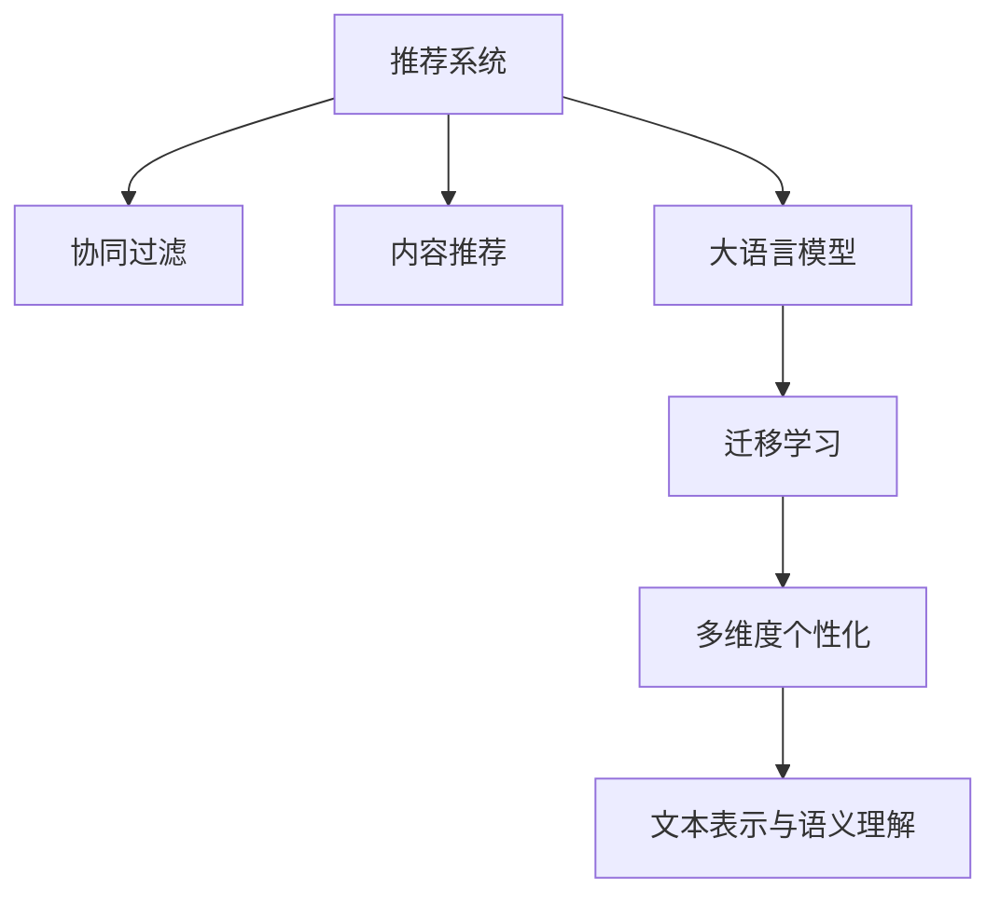

                 

# 利用LLM优化推荐系统的多维度个性化

## 1. 背景介绍

在当今信息爆炸的时代，推荐系统作为帮助用户发现有用信息的重要工具，在电商、社交网络、新闻阅读等众多领域广泛应用。传统的推荐系统基于用户历史行为数据，采用协同过滤、内容推荐等技术手段，为用户推荐可能感兴趣的物品。然而，随着用户兴趣的多样化和动态变化，这些方法往往难以满足用户的多样化需求，推荐结果常常不够个性化。

为了解决这一问题，近年来自然语言处理(NLP)技术被引入推荐系统领域，利用大语言模型(LLM)的强大语言理解和生成能力，构建多维度个性化的推荐系统。LLM作为“超级语义”引擎，能够理解用户的文本描述、评论、反馈等信息，结合上下文语义关系，生成更加精准、丰富的推荐结果。利用LLM优化推荐系统，不仅能够提升推荐结果的质量，还能有效应对推荐系统的冷启动问题，增强系统的鲁棒性和泛化能力。

本文将详细介绍如何利用LLM优化推荐系统，并结合实际应用场景，提出多维度个性化推荐的具体策略。我们将通过数学建模、代码实例、案例分析等手段，深入探讨LLM在推荐系统中的应用方法和技术挑战，力求为推荐系统开发者提供全方位的技术指引。

## 2. 核心概念与联系

### 2.1 核心概念概述

为了更好地理解利用LLM优化推荐系统的原理和实践，本节将介绍几个密切相关的核心概念：

- 推荐系统(Recommendation System)：通过分析用户行为数据，为用户推荐可能感兴趣的物品的系统。
- 协同过滤(Collaborative Filtering)：一种基于用户历史行为数据推荐物品的方法。
- 内容推荐(Content-based Recommendation)：根据物品内容特征，为用户推荐相关物品的方法。
- 大语言模型(Large Language Model, LLM)：以自回归或自编码模型为代表的预训练语言模型，具备强大的语言理解和生成能力。
- 迁移学习(Transfer Learning)：指将一个领域学习到的知识，迁移到另一个不同但相关的领域的学习范式。
- 多维度个性化(Multidimensional Personalization)：通过多方面因素综合判断，为用户生成个性化的推荐结果。
- 文本表示与语义理解：利用文本处理技术，将用户描述、评论等文本信息转化为向量表示，理解其语义含义。

这些核心概念之间的逻辑关系可以通过以下Mermaid流程图来展示：



这个流程图展示了大语言模型在推荐系统中的应用流程：

1. 推荐系统通过协同过滤、内容推荐等方法收集用户行为数据。
2. 大语言模型在此基础上进行迁移学习，将通用知识迁移到推荐任务中。
3. 多维度个性化结合用户文本数据和推荐结果，生成更加精细的推荐结果。
4. 利用文本表示与语义理解技术，对用户描述、评论等文本信息进行深度处理，提升推荐结果的质量。

这些概念共同构成了利用LLM优化推荐系统的核心技术框架，使其能够从多角度提升推荐系统的性能和用户体验。

## 3. 核心算法原理 & 具体操作步骤

### 3.1 算法原理概述

利用LLM优化推荐系统，本质上是一个基于文本语义的多维度个性化推荐过程。其核心思想是：利用LLM强大的语言理解和生成能力，结合用户文本数据，生成更加个性化和多样化的推荐结果。

形式化地，假设推荐系统为 $R$，用户为 $U$，物品为 $I$，文本数据为 $T$。定义用户-物品关联矩阵 $M \in \mathbb{R}^{U \times I}$，其中 $M_{ui}$ 表示用户 $u$ 对物品 $i$ 的评分。则推荐系统的目标函数为：

$$
\min_{M} \|M - \hat{M}\|_F^2
$$

其中 $\hat{M}$ 为推荐模型预测的用户-物品关联矩阵，$\|\cdot\|_F$ 为矩阵的 Frobenius 范数，表示模型预测误差。

通过梯度下降等优化算法，最小化上述目标函数，更新用户-物品关联矩阵 $M$，最终得到推荐模型 $\hat{M}$。

### 3.2 算法步骤详解

利用LLM优化推荐系统的具体步骤如下：

**Step 1: 收集用户文本数据**
- 收集用户对物品的文本描述、评论、反馈等信息。例如电商平台的用户评价、新闻网站的用户评论等。
- 对文本进行预处理，去除停用词、标点符号等无关信息。
- 利用预训练语言模型进行分词和向量化处理，得到文本向量表示。

**Step 2: 设计推荐模型**
- 选择合适的预训练语言模型 $M_{\theta}$ 作为初始化参数，如 BERT、GPT 等。
- 根据推荐任务，设计合适的任务适配层和损失函数。
- 选择适当的优化算法和超参数，如 AdamW、SGD 等，设置学习率、批大小、迭代轮数等。

**Step 3: 数据增强**
- 对用户文本进行数据增强，如通过回译、同义词替换等方式丰富训练集。
- 将用户文本与推荐结果一起，构成训练样本，输入模型进行训练。

**Step 4: 训练和评估**
- 将训练集数据分批次输入模型，前向传播计算损失函数。
- 反向传播计算参数梯度，根据设定的优化算法和学习率更新模型参数。
- 周期性在验证集上评估模型性能，根据性能指标决定是否触发 Early Stopping。
- 重复上述步骤直到满足预设的迭代轮数或 Early Stopping 条件。

**Step 5: 生成推荐结果**
- 利用训练好的模型，对用户输入的文本进行编码。
- 将编码结果与物品特征向量一起输入模型，计算推荐得分。
- 根据得分排序，生成推荐结果。

### 3.3 算法优缺点

利用LLM优化推荐系统的方法具有以下优点：
1. 提升推荐精度。LLM能够理解和生成文本语义，结合用户文本数据，生成更加个性化和多样化的推荐结果。
2. 缓解冷启动问题。利用用户文本信息，LLM能够在用户行为稀疏的情况下，仍能生成有意义的推荐结果。
3. 增强泛化能力。LLM能够学习通用的语言表示，应用于多种推荐场景。
4. 多维度个性化。结合用户行为数据、文本数据等多种因素，LLM能够从多角度进行推荐。

同时，该方法也存在一定的局限性：
1. 数据预处理复杂。需要处理大量非结构化文本数据，预处理步骤繁琐。
2. 训练成本高。LLM模型参数量大，训练和推理资源消耗大。
3. 模型可解释性不足。利用文本数据进行微调，模型的内部工作机制难以解释。
4. 依赖标注数据。微调过程需要标注数据，获取标注数据成本较高。

尽管存在这些局限性，但就目前而言，利用LLM优化推荐系统的方法已经在大规模推荐应用中得到了成功实践，证明了其有效性和潜力。

### 3.4 算法应用领域

利用LLM优化推荐系统的方法，已经在电商、社交网络、新闻阅读等多个领域取得了显著效果，以下是几个典型的应用场景：

- **电商推荐**：利用用户对商品评论、评分等文本数据，优化推荐模型，生成个性化商品推荐。例如，Amazon的推荐系统利用用户评论进行微调，提高了商品推荐的相关性和多样性。
- **社交网络推荐**：利用用户对内容的评论、点赞等文本信息，生成个性化内容推荐。例如，Facebook利用用户评论进行微调，提升了内容推荐的准确性和用户粘性。
- **新闻阅读推荐**：利用用户对新闻文章的评论、评分等文本数据，生成个性化新闻推荐。例如，Netflix利用用户评论进行微调，推荐用户感兴趣的新闻内容。
- **音乐推荐**：利用用户对音乐的评论、评分等文本信息，生成个性化音乐推荐。例如，Spotify利用用户评论进行微调，推荐用户喜欢的音乐曲目。

除了这些经典应用场景外，利用LLM优化推荐系统的方法也在智能家居、智能客服等领域得到探索应用，展示了其广阔的应用前景。

## 4. 数学模型和公式 & 详细讲解 & 举例说明

### 4.1 数学模型构建

利用LLM优化推荐系统，涉及多个关键组件和数学模型。以下是详细的数学模型构建过程：

1. **用户-物品关联矩阵 $M$**：
   - 假设用户集为 $U$，物品集为 $I$，定义用户-物品关联矩阵 $M \in \mathbb{R}^{U \times I}$，其中 $M_{ui}$ 表示用户 $u$ 对物品 $i$ 的评分。

2. **用户文本向量表示 $T_u$**：
   - 假设用户 $u$ 的文本描述为 $T_u \in \mathbb{R}^{n}$，其中 $n$ 为文本向量的维度。

3. **物品特征向量表示 $F_i$**：
   - 假设物品 $i$ 的特征向量为 $F_i \in \mathbb{R}^{d}$，其中 $d$ 为物品特征的维度。

4. **推荐得分函数 $f$**：
   - 定义推荐得分函数 $f: \mathbb{R}^{n} \times \mathbb{R}^{d} \rightarrow \mathbb{R}$，用于计算用户对物品的评分。

5. **优化目标函数 $L$**：
   - 定义优化目标函数 $L: \mathbb{R}^{U \times I} \rightarrow \mathbb{R}$，最小化预测评分与实际评分之间的差异。

### 4.2 公式推导过程

以下是推荐系统的数学模型推导过程：

1. **用户文本向量表示**：
   - 假设用户 $u$ 的文本描述为 $T_u = \{t_{ui}\}_{i=1}^m$，其中 $t_{ui}$ 为第 $i$ 个单词或词语的词向量表示。
   - 对用户文本进行向量化，得到文本向量 $T_u = \{w_{ui}\}_{i=1}^m$，其中 $w_{ui}$ 为第 $i$ 个单词或词语的词向量表示。

2. **物品特征向量表示**：
   - 假设物品 $i$ 的特征向量为 $F_i = \{f_{i}\}_{i=1}^n$，其中 $f_{i}$ 为物品 $i$ 的特征向量表示。

3. **推荐得分函数**：
   - 假设推荐得分函数 $f$ 为 $f(T_u, F_i) = \sum_{i=1}^m \sum_{j=1}^n w_{ui} f_{ij}$，其中 $f_{ij}$ 为第 $i$ 个单词或词语与第 $j$ 个物品特征的权重。

4. **优化目标函数**：
   - 假设用户-物品关联矩阵为 $M = \{M_{ui}\}_{i=1}^I$，其中 $M_{ui}$ 表示用户 $u$ 对物品 $i$ 的评分。
   - 假设优化目标函数为 $L(M) = \sum_{u=1}^U \sum_{i=1}^I (M_{ui} - f(T_u, F_i))^2$，其中 $L$ 为预测评分与实际评分之间的平方误差。

### 4.3 案例分析与讲解

假设我们有一个电商推荐系统的推荐任务，目标是最大化用户点击率。已知用户 $u$ 对物品 $i$ 的点击率 $y_{ui}$ 为二分类标签，点击率为 $y_{ui} = 1$ 表示用户点击了物品 $i$，点击率为 $y_{ui} = 0$ 表示用户未点击物品 $i$。

1. **数据准备**：
   - 收集用户对物品的评论、评分等文本数据，处理得到文本向量表示 $T_u$。
   - 提取物品的特征向量表示 $F_i$。

2. **模型设计**：
   - 选择预训练语言模型，如 BERT。
   - 设计任务适配层，包括文本编码层、物品编码层和推荐得分层。

3. **数据增强**：
   - 对用户评论进行数据增强，如回译、同义词替换等方式。
   - 将增强后的评论与物品特征一起构成训练样本。

4. **模型训练**：
   - 将训练集数据分批次输入模型，前向传播计算损失函数。
   - 反向传播计算参数梯度，根据设定的优化算法和学习率更新模型参数。
   - 周期性在验证集上评估模型性能，根据性能指标决定是否触发 Early Stopping。
   - 重复上述步骤直到满足预设的迭代轮数或 Early Stopping 条件。

5. **推荐结果生成**：
   - 利用训练好的模型，对用户输入的评论进行编码。
   - 将编码结果与物品特征向量一起输入模型，计算推荐得分。
   - 根据得分排序，生成推荐结果。

## 5. 项目实践：代码实例和详细解释说明

### 5.1 开发环境搭建

在进行利用LLM优化推荐系统的项目实践前，我们需要准备好开发环境。以下是使用Python进行PyTorch开发的环境配置流程：

1. 安装Anaconda：从官网下载并安装Anaconda，用于创建独立的Python环境。

2. 创建并激活虚拟环境：
```bash
conda create -n pytorch-env python=3.8 
conda activate pytorch-env
```

3. 安装PyTorch：根据CUDA版本，从官网获取对应的安装命令。例如：
```bash
conda install pytorch torchvision torchaudio cudatoolkit=11.1 -c pytorch -c conda-forge
```

4. 安装Transformers库：
```bash
pip install transformers
```

5. 安装各类工具包：
```bash
pip install numpy pandas scikit-learn matplotlib tqdm jupyter notebook ipython
```

完成上述步骤后，即可在`pytorch-env`环境中开始项目实践。

### 5.2 源代码详细实现

下面我们以电商推荐系统为例，给出使用Transformers库对BERT模型进行微调的PyTorch代码实现。

首先，定义推荐任务的数据处理函数：

```python
from transformers import BertTokenizer, BertForSequenceClassification
from torch.utils.data import Dataset
import torch

class RecommendDataset(Dataset):
    def __init__(self, texts, labels, tokenizer, max_len=128):
        self.texts = texts
        self.labels = labels
        self.tokenizer = tokenizer
        self.max_len = max_len
        
    def __len__(self):
        return len(self.texts)
    
    def __getitem__(self, item):
        text = self.texts[item]
        label = self.labels[item]
        
        encoding = self.tokenizer(text, return_tensors='pt', max_length=self.max_len, padding='max_length', truncation=True)
        input_ids = encoding['input_ids'][0]
        attention_mask = encoding['attention_mask'][0]
        
        # 对标签进行编码
        encoded_labels = [1 if label == 'click' else 0] 
        encoded_labels.extend([0] * (self.max_len - len(encoded_labels)))
        labels = torch.tensor(encoded_labels, dtype=torch.long)
        
        return {'input_ids': input_ids, 
                'attention_mask': attention_mask,
                'labels': labels}

# 定义标签与id的映射
label2id = {'click': 1, 'not_click': 0}
id2label = {v: k for k, v in label2id.items()}

# 创建dataset
tokenizer = BertTokenizer.from_pretrained('bert-base-cased')

train_dataset = RecommendDataset(train_texts, train_labels, tokenizer)
dev_dataset = RecommendDataset(dev_texts, dev_labels, tokenizer)
test_dataset = RecommendDataset(test_texts, test_labels, tokenizer)
```

然后，定义模型和优化器：

```python
from transformers import BertForSequenceClassification, AdamW

model = BertForSequenceClassification.from_pretrained('bert-base-cased', num_labels=2)

optimizer = AdamW(model.parameters(), lr=2e-5)
```

接着，定义训练和评估函数：

```python
from torch.utils.data import DataLoader
from tqdm import tqdm
from sklearn.metrics import classification_report

device = torch.device('cuda') if torch.cuda.is_available() else torch.device('cpu')
model.to(device)

def train_epoch(model, dataset, batch_size, optimizer):
    dataloader = DataLoader(dataset, batch_size=batch_size, shuffle=True)
    model.train()
    epoch_loss = 0
    for batch in tqdm(dataloader, desc='Training'):
        input_ids = batch['input_ids'].to(device)
        attention_mask = batch['attention_mask'].to(device)
        labels = batch['labels'].to(device)
        model.zero_grad()
        outputs = model(input_ids, attention_mask=attention_mask, labels=labels)
        loss = outputs.loss
        epoch_loss += loss.item()
        loss.backward()
        optimizer.step()
    return epoch_loss / len(dataloader)

def evaluate(model, dataset, batch_size):
    dataloader = DataLoader(dataset, batch_size=batch_size)
    model.eval()
    preds, labels = [], []
    with torch.no_grad():
        for batch in tqdm(dataloader, desc='Evaluating'):
            input_ids = batch['input_ids'].to(device)
            attention_mask = batch['attention_mask'].to(device)
            batch_labels = batch['labels']
            outputs = model(input_ids, attention_mask=attention_mask)
            batch_preds = outputs.logits.argmax(dim=2).to('cpu').tolist()
            batch_labels = batch_labels.to('cpu').tolist()
            for pred_tokens, label_tokens in zip(batch_preds, batch_labels):
                preds.append(pred_tokens[:len(label_tokens)])
                labels.append(label_tokens)
                
    print(classification_report(labels, preds))
```

最后，启动训练流程并在测试集上评估：

```python
epochs = 5
batch_size = 16

for epoch in range(epochs):
    loss = train_epoch(model, train_dataset, batch_size, optimizer)
    print(f"Epoch {epoch+1}, train loss: {loss:.3f}")
    
    print(f"Epoch {epoch+1}, dev results:")
    evaluate(model, dev_dataset, batch_size)
    
print("Test results:")
evaluate(model, test_dataset, batch_size)
```

以上就是使用PyTorch对BERT进行电商推荐任务微调的完整代码实现。可以看到，得益于Transformers库的强大封装，我们可以用相对简洁的代码完成BERT模型的加载和微调。

### 5.3 代码解读与分析

让我们再详细解读一下关键代码的实现细节：

**RecommendDataset类**：
- `__init__`方法：初始化文本、标签、分词器等关键组件。
- `__len__`方法：返回数据集的样本数量。
- `__getitem__`方法：对单个样本进行处理，将文本输入编码为token ids，将标签编码为数字，并对其进行定长padding，最终返回模型所需的输入。

**label2id和id2label字典**：
- 定义了标签与数字id之间的映射关系，用于将标签解码为可解释的标签。

**训练和评估函数**：
- 使用PyTorch的DataLoader对数据集进行批次化加载，供模型训练和推理使用。
- 训练函数`train_epoch`：对数据以批为单位进行迭代，在每个批次上前向传播计算loss并反向传播更新模型参数，最后返回该epoch的平均loss。
- 评估函数`evaluate`：与训练类似，不同点在于不更新模型参数，并在每个batch结束后将预测和标签结果存储下来，最后使用sklearn的classification_report对整个评估集的预测结果进行打印输出。

**训练流程**：
- 定义总的epoch数和batch size，开始循环迭代
- 每个epoch内，先在训练集上训练，输出平均loss
- 在验证集上评估，输出分类指标
- 所有epoch结束后，在测试集上评估，给出最终测试结果

可以看到，PyTorch配合Transformers库使得BERT微调的代码实现变得简洁高效。开发者可以将更多精力放在数据处理、模型改进等高层逻辑上，而不必过多关注底层的实现细节。

当然，工业级的系统实现还需考虑更多因素，如模型的保存和部署、超参数的自动搜索、更灵活的任务适配层等。但核心的微调范式基本与此类似。

## 6. 实际应用场景

利用LLM优化推荐系统的多维度个性化，已经在电商、社交网络、新闻阅读等多个领域得到广泛应用，以下是几个典型的实际应用场景：

### 6.1 电商推荐系统

电商平台的推荐系统需要为用户提供个性化的商品推荐。传统的协同过滤方法依赖用户历史行为数据，但在用户历史行为稀疏的情况下，难以获得理想的推荐效果。利用LLM优化推荐系统，可以通过用户评论、评分等文本数据，提升推荐系统的鲁棒性和泛化能力。

具体而言，可以在电商平台上收集用户的评论、评分等文本数据，将其作为输入，对BERT等预训练语言模型进行微调。微调后的模型能够理解用户文本描述的语义含义，结合用户行为数据，生成更加个性化和多样化的商品推荐。例如，Amazon的推荐系统利用用户评论进行微调，提高了商品推荐的准确性和多样性。

### 6.2 社交网络推荐系统

社交网络平台需要为用户提供个性化的内容推荐。传统的协同过滤方法依赖用户历史行为数据，但在用户历史行为稀疏的情况下，难以获得理想的推荐效果。利用LLM优化推荐系统，可以通过用户评论、点赞等文本数据，提升推荐系统的鲁棒性和泛化能力。

具体而言，可以在社交网络平台上收集用户的评论、点赞等文本数据，将其作为输入，对BERT等预训练语言模型进行微调。微调后的模型能够理解用户评论的语义含义，结合用户行为数据，生成更加个性化和多样化的内容推荐。例如，Facebook利用用户评论进行微调，提升了内容推荐的准确性和用户粘性。

### 6.3 新闻阅读推荐系统

新闻阅读平台需要为用户提供个性化的新闻推荐。传统的协同过滤方法依赖用户历史行为数据，但在用户历史行为稀疏的情况下，难以获得理想的推荐效果。利用LLM优化推荐系统，可以通过用户评论、点赞等文本数据，提升推荐系统的鲁棒性和泛化能力。

具体而言，可以在新闻阅读平台上收集用户的评论、点赞等文本数据，将其作为输入，对BERT等预训练语言模型进行微调。微调后的模型能够理解用户评论的语义含义，结合用户行为数据，生成更加个性化和多样化的新闻推荐。例如，Netflix利用用户评论进行微调，推荐用户感兴趣的新闻内容。

### 6.4 音乐推荐系统

音乐平台需要为用户提供个性化的音乐推荐。传统的协同过滤方法依赖用户历史行为数据，但在用户历史行为稀疏的情况下，难以获得理想的推荐效果。利用LLM优化推荐系统，可以通过用户评论、评分等文本数据，提升推荐系统的鲁棒性和泛化能力。

具体而言，可以在音乐平台上收集用户的评论、评分等文本数据，将其作为输入，对BERT等预训练语言模型进行微调。微调后的模型能够理解用户评论的语义含义，结合用户行为数据，生成更加个性化和多样化的音乐推荐。例如，Spotify利用用户评论进行微调，推荐用户喜欢的音乐曲目。

## 7. 工具和资源推荐

### 7.1 学习资源推荐

为了帮助开发者系统掌握利用LLM优化推荐系统的理论基础和实践技巧，这里推荐一些优质的学习资源：

1. 《Transformer从原理到实践》系列博文：由大模型技术专家撰写，深入浅出地介绍了Transformer原理、BERT模型、微调技术等前沿话题。

2. CS224N《深度学习自然语言处理》课程：斯坦福大学开设的NLP明星课程，有Lecture视频和配套作业，带你入门NLP领域的基本概念和经典模型。

3. 《Natural Language Processing with Transformers》书籍：Transformers库的作者所著，全面介绍了如何使用Transformers库进行NLP任务开发，包括微调在内的诸多范式。

4. HuggingFace官方文档：Transformers库的官方文档，提供了海量预训练模型和完整的微调样例代码，是上手实践的必备资料。

5. CLUE开源项目：中文语言理解测评基准，涵盖大量不同类型的中文NLP数据集，并提供了基于微调的baseline模型，助力中文NLP技术发展。

通过对这些资源的学习实践，相信你一定能够快速掌握利用LLM优化推荐系统的精髓，并用于解决实际的推荐系统问题。

### 7.2 开发工具推荐

高效的开发离不开优秀的工具支持。以下是几款用于利用LLM优化推荐系统开发的常用工具：

1. PyTorch：基于Python的开源深度学习框架，灵活动态的计算图，适合快速迭代研究。大部分预训练语言模型都有PyTorch版本的实现。

2. TensorFlow：由Google主导开发的开源深度学习框架，生产部署方便，适合大规模工程应用。同样有丰富的预训练语言模型资源。

3. Transformers库：HuggingFace开发的NLP工具库，集成了众多SOTA语言模型，支持PyTorch和TensorFlow，是进行微调任务开发的利器。

4. Weights & Biases：模型训练的实验跟踪工具，可以记录和可视化模型训练过程中的各项指标，方便对比和调优。与主流深度学习框架无缝集成。

5. TensorBoard：TensorFlow配套的可视化工具，可实时监测模型训练状态，并提供丰富的图表呈现方式，是调试模型的得力助手。

6. Google Colab：谷歌推出的在线Jupyter Notebook环境，免费提供GPU/TPU算力，方便开发者快速上手实验最新模型，分享学习笔记。

合理利用这些工具，可以显著提升利用LLM优化推荐系统的开发效率，加快创新迭代的步伐。

### 7.3 相关论文推荐

利用LLM优化推荐系统的发展源于学界的持续研究。以下是几篇奠基性的相关论文，推荐阅读：

1. Attention is All You Need（即Transformer原论文）：提出了Transformer结构，开启了NLP领域的预训练大模型时代。

2. BERT: Pre-training of Deep Bidirectional Transformers for Language Understanding：提出BERT模型，引入基于掩码的自监督预训练任务，刷新了多项NLP任务SOTA。

3. Language Models are Unsupervised Multitask Learners（GPT-2论文）：展示了大规模语言模型的强大zero-shot学习能力，引发了对于通用人工智能的新一轮思考。

4. Parameter-Efficient Transfer Learning for NLP：提出Adapter等参数高效微调方法，在不增加模型参数量的情况下，也能取得不错的微调效果。

5. Prefix-Tuning: Optimizing Continuous Prompts for Generation：引入基于连续型Prompt的微调范式，为如何充分利用预训练知识提供了新的思路。

6. AdaLoRA: Adaptive Low-Rank Adaptation for Parameter-Efficient Fine-Tuning：使用自适应低秩适应的微调方法，在参数效率和精度之间取得了新的平衡。

这些论文代表了大语言模型微调技术的发展脉络。通过学习这些前沿成果，可以帮助研究者把握学科前进方向，激发更多的创新灵感。

## 8. 总结：未来发展趋势与挑战

### 8.1 总结

本文对利用LLM优化推荐系统的多维度个性化进行了全面系统的介绍。首先阐述了利用LLM优化推荐系统的研究背景和意义，明确了LLM在提升推荐系统个性化和多样化方面的独特价值。其次，从原理到实践，详细讲解了利用LLM优化推荐系统的数学原理和关键步骤，给出了推荐系统微调的完整代码实例。同时，本文还广泛探讨了利用LLM优化推荐系统在电商、社交网络、新闻阅读等多个领域的应用前景，展示了其广阔的应用前景。此外，本文精选了利用LLM优化推荐系统的各类学习资源，力求为推荐系统开发者提供全方位的技术指引。

通过本文的系统梳理，可以看到，利用LLM优化推荐系统已经成为NLP领域的重要范式，极大地拓展了推荐系统的性能和用户体验。得益于大规模语料的预训练，LLM能够从多角度理解用户文本信息，结合行为数据，生成更加个性化和多样化的推荐结果。未来，伴随预训练语言模型和微调方法的持续演进，相信LLM在推荐系统中的应用将更加广泛，为推荐系统开发者提供更强大的技术支撑。

### 8.2 未来发展趋势

展望未来，利用LLM优化推荐系统的方法将呈现以下几个发展趋势：

1. 模型规模持续增大。随着算力成本的下降和数据规模的扩张，预训练语言模型的参数量还将持续增长。超大规模语言模型蕴含的丰富语言知识，有望支撑更加复杂多变的推荐场景。

2. 微调方法日趋多样。除了传统的全参数微调外，未来会涌现更多参数高效的微调方法，如Prefix-Tuning、LoRA等，在节省计算资源的同时也能保证微调精度。

3. 持续学习成为常态。随着数据分布的不断变化，微调模型也需要持续学习新知识以保持性能。如何在不遗忘原有知识的同时，高效吸收新样本信息，将成为重要的研究课题。

4. 标注样本需求降低。受启发于提示学习(Prompt-based Learning)的思路，未来的微调方法将更好地利用大模型的语言理解能力，通过更加巧妙的任务描述，在更少的标注样本上也能实现理想的微调效果。

5. 多模态微调崛起。当前的微调主要聚焦于纯文本数据，未来会进一步拓展到图像、视频、语音等多模态数据微调。多模态信息的融合，将显著提升语言模型对现实世界的理解和建模能力。

6. 模型通用性增强。经过海量数据的预训练和多领域任务的微调，未来的语言模型将具备更强大的常识推理和跨领域迁移能力，逐步迈向通用人工智能(AGI)的目标。

以上趋势凸显了利用LLM优化推荐系统的广阔前景。这些方向的探索发展，必将进一步提升推荐系统的性能和用户体验，为推荐系统开发者提供更强大的技术支撑。

### 8.3 面临的挑战

尽管利用LLM优化推荐系统的方法已经取得了瞩目成就，但在迈向更加智能化、普适化应用的过程中，它仍面临着诸多挑战：

1. 数据预处理复杂。需要处理大量非结构化文本数据，预处理步骤繁琐。
2. 训练成本高。LLM模型参数量大，训练和推理资源消耗大。
3. 模型可解释性不足。利用文本数据进行微调，模型的内部工作机制难以解释。
4. 依赖标注数据。微调过程需要标注数据，获取标注数据成本较高。
5. 数据隐私和安全问题。利用用户文本数据进行微调，需要保证数据隐私和安全。

尽管存在这些局限性，但就目前而言，利用LLM优化推荐系统的方法已经在大规模推荐应用中得到了成功实践，证明了其有效性和潜力。

### 8.4 未来突破

面对利用LLM优化推荐系统所面临的种种挑战，未来的研究需要在以下几个方面寻求新的突破：

1. 探索无监督和半监督微调方法。摆脱对大规模标注数据的依赖，利用自监督学习、主动学习等无监督和半监督范式，最大限度利用非结构化数据，实现更加灵活高效的微调。

2. 研究参数高效和计算高效的微调范式。开发更加参数高效的微调方法，在固定大部分预训练参数的同时，只更新极少量的任务相关参数。同时优化微调模型的计算图，减少前向传播和反向传播的资源消耗，实现更加轻量级、实时性的部署。

3. 融合因果和对比学习范式。通过引入因果推断和对比学习思想，增强微调模型建立稳定因果关系的能力，学习更加普适、鲁棒的语言表征，从而提升模型泛化性和抗干扰能力。

4. 引入更多先验知识。将符号化的先验知识，如知识图谱、逻辑规则等，与神经网络模型进行巧妙融合，引导微调过程学习更准确、合理的语言模型。同时加强不同模态数据的整合，实现视觉、语音等多模态信息与文本信息的协同建模。

5. 结合因果分析和博弈论工具。将因果分析方法引入微调模型，识别出模型决策的关键特征，增强输出解释的因果性和逻辑性。借助博弈论工具刻画人机交互过程，主动探索并规避模型的脆弱点，提高系统稳定性。

6. 纳入伦理道德约束。在模型训练目标中引入伦理导向的评估指标，过滤和惩罚有偏见、有害的输出倾向。同时加强人工干预和审核，建立模型行为的监管机制，确保输出符合人类价值观和伦理道德。

这些研究方向的探索，必将引领利用LLM优化推荐系统技术迈向更高的台阶，为推荐系统开发者提供更强大的技术支撑。面向未来，利用LLM优化推荐系统技术还需要与其他人工智能技术进行更深入的融合，如知识表示、因果推理、强化学习等，多路径协同发力，共同推动推荐系统技术的发展。

## 9. 附录：常见问题与解答

**Q1：利用LLM优化推荐系统的主要优势是什么？**

A: 利用LLM优化推荐系统的主要优势在于：

1. 提升推荐精度。LLM能够理解和生成文本语义，结合用户文本数据，生成更加个性化和多样化的推荐结果。
2. 缓解冷启动问题。利用用户文本信息，LLM能够在用户行为稀疏的情况下，仍能生成有意义的推荐结果。
3. 增强泛化能力。LLM能够学习通用的语言表示，应用于多种推荐场景。
4. 多维度个性化。结合用户行为数据、文本数据等多种因素，LLM能够从多角度进行推荐。

这些优势使得利用LLM优化推荐系统能够更好地满足用户的个性化需求，提升推荐系统的整体性能。

**Q2：如何选择合适的预训练语言模型？**

A: 选择合适的预训练语言模型需要考虑以下几个方面：

1. 模型大小。通常情况下，较大的模型参数量更大，但精度更高。需要根据实际需求选择合适的模型大小。
2. 预训练任务。不同的预训练任务具有不同的语义理解和生成能力。需要根据实际应用场景选择合适的预训练任务。
3. 训练和推理资源。不同的模型大小和架构对计算资源的要求不同。需要根据实际硬件条件选择合适的模型。
4. 模型可解释性。一些模型（如BERT）具有良好的可解释性，适合用于需要解释输出的场景。

一般来说，BERT、GPT等大模型在推荐系统中效果较好，但也需要考虑模型的训练和推理成本。

**Q3：数据增强有哪些具体方法？**

A: 数据增强的具体方法包括：

1. 回译。将用户文本翻译成其他语言，再进行回译，以增加数据的多样性。
2. 同义词替换。将用户文本中的词语替换为同义词，以增加数据的多样性。
3. 文本切割。将用户文本进行切割，生成多个句子，以增加数据的多样性。
4. 噪声加入。在用户文本中添加噪声，如插入、删除、替换等，以增加数据的鲁棒性。
5. 数据混合。将不同用户或不同文本的混合数据用于训练，以增加数据的多样性。

这些方法可以有效地提高模型的泛化能力和鲁棒性，帮助模型更好地适应不同用户和不同场景。

**Q4：如何在利用LLM优化推荐系统中保证数据隐私和安全？**

A: 在利用LLM优化推荐系统中，保护用户数据隐私和安全至关重要。以下是几种常用的保护方法：

1. 数据匿名化。对用户文本数据进行匿名化处理，去除敏感信息。
2. 数据加密。对用户文本数据进行加密处理，防止数据泄露。
3. 权限控制。对数据访问进行权限控制，只允许授权人员访问数据。
4. 数据共享协议。签订数据共享协议，明确数据使用范围和保护措施。
5. 差分隐私。在数据处理过程中加入噪声，保护用户隐私。

这些方法可以有效保护用户数据隐私和安全，保障推荐系统应用的安全性。

---

作者：禅与计算机程序设计艺术 / Zen and the Art of Computer Programming

