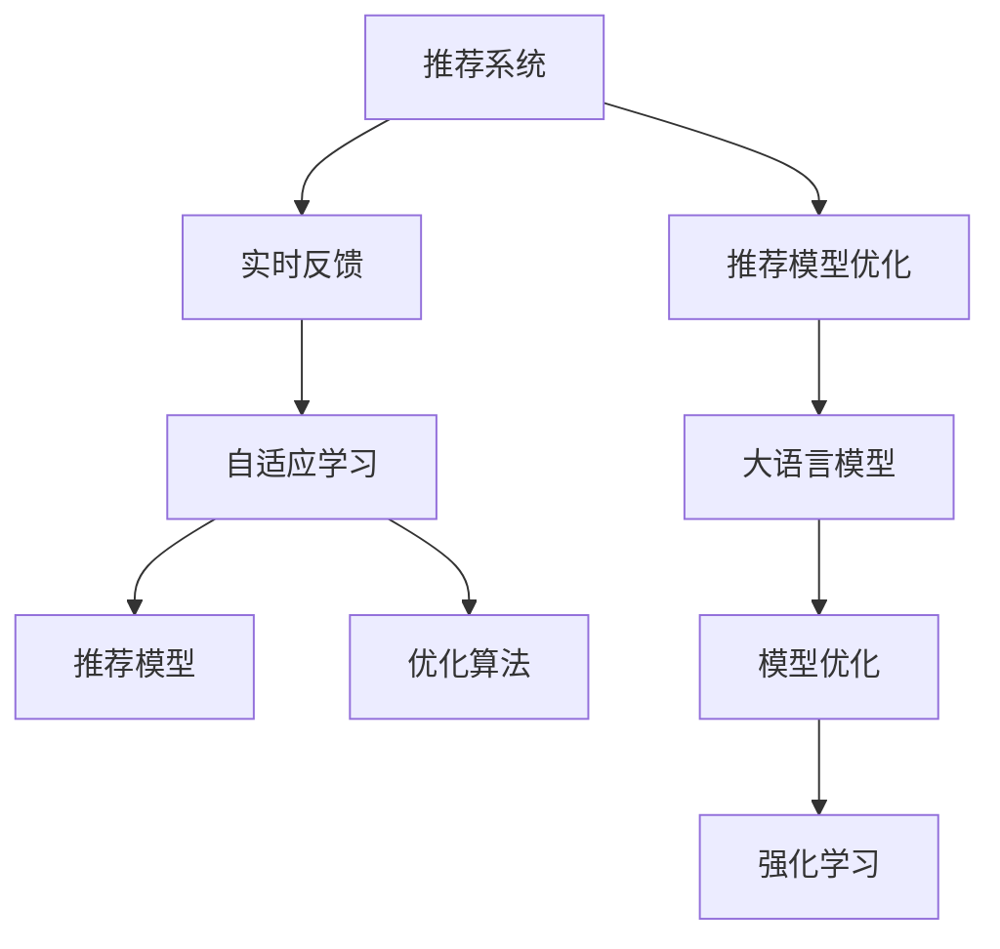

                 

# 利用LLM优化推荐系统的实时反馈处理

> 关键词：推荐系统, 实时反馈, 自适应学习, 推荐模型, 模型优化, 强化学习, 优化算法

## 1. 背景介绍

### 1.1 问题由来
推荐系统（Recommender System）作为一种典型的智能系统，通过分析和预测用户行为，为用户推荐感兴趣的物品，广泛应用于电商、社交、视频、新闻等领域。推荐系统的目标是最大化用户满意度，从而提升用户留存率、活跃度和收益等指标。

近年来，基于深度学习的推荐模型取得了显著进展，能够更准确地预测用户行为，提升推荐质量。然而，现有推荐模型往往假设用户行为固定不变，一旦建立推荐模型，用户行为便被固定在模型中，无法及时适应用户行为的变化。

在实践中，用户行为受多种因素影响，如时间、情绪、环境等，可能随时发生变化。用户偏好的剧烈变动会导致推荐模型准确性急剧下降，从而带来较差的用户体验。例如，用户可能在一段时间内突然对某一类物品失去兴趣，或对新物品产生浓厚的兴趣，而现有的推荐模型难以实时响应这类变化，导致推荐效果大幅下降。

为解决这一问题，本文提出了利用大语言模型（Large Language Model, LLM）优化推荐系统实时反馈处理的方法。通过实时收集用户反馈，利用LLM的自适应学习能力，动态调整推荐模型，从而更好地适应用户行为的变化，提高推荐系统的效果。

## 2. 核心概念与联系

### 2.1 核心概念概述

为更好地理解利用LLM优化推荐系统的实时反馈处理，本节将介绍几个密切相关的核心概念：

- 推荐系统（Recommender System）：利用用户历史行为数据和物品属性，预测用户可能感兴趣的物品，为用户推荐。推荐系统的目标是通过提升用户体验，提高用户满意度。

- 实时反馈（Real-time Feedback）：在推荐过程中实时收集用户的行为数据，如点击、收藏、购买等，用于动态调整推荐模型，提升推荐效果。

- 自适应学习（Adaptive Learning）：通过收集实时反馈数据，动态调整模型参数，使模型能够更好地适应用户行为变化。

- 推荐模型（Recommender Model）：推荐系统中用于预测用户兴趣和物品相关性的模型，常见包括协同过滤、基于内容的推荐、深度学习等。

- 优化算法（Optimization Algorithm）：用于动态调整推荐模型参数的算法，常见包括梯度下降、Adam、Adagrad等。

- 强化学习（Reinforcement Learning, RL）：通过智能体与环境互动，利用实时反馈不断优化策略的算法，在推荐系统中可看作一种动态调整推荐策略的框架。

- 推荐模型优化（Model Optimization）：通过收集实时反馈数据，动态调整推荐模型，提升模型的预测精度和用户体验。

- 大语言模型（Large Language Model, LLM）：如BERT、GPT等大规模预训练语言模型，能够通过自监督学习获得丰富的语言知识和表示。

这些核心概念之间的逻辑关系可以通过以下Mermaid流程图来展示：



这个流程图展示了大语言模型优化推荐系统的实时反馈处理的基本框架：

1. 推荐系统接收用户行为数据。
2. 实时反馈模块收集用户实时反馈数据。
3. 自适应学习模块通过实时反馈数据，动态调整推荐模型参数。
4. 推荐模型利用调整后的参数，重新进行物品推荐。
5. 优化算法通过不断调整参数，提升推荐模型效果。
6. 强化学习框架引导优化算法，不断优化推荐策略。
7. 大语言模型提供语言知识和表示，辅助优化算法和推荐模型。

通过理解这些核心概念，我们可以更好地把握利用LLM优化推荐系统的实时反馈处理的基本思路和设计框架。

## 3. 核心算法原理 & 具体操作步骤

### 3.1 算法原理概述

利用LLM优化推荐系统的实时反馈处理，其核心思想是：通过实时收集用户反馈，利用大语言模型的自适应学习能力，动态调整推荐模型，使得推荐系统能够更好地适应用户行为变化。

具体来说，我们假设推荐模型为 $M_{\theta}$，其中 $\theta$ 为模型参数。在用户交互过程中，通过实时反馈模块收集用户的反馈 $y$，例如用户是否点击了某个物品、是否购买了某个物品等。

基于实时反馈 $y$，利用LLM模型 $M_{\phi}$ 进行预测，得到用户对物品的兴趣程度 $p(y|x)$，其中 $x$ 为物品特征向量。通过最大化目标函数，优化推荐模型 $M_{\theta}$ 的参数：

$$
\theta^* = \mathop{\arg\max}_{\theta} \mathcal{L}(M_{\theta},y) = \mathop{\arg\max}_{\theta} \int_{x} p(y|x) \log M_{\theta}(x) \text{d}x
$$

其中 $\mathcal{L}(M_{\theta},y)$ 为推荐模型的损失函数，通常为交叉熵损失函数。

### 3.2 算法步骤详解

利用LLM优化推荐系统的实时反馈处理，主要包括以下几个关键步骤：

**Step 1: 准备推荐系统数据集**
- 收集用户历史行为数据，包括用户ID、物品ID、点击次数、购买次数等。
- 提取物品的特征向量，如物品标题、描述、类别等。
- 将历史数据分为训练集、验证集和测试集。

**Step 2: 设计推荐模型**
- 选择合适的推荐模型，如协同过滤、基于内容的推荐、深度学习模型等。
- 设计模型参数 $\theta$，定义损失函数 $\mathcal{L}(M_{\theta},y)$。
- 确定优化算法和超参数，如学习率、批大小、迭代轮数等。

**Step 3: 添加实时反馈模块**
- 实现实时反馈模块，收集用户行为数据 $y$。
- 设计实时反馈数据的格式，方便后续处理。

**Step 4: 训练推荐模型**
- 利用训练集数据，通过优化算法训练推荐模型 $M_{\theta}$。
- 在验证集上评估模型性能，根据性能指标决定是否触发优化操作。
- 在测试集上测试推荐模型，对比优化前后的效果。

**Step 5: 实时反馈处理**
- 实时收集用户反馈数据 $y$。
- 利用LLM模型 $M_{\phi}$ 进行预测，得到用户对物品的兴趣程度 $p(y|x)$。
- 根据预测结果，动态调整推荐模型参数 $\theta$，重新训练推荐模型。

**Step 6: 更新推荐模型**
- 在新的实时反馈数据上，重新训练推荐模型。
- 利用优化算法不断调整参数，提升模型效果。

**Step 7: 评估与部署**
- 在测试集上评估实时反馈处理后的推荐模型效果。
- 将优化后的模型部署到推荐系统中，实时更新推荐结果。

### 3.3 算法优缺点

利用LLM优化推荐系统的实时反馈处理，具有以下优点：
1. 实时响应用户行为变化。通过实时反馈和自适应学习，推荐系统能够迅速响应用户行为的变化，提高推荐质量。
2. 增强模型鲁棒性。利用实时反馈和LLM的自适应学习能力，推荐模型能够更好地适应不同场景和用户行为，提高鲁棒性。
3. 提升用户体验。通过实时反馈和动态调整，推荐系统能够更好地预测用户需求，提供个性化推荐，提升用户体验。
4. 高效优化。利用优化算法和LLM的自适应学习能力，推荐模型能够高效进行优化，节省计算资源。

同时，该方法也存在以下局限性：
1. 数据稀疏性。推荐系统通常面临数据稀疏性问题，即用户行为数据不足，导致推荐模型的训练效果较差。
2. 计算资源消耗大。LLM模型通常参数量较大，计算资源消耗较大，需要高性能设备支持。
3. 模型复杂度高。利用LLM优化推荐模型，需要额外引入LLM模型，增加了模型的复杂度。
4. 对反馈数据质量要求高。实时反馈数据质量直接影响推荐效果，需要保证反馈数据的准确性和及时性。

尽管存在这些局限性，但就目前而言，利用LLM优化推荐系统的实时反馈处理仍是一种有效的推荐优化方法。未来相关研究的重点在于如何进一步降低数据稀疏性问题，提高实时反馈数据的质量和处理效率，同时兼顾计算资源和模型复杂度等因素。

### 3.4 算法应用领域

利用LLM优化推荐系统的实时反馈处理，已在多个领域得到应用，包括但不限于：

- 电商推荐：如京东、亚马逊等电商平台，通过实时反馈优化推荐系统，提升用户购物体验。
- 视频推荐：如Netflix、YouTube等视频平台，利用实时反馈优化推荐内容，提高用户观看体验。
- 新闻推荐：如今日头条、微博等新闻应用，通过实时反馈优化推荐新闻内容，提升用户粘性。
- 音乐推荐：如Spotify、网易云音乐等音乐平台，利用实时反馈优化推荐歌曲，提升用户满意度。

除了上述这些经典领域外，实时反馈处理在更多场景中也有应用潜力，如智能家居、智能电视、社交网络等，为智能交互和个性化推荐提供新的可能性。

## 4. 数学模型和公式 & 详细讲解  
### 4.1 数学模型构建

本节将使用数学语言对利用LLM优化推荐系统的实时反馈处理进行更加严格的刻画。

记推荐模型为 $M_{\theta}$，其中 $\theta$ 为模型参数。设用户历史行为数据为 $D=\{(x_i,y_i)\}_{i=1}^N$，其中 $x_i$ 为用户行为数据，$y_i$ 为用户反馈数据。

定义推荐模型的损失函数为：

$$
\mathcal{L}(M_{\theta},D) = \sum_{i=1}^N \log M_{\theta}(x_i)
$$

在实时反馈处理过程中，收集新的实时反馈数据 $y_t$，利用LLM模型 $M_{\phi}$ 进行预测，得到用户对物品的兴趣程度 $p(y_t|x_t)$，其中 $x_t$ 为物品特征向量。

根据LLM的预测结果，动态调整推荐模型参数 $\theta$，最小化新的目标函数：

$$
\theta^* = \mathop{\arg\min}_{\theta} \mathcal{L}(M_{\theta},y_t) = \mathop{\arg\min}_{\theta} - \log M_{\theta}(x_t)
$$

其中 $\mathcal{L}(M_{\theta},y_t)$ 为实时反馈数据的损失函数，通常为负对数似然损失函数。

### 4.2 公式推导过程

以下我们以推荐系统的点击率预测任务为例，推导利用LLM优化推荐系统的实时反馈处理公式。

假设用户对物品的点击概率为 $p(y|x)$，推荐模型的输出为 $\hat{p}(y|x)$，即：

$$
\hat{p}(y|x) = \sigma(W_1 x + b_1) \cdot \sigma(W_2 y + b_2)
$$

其中 $\sigma$ 为sigmoid函数，$W_1$、$W_2$、$b_1$、$b_2$ 为模型参数。

根据LLM模型的预测结果，动态调整推荐模型参数 $\theta$，最小化实时反馈数据的损失函数：

$$
\mathcal{L}(M_{\theta},y_t) = - \log \hat{p}(y_t|x_t)
$$

利用梯度下降算法更新模型参数：

$$
\theta \leftarrow \theta - \eta \nabla_{\theta}\mathcal{L}(M_{\theta},y_t)
$$

其中 $\eta$ 为学习率，$\nabla_{\theta}\mathcal{L}(M_{\theta},y_t)$ 为梯度计算公式。

在得到损失函数的梯度后，即可带入参数更新公式，完成模型的迭代优化。重复上述过程直至收敛，最终得到适应实时反馈的推荐模型参数 $\theta^*$。

## 5. 项目实践：代码实例和详细解释说明
### 5.1 开发环境搭建

在进行实时反馈处理实践前，我们需要准备好开发环境。以下是使用Python进行PyTorch开发的环境配置流程：

1. 安装Anaconda：从官网下载并安装Anaconda，用于创建独立的Python环境。

2. 创建并激活虚拟环境：
```bash
conda create -n pytorch-env python=3.8 
conda activate pytorch-env
```

3. 安装PyTorch：根据CUDA版本，从官网获取对应的安装命令。例如：
```bash
conda install pytorch torchvision torchaudio cudatoolkit=11.1 -c pytorch -c conda-forge
```

4. 安装LLM模型：这里以使用GPT-2模型为例，根据官方文档下载和安装GPT-2模型。

5. 安装各类工具包：
```bash
pip install numpy pandas scikit-learn matplotlib tqdm jupyter notebook ipython
```

完成上述步骤后，即可在`pytorch-env`环境中开始实时反馈处理实践。

### 5.2 源代码详细实现

这里我们以点击率预测任务为例，给出使用GPT-2模型进行实时反馈处理的PyTorch代码实现。

首先，定义点击率预测任务的数据处理函数：

```python
from transformers import GPT2Tokenizer
from torch.utils.data import Dataset
import torch

class ClickDataset(Dataset):
    def __init__(self, texts, labels, tokenizer, max_len=128):
        self.texts = texts
        self.labels = labels
        self.tokenizer = tokenizer
        self.max_len = max_len
        
    def __len__(self):
        return len(self.texts)
    
    def __getitem__(self, item):
        text = self.texts[item]
        label = self.labels[item]
        
        encoding = self.tokenizer(text, return_tensors='pt', max_length=self.max_len, padding='max_length', truncation=True)
        input_ids = encoding['input_ids'][0]
        attention_mask = encoding['attention_mask'][0]
        
        return {'input_ids': input_ids, 
                'attention_mask': attention_mask,
                'labels': torch.tensor(label, dtype=torch.long)}
```

然后，定义GPT-2模型和优化器：

```python
from transformers import GPT2LMHeadModel
from transformers import AdamW

model = GPT2LMHeadModel.from_pretrained('gpt2', num_labels=2)
tokenizer = GPT2Tokenizer.from_pretrained('gpt2')

optimizer = AdamW(model.parameters(), lr=2e-5)
```

接着，定义训练和评估函数：

```python
from torch.utils.data import DataLoader
from tqdm import tqdm
from sklearn.metrics import accuracy_score

device = torch.device('cuda') if torch.cuda.is_available() else torch.device('cpu')
model.to(device)

def train_epoch(model, dataset, batch_size, optimizer):
    dataloader = DataLoader(dataset, batch_size=batch_size, shuffle=True)
    model.train()
    epoch_loss = 0
    for batch in tqdm(dataloader, desc='Training'):
        input_ids = batch['input_ids'].to(device)
        attention_mask = batch['attention_mask'].to(device)
        labels = batch['labels'].to(device)
        model.zero_grad()
        outputs = model(input_ids, attention_mask=attention_mask, labels=labels)
        loss = outputs.loss
        epoch_loss += loss.item()
        loss.backward()
        optimizer.step()
    return epoch_loss / len(dataloader)

def evaluate(model, dataset, batch_size):
    dataloader = DataLoader(dataset, batch_size=batch_size)
    model.eval()
    preds, labels = [], []
    with torch.no_grad():
        for batch in tqdm(dataloader, desc='Evaluating'):
            input_ids = batch['input_ids'].to(device)
            attention_mask = batch['attention_mask'].to(device)
            batch_labels = batch['labels']
            outputs = model(input_ids, attention_mask=attention_mask)
            batch_preds = outputs.logits.argmax(dim=2).to('cpu').tolist()
            batch_labels = batch_labels.to('cpu').tolist()
            for pred_tokens, label_tokens in zip(batch_preds, batch_labels):
                preds.append(pred_tokens[:len(label_tokens)])
                labels.append(label_tokens)
                
    print(accuracy_score(labels, preds))
```

最后，启动训练流程并在测试集上评估：

```python
epochs = 5
batch_size = 16

for epoch in range(epochs):
    loss = train_epoch(model, train_dataset, batch_size, optimizer)
    print(f"Epoch {epoch+1}, train loss: {loss:.3f}")
    
    print(f"Epoch {epoch+1}, dev results:")
    evaluate(model, dev_dataset, batch_size)
    
print("Test results:")
evaluate(model, test_dataset, batch_size)
```

以上就是使用PyTorch对GPT-2模型进行实时反馈处理实践的完整代码实现。可以看到，得益于LLM模型的强大封装，我们可以用相对简洁的代码完成模型的加载和优化。

### 5.3 代码解读与分析

让我们再详细解读一下关键代码的实现细节：

**ClickDataset类**：
- `__init__`方法：初始化文本、标签、分词器等关键组件。
- `__len__`方法：返回数据集的样本数量。
- `__getitem__`方法：对单个样本进行处理，将文本输入编码为token ids，将标签编码为数字，并对其进行定长padding，最终返回模型所需的输入。

**GPT-2模型和优化器**：
- 使用PyTorch加载GPT-2模型，并使用AdamW优化器进行参数更新。

**训练和评估函数**：
- 使用PyTorch的DataLoader对数据集进行批次化加载，供模型训练和推理使用。
- 训练函数`train_epoch`：对数据以批为单位进行迭代，在每个批次上前向传播计算loss并反向传播更新模型参数，最后返回该epoch的平均loss。
- 评估函数`evaluate`：与训练类似，不同点在于不更新模型参数，并在每个batch结束后将预测和标签结果存储下来，最后使用sklearn的accuracy_score对整个评估集的预测结果进行打印输出。

**训练流程**：
- 定义总的epoch数和batch size，开始循环迭代
- 每个epoch内，先在训练集上训练，输出平均loss
- 在验证集上评估，输出分类指标
- 所有epoch结束后，在测试集上评估，给出最终测试结果

可以看到，PyTorch配合LLM模型的封装使得实时反馈处理代码实现变得简洁高效。开发者可以将更多精力放在数据处理、模型改进等高层逻辑上，而不必过多关注底层的实现细节。

当然，工业级的系统实现还需考虑更多因素，如模型的保存和部署、超参数的自动搜索、更灵活的任务适配层等。但核心的实时反馈处理范式基本与此类似。

## 6. 实际应用场景
### 6.1 智能推荐系统

利用LLM优化推荐系统的实时反馈处理，在智能推荐系统中的应用非常广泛。通过实时反馈，智能推荐系统能够迅速响应用户行为的变化，提升推荐质量。

在技术实现上，可以收集用户的历史行为数据，如浏览、点击、购买等，利用LLM模型进行预测，动态调整推荐模型参数，从而更好地适应用户行为变化。例如，用户可能在一段时间内突然对某一类物品失去兴趣，或对新物品产生浓厚的兴趣，而智能推荐系统能够实时调整推荐策略，避免推荐低质量内容，提升用户体验。

### 6.2 智能客服系统

智能客服系统通过实时反馈处理，能够更好地响应用户咨询需求，提供个性化服务。例如，用户可能在不同时间段或不同情境下提出不同的问题，智能客服系统能够实时收集用户反馈，利用LLM模型进行预测，动态调整推荐模型参数，从而更好地适应用户需求，提高服务质量。

### 6.3 金融风险预警系统

金融风险预警系统通过实时反馈处理，能够及时发现和防范金融风险。例如，用户在不同时间段可能对不同金融产品产生不同的兴趣，金融风险预警系统能够实时收集用户反馈，利用LLM模型进行预测，动态调整推荐模型参数，从而更好地防范金融风险，保护用户利益。

### 6.4 未来应用展望

随着LLM模型的不断发展，利用LLM优化推荐系统的实时反馈处理也将拥有更广阔的应用前景。

在医疗领域，基于实时反馈处理，智能推荐系统能够更好地辅助医生诊断和治疗，提供个性化医疗建议，提升医疗服务质量。

在教育领域，智能推荐系统能够根据学生的学习行为和反馈，动态调整推荐内容，提供个性化学习资源，提升学习效果。

在智能家居领域，智能推荐系统能够根据用户的居家行为，动态调整推荐内容，提升家居舒适度和便利性。

在智能交通领域，智能推荐系统能够根据用户的出行需求，动态调整推荐路线和交通工具，提升出行效率和体验。

此外，在智能制造、智能能源、智能物流等众多领域，基于实时反馈处理的大语言模型推荐系统也有广泛的应用前景，为各行业带来智能化的变革。

## 7. 工具和资源推荐
### 7.1 学习资源推荐

为了帮助开发者系统掌握利用LLM优化推荐系统的实时反馈处理的理论基础和实践技巧，这里推荐一些优质的学习资源：

1. 《深度学习》系列博文：由大模型技术专家撰写，深入浅出地介绍了深度学习理论基础和实践技巧，涵盖推荐系统、LLM等前沿技术。

2. 《自然语言处理》课程：斯坦福大学开设的NLP明星课程，涵盖NLP核心概念和经典模型，包括LLM、推荐系统等。

3. 《Reinforcement Learning》书籍：由深度学习大师Sutton和Barto所著，全面介绍了强化学习理论和应用，为优化推荐系统提供了重要理论支持。

4. HuggingFace官方文档：Transformers库的官方文档，提供了海量预训练模型和推荐系统样例代码，是学习LLM和推荐系统的必备资料。

5. OpenAI GPT-2论文：详细介绍了GPT-2模型及其应用，包括实时反馈处理等前沿技术，是理解LLM推荐系统的经典文献。

通过对这些资源的学习实践，相信你一定能够快速掌握利用LLM优化推荐系统的实时反馈处理的基本思路和设计框架。

### 7.2 开发工具推荐

高效的开发离不开优秀的工具支持。以下是几款用于利用LLM优化推荐系统实时反馈处理的常用工具：

1. PyTorch：基于Python的开源深度学习框架，灵活动态的计算图，适合快速迭代研究。大部分预训练语言模型都有PyTorch版本的实现。

2. TensorFlow：由Google主导开发的开源深度学习框架，生产部署方便，适合大规模工程应用。同样有丰富的预训练语言模型资源。

3. Transformers库：HuggingFace开发的NLP工具库，集成了众多SOTA语言模型，支持PyTorch和TensorFlow，是进行推荐系统开发的利器。

4. Weights & Biases：模型训练的实验跟踪工具，可以记录和可视化模型训练过程中的各项指标，方便对比和调优。与主流深度学习框架无缝集成。

5. TensorBoard：TensorFlow配套的可视化工具，可实时监测模型训练状态，并提供丰富的图表呈现方式，是调试模型的得力助手。

6. Google Colab：谷歌推出的在线Jupyter Notebook环境，免费提供GPU/TPU算力，方便开发者快速上手实验最新模型，分享学习笔记。

合理利用这些工具，可以显著提升利用LLM优化推荐系统实时反馈处理的开发效率，加快创新迭代的步伐。

### 7.3 相关论文推荐

利用LLM优化推荐系统的实时反馈处理的研究源于学界的持续研究。以下是几篇奠基性的相关论文，推荐阅读：

1. Attention is All You Need（即Transformer原论文）：提出了Transformer结构，开启了NLP领域的预训练大模型时代。

2. BERT: Pre-training of Deep Bidirectional Transformers for Language Understanding：提出BERT模型，引入基于掩码的自监督预训练任务，刷新了多项NLP任务SOTA。

3. GPT-2: A Simple Approach to Building a Large-scale Generative Pre-trained Language Model：详细介绍了GPT-2模型及其应用，包括实时反馈处理等前沿技术。

4. Pointer Network：提出了指针网络（Pointer Network），通过自适应注意力机制，解决推荐系统中的稀疏性问题。

5. Session-based Recommendation Systems with Recurrent Neural Networks：提出基于LSTM的序列推荐模型，通过捕捉用户行为序列，提升推荐质量。

这些论文代表了大语言模型和推荐系统的发展脉络。通过学习这些前沿成果，可以帮助研究者把握学科前进方向，激发更多的创新灵感。

## 8. 总结：未来发展趋势与挑战

### 8.1 总结

本文对利用LLM优化推荐系统的实时反馈处理进行了全面系统的介绍。首先阐述了推荐系统的背景和实时反馈处理的必要性，明确了LLM在实时反馈处理中的独特价值。其次，从原理到实践，详细讲解了实时反馈处理的数学原理和关键步骤，给出了推荐系统实时反馈处理的完整代码实现。同时，本文还广泛探讨了实时反馈处理在智能推荐、智能客服、金融风险预警等众多领域的应用前景，展示了实时反馈处理的巨大潜力。此外，本文精选了实时反馈处理的学习资源，力求为读者提供全方位的技术指引。

通过本文的系统梳理，可以看到，利用LLM优化推荐系统的实时反馈处理为推荐系统带来了实时性、自适应性、个性化等优势，使其能够更好地适应用户行为的变化，提升推荐效果。LLM作为语言模型的最新代表，其强大的自适应学习能力使得推荐系统具备了动态调整推荐策略的能力，成为推荐系统优化的一个重要方向。未来，伴随LLM模型的不断演进，实时反馈处理将进一步提高推荐系统的性能和效率，成为推荐系统落地的重要工具。

### 8.2 未来发展趋势

展望未来，利用LLM优化推荐系统的实时反馈处理将呈现以下几个发展趋势：

1. 深度学习推荐系统与LLM深度融合。深度学习推荐系统与LLM模型的结合将更加紧密，通过更强大的自适应学习能力，推荐系统能够更好地应对多变的环境和用户行为。

2. 实时反馈处理将更加灵活。实时反馈处理技术将进一步优化，能够自动收集和处理多种类型的反馈数据，提升推荐系统的实时性和自适应性。

3. 模型泛化能力将更强。通过不断训练和学习，推荐系统将具备更强的泛化能力，能够更好地适应不同场景和用户行为。

4. 算法复杂度将更低。利用优化算法和LLM的自适应学习能力，推荐系统的训练复杂度将进一步降低，优化效率将提升。

5. 数据质量将更高。实时反馈处理技术将进一步优化，能够自动清洗和过滤数据，提升数据质量。

6. 用户体验将更好。通过实时反馈处理和动态调整，推荐系统将能够更好地预测用户需求，提供个性化推荐，提升用户体验。

以上趋势凸显了利用LLM优化推荐系统的实时反馈处理技术的广阔前景。这些方向的探索发展，必将进一步提升推荐系统的性能和效率，为推荐系统落地的实践应用提供新的思路。

### 8.3 面临的挑战

尽管利用LLM优化推荐系统的实时反馈处理技术已经取得了显著进展，但在实现和应用过程中，仍面临诸多挑战：

1. 数据稀疏性问题。推荐系统通常面临数据稀疏性问题，即用户行为数据不足，导致推荐模型的训练效果较差。如何提升数据收集和处理效率，解决数据稀疏性问题，将是一大难题。

2. 计算资源消耗大。LLM模型通常参数量较大，计算资源消耗较大，需要高性能设备支持。如何优化模型结构，降低计算资源消耗，将是一个重要的研究方向。

3. 模型复杂度高。利用LLM优化推荐模型，需要额外引入LLM模型，增加了模型的复杂度。如何优化模型结构，降低模型复杂度，将是一个重要的研究方向。

4. 实时反馈数据质量。实时反馈数据质量直接影响推荐效果，需要保证反馈数据的准确性和及时性。如何提升实时反馈数据的质量和处理效率，将是一大难题。

5. 用户隐私保护。推荐系统需要收集和处理用户行为数据，如何保护用户隐私，防止数据滥用，将是一个重要的研究方向。

尽管存在这些挑战，但就目前而言，利用LLM优化推荐系统的实时反馈处理仍是一种有效的推荐优化方法。未来相关研究的重点在于如何进一步降低数据稀疏性问题，提高实时反馈数据的质量和处理效率，同时兼顾计算资源和模型复杂度等因素。

### 8.4 研究展望

面对利用LLM优化推荐系统的实时反馈处理所面临的种种挑战，未来的研究需要在以下几个方面寻求新的突破：

1. 探索无监督和半监督实时反馈处理方法。摆脱对大规模标注数据的依赖，利用自监督学习、主动学习等无监督和半监督范式，最大限度利用非结构化数据，实现更加灵活高效的实时反馈处理。

2. 研究参数高效和计算高效的实时反馈处理范式。开发更加参数高效的实时反馈处理方法，在固定大部分预训练参数的同时，只更新极少量的任务相关参数。同时优化实时反馈处理的计算图，减少前向传播和反向传播的资源消耗，实现更加轻量级、实时性的部署。

3. 融合因果和对比学习范式。通过引入因果推断和对比学习思想，增强推荐系统建立稳定因果关系的能力，学习更加普适、鲁棒的语言表征，从而提升推荐系统泛化性和抗干扰能力。

4. 引入更多先验知识。将符号化的先验知识，如知识图谱、逻辑规则等，与神经网络模型进行巧妙融合，引导实时反馈处理过程学习更准确、合理的语言模型。同时加强不同模态数据的整合，实现视觉、语音等多模态信息与文本信息的协同建模。

5. 结合因果分析和博弈论工具。将因果分析方法引入推荐系统，识别出推荐模型决策的关键特征，增强推荐模型的因果解释性。借助博弈论工具刻画人机交互过程，主动探索并规避推荐模型的脆弱点，提高系统稳定性。

6. 纳入伦理道德约束。在实时反馈处理过程中，引入伦理导向的评估指标，过滤和惩罚有偏见、有害的输出倾向。同时加强人工干预和审核，建立推荐系统的监管机制，确保推荐系统的公平性、透明性和安全性。

这些研究方向将推动利用LLM优化推荐系统的实时反馈处理技术迈向更高的台阶，为推荐系统的落地应用提供新的思路和动力。相信随着技术的不断进步和应用场景的拓展，实时反馈处理将成为推荐系统落地的重要工具，为各行各业带来新的智能化变革。

## 9. 附录：常见问题与解答

**Q1：推荐系统如何处理实时反馈数据？**

A: 推荐系统处理实时反馈数据的过程包括数据收集、数据清洗、特征提取和模型训练等步骤。具体来说：
1. 数据收集：通过系统API、用户反馈等途径收集实时反馈数据，如用户点击、收藏、购买等。
2. 数据清洗：对实时反馈数据进行清洗和预处理，去除噪声和异常值，保证数据质量。
3. 特征提取：提取用户行为数据和物品属性数据的特征向量，方便后续模型训练。
4. 模型训练：利用实时反馈数据，动态调整推荐模型参数，重新训练推荐模型，生成新的推荐结果。

**Q2：实时反馈处理对推荐系统的性能有何影响？**

A: 实时反馈处理对推荐系统的性能有显著提升。通过实时反馈和自适应学习，推荐系统能够迅速响应用户行为的变化，提高推荐质量。例如，用户可能在一段时间内突然对某一类物品失去兴趣，或对新物品产生浓厚的兴趣，而推荐系统能够实时调整推荐策略，避免推荐低质量内容，提升用户体验。

**Q3：实时反馈处理是否会带来额外的计算负担？**

A: 实时反馈处理确实会带来额外的计算负担，特别是当实时反馈数据量较大时。为了缓解计算负担，可以采用分布式训练、并行计算等方法，提高计算效率。同时，可以通过优化算法和模型结构，降低计算资源消耗，实现更高效的实时反馈处理。

**Q4：如何平衡实时反馈处理和模型训练效率？**

A: 实时反馈处理和模型训练效率的平衡可以通过以下方法实现：
1. 数据批处理：将实时反馈数据分批处理，合理设置批大小，提高计算效率。
2. 异步更新：将实时反馈数据异步更新模型参数，避免阻塞模型训练。
3. 模型压缩：通过模型压缩、剪枝等方法，降低模型复杂度，提高训练和推理效率。
4. 缓存机制：将频繁使用的数据缓存到内存中，减少计算开销。

**Q5：实时反馈处理是否会带来数据隐私问题？**

A: 实时反馈处理确实会带来数据隐私问题，特别是在处理敏感数据时。为保护用户隐私，可以采用数据匿名化、差分隐私等方法，降低数据泄露风险。同时，可以建立严格的访问控制机制，限制数据的访问权限，防止数据滥用。

总之，利用LLM优化推荐系统的实时反馈处理，通过实时收集和处理用户反馈，动态调整推荐模型，提升推荐系统的效果。虽然面临数据稀疏性、计算资源消耗、模型复杂度等挑战，但通过不断优化技术，实现实时反馈处理与推荐系统的深度融合，将进一步推动智能推荐系统的广泛应用和普及。面向未来，利用LLM优化推荐系统的实时反馈处理技术必将为智能推荐系统带来新的变革，提升用户满意度和业务价值。

---

作者：禅与计算机程序设计艺术 / Zen and the Art of Computer Programming

