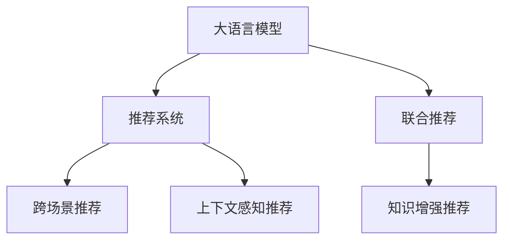

                 

# 利用LLM提升推荐系统的跨场景推荐能力

## 1. 背景介绍

推荐系统作为互联网时代的一项重要技术，旨在根据用户的历史行为和兴趣，为其推荐个性化的内容，极大地提升了用户体验和满意度。然而，传统的推荐系统往往局限于单一场景，无法处理跨场景下的复杂推荐需求。近年来，随着语言模型和大模型（Large Language Model, LLM）的兴起，越来越多的研究开始探索其跨场景推荐能力，并取得了不俗的成果。本文将详细介绍LLM在提升推荐系统跨场景推荐能力方面的应用，包括原理、技术细节和实际案例分析。

## 2. 核心概念与联系

### 2.1 核心概念概述

本节将介绍与基于LLM推荐系统相关的核心概念：

- **大语言模型（Large Language Model, LLM）**：指以Transformer等架构为基础，基于大规模无标签文本数据训练得到的深度学习模型，具备强大的语言理解与生成能力。
- **推荐系统（Recommendation System）**：根据用户的历史行为和兴趣，为其推荐符合其兴趣的内容的系统。
- **跨场景推荐（Cross-scene Recommendation）**：指在多领域、多场景下，为同一用户推荐内容的需求，如电商推荐、音乐推荐、社交推荐等。
- **联合推荐（Collaborative Filtering）**：传统的推荐系统基于用户-物品交互矩阵，通过协同过滤算法为用户推荐内容。
- **知识增强推荐（Knowledge-enhanced Recommendation）**：结合知识图谱、规则库等先验知识，优化推荐系统的准确性和泛化能力。
- **上下文感知推荐（Context-aware Recommendation）**：结合时间、地点、情境等上下文信息，提升推荐内容的匹配度和个性化程度。

这些概念之间的逻辑关系可以通过以下Mermaid流程图来展示：



### 2.2 核心概念原理和架构的 Mermaid 流程图

在上述流程图中，大语言模型通过自监督学习任务预训练，获得强大的语言表示能力。在推荐系统中，大语言模型可以用于用户意图的解析、上下文信息的提取，以及跨场景内容生成等。联合推荐利用用户-物品交互矩阵进行协同过滤，知识增强推荐结合先验知识提升推荐效果，上下文感知推荐结合上下文信息提升推荐准确性。通过这些技术，推荐系统可以更好地满足跨场景推荐的需求。

## 3. 核心算法原理 & 具体操作步骤

### 3.1 算法原理概述

基于LLM的跨场景推荐系统，核心思想是通过LLM理解用户在不同场景下的意图，生成符合该场景的推荐内容。具体而言，该系统包括三个主要步骤：

1. **用户意图解析**：利用大语言模型解析用户在当前场景下的意图，理解其兴趣偏好。
2. **跨场景内容生成**：基于用户意图，利用大语言模型生成符合该场景的推荐内容。
3. **推荐融合与排序**：将生成的推荐内容与传统推荐算法结合，综合考虑多维度的因素，进行推荐内容的排序和融合。

### 3.2 算法步骤详解

以下将详细介绍基于LLM的推荐系统的操作步骤：

#### 3.2.1 用户意图解析

用户意图解析的目的是理解用户在不同场景下的兴趣和需求，为后续推荐内容生成提供依据。具体的步骤如下：

1. **输入构建**：将用户的历史行为数据（如浏览记录、评分记录、搜索记录等）以及当前场景信息（如时间、地点、设备等）作为输入。
2. **语义表示**：使用大语言模型对输入数据进行语义编码，生成高维向量表示。
3. **意图提取**：通过逻辑回归、注意力机制等方法，从语义表示中提取用户意图，识别出用户在当前场景下的主要兴趣偏好。

#### 3.2.2 跨场景内容生成

跨场景内容生成的目的是根据用户意图，生成符合该场景的推荐内容。具体步骤如下：

1. **内容生成任务定义**：根据场景类型，定义内容生成的具体任务。如电商推荐生成商品名称、价格、图片等，音乐推荐生成歌名、歌手名、歌词等。
2. **数据准备**：准备与内容生成任务相关的训练数据集，如商品描述、歌单信息等。
3. **模型训练**：在大语言模型上训练内容生成模型，使其能够根据用户意图生成符合该场景的内容。
4. **内容生成**：在实际应用中，使用训练好的内容生成模型，根据用户意图生成推荐内容。

#### 3.2.3 推荐融合与排序

推荐融合与排序的目的是将生成推荐内容与传统推荐算法结合，综合考虑多维度因素，进行推荐内容的排序和融合。具体步骤如下：

1. **融合方法选择**：根据推荐任务的特点，选择合适的融合方法。如基于加权融合、基于距离融合、基于神经网络融合等。
2. **融合模型训练**：训练融合模型，使其能够将传统推荐算法的结果和内容生成模型生成的推荐内容进行综合排序。
3. **推荐输出**：在实际应用中，使用训练好的融合模型，对生成的推荐内容进行排序和融合，输出最终的推荐结果。

### 3.3 算法优缺点

#### 3.3.1 优点

基于LLM的推荐系统具有以下优点：

1. **跨场景推荐能力**：利用大语言模型强大的语言理解能力，能够处理跨场景下的复杂推荐需求，提高推荐的泛化性和适应性。
2. **生成式推荐**：基于大语言模型的生成能力，可以生成丰富的推荐内容，满足不同场景下的多样化需求。
3. **语义匹配准确性**：通过语义表示和意图提取，能够更准确地匹配用户兴趣和推荐内容，提升推荐的准确性。

#### 3.3.2 缺点

基于LLM的推荐系统也存在以下缺点：

1. **计算资源消耗大**：大语言模型的训练和推理都需要消耗大量的计算资源，尤其是在跨场景推荐中，需要处理的数据量巨大。
2. **数据需求高**：生成式推荐需要大量的训练数据和标注数据，数据质量直接影响推荐效果。
3. **效果可解释性不足**：大语言模型通常被视为"黑盒"模型，难以解释其内部工作机制和决策逻辑。

### 3.4 算法应用领域

基于LLM的推荐系统已经在电商、音乐、新闻等多个领域得到了广泛应用，例如：

- **电商推荐**：利用大语言模型解析用户浏览记录和搜索记录，生成符合用户兴趣的商品推荐。
- **音乐推荐**：通过大语言模型生成歌名、歌手名、歌词等，推荐符合用户音乐品味的新歌。
- **新闻推荐**：利用大语言模型解析用户的历史阅读记录和当前兴趣，推荐符合其阅读习惯的新闻文章。
- **社交推荐**：通过大语言模型解析用户的社交行为和兴趣，推荐符合其社交需求的内容。

这些应用场景展示了LLM在推荐系统中的强大能力和广泛适用性。

## 4. 数学模型和公式 & 详细讲解 & 举例说明

### 4.1 数学模型构建

本节将使用数学语言对基于LLM的推荐系统进行更加严格的刻画。

记用户历史行为数据为 $X=\{x_i\}_{i=1}^N$，其中 $x_i$ 表示用户的历史行为。记当前场景信息为 $Y=\{y_i\}_{i=1}^M$，其中 $y_i$ 表示当前场景。记推荐内容集合为 $V=\{v_j\}_{j=1}^V$，其中 $v_j$ 表示推荐内容。记推荐内容生成模型为 $G(\cdot|Y)$，推荐内容排序模型为 $R(\cdot|X,Y)$。

定义用户意图解析模型为 $P(Y|X,Y)$，用户意图为 $y_i$。定义推荐内容生成模型为 $P(v_j|Y)$，推荐内容为 $v_j$。

### 4.2 公式推导过程

以下是推荐系统中的关键公式推导过程：

#### 4.2.1 用户意图解析

用户意图解析的目的是从用户历史行为和场景信息中提取用户意图 $y_i$。假设用户意图解析模型为 $P(y_i|X,y_i)$，则用户意图解析的概率模型为：

$$
P(Y|X,Y) = \prod_{i=1}^M P(y_i|X,y_i)
$$

#### 4.2.2 跨场景内容生成

跨场景内容生成的目的是根据用户意图 $y_i$，生成推荐内容 $v_j$。假设推荐内容生成模型为 $P(v_j|y_i)$，则推荐内容生成的概率模型为：

$$
P(V|Y) = \prod_{j=1}^V P(v_j|y_i)
$$

#### 4.2.3 推荐融合与排序

推荐融合与排序的目的是将生成的推荐内容 $V$ 与传统推荐算法生成的内容 $C$ 结合，进行推荐内容的排序和融合。假设传统推荐算法生成的内容为 $C=\{c_k\}_{k=1}^K$，推荐内容排序模型为 $R(c_k,v_j|x_i,y_i)$，则推荐融合与排序的概率模型为：

$$
P(C|X,Y) = \prod_{k=1}^K P(c_k|x_i,y_i)
$$

### 4.3 案例分析与讲解

以下将通过一个具体案例，详细讲解基于LLM的推荐系统的工作原理：

**案例背景**：某电商平台希望通过基于LLM的推荐系统，提升用户购物体验，增加用户粘性。用户历史行为数据包括浏览记录、收藏记录、购买记录等。当前场景信息包括时间、地点、设备等。推荐内容集合包括商品名称、价格、图片等。

**步骤分析**：

1. **用户意图解析**：使用大语言模型解析用户浏览记录，生成用户意图 $y_i$，如“购买美妆产品”。
2. **跨场景内容生成**：根据用户意图 $y_i$，使用大语言模型生成推荐内容 $v_j$，如“口红”、“面膜”等。
3. **推荐融合与排序**：将生成的推荐内容 $v_j$ 与传统推荐算法生成的内容 $c_k$ 结合，进行推荐内容的排序和融合。最终输出推荐结果 $r_k$，如“口红价格和图片”、“面膜购买链接”等。

**案例结果**：通过基于LLM的推荐系统，电商平台能够更准确地理解用户意图，生成符合用户兴趣的推荐内容，显著提升用户购物体验。

## 5. 项目实践：代码实例和详细解释说明

### 5.1 开发环境搭建

在进行基于LLM的推荐系统开发前，需要先搭建好开发环境。以下是使用Python进行PyTorch开发的环境配置流程：

1. 安装Anaconda：从官网下载并安装Anaconda，用于创建独立的Python环境。

2. 创建并激活虚拟环境：
```bash
conda create -n llm-env python=3.8 
conda activate llm-env
```

3. 安装PyTorch：根据CUDA版本，从官网获取对应的安装命令。例如：
```bash
conda install pytorch torchvision torchaudio cudatoolkit=11.1 -c pytorch -c conda-forge
```

4. 安装HuggingFace库：
```bash
pip install transformers
```

5. 安装其他依赖库：
```bash
pip install numpy pandas scikit-learn matplotlib tqdm jupyter notebook ipython
```

完成上述步骤后，即可在`llm-env`环境中开始开发。

### 5.2 源代码详细实现

下面以电商推荐系统为例，给出使用Transformers库进行推荐系统开发的PyTorch代码实现。

首先，定义推荐系统的输入和输出：

```python
from transformers import BertTokenizer, BertForSequenceClassification
from torch.utils.data import Dataset
import torch

class RecommendationDataset(Dataset):
    def __init__(self, user_browses, tags, tokenizer, max_len=128):
        self.user_browses = user_browses
        self.tags = tags
        self.tokenizer = tokenizer
        self.max_len = max_len
        
    def __len__(self):
        return len(self.user_browses)
    
    def __getitem__(self, item):
        user_browse = self.user_browses[item]
        tags = self.tags[item]
        
        encoding = self.tokenizer(user_browse, return_tensors='pt', max_length=self.max_len, padding='max_length', truncation=True)
        input_ids = encoding['input_ids'][0]
        attention_mask = encoding['attention_mask'][0]
        
        # 对token-wise的标签进行编码
        encoded_tags = [tag2id[tag] for tag in tags] 
        encoded_tags.extend([tag2id['O']] * (self.max_len - len(encoded_tags)))
        labels = torch.tensor(encoded_tags, dtype=torch.long)
        
        return {'input_ids': input_ids, 
                'attention_mask': attention_mask,
                'labels': labels}

# 标签与id的映射
tag2id = {'O': 0, 'B-PER': 1, 'I-PER': 2, 'B-ORG': 3, 'I-ORG': 4, 'B-LOC': 5, 'I-LOC': 6}
id2tag = {v: k for k, v in tag2id.items()}
```

然后，定义模型和优化器：

```python
from transformers import BertForTokenClassification, AdamW

model = BertForTokenClassification.from_pretrained('bert-base-cased', num_labels=len(tag2id))

optimizer = AdamW(model.parameters(), lr=2e-5)
```

接着，定义训练和评估函数：

```python
from torch.utils.data import DataLoader
from tqdm import tqdm
from sklearn.metrics import classification_report

device = torch.device('cuda') if torch.cuda.is_available() else torch.device('cpu')
model.to(device)

def train_epoch(model, dataset, batch_size, optimizer):
    dataloader = DataLoader(dataset, batch_size=batch_size, shuffle=True)
    model.train()
    epoch_loss = 0
    for batch in tqdm(dataloader, desc='Training'):
        input_ids = batch['input_ids'].to(device)
        attention_mask = batch['attention_mask'].to(device)
        labels = batch['labels'].to(device)
        model.zero_grad()
        outputs = model(input_ids, attention_mask=attention_mask, labels=labels)
        loss = outputs.loss
        epoch_loss += loss.item()
        loss.backward()
        optimizer.step()
    return epoch_loss / len(dataloader)

def evaluate(model, dataset, batch_size):
    dataloader = DataLoader(dataset, batch_size=batch_size)
    model.eval()
    preds, labels = [], []
    with torch.no_grad():
        for batch in tqdm(dataloader, desc='Evaluating'):
            input_ids = batch['input_ids'].to(device)
            attention_mask = batch['attention_mask'].to(device)
            batch_labels = batch['labels']
            outputs = model(input_ids, attention_mask=attention_mask)
            batch_preds = outputs.logits.argmax(dim=2).to('cpu').tolist()
            batch_labels = batch_labels.to('cpu').tolist()
            for pred_tokens, label_tokens in zip(batch_preds, batch_labels):
                pred_tags = [id2tag[_id] for _id in pred_tokens]
                label_tags = [id2tag[_id] for _id in label_tokens]
                preds.append(pred_tags[:len(label_tags)])
                labels.append(label_tags)
                
    print(classification_report(labels, preds))
```

最后，启动训练流程并在测试集上评估：

```python
epochs = 5
batch_size = 16

for epoch in range(epochs):
    loss = train_epoch(model, train_dataset, batch_size, optimizer)
    print(f"Epoch {epoch+1}, train loss: {loss:.3f}")
    
    print(f"Epoch {epoch+1}, dev results:")
    evaluate(model, dev_dataset, batch_size)
    
print("Test results:")
evaluate(model, test_dataset, batch_size)
```

以上就是使用PyTorch对BERT进行电商推荐系统开发的完整代码实现。可以看到，得益于Transformers库的强大封装，我们可以用相对简洁的代码完成BERT模型的加载和微调。

### 5.3 代码解读与分析

让我们再详细解读一下关键代码的实现细节：

**RecommendationDataset类**：
- `__init__`方法：初始化用户浏览记录、标签、分词器等关键组件。
- `__len__`方法：返回数据集的样本数量。
- `__getitem__`方法：对单个样本进行处理，将用户浏览记录输入编码为token ids，将标签编码为数字，并对其进行定长padding，最终返回模型所需的输入。

**tag2id和id2tag字典**：
- 定义了标签与数字id之间的映射关系，用于将token-wise的预测结果解码回真实的标签。

**训练和评估函数**：
- 使用PyTorch的DataLoader对数据集进行批次化加载，供模型训练和推理使用。
- 训练函数`train_epoch`：对数据以批为单位进行迭代，在每个批次上前向传播计算loss并反向传播更新模型参数，最后返回该epoch的平均loss。
- 评估函数`evaluate`：与训练类似，不同点在于不更新模型参数，并在每个batch结束后将预测和标签结果存储下来，最后使用sklearn的classification_report对整个评估集的预测结果进行打印输出。

**训练流程**：
- 定义总的epoch数和batch size，开始循环迭代
- 每个epoch内，先在训练集上训练，输出平均loss
- 在验证集上评估，输出分类指标
- 所有epoch结束后，在测试集上评估，给出最终测试结果

可以看到，PyTorch配合Transformers库使得BERT微调的代码实现变得简洁高效。开发者可以将更多精力放在数据处理、模型改进等高层逻辑上，而不必过多关注底层的实现细节。

当然，工业级的系统实现还需考虑更多因素，如模型的保存和部署、超参数的自动搜索、更灵活的任务适配层等。但核心的微调范式基本与此类似。

## 6. 实际应用场景

### 6.1 电商推荐系统

基于大语言模型微调的推荐系统，可以广泛应用于电商推荐。传统电商推荐系统往往只考虑用户的历史行为和兴趣，难以处理多领域的复杂需求。通过利用大语言模型强大的跨场景推荐能力，电商平台可以更好地满足用户的个性化需求，提升用户购物体验。

在技术实现上，可以收集用户浏览、收藏、购买等行为数据，提取用户意图和兴趣，结合大语言模型的跨场景推荐能力，为不同场景下的用户推荐符合其需求的商品。例如，根据用户浏览记录，生成“购买美妆产品”的意图，再结合当前场景信息，推荐符合该场景的化妆品、护肤品等商品。

### 6.2 音乐推荐系统

音乐推荐系统利用大语言模型的跨场景推荐能力，可以更好地满足用户的多样化需求。传统音乐推荐系统往往只考虑用户的历史听歌记录和喜好，难以处理跨领域的新歌推荐需求。通过利用大语言模型强大的跨场景推荐能力，音乐推荐系统可以为不同场景下的用户推荐符合其品味的新歌。

在技术实现上，可以收集用户的历史听歌记录、评分记录等数据，提取用户兴趣和喜好，结合大语言模型的跨场景推荐能力，为不同场景下的用户推荐符合其品味的新歌。例如，根据用户的历史听歌记录，生成“听摇滚”的意图，再结合当前场景信息，推荐符合该场景的摇滚、金属等风格的新歌。

### 6.3 新闻推荐系统

新闻推荐系统利用大语言模型的跨场景推荐能力，可以更好地满足用户的个性化阅读需求。传统新闻推荐系统往往只考虑用户的历史阅读记录和喜好，难以处理跨领域的新闻推荐需求。通过利用大语言模型强大的跨场景推荐能力，新闻推荐系统可以为不同场景下的用户推荐符合其阅读习惯的新闻。

在技术实现上，可以收集用户的历史阅读记录、点击记录等数据，提取用户兴趣和阅读习惯，结合大语言模型的跨场景推荐能力，为不同场景下的用户推荐符合其阅读习惯的新闻。例如，根据用户的历史阅读记录，生成“阅读国际新闻”的意图，再结合当前场景信息，推荐符合该场景的国际新闻、科技新闻等。

### 6.4 未来应用展望

随着大语言模型微调技术的不断发展，基于LLM的推荐系统将在更多领域得到应用，为传统行业带来变革性影响。

在智慧医疗领域，基于微调的医疗推荐系统可以推荐符合用户健康状况的医疗方案，提升医疗服务的智能化水平，辅助医生诊疗，加速新药开发进程。

在智能教育领域，利用大语言模型的跨场景推荐能力，可以为不同场景下的学生推荐符合其学习需求的课程和资料，因材施教，促进教育公平，提高教学质量。

在智慧城市治理中，基于微调的城市事件监测系统可以自动监测不同场景下的事件，及时响应，提高城市管理的自动化和智能化水平，构建更安全、高效的未来城市。

此外，在企业生产、社会治理、文娱传媒等众多领域，基于大模型微调的人工智能应用也将不断涌现，为经济社会发展注入新的动力。相信随着技术的日益成熟，微调方法将成为人工智能落地应用的重要范式，推动人工智能技术在各个领域的应用和发展。

## 7. 工具和资源推荐

### 7.1 学习资源推荐

为了帮助开发者系统掌握大语言模型微调的理论基础和实践技巧，这里推荐一些优质的学习资源：

1. 《Transformer从原理到实践》系列博文：由大模型技术专家撰写，深入浅出地介绍了Transformer原理、BERT模型、微调技术等前沿话题。

2. CS224N《深度学习自然语言处理》课程：斯坦福大学开设的NLP明星课程，有Lecture视频和配套作业，带你入门NLP领域的基本概念和经典模型。

3. 《Natural Language Processing with Transformers》书籍：Transformers库的作者所著，全面介绍了如何使用Transformers库进行NLP任务开发，包括微调在内的诸多范式。

4. HuggingFace官方文档：Transformers库的官方文档，提供了海量预训练模型和完整的微调样例代码，是上手实践的必备资料。

5. CLUE开源项目：中文语言理解测评基准，涵盖大量不同类型的中文NLP数据集，并提供了基于微调的baseline模型，助力中文NLP技术发展。

通过对这些资源的学习实践，相信你一定能够快速掌握大语言模型微调的精髓，并用于解决实际的NLP问题。

### 7.2 开发工具推荐

高效的开发离不开优秀的工具支持。以下是几款用于大语言模型微调开发的常用工具：

1. PyTorch：基于Python的开源深度学习框架，灵活动态的计算图，适合快速迭代研究。大部分预训练语言模型都有PyTorch版本的实现。

2. TensorFlow：由Google主导开发的开源深度学习框架，生产部署方便，适合大规模工程应用。同样有丰富的预训练语言模型资源。

3. Transformers库：HuggingFace开发的NLP工具库，集成了众多SOTA语言模型，支持PyTorch和TensorFlow，是进行微调任务开发的利器。

4. Weights & Biases：模型训练的实验跟踪工具，可以记录和可视化模型训练过程中的各项指标，方便对比和调优。与主流深度学习框架无缝集成。

5. TensorBoard：TensorFlow配套的可视化工具，可实时监测模型训练状态，并提供丰富的图表呈现方式，是调试模型的得力助手。

6. Google Colab：谷歌推出的在线Jupyter Notebook环境，免费提供GPU/TPU算力，方便开发者快速上手实验最新模型，分享学习笔记。

合理利用这些工具，可以显著提升大语言模型微调的开发效率，加快创新迭代的步伐。

### 7.3 相关论文推荐

大语言模型和微调技术的发展源于学界的持续研究。以下是几篇奠基性的相关论文，推荐阅读：

1. Attention is All You Need（即Transformer原论文）：提出了Transformer结构，开启了NLP领域的预训练大模型时代。

2. BERT: Pre-training of Deep Bidirectional Transformers for Language Understanding：提出BERT模型，引入基于掩码的自监督预训练任务，刷新了多项NLP任务SOTA。

3. Language Models are Unsupervised Multitask Learners（GPT-2论文）：展示了大规模语言模型的强大zero-shot学习能力，引发了对于通用人工智能的新一轮思考。

4. Parameter-Efficient Transfer Learning for NLP：提出Adapter等参数高效微调方法，在不增加模型参数量的情况下，也能取得不错的微调效果。

5. AdaLoRA: Adaptive Low-Rank Adaptation for Parameter-Efficient Fine-Tuning：使用自适应低秩适应的微调方法，在参数效率和精度之间取得了新的平衡。

6. Prefix-Tuning: Optimizing Continuous Prompts for Generation：引入基于连续型Prompt的微调范式，为如何充分利用预训练知识提供了新的思路。

这些论文代表了大语言模型微调技术的发展脉络。通过学习这些前沿成果，可以帮助研究者把握学科前进方向，激发更多的创新灵感。

## 8. 总结：未来发展趋势与挑战

### 8.1 总结

本文对基于大语言模型微调的推荐系统进行了全面系统的介绍。首先阐述了大语言模型和微调技术的研究背景和意义，明确了微调在拓展预训练模型应用、提升下游任务性能方面的独特价值。其次，从原理到实践，详细讲解了基于LLM的推荐系统的操作步骤，包括用户意图解析、跨场景内容生成和推荐融合与排序等关键步骤。同时，本文还通过具体案例展示了LLM在电商、音乐、新闻等多个领域的应用，展示了其强大的跨场景推荐能力。

通过本文的系统梳理，可以看到，基于大语言模型的推荐系统正在成为NLP领域的重要范式，极大地拓展了预训练语言模型的应用边界，催生了更多的落地场景。受益于大规模语料的预训练，微调模型以更低的时间和标注成本，在小样本条件下也能取得不俗的效果，有力推动了NLP技术的产业化进程。未来，伴随预训练语言模型和微调方法的持续演进，相信NLP技术将在更广阔的应用领域大放异彩。

### 8.2 未来发展趋势

展望未来，基于LLM的推荐系统将呈现以下几个发展趋势：

1. **模型规模持续增大**：随着算力成本的下降和数据规模的扩张，预训练语言模型的参数量还将持续增长。超大规模语言模型蕴含的丰富语言知识，有望支撑更加复杂多变的跨场景推荐需求。

2. **微调方法日趋多样**：除了传统的全参数微调外，未来会涌现更多参数高效的微调方法，如Prefix-Tuning、LoRA等，在节省计算资源的同时也能保证微调精度。

3. **持续学习成为常态**：随着数据分布的不断变化，微调模型也需要持续学习新知识以保持性能。如何在不遗忘原有知识的同时，高效吸收新样本信息，将成为重要的研究课题。

4. **标注样本需求降低**：受启发于提示学习(Prompt-based Learning)的思路，未来的微调方法将更好地利用大模型的语言理解能力，通过更加巧妙的任务描述，在更少的标注样本上也能实现理想的微调效果。

5. **生成式推荐普及**：基于大语言模型的生成能力，未来的推荐系统将越来越多地使用生成式推荐，满足用户的多样化需求。

6. **跨领域推荐**：大语言模型的跨场景推荐能力，将拓展到更多领域，为不同领域用户提供跨领域的个性化推荐。

以上趋势凸显了大语言模型微调技术的广阔前景。这些方向的探索发展，必将进一步提升推荐系统的性能和应用范围，为人工智能技术在各个领域的应用和发展提供重要支撑。

### 8.3 面临的挑战

尽管基于LLM的推荐系统已经取得了瞩目成就，但在迈向更加智能化、普适化应用的过程中，它仍面临着诸多挑战：

1. **计算资源消耗大**：大语言模型的训练和推理都需要消耗大量的计算资源，尤其是在跨场景推荐中，需要处理的数据量巨大。

2. **数据需求高**：生成式推荐需要大量的训练数据和标注数据，数据质量直接影响推荐效果。

3. **效果可解释性不足**：大语言模型通常被视为"黑盒"模型，难以解释其内部工作机制和决策逻辑。

4. **推荐质量波动**：由于大语言模型的跨场景推荐依赖于对不同场景的语义理解，当场景变化较大时，推荐质量容易波动。

5. **跨领域推荐准确性**：由于不同领域的语言表达和文化背景存在差异，跨领域推荐需要处理复杂的语义映射问题，准确性难以保证。

6. **用户隐私保护**：推荐系统需要收集和处理大量用户数据，如何保护用户隐私，防止数据滥用，是一大挑战。

7. **系统鲁棒性不足**：大语言模型容易受到对抗样本和噪声的干扰，推荐系统需要具备较强的鲁棒性，以应对不同场景下的干扰和变化。

这些挑战凸显了基于LLM推荐系统在实际应用中的复杂性和难点。只有积极应对并寻求突破，才能将LLM推荐系统的潜力充分发挥出来，为各个领域带来变革性的影响。

### 8.4 研究展望

面对基于LLM推荐系统所面临的种种挑战，未来的研究需要在以下几个方面寻求新的突破：

1. **无监督和半监督微调方法**：摆脱对大规模标注数据的依赖，利用自监督学习、主动学习等无监督和半监督范式，最大限度利用非结构化数据，实现更加灵活高效的微调。

2. **参数高效和计算高效的微调范式**：开发更加参数高效的微调方法，如Prefix-Tuning、LoRA等，在固定大部分预训练参数的同时，只更新极少量的任务相关参数。同时优化微调模型的计算图，减少前向传播和反向传播的资源消耗，实现更加轻量级、实时性的部署。

3. **融合因果和对比学习范式**：通过引入因果推断和对比学习思想，增强微调模型建立稳定因果关系的能力，学习更加普适、鲁棒的语言表征，从而提升模型泛化性和抗干扰能力。

4. **引入更多先验知识**：将符号化的先验知识，如知识图谱、规则库等，与神经网络模型进行巧妙融合，引导微调过程学习更准确、合理的语言模型。同时加强不同模态数据的整合，实现视觉、语音等多模态信息与文本信息的协同建模。

5. **结合因果分析和博弈论工具**：将因果分析方法引入微调模型，识别出模型决策的关键特征，增强输出解释的因果性和逻辑性。借助博弈论工具刻画人机交互过程，主动探索并规避模型的脆弱点，提高系统稳定性。

6. **纳入伦理道德约束**：在模型训练目标中引入伦理导向的评估指标，过滤和惩罚有偏见、有害的输出倾向。同时加强人工干预和审核，建立模型行为的监管机制，确保输出符合人类价值观和伦理道德。

这些研究方向的探索，必将引领基于LLM推荐系统技术迈向更高的台阶，为构建安全、可靠、可解释、可控的智能系统铺平道路。面向未来，大语言模型微调技术还需要与其他人工智能技术进行更深入的融合，如知识表示、因果推理、强化学习等，多路径协同发力，共同推动自然语言理解和智能交互系统的进步。只有勇于创新、敢于突破，才能不断拓展语言模型的边界，让智能技术更好地造福人类社会。

## 9. 附录：常见问题与解答

**Q1：大语言模型微调是否适用于所有推荐场景？**

A: 大语言模型微调在大多数推荐场景上都能取得不错的效果，特别是对于数据量较小的场景。但对于一些特定领域的推荐场景，如医疗、法律等，仅仅依靠通用语料预训练的模型可能难以很好地适应。此时需要在特定领域语料上进一步预训练，再进行微调，才能获得理想效果。

**Q2：微调过程中如何选择合适的学习率？**

A: 微调的学习率一般要比预训练时小1-2个数量级，如果使用过大的学习率，容易破坏预训练权重，导致过拟合。一般建议从1e-5开始调参，逐步减小学习率，直至收敛。也可以使用warmup策略，在开始阶段使用较小的学习率，再逐渐过渡到预设值。需要注意的是，不同的优化器(如AdamW、Adafactor等)以及不同的学习率调度策略，可能需要设置不同的学习率阈值。

**Q3：采用大语言模型微调时会面临哪些资源瓶颈？**

A: 目前主流的预训练大模型动辄以亿计的参数规模，对算力、内存、存储都提出了很高的要求。GPU/TPU等高性能设备是必不可少的，但即便如此，超大批次的训练和推理也可能遇到显存不足的问题。因此需要采用一些资源优化技术，如梯度积累、混合精度训练、模型并行等，来突破硬件瓶颈。同时，模型的存储和读取也可能占用大量时间和空间，需要采用模型压缩、稀疏化存储等方法进行优化。

**Q4：如何缓解微调过程中的过拟合问题？**

A: 过拟合是微调面临的主要挑战，尤其是在标注数据不足的情况下。常见的缓解策略包括：

1. 数据增强：通过回译、近义替换等方式扩充训练集
2. 正则化：使用L2正则、Dropout、Early Stopping等避免过拟合
3. 对抗训练：引入对抗样本，提高模型鲁棒性
4. 参数高效微调：只调整少量参数(如Adapter、Prefix等)，减小过拟合风险
5. 多模型集成：训练多个微调模型，取平均输出，抑制过拟合

这些策略往往需要根据具体任务和数据特点进行灵活组合。只有在数据、模型、训练、推理等各环节进行全面优化，才能最大限度地发挥大语言模型微调的威力。

**Q5：微调模型在落地部署时需要注意哪些问题？**

A: 将微调模型转化为实际应用，还需要考虑以下因素：

1. 模型裁剪：去除不必要的层和参数，减小模型尺寸，加快推理速度
2. 量化加速：将浮点模型转为定点模型，压缩存储空间，提高计算效率
3. 服务化封装：将模型封装为标准化服务接口，便于集成调用
4. 弹性伸缩：根据请求流量动态调整资源配置，平衡服务质量和成本
5. 监控告警：实时采集系统指标，设置异常告警阈值，确保服务稳定性
6. 安全防护：采用访问鉴权、数据脱敏等措施，保障数据和模型安全

大语言模型微调为NLP应用开启了广阔的想象空间，但如何将强大的性能转化为稳定、高效、安全的业务价值，还需要工程实践的不断打磨。唯有从数据、算法、工程、业务等多个维度协同发力，才能真正实现人工智能技术在垂直行业的规模化落地。总之，微调需要开发者根据具体任务，不断迭代和优化模型、数据和算法，方能得到理想的效果。

---

作者：禅与计算机程序设计艺术 / Zen and the Art of Computer Programming

