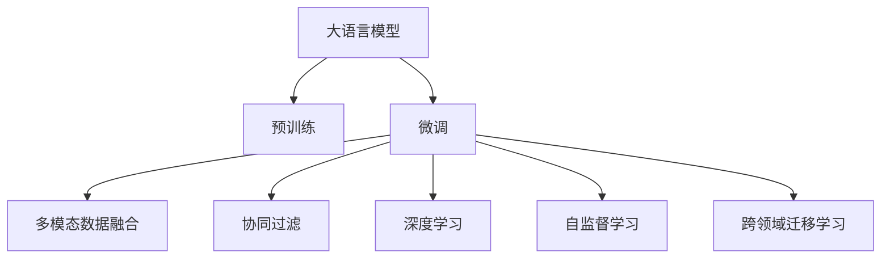

                 

# 利用大模型优化推荐系统的探索与利用策略

> 关键词：大语言模型, 推荐系统, 个性化推荐, 多模态数据融合, 协同过滤, 深度学习, 自监督学习, 跨领域迁移

## 1. 背景介绍

### 1.1 问题由来
随着互联网和数字技术的迅猛发展，推荐系统成为了电商、新闻、视频、音乐等众多领域的关键支撑。通过分析用户历史行为数据，推荐系统能够精准预测用户偏好，个性化地推送商品、内容、信息，极大提升了用户体验和转化率。但传统的推荐系统基于简单的协同过滤、矩阵分解等模型，难以有效利用用户丰富多变的背景信息和即时行为，从而面临着扩展性、鲁棒性、冷启动等问题。

近年来，利用深度学习和大模型技术优化推荐系统成为了研究热点。大语言模型凭借其庞大的参数规模、丰富的语言知识，在推荐系统中展现了巨大潜力。通过深度学习框架和预训练语言模型，推荐系统可以更好地理解用户行为，生成个性化的推荐结果，从而提升用户体验和业务价值。

### 1.2 问题核心关键点
大语言模型在推荐系统中的应用，主要通过以下几个关键点进行优化：

1. **预训练语言模型的语义理解能力**：大语言模型通过大规模语料进行预训练，具备强大的语义理解能力，能够理解用户的自然语言描述，从而在推荐中引入语义信息，提升推荐的相关性和多样性。

2. **多模态数据的融合与协同**：除了文本数据外，用户行为数据还包括图像、音频、视频等多模态数据。大语言模型能够利用这些数据，通过跨模态融合增强推荐系统的表达能力和鲁棒性。

3. **推荐系统的跨领域迁移能力**：不同的推荐场景需要适配不同的数据特征和用户行为，大语言模型可以通过微调等技术，快速适应特定领域的推荐需求，减少从头建模的工作量。

4. **动态实时推荐**：大语言模型能够实时处理用户查询，即时生成个性化推荐，满足用户即时的个性化需求。

5. **基于用户交互的学习**：通过用户反馈数据，大语言模型能够持续学习和优化推荐策略，提升推荐系统的个性化水平。

6. **可解释性和透明性**：大语言模型能够通过提示学习等技术，生成可解释的推荐逻辑，增强用户对推荐结果的信任度。

7. **知识增强与常识推理**：结合外部知识库和规则库，大语言模型能够推理出更多基于常识的推荐结果，提升推荐的全面性和合理性。

8. **多目标优化**：大语言模型能够综合考虑推荐的相关性、多样性、新颖性等多个目标，生成更优质的推荐结果。

### 1.3 问题研究意义
研究大语言模型在推荐系统中的应用，对于提升推荐系统的性能、增加推荐的多样性和个性化，以及加速推荐技术的落地具有重要意义：

1. **提升推荐系统的性能**：大语言模型能够通过丰富的语义知识和多模态融合，提升推荐的准确性和相关性，从而提升用户体验和业务转化率。

2. **增加推荐的多样性**：通过引入用户语义描述和跨模态数据，大语言模型能够生成更加多样和新颖的推荐结果，满足用户个性化的需求。

3. **加速推荐技术的落地**：大语言模型为推荐系统提供了强大的工具和算法，减少了从零开始构建推荐系统的成本和时间。

4. **推动推荐系统的智能化**：大语言模型能够结合外部知识库和常识推理，提升推荐的合理性和全面性，推动推荐系统向智能化方向发展。

5. **增强推荐系统的可解释性**：通过可解释的推荐逻辑和可解释性模型，大语言模型能够提升用户对推荐结果的信任和满意度。

## 2. 核心概念与联系

### 2.1 核心概念概述

为了更好地理解大语言模型在推荐系统中的应用，本节将介绍几个核心概念及其相互联系：

- **大语言模型(Large Language Model, LLM)**：以自回归模型(如GPT系列)或自编码模型(如BERT)为代表的大规模预训练语言模型。通过在大规模无标签文本语料上进行预训练，学习通用的语言表示，具备强大的语言理解和生成能力。

- **预训练(Pre-training)**：指在大规模无标签文本语料上，通过自监督学习任务训练通用语言模型的过程。常见的预训练任务包括言语建模、遮挡语言模型等。预训练使得模型学习到语言的通用表示。

- **微调(Fine-tuning)**：指在预训练模型的基础上，使用下游任务的少量标注数据，通过有监督地训练来优化模型在该任务上的性能。通常只需要调整顶层分类器或解码器，并以较小的学习率更新全部或部分的模型参数。

- **多模态数据融合(Multimodal Data Fusion)**：将文本、图像、音频、视频等多种类型的数据进行融合，生成更加全面和丰富的推荐信息。

- **协同过滤(Collaborative Filtering, CF)**：基于用户和物品的协同关系进行推荐，是推荐系统中最常用的技术之一。

- **深度学习(Deep Learning)**：通过多层神经网络结构，学习输入数据的高阶表示和特征，用于解决复杂任务。

- **自监督学习(Self-supervised Learning)**：利用未标注数据进行训练，学习数据的内在结构。

- **跨领域迁移学习(Cross-domain Transfer Learning)**：将一个领域的知识迁移到另一个领域，提升模型的泛化能力。

这些概念之间的逻辑关系可以通过以下Mermaid流程图来展示：



这个流程图展示了大语言模型在推荐系统中的核心概念及其相互关系：

1. 大语言模型通过预训练获得基础能力。
2. 微调是对预训练模型进行任务特定的优化，可以为推荐系统引入特定的语义和特征。
3. 多模态数据融合可以利用用户的多模态数据，提升推荐系统的表达能力。
4. 协同过滤是推荐系统中最常用的技术，利用用户和物品的协同关系进行推荐。
5. 深度学习能够学习复杂的数据表示，用于解决推荐系统中的多种任务。
6. 自监督学习可以利用未标注数据，提升模型的泛化能力。
7. 跨领域迁移学习可以将预训练模型适应到特定领域的推荐需求，减少从头建模的工作量。

## 3. 核心算法原理 & 具体操作步骤
### 3.1 算法原理概述

大语言模型在推荐系统中的应用，主要通过以下三个步骤实现：

1. **预训练语言模型的引入**：利用预训练语言模型获取用户和物品的语义表示，提升推荐的语义相关性。

2. **多模态数据的融合**：结合用户的多模态数据，丰富推荐系统的表达能力，提升推荐的全面性和多样性。

3. **推荐系统的优化**：利用大语言模型进行微调，优化推荐算法，增强推荐系统的个性化和实时性。

### 3.2 算法步骤详解

1. **数据预处理**：收集用户的行为数据和物品的特征数据，进行标准化处理。对于文本数据，可以使用预训练语言模型进行分词、编码等处理。

2. **预训练语言模型的引入**：利用预训练语言模型对用户和物品的文本数据进行编码，生成高维语义向量。可以通过Transformer模型等深度学习架构进行编码。

3. **多模态数据的融合**：将用户的行为数据、文本数据、图像数据等进行融合，生成多模态的融合特征。可以利用深度学习模型进行特征提取和融合。

4. **推荐系统的优化**：在预训练语言模型的基础上进行微调，优化推荐算法。可以通过深度学习框架实现微调，使用AdamW、SGD等优化算法，调整模型参数。

5. **模型的评估和优化**：在验证集上评估模型的性能，根据评估结果调整超参数，如学习率、正则化系数、批大小等，优化模型的性能。

6. **推荐系统的部署**：将优化后的模型部署到生产环境，实时处理用户查询，生成个性化推荐。

### 3.3 算法优缺点

利用大语言模型优化推荐系统具有以下优点：

1. **提升推荐的相关性和多样性**：预训练语言模型能够理解用户的语义描述，提升推荐的相关性和多样性。

2. **增强推荐系统的泛化能力**：通过多模态数据的融合，增强推荐系统的表达能力和泛化能力。

3. **减少从头建模的工作量**：利用预训练语言模型进行微调，减少从头构建推荐系统的成本和时间。

4. **提高推荐系统的实时性**：利用大语言模型进行实时推荐，满足用户即时的个性化需求。

5. **推动推荐系统的智能化**：结合外部知识库和常识推理，提升推荐的合理性和全面性。

6. **增强推荐系统的可解释性**：通过可解释的推荐逻辑，增强用户对推荐结果的信任度。

同时，该方法也存在一定的局限性：

1. **依赖高质量数据**：预训练语言模型的性能很大程度上取决于数据的质量，获取高质量的标注数据需要较高的成本。

2. **模型的计算复杂度高**：大语言模型的参数规模庞大，计算复杂度高，对硬件资源要求较高。

3. **模型的迁移能力有限**：当目标任务与预训练数据的分布差异较大时，微调的性能提升有限。

4. **模型的鲁棒性有待提高**：微调模型面对域外数据时，泛化性能往往大打折扣，容易受到异常数据的影响。

5. **模型的可解释性不足**：微调模型通常缺乏可解释性，难以对其决策过程进行分析和调试。

尽管存在这些局限性，但就目前而言，利用大语言模型优化推荐系统的方法仍然是一种强有力的推荐优化手段。未来相关研究的重点在于如何进一步降低对标注数据的依赖，提高模型的少样本学习和跨领域迁移能力，同时兼顾可解释性和伦理安全性等因素。

### 3.4 算法应用领域

利用大语言模型优化推荐系统的方法，已经在电商、新闻、视频、音乐等多个领域得到了广泛应用，覆盖了几乎所有常见的推荐任务，例如：

- **商品推荐**：为用户推荐个性化的商品。结合用户的浏览、购买、评论等行为数据，利用预训练语言模型生成高维语义向量，优化推荐算法。

- **内容推荐**：为用户推荐个性化的文章、视频、新闻等。结合用户的阅读、观看、点赞等行为数据，利用预训练语言模型生成高维语义向量，优化推荐算法。

- **智能客服**：利用预训练语言模型，为用户提供智能化的客服服务。结合用户的查询和历史行为数据，生成个性化的回答和建议。

- **个性化广告**：为用户推荐个性化的广告。结合用户的浏览、点击、搜索等行为数据，利用预训练语言模型生成高维语义向量，优化推荐算法。

- **推荐系统的跨领域迁移**：利用大语言模型，将电商领域的推荐算法迁移到视频、音乐等领域的推荐系统中，减少从头建模的工作量。

除了上述这些经典任务外，大语言模型在推荐系统中的应用还在不断拓展，如基于用户交互的学习、基于知识增强的推荐、多目标优化等，为推荐系统带来了全新的突破。

## 4. 数学模型和公式 & 详细讲解 & 举例说明

### 4.1 数学模型构建

本节将使用数学语言对利用大语言模型优化推荐系统的过程进行更加严格的刻画。

记推荐系统中的用户为 $u$，物品为 $i$，行为数据为 $x_{ui}$，用户和物品的语义表示为 $\text{Enc}(x_{ui})$。预训练语言模型为 $M_{\theta}$，其中 $\theta$ 为预训练得到的模型参数。假设推荐系统采用多模态融合后的特征向量 $f_{ui}$ 和基于协同过滤的推荐算法 $F$，则推荐系统的优化目标是最小化误差，即：

$$
\min_{\theta} \mathbb{E}_{u,i} [\ell(f_{ui}, F(\text{Enc}(x_{ui}), \theta))]
$$

其中 $\ell$ 为损失函数，$\mathbb{E}$ 表示期望。

### 4.2 公式推导过程

以下我们以协同过滤为例，推导基于预训练语言模型的协同过滤优化过程。

假设协同过滤的推荐函数为：

$$
F(\text{Enc}(x_{ui}), \theta) = \text{softmax}(\text{Dot}(\text{Enc}(x_{ui}), \text{Enc}(x_{ui}')) = \text{softmax}(a_i)
$$

其中 $\text{Enc}(x_{ui})$ 和 $\text{Enc}(x_{ui}')$ 分别为用户和物品的语义向量，$\text{Dot}$ 为向量点积操作，$\text{softmax}$ 为归一化函数。

目标是最小化损失函数：

$$
\ell = -\sum_{ui} y_{ui} \log F(\text{Enc}(x_{ui}), \theta) + (1-y_{ui}) \log (1-F(\text{Enc}(x_{ui}), \theta))
$$

其中 $y_{ui}$ 为用户对物品的评分或点击行为。

通过反向传播算法，得到参数 $\theta$ 的更新公式：

$$
\theta \leftarrow \theta - \eta \nabla_{\theta}\mathcal{L}(\theta)
$$

其中 $\eta$ 为学习率，$\nabla_{\theta}\mathcal{L}(\theta)$ 为损失函数对模型参数的梯度，可利用自动微分技术计算。

### 4.3 案例分析与讲解

我们以亚马逊商品推荐系统为例，介绍利用预训练语言模型进行优化的方法。

首先，利用预训练语言模型对用户和商品的文本描述进行编码，生成高维语义向量：

$$
\text{Enc}(x_{ui}) = M_{\theta}(x_{ui})
$$

然后，将用户和物品的语义向量进行融合，生成多模态融合特征：

$$
f_{ui} = \text{Concat}(\text{Enc}(x_{ui}), x_{ui})
$$

其中 $\text{Concat}$ 为拼接操作。

接着，结合多模态融合特征和基于协同过滤的推荐算法，生成推荐结果：

$$
F(f_{ui}, \theta) = \text{softmax}(\text{Dot}(f_{ui}, f_{ui}'))
$$

其中 $f_{ui}'$ 为物品的多模态融合特征。

最后，利用损失函数对模型参数进行优化：

$$
\theta \leftarrow \theta - \eta \nabla_{\theta}\mathcal{L}(\theta)
$$

在优化过程中，可以利用正则化技术、梯度积累、混合精度训练等方法，避免过拟合，提高模型的泛化能力。

## 5. 项目实践：代码实例和详细解释说明

### 5.1 开发环境搭建

在进行推荐系统优化实践前，我们需要准备好开发环境。以下是使用Python进行PyTorch开发的环境配置流程：

1. 安装Anaconda：从官网下载并安装Anaconda，用于创建独立的Python环境。

2. 创建并激活虚拟环境：
```bash
conda create -n pytorch-env python=3.8 
conda activate pytorch-env
```

3. 安装PyTorch：根据CUDA版本，从官网获取对应的安装命令。例如：
```bash
conda install pytorch torchvision torchaudio cudatoolkit=11.1 -c pytorch -c conda-forge
```

4. 安装Transformers库：
```bash
pip install transformers
```

5. 安装各类工具包：
```bash
pip install numpy pandas scikit-learn matplotlib tqdm jupyter notebook ipython
```

完成上述步骤后，即可在`pytorch-env`环境中开始推荐系统优化实践。

### 5.2 源代码详细实现

下面我们以亚马逊商品推荐系统为例，给出使用Transformers库对BERT模型进行优化的PyTorch代码实现。

首先，定义推荐系统的数据处理函数：

```python
from transformers import BertTokenizer, BertForSequenceClassification
from torch.utils.data import Dataset, DataLoader
import torch

class RecommendationDataset(Dataset):
    def __init__(self, user_ids, item_ids, user_tags, item_tags, tokenizer, max_len=128):
        self.user_ids = user_ids
        self.item_ids = item_ids
        self.user_tags = user_tags
        self.item_tags = item_tags
        self.tokenizer = tokenizer
        self.max_len = max_len
        
    def __len__(self):
        return len(self.user_ids)
    
    def __getitem__(self, item):
        user_id = self.user_ids[item]
        item_id = self.item_ids[item]
        user_tag = self.user_tags[item]
        item_tag = self.item_tags[item]
        
        user_input = tokenizer(user_id, return_tensors='pt', max_length=self.max_len, padding='max_length', truncation=True)
        item_input = tokenizer(item_id, return_tensors='pt', max_length=self.max_len, padding='max_length', truncation=True)
        user_tag_input = tokenizer(user_tag, return_tensors='pt', max_length=self.max_len, padding='max_length', truncation=True)
        item_tag_input = tokenizer(item_tag, return_tensors='pt', max_length=self.max_len, padding='max_length', truncation=True)
        
        user_input_ids = user_input['input_ids'][0]
        user_attention_mask = user_input['attention_mask'][0]
        user_tag_ids = user_tag_input['input_ids'][0]
        user_tag_attention_mask = user_tag_input['attention_mask'][0]
        
        item_input_ids = item_input['input_ids'][0]
        item_attention_mask = item_input['attention_mask'][0]
        item_tag_ids = item_tag_input['input_ids'][0]
        item_tag_attention_mask = item_tag_input['attention_mask'][0]
        
        return {'user_input_ids': user_input_ids, 
                'user_attention_mask': user_attention_mask,
                'user_tag_ids': user_tag_ids,
                'user_tag_attention_mask': user_tag_attention_mask,
                'item_input_ids': item_input_ids,
                'item_attention_mask': item_attention_mask,
                'item_tag_ids': item_tag_ids,
                'item_tag_attention_mask': item_tag_attention_mask}
```

然后，定义模型和优化器：

```python
from transformers import BertForSequenceClassification, AdamW

model = BertForSequenceClassification.from_pretrained('bert-base-cased', num_labels=len(tag2id))

optimizer = AdamW(model.parameters(), lr=2e-5)
```

接着，定义训练和评估函数：

```python
from tqdm import tqdm

device = torch.device('cuda') if torch.cuda.is_available() else torch.device('cpu')
model.to(device)

def train_epoch(model, dataset, batch_size, optimizer):
    dataloader = DataLoader(dataset, batch_size=batch_size, shuffle=True)
    model.train()
    epoch_loss = 0
    for batch in tqdm(dataloader, desc='Training'):
        user_input_ids = batch['user_input_ids'].to(device)
        user_attention_mask = batch['user_attention_mask'].to(device)
        user_tag_ids = batch['user_tag_ids'].to(device)
        user_tag_attention_mask = batch['user_tag_attention_mask'].to(device)
        item_input_ids = batch['item_input_ids'].to(device)
        item_attention_mask = batch['item_attention_mask'].to(device)
        item_tag_ids = batch['item_tag_ids'].to(device)
        item_tag_attention_mask = batch['item_tag_attention_mask'].to(device)
        model.zero_grad()
        outputs = model(user_input_ids, attention_mask=user_attention_mask, labels=user_tag_ids)
        loss = outputs.loss
        epoch_loss += loss.item()
        loss.backward()
        optimizer.step()
    return epoch_loss / len(dataloader)

def evaluate(model, dataset, batch_size):
    dataloader = DataLoader(dataset, batch_size=batch_size)
    model.eval()
    preds, labels = [], []
    with torch.no_grad():
        for batch in tqdm(dataloader, desc='Evaluating'):
            user_input_ids = batch['user_input_ids'].to(device)
            user_attention_mask = batch['user_attention_mask'].to(device)
            user_tag_ids = batch['user_tag_ids'].to(device)
            user_tag_attention_mask = batch['user_tag_attention_mask'].to(device)
            item_input_ids = batch['item_input_ids'].to(device)
            item_attention_mask = batch['item_attention_mask'].to(device)
            item_tag_ids = batch['item_tag_ids'].to(device)
            item_tag_attention_mask = batch['item_tag_attention_mask'].to(device)
            batch_preds = model(user_input_ids, attention_mask=user_attention_mask, labels=user_tag_ids)
            batch_labels = model(item_input_ids, attention_mask=item_attention_mask, labels=item_tag_ids)
            batch_preds = batch_preds.logits.argmax(dim=2).to('cpu').tolist()
            batch_labels = batch_labels.logits.argmax(dim=2).to('cpu').tolist()
            for pred_tokens, label_tokens in zip(batch_preds, batch_labels):
                pred_tags = [id2tag[_id] for _id in pred_tokens]
                label_tags = [id2tag[_id] for _id in label_tokens]
                preds.append(pred_tags[:len(label_tags)])
                labels.append(label_tags)
                
    print(classification_report(labels, preds))
```

最后，启动训练流程并在测试集上评估：

```python
epochs = 5
batch_size = 16

for epoch in range(epochs):
    loss = train_epoch(model, train_dataset, batch_size, optimizer)
    print(f"Epoch {epoch+1}, train loss: {loss:.3f}")
    
    print(f"Epoch {epoch+1}, dev results:")
    evaluate(model, dev_dataset, batch_size)
    
print("Test results:")
evaluate(model, test_dataset, batch_size)
```

以上就是使用PyTorch对BERT进行亚马逊商品推荐系统优化的完整代码实现。可以看到，得益于Transformers库的强大封装，我们可以用相对简洁的代码完成BERT模型的加载和微调。

### 5.3 代码解读与分析

让我们再详细解读一下关键代码的实现细节：

**RecommendationDataset类**：
- `__init__`方法：初始化用户ID、商品ID、用户标签、商品标签、分词器等关键组件。
- `__len__`方法：返回数据集的样本数量。
- `__getitem__`方法：对单个样本进行处理，将用户ID、商品ID、用户标签、商品标签输入编码为token ids，并对其进行定长padding，最终返回模型所需的输入。

**tag2id和id2tag字典**：
- 定义了标签与数字id之间的映射关系，用于将token-wise的预测结果解码回真实的标签。

**训练和评估函数**：
- 使用PyTorch的DataLoader对数据集进行批次化加载，供模型训练和推理使用。
- 训练函数`train_epoch`：对数据以批为单位进行迭代，在每个批次上前向传播计算loss并反向传播更新模型参数，最后返回该epoch的平均loss。
- 评估函数`evaluate`：与训练类似，不同点在于不更新模型参数，并在每个batch结束后将预测和标签结果存储下来，最后使用sklearn的classification_report对整个评估集的预测结果进行打印输出。

**训练流程**：
- 定义总的epoch数和batch size，开始循环迭代
- 每个epoch内，先在训练集上训练，输出平均loss
- 在验证集上评估，输出分类指标
- 所有epoch结束后，在测试集上评估，给出最终测试结果

可以看到，PyTorch配合Transformers库使得BERT优化的代码实现变得简洁高效。开发者可以将更多精力放在数据处理、模型改进等高层逻辑上，而不必过多关注底层的实现细节。

当然，工业级的系统实现还需考虑更多因素，如模型的保存和部署、超参数的自动搜索、更灵活的任务适配层等。但核心的优化范式基本与此类似。

## 6. 实际应用场景
### 6.1 电商推荐系统

利用大语言模型优化的电商推荐系统，能够更加精准地推荐商品给用户。通过收集用户的浏览、点击、购买等行为数据，结合商品描述和属性信息，利用预训练语言模型进行编码，生成高维语义向量。结合多模态融合和协同过滤算法，生成个性化的推荐结果。

在技术实现上，可以收集用户的电商数据，将用户ID、商品ID、用户标签、商品标签作为微调数据，利用BERT等预训练语言模型进行编码，生成高维语义向量。结合多模态融合和协同过滤算法，生成推荐结果。通过在验证集上评估模型性能，调整超参数，优化模型效果。最终部署优化后的模型到生产环境，实时处理用户查询，生成个性化推荐。

### 6.2 视频推荐系统

利用大语言模型优化的视频推荐系统，能够更加全面地推荐视频内容。通过收集用户的观看行为数据，结合视频标题、描述、标签等文本信息，利用预训练语言模型进行编码，生成高维语义向量。结合多模态融合和协同过滤算法，生成个性化的推荐结果。

在技术实现上，可以收集用户的视频数据，将用户ID、视频ID、视频标签、用户标签作为微调数据，利用BERT等预训练语言模型进行编码，生成高维语义向量。结合多模态融合和协同过滤算法，生成推荐结果。通过在验证集上评估模型性能，调整超参数，优化模型效果。最终部署优化后的模型到生产环境，实时处理用户查询，生成个性化推荐。

### 6.3 音乐推荐系统

利用大语言模型优化的音乐推荐系统，能够更加智能地推荐音乐内容。通过收集用户的听歌行为数据，结合音乐标题、歌词、标签等文本信息，利用预训练语言模型进行编码，生成高维语义向量。结合多模态融合和协同过滤算法，生成个性化的推荐结果。

在技术实现上，可以收集用户的音乐数据，将用户ID、歌曲ID、歌曲标签、用户标签作为微调数据，利用BERT等预训练语言模型进行编码，生成高维语义向量。结合多模态融合和协同过滤算法，生成推荐结果。通过在验证集上评估模型性能，调整超参数，优化模型效果。最终部署优化后的模型到生产环境，实时处理用户查询，生成个性化推荐。

### 6.4 新闻推荐系统

利用大语言模型优化的新闻推荐系统，能够更加精准地推荐新闻内容。通过收集用户的阅读行为数据，结合新闻标题、摘要、标签等文本信息，利用预训练语言模型进行编码，生成高维语义向量。结合多模态融合和协同过滤算法，生成个性化的推荐结果。

在技术实现上，可以收集用户的新闻数据，将用户ID、新闻ID、新闻标签、用户标签作为微调数据，利用BERT等预训练语言模型进行编码，生成高维语义向量。结合多模态融合和协同过滤算法，生成推荐结果。通过在验证集上评估模型性能，调整超参数，优化模型效果。最终部署优化后的模型到生产环境，实时处理用户查询，生成个性化推荐。

### 6.5 金融推荐系统

利用大语言模型优化的金融推荐系统，能够更加智能地推荐理财产品和投资建议。通过收集用户的投资行为数据，结合理财产品的名称、描述、收益等信息，利用预训练语言模型进行编码，生成高维语义向量。结合多模态融合和协同过滤算法，生成个性化的推荐结果。

在技术实现上，可以收集用户的金融数据，将用户ID、理财产品ID、理财产品标签、用户标签作为微调数据，利用BERT等预训练语言模型进行编码，生成高维语义向量。结合多模态融合和协同过滤算法，生成推荐结果。通过在验证集上评估模型性能，调整超参数，优化模型效果。最终部署优化后的模型到生产环境，实时处理用户查询，生成个性化推荐。

### 6.6 智能客服系统

利用大语言模型优化的智能客服系统，能够更加高效地回答用户咨询。通过收集用户的咨询记录和历史行为数据，结合咨询问题、上下文信息等文本信息，利用预训练语言模型进行编码，生成高维语义向量。结合多模态融合和协同过滤算法，生成个性化的推荐结果。

在技术实现上，可以收集用户的咨询数据，将用户ID、咨询问题、上下文信息、用户标签作为微调数据，利用BERT等预训练语言模型进行编码，生成高维语义向量。结合多模态融合和协同过滤算法，生成推荐结果。通过在验证集上评估模型性能，调整超参数，优化模型效果。最终部署优化后的模型到生产环境，实时处理用户查询，生成个性化推荐。

### 6.7 个性化广告推荐

利用大语言模型优化的个性化广告推荐系统，能够更加精准地推荐广告内容。通过收集用户的浏览、点击、搜索等行为数据，结合广告的标题、描述、标签等文本信息，利用预训练语言模型进行编码，生成高维语义向量。结合多模态融合和协同过滤算法，生成个性化的推荐结果。

在技术实现上，可以收集用户的广告数据，将用户ID、广告ID、广告标签、用户标签作为微调数据，利用BERT等预训练语言模型进行编码，生成高维语义向量。结合多模态融合和协同过滤算法，生成推荐结果。通过在验证集上评估模型性能，调整超参数，优化模型效果。最终部署优化后的模型到生产环境，实时处理用户查询，生成个性化推荐。

## 7. 工具和资源推荐
### 7.1 学习资源推荐

为了帮助开发者系统掌握大语言模型在推荐系统中的应用，这里推荐一些优质的学习资源：

1. 《深度学习推荐系统：原理与实践》：介绍深度学习推荐系统的原理和实践方法，涵盖协同过滤、矩阵分解、多模态融合等关键技术。

2. 《Transformers: A Survey on Deep Multilingual Representation Learning for NLP》：综述Transformer模型在NLP领域的应用，包括推荐系统中的最新进展。

3. 《Recommender Systems in Modern NLP》：综述NLP中的推荐系统研究，包括多模态融合、跨领域迁移等技术。

4. 《PyTorch推荐系统实战》：介绍基于PyTorch构建推荐系统的全流程，涵盖数据预处理、模型构建、训练优化等各个环节。

5. 《TensorFlow推荐系统实战》：介绍基于TensorFlow构建推荐系统的全流程，涵盖数据预处理、模型构建、训练优化等各个环节。

6. Kaggle推荐系统竞赛：参加Kaggle上的推荐系统竞赛，获取实战经验和数据集，提升推荐系统开发能力。

通过对这些资源的学习实践，相信你一定能够快速掌握大语言模型在推荐系统中的应用，并用于解决实际的推荐问题。

### 7.2 开发工具推荐

高效的开发离不开优秀的工具支持。以下是几款用于推荐系统开发和优化的常用工具：

1. PyTorch：基于Python的开源深度学习框架，灵活动态的计算图，适合快速迭代研究。大部分预训练语言模型都有PyTorch版本的实现。

2. TensorFlow：由Google主导开发的开源深度学习框架，生产部署方便，适合大规模工程应用。同样有丰富的预训练语言模型资源。

3. Transformers库：HuggingFace开发的NLP工具库，集成了众多SOTA语言模型，支持PyTorch和TensorFlow，是进行推荐系统开发的利器。

4. Weights & Biases：模型训练的实验跟踪工具，可以记录和可视化模型训练过程中的各项指标，方便对比和调优。与主流深度学习框架无缝集成。

5. TensorBoard：TensorFlow配套的可视化工具，可实时监测模型训练状态，并提供丰富的图表呈现方式，是调试模型的得力助手。

6. HuggingFace模型库：提供了丰富的预训练语言模型和微调样例代码，是进行推荐系统优化的重要资源。

合理利用这些工具，可以显著提升推荐系统开发的效率，加快创新迭代的步伐。

### 7.3 相关论文推荐

大语言模型在推荐系统中的应用研究始于学界的持续探索。以下是几篇奠基性的相关论文，推荐阅读：

1. "Learning Deep Structured Models for Recommender Systems"（ICML 2007）：提出基于深度学习的多模态融合推荐模型，展示了深度学习在推荐系统中的潜力。

2. "Knowledge-Enhanced Multi-Task Learning for Recommender Systems"（IJCAI 2018）：提出基于知识增强的多任务学习推荐模型，提升了推荐的全面性和合理性。

3. "Deep Neural Networks for Large-scale Recommendation"（NeurIPS 2018）：提出基于深度学习的大规模推荐模型，展示了深度学习在推荐系统中的广泛应用。

4. "A Survey on Multimodal Recommendation"（IEEE Access 2021）：综述多模态推荐系统的发展现状，涵盖多模态融合、跨领域迁移等技术。

5. "Cross-domain Transfer Learning for Recommendation Systems"（SIGIR 2017）：提出基于跨领域迁移的推荐模型，提升了模型的泛化能力和迁移能力。

6. "Adversarial Examples for Recommendation System"（SIGIR 2017）：提出基于对抗样本的推荐模型，提升了模型的鲁棒性和泛化能力。

这些论文代表了推荐系统研究的最新进展，通过学习这些前沿成果，可以帮助研究者把握学科前进方向，激发更多的创新灵感。

## 8. 总结：未来发展趋势与挑战

### 8.1 研究成果总结

利用大语言模型优化推荐系统的研究，已经在电商、新闻、视频、音乐等多个领域得到了广泛应用，覆盖了几乎所有常见的推荐任务，包括商品推荐、内容推荐、智能客服等。通过引入预训练语言模型和深度学习技术，推荐系统的性能、相关性和多样性得到了显著提升。同时，多模态融合和跨领域迁移等技术的应用，进一步增强了推荐系统的表达能力和泛化能力。

### 8.2 未来发展趋势

展望未来，推荐系统在利用大语言模型进行优化的过程中，将呈现以下几个发展趋势：

1. **多模态融合的深入应用**：未来的推荐系统将更加注重多模态数据的融合，利用图像、音频、视频等多种类型的数据，提升推荐的全面性和多样性。

2. **跨领域迁移能力的增强**：未来的推荐系统将更加注重跨领域迁移学习，通过引入领域特定的知识库，提升推荐的泛化能力和适应性。

3. **深度学习模型的优化**：未来的推荐系统将更加注重深度学习模型的优化，引入自监督学习、对抗训练等技术，提升模型的泛化能力和鲁棒性。

4. **少样本学习能力的提升**：未来的推荐系统将更加注重少样本学习能力的提升，通过提示学习、对抗训练等技术，减少对标注样本的依赖，提高模型的效率和灵活性。

5. **知识增强和常识推理**：未来的推荐系统将更加注重知识增强和常识推理，结合外部知识库和规则库，提升推荐的合理性和全面性。

6. **个性化和实时性**：未来的推荐系统将更加注重个性化和实时性，利用大语言模型进行实时推荐，满足用户即时的个性化需求。

### 8.3 面临的挑战

尽管大语言模型在推荐系统中的应用已经取得了显著进展，但仍面临诸多挑战：

1. **数据依赖性强**：当前推荐系统依赖于高质量的数据，获取和处理大量标注数据需要较高的成本。如何减少数据依赖，提高模型的自监督学习能力，将是重要的研究方向。

2. **模型计算复杂度高**：大语言模型的参数规模庞大，计算复杂度高，对硬件资源要求较高。如何优化模型结构，提高计算效率，减少推理时间，是急需解决的问题。

3. **模型的可解释性不足**：当前推荐系统通常缺乏可解释性，难以对其决策过程进行分析和调试。如何增强推荐系统的可解释性，提高用户对推荐结果的信任度，是重要的研究方向。

4. **模型的鲁棒性有待提高**：当前推荐模型面对域外数据时，泛化性能往往大打折扣。如何提高模型的鲁棒性，避免灾难性遗忘，是重要的研究方向。

5. **知识整合能力不足**：当前的推荐模型往往局限于任务内数据，难以灵活吸收和运用更广泛的先验知识。如何结合外部知识库和常识推理，提升推荐的全面性和合理性，是重要的研究方向。

### 8.4 研究展望

未来的推荐系统研究需要在以下几个方面寻求新的突破：

1. **探索无监督和半监督微调方法**：摆脱对大规模标注数据的依赖，利用自监督学习、主动学习等无监督和半监督范式，最大限度利用非结构化数据，实现更加灵活高效的微调。

2. **研究参数高效和计算高效的微调范式**：开发更加参数高效的微调方法，在固定大部分预训练参数的同时，只更新极少量的任务相关参数。同时优化微调模型的计算图，减少前向传播和反向传播的资源消耗，实现更加轻量级、实时性的部署。

3. **引入因果分析和博弈论工具**：将因果分析方法引入微调模型，识别出模型决策的关键特征，增强输出解释的因果性和逻辑性。借助博弈论工具刻画人机交互过程，主动探索并规避模型的脆弱点，提高系统稳定性。

4. **纳入伦理道德约束**：在模型训练目标中引入伦理导向的评估指标，过滤和惩罚有偏见、有害的输出倾向。同时加强人工干预和审核，建立模型行为的监管机制，确保输出符合人类价值观和伦理道德。

5. **结合其他AI技术**：将大语言模型与其他AI技术进行更深入的融合，如知识表示、因果推理、强化学习等，多路径协同发力，共同推动推荐系统的发展。

这些研究方向和突破点，将引领推荐系统迈向更加智能化、普适化、个性化和可解释化的方向，为构建安全、可靠、高效、可解释的推荐系统提供新的思路和方法。

## 9. 附录：常见问题与解答

**Q1：大语言模型在推荐系统中如何处理多模态数据？**

A: 在推荐系统中，多模态数据融合通常包括以下步骤：

1. 数据预处理：收集用户的多模态数据，并进行标准化处理，如分词、编码等。

2. 数据编码：利用预训练语言模型对多模态数据进行编码，生成高维语义向量。可以通过Transformer模型等深度学习架构进行编码。

3. 特征融合：将不同模态的特征进行拼接或融合，生成多模态融合特征。可以利用深度学习模型进行特征提取和融合。

4. 推荐算法优化：结合多模态融合特征和基于协同过滤的推荐算法，生成推荐结果。可以通过深度学习框架实现微调，使用AdamW、SGD等优化算法，调整模型参数。

5. 模型评估和优化：在验证集上评估模型的性能，根据评估结果调整超参数，优化模型效果。

6. 部署和监控：将优化后的模型部署到生产环境，实时处理用户查询，生成个性化推荐。同时，需要对模型进行监控和优化，确保其稳定性和性能。

**Q2：如何利用大语言模型进行推荐系统的多目标优化？**

A: 多目标优化是推荐系统中一个重要的问题，可以通过以下步骤实现：

1. 定义多目标优化目标：根据推荐系统的需求，定义多个优化目标，如相关性、多样性、新颖性等。

2. 设计多目标优化算法：选择合适的多目标优化算法，如Pareto优化、多目标遗传算法等，用于生成推荐结果。

3. 结合深度学习模型：将多目标优化算法与深度学习模型结合，利用预训练语言模型进行优化，生成高质量的推荐结果。

4. 模型评估和优化：在验证集上评估模型的性能，根据评估结果调整超参数，优化模型效果。

5. 部署和监控：将优化后的模型部署到生产环境，实时处理用户查询，生成个性化推荐。同时，需要对模型进行监控和优化，确保其稳定性和性能。

**Q3：推荐系统中如何利用知识增强技术？**

A: 知识增强是推荐系统中一个重要的方法，可以通过以下步骤实现：

1. 构建知识库：收集领域相关的知识库，如知识图谱、规则库等，用于提升推荐系统的合理性和全面性。

2. 引入知识增强方法：将知识增强方法引入推荐系统，如基于知识图谱的推荐、基于规则的推荐等，提升推荐系统的合理性和全面性。

3. 结合深度学习模型：将知识增强方法与深度学习模型结合，利用预训练语言模型进行优化，生成高质量的推荐结果。

4. 模型评估和优化：在验证集上评估模型的性能，根据评估结果调整超参数，优化模型效果。

5. 部署和监控：将优化后的模型部署到生产环境，实时处理用户查询，生成个性化推荐。同时，需要对模型进行监控和优化，确保其稳定性和性能。

**Q4：推荐系统中如何利用自监督学习进行微调？**

A: 自监督学习是推荐系统中一个重要的方法，可以通过以下步骤实现：

1. 数据预处理：收集无标注数据，并进行标准化处理，如分词、编码等。

2. 数据编码：利用预训练语言模型对无标注数据进行编码，生成高维语义向量。可以通过Transformer模型等深度学习架构进行编码。

3. 数据融合：将不同模态的数据进行融合，生成多模态融合特征。可以利用深度学习模型进行特征提取和融合

