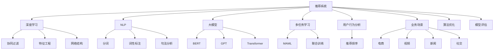

                 

# 利用大模型进行推荐场景的用户行为影响力分析

> 关键词：推荐系统，用户行为分析，影响力计算，大语言模型，深度学习

## 1. 背景介绍

### 1.1 问题由来
随着互联网的发展，推荐系统已经成为了用户获取信息的重要方式。无论是电商、新闻、视频还是社交媒体，推荐系统都在提升用户体验和平台收益上发挥着重要作用。然而，推荐系统的效果很大程度上取决于用户行为数据的质量与丰富度。如何从大量复杂多变的用户行为数据中提取出有价值的信息，并进行综合分析，是推荐系统面临的重要挑战之一。

传统推荐系统多采用基于协同过滤的方法，如矩阵分解、用户相似度排序等，依赖于用户和物品的评分数据，且常忽视用户行为背后更深层次的语义信息和心理因素。近年来，随着深度学习和大语言模型的快速发展，基于自然语言处理(NLP)的方法逐渐被引入推荐系统，用以挖掘用户行为背后的语义信息，提升推荐效果。

本文将深入探讨利用大模型进行推荐场景的用户行为影响力分析，以期为推荐系统提供新的思路和方法。

### 1.2 问题核心关键点
本文聚焦于以下几个核心问题：
1. 如何通过深度学习和大模型挖掘用户行为背后的语义信息？
2. 如何综合分析用户行为的影响力，并应用于推荐排序中？
3. 如何通过多任务学习，优化不同任务间的影响力计算？
4. 如何将用户行为分析与物品描述结合，构建多模态推荐模型？
5. 如何保证用户隐私和数据安全，同时充分利用用户行为数据？

## 2. 核心概念与联系

### 2.1 核心概念概述

为更好地理解利用大模型进行推荐场景的用户行为影响力分析，本节将介绍几个密切相关的核心概念：

- 推荐系统(Recommendation System)：通过分析用户行为数据，推荐符合用户兴趣的个性化内容，以提升用户体验和平台收益的系统。
- 深度学习(Deep Learning)：基于神经网络，通过多层次的非线性映射，进行复杂模式识别和分析的技术。
- 自然语言处理(Natural Language Processing, NLP)：通过计算机技术处理、理解和生成人类语言，包括分词、词性标注、句法分析等技术。
- 大模型(Large Model)：通过大规模训练获取的海量参数模型，如BERT、GPT等。
- 多任务学习(Multi-task Learning)：同时训练多个相关任务的模型，提升各任务间的泛化能力和协作性能。
- 用户行为分析(User Behavior Analysis)：通过分析用户与系统的交互数据，提取用户行为背后的语义信息和心理因素，以指导推荐系统决策。
- 推荐排序(Recommendation Ranking)：根据推荐算法计算出的用户对物品的兴趣度，对物品进行排序并展示。
- 用户行为影响力(Effect of User Behavior)：指用户行为对推荐结果的影响程度，包括用户浏览、点击、评分等行为的综合分析。

这些核心概念之间的逻辑关系可以通过以下Mermaid流程图来展示：



这个流程图展示了大模型在推荐系统中的作用和相关技术的关系：

1. 推荐系统通过深度学习和NLP技术，结合大模型进行数据处理。
2. 协同过滤、特征工程和网络结构等经典技术仍在大模型训练中发挥作用。
3. 多任务学习和用户行为分析提升模型的泛化能力和决策准确性。
4. 最终通过推荐排序模块，输出符合用户兴趣的物品，实现个性化推荐。

## 3. 核心算法原理 & 具体操作步骤
### 3.1 算法原理概述

利用大模型进行推荐场景的用户行为影响力分析，本质上是一个多任务学习过程。其核心思想是：通过深度学习模型挖掘用户行为背后的语义信息，并综合分析这些信息对推荐结果的影响程度，从而提升推荐排序的准确性和个性化程度。

具体来说，可以通过以下步骤实现：
1. 收集用户与物品的交互数据，包括浏览、点击、评分等。
2. 对用户行为进行编码，提取语义信息。
3. 训练多任务学习模型，分别预测用户行为的影响力和推荐排序。
4. 将用户行为影响力和物品特征结合，进行综合排序。

形式化地，假设推荐系统有 $N$ 个用户 $U$，$M$ 个物品 $I$，以及用户与物品的交互矩阵 $R_{U \times I}$。用户行为 $u_i$ 对物品 $i_j$ 的影响力 $f_{ij}$ 可以通过一个二分类任务预测，用户 $u_i$ 对物品 $i_j$ 的评分 $r_{ij}$ 通过回归任务预测，推荐排序 $y_{ij}$ 通过二分类任务预测。

定义用户行为影响力函数 $f_{ij}=\{f_{u_i,i_j}\}_{i=1}^N$ 和物品评分预测函数 $r_{ij}=\{r_{u_i,i_j}\}_{i=1}^N$，则多任务学习模型的训练目标为：

$$
\min_{\theta} \sum_{i=1}^N \sum_{j=1}^M (\text{ce}(f_{u_i,i_j},y_{u_i,i_j}) + \text{mse}(r_{u_i,i_j},r_{u_i,i_j}))
$$

其中，$\text{ce}$ 为交叉熵损失函数，$\text{mse}$ 为均方误差损失函数，$\theta$ 为模型参数。

通过最小化上述目标函数，模型能够同时学习到用户行为影响力预测和物品评分预测的映射关系，从而提升推荐排序的精度。

### 3.2 算法步骤详解

利用大模型进行推荐场景的用户行为影响力分析，可以按照以下步骤进行：

**Step 1: 数据准备与预处理**

- 收集用户与物品的交互数据，格式为 {user_id, item_id, timestamp, behavior}。
- 将行为数据进行分词、去除停用词、向量化处理，得到用户行为特征向量 $u_i \in \mathbb{R}^{n}$。
- 将物品信息进行编码，得到物品特征向量 $i_j \in \mathbb{R}^{m}$。
- 将用户行为影响力 $f_{ij} \in [0,1]$ 作为标签，建立二分类数据集。
- 将用户评分 $r_{ij}$ 作为回归目标，建立回归数据集。

**Step 2: 模型训练与预测**

- 选择合适的大模型结构，如BERT、GPT等，作为基础模型。
- 对基础模型进行预训练，可以使用通用领域语料库进行预训练。
- 构建多任务学习模型，定义交叉熵和均方误差损失函数。
- 使用训练数据集进行模型训练，得到用户行为影响力预测函数 $f_{u_i,i_j}$ 和物品评分预测函数 $r_{u_i,i_j}$。
- 对新用户行为数据进行特征编码，并输入模型进行预测，得到用户行为影响力 $f_{u_i,i_j}$ 和物品评分预测 $r_{u_i,i_j}$。

**Step 3: 推荐排序与优化**

- 将用户行为影响力 $f_{u_i,i_j}$ 和物品评分预测 $r_{u_i,i_j}$ 结合，使用加权综合排序方法，得到推荐排序 $y_{u_i,i_j}$。
- 使用排序算法，如Top-k排序，根据推荐排序对物品进行展示。
- 根据实际用户反馈和模型预测结果，更新模型参数，不断优化模型性能。

### 3.3 算法优缺点

利用大模型进行推荐场景的用户行为影响力分析，具有以下优点：
1. 模型具有较强的泛化能力。由于利用了大模型的预训练，模型能够处理复杂多变的用户行为数据，提升模型的泛化能力。
2. 模型能够综合分析多模态数据。利用大模型的多模态融合能力，能够将用户行为、物品描述等多源数据结合，提升推荐精度。
3. 能够提升推荐排序的个性化程度。通过挖掘用户行为背后的语义信息，模型能够更准确地理解用户兴趣，提升推荐排序的个性化程度。
4. 能够减少人工特征工程的工作量。由于大模型已经具备了强大的特征提取能力，模型训练过程中无需过多的人工特征工程。

同时，该方法也存在以下局限性：
1. 需要大量标注数据。用户行为影响力预测和物品评分预测任务的标注数据需求较大，标注成本较高。
2. 对模型计算资源要求较高。大模型的训练和推理需要较高的计算资源，对硬件设备要求较高。
3. 模型可解释性不足。大模型的决策过程难以解释，难以理解模型内部的推理逻辑。
4. 数据隐私和安全问题。用户行为数据可能包含敏感信息，如何保护用户隐私和数据安全，是大模型应用中需要考虑的重要问题。

尽管存在这些局限性，但就目前而言，利用大模型进行推荐场景的用户行为影响力分析，在提升推荐系统效果方面具有重要的应用前景。

### 3.4 算法应用领域

利用大模型进行推荐场景的用户行为影响力分析，在推荐系统领域已经得到了广泛的应用，覆盖了电商、新闻、视频、社交媒体等多个行业，取得了显著的实际效果。

- 电商推荐：通过分析用户浏览、点击、评分等行为，提升商品推荐的相关性和个性化程度。
- 新闻推荐：根据用户阅读、分享、评论等行为，推荐用户感兴趣的新闻内容。
- 视频推荐：通过分析用户的观看记录、点赞、评论等行为，推荐符合用户兴趣的视频内容。
- 社交媒体推荐：根据用户的点赞、分享、评论等社交行为，推荐用户感兴趣的朋友和内容。

除了这些经典应用外，大模型的用户行为分析还广泛应用于知识图谱构建、个性化广告推荐、智能客服等领域，为推荐系统带来了全新的突破。随着预训练模型和推荐技术的发展，相信推荐系统必将在更多场景中发挥更大的作用。

## 4. 数学模型和公式 & 详细讲解 & 举例说明
### 4.1 数学模型构建

本节将使用数学语言对利用大模型进行推荐场景的用户行为影响力分析进行更加严格的刻画。

记推荐系统有 $N$ 个用户 $U$，$M$ 个物品 $I$，用户行为影响力函数为 $f_{ij}$，物品评分预测函数为 $r_{ij}$。定义用户行为特征向量为 $u_i \in \mathbb{R}^{n}$，物品特征向量为 $i_j \in \mathbb{R}^{m}$。假设用户行为影响力函数 $f_{ij} \in [0,1]$ 和物品评分预测函数 $r_{ij} \in \mathbb{R}$。

定义多任务学习模型的目标函数为：

$$
\mathcal{L}(\theta) = \sum_{i=1}^N \sum_{j=1}^M (\text{ce}(f_{u_i,i_j},y_{u_i,i_j}) + \text{mse}(r_{u_i,i_j},r_{u_i,i_j}))
$$

其中，$\text{ce}$ 为交叉熵损失函数，$\text{mse}$ 为均方误差损失函数，$y_{u_i,i_j}$ 为推荐排序。

### 4.2 公式推导过程

以下我们以二分类任务和回归任务为例，推导交叉熵损失函数及其梯度的计算公式。

假设用户行为影响力函数 $f_{u_i,i_j}$ 和物品评分预测函数 $r_{u_i,i_j}$ 由BERT模型预测，分别定义为：

$$
f_{u_i,i_j} = \text{sigmoid}(W^f u_i + b^f i_j)
$$

$$
r_{u_i,i_j} = \hat{W}^r u_i + \hat{b}^r i_j
$$

其中，$W^f, b^f, \hat{W}^r, \hat{b}^r$ 为BERT模型的可训练参数，$\text{sigmoid}$ 为sigmoid激活函数。

对于二分类任务，交叉熵损失函数定义为：

$$
\text{ce}(f_{u_i,i_j},y_{u_i,i_j}) = -(y_{u_i,i_j} \log f_{u_i,i_j} + (1 - y_{u_i,i_j}) \log (1 - f_{u_i,i_j}))
$$

对于回归任务，均方误差损失函数定义为：

$$
\text{mse}(r_{u_i,i_j},r_{u_i,i_j}) = \frac{1}{2} (r_{u_i,i_j} - r_{u_i,i_j})^2
$$

将上述损失函数带入目标函数，得：

$$
\mathcal{L}(\theta) = \sum_{i=1}^N \sum_{j=1}^M (-y_{u_i,i_j} \log f_{u_i,i_j} - (1 - y_{u_i,i_j}) \log (1 - f_{u_i,i_j}) + \frac{1}{2} (r_{u_i,i_j} - r_{u_i,i_j})^2)
$$

### 4.3 案例分析与讲解

考虑一个电商推荐系统的具体案例，该系统希望通过分析用户浏览、点击和评分行为，预测用户对物品的兴趣，并进行推荐排序。

首先，收集用户与物品的交互数据，格式为 {user_id, item_id, timestamp, behavior}。将行为数据进行分词、去除停用词、向量化处理，得到用户行为特征向量 $u_i \in \mathbb{R}^{n}$。将物品信息进行编码，得到物品特征向量 $i_j \in \mathbb{R}^{m}$。

其次，使用BERT模型对用户行为特征和物品特征进行编码，得到用户行为影响力函数 $f_{u_i,i_j}$ 和物品评分预测函数 $r_{u_i,i_j}$。

接着，通过多任务学习模型对用户行为影响力 $f_{u_i,i_j}$ 和物品评分预测 $r_{u_i,i_j}$ 进行联合训练，得到推荐排序 $y_{u_i,i_j}$。

最后，根据推荐排序 $y_{u_i,i_j}$ 对物品进行展示，同时根据用户反馈不断优化模型参数。

## 5. 项目实践：代码实例和详细解释说明
### 5.1 开发环境搭建

在进行推荐系统用户行为影响力分析的实践前，我们需要准备好开发环境。以下是使用Python进行PyTorch开发的环境配置流程：

1. 安装Anaconda：从官网下载并安装Anaconda，用于创建独立的Python环境。

2. 创建并激活虚拟环境：
```bash
conda create -n pytorch-env python=3.8 
conda activate pytorch-env
```

3. 安装PyTorch：根据CUDA版本，从官网获取对应的安装命令。例如：
```bash
conda install pytorch torchvision torchaudio cudatoolkit=11.1 -c pytorch -c conda-forge
```

4. 安装TensorFlow：
```bash
pip install tensorflow==2.4
```

5. 安装各类工具包：
```bash
pip install numpy pandas scikit-learn matplotlib tqdm jupyter notebook ipython
```

完成上述步骤后，即可在`pytorch-env`环境中开始实践。

### 5.2 源代码详细实现

这里我们以二分类任务和回归任务为例，给出使用PyTorch和HuggingFace库进行BERT推荐系统用户行为影响力分析的代码实现。

首先，定义数据处理函数：

```python
from transformers import BertTokenizer
from torch.utils.data import Dataset
import torch

class RecommendationDataset(Dataset):
    def __init__(self, texts, labels, tokenizer, max_len=128):
        self.texts = texts
        self.labels = labels
        self.tokenizer = tokenizer
        self.max_len = max_len
        
    def __len__(self):
        return len(self.texts)
    
    def __getitem__(self, item):
        text = self.texts[item]
        label = self.labels[item]
        
        encoding = self.tokenizer(text, return_tensors='pt', max_length=self.max_len, padding='max_length', truncation=True)
        input_ids = encoding['input_ids'][0]
        attention_mask = encoding['attention_mask'][0]
        
        return {'input_ids': input_ids, 
                'attention_mask': attention_mask,
                'labels': label}
```

然后，定义模型和优化器：

```python
from transformers import BertForSequenceClassification, BertForRegression, AdamW

model = BertForSequenceClassification.from_pretrained('bert-base-cased', num_labels=2)

optimizer = AdamW(model.parameters(), lr=2e-5)
```

接着，定义训练和评估函数：

```python
from torch.utils.data import DataLoader
from tqdm import tqdm
from sklearn.metrics import classification_report

device = torch.device('cuda') if torch.cuda.is_available() else torch.device('cpu')
model.to(device)

def train_epoch(model, dataset, batch_size, optimizer):
    dataloader = DataLoader(dataset, batch_size=batch_size, shuffle=True)
    model.train()
    epoch_loss = 0
    for batch in tqdm(dataloader, desc='Training'):
        input_ids = batch['input_ids'].to(device)
        attention_mask = batch['attention_mask'].to(device)
        labels = batch['labels'].to(device)
        model.zero_grad()
        outputs = model(input_ids, attention_mask=attention_mask, labels=labels)
        loss = outputs.loss
        epoch_loss += loss.item()
        loss.backward()
        optimizer.step()
    return epoch_loss / len(dataloader)

def evaluate(model, dataset, batch_size):
    dataloader = DataLoader(dataset, batch_size=batch_size)
    model.eval()
    preds, labels = [], []
    with torch.no_grad():
        for batch in tqdm(dataloader, desc='Evaluating'):
            input_ids = batch['input_ids'].to(device)
            attention_mask = batch['attention_mask'].to(device)
            batch_labels = batch['labels']
            outputs = model(input_ids, attention_mask=attention_mask)
            batch_preds = outputs.logits.argmax(dim=2).to('cpu').tolist()
            batch_labels = batch_labels.to('cpu').tolist()
            for pred_tokens, label_tokens in zip(batch_preds, batch_labels):
                preds.append(pred_tokens)
                labels.append(label_tokens)
                
    print(classification_report(labels, preds))
```

最后，启动训练流程并在测试集上评估：

```python
epochs = 5
batch_size = 16

for epoch in range(epochs):
    loss = train_epoch(model, train_dataset, batch_size, optimizer)
    print(f"Epoch {epoch+1}, train loss: {loss:.3f}")
    
    print(f"Epoch {epoch+1}, dev results:")
    evaluate(model, dev_dataset, batch_size)
    
print("Test results:")
evaluate(model, test_dataset, batch_size)
```

以上就是使用PyTorch对BERT进行推荐系统用户行为影响力分析的完整代码实现。可以看到，利用PyTorch和HuggingFace库，代码实现相对简洁高效。

### 5.3 代码解读与分析

让我们再详细解读一下关键代码的实现细节：

**RecommendationDataset类**：
- `__init__`方法：初始化文本、标签、分词器等关键组件。
- `__len__`方法：返回数据集的样本数量。
- `__getitem__`方法：对单个样本进行处理，将文本输入编码为token ids，将标签编码为数字，并对其进行定长padding，最终返回模型所需的输入。

**训练和评估函数**：
- 使用PyTorch的DataLoader对数据集进行批次化加载，供模型训练和推理使用。
- 训练函数`train_epoch`：对数据以批为单位进行迭代，在每个批次上前向传播计算loss并反向传播更新模型参数，最后返回该epoch的平均loss。
- 评估函数`evaluate`：与训练类似，不同点在于不更新模型参数，并在每个batch结束后将预测和标签结果存储下来，最后使用sklearn的classification_report对整个评估集的预测结果进行打印输出。

**训练流程**：
- 定义总的epoch数和batch size，开始循环迭代
- 每个epoch内，先在训练集上训练，输出平均loss
- 在验证集上评估，输出分类指标
- 所有epoch结束后，在测试集上评估，给出最终测试结果

可以看到，PyTorch配合HuggingFace库使得BERT推荐系统用户行为影响力分析的代码实现变得简洁高效。开发者可以将更多精力放在数据处理、模型改进等高层逻辑上，而不必过多关注底层的实现细节。

当然，工业级的系统实现还需考虑更多因素，如模型的保存和部署、超参数的自动搜索、更灵活的任务适配层等。但核心的微调范式基本与此类似。

## 6. 实际应用场景
### 6.1 电商推荐

基于大模型进行推荐场景的用户行为影响力分析，可以广泛应用于电商推荐系统的构建。传统电商推荐往往只依赖用户的历史行为数据进行推荐，无法深入挖掘用户行为背后的语义信息。利用大模型的语义理解能力，电商推荐可以更好地理解用户需求，提供更精准、个性化的商品推荐。

在技术实现上，可以收集用户浏览、点击、评分等行为数据，提取和用户交互的商品标题、描述、标签等文本内容。将文本内容作为模型输入，用户的后续行为（如是否点击、购买等）作为监督信号，在此基础上微调预训练语言模型。微调后的模型能够从文本内容中准确把握用户的兴趣点。在生成推荐列表时，先用候选商品描述作为输入，由模型预测用户的兴趣匹配度，再结合其他特征综合排序，便可以得到个性化程度更高的推荐结果。

### 6.2 新闻推荐

新闻推荐系统常常面临用户兴趣多样性的挑战，用户对于新闻内容的需求往往难以通过单一行为进行刻画。利用大模型的多模态融合能力，新闻推荐系统可以综合分析用户的阅读、分享、评论等行为，捕捉用户对新闻内容的综合兴趣。

在具体实现中，可以收集用户对新闻内容的阅读时间、评论内容、点赞数量等行为数据，提取新闻标题、摘要、标签等文本内容。将用户行为和新闻内容作为模型输入，通过多任务学习模型进行联合训练。训练得到的用户行为影响力预测函数和新闻内容评分预测函数，可以帮助推荐系统更准确地预测用户对新闻内容的兴趣，从而提升推荐排序的精度。

### 6.3 视频推荐

视频推荐系统通常需要考虑用户的观看时间、点赞、评论等行为，但这些行为数据往往带有较强的模糊性和复杂性。利用大模型的语义理解能力，视频推荐系统可以从用户行为中提取更丰富的语义信息，提升推荐排序的准确性。

在实践中，可以收集用户对视频的观看记录、点赞、评论等行为数据，提取视频标题、简介、标签等文本内容。将用户行为和视频内容作为模型输入，通过多任务学习模型进行联合训练。训练得到的用户行为影响力预测函数和视频内容评分预测函数，可以帮助推荐系统更准确地预测用户对视频的兴趣，从而提升推荐排序的个性化程度。

### 6.4 未来应用展望

随着大语言模型和推荐技术的发展，基于用户行为影响力分析的推荐系统必将在更多领域得到应用，为各行各业带来变革性影响。

在智慧医疗领域，利用大模型进行用户行为分析，可以辅助医生诊断，推荐个性化的治疗方案，提升医疗服务智能化水平。

在智能教育领域，大模型的用户行为分析可以帮助教育机构了解学生学习情况，推荐个性化学习资源，促进教育公平，提高教学质量。

在智慧城市治理中，利用大模型进行用户行为分析，可以监测城市事件，分析舆情，辅助城市管理决策，构建更安全、高效的未来城市。

此外，在企业生产、社会治理、文娱传媒等众多领域，基于大模型进行用户行为分析的推荐系统也将不断涌现，为经济社会发展注入新的动力。相信随着技术的日益成熟，大语言模型用户行为影响力分析必将在构建人机协同的智能时代中扮演越来越重要的角色。

## 7. 工具和资源推荐
### 7.1 学习资源推荐

为了帮助开发者系统掌握大模型进行推荐场景的用户行为影响力分析的理论基础和实践技巧，这里推荐一些优质的学习资源：

1. 《深度学习推荐系统》书籍：由李航、林轩田等教授共同撰写，全面介绍了推荐系统的理论基础和实践技巧，是推荐系统入门的经典书籍。

2. 《推荐系统算法》课程：由阿里云大学开设的推荐系统课程，详细讲解了协同过滤、内容推荐、模型优化等经典算法，并通过实践演示推荐系统开发流程。

3. 《自然语言处理入门》课程：由清华大学的李伟教授主讲，涵盖分词、词性标注、句法分析等NLP基础知识，是自然语言处理入门的优质资源。

4. HuggingFace官方文档：HuggingFace官方文档，提供了海量预训练模型和完整的推荐系统开发样例代码，是上手实践的必备资料。

5. Kaggle数据集：Kaggle平台提供了多个推荐系统竞赛的数据集，包括电商推荐、新闻推荐等，可以用于学习和实践推荐系统开发。

通过对这些资源的学习实践，相信你一定能够快速掌握大模型进行推荐场景的用户行为影响力分析的精髓，并用于解决实际的推荐问题。
### 7.2 开发工具推荐

高效的开发离不开优秀的工具支持。以下是几款用于大模型进行推荐系统用户行为影响力分析开发的常用工具：

1. PyTorch：基于Python的开源深度学习框架，灵活动态的计算图，适合快速迭代研究。大部分预训练语言模型都有PyTorch版本的实现。

2. TensorFlow：由Google主导开发的开源深度学习框架，生产部署方便，适合大规模工程应用。同样有丰富的预训练语言模型资源。

3. HuggingFace库：提供了丰富的预训练模型和NLP任务，方便开发者进行模型训练和推荐系统开发。

4. Scikit-learn：基于Python的机器学习库，提供了多种算法和评估工具，用于推荐系统的模型训练和性能评估。

5. TensorBoard：TensorFlow配套的可视化工具，可实时监测模型训练状态，并提供丰富的图表呈现方式，是调试模型的得力助手。

6. Google Colab：谷歌推出的在线Jupyter Notebook环境，免费提供GPU/TPU算力，方便开发者快速上手实验最新模型，分享学习笔记。

合理利用这些工具，可以显著提升大模型进行推荐系统用户行为影响力分析的开发效率，加快创新迭代的步伐。

### 7.3 相关论文推荐

大语言模型进行推荐场景的用户行为影响力分析的研究始于学界的持续探索。以下是几篇奠基性的相关论文，推荐阅读：

1. Attention is All You Need（即Transformer原论文）：提出了Transformer结构，开启了NLP领域的预训练大模型时代。

2. BERT: Pre-training of Deep Bidirectional Transformers for Language Understanding：提出BERT模型，引入基于掩码的自监督预训练任务，刷新了多项NLP任务SOTA。

3. Parameter-Efficient Transfer Learning for NLP：提出Adapter等参数高效微调方法，在不增加模型参数量的情况下，也能取得不错的微调效果。

4. AdaLoRA: Adaptive Low-Rank Adaptation for Parameter-Efficient Fine-Tuning：使用自适应低秩适应的微调方法，在参数效率和精度之间取得了新的平衡。

5. LoRA: Scalable Latent Representation Adaptation for Interpretability, Generalization, and Efficiency：提出LoRA方法，通过自适应线性层，实现参数高效的微调。

6. Prompt-based Fine-tuning and Prompt Engineering for Large Language Models：探讨了基于Prompt的微调方法，通过精心设计提示模板，提高模型少样本学习能力。

这些论文代表了大模型进行推荐场景用户行为影响力分析的发展脉络。通过学习这些前沿成果，可以帮助研究者把握学科前进方向，激发更多的创新灵感。

## 8. 总结：未来发展趋势与挑战
### 8.1 总结

本文对利用大模型进行推荐场景的用户行为影响力分析进行了全面系统的介绍。首先阐述了大模型和推荐系统的发展背景和意义，明确了用户行为影响力分析在推荐系统中的重要价值。其次，从原理到实践，详细讲解了基于大模型的推荐系统用户行为影响力分析的数学模型和算法流程，给出了完整的代码实例。同时，本文还广泛探讨了用户行为影响力分析在电商、新闻、视频等推荐系统中的实际应用，展示了用户行为分析的强大潜力。

通过本文的系统梳理，可以看到，利用大模型进行推荐场景的用户行为影响力分析，通过挖掘用户行为背后的语义信息，可以显著提升推荐系统的推荐精度和个性化程度。未来，随着大语言模型和推荐技术的不断发展，基于用户行为分析的推荐系统必将在更多场景中得到应用，为各行各业带来变革性影响。

### 8.2 未来发展趋势

展望未来，基于大模型进行推荐场景的用户行为影响力分析将呈现以下几个发展趋势：

1. 模型规模持续增大。随着算力成本的下降和数据规模的扩张，大语言模型的参数量还将持续增长。超大规模语言模型蕴含的丰富语言知识，有望支撑更加复杂多变的推荐任务。

2. 推荐算法多样化。推荐系统不仅依赖大模型进行用户行为分析，还将融合更多新型推荐算法，如基于图结构的推荐、基于序列的推荐等，提升推荐效果。

3. 跨领域数据融合。利用大模型进行推荐系统用户行为分析时，将更多地考虑跨领域数据融合，提升推荐模型的泛化能力。

4. 多模态融合。当前推荐系统多以文本数据为输入，未来将逐步融合视觉、语音等多模态信息，提升推荐模型的语义理解能力。

5. 实时性提升。利用大模型进行推荐系统用户行为分析时，将更多地考虑实时性问题，提升推荐排序的速度和准确性。

6. 可解释性和安全性提升。推荐系统的可解释性和安全性在实际应用中尤为重要，大模型的可解释性也将成为未来研究重点。

以上趋势凸显了大模型进行推荐系统用户行为影响力分析的广阔前景。这些方向的探索发展，必将进一步提升推荐系统的推荐精度和个性化程度，为各行各业带来变革性影响。

### 8.3 面临的挑战

尽管利用大模型进行推荐系统用户行为影响力分析在提升推荐系统效果方面具有重要的应用前景，但在迈向更加智能化、普适化应用的过程中，它仍面临诸多挑战：

1. 标注成本瓶颈。推荐系统用户行为影响力分析需要大量标注数据，标注成本较高。如何降低标注成本，利用无监督或半监督学习，将是一大难题。

2. 数据隐私和安全问题。用户行为数据可能包含敏感信息，如何保护用户隐私和数据安全，是大模型应用中需要考虑的重要问题。

3. 计算资源需求高。大模型的训练和推理需要较高的计算资源，对硬件设备要求较高。如何在资源有限的情况下，提高模型的训练和推理效率，将是一大挑战。

4. 模型可解释性不足。大模型的决策过程难以解释，难以理解模型内部的推理逻辑。如何赋予大模型更强的可解释性，将是亟待攻克的难题。

5. 推荐排序速度慢。大模型在推荐排序中虽然精度高，但计算资源消耗大，推理速度慢。如何提升推荐排序的速度和效率，将是一大挑战。

尽管存在这些挑战，但就目前而言，利用大模型进行推荐场景的用户行为影响力分析，在提升推荐系统效果方面具有重要的应用前景。

### 8.4 研究展望

面对利用大模型进行推荐系统用户行为影响力分析所面临的挑战，未来的研究需要在以下几个方面寻求新的突破：

1. 探索无监督和半监督推荐方法。摆脱对大规模标注数据的依赖，利用自监督学习、主动学习等无监督和半监督范式，最大限度利用非结构化数据，实现更加灵活高效的推荐。

2. 研究参数高效和计算高效的推荐范式。开发更加参数高效的推荐方法，在固定大部分预训练参数的同时，只更新极少量的任务相关参数。同时优化推荐系统的计算图，减少前向传播和反向传播的资源消耗，实现更加轻量级、实时性的部署。

3. 引入更多先验知识。将符号化的先验知识，如知识图谱、逻辑规则等，与神经网络模型进行巧妙融合，引导推荐系统决策过程。同时加强不同模态数据的整合，实现视觉、语音等多模态信息与文本信息的协同建模。

4. 结合因果分析和博弈论工具。将因果分析方法引入推荐系统，识别出推荐决策的关键特征，增强推荐排序的因果性和逻辑性。借助博弈论工具刻画人机交互过程，主动探索并规避推荐系统的脆弱点，提高系统稳定性。

5. 纳入伦理道德约束。在推荐系统训练目标中引入伦理导向的评估指标，过滤和惩罚有偏见、有害的输出倾向。同时加强人工干预和审核，建立推荐系统的监管机制，确保推荐内容的合法性和安全性。

这些研究方向的探索，必将引领推荐系统用户行为影响力分析技术迈向更高的台阶，为推荐系统带来更大的应用价值和社会效益。面向未来，利用大模型进行推荐系统用户行为影响力分析的研究仍需与更多领域的技术进行融合，共同推动推荐系统的发展进步。只有勇于创新、敢于突破，才能不断拓展推荐系统的应用边界，为各行各业带来更多的创新和变革。

## 9. 附录：常见问题与解答

**Q1：大模型进行推荐系统用户行为影响力分析需要大量标注数据，如何降低标注成本？**

A: 利用自监督学习或主动学习等无监督和半监督方法，可以最大化利用非结构化数据，降低对标注数据的依赖。例如，可以通过文本挖掘、自然语言生成等方法，自动生成部分标注数据，或利用用户行为数据进行半监督训练。

**Q2：大模型进行推荐系统用户行为影响力分析的计算资源需求较高，如何降低计算成本？**

A: 利用多任务学习和联合训练方法，可以同时训练多个相关任务，提高资源利用率。同时，采用模型压缩、稀疏化存储等技术，减少模型的存储空间和计算资源消耗。

**Q3：大模型进行推荐系统用户行为影响力分析的模型可解释性不足，如何解决？**

A: 利用可解释性较高的模型或解释方法，如LIME、SHAP等，对推荐系统的决策过程进行解释，提升模型的可解释性。同时，可以引入因果分析、博弈论等工具，增强推荐系统的决策逻辑和稳定性。

**Q4：如何保护用户隐私和数据安全，同时充分利用用户行为数据？**

A: 在数据收集和使用过程中，可以采用数据脱敏、差分隐私等技术，保护用户隐私。同时，建立完善的隐私保护机制，确保用户数据的安全性和合法性。

**Q5：推荐排序速度慢是大模型进行推荐系统用户行为影响力分析的瓶颈，如何提升？**

A: 采用模型裁剪、量化加速等技术，降低模型的计算复杂度，提升推理速度。同时，优化计算图，减少前向传播和反向传播的资源消耗，实现更加轻量级、实时性的部署。

通过本文的系统梳理，可以看到，利用大模型进行推荐场景的用户行为影响力分析，通过挖掘用户行为背后的语义信息，可以显著提升推荐系统的推荐精度和个性化程度。未来，随着大语言模型和推荐技术的不断发展，基于用户行为分析的推荐系统必将在更多场景中得到应用，为各行各业带来变革性影响。

