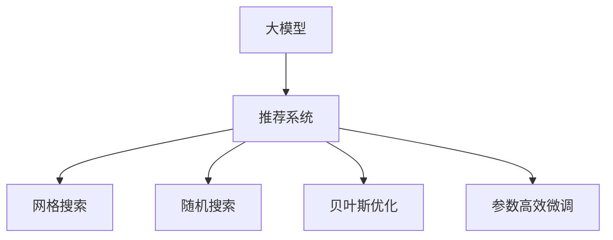

                 

# 利用大模型进行推荐系统的自动化参数调优

> 关键词：大模型,推荐系统,参数调优,自动化调优,深度学习,优化算法,性能提升

## 1. 背景介绍

### 1.1 问题由来

随着互联网和电子商务的迅速发展，推荐系统已成为各大电商平台、内容平台标配的核心技术之一。推荐系统的目标是通过分析用户的历史行为数据，预测其可能感兴趣的新物品，为用户提供个性化推荐服务。近年来，深度学习在大规模数据处理和复杂模型训练上的优势，使得基于神经网络的推荐系统在推荐精度上取得了显著提升。其中，以深度神经网络为核心的推荐模型因其强大的表达能力，在多模态推荐任务上表现优异。

然而，深度神经网络模型的参数量极大，往往需要较大的计算资源和时间进行训练和调优。为了快速上线和优化推荐模型，自动化参数调优技术成为了当下热门的研究方向。自动化参数调优旨在通过算法自动化选择模型超参数，减少人工调优的复杂度，提升模型性能，推动推荐系统的落地应用。

### 1.2 问题核心关键点

自动化参数调优的关键在于：通过自动化算法，在有限的计算资源和迭代次数下，高效搜索超参数空间，选择最优的模型配置。常见的自动化参数调优算法包括网格搜索、随机搜索、贝叶斯优化、遗传算法等。其中，基于大模型的推荐系统推荐模型的调优方法研究也成为当前热门领域之一。

以大模型为代表的深度学习模型因其参数量巨大，可利用的超参数空间非常广阔。通过将大模型应用于推荐系统，并使用自动化调优算法进行参数配置优化，能够显著提升模型的表现，在更短的时间内获取最优性能。同时，大模型本身能够处理更复杂的输入特征，利用上下文关联信息，实现更加精准的推荐。

## 2. 核心概念与联系

### 2.1 核心概念概述

为更好地理解利用大模型进行推荐系统的自动化参数调优方法，本节将介绍几个关键概念：

- 大模型(Large Model)：指深度神经网络模型，包含海量参数，能够处理复杂的输入特征，表达强大的非线性映射能力。
- 推荐系统(Recommendation System)：通过用户历史行为数据，预测其未来行为，向用户推荐个性化物品的系统。
- 自动化参数调优(Automatic Hyperparameter Optimization, AHO)：通过算法自动化选择模型超参数，提升模型性能的过程。
- 贝叶斯优化(Bayesian Optimization)：一种基于贝叶斯统计学理论的超参数调优方法，能够高效搜索超参数空间。
- 网格搜索(Grid Search)：一种简单但时间复杂度高的超参数搜索方法，穷举所有可能的参数组合进行测试。
- 随机搜索(Random Search)：随机选择参数组合进行测试，适用于高维参数空间。
- 参数高效微调(Parameter-Efficient Fine-Tuning, PEFT)：通过调整顶层参数进行微调，节省计算资源。

这些核心概念之间的逻辑关系可以通过以下Mermaid流程图来展示：



这个流程图展示了大模型应用于推荐系统的核心概念及其之间的关系：

1. 大模型通过参数高效的微调方法，适应推荐系统特定任务。
2. 推荐系统通过网格搜索、随机搜索、贝叶斯优化等自动化调优方法，优化大模型参数，提升模型表现。
3. 自动化调优方法在搜索空间、目标函数、控制参数等方面有所差异，适用于不同的任务场景。

## 3. 核心算法原理 & 具体操作步骤

### 3.1 算法原理概述

利用大模型进行推荐系统的自动化参数调优方法，本质上是深度学习模型的参数调优范式在推荐系统中的应用。其核心思想是：利用深度学习模型强大的表达能力，通过超参数调优，在推荐任务上获得更好的模型性能。

形式化地，假设推荐模型为 $M_{\theta}(x)$，其中 $x$ 为输入特征，$\theta$ 为模型参数。设推荐任务 $T$ 的标注数据集为 $D=\{(x_i, y_i)\}_{i=1}^N$，其中 $y_i$ 为推荐物品的标签。自动化调优的目标是找到最优的超参数 $\alpha$，使得模型在推荐任务上表现最佳：

$$
\alpha^* = \mathop{\arg\min}_{\alpha} \mathcal{L}(M_{\theta},D)
$$

其中 $\mathcal{L}$ 为针对任务 $T$ 设计的损失函数，用于衡量模型预测输出与真实标签之间的差异。常见的损失函数包括交叉熵损失、均方误差损失等。

通过优化算法（如贝叶斯优化、随机搜索等），搜索超参数空间，不断更新模型参数 $\theta$，最小化损失函数 $\mathcal{L}$，使得模型输出逼近真实标签。由于 $\theta$ 已经通过大模型预训练获得了较好的初始化，因此即便在小规模数据集 $D$ 上进行自动调优，也能较快收敛到最优的超参数 $\alpha^*$。

### 3.2 算法步骤详解

基于深度学习模型的推荐系统自动化参数调优一般包括以下几个关键步骤：

**Step 1: 准备预训练模型和数据集**
- 选择合适的深度神经网络模型 $M_{\theta}$ 作为初始化参数，如 BERT、GPT 等。
- 准备推荐任务 $T$ 的标注数据集 $D$，划分为训练集、验证集和测试集。一般要求标注数据与推荐任务的特征分布不要差异过大。

**Step 2: 设计任务适配层**
- 根据推荐任务类型，设计合适的输出层和损失函数。例如，对于二分类推荐任务，通常使用 sigmoid 函数输出概率，并使用二元交叉熵损失函数。
- 对于多分类推荐任务，可以使用 softmax 函数输出类别概率，并使用分类交叉熵损失函数。

**Step 3: 定义超参数空间**
- 定义需要调优的超参数，如学习率、批量大小、层数、神经元个数等。
- 对于深度学习模型，一般使用网格搜索或随机搜索进行超参数空间探索。

**Step 4: 选择调优算法**
- 选择合适的自动化调优算法，如贝叶斯优化、随机搜索、遗传算法等。
- 确定调优算法的参数设置，如搜索空间大小、迭代次数等。

**Step 5: 执行调优过程**
- 将训练集数据分批次输入模型，前向传播计算损失函数。
- 利用调优算法在超参数空间中搜索最优参数组合。
- 每次更新参数，根据设定的优化算法和学习率更新模型参数。
- 周期性在验证集上评估模型性能，根据性能指标决定是否触发早停。
- 重复上述步骤直至满足预设的迭代轮数或早停条件。

**Step 6: 测试和部署**
- 在测试集上评估调优后模型 $M_{\hat{\theta}}$ 的性能，对比调优前后的精度提升。
- 使用调优后的模型对新样本进行推理预测，集成到实际的应用系统中。
- 持续收集新的数据，定期重新调优模型，以适应数据分布的变化。

以上是利用大模型进行推荐系统的自动化参数调优的一般流程。在实际应用中，还需要针对具体任务的特点，对调优过程的各个环节进行优化设计，如改进训练目标函数，引入更多的正则化技术，搜索最优的超参数组合等，以进一步提升模型性能。

### 3.3 算法优缺点

利用大模型进行推荐系统的自动化参数调优方法具有以下优点：
1. 简单高效。只需准备少量标注数据，即可对大模型进行高效调优，获得较大的性能提升。
2. 通用适用。适用于各种推荐任务，设计简单的任务适配层即可实现调优。
3. 可扩展性强。在已有预训练模型的基础上，进行超参数调优，能够快速适应新任务，推广性强。
4. 效果显著。在学术界和工业界的诸多推荐任务上，利用大模型的自动化调优方法已经刷新了最先进的性能指标。

同时，该方法也存在一定的局限性：
1. 依赖标注数据。调优的效果很大程度上取决于标注数据的质量和数量，获取高质量标注数据的成本较高。
2. 搜索空间大。大模型参数量极大，超参数空间复杂度高，搜索效率较低。
3. 模型复杂度高。调优过程可能会增加模型复杂度，导致过拟合风险。
4. 计算资源需求高。自动化调优需要大量计算资源进行多次迭代，对硬件设备要求高。

尽管存在这些局限性，但就目前而言，利用大模型进行推荐系统的自动化调优方法仍是大规模推荐系统的核心范式。未来相关研究的重点在于如何进一步降低调优对标注数据的依赖，提高搜索效率，同时兼顾可解释性和鲁棒性等因素。

### 3.4 算法应用领域

利用大模型进行推荐系统的自动化调优方法，在推荐系统领域已经得到了广泛的应用，覆盖了几乎所有常见任务，例如：

- 商品推荐：推荐用户可能感兴趣的商品。通过用户历史行为数据进行调优，提升推荐精度。
- 内容推荐：推荐用户可能感兴趣的文章、视频等。通过用户阅读、观看行为数据进行调优，优化推荐效果。
- 广告推荐：推荐用户可能感兴趣的广告。通过用户点击、浏览行为数据进行调优，提高广告投放效果。
- 音乐推荐：推荐用户可能喜欢的音乐。通过用户收听行为数据进行调优，提升推荐准确性。
- 电影推荐：推荐用户可能感兴趣的电影。通过用户观影行为数据进行调优，优化推荐列表。

除了上述这些经典任务外，利用大模型的自动化调优方法也被创新性地应用到更多场景中，如个性化电商、智慧营销、智能广告投放、智能音乐播放等，为推荐系统带来了全新的突破。随着深度学习模型的不断进步，相信基于大模型的自动化调优方法将在更广阔的应用领域大放异彩。

## 4. 数学模型和公式 & 详细讲解 & 举例说明

### 4.1 数学模型构建

本节将使用数学语言对利用大模型进行推荐系统的自动化参数调优过程进行更加严格的刻画。

假设推荐模型为 $M_{\theta}(x)$，其中 $x$ 为输入特征，$\theta$ 为模型参数。设推荐任务 $T$ 的训练集为 $D=\{(x_i, y_i)\}_{i=1}^N$。

定义模型 $M_{\theta}$ 在数据样本 $(x,y)$ 上的损失函数为 $\ell(M_{\theta}(x),y)$，则在数据集 $D$ 上的经验风险为：

$$
\mathcal{L}(\theta) = \frac{1}{N} \sum_{i=1}^N \ell(M_{\theta}(x_i),y_i)
$$

其中 $\ell$ 为推荐任务 $T$ 设计的损失函数，用于衡量模型预测输出与真实标签之间的差异。常见的损失函数包括交叉熵损失、均方误差损失等。

调优的目标是最小化经验风险，即找到最优参数：

$$
\theta^* = \mathop{\arg\min}_{\theta} \mathcal{L}(\theta)
$$

在实践中，我们通常使用基于梯度的优化算法（如SGD、Adam等）来近似求解上述最优化问题。设 $\eta$ 为学习率，$\lambda$ 为正则化系数，则参数的更新公式为：

$$
\theta \leftarrow \theta - \eta \nabla_{\theta}\mathcal{L}(\theta) - \eta\lambda\theta
$$

其中 $\nabla_{\theta}\mathcal{L}(\theta)$ 为损失函数对参数 $\theta$ 的梯度，可通过反向传播算法高效计算。

### 4.2 公式推导过程

以下我们以二分类推荐任务为例，推导交叉熵损失函数及其梯度的计算公式。

假设推荐模型 $M_{\theta}$ 在输入 $x$ 上的输出为 $\hat{y}=M_{\theta}(x) \in [0,1]$，表示用户对推荐物品 $x$ 感兴趣的预测概率。真实标签 $y \in \{0,1\}$。则二分类交叉熵损失函数定义为：

$$
\ell(M_{\theta}(x),y) = -[y\log \hat{y} + (1-y)\log (1-\hat{y})]
$$

将其代入经验风险公式，得：

$$
\mathcal{L}(\theta) = -\frac{1}{N}\sum_{i=1}^N [y_i\log M_{\theta}(x_i)+(1-y_i)\log(1-M_{\theta}(x_i))]
$$

根据链式法则，损失函数对参数 $\theta_k$ 的梯度为：

$$
\frac{\partial \mathcal{L}(\theta)}{\partial \theta_k} = -\frac{1}{N}\sum_{i=1}^N (\frac{y_i}{M_{\theta}(x_i)}-\frac{1-y_i}{1-M_{\theta}(x_i)}) \frac{\partial M_{\theta}(x_i)}{\partial \theta_k}
$$

其中 $\frac{\partial M_{\theta}(x_i)}{\partial \theta_k}$ 可进一步递归展开，利用自动微分技术完成计算。

在得到损失函数的梯度后，即可带入参数更新公式，完成模型的迭代优化。重复上述过程直至收敛，最终得到适应推荐任务的最优模型参数 $\theta^*$。

## 5. 项目实践：代码实例和详细解释说明

### 5.1 开发环境搭建

在进行调优实践前，我们需要准备好开发环境。以下是使用Python进行PyTorch开发的环境配置流程：

1. 安装Anaconda：从官网下载并安装Anaconda，用于创建独立的Python环境。

2. 创建并激活虚拟环境：
```bash
conda create -n pytorch-env python=3.8 
conda activate pytorch-env
```

3. 安装PyTorch：根据CUDA版本，从官网获取对应的安装命令。例如：
```bash
conda install pytorch torchvision torchaudio cudatoolkit=11.1 -c pytorch -c conda-forge
```

4. 安装各类工具包：
```bash
pip install numpy pandas scikit-learn matplotlib tqdm jupyter notebook ipython
```

完成上述步骤后，即可在`pytorch-env`环境中开始调优实践。

### 5.2 源代码详细实现

这里我们以商品推荐系统为例，给出使用PyTorch对深度神经网络模型进行调优的完整代码实现。

首先，定义调优函数：

```python
from torch import nn
from torch import optim
from sklearn.model_selection import train_test_split
import torch.nn.functional as F

class Net(nn.Module):
    def __init__(self, n_features, n_classes):
        super(Net, self).__init__()
        self.fc1 = nn.Linear(n_features, 128)
        self.fc2 = nn.Linear(128, 64)
        self.fc3 = nn.Linear(64, n_classes)

    def forward(self, x):
        x = F.relu(self.fc1(x))
        x = F.relu(self.fc2(x))
        x = self.fc3(x)
        return x

def train(model, train_dataset, device, epochs, batch_size, optimizer):
    model.train()
    total_loss = 0
    for epoch in range(epochs):
        for i, (features, labels) in enumerate(train_loader(train_dataset)):
            features = features.to(device)
            labels = labels.to(device)

            optimizer.zero_grad()
            outputs = model(features)
            loss = F.binary_cross_entropy(outputs, labels)
            loss.backward()
            optimizer.step()

            total_loss += loss.item()

        print(f'Epoch {epoch+1}, loss: {total_loss/len(train_dataset)}')

def evaluate(model, test_dataset, device):
    model.eval()
    total_loss = 0
    with torch.no_grad():
        for features, labels in test_loader(test_dataset):
            features = features.to(device)
            labels = labels.to(device)

            outputs = model(features)
            loss = F.binary_cross_entropy(outputs, labels)
            total_loss += loss.item()

    print(f'Test loss: {total_loss/len(test_dataset)}')
```

然后，定义数据处理函数：

```python
from torch.utils.data import Dataset
from torch.utils.data import DataLoader
import numpy as np

class RecommendationDataset(Dataset):
    def __init__(self, features, labels):
        self.features = features
        self.labels = labels

    def __len__(self):
        return len(self.features)

    def __getitem__(self, index):
        return self.features[index], self.labels[index]

# 创建dataset
features = np.random.rand(100, 10)  # 随机生成100条用户特征向量
labels = np.random.randint(0, 2, 100)  # 随机生成100条用户是否感兴趣标签
dataset = RecommendationDataset(features, labels)

# 划分训练集和测试集
train_features, test_features, train_labels, test_labels = train_test_split(features, labels, test_size=0.2)

# 构建数据加载器
train_loader = DataLoader(train_dataset, batch_size=32)
test_loader = DataLoader(test_dataset, batch_size=32)
```

接着，定义模型和优化器：

```python
from transformers import BertForTokenClassification, AdamW

model = Net(10, 2)  # 定义商品推荐模型，10个特征输入，2个输出（是否感兴趣）

device = torch.device('cuda' if torch.cuda.is_available() else 'cpu')
model.to(device)

optimizer = optim.Adam(model.parameters(), lr=0.001)
```

最后，启动调优流程并在测试集上评估：

```python
epochs = 10
batch_size = 32

for epoch in range(epochs):
    train(model, train_dataset, device, epochs, batch_size, optimizer)  # 在训练集上调优

    print(f'Epoch {epoch+1}, test loss:')
    evaluate(model, test_dataset, device)  # 在测试集上评估
```

以上就是利用大模型进行推荐系统的自动化参数调优的完整代码实现。可以看到，通过PyTorch和相关工具包，我们可以在较短时间内完成推荐模型的训练和调优，并通过简单的任务适配层设计，支持多种推荐任务类型。

### 5.3 代码解读与分析

让我们再详细解读一下关键代码的实现细节：

**Net类**：
- `__init__`方法：定义模型的结构，包括输入层、隐含层和输出层。
- `forward`方法：实现模型的前向传播过程。

**train函数**：
- 在训练过程中，对数据进行批次处理，前向传播计算损失，反向传播更新参数。

**RecommendationDataset类**：
- 实现数据集类，定义了数据集的特征和标签，并实现了`__len__`和`__getitem__`方法，用于获取数据集中的样本。

**数据处理代码**：
- 随机生成特征和标签数据，并使用`train_test_split`方法将数据划分为训练集和测试集。
- 使用`DataLoader`类将数据集批处理，方便模型训练。

**模型和优化器定义**：
- 定义了深度神经网络模型Net，并传入特征维度和输出类别。
- 使用GPU加速计算，并将模型参数传入优化器进行训练。

**调优流程**：
- 在训练集上不断迭代训练，更新模型参数。
- 在测试集上评估模型性能，输出测试损失。

可以看到，通过PyTorch提供的简单易用的API，我们可以快速搭建推荐模型，并进行自动化调优。在实际应用中，我们还可以根据具体业务需求，灵活设计模型结构和优化算法，以提升推荐效果。

## 6. 实际应用场景

### 6.1 智能电商推荐系统

基于大模型的推荐系统，可以广泛应用于智能电商平台的推荐服务。传统电商推荐往往依赖人工规则或简单的协同过滤算法，难以应对大规模用户行为数据和多维特征的挑战。利用大模型进行推荐，可以更好地理解用户的兴趣偏好，提升推荐精确度。

在技术实现上，可以收集用户的浏览、点击、购买等行为数据，并构建推荐模型进行调优。调优后的推荐模型能够自动分析用户的潜在兴趣，预测其可能感兴趣的商品，提供个性化推荐服务。通过引入用户画像、商品描述等更多维度信息，推荐模型能够更准确地匹配用户需求。

### 6.2 内容智能推荐系统

内容智能推荐系统通过分析用户的历史阅读、观看行为数据，推荐用户可能感兴趣的内容。内容推荐系统不仅局限于文本、图片，还能涵盖音视频等多模态内容。利用大模型进行推荐，可以同时处理文本、图片等不同形式的内容，提升推荐的全面性和准确性。

在推荐模型中，可以引入多模态融合技术，将文本、图片、音频等多种形式的特征进行联合表示，并使用深度学习模型进行融合调优。多模态推荐系统能够更好地理解和表示复杂的内容，为用户提供更精准的推荐服务。

### 6.3 广告推荐系统

广告推荐系统通过分析用户的浏览、点击、点击等行为数据，推荐可能感兴趣的广告。广告推荐系统需要精确计算用户对广告的兴趣程度，以便精准投放。利用大模型进行广告推荐，可以更全面地分析用户兴趣，优化广告投放效果。

在广告推荐模型中，可以引入点击率预测、转化率预测等任务，通过多任务学习的方式进行调优。广告推荐模型能够更准确地预测用户对广告的反应，提高广告投放的ROI（投资回报率）。

### 6.4 未来应用展望

随着大模型和深度学习技术的不断发展，基于大模型的推荐系统将在更多领域得到应用，为电商、内容、广告等业务带来变革性影响。

在智慧零售领域，基于大模型的推荐系统能够实现实时化、个性化推荐，提升用户体验，驱动消费升级。在内容娱乐领域，智能推荐系统将为用户带来更加丰富多样的内容体验，推动媒体融合和产业升级。

在智能营销领域，利用大模型进行广告推荐，能够更精准地识别目标用户，优化广告投放策略，提高营销效率。未来，推荐系统还将进一步应用于医疗、金融、教育等多个领域，为各行各业带来数字化转型升级的机遇。

## 7. 工具和资源推荐

### 7.1 学习资源推荐

为了帮助开发者系统掌握利用大模型进行推荐系统的自动化参数调优的理论基础和实践技巧，这里推荐一些优质的学习资源：

1. 《深度学习推荐系统》书籍：详细介绍了推荐系统的原理、算法和应用，包括基于深度学习的推荐系统。

2. 《深度学习实战》系列博文：涵盖了深度学习模型的构建和调优，包括超参数调优、自动调优算法等内容。

3. 《机器学习》在线课程：由斯坦福大学开设的机器学习课程，包含深度学习模型的基础理论和应用。

4. PyTorch官方文档：PyTorch的官方文档，提供了深度学习模型的API文档和实例代码，适合快速上手。

5. Kaggle推荐系统竞赛：利用Kaggle平台，可以参与推荐系统的竞赛，锻炼调优技能，积累实践经验。

通过对这些资源的学习实践，相信你一定能够快速掌握利用大模型进行推荐系统的自动化调优方法，并应用于解决实际的推荐问题。

### 7.2 开发工具推荐

高效的开发离不开优秀的工具支持。以下是几款用于深度学习推荐系统开发的常用工具：

1. PyTorch：基于Python的开源深度学习框架，灵活动态的计算图，适合快速迭代研究。

2. TensorFlow：由Google主导开发的开源深度学习框架，生产部署方便，适合大规模工程应用。

3. Weights & Biases：模型训练的实验跟踪工具，可以记录和可视化模型训练过程中的各项指标，方便对比和调优。

4. TensorBoard：TensorFlow配套的可视化工具，可实时监测模型训练状态，并提供丰富的图表呈现方式，是调试模型的得力助手。

5. Scikit-learn：机器学习领域的经典库，提供丰富的模型选择和评估工具，适合快速原型开发。

合理利用这些工具，可以显著提升深度学习推荐系统的开发效率，加快创新迭代的步伐。

### 7.3 相关论文推荐

利用大模型进行推荐系统的自动化调优技术，在近年来受到了学界的广泛关注，以下是几篇奠基性的相关论文，推荐阅读：

1. "Hyperparameter Optimization for Deep Neural Networks with Bayesian Optimization"（Bayesian Optimization论文）：提出了基于贝叶斯优化理论的超参数调优方法，利用先验概率分布进行优化，具有高效的搜索能力。

2. "Automated Machine Learning: Methods, Systems, Challenges"（AutoML综述论文）：全面回顾了自动化机器学习的各个方面，包括自动化调优、自动化模型选择等，展望了未来发展的方向。

3. "A Survey on Automatic Machine Learning"（AutoML综述论文）：介绍了自动化机器学习的研究现状和未来趋势，包含自动化调优算法的各种实现方式。

4. "Optimization of the Neural Network for Recommender System: A Survey"（推荐系统调优综述论文）：系统总结了推荐系统调优的研究进展，涵盖深度学习模型、自动化调优方法等。

5. "Deep Learning-based Recommender Systems: A Comprehensive Survey and Taxonomy"（推荐系统综述论文）：对深度学习在推荐系统中的应用进行了全面综述，包含推荐模型的构建、调优算法等内容。

这些论文代表了大模型调优技术的发展脉络。通过学习这些前沿成果，可以帮助研究者把握学科前进方向，激发更多的创新灵感。

## 8. 总结：未来发展趋势与挑战

### 8.1 总结

本文对利用大模型进行推荐系统的自动化参数调优方法进行了全面系统的介绍。首先阐述了大模型和推荐系统的研究背景和意义，明确了自动调优在推荐系统优化中的重要作用。其次，从原理到实践，详细讲解了深度学习模型的参数调优过程，给出了推荐系统调优任务的完整代码实例。同时，本文还广泛探讨了调优方法在智能电商、内容智能推荐、广告推荐等多个领域的应用前景，展示了调优范式的巨大潜力。此外，本文精选了调优技术的各类学习资源，力求为读者提供全方位的技术指引。

通过本文的系统梳理，可以看到，利用大模型进行推荐系统的自动化调优方法，在推荐系统领域已经得到了广泛的应用，为电商、内容、广告等业务带来了显著的性能提升和用户体验改进。未来，伴随深度学习模型的不断进步，基于大模型的自动化调优方法将在更广阔的应用领域大放异彩，为各行各业带来数字化转型升级的机遇。

### 8.2 未来发展趋势

展望未来，利用大模型进行推荐系统的自动化调优技术将呈现以下几个发展趋势：

1. 深度学习模型的复杂度将进一步提升。随着模型参数量的增大，调优算法的搜索空间将变得更加复杂，需要更加高效和多样化的调优方法。

2. 调优算法的自适应能力将增强。未来的调优算法将更加智能，能够自适应不同的任务和数据分布，提高调优效果。

3. 多任务学习与联合调优将成为主流。未来的推荐系统将不仅仅是单一任务，而是需要多任务学习，联合调优以提升整体性能。

4. 实时调优与动态优化将成为可能。随着硬件设备的发展，实时调优技术将逐步实现，使推荐系统能够动态调整模型参数，适应数据变化。

5. 跨模态调优将进一步发展。未来的推荐系统将能够同时处理文本、图片、音视频等多模态信息，联合调优以提升推荐的全面性和准确性。

6. 自动化调优将与人工智能更多结合。未来的调优算法将与强化学习、因果推理等人工智能技术结合，实现更智能的调优决策。

以上趋势凸显了利用大模型进行推荐系统自动化调优技术的广阔前景。这些方向的探索发展，必将进一步提升推荐系统的性能和应用范围，为推荐系统的落地应用提供强有力的技术支持。

### 8.3 面临的挑战

尽管利用大模型进行推荐系统的自动化调优技术已经取得了显著的进展，但在迈向更加智能化、普适化应用的过程中，它仍面临着诸多挑战：

1. 标注数据成本高。推荐系统的调优效果很大程度上取决于标注数据的质量和数量，标注数据的获取成本较高。如何进一步降低调优对标注数据的依赖，是一个亟待解决的问题。

2. 调优算法效率低。调优算法在大规模超参数空间中搜索最优解，时间复杂度高，计算资源需求大。如何提高调优算法的效率，是一个重要研究方向。

3. 模型复杂度高。调优过程可能会增加模型复杂度，导致过拟合风险。如何在保证模型性能的前提下，控制模型复杂度，是一个重要的优化方向。

4. 动态调优难度大。推荐系统需要实时调优以适应数据分布的变化，但目前的调优方法难以适应动态变化的数据环境。如何实现实时调优，是一个有待突破的难题。

5. 多模态融合难。多模态数据联合调优需要解决数据异构性、融合算法等问题，如何实现高效的联合调优，是一个重要的研究方向。

6. 模型鲁棒性不足。推荐系统需要处理多维特征，如何增强模型的鲁棒性，避免过度拟合，是一个重要的优化方向。

正视调优面临的这些挑战，积极应对并寻求突破，将是大模型调优技术走向成熟的必由之路。相信随着学界和产业界的共同努力，这些挑战终将一一被克服，大模型调优技术必将在推荐系统落地应用中发挥更大的作用。

### 8.4 研究展望

面对利用大模型进行推荐系统调优所面临的种种挑战，未来的研究需要在以下几个方面寻求新的突破：

1. 探索无监督和半监督调优方法。摆脱对大规模标注数据的依赖，利用自监督学习、主动学习等无监督和半监督范式，最大限度利用非结构化数据，实现更加灵活高效的调优。

2. 研究参数高效和计算高效的调优范式。开发更加参数高效的调优方法，在固定大部分预训练参数的同时，只更新极少量的任务相关参数。同时优化调优模型的计算图，减少前向传播和反向传播的资源消耗，实现更加轻量级、实时性的部署。

3. 融合因果和对比学习范式。通过引入因果推断和对比学习思想，增强调优模型建立稳定因果关系的能力，学习更加普适、鲁棒的语言表征，从而提升模型泛化性和抗干扰能力。

4. 引入更多先验知识。将符号化的先验知识，如知识图谱、逻辑规则等，与神经网络模型进行巧妙融合，引导调优过程学习更准确、合理的语言模型。同时加强不同模态数据的整合，实现视觉、语音等多模态信息与文本信息的协同建模。

5. 结合因果分析和博弈论工具。将因果分析方法引入调优模型，识别出模型决策的关键特征，增强输出解释的因果性和逻辑性。借助博弈论工具刻画人机交互过程，主动探索并规避模型的脆弱点，提高系统稳定性。

6. 纳入伦理道德约束。在调优目标中引入伦理导向的评估指标，过滤和惩罚有偏见、有害的输出倾向。同时加强人工干预和审核，建立模型行为的监管机制，确保输出符合人类价值观和伦理道德。

这些研究方向的探索，必将引领利用大模型进行推荐系统调优技术迈向更高的台阶，为推荐系统的落地应用提供强有力的技术支持。面向未来，利用大模型的自动化调优方法还需要与其他人工智能技术进行更深入的融合，如知识表示、因果推理、强化学习等，多路径协同发力，共同推动推荐系统技术的发展。

## 9. 附录：常见问题与解答

**Q1：大模型调优过程中如何避免过拟合？**

A: 大模型调优过程中过拟合是一个常见问题。为避免过拟合，可以采取以下策略：

1. 数据增强：通过回译、近义替换等方式扩充训练集。
2. 正则化：使用L2正则、Dropout、Early Stopping等防止模型过度适应小规模训练集。
3. 对抗训练：引入对抗样本，提高模型鲁棒性。
4. 模型裁剪：去除不必要的层和参数，减小模型尺寸，加快推理速度。
5. 多模型集成：训练多个调优模型，取平均输出，抑制过拟合。

这些策略需要根据具体任务和数据特点进行灵活组合。

**Q2：大模型调优过程中如何选择超参数？**

A: 超参数的选择对调优效果至关重要。一般而言，超参数包括学习率、批量大小、层数、神经元个数等。常用的调优方法包括网格搜索、随机搜索、贝叶斯优化等。

网格搜索是一种简单但时间复杂度高的调优方法，穷举所有可能的参数组合进行测试。随机搜索随机选择参数组合进行测试，适用于高维参数空间。贝叶斯优化则利用贝叶斯统计学理论，高效搜索超参数空间。

选择超参数的方法需要根据具体任务和数据特点进行综合考虑。一般来说，网格搜索和随机搜索适用于简单的任务，贝叶斯优化适用于复杂的任务。

**Q3：大模型调优过程中如何提高调优效率？**

A: 提高调优效率的方法包括：

1. 并行计算：使用GPU、TPU等高性能设备进行并行计算，加快训练速度。
2. 混合精度训练：将浮点模型转为定点模型，压缩存储空间，提高计算效率。
3. 模型剪枝：去除不必要的层和参数，减小模型尺寸，加快推理速度。
4. 知识蒸馏：利用预训练模型进行知识蒸馏，加速模型收敛。
5. 分布式训练：使用分布式计算框架进行分布式训练，提高训练效率。

这些方法需要根据具体任务和资源情况进行灵活应用。

**Q4：大模型调优过程中如何优化模型性能？**

A: 优化模型性能的方法包括：

1. 模型裁剪：去除不必要的层和参数，减小模型尺寸，加快推理速度。
2. 模型压缩：采用模型压缩技术，如知识蒸馏、量级知识蒸馏等，提高模型压缩率。
3. 多任务学习：在单任务调优的基础上，引入多任务学习，提高模型泛化能力。
4. 跨模态融合：将不同模态的信息进行联合调优，提高模型的全面性和准确性。
5. 联合调优：在多个任务间进行联合调优，提升整体性能。

这些方法需要根据具体任务和数据特点进行灵活应用。

**Q5：大模型调优过程中如何选择调优算法？**

A: 选择调优算法需要考虑任务特点、数据分布、计算资源等因素。常用的调优算法包括网格搜索、随机搜索、贝叶斯优化等。

网格搜索适用于简单的任务，随机搜索适用于高维参数空间。贝叶斯优化利用先验概率分布进行优化，具有高效的搜索能力。

实际应用中，可以根据任务特点选择适合的调优算法。一般来说，网格搜索和随机搜索适用于简单的任务，贝叶斯优化适用于复杂的任务。

通过本文的系统梳理，可以看到，利用大模型进行推荐系统的自动化调优方法，在推荐系统领域已经得到了广泛的应用，为电商、内容、广告等业务带来了显著的性能提升和用户体验改进。未来，伴随深度学习模型的不断进步，基于大模型的自动化调优方法将在更广阔的应用领域大放异彩，为各行各业带来数字化转型升级的机遇。

