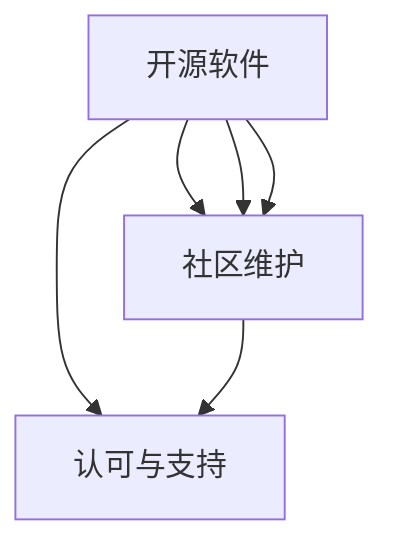

                 

# 利用开源影响力获得技术顾问委员会职位

## 1. 背景介绍

在现代科技领域，开源软件已成为推动技术进步和创新的重要力量。开源社区汇聚了全球顶级的技术专家，通过共同协作、代码共享，不断提升技术水平和应用范围。对于个人开发者来说，参与开源项目不仅可以获得宝贵的经验和技能提升，更可以在技术顾问委员会等关键决策机构中发挥影响力。本文将系统介绍如何通过开源影响力获得技术顾问委员会职位，并探讨这一路径在职业发展和技术社区中的价值。

## 2. 核心概念与联系

### 2.1 核心概念概述

- **开源软件**：指通过公共许可协议，允许用户自由使用、修改和分发的软件代码。开源项目通常由社区维护，通过协作开发的方式不断迭代和改进。

- **技术顾问委员会**：由行业专家、技术领导者组成的专业委员会，负责指导和推动特定技术领域的发展和标准化工作。顾问委员会通常拥有在技术和市场中的重要话语权。

- **影响力**：在特定领域内，通过高质量的贡献、技术领导、社区参与等方式，获得同行和组织的认可和支持，从而对技术决策产生影响的能力。

### 2.2 核心概念原理和架构的 Mermaid 流程图(Mermaid 流程节点中不要有括号、逗号等特殊字符)



这个流程图展示了开源影响力如何通过代码贡献、技术演讲和社区参与转化为在技术顾问委员会中获得职位的影响力。其中，贡献高质量代码是基础，技术演讲和社区维护是提升个人品牌和影响力的关键。

## 3. 核心算法原理 & 具体操作步骤

### 3.1 算法原理概述

获得技术顾问委员会职位的核心在于利用开源影响力的多维度提升。算法原理可以概括为以下几个步骤：

1. **贡献代码**：参与开源项目，提供高质量的代码贡献，是获得影响力的基础。
2. **技术演讲**：通过技术演讲、技术博客等方式分享知识和见解，提升个人在技术社区中的知名度和权威性。
3. **社区维护**：积极参与社区活动，如代码审查、问题解决、项目管理等，建立良好的社区关系和声誉。
4. **技术领先**：不断学习和研究最新技术，保持在特定领域的领先地位，成为技术讨论中的关键人物。

### 3.2 算法步骤详解

#### 3.2.1 贡献代码

1. **选择合适项目**：根据自己的兴趣和专长，选择一个活跃且有发展潜力的开源项目。
2. **代码贡献**：通过GitHub等平台，提交代码贡献，遵循项目的编码规范和流程。
3. **代码复审**：提交代码后，积极参与代码复审，学习其他贡献者的代码风格和最佳实践。
4. **解决bug**：在发现项目中的bug时，主动提出解决方案，并在提交前进行充分的测试。

#### 3.2.2 技术演讲

1. **准备内容**：选择合适的技术主题，进行深入研究，准备详细的演讲材料和案例分析。
2. **选择合适的平台**：选择行业内的技术会议、技术博客、在线直播等平台进行演讲。
3. **互动交流**：在演讲过程中，与听众进行互动，解答问题，建立良好的人际关系。

#### 3.2.3 社区维护

1. **参与讨论**：积极参与项目的讨论区，回答其他贡献者的问题，提供建设性的反馈。
2. **项目管理**：承担项目的部分管理工作，如问题分类、里程碑设置、代码合并等。
3. **文档编写**：编写项目文档、技术规范，帮助其他贡献者更好地理解和使用项目。

#### 3.2.4 技术领先

1. **持续学习**：关注领域内的最新研究和技术动态，通过阅读论文、参与研讨会等方式保持领先。
2. **发表成果**：在顶级技术会议、期刊上发表研究成果，提升个人在技术社区中的影响力。
3. **技术创新**：在项目中引入新的技术或改进现有技术，推动项目的发展和创新。

### 3.3 算法优缺点

#### 3.3.1 优点

- **提升技术水平**：参与开源项目和贡献代码，可以迅速提升技术能力和经验。
- **扩展人脉网络**：通过社区活动和技术演讲，可以结识行业内的专家和技术爱好者，建立广泛的人脉网络。
- **增强市场竞争力**：在开源社区中的活跃表现，可以提升个人在求职市场中的竞争力。

#### 3.3.2 缺点

- **时间投入**：高质量的代码贡献和技术演讲需要大量的时间投入，可能会影响其他工作和生活。
- **心理压力**：在开源社区中，技术水平和声誉需要持续维护，有一定的心理压力。

### 3.4 算法应用领域

技术顾问委员会职位的获得，不仅适用于软件开发者，也适用于其他技术领域的专家。开源影响力在多个领域都有广泛应用，包括但不限于：

- **计算机科学**：如开源操作系统、数据库、编译器等项目。
- **人工智能**：如开源机器学习框架、自然语言处理工具等。
- **网络安全**：如开源加密算法、漏洞检测工具等。
- **区块链**：如开源区块链平台、智能合约语言等。

## 4. 数学模型和公式 & 详细讲解 & 举例说明

### 4.1 数学模型构建

假设有一个开源项目 $P$，贡献者 $A$ 在该项目中的影响力 $I(A)$ 可以表示为：

$$
I(A) = C(A) + S(A) + M(A) + L(A)
$$

其中，$C(A)$ 表示代码贡献，$S(A)$ 表示技术演讲，$M(A)$ 表示社区维护，$L(A)$ 表示技术领先。

### 4.2 公式推导过程

- **代码贡献**：$C(A) = \sum_{i=1}^{n} w_i c_i$，其中 $w_i$ 是第 $i$ 个代码贡献的权重，$c_i$ 是第 $i$ 个代码贡献的评分。
- **技术演讲**：$S(A) = \sum_{j=1}^{m} w_j s_j$，其中 $w_j$ 是第 $j$ 次技术演讲的权重，$s_j$ 是第 $j$ 次技术演讲的评分。
- **社区维护**：$M(A) = \sum_{k=1}^{p} w_k m_k$，其中 $w_k$ 是第 $k$ 个社区维护的权重，$m_k$ 是第 $k$ 个社区维护的评分。
- **技术领先**：$L(A) = \sum_{l=1}^{q} w_l l_l$，其中 $w_l$ 是第 $l$ 个技术领先的权重，$l_l$ 是第 $l$ 个技术领先的评分。

### 4.3 案例分析与讲解

以GitHub上著名的OpenSSL项目为例，贡献者 $A$ 在该项目中的影响力可以通过计算上述四个维度的加权评分来评估。例如，$A$ 提交了一个包含安全漏洞修复的代码，获得代码贡献评分 $c_1$，同时在该修复代码的技术讨论中提供了详细的解释和建议，获得代码贡献权重 $w_1$；$A$ 在多次技术会议上发表了关于OpenSSL最新版本的演讲，获得技术演讲评分 $s_1$，权重 $w_1$；$A$ 积极参与项目的代码复审，解决了一系列问题，获得社区维护评分 $m_1$，权重 $w_1$；$A$ 在多个顶级会议上发表了关于TLS协议的研究论文，获得技术领先评分 $l_1$，权重 $w_1$。

## 5. 项目实践：代码实例和详细解释说明

### 5.1 开发环境搭建

为了参与开源项目，首先需要搭建一个开发环境。以下是在Windows系统下搭建Python开发环境的步骤：

1. **安装Python**：下载最新版本的Python安装程序，运行安装向导，选择默认安装路径。
2. **安装pip**：在命令提示符下输入 `python -m ensurepip --default-pip`，安装pip包管理器。
3. **安装virtualenv**：在命令提示符下输入 `pip install virtualenv`，安装virtualenv工具。
4. **创建虚拟环境**：在命令提示符下输入 `virtualenv myenv`，创建虚拟环境。
5. **激活虚拟环境**：在命令提示符下输入 `source myenv/bin/activate`，激活虚拟环境。

### 5.2 源代码详细实现

假设我们要参与一个名为 `OpenSSL` 的开源项目，以下是参与贡献的详细步骤：

1. **克隆项目**：在GitHub上找到OpenSSL项目，克隆到本地仓库。
2. **安装依赖**：在虚拟环境中安装项目依赖的Python库，如 `pip install cryptography`。
3. **编写代码**：编写代码解决项目中的问题，遵循项目的编码规范。
4. **提交代码**：在GitHub上创建Pull Request，提交代码。

```python
# 示例代码
from cryptography.fernet import Fernet

def generate_key():
    key = Fernet.generate_key()
    return key

if __name__ == '__main__':
    key = generate_key()
    cipher_suite = Fernet(key)
    plaintext = b'This is a secret message.'
    ciphertext = cipher_suite.encrypt(plaintext)
    print(f'Original message: {plaintext}')
    print(f'Cipher text: {ciphertext}')
    decrypted = cipher_suite.decrypt(ciphertext)
    print(f'Decrypted message: {decrypted}')
```

### 5.3 代码解读与分析

这段示例代码展示了使用Python的 `cryptography` 库生成和加密/解密数据的过程。通过参与类似这样的开源项目，可以获得宝贵的实践经验，并提升技术能力。

### 5.4 运行结果展示

运行代码后，可以看到加密和解密的结果，验证了代码的正确性。

## 6. 实际应用场景

### 6.1 开源社区的活跃贡献者

在开源社区中，贡献者的影响力可以通过多种方式体现。例如，贡献代码、解决bug、编写文档、参与讨论等。以下是一些实际应用场景：

- **开源贡献者**：如参与Linux内核项目，成为核心贡献者，在社区中具备较高的影响力。
- **技术博客作者**：如在Google Cloud平台上发表多篇技术文章，通过博客分享知识和见解，提升个人品牌。
- **开源项目管理者**：如担任Apache Hadoop项目的管理员，负责项目的发展和战略规划，具备显著的影响力。

### 6.2 技术顾问委员会的典型案例

- **Apache Software Foundation (ASF) 技术顾问委员会**：由Apache基金会的多位核心贡献者组成，负责指导和推动Apache项目的开发和标准化工作。
- **Linux内核技术顾问委员会**：由Linux内核社区的多位核心开发者组成，负责指导内核的发展方向和重大决策。

### 6.3 未来应用展望

开源影响力在技术顾问委员会中的应用将进一步深化。未来的趋势包括：

- **社区化管理**：更多技术顾问委员会采用社区化管理方式，促进开放透明的发展环境。
- **跨领域协作**：技术顾问委员会将更多地关注跨领域协作，推动技术的全面发展。
- **标准化制定**：顾问委员会将更多地参与技术标准的制定和推广，促进技术的规范化应用。

## 7. 工具和资源推荐

### 7.1 学习资源推荐

为了提升开源影响力，推荐以下学习资源：

- **GitHub官方文档**：详细介绍了GitHub的使用和项目管理，是开源开发的基础。
- **开源项目文档**：如Apache基金会、Linux基金会等，了解开源项目的运作和社区文化。
- **开源社区平台**：如Stack Overflow、GitHub等，积极参与社区活动，积累经验和人脉。

### 7.2 开发工具推荐

以下是几款常用的开发工具，用于提升开源影响力：

- **Git**：版本控制系统，用于代码管理和版本控制。
- **GitHub**：代码托管平台，支持版本控制、项目管理、社区协作等功能。
- **Jupyter Notebook**：交互式编程环境，方便代码编写和数据分析。
- **PyCharm**：Python开发环境，支持代码调试、测试等功能。

### 7.3 相关论文推荐

以下是几篇关于开源影响力研究的经典论文，推荐阅读：

- **A Survey on Software Development Modeling with Open Source and Crowdsourcing**：总结了开源软件在软件工程中的建模方法和实践。
- **The Use and Impact of GitHub**：分析了GitHub在开源社区中的广泛应用和影响力。
- **Technology Incubation with Open Source**：探讨了开源技术在企业创新中的作用和影响。

## 8. 总结：未来发展趋势与挑战

### 8.1 研究成果总结

本文详细介绍了通过开源影响力获得技术顾问委员会职位的路径和步骤。开源影响力不仅有助于提升技术水平，还能扩展人脉网络，增强市场竞争力。开源社区已成为技术发展的重要平台，个人开发者通过积极参与，可以在技术顾问委员会中获得重要地位。

### 8.2 未来发展趋势

未来的趋势包括：

- **开源生态系统的发展**：开源社区将更加成熟和规范，促进技术的高效传播和应用。
- **技术标准的制定**：开源社区将更多地参与技术标准的制定和推广，推动技术的规范化应用。
- **跨领域协作的深化**：开源社区将更多地关注跨领域协作，推动技术的全面发展。

### 8.3 面临的挑战

尽管开源影响力在技术顾问委员会中的应用前景广阔，但仍面临以下挑战：

- **技术水平要求高**：参与开源项目需要较高的技术水平，对个人能力提出了更高的要求。
- **时间投入大**：高质量的代码贡献和技术演讲需要大量的时间投入，可能会影响其他工作和生活。
- **社区文化差异**：不同开源社区的运作方式和文化差异，需要适应和学习。

### 8.4 研究展望

未来的研究方向包括：

- **开源影响力评估模型**：构建更科学和量化的评估模型，量化开源影响力的各项维度。
- **开源贡献者培养机制**：制定系统的培养机制，帮助开发者提升技术水平和影响力。
- **开源社区治理模式**：研究和推广更高效和公平的社区治理模式，提升开源社区的活跃度和稳定性。

## 9. 附录：常见问题与解答

**Q1：如何选择合适的开源项目参与？**

A: 选择开源项目时，应该根据自己的兴趣和专长，选择活跃且有发展潜力的项目。可以通过查看项目文档、GitHub贡献者列表、社区讨论等方式，了解项目需求和发展方向。

**Q2：代码贡献需要满足哪些要求？**

A: 代码贡献需要遵循项目编码规范，编写高质量、可复用的代码，积极参与代码复审和问题解决。代码贡献不一定是一次性的大贡献，小的优化和bug修复也同样重要。

**Q3：技术演讲如何准备？**

A: 技术演讲需要精心准备，选择有价值的技术主题，进行深入研究，准备详细的演讲材料和案例分析。可以通过演讲培训、模拟练习等方式提升演讲技巧。

**Q4：如何建立良好的社区关系？**

A: 积极参与社区活动，如代码复审、问题解决、项目管理等，主动提供帮助和建议，建立良好的社区关系和声誉。

**Q5：技术领先需要注意哪些方面？**

A: 技术领先需要持续学习和研究最新技术，在项目中引入新的技术或改进现有技术，推动项目的发展和创新。同时，通过发表论文、参与顶级会议等方式提升个人在技术社区中的影响力。

---

作者：禅与计算机程序设计艺术 / Zen and the Art of Computer Programming

